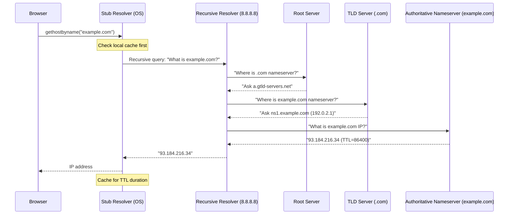
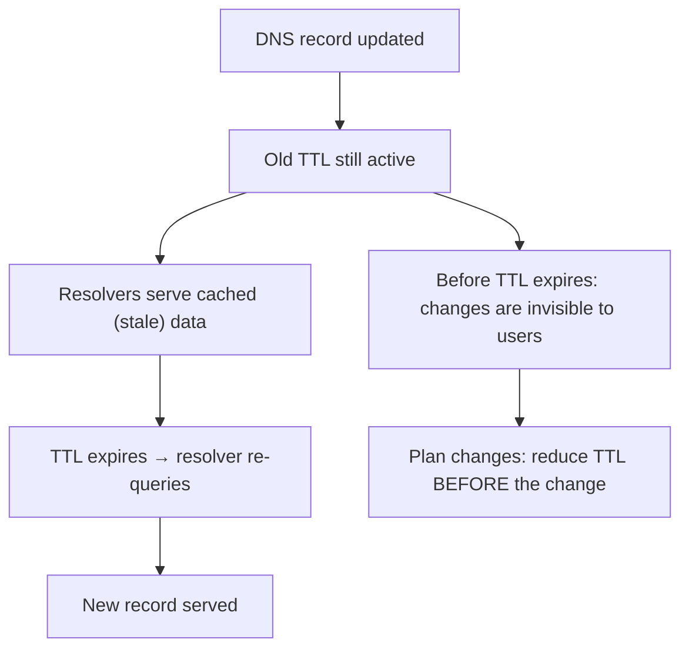

# DNS Deep Dive

> [!summary] Goal
> Master the Domain Name System — resolution process, record types, caching, troubleshooting, and security. Understand how DNS translates domain names to IP addresses, from your browser to the root servers.

## Table of Contents

1. [DNS Resolution Flow](#dns-resolution-flow)
2. [Record Types](#record-types)
3. [Caching and TTL](#caching-and-ttl)
4. [DNS Protocol](#dns-protocol)
5. [DNSSEC](#dnssec)
6. [DNS over HTTPS/TLS](#dns-over-https-tls)
7. [Verification Commands](#verification-commands)
8. [Pitfalls](#pitfalls)

---

## DNS Resolution Flow

> [!info] DNS resolution
> When your browser resolves `example.com`, it queries several DNS servers in sequence. Your OS has a **stub resolver** that sends queries to a **recursive resolver** (typically your ISP's or 8.8.8.8). The recursive resolver traverses the DNS hierarchy: **root servers → TLD servers → authoritative nameserver** for the domain.



### Resolution types

| Type | Who handles | Example |
|------|-------------|---------|
| **Recursive** | Your DNS server (ISP, Google, Cloudflare) does the full lookup | `dig google.com` |
| **Iterative** | You follow referrals yourself | `dig +trace google.com` |
| **Reverse** | IP → domain name (PTR record) | `dig -x 8.8.8.8` |

---

## Record Types

> [!info] DNS record types
| Record | Purpose | Example |
|:------:|---------|---------|
| **A** | IPv4 address of a hostname | `example.com → 93.184.216.34` |
| **AAAA** | IPv6 address of a hostname | `example.com → 2606:2800:220:1:248:1893:25c8:1946` |
| **CNAME** | Alias of one name to another (canonical name) | `www.example.com → example.com` |
| **MX** | Mail exchange server for a domain | `example.com → mail.example.com (priority 10)` |
| **TXT** | Arbitrary text (SPF, DKIM, DMARC, verification) | `v=spf1 include:_spf.google.com ~all` |
| **NS** | Authoritative nameserver for a domain | `example.com → ns1.example.com` |
| **SOA** | Start of Authority — zone metadata | Primary NS, admin email, serial, refresh, retry, expire, TTL |
| **PTR** | Reverse DNS — IP to hostname | `34.216.184.93.in-addr.arpa → example.com` |
| **SRV** | Service location (host + port for a service) | `_sip._tcp.example.com → server 5060` |
| **CAA** | Certificate Authority Authorization | `letsencrypt.org` |
| **DS** | DNSSEC delegation signer | Hash of DNSKEY |

```bash
# Query specific record types
dig google.com A                  # A record (default)
dig google.com AAAA               # IPv6 record
dig google.com MX                 # Mail exchange
dig google.com NS                 # Nameservers
dig google.com TXT                # Text records (SPF, DKIM)
dig -x 8.8.8.8                   # Reverse DNS (PTR)
dig google.com SOA               # Start of Authority
dig google.com ANY               # All records (most servers block this)
```

### CNAME vs A/AAAA

```text
CNAME rules:
  - A CNAME can't coexist with other records for the same name
  - A CNAME can point to another CNAME (but don't chain them)
  - The root domain (example.com) cannot have a CNAME
  - Use CNAME for subdomains that should follow the root

Root domain → use A/AAAA record
www subdomain → use CNAME to root (or A record)
api subdomain → use A record (different server)
```

### Common TXT records

```bash
# SPF — who can send email for this domain
dig google.com TXT | grep spf
"v=spf1 include:_spf.google.com ~all"

# DKIM — email signing verification key
dig default._domainkey.google.com TXT
"v=DKIM1; k=rsa; p=MIGfMA0GCSqGSIb3DQEBAQUAA4GNADCBiQKBgQ..."

# DMARC — what to do with unauthenticated email
dig _dmarc.google.com TXT
"v=DMARC1; p=reject; rua=mailto:dmarc-reports@google.com"

# Domain verification (Google, AWS, etc.)
dig "ridkistbjqkifmhn.example.com" TXT
"google-site-verification=..."
```

---

## Caching and TTL

> [!info] TTL (Time To Live)
> TTL is the number of seconds a DNS response should be cached by resolvers and clients. Low TTLs (e.g., 30-300s) are used for failover (fast propagation of IP changes). High TTLs (e.g., 86400 = 1 day) reduce query load and speed up resolution. Changes only propagate after the old TTL expires.



```bash
# Check TTL of a record
dig google.com | grep "ANSWER SECTION" -A5
# ;; ANSWER SECTION:
# google.com.    300     IN      A       142.250.185.78
#                                ↑ TTL = 300 seconds (5 minutes)

# Check SOA minimum TTL (negative caching)
dig google.com SOA
# Minimum TTL determines how long NXDOMAIN is cached
```

---

## DNS Protocol

> [!info] DNS protocol
> DNS typically uses UDP port 53 for queries. If the response exceeds 512 bytes (or EDNS0 limit), it falls back to TCP. The DNS header is 12 bytes, followed by Question, Answer, Authority, and Additional sections.

```text
DNS header (12 bytes):
  ID (16 bits): Matches query to response
  QR (1 bit): 0=query, 1=response
  Opcode (4 bits): 0=standard, 1=inverse, 2=status
  AA (1 bit): Authoritative Answer
  TC (1 bit): TrunCated (response too large for UDP)
  RD (1 bit): Recursion Desired
  RA (1 bit): Recursion Available
  Rcode (4 bits): 0=NOERROR, 1=FORMERR, 2=SERVFAIL, 3=NXDOMAIN, 4=NOTIMP, 5=REFUSED
  QDCOUNT: Number of questions
  ANCOUNT: Number of answers
  NSCOUNT: Number of authority records
  ARCOUNT: Number of additional records
```

---

## DNSSEC

> [!info] DNSSEC (DNS Security Extensions)
> DNSSEC cryptographically signs DNS records so that resolvers can verify their authenticity. It prevents DNS spoofing/cache poisoning. The zone signs its records with a private key, and resolvers verify with a public key published in DNS. The chain of trust starts at the root zone (root signing ceremony).

```bash
# Check if a domain is DNSSEC-signed
dig google.com DNSKEY                     # Zone's public key
dig google.com DS                         # Delegation Signer (in parent zone)
dig +dnssec google.com                    # Request authenticated data
delv google.com                           # DNSSEC validation tool

# Verify DNSSEC chain
dig +trace +dnssec google.com            # Trace with DNSSEC records

# Common DNSSEC flags in response:
# ad (Authenticated Data): resolver verified the signature
# Flag: ..ad..  →  response is authenticated
```

---

## DNS over HTTPS/TLS

| Protocol | Port | Description |
|:--------:|:----:|-------------|
| **DoH** (DNS over HTTPS) | 443 | DNS queries over HTTPS (like regular API calls). Hard to block (looks like normal HTTPS) |
| **DoT** (DNS over TLS) | 853 | DNS queries over TLS (dedicated port). Easy to block (port 853 is visible) |

```bash
# DoH: query using HTTPS (curl)
curl -H "accept: application/dns-json" "https://cloudflare-dns.com/dns-query?name=google.com&type=A"

# Using systemd-resolved with DoT
sudo resolvectl dns ens3 1.1.1.1
sudo resolvectl dnsovertls ens3 yes
resolvectl status

# Check current DNS server
resolvectl dns
```

---

## Verification Commands

### Linux

```bash
# Basic queries
dig google.com                    # Standard query
dig +short google.com             # Short output (just the IP)
dig google.com @8.8.8.8           # Use specific resolver
dig google.com MX                 # Query specific record type
dig -x 8.8.8.8                    # Reverse DNS lookup

# Trace the full resolution path
dig +trace google.com             # Show each step: root → TLD → authoritative
dig +trace +dnssec google.com     # Trace with DNSSEC

# Debugging
dig google.com +cmd               # Show command details
dig google.com +stats             # Show query statistics
dig google.com +answer            # Only show answer section
dig +notcp google.com             # Force UDP (fallback to TCP disabled)

# Alternative tools
host google.com                   # Simple lookup
host -a google.com                # Any record type
nslookup google.com               # Interactive lookup
nslookup -type=MX google.com

# Check local resolver
resolvectl status                 # systemd-resolved status
cat /etc/resolv.conf              # Local resolver configuration
systemd-resolve --status          # Resolver statistics

# Monitor DNS traffic
tcpdump -i any port 53           # Capture all DNS traffic
tcpdump -i any 'udp port 53'     # DNS over UDP only

# Performance testing
dnsping 8.8.8.8                   # Ping a DNS server (install dnsping)
dnsperf testfile.txt              # DNS server performance test
```

### Windows

```powershell
nslookup google.com
nslookup -type=MX google.com 8.8.8.8

Resolve-DnsName google.com
Resolve-DnsName google.com -Type MX
Resolve-DnsName google.com -Server 8.8.8.8

# Clear DNS cache
ipconfig /flushdns
```

---

## Pitfalls

### Propagating DNS changes takes time

You update an A record and wonder why it's not working. **TTL determines propagation time.** If the old record had an 86400 TTL (24 hours), resolvers worldwide may serve the old IP for up to 24 hours. Before making a change, reduce TTL to 60-300 seconds. Wait for the old TTL to expire. Make the change. Then increase TTL back.

### CNAME at the root

CNAME records cannot coexist with other records at the same name, and the root domain (example.com) cannot have a CNAME. If you try to point example.com to another domain, DNS breaks. Use a CNAME only for subdomains (www.example.com). For the root, use A/AAAA with an ALIAS/ANAME record if your DNS provider supports it.

### NXDOMAIN vs SERVFAIL vs REFUSED

```bash
dig nonexistent.example.com       # NXDOMAIN — domain doesn't exist (no such domain)
dig example.com AAAA             # NOERROR with empty answer — record type doesn't exist
dig @rogue-server example.com    # SERVFAIL — upstream failure (timeout, misconfiguration)
dig @blocked-server example.com  # REFUSED — policy rejection (rate limiting, filtering)
```

### DNS traffic amplification attacks

DNS is frequently used for DDoS amplification because a small query (60 bytes) can produce a large response (up to 4000 bytes with DNSSEC). Mitigate: (a) rate-limit per source IP, (b) disable recursion for external queries, (c) configure Response Rate Limiting (RRL) in your DNS server.

---

> [!question]- Interview Questions
>
> **Q: What happens when you type a URL into a browser and press Enter?**
> A: The browser checks its cache. OS checks the DNS cache (/etc/hosts, systemd-resolved). If not found, a recursive query is sent to the configured DNS server. The recursive resolver queries root → TLD → authoritative nameserver. The IP is returned, cached, and the browser initiates a TCP connection and TLS handshake.
>
> **Q: What's the difference between A record and CNAME?**
> A: An A record maps a hostname directly to an IP address. A CNAME maps a hostname to another hostname (an alias). A records are final; CNAMEs require an additional A record lookup. CNAMEs cannot exist with other records at the same name or at the zone root.
>
> **Q: What does `dig +trace` do?**
> A: It performs an iterative resolution by starting at the root servers, following referrals to TLD servers, then to the authoritative nameserver. Each step shows the query and response. This is the best way to debug resolution issues because it shows exactly where the chain breaks.
>
> **Q: How does DNS caching work?**
> A: Each response includes a TTL (seconds to cache). Positive responses (an IP was found) are cached for their TTL. Negative responses (NXDOMAIN) are cached for the SOA minimum TTL. The browser, OS, intermediate resolvers, and the recursive resolver all cache independently — that's 4+ layers of caching.
>
> **Q: What is DNSSEC and why is it important?**
> A: DNSSEC cryptographically signs DNS records to prevent DNS spoofing/cache poisoning. The resolver verifies the signature using a chain of trust from the root zone. Without DNSSEC, an attacker can forge DNS responses and redirect traffic (e.g., send users to a fake banking site).

---

## Cross-Links

- [[Networking/01_Foundations/02_IP_Addressing_and_Subnetting]] for IP addresses returned by DNS
- [[Networking/01_Foundations/03_ARP_ICMP_and_DHCP]] for DHCP setting DNS servers
- [[Networking/02_Core/03_TLS_and_Certificates]] for HTTPS and certificate validation
- [[Networking/04_Playbooks/01_Debug_DNS_Issues]] for DNS troubleshooting playbook
- [[Networking/03_Advanced/04_Network_Security]] for DNS security (spoofing, tunneling)
