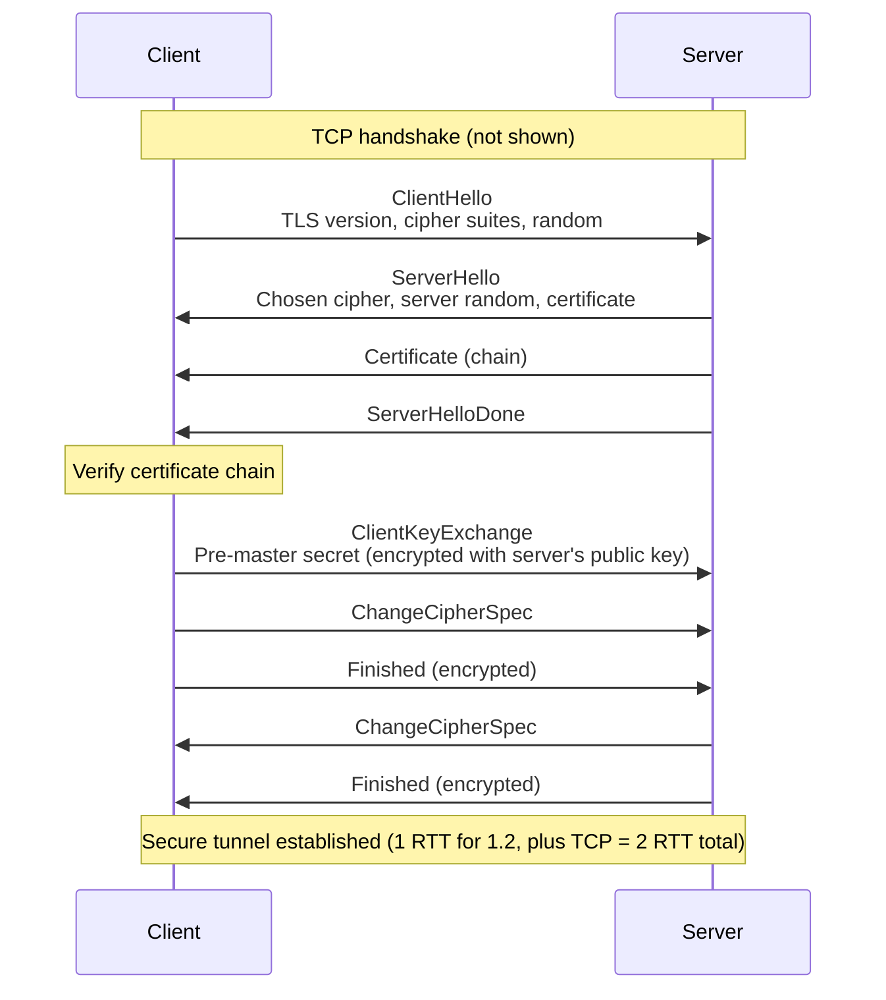
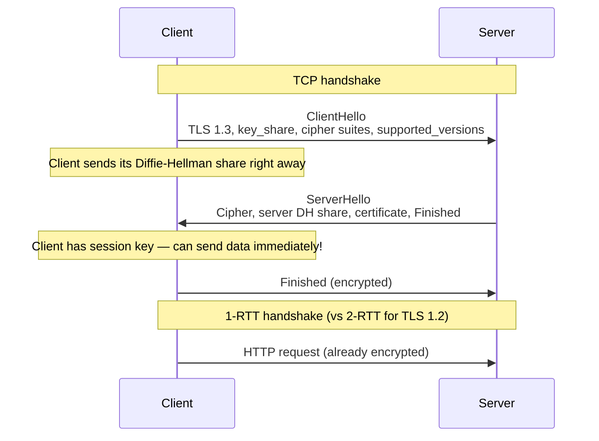

# TLS/SSL and Certificates

> [!summary] Goal
> Understand TLS — the protocol that secures HTTPS. Master the handshake (1.2 vs 1.3), certificate chains, cipher suites, and how to debug TLS issues with OpenSSL.

## Table of Contents

1. [TLS Handshake (1.2 vs 1.3)](#tls-handshake)
2. [Certificate Chain](#certificate-chain)
3. [Cipher Suites](#cipher-suites)
4. [Certificate Validation](#certificate-validation)
5. [mTLS (Mutual TLS)](#mtls)
6. [Verification Commands](#verification-commands)
7. [Pitfalls](#pitfalls)

---

## TLS Handshake (1.2 vs 1.3)

> [!info] TLS handshake
> The TLS handshake establishes an encrypted session between client and server. It authenticates the server (and optionally the client), negotiates encryption algorithms, and exchanges session keys. TLS 1.3 reduced the handshake from 2 round trips to 1, and removed weaker cipher suites.

### TLS 1.2 handshake (2 RTT)



### TLS 1.3 handshake (1 RTT)



### 0-RTT (TLS 1.3 session resumption)

```text
After the first connection, the server provides a pre-shared key (PSK) in the
session ticket. On subsequent connections, the client sends 0-RTT data
(HTTP requests) WITH the ClientHello — no waiting for the server.

0-RTT data has a security caveat: it's subject to replay attacks.
Servers must implement replay protection (single-use tickets, timestamp checks).
```

---

## Certificate Chain

> [!info] Certificate chain
> A TLS certificate proves the server's identity. It's signed by a **Certificate Authority (CA)**. The chain goes: **End-entity (leaf) certificate** → **Intermediate CA(s)** → **Root CA** (self-signed, trusted by the OS/browser). The browser trusts the root CA, which vouches for the intermediate, which vouches for the leaf.

```text
Certificate chain (example.com):
  Root CA (built into browser/OS):
    └─ Trusted, self-signed (e.g., DigiCert Global Root CA)
       └─ Intermediate CA (signed by root):
          └─ e.g., DigiCert TLS RSA SHA256 2020 CA1
             └─ Leaf/Server Certificate (signed by intermediate):
                └─ CN = example.com, SAN = example.com, *.example.com
                └─ Public key: RSA 2048-bit / ECDSA P-256
                └─ Valid: 2026-01-01 to 2026-12-31
                └─ Signed by intermediate CA
```

```bash
# View the certificate chain
openssl s_client -connect example.com:443 -showcerts
# Shows all certificates in the chain

# Download each certificate in the chain
openssl s_client -connect example.com:443 -showcerts </dev/null 2>/dev/null \
  | sed -n '/-----BEGIN CERTIFICATE-----/,/-----END CERTIFICATE-----/p'
```

### Self-signed vs CA-signed

| Aspect | Self-signed | CA-signed |
|--------|:-----------:|:---------:|
| **Cost** | Free | Free (Let's Encrypt) to expensive (EV) |
| **Trust** | No automatic trust | Trusted by all browsers/OS |
| **Use case** | Internal testing, development | Production public websites |
| **Browser warning** | "Your connection is not secure" | None (green lock) |
| **Validation** | None | Domain (DV), Organization (OV), or Extended (EV) |

---

## Cipher Suites

> [!info] Cipher suite
> A cipher suite defines the algorithms used for: **key exchange** (how to share the session key), **authentication** (verifying identity), **encryption** (protecting data), and **MAC** (detecting tampering). More bits ≠ more security — algorithm choice matters more.

```text
TLS 1.2 cipher suite example:
  TLS_ECDHE_RSA_WITH_AES_128_GCM_SHA256
  │    │     │         │       │
  │    │     │         │       └── MAC/hash: SHA-256 (HMAC)
  │    │     │         └────────── Encryption: AES-128-GCM (authenticated encryption)
  │    │     └──────────────────── Authentication: RSA certificate
  │    └────────────────────────── Key Exchange: ECDHE (Ephemeral Diffie-Hellman)
  └─────────────────────────────── Protocol: TLS

TLS 1.3 simplified suites (no key exchange/auth in suite name):
  TLS_AES_128_GCM_SHA256
  TLS_AES_256_GCM_SHA384
  TLS_CHACHA20_POLY1305_SHA256
```

### Cipher suite components

| Component | Options (1.2) | Options (1.3) |
|-----------|:--------------:|:--------------:|
| **Key exchange** | RSA, DH, ECDHE, DHE | ECDHE only (forward secrecy) |
| **Authentication** | RSA, ECDSA, DSS | RSA, ECDSA |
| **Encryption** | AES-CBC, AES-GCM, ChaCha20, 3DES | AES-GCM, ChaCha20-Poly1305 |
| **MAC** | SHA-1, SHA-256, SHA-384 | AEAD (built into GCM/ChaCha20) |

> [!info] Forward secrecy
> With ECDHE key exchange, the session key is ephemeral — even if the server's private key is compromised later, past sessions cannot be decrypted (`ephemeral` = temporary). RSA key exchange (used in some TLS 1.2 suites) does NOT provide forward secrecy — if the private key leaks, all recorded past sessions can be decrypted.

---

## Certificate Validation

The browser checks these when validating a certificate:

| Check | What it verifies |
|-------|------------------|
| **Chain of trust** | Certificate is signed by a trusted CA (directly or via intermediates) |
| **Hostname** | The `SAN` (Subject Alternative Name) or `CN` matches the hostname in the URL |
| **Expiry** | Certificate is within its validity period |
| **Revocation** | Hasn't been revoked (via CRL or OCSP) |
| **Key usage** | Certificate is permitted for server authentication |
| **Signature** | Cryptographic signature is valid |

```bash
# Manual certificate validation
openssl s_client -connect example.com:443 -verify_return_error -verify 5
# Returns 0 if chain verifies, non-zero if verification fails

# Check expiration
echo | openssl s_client -connect example.com:443 2>/dev/null \
  | openssl x509 -noout -dates

# Check SAN (Subject Alternative Name)
echo | openssl s_client -connect example.com:443 2>/dev/null \
  | openssl x509 -noout -ext subjectAltName

# Check entire certificate details
echo | openssl s_client -connect example.com:443 2>/dev/null \
  | openssl x509 -noout -text | head -30
```

### OCSP stapling

```text
OCSP (Online Certificate Status Protocol) checks if a certificate has been revoked.
Without OCSP stapling: browser contacts the CA directly (slow, privacy issue).
With OCSP stapling: the server fetches the OCSP response from the CA and
"staples" it to the TLS handshake. The browser checks the stapled response.

Supported by: Nginx, Apache, HAProxy.
Enable: `ssl_stapling on;` in Nginx.
```

---

## mTLS (Mutual TLS)

> [!info] mTLS
> In normal TLS, only the server presents a certificate. In mTLS (mutual TLS), **both** client and server present certificates. The server verifies the client's certificate, just as the client verifies the server's. Used for: zero-trust networking, API-to-API authentication, and service mesh (Istio, Linkerd).

```bash
# Server requires client certificate
openssl s_server -accept 443 -cert server.crt -key server.key \
  -CAfile ca.crt -Verify 1    # Ask for and verify client cert

# Client presents certificate
curl --cert client.crt --key client.key https://server.example.com
```

---

## Verification Commands

```bash
# Basic TLS inspection
openssl s_client -connect example.com:443          # Full TLS handshake details
openssl s_client -connect example.com:443 -tls1_2  # Force TLS 1.2
openssl s_client -connect example.com:443 -tls1_3  # Force TLS 1.3

# Certificate details
openssl s_client -connect example.com:443 | openssl x509 -text -noout
openssl s_client -connect example.com:443 | openssl x509 -subject -issuer -dates -noout
openssl s_client -connect example.com:443 | openssl x509 -ocsp_uri    # Get OCSP URL

# Check supported cipher suites
nmap --script ssl-enum-ciphers -p 443 example.com
sslscan example.com:443                           # Detailed cipher scan
testssl.sh example.com                            # Comprehensive TLS testing
curl -v --ciphers 'ECDHE+AESGCM' https://example.com  # Test specific cipher

# Test TLS version support
openssl s_client -connect example.com:443 -tls1 2>/dev/null | grep "Protocol"   # TLS 1.0
openssl s_client -connect example.com:443 -tls1_1 2>/dev/null | grep "Protocol" # TLS 1.1
openssl s_client -connect example.com:443 -tls1_2 2>/dev/null | grep "Protocol" # TLS 1.2
openssl s_client -connect example.com:443 -tls1_3 2>/dev/null | grep "Protocol" # TLS 1.3

# Generate a self-signed certificate (for testing)
openssl req -x509 -newkey rsa:2048 -keyout key.pem -out cert.pem -days 365 -nodes \
  -subj "/CN=localhost"

# Check certificate revocation
openssl ocsp -issuer intermediate.pem -cert server.pem -url http://ocsp.example.com
```

---

## Pitfalls

### Certificate expiry is the most common TLS error

Certificates expire (typically 1 year for paid, 90 days for Let's Encrypt). After expiry, all clients get TLS errors. Set up automatic renewal (certbot for Let's Encrypt) and monitor expiry dates with alerts (e.g., `ssl-expiry-check` in monitoring).

### Wrong certificate for the hostname

If your certificate lists `www.example.com` but the client connects to `example.com`, the hostname check fails. The SAN (Subject Alternative Name) must include ALL hostnames that will use the certificate. Modern CAs require domain validation per SAN.

### Self-signed certificates in production

Self-signed certificates throw browser warnings and break API clients. For internal services, use a private CA (step-ca, cfssl) and distribute the root CA to your clients. For public services, use Let's Encrypt (free, automated).

### Weak cipher suites (TLS 1.0, 1.1, RC4, 3DES, CBC)

PCI DSS, HIPAA, and most security standards require disabling TLS 1.0/1.1. Disable RC4, 3DES, and CBC-mode ciphers. Use TLS 1.2+ with AEAD ciphers (AES-GCM, ChaCha20-Poly1305). Test with `testssl.sh` to verify your configuration.

---

> [!question]- Interview Questions
>
> **Q: How does TLS 1.3 differ from TLS 1.2?**
> A: TLS 1.3 reduces the handshake from 2 RTT to 1 RTT (2 → 1 round trips). It removes weak cipher suites (RC4, 3DES, CBC-mode) and RSA key exchange (no forward secrecy). It adds 0-RTT session resumption. The handshake encrypts more of the negotiation (ServerHello onward vs Certificate onward).
>
> **Q: What is a certificate chain?**
> A: The chain links the server's certificate through intermediate CA(s) to a root CA trusted by the OS/browser. The browser trusts the root (pre-installed), which signed the intermediate, which signed the server certificate. Broken chains (missing intermediate) cause TLS errors.
>
> **Q: What is forward secrecy?**
> A: Forward secrecy means if the server's private key is compromised, past sessions cannot be decrypted. It's achieved by using ephemeral Diffie-Hellman (ECDHE) key exchange — a temporary key per session. RSA key exchange does NOT provide forward secrecy (the session key is encrypted with the server's RSA key).
>
> **Q: How does OCSP stapling work?**
> A: Instead of the client contacting the CA to check certificate revocation, the server periodically fetches an OCSP response from the CA and sends it to clients during the TLS handshake. This is faster, more private (the CA doesn't learn which sites you visit), and more reliable.
>
> **Q: What's the difference between DV, OV, and EV certificates?**
> A: DV (Domain Validation): only proves you control the domain. OV (Organization Validation): verifies your organization exists and controls the domain. EV (Extended Validation): stricter verification, displays organization name in the browser bar. All provide the same level of encryption — the difference is how much identity verification is done.

---

## Cross-Links

- [[Networking/01_Foundations/04_TCP_Deep_Dive]] for TCP transport of TLS
- [[Networking/02_Core/02_HTTP_1_1_HTTP_2_HTTP_3]] for HTTPS over TLS
- [[Networking/04_Playbooks/02_Debug_TLS_Handshake_Failures]] for TLS troubleshooting
- [[Networking/01_Foundations/05_UDP_and_QUIC]] for QUIC/TLS 1.3 integration
- [[Networking/03_Advanced/01_Routing_BGP_OSPF]] for BGP and network security
