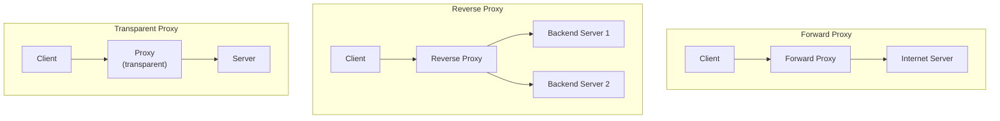
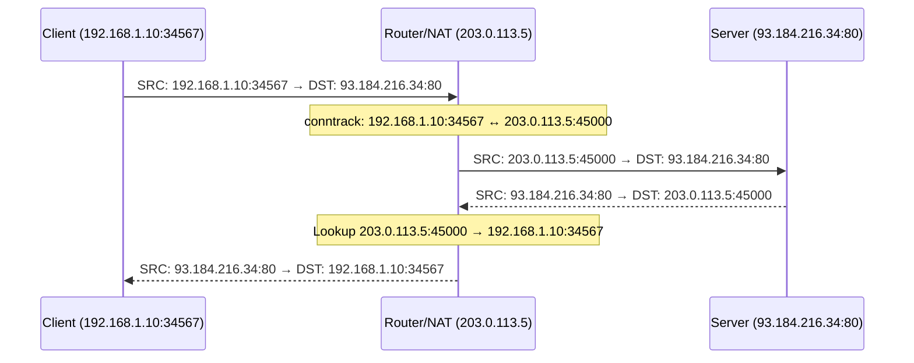
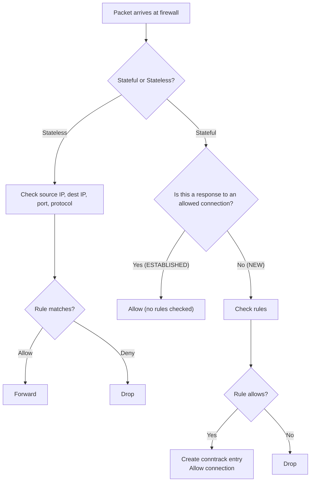

# Proxies, NAT, and Firewalls

> [!summary] Goal
> Understand forward/reverse proxies, Network Address Translation (NAT) types, and firewall concepts — stateless vs stateful, iptables/nftables, and application-layer filtering. Master the commands to configure and verify each.

## Table of Contents

1. [Proxy Types](#proxy-types)
2. [NAT (Network Address Translation)](#nat)
3. [Firewalls](#firewalls)
4. [iptables/nftables](#iptables-nftables)
5. [Verification Commands](#verification-commands)
6. [Pitfalls](#pitfalls)

---

## Proxy Types

> [!info] Proxy
> A proxy is an intermediary between a client and a server. It forwards requests and responses, and can add caching, filtering, logging, and authentication. The type of proxy determines who configures it and what it sees.



| Type | Configuration | Clients know? | Use case |
|------|:-------------:|:-------------:|----------|
| **Forward proxy** | Client-side (browser / app) | ✅ Yes | Content filtering, caching, anonymization |
| **Reverse proxy** | Server-side (DNS points to proxy) | ❌ No | Load balancing, TLS termination, caching |
| **Transparent proxy** | Network-level (no config needed) | ❌ No | Captive portals, content filtering (enterprise) |

### HTTP CONNECT tunneling

```text
For HTTPS, the forward proxy can't see the encrypted traffic.
The client sends an HTTP CONNECT request asking the proxy to create a tunnel:
  CONNECT example.com:443 HTTP/1.1

The proxy establishes a TCP connection to example.com:443 and then
blindly relays bytes between client and server. The proxy can't inspect
the encrypted HTTPS traffic — it just passes bytes through.
```

---

## NAT (Network Address Translation)

> [!info] NAT
> NAT rewrites IP addresses (and sometimes ports) as packets traverse a router. This allows multiple devices to share a single public IP. The router maintains a **connection tracking (conntrack)** table to map return traffic back to the correct internal device.

### NAT types

| Type | What it translates | Typical use |
|------|-------------------|-------------|
| **SNAT** (Source NAT) / **Masquerade** | Source IP:port | Private → Internet outbound |
| **DNAT** (Destination NAT) / **Port Forwarding** | Destination IP:port | Internet → internal server |
| **1:1 NAT** / **DMZ** | Entire IP address | Routed between networks |



### Linux NAT configuration

```bash
# Enable IP forwarding
sysctl -w net.ipv4.ip_forward=1

# SNAT / Masquerade (outbound)
iptables -t nat -A POSTROUTING -o eth0 -j MASQUERADE

# DNAT / Port forwarding (inbound)
iptables -t nat -A PREROUTING -i eth0 -p tcp --dport 80 \
  -j DNAT --to-destination 192.168.1.100:80

# Redirect (local traffic, transparent proxy)
iptables -t nat -A OUTPUT -p tcp --dport 80 -j REDIRECT --to-port 3128

# Check NAT rules
iptables -t nat -L -n -v
```

---

## Firewalls

> [!info] Firewall
> A firewall controls network traffic based on rules. It can be **stateless** (checks each packet independently) or **stateful** (tracks connection state). Stateful firewalls know the difference between a SYN from an external host (new connection attempt) and a SYN in reply to an outgoing connection (related).



| Aspect | Stateless firewall | Stateful firewall |
|--------|:-----------------:|:-----------------:|
| **Inspects** | Each packet independently | Packet + connection state |
| **Performance** | Faster (less work per packet) | Slightly slower (tracking overhead) |
| **Security** | Less (can't detect connection-level attacks) | More (understands connection context) |
| **Configuration** | Symmetric rules (allow inbound AND outbound) | Asymmetric rules (allow outbound + responses) |
| **Example** | iptables without conntrack, ACLs | iptables with conntrack, all modern firewalls |

### Default firewall policies

```text
Default policy: what happens to traffic that doesn't match a rule.

Deny by default (recommended):
  - Block all inbound traffic
  - Allow specific ports (80, 443, 22)
  - If a new service is deployed without a rule, it's blocked

Allow by default (risky):
  - Allow all traffic
  - Block specific bad IPs/ports
  - New services are exposed unless explicitly blocked
```

---

## iptables/nftables

> [!info] iptables/nftables
> iptables is the traditional Linux firewall (now legacy). nftables is the modern replacement (Linux 3.13+, default in RHEL 9, Debian 11+). Both filter packets at multiple stages (PREROUTING, INPUT, FORWARD, OUTPUT, POSTROUTING) across different tables (filter, nat, mangle).

### iptables basic rules

```bash
# Allow existing connections (stateful)
iptables -A INPUT -m conntrack --ctstate ESTABLISHED,RELATED -j ACCEPT

# Allow SSH
iptables -A INPUT -p tcp --dport 22 -j ACCEPT

# Allow HTTP/HTTPS
iptables -A INPUT -p tcp -m multiport --dports 80,443 -j ACCEPT

# Allow loopback
iptables -A INPUT -i lo -j ACCEPT

# Default: deny inbound
iptables -P INPUT DROP

# Save rules
iptables-save > /etc/iptables/rules.v4
```

### Connection tracking (conntrack)

```bash
# View connection tracking table
conntrack -L                         # All tracked connections
conntrack -L -p tcp                  # Only TCP
conntrack -L --state ESTABLISHED     # Only established
conntrack -E                         # Monitor new connections in real-time

# Connection count
conntrack -C                         # Total tracked connections

# Tune max tracked connections
sysctl net.netfilter.nf_conntrack_max  # Default: 262144
sysctl net.netfilter.nf_conntrack_tcp_timeout_established  # Default: 432000 (5 days)
```

### nftables equivalent

```bash
# nftables firewall rules
nft add table inet filter
nft add chain inet filter input { type filter hook input priority 0\; policy drop\; }
nft add rule inet filter input ct state established,related accept
nft add rule inet filter input tcp dport 22 accept
nft add rule inet filter input tcp dport {80,443} accept
nft add rule inet filter input iif lo accept

# Show nftables ruleset
nft list ruleset
```

---

## Verification Commands

### Linux

```bash
# Firewall rules
iptables -L -n -v              # List rules with counters
iptables -t nat -L -n -v       # NAT rules
iptables -S                    # Rules in command form
nft list ruleset               # nftables rules

# Connection tracking
conntrack -L                   # Current NAT/CT table
conntrack -L | wc -l           # Number of tracked connections
cat /proc/net/nf_conntrack     # Raw connection tracking table

# IP forwarding
cat /proc/sys/net/ipv4/ip_forward  # 1 = forwarding enabled

# NAT test
tcpdump -i eth0 host 192.168.1.100  # See if traffic is being NATed

# Port forwarding test
curl -v http://localhost:8080   # If DNAT from 80 → 8080 is configured

# Proxy test
curl -x http://proxy:3128 -v https://example.com  # Test forward proxy
curl http://localhost -H "Host: example.com"       # Test reverse proxy

# Check if port is reachable
nc -zv server 80               # Test TCP connectivity
```

### Windows

```powershell
netsh advfirewall show allprofiles    # Firewall status
netsh advfirewall firewall show rule name=all  # All rules
Get-NetFirewallRule | Format-Table    # PowerShell firewall rules
Get-NetNat                           # NAT configuration
```

---

## Pitfalls

### Forgetting conntrack for stateful firewalls

A stateful firewall rule that allows `ESTABLISHED,RELATED` without `NEW` blocks all new inbound connections unless you explicitly allow them. But it also means you don't need to open high ports for return traffic — the firewall automatically tracks them. Always include the ESTABLISHED,RELATED rule first.

### NAT hairpin / NAT loopback

A client on the internal network tries to reach the server's public IP (which is NAT'd to the same internal server). The router sees the traffic going out and coming back — but the source is internal, so the response may not be recognized. Solution: some routers support "hairpin NAT" to handle this. Alternative: use internal DNS to return the private IP for internal clients.

### Too many conntrack entries

High-traffic servers can exhaust the connection tracking table. New connections are dropped when the table is full. Symptoms: intermittent connectivity failures on high-traffic ports. Fix: increase `nf_conntrack_max`, tune timeouts (especially `tcp_timeout_established`), or use stateless rules where conntrack isn't needed.

### Accidental firewall lockout

When configuring a remote firewall, an incorrect rule can lock you out. Always: (a) keep an active out-of-band session (iDRAC, IPMI, serial console), (b) test rules with a simple script that reverts after 60 seconds, (c) never flush rules while SSH'd in without a revert mechanism.

---

> [!question]- Interview Questions
>
> **Q: What's the difference between a forward proxy and a reverse proxy?**
> A: A forward proxy sits in front of clients and makes requests on their behalf (configured on the client side). A reverse proxy sits in front of servers and distributes incoming requests to them (configured on the server side). Forward proxies can anonymize clients; reverse proxies can load-balance servers.
>
> **Q: How does NAT work?**
> A: When a device on a private network sends traffic to the Internet, the NAT router rewrites the source IP address to its own public IP. It also rewrites the source port (PAT/NAT overload) to track which internal device sent the packet. Return traffic is matched against the connection tracking table and rewritten back to the private IP.
>
> **Q: What is the difference between stateless and stateful firewalls?**
> A: A stateless firewall inspects each packet independently without knowledge of the connection state. A stateful firewall tracks connection state (NEW, ESTABLISHED, RELATED, INVALID) and can distinguish between a legitimate response and an unsolicited inbound request.
>
> **Q: What is connection tracking (conntrack)?**
> A: Conntrack maintains a table of all active network connections through the Linux kernel. Each entry records: protocol, source IP/port, destination IP/port, and connection state. It allows stateful firewalling (allow ESTABLISHED/RELATED traffic) and is essential for NAT (mapping return traffic to the correct internal host).
>
> **Q: What is hairpin NAT?**
> A: When an internal client tries to reach a server on the same network via the server's public IP. The router must "hairpin" the traffic: apply DNAT to the request, SNAT to the response, and route it back inside. Many consumer routers don't support this. Fix: configure internal DNS to return the private IP.

---

## Cross-Links

- [[Networking/01_Foundations/02_IP_Addressing_and_Subnetting]] for NAT and IP forwarding
- [[Networking/01_Foundations/04_TCP_Deep_Dive]] for TCP connection tracking
- [[Networking/02_Core/05_Load_Balancing_and_Service_Discovery]] for reverse proxy and LB
- [[Networking/03_Advanced/04_Network_Security]] for advanced firewall concepts
- [[Networking/03_Advanced/03_Netns_and_Container_Networking]] for network namespaces
