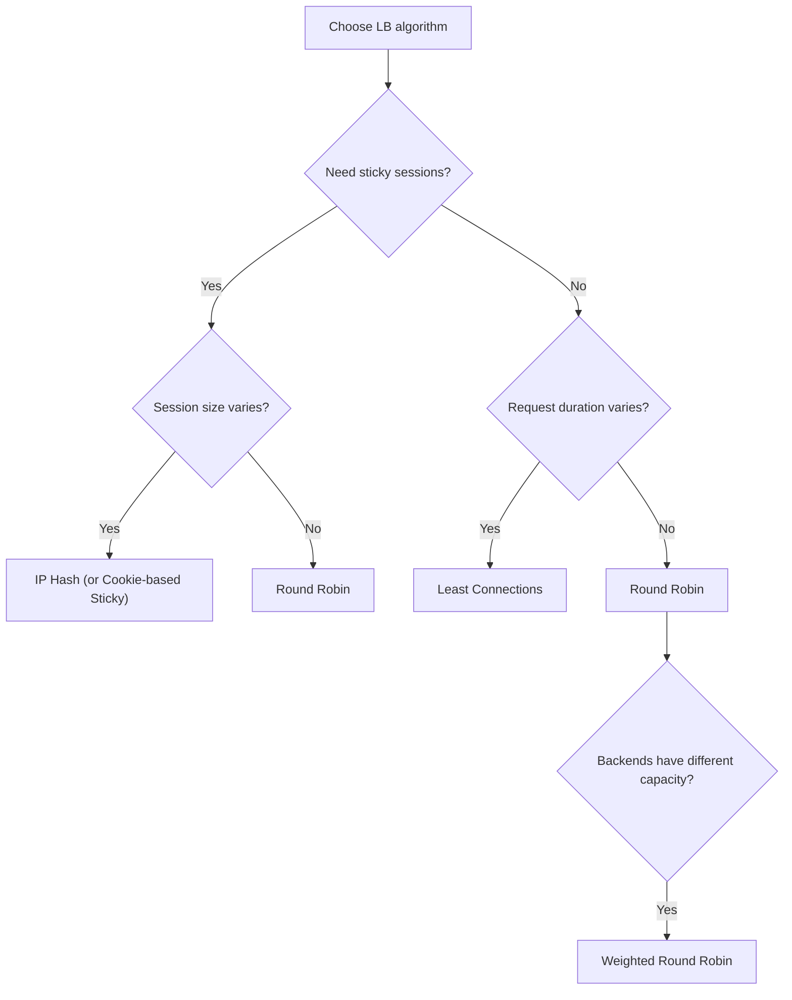
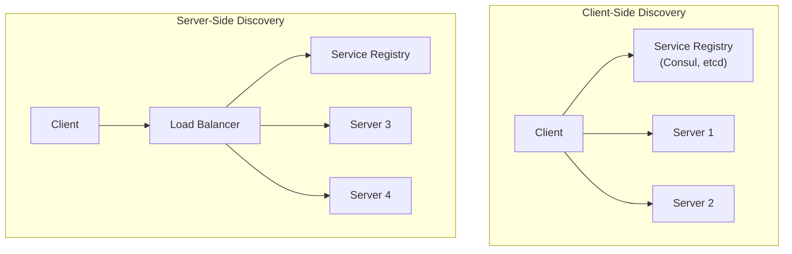

# Load Balancing and Service Discovery

> [!summary] Goal
> Understand load balancing algorithms (L4 vs L7), health checks, session persistence, and service discovery methods. Master HAProxy and Nginx configuration, and verify with real commands.

## Table of Contents

1. [L4 vs L7 Load Balancing](#l4-vs-l7-load-balancing)
2. [Load Balancing Algorithms](#load-balancing-algorithms)
3. [Health Checks](#health-checks)
4. [Session Persistence](#session-persistence)
5. [Service Discovery](#service-discovery)
6. [Verification Commands](#verification-commands)
7. [Pitfalls](#pitfalls)

---

## L4 vs L7 Load Balancing

> [!info] Load balancer
> A load balancer distributes incoming network traffic across multiple backend servers. It improves availability, scalability, and fault tolerance. **L4** operates at the transport layer (TCP/UDP). **L7** operates at the application layer (HTTP, gRPC).

```mermaid
flowchart LR
    C["Client"] --> LB["Load Balancer"]
    LB --> S1["Server 1"]
    LB --> S2["Server 2"]
    LB --> S3["Server 3"]
    S1 -->|"Health check"| LB
    S2 -->|"Health check"| LB
    S3 -->|"Health check"| LB
    note for LB "Distributes traffic based on algorithm"
```

| Aspect | L4 (Transport) | L7 (Application) |
|--------|:--------------:|:----------------:|
| **Decision layer** | TCP/UDP (IP + port) | HTTP (URL, headers, cookies) |
| **Performance** | Faster (less parsing) | Slightly slower (full packet inspection) |
| **TLS termination** | ❌ (pass-through) | ✅ (can decrypt) |
| **Content routing** | ❌ (all backends receive all traffic) | ✅ (route /api/* to one pool, /web/* to another) |
| **Sticky sessions** | Source IP hash | Cookie-based |
| **Examples** | HAProxy (TCP mode), AWS NLB | HAProxy (HTTP mode), Nginx, AWS ALB |
| **gRPC support** | ✅ (generic TCP) | ✅ (HTTP/2 awareness) |

---

## Load Balancing Algorithms



| Algorithm | Description | Best for | Sticky? |
|-----------|-------------|----------|:-------:|
| **Round Robin** | Sends to each server in turn | Equal-capacity servers, simple use | No |
| **Least Connections** | Sends to server with fewest active connections | Variable-length requests (mixed slow/fast) | No |
| **IP Hash** | Hash of client IP → same server always | Sticky sessions without cookies | Yes |
| **Weighted Round Robin** | Servers receive traffic proportional to weight | Heterogeneous capacity (different CPU/RAM) | No |
| **Least Time** | Sends to server with fastest recent response | Performance-sensitive | No |
| **Random** | Picks a server at random | Very large pools (simple) | No |

### Consistent hashing for caching

```text
For cache clusters (Redis, Memcached), use consistent hashing.
When a server is added or removed, only 1/n keys are remapped.
This prevents a cache stampede on every scaling event.

Nginx: hash $request_uri consistent;
HAProxy: balance uri
```

---

## Health Checks

> [!info] Health check
> Health checks verify that a backend server is ready to receive traffic. A server that fails health checks is removed from the load balancer's rotation. Both active (LB probes) and passive (LB observes real traffic errors) checks are used.

### Health check types

| Check | What it does | Reliability | 
|-------|:------------:|:-----------:|
| **TCP** | Opens TCP connection to port | Low (port may be open but app broken) |
| **HTTP** | Sends GET /health, expects 200 | High (checks specific path) |
| **gRPC** | Sends gRPC health check | High (application-level) |
| **Passive** | Observes N consecutive 5xx → remove | Medium (depends on real traffic) |

```bash
# Manual health checks
curl -I http://backend/health          # HTTP health check
nc -zv backend 80                       # TCP health check
openssl s_client -connect backend:443   # TLS health check
```

### HAProxy health check config

```haproxy
backend my-backends
    # HTTP health check every 2 seconds
    option httpchk GET /health
    http-check expect status 200
    server s1 10.0.0.1:8080 check inter 2s fall 3 rise 2
    server s2 10.0.0.2:8080 check inter 2s fall 3 rise 2
```

---

## Session Persistence (Sticky Sessions)

> [!info] Sticky session
> Some applications store session data in local memory. All requests from the same user must go to the same server. This is "sticky session" persistence. Modern apps should use a shared session store (Redis) to avoid this need — but sometimes it's unavoidable.

### Methods

| Method | How it works | Caveats |
|--------|-------------|---------|
| **Source IP hash** | Hash of client IP → same server | Problematic behind NAT (many users share one IP) |
| **Cookie insert** | LB inserts a cookie (e.g., `SERVERID=backend-2`) | Requires L7, cookie may be blocked |
| **URL/parameter** | Session ID in URL | Exposes session ID, ugly URLs |

```haproxy
# Cookie-based sticky session
backend my-backends
    cookie SRV insert indirect nocache
    server s1 10.0.0.1:8080 cookie s1 check
    server s2 10.0.0.2:8080 cookie s2 check
```

---

## Service Discovery

> [!info] Service discovery
> In dynamic environments (Kubernetes, auto-scaling groups, containers), server IP addresses change frequently. Service discovery tells the load balancer (or client) which servers are currently available.



| Method | How it works | Example |
|--------|-------------|---------|
| **DNS-based** | Multiple A records for one name, DNS round-robin | Standard DNS, round-robin DNS |
| **Consul/etcd** | Service registry with health checks | Consul Template, HAProxy + consul |
| **Kubernetes Service** | kube-proxy load-balances to healthy pods | K8s Services, EndpointSlices |
| **Server-side (LB)** | LB queries registry, updates backend list | HAProxy + consul, AWS ALB + target groups |

```bash
# DNS-based discovery (multiple A records)
dig example.com
# example.com. 300 IN A 10.0.0.1
# example.com. 300 IN A 10.0.0.2

# Consul DNS discovery
dig web.service.consul
```

---

## Verification Commands

```bash
# HAProxy
haproxy -c -f /etc/haproxy/haproxy.cfg   # Validate config
echo "show stat" | socat stdio /var/run/haproxy/admin.sock  # HAProxy stats
echo "show info" | socat stdio /var/run/haproxy/admin.sock  # HAProxy info

# Nginx
nginx -t                                  # Test config
nginx -s reload                           # Reload config

# Test load balancing
curl -I http://lb.example.com             # Load balancer response
for i in {1..5}; do curl -s http://lb.example.com | head -1; done  # See which backend responds

# Check multiple backends (source IP hash)
curl -H "X-Forwarded-For: 1.2.3.4" http://lb/  # Test with specific "client IP"

# Health check debugging
tcpdump -i any port 80                    # See health check probes
ss -t state established '( dport = :8080 )'  # Check LB to backend connections

# Service discovery
consul catalog services                   # Consul: list services
dig @localhost -p 8600 web.service.consul  # Consul DNS
kubectl get endpoints                      # Kubernetes endpoints
```

---

## Pitfalls

### Not configuring health check timeouts

Health check timeouts that are too short mark servers as down when they're just slow. Timeouts that are too long delay failover. Guidelines: interval 2-5s, timeout 1-2s, fall 2-3 (mark down after 2-3 failures), rise 2-3 (mark up after 2-3 successes).

### Sticky sessions are a scalability trap

Sticky sessions tie a user to a specific server. If that server crashes, the user's session is lost unless sessions are replicated. In a rolling deployment, sticky sessions prevent draining — you can't remove a server without breaking sessions. Solution: use a shared session store (Redis, database) to make all servers stateless.

### Slow start for new backends

A newly started server has cold caches. Sending full traffic immediately overwhelms it. HAProxy's `slowstart` gradually ramps up traffic over a configurable duration.

### LB is a single point of failure

A single load balancer instance can fail. Use DNS round-robin across multiple LBs (active-active) or use a floating IP with keepalived (active-passive). AWS NLB and ALB are managed services with built-in HA.

---

> [!question]- Interview Questions
>
> **Q: What is the difference between L4 and L7 load balancing?**
> A: L4 load balancing routes based on TCP/UDP information (IP, port). L7 load balancing routes based on HTTP content (URL path, headers, cookies). L4 is faster but can't do content-based routing. L7 is slower but supports TLS termination, cookie-based stickiness, and path-based routing.
>
> **Q: What load balancing algorithm would you choose for a service with variable request latency?**
> A: Least Connections. It sends requests to the backend with the fewest active connections. If some requests take 10ms and others take 10s, the fast server won't get overwhelmed waiting for the slow server's connections to drain.
>
> **Q: How does a health check work?**
> A: The load balancer periodically sends probes to each backend (every 2-5 seconds). A TCP check tries to open a TCP connection. An HTTP check sends a request to a specific URL (like /health) and expects a 200 status. After N consecutive failures, the backend is removed from rotation.
>
> **Q: What are the downsides of sticky sessions?**
> A: (1) If the server goes down, the session is lost. (2) Rolling deployments are harder — you can't drain a server without dropping sessions. (3) Uneven load — some servers may have more "sticky" users. (4) Can't horizontally scale easily. Prefer stateless services with a shared session store.
>
> **Q: How does DNS-based service discovery work?**
> A: A domain name resolves to multiple IP addresses (multiple A records). DNS returns them in a different order each time (round-robin). If a server fails, the client must retry with a different IP. TTL determines how quickly changes propagate. This is simple but lacks health-check awareness — client-side retries are essential.

---

## Cross-Links

- [[Networking/01_Foundations/04_TCP_Deep_Dive]] for TCP connection tracking
- [[Networking/02_Core/04_Proxies_NAT_and_Firewalls]] for reverse proxy concepts
- [[Networking/02_Core/06_CDN_Caching_and_Web_Performance]] for CDN (distributed LB)
- [[Networking/03_Advanced/03_Netns_and_Container_Networking]] for K8s service discovery
- [[Networking/04_Playbooks/03_Debug_HTTP_Timeouts_and_Retries]] for HTTP troubleshooting
