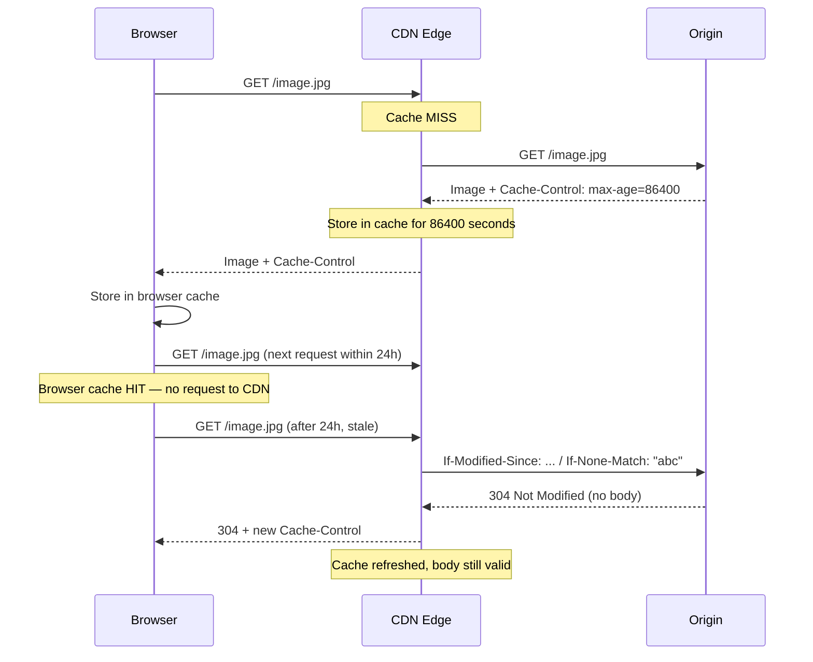

# CDN, Caching, and Web Performance

> [!summary] Goal
> Understand CDN architecture, HTTP caching headers, cache invalidation strategies, and web performance metrics. Learn how to optimize content delivery and measure performance with Lighthouse.

## Table of Contents

1. [CDN Architecture](#cdn-architecture)
2. [HTTP Caching](#http-caching)
3. [Cache Invalidation](#cache-invalidation)
4. [Web Performance Metrics](#web-performance-metrics)
5. [Verification Commands](#verification-commands)
6. [Pitfalls](#pitfalls)

---

## CDN Architecture

> [!info] CDN (Content Delivery Network)
> A CDN is a distributed network of servers (Points of Presence — PoPs) that cache content closer to end users. Instead of every user connecting to your origin server, they connect to a nearby edge server. This reduces latency, offloads origin traffic, and improves availability under load.

```mermaid
flowchart TD
    U[User in London] --> E1["CDN Edge: London PoP"]
    U2[User in Tokyo] --> E2["CDN Edge: Tokyo PoP"]
    U3[User in São Paulo] --> E3["CDN Edge: São Paulo PoP"]
    E1 --> O["Origin Server (us-east-1)"]
    E2 --> O
    E3 --> O
    note for E1 "Cache HIT: serves cached content"
    note for E2 "Cache MISS: fetches from origin"
```

| Benefit | How CDN provides it |
|---------|-------------------|
| **Reduced latency** | Content served from nearest PoP (10-20ms vs 200-300ms) |
| **Origin offload** | Cached content never reaches your servers |
| **DDoS protection** | CDN absorbs large volumes of traffic before it reaches origin |
| **TLS termination** | CDN handles HTTPS, origin can use HTTP internally |
| **Edge logic** | Compute at edge (Cloudflare Workers, Lambda@Edge) |

---

## HTTP Caching

> [!info] HTTP caching
> HTTP caching controls how long content is stored by browsers and CDNs. The key header is `Cache-Control`. Properly configured caching reduces load times and server costs. Each cacheable resource should have an explicit cache policy.

### Cache-Control directives

```text
Cache-Control: public, max-age=3600, s-maxage=86400
               │       │           │
               │       │           └── CDN cache TTL (shared cache)
               │       └────────────── Browser cache TTL (seconds)
               └────────────────────── Can be cached by any cache
```

| Directive | Meaning |
|-----------|---------|
| `public` | Cacheable by both browser and CDN |
| `private` | Cacheable only by browser (no CDN) |
| `no-cache` | Must revalidate with server before using cached copy |
| `no-store` | Do not cache at all (sensitive data) |
| `max-age=N` | Cache for N seconds |
| `s-maxage=N` | Cache for N seconds at CDN (overrides max-age) |
| `stale-while-revalidate=N` | Serve stale for N seconds while re-fetching |
| `stale-if-error=N` | Serve stale for N seconds if origin returns error |
| `must-revalidate` | Strict revalidation (no serving stale) |
| `immutable` | Never changes (fingerprinted assets), don't revalidate |

### Cache flow



### ETag and Last-Modified

```text
ETag: "abc123"          # Version identifier (hash of content)
Last-Modified: Mon, 09 May 2026 12:00:00 GMT  # Timestamp

Browser sends:
  If-None-Match: "abc123"     # "Is my version still valid?"
  If-Modified-Since: Mon, ... # "Has this changed?"

Server responds:
  304 Not Modified            # Yes, your cached copy is valid
  (no body — saves bandwidth)
```

---

## Cache Invalidation

> [!info] Cache invalidation
> Once content is cached, how do you force caches to fetch a fresh version? The best approach is **versioned URLs** (fingerprinting). If you must invalidate, you can purge from CDN API or wait for TTL to expire. Cache invalidation is hard — versioning is easy.

### Methods

| Method | How it works | Tradeoff |
|--------|-------------|----------|
| **Versioned URL (fingerprinting)** | `style.a1b2c3.css` — change hash → new URL | ✅ Best — never invalidate, let old URLs expire |
| **CDN purge API** | Send purge request to CDN provider | ⚠️ Slow (propagation), rate-limited |
| **Short TTL** | Set max-age=60 for frequently changing content | ⚠️ More origin load |
| **Surrogate keys** | Purge by tag (group of related URLs) | ⚠️ CDN-specific |

```bash
# CDN purge examples
curl -X POST -H "Bearer $TOKEN" "https://api.cloudflare.com/client/v4/zones/$ZONE/purge_cache" \
  -d '{"files":["https://example.com/image.jpg"]}'

# Fastly purge by tag
curl -H "Fastly-Soft-Purge:1" -H "API-Key:$KEY" \
  "https://api.fastly.com/service/$SERVICE/purge/my-tag"
```

---

## Web Performance Metrics

> [!info] Core Web Vitals
> Google measures user experience by three **Core Web Vitals**: LCP (loading), FID (interactivity), CLS (visual stability). These are ranking signals and critical for user retention. A 1-second delay in page load reduces conversions by 7%.

| Metric | Name | Good | Poor | What it measures |
|:------:|------|:----:|:----:|------------------|
| **LCP** | Largest Contentful Paint | < 2.5s | > 4.0s | Loading speed (main content visible) |
| **FID** | First Input Delay | < 100ms | > 300ms | Interactivity (time to respond to click) |
| **CLS** | Cumulative Layout Shift | < 0.1 | > 0.25 | Visual stability (content jumping) |

### Optimization strategies

| Strategy | Which metric it improves | How |
|----------|:------------------------:|-----|
| **CDN** | LCP | Serve static assets from edge |
| **Image optimization** | LCP | WebP/AVIF, responsive images, lazy loading |
| **Preconnect** | LCP/FID | `<link rel="preconnect" href="https://cdn.example.com">` |
| **Minify CSS/JS** | LCP | Smaller files = faster download |
| **Async/defer scripts** | FID | Non-blocking JavaScript |
| **Set explicit dimensions** | CLS | Width/height on images, aspect-ratio |
| **Cache API responses** | FID/LCP | Stale-while-revalidate for API data |
| **Code splitting** | LCP | Only load needed JavaScript for the first view |

```bash
# Lighthouse CI
npx lighthouse https://example.com --view               # Full audit
npx lighthouse https://example.com --quiet --output=json | jq '.categories.performance.score'

# WebPageTest
# https://www.webpagetest.org/ — waterfall, filmstrip, optimization suggestions

# Check cache headers
curl -I https://example.com/image.jpg | grep -i "cache-control"
```

---

## Verification Commands

```bash
# Check cache headers for a resource
curl -I https://cdn.example.com/image.jpg
# Cache-Control: public, max-age=31536000, immutable
# ETag: "abc123"
# Age: 14322            ← How long the CDN has cached it (seconds)

# Check if a resource was served from CDN
curl -I https://cdn.example.com/image.jpg
# via: 1.1 varnish       ← Varnish/CDN
# CF-Cache-Status: HIT  ← Cloudflare
# X-Cache: HIT          ← Fastly

# Test cache hit vs miss
curl -sI https://cdn.example.com/resource | grep -i "x-cache\|cf-cache-status"
# First request: MISS (fetches from origin)
# Second request: HIT (served from cache)

# Measure performance with curl timing
curl -w "
  DNS lookup: %{time_namelookup}s
  TCP connect: %{time_connect}s
  TLS handshake: %{time_appconnect}s
  Time to first byte: %{time_starttransfer}s
  Total: %{time_total}s
  Download speed: %{speed_download}B/s
" -o /dev/null -s https://example.com

# Test from different geographic locations
# https://www.webpagetest.org/
# curl from different regions via Cloudflare/AWS Lambda

# Check Lighthouse score
lighthouse https://example.com --view
npx lighthouse https://example.com --output=json | jq '.categories.performance.score'
```

---

## Pitfalls

### Caching dynamic content incorrectly

API responses should NOT be cached with `Cache-Control: public, max-age=3600` if they contain user-specific data (session tokens, personal info). Use `private` (browser only) or `no-cache`. For personalized content, use a CDN edge worker that checks authentication before serving cached content.

### Over-caching and serving stale data

A TTL of 86400 (24 hours) means users see content that's up to 24 hours old. If your content changes frequently, reduce TTL or use `stale-while-revalidate` (serve cached version immediately but refresh in background). For versioned assets (JS/CSS with hash), a 365-day TTL is fine.

### CDN origin shielding without proper config

If the CDN always fetches from origin because the origin adds `Cache-Control: private` or `Set-Cookie` headers, the CDN can't cache. Check the response headers that the CDN receives. Some CDNs require specific headers or strip problematic ones.

### Cache invalidation storms

Invalidating a popular URL causes all edge nodes to fetch fresh content simultaneously — a "cache stampede" or "thundering herd" back to the origin. Use `stale-while-revalidate` to serve the stale version while one node refreshes. Staggered TTLs (jitter) also help.

---

> [!question]- Interview Questions
>
> **Q: What's the difference between Cache-Control: public and private?**
> A: `public` means the response can be cached by any cache, including CDNs/ISPs. `private` means it can only be cached by the browser. Use `private` for user-specific content (dashboard, profile). Use `public` for shared content (images, CSS, public API responses).
>
> **Q: How does CDN edge caching work?**
> A: The user requests a resource. The CDN edge server checks its local cache. If found (HIT), it serves the cached copy. If not found (MISS), it fetches from the origin, caches the response (respecting Cache-Control), and serves it to the user. Subsequent requests for the same resource are HITs.
>
> **Q: What is a cache stampede and how do you prevent it?**
> A: When a popular cache key expires and ALL requests simultaneously miss cache, they all hit the origin simultaneously, potentially overwhelming it. Prevention: (1) `stale-while-revalidate` — serve stale, refresh one request. (2) Request coalescing — only one request fetches from origin, others wait. (3) Jitter TTLs — randomize expiry times.
>
> **Q: What are Core Web Vitals?**
> A: Google's three metrics for user experience: LCP (Largest Contentful Paint — loading speed), FID (First Input Delay — interactivity), CLS (Cumulative Layout Shift — visual stability). They impact SEO ranking. Measured by Lighthouse, Chrome User Experience Report.
>
> **Q: What is the best cache invalidation strategy?**
> A: Don't invalidate — version your URLs. For example, `style.a1b2c3.css` includes a content hash. When the file changes, the hash changes, creating a new URL. Old URLs eventually expire from caches. This avoids invalidation entirely and allows immutable caching (365-day TTL).

---

## Cross-Links

- [[Networking/02_Core/02_HTTP_1_1_HTTP_2_HTTP_3]] for HTTP headers and caching
- [[Networking/02_Core/05_Load_Balancing_and_Service_Discovery]] for reverse proxy vs CDN
- [[Networking/01_Foundations/04_TCP_Deep_Dive]] for TCP optimization for latency
- [[Networking/02_Core/01_DNS_Deep_Dive]] for DNS-based CDN routing
- [[Networking/03_Advanced/04_Network_Security]] for CDN DDoS protection
