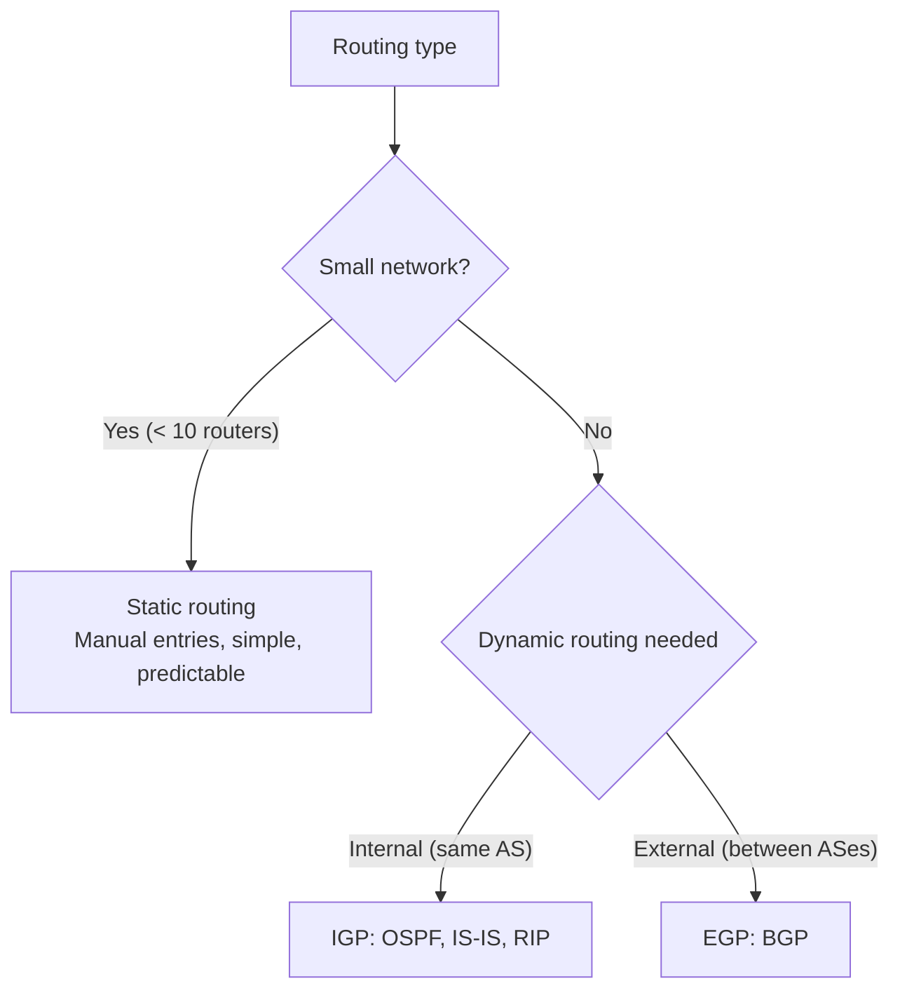
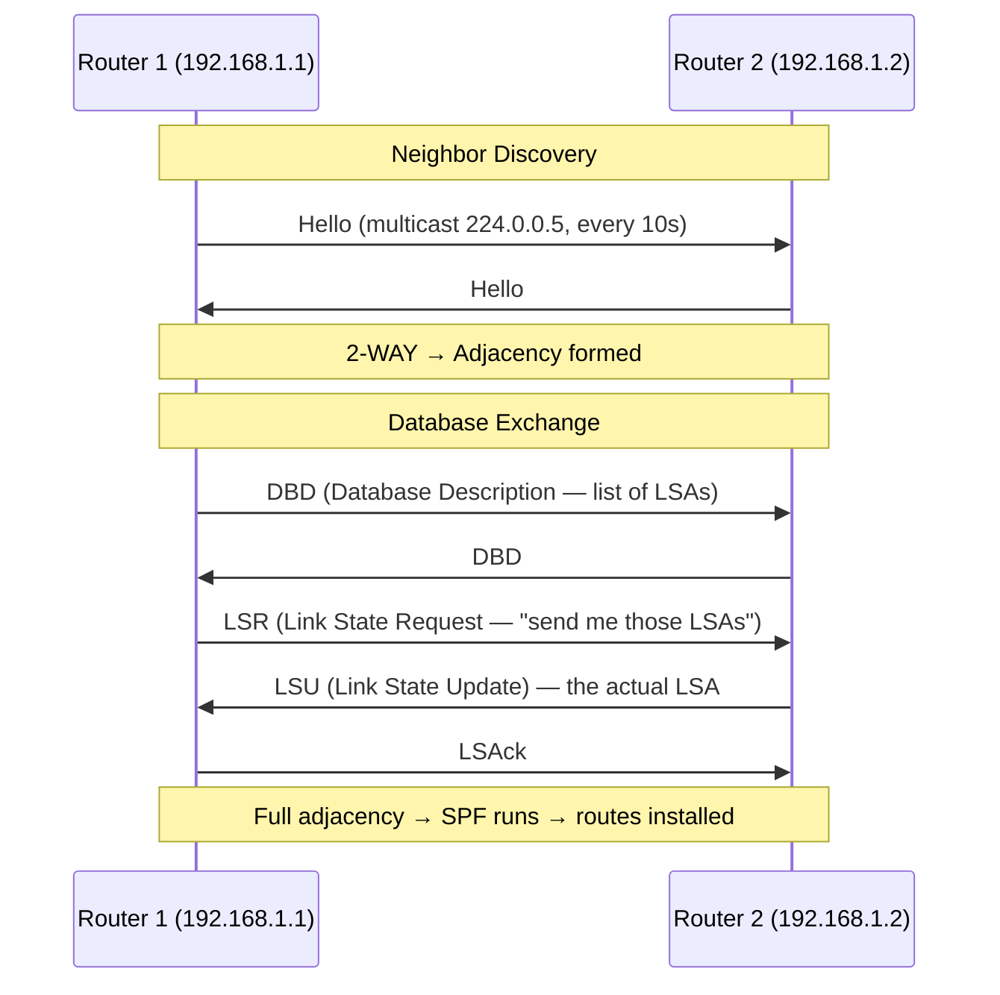
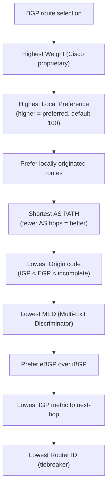

# Routing Protocols: BGP and OSPF

> [!summary] Goal
> Understand how routers forward packets, how dynamic routing protocols (OSPF, BGP) exchange routes, and how route selection works. Master the difference between static routing, interior (IGP), and exterior (EGP) protocols.

## Table of Contents

1. [Static vs Dynamic Routing](#static-vs-dynamic-routing)
2. [OSPF — Open Shortest Path First](#ospf-open-shortest-path-first)
3. [BGP — Border Gateway Protocol](#bgp-border-gateway-protocol)
4. [Administrative Distance](#administrative-distance)
5. [Verification Commands](#verification-commands)
6. [Pitfalls](#pitfalls)

---

## Static vs Dynamic Routing

> [!info] Routing
> Routing is the process of forwarding packets from one network to another. A router maintains a **routing table** (RIB — Routing Information Base) and makes forwarding decisions per packet. **Static routes** are manually configured. **Dynamic routing protocols** (OSPF, BGP) exchange routing information automatically.



| Aspect | Static | Dynamic (OSPF) | Dynamic (BGP) |
|--------|:------:|:--------------:|:--------------:|
| **Configuration** | Manual (ip route) | Automatic | Automatic |
| **Convergence** | Instant (manual fix) | Fast (seconds) | Slow (minutes) |
| **Scalability** | < 10 routes | Thousands | Hundreds of thousands |
| **Protocol type** | N/A | Link-state | Path-vector |
| **Use case** | Small office | Enterprise datacenter | Internet backbone |

---

## OSPF — Open Shortest Path First

> [!info] OSPF
> OSPF is an Interior Gateway Protocol (IGP) — used within a single organization or Autonomous System (AS). Each router knows the full network topology (link-state database) and computes the shortest path to each destination using **Dijkstra's algorithm**. OSPF converges quickly and supports hierarchical design via **areas**.

```text
OSPF areas:
  Backbone (Area 0):  Core area — all other areas must connect to it
  Regular areas:      Attached to Area 0 — can be stub, NSSA, or totally stubby
  
  Area 0 (backbone) ←→ Area 1 (standard)
  Area 0 (backbone) ←→ Area 2 (stub — no external routes)
  Area 0 (backbone) ←→ Area 3 (NSSA — limited external routes)

All traffic between areas must go through Area 0.
This hierarchical design reduces LSDB size and improves stability.
```

### OSPF operation



### OSPF LSA types

| Type | Name | Contents |
|:----:|------|----------|
| 1 | Router LSA | Router's links to neighbors |
| 2 | Network LSA | Designated router's segment info |
| 3 | Summary LSA | Routes from other areas |
| 4 | ASBR Summary LSA | Route to AS Boundary Router |
| 5 | AS-External LSA | External routes (redistributed from other sources) |
| 7 | NSSA LSA | External routes in NSSA area |

```bash
# OSPF state verification (FRR/Quagga)
vtysh
> show ip ospf neighbor            # Adjacency states
> show ip ospf database            # Link-state database
> show ip ospf interface           # OSPF config per interface
> show ip route ospf              # Routes learned via OSPF
```

---

## BGP — Border Gateway Protocol

> [!info] BGP
> BGP is the **routing protocol of the Internet**. It connects Autonomous Systems (ASes) — each AS is a network under one administrative control (e.g., Google AS 15169, Cloudflare AS 13335). BGP uses **path-vector** routing — it doesn't just know the shortest path (like OSPF), it knows the entire AS path and applies policies.

### BGP path selection

BGP chooses the best path based on these attributes, evaluated in order:



### BGP attributes

| Attribute | Type | Purpose |
|-----------|:----:|---------|
| **AS PATH** | Well-known mandatory | Sequence of ASes the route passed through |
| **Local Preference** | Well-known discretionary | Higher value = preferred outbound path (within AS) |
| **MED / Metric** | Optional transitive | Lower value = preferred inbound path (across AS) |
| **Origin** | Well-known mandatory | IGP < EGP < incomplete |
| **Next-hop** | Well-known mandatory | IP address of the next router to reach the destination |
| **Community** | Optional transitive | Tags for policy application (e.g., NO_EXPORT) |

### BGP session types

```text
eBGP: Between different ASes — default TTL=1, no synchronization needed
iBGP: Within the same AS — requires full mesh or route reflector, TTL=255

eBGP multihop: For eBGP peers not directly connected (set TTL > 1)
Route reflector: Reduces iBGP mesh from O(n²) to O(n)
BGP confederation: Breaks large AS into smaller sub-ASes
```

```bash
# BGP state verification (FRR/Quagga)
vtysh
> show bgp summary                  # BGP peer states
> show bgp ipv4 unicast             # BGP routes
> show bgp ipv4 unicast 8.8.8.0/24  # Specific route details
> show bgp neighbors                # BGP session details per neighbor

# BGP states (idle → connect → active → opensent → openconfirm → established)
```

---

## Administrative Distance

When a router learns the same destination from multiple routing protocols, it uses **administrative distance** to decide which source to trust. Lower = more trustworthy.

| Route source | AD |
|-------------|:--:|
| Directly connected | 0 |
| Static route | 1 |
| eBGP | 20 |
| OSPF | 110 |
| IS-IS | 115 |
| RIP | 120 |
| iBGP | 200 |
| Unknown/unreliable | 255 |

---

## Verification Commands

```bash
# Routing table
ip route show                          # IPv4 routing table
ip -6 route show                       # IPv6 routing table
route -n                               # Traditional routing table
netstat -rn                            # Alternative

# Route lookup
ip route get 8.8.8.8                   # Show which interface/gateway for destination
ip route get 10.0.0.1 from 192.168.1.5 # Test from specific source IP

# Tracing
traceroute -n 8.8.8.8                  # Show actual path
mtr 8.8.8.8                            # Continuous path + loss + latency

# BGP tools
birdc show route                       # BIRD BGP daemon
bgpq4 -l -A AS15169                     # Generate prefix list for an ASN
whois -h whois.radb.net 8.8.8.8         # BGP routing information for IP

# BGP looking glass (public servers)
telnet route-views.oregon-ix.net        # View BGP tables from Internet backbone
show bgp 8.8.8.0/24

# FRR/Quagga commands
vtysh -c "show ip route"                # FRR routing table
vtysh -c "show bgp summary"             # FRR BGP peers

# OSPF
vtysh -c "show ip ospf neighbor"        # OSPF adjacencies
vtysh -c "show ip ospf database"        # OSPF LSDB
```

---

## Pitfalls

### BGP route flapping

A route that is announced and withdrawn repeatedly causes instability across the Internet. BGP route flapping triggers route recalculation on all routers receiving it. BGP daemons implement route flap damping: after N flaps, the route is suppressed for a period. If you're announcing prefixes that change frequently, use a static route or a minimal hold-down.

### OSPF neighbor stuck in EXSTART/EXCHANGE

This usually indicates an MTU mismatch between routers. OSPF DBD packets can't be larger than the interface MTU. If one router has a different MTU, the adjacency can't form. Fix: ensure matching MTU on both ends (`mtu 1500`). Alternatively, configure `ip ospf mtu-ignore`.

### BGP table size

The full Internet BGP table is ~1M routes (2024). Router hardware must have enough memory and CPU to process this. If you're connecting a small network to one ISP, you don't need full BGP — use a default route from the ISP. Full BGP is needed for multi-homing (multiple ISPs) and traffic engineering.

### Forgetting to configure route summarization

Without summarization, every internal subnet is advertised to the Internet. This is unnecessary (no one needs to route to your 10.0.0.0/24 internal network) and consumes BGP table space. Summarize your public prefix at the border router.

---

> [!question]- Interview Questions
>
> **Q: What's the difference between OSPF and BGP?**
> A: OSPF (link-state, Dijkstra) is an IGP for routing within an AS. It converges quickly, knows complete topology, and uses cost/metric based on bandwidth. BGP (path-vector) is an EGP for routing between ASes. It uses policy-based path selection (AS PATH, Local Pref, MED) and carries the entire Internet routing table.
>
> **Q: What is the BGP AS PATH attribute?**
> A: AS PATH lists all autonomous systems a route has traversed. When a router announces a route to an eBGP peer, it prepends its AS number. Longer AS PATHs are less preferred (more hops). AS PATH is also used for loop detection — if a router sees its own AS in the path, the route is rejected.
>
> **Q: How does OSPF elect a Designated Router?**
> A: On a multi-access network (Ethernet), OSPF elects a Designated Router (DR) and Backup DR (BDR) to reduce adjacencies. All routers form adjacencies with the DR/BDR only — not with each other. The DR with the highest priority (default 1) wins; if tied, highest Router ID wins.
>
> **Q: What is route summarization?**
> A: Aggregating multiple specific routes into a single summary route. Example: instead of advertising ten /24 subnets, advertise one /16. This reduces routing table size, improves convergence, and hides internal topology changes. In OSPF, summarization is done at area boundaries. In BGP, it's configured on border routers.
>
> **Q: What administrative distance is used for different routing sources?**
> A: Connected = 0, Static = 1, eBGP = 20, OSPF = 110, IS-IS = 115, RIP = 120, iBGP = 200. Lower distance is preferred. If a router learns 10.0.0.0/8 from both OSPF (AD 110) and BGP (AD 20), BGP's route wins (lower AD = more trusted).

---

## Cross-Links

- [[Networking/01_Foundations/02_IP_Addressing_and_Subnetting]] for subnetting and CIDR
- [[Networking/01_Foundations/04_TCP_Deep_Dive]] for transport layer over routing
- [[Networking/02_Core/04_Proxies_NAT_and_Firewalls]] for NAT and policy routing
- [[Networking/03_Advanced/04_Network_Security]] for BGP hijacking detection
- [[Networking/01_Foundations/06_Ethernet_Switching_and_VLANs]] for switching vs routing
