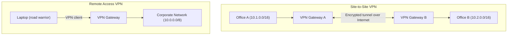
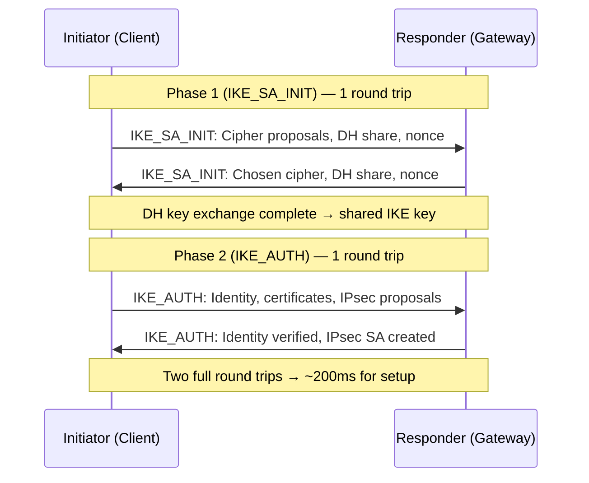

# VPN and Tunneling

> [!summary] Goal
> Understand VPN technologies: IPsec (IKE, ESP, AH), WireGuard (modern, fast), and OpenVPN. Learn the difference between tunnel and transport modes, site-to-site vs remote access, and how to configure and verify each.

## Table of Contents

1. [VPN Types](#vpn-types)
2. [IPsec](#ipsec)
3. [WireGuard](#wireguard)
4. [OpenVPN](#openvpn)
5. [TUN vs TAP Interfaces](#tun-vs-tap-interfaces)
6. [Verification Commands](#verification-commands)
7. [Pitfalls](#pitfalls)

---

## VPN Types

> [!info] VPN (Virtual Private Network)
> A VPN creates an encrypted tunnel between two endpoints over an untrusted network (the Internet). It extends a private network across public infrastructure. There are two main deployment types: **site-to-site** (connecting two offices) and **remote access** (connecting individual users to the office).



| VPN type | Protocol | Use case |
|----------|----------|----------|
| **IPsec** | IKE + ESP/AH | Site-to-site, legacy remote access |
| **WireGuard** | Noise protocol | Modern site-to-site and remote access |
| **OpenVPN** | TLS-based | Remote access, cross-platform |
| **SSL VPN** | TLS (browser-based) | Clientless remote access |

---

## IPsec

> [!info] IPsec
> IPsec is a suite of protocols for securing IP communications. **IKE** (Internet Key Exchange) negotiates the security association. **ESP** (Encapsulating Security Payload) encrypts and authenticates packets. **AH** (Authentication Header) authenticates without encryption (rarely used). IPsec can operate in **transport mode** (protects payload only) or **tunnel mode** (protects the entire original IP packet).

### IPsec modes

```mermaid
flowchart LR
    subgraph Transport["Transport Mode"]
        ORIG["Original IP<br/>Src, Dst"] --> ESP["ESP<br/>Encrypted data"]
        note for Transport "Original IP header visible<br/>Used for end-to-end (host to host)"
    end
    subgraph Tunnel["Tunnel Mode"]
        NEW["New IP<br/>Gateway → Gateway"] --> ESP2["ESP<br/>Original IP + data (encrypted)"]
        note for Tunnel "Entire original packet encrypted<br/>Used for site-to-site (gateway to gateway)"
    end
```

### IPsec IKEv2 handshake



### strongSwan IPsec configuration

```bash
# /etc/ipsec.conf — site-to-site IPsec
conn site-to-site
    ikelifetime=24h
    lifetime=1h
    rekeymargin=3m
    keyingtries=1
    keyexchange=ikev2
    authby=secret
    left=203.0.113.1           # Local public IP
    leftsubnet=10.1.0.0/16     # Local network
    leftid=@office-a
    right=203.0.113.2          # Remote public IP
    rightsubnet=10.2.0.0/16    # Remote network
    rightid=@office-b
    auto=start

# Start/stop
ipsec start
ipsec up site-to-site
ipsec status
```

---

## WireGuard

> [!info] WireGuard
> WireGuard is a modern, ultra-fast VPN protocol. It uses the **Noise protocol framework**, has a minimal codebase (~4,000 lines vs 400,000+ for OpenVPN/IPsec), and is built into the Linux kernel since 5.6. Each peer has a Curve25519 public/private key pair. No authentication handshake is required (like SSH, keys identify peers).

### WireGuard handshake

```text
WireGuard has NO separate handshake protocol like IKE or TLS.
Peers authenticate by their public keys, exchanged out-of-band.
A single round trip establishes the tunnel:

  Alice → Bob: Initiation (ephemeral key, timestamp)
  Bob → Alice: Response (ephemeral key, cookie)

After this 1-RTT exchange, both sides have session keys.
Subsequent rekeys happen silently (every 2 minutes, with overlap).

WireGuard is stateless on the server side — can handle millions of clients.
```

### WireGuard configuration

```bash
# Server config: /etc/wireguard/wg0.conf
[Interface]
Address = 10.0.0.1/24
PrivateKey = <server-private-key>
ListenPort = 51820

[Peer]
PublicKey = <client1-public-key>
AllowedIPs = 10.0.0.2/32

[Peer]
PublicKey = <client2-public-key>
AllowedIPs = 10.0.0.3/32

# Client config: /etc/wireguard/wg0.conf
[Interface]
Address = 10.0.0.2/24
PrivateKey = <client-private-key>
DNS = 10.0.0.1

[Peer]
PublicKey = <server-public-key>
Endpoint = 203.0.113.1:51820
AllowedIPs = 0.0.0.0/0, ::/0    # Route all traffic through VPN

# Start WireGuard
wg-quick up wg0
wg show
```

### WireGuard vs IPsec

| Aspect | WireGuard | IPsec |
|--------|:---------:|:-----:|
| **Code size** | ~4,000 lines | 400,000+ lines |
| **Crypto agility** | Fixed (ChaCha20, Poly1305, Curve25519) | Many options (can be misconfigured) |
| **Handshake** | 1-RTT (key-based) | 3-6 messages (IKEv1/v2) |
| **Roaming** | ✅ Built-in (any IP change OK) | ❌ Complex (MOBIKE needed) |
| **Server stats** | Each client has unique key | Shared PSK or certificate per client |
| **Kernel support** | ✅ Built-in (Linux 5.6+) | ✅ Built-in |
| **Audience** | Modern deployments | Legacy enterprise, compliance |

---

## OpenVPN

> [!info] OpenVPN
> OpenVPN is a mature, TLS-based VPN protocol. It's highly configurable, runs over TCP or UDP, and supports both TUN (IP) and TAP (Ethernet) modes. OpenVPN is widely supported across platforms (Windows, macOS, Linux, iOS, Android). It's slower than WireGuard but more feature-rich.

```bash
# Server config: /etc/openvpn/server.conf
port 1194
proto udp
dev tun
ca ca.crt
cert server.crt
key server.key
dh dh.pem
server 10.8.0.0 255.255.255.0
push "redirect-gateway def1"
push "dhcp-option DNS 8.8.8.8"
keepalive 10 120
tls-version-min 1.2
cipher AES-256-GCM
auth SHA256

# Start
systemctl start openvpn@server

# Client config: client.ovpn
client
dev tun
proto udp
remote 203.0.113.1 1194
ca ca.crt
cert client.crt
key client.key
remote-cert-tls server
```

---

## TUN vs TAP Interfaces

> [!info] TUN vs TAP
> **TUN** (tunnel) operates at Layer 3 (IP packets). **TAP** (tap) operates at Layer 2 (Ethernet frames). TUN is simpler and more common for VPNs. TAP is needed for protocols that require Layer 2 connectivity (bridging, NetBIOS broadcasts, DHCP over VPN), but has more overhead.

| Feature | TUN (Layer 3) | TAP (Layer 2) |
|---------|:--------------:|:--------------:|
| **PDU** | IP packets | Ethernet frames |
| **Overhead** | Lower (no MAC/headers) | Higher (full Ethernet frame) |
| **Broadcasts** | None | Carries all L2 broadcasts |
| **Use case** | Normal IP VPN | Bridging networks, legacy protocols |
| **DHCP over VPN** | Works (server pushes IP) | Works (DHCP server in tunnel) |
| **Performance** | Faster | Slower |

```bash
# Create TUN/TAP interfaces (Linux)
ip tuntap add dev tun0 mode tun   # Layer 3 TUN
ip tuntap add dev tap0 mode tap   # Layer 2 TAP
ip addr add 10.0.0.1/24 dev tun0
ip link set tun0 up
```

---

## Verification Commands

```bash
# WireGuard
wg show                           # Active tunnels, peers, transfer
wg show wg0                       # Specific interface
wg-quick up/down wg0              # Start/stop
wg genkey | tee privatekey | wg pubkey > publickey  # Generate keys

# IPsec (strongSwan)
ipsec status                       # Tunnel status
ipsec statusall                    # Detailed status
ipsec up site-to-site              # Bring up a connection
ipsec down site-to-site            # Tear down
journalctl -u strongswan          # IPsec logs

# OpenVPN
systemctl status openvpn@server    # Server status
journalctl -u openvpn              # OpenVPN logs

# Generic tunnel verification
ip link show                       # Show all interfaces (tun0, tap0)
ip addr show tun0                  # Tunnel interface IP
ping -I tun0 10.0.0.2             # Test connectivity through tunnel
tcpdump -i tun0                    # Traffic through the tunnel
traceroute -n 10.0.0.2            # Path through tunnel

# Check tunnel routing
ip route get 10.0.0.2             # Verify route points to tunnel
ss -tulpn | grep 51820            # WireGuard listening port
```

---

## Pitfalls

### MTU issues in VPN tunnels

VPN headers (IPsec: ~30-50 bytes, WireGuard: ~60 bytes, OpenVPN: ~40-60 bytes) reduce the effective MTU. If the original packet had 1500 bytes, the encapsulated packet may exceed the link MTU and be fragmented or dropped. Set MTU on the tunnel interface (`wg0 mtu 1420`) or enable MSS clamping on the firewall.

### Key management complexity (IPsec)

IPsec certificates or PSKs must be distributed to all peers. When a key expires or is revoked, all tunnels fail. Let's Encrypt-style automation is difficult. WireGuard simplifies this: each peer has one public key, key rotation is trivial (just update the config and restart).

### WireGuard UDP blocked by firewalls

WireGuard uses UDP on a single port. Some corporate or hotel firewalls block all UDP. In that case, fall back to OpenVPN over TCP 443 (looks like HTTPS). WireGuard over TCP is possible via userspace implementations but not recommended.

### TAP mode performance

TAP mode carries entire Ethernet frames including broadcasts, ARP, STP BPDUs, and 14-byte MAC headers + 4-byte FCS. This adds 15-25% overhead compared to TUN. Use TAP only when you need Layer 2 connectivity (bridging two remote LAN segments).

---

> [!question]- Interview Questions
>
> **Q: What is the difference between IPsec tunnel mode and transport mode?**
> A: Tunnel mode encrypts the entire original IP packet and wraps it in a new IP header (gateway → gateway). Transport mode encrypts only the payload, leaving the original IP header visible (host → host). Site-to-site VPNs use tunnel mode. End-to-end host communication can use transport mode.
>
> **Q: Why is WireGuard faster than OpenVPN and IPsec?**
> A: WireGuard has ~4,000 lines of code (vs 400,000+). It runs in the Linux kernel, uses a fixed and modern crypto suite (ChaCha20, Poly1305, Curve25519, BLAKE2), and has minimal cryptographic overhead. There's no handshake negotiation — peers are identified by public keys. Context switching and packet processing are much more efficient.
>
> **Q: What's the difference between TUN and TAP interfaces?**
> A: TUN (Layer 3) carries IP packets — simpler, lower overhead, sufficient for most VPNs. TAP (Layer 2) carries full Ethernet frames — needed for bridging networks (same broadcast domain) or legacy protocols that require Layer 2 connectivity. TUN is like connecting a new network; TAP is like connecting the same Ethernet cable.
>
> **Q: How does WireGuard handle IP roaming?**
> A: WireGuard associates a peer's public key with any source IP:port it receives a valid packet from. When a mobile client switches networks, its source IP changes. The next packet the server receives from the client updates the endpoint association. No re-handshake needed (unlike IPsec's MOBIKE). This is seamless.
>
> **Q: What is the maximum allowed MTU for a WireGuard tunnel?**
> A: WireGuard adds 60 bytes of overhead per packet (20 IP + 8 UDP + 4 type + 4 key + 8 nonce + 16 data + 16 auth = ~60). If the physical interface MTU is 1500, the WireGuard interface MTU should be at most 1420. Some clients set it to 1280 to avoid fragmentation over PPPoE (additional 8 bytes).

---

## Cross-Links

- [[Networking/01_Foundations/04_TCP_Deep_Dive]] for TCP over VPN tunnels
- [[Networking/02_Core/04_Proxies_NAT_and_Firewalls]] for firewall rules for VPNs
- [[Networking/02_Core/03_TLS_and_Certificates]] for OpenVPN certificate management
- [[Networking/03_Advanced/04_Network_Security]] for VPN security considerations
- [[Networking/03_Advanced/03_Netns_and_Container_Networking]] for network namespaces with VPNs
