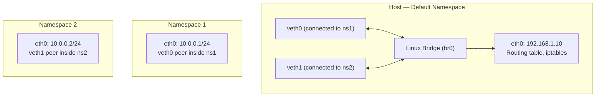
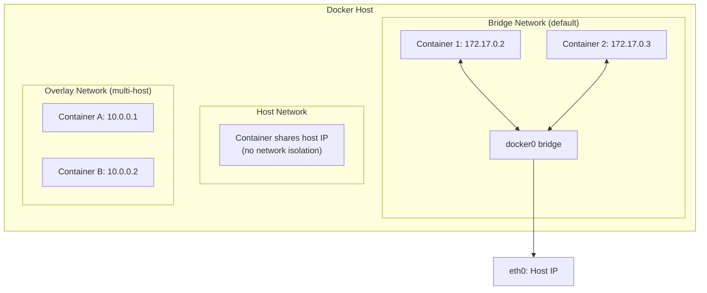

# Network Namespaces and Container Networking

> [!summary] Goal
> Master Linux network namespaces (the foundation of container networking), Docker networking modes, Container Network Interface (CNI), and Kubernetes networking (pod-to-pod, services, network policies). Understand how containers get IP addresses, talk to each other, and connect to the Internet.

## Table of Contents

1. [Linux Network Namespaces](#linux-network-namespaces)
2. [Docker Networking](#docker-networking)
3. [CNI (Container Network Interface)](#cni)
4. [Kubernetes Networking](#kubernetes-networking)
5. [Verification Commands](#verification-commands)
6. [Pitfalls](#pitfalls)

---

## Linux Network Namespaces

> [!info] Network namespace
> A network namespace is a Linux kernel feature that provides an isolated network stack — its own interfaces, IP addresses, routing table, firewall rules, and sockets. Containers (Docker, Podman) each run in their own network namespace. This is what makes container networking possible. Without netns, containers would share the host's network stack.



### Networking namespaces commands

```bash
# Create and manage namespaces
ip netns add red                       # Create namespace "red"
ip netns add blue                      # Create namespace "blue"
ip netns list                          # List all namespaces
ip netns delete red                    # Delete namespace

# Run commands inside a namespace
ip netns exec red bash                 # Start shell inside namespace
ip netns exec red ip addr              # Show IPs inside namespace
ip netns exec red ping 10.0.0.2       # Ping from inside namespace

# Create virtual Ethernet (veth) pair — a cable connecting two namespaces
ip link add veth-red type veth peer name veth-blue

# Connect one end to each namespace
ip link set veth-red netns red
ip link set veth-blue netns blue

# Configure IP addresses inside each namespace
ip netns exec red ip addr add 10.0.0.1/24 dev veth-red
ip netns exec red ip link set veth-red up
ip netns exec blue ip addr add 10.0.0.2/24 dev veth-blue
ip netns exec blue ip link set veth-blue up

# Test connectivity
ip netns exec red ping 10.0.0.2        # Should succeed

# Connect namespaces via Linux bridge
ip link add br0 type bridge             # Create bridge
ip link set br0 up

ip link add veth-emp type veth peer name veth-emp-peer
ip link set veth-emp master br0
ip link set veth-emp up
ip link set veth-emp-peer netns red
ip netns exec red ip addr add 10.0.1.1/24 dev veth-emp-peer
ip netns exec red ip link set veth-emp-peer up

# NAT from namespaces to external network
iptables -t nat -A POSTROUTING -s 10.0.0.0/24 -o eth0 -j MASQUERADE
```

---

## Docker Networking

> [!info] Docker networking
> Docker uses network namespaces internally. Each container gets its own namespace. Docker provides several built-in network drivers that determine how containers communicate with each other and the outside world.



### Docker network drivers

| Driver | Isolation | Use case |
|--------|:---------:|----------|
| **bridge** | Containers isolated from host | Default — single-host containers |
| **host** | No isolation (shares host stack) | Performance-critical, no NAT |
| **overlay** | Multi-host encryption | Docker Swarm, multi-host services |
| **macvlan** | Containers have MAC on physical LAN | Legacy apps expecting direct LAN access |
| **none** | No network | Isolated containers |

```bash
# Docker network commands
docker network ls                           # List networks
docker network create my-net                # Create bridge network
docker network create -d overlay my-swarm   # Create overlay network

# Run container on specific network
docker run -d --name web --network my-net nginx

# Connect container to multiple networks
docker network connect my-net my-container

# Inspect network
docker network inspect bridge               # Connected containers, subnet, gateway
docker inspect web | jq '.[].NetworkSettings'  # Container IP

# Check iptables rules Docker creates
iptables -t nat -L -n                       # Docker adds NAT rules for containers
iptables -L -n                              # Docker adds forwarding rules
```

---

## CNI (Container Network Interface)

> [!info] CNI
> The Container Network Interface (CNI) is a standard for configuring container networking. It's used by Kubernetes, Podman, Amazon ECS, and others. A CNI plugin is a binary that configures a network interface inside a container's namespace when the container is created, and cleans up when it's deleted.

### CNI configuration

```json
{
  "cniVersion": "1.0.0",
  "name": "mynet",
  "type": "bridge",
  "bridge": "cni-bridge0",
  "isGateway": true,
  "ipMasq": true,
  "ipam": {
    "type": "host-local",
    "subnet": "10.22.0.0/16",
    "routes": [{ "dst": "0.0.0.0/0" }]
  }
}
```

### Common CNI plugins

| Plugin | Purpose | Used by |
|--------|---------|---------|
| **bridge** | Creates a Linux bridge, connects container | Flannel host-gw, basic setups |
| **host-local** | IP Address Management (IPAM) from local file | Most plugins |
| **dhcp** | IPAM via DHCP | Enterprise |
| **loopback** | Sets up lo interface | Every container |
| **portmap** | Port forwarding from host to container | Forwarding container ports |
| **macvlan** | Assigns MAC address to container | Direct LAN access |
| **tuning** | Adjusts sysctl settings per container | Optimize container networking |

---

## Kubernetes Networking

> [!info] Kubernetes networking
> Kubernetes has three fundamental networking requirements: (1) all pods can communicate with all other pods without NAT, (2) all nodes can communicate with all pods without NAT, (3) pods see their own IP as what others see. This is achieved by CNI plugins and the Service abstraction.

### Pod networking

```mermaid
flowchart LR
    subgraph Node1["Node 1 (10.0.1.0)"]
        P1["Pod A: 10.244.1.2"]
        P2["Pod B: 10.244.1.3"]
    end
    subgraph Node2["Node 2 (10.0.2.0)"]
        P3["Pod C: 10.244.2.2"]
        P4["Pod D: 10.244.2.3"]
    end
    P1 <-.->|"veth → cni0 → flannel/calico"| P3
    note for Node1 "Each pod gets a unique IP<br/>Pods on different nodes can communicate"
```

### CNI plugins for Kubernetes

| Plugin | Type | Features |
|--------|------|----------|
| **Flannel** | Overlay | Simple, VXLAN or host-gw, no network policies |
| **Calico** | Routing + eBPF | Network policies, BGP, eBPF dataplane, no overlay option |
| **Cilium** | eBPF | Network policies, observability, service mesh, L7 policies |
| **Weave** | Overlay | Mesh, encryption, simple setup |
| **Amazon VPC CNI** | Native AWS | Pods get VPC IPs, direct routing, no NAT |

### Kubernetes Services

```yaml
apiVersion: v1
kind: Service
metadata:
  name: web-service
spec:
  selector:
    app: web
  ports:
    - protocol: TCP
      port: 80            # Service port (internal)
      targetPort: 8080    # Pod port
  type: ClusterIP         # Other types: NodePort, LoadBalancer, ExternalName
```

```mermaid
flowchart LR
    C["Client"] --> SVC["Service (10.100.0.1:80)"]
    SVC --> EP1["Pod 1 (10.244.1.2:8080)"]
    SVC --> EP2["Pod 2 (10.244.2.2:8080)"]
    note for SVC "kube-proxy routes traffic to healthy pods via iptables/ipvs/eBPF"
```

### Kubernetes Network Policies

```yaml
apiVersion: networking.k8s.io/v1
kind: NetworkPolicy
metadata:
  name: allow-frontend
spec:
  podSelector:
    matchLabels:
      app: backend
  policyTypes:
    - Ingress
  ingress:
    - from:
        - podSelector:
            matchLabels:
              app: frontend
      ports:
        - port: 8080
```

---

## Verification Commands

```bash
# Network namespaces
ip netns list                                     # List namespaces
ip netns exec ns1 ip addr                         # Show IP in namespace
ip netns exec ns1 ping 10.0.0.2                   # Test connectivity

# Docker
docker network ls                                 # List networks
docker network inspect bridge                     # Bridge details
docker exec container1 ip addr                     # Container IP
docker exec container2 ping container1             # Docker DNS resolution

# Kubernetes
kubectl get pods -o wide                          # Pod IPs
kubectl get svc                                    # Services
kubectl get endpoints                              # Pods behind a service
kubectl describe pod my-pod | grep -A5 "IP:"      # Pod IP details
kubectl run test-pod --image=busybox --rm -it -- sh  # Debug pod
kubectl exec test-pod -- ping 10.244.1.2          # Test pod connectivity

# CNI
ls /opt/cni/bin/                                   # Installed CNI plugins
cat /etc/cni/net.d/*.conf                          # CNI config
journalctl -u kubelet | grep -i cni               # CNI errors

# Bridge and interfaces
bridge fdb show                                    # MAC table on Linux bridges
ip link show type bridge                           # All bridges
ethtool -S cni0                                    # Bridge statistics
```

---

## Pitfalls

### Pod-to-pod connectivity across nodes fails

The most common Kubernetes networking issue. Pods on the same node communicate via the local bridge. Pods on different nodes need the CNI plugin to route traffic between nodes. Check: (a) CNI plugin is installed correctly, (b) nodes have IP connectivity (ping node IPs), (c) firewall doesn't block overlay traffic (VXLAN UDP 4789, or Calico BGP 179).

### Docker port mapping without understanding iptables

When you publish a port (`docker run -p 8080:80 nginx`), Docker adds iptables rules. If you have a firewall that runs AFTER Docker's rules, the port may be blocked. Check: `iptables -L -n` and `iptables -t nat -L -n` to see Docker's rules. Docker adds rules before custom firewall rules.

### CNI plugin not selected

If you install Kubernetes without specifying a CNI plugin, pods remain in `ContainerCreating` state. The node condition `NetworkReady=false` is stuck. Always install a CNI plugin immediately after initializing the cluster.

### Network policy not working

A default-deny NetworkPolicy blocks all ingress traffic to pods in that namespace. If you create a policy with no rules, all traffic is denied, including health checks and service traffic. Always add at least one allow rule, or don't use default-deny without understanding the implications.

---

> [!Question]- Interview Questions
>
> **Q: How does a Linux network namespace isolate networking?**
> A: A netns has its own network stack: interfaces, IP addresses, routing table, firewall rules, and sockets. Processes in different namespaces can't see each other's network state. veth pairs connect namespaces — like a virtual cable connecting two isolated network stacks.
>
> **Q: How does Docker's bridge network work?**
> A: Docker creates a Linux bridge (docker0) on the host. Each container gets a veth pair — one end in the container namespace, the other attached to docker0. The bridge forwards packets between containers. Docker also adds iptables MASQUERADE rules to allow containers to reach the Internet via the host IP.
>
> **Q: How does a CNI plugin configure container networking?**
> A: When a container is created, the container runtime calls the CNI plugin binary. The plugin: (1) creates a veth pair, (2) attaches one end to the container namespace, (3) assigns an IP address (from IPAM), (4) configures routes, (5) returns the result to the runtime. On deletion, the plugin cleans up.
>
> **Q: How does Kubernetes pod-to-pod networking work across nodes?**
> A: Each pod gets a unique IP from the CNI plugin (cluster-wide). Pods on the same node communicate via the local bridge. Pods on different nodes communicate via the CNI's overlay or routing mechanism (Flannel VXLAN, Calico BGP, Cilium eBPF). The CNI plugin ensures that each node knows how to route pod IPs on other nodes.
>
> **Q: What is the difference between ClusterIP, NodePort, and LoadBalancer services?**
> A: ClusterIP (default) exposes the service on a cluster-internal IP — reachable only within the cluster. NodePort exposes it on each node's IP at a static port (30000-32767) — reachable from outside the cluster. LoadBalancer provisions an external LB (cloud provider) and routes to NodePort/ClusterIP behind it.

---

## Cross-Links

- [[Networking/01_Foundations/06_Ethernet_Switching_and_VLANs]] for Linux bridges and VLANs
- [[Networking/01_Foundations/02_IP_Addressing_and_Subnetting]] for pod subnet planning
- [[Networking/02_Core/04_Proxies_NAT_and_Firewalls]] for iptables rules and NAT
- [[Networking/02_Core/05_Load_Balancing_and_Service_Discovery]] for Service discovery
- [[CICD/Kubernetes/02_Core/03_Network_Policies_and_Pod_Security]] for K8s security
