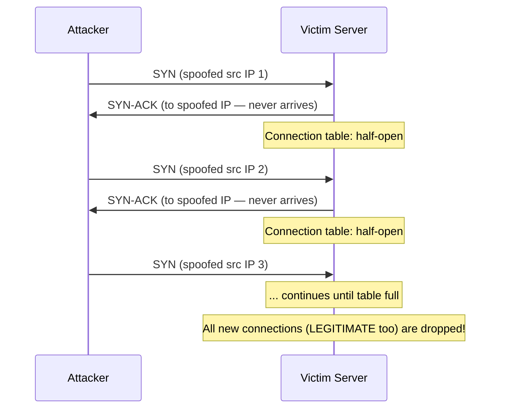
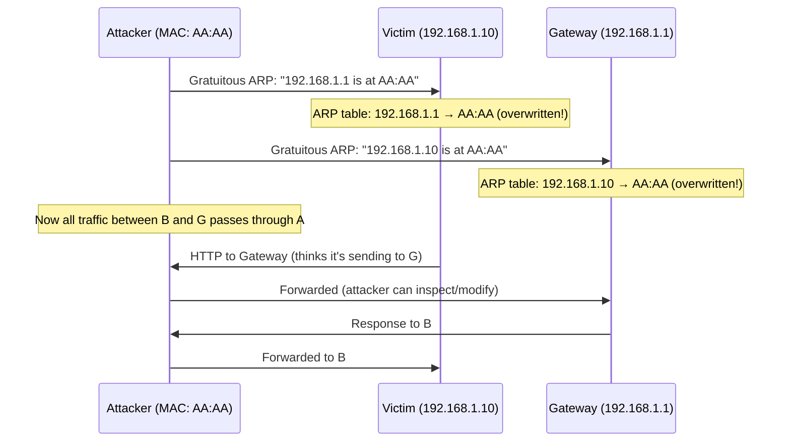
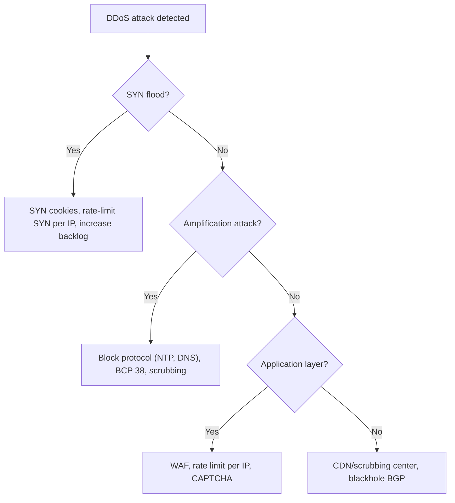

# Network Security

> [!summary] Goal
> Understand network security fundamentals: ACLs, IDS/IPS, DDoS mitigation, common network attacks (ARP spoofing, SYN flood, DNS poisoning), and Zero Trust architecture. Learn to scan networks with nmap, configure basic firewall rules, and verify security controls.

## Table of Contents

1. [ACLs (Access Control Lists)](#acls)
2. [IDS vs IPS](#ids-vs-ips)
3. [Common Network Attacks](#common-network-attacks)
4. [DDoS Mitigation](#ddos-mitigation)
5. [Zero Trust Networking](#zero-trust-networking)
6. [Network Scanning with nmap](#network-scanning-with-nmap)
7. [Pitfalls](#pitfalls)

---

## ACLs (Access Control Lists)

> [!info] ACL (Access Control List)
> An ACL is a sequence of permit/deny rules applied to network traffic. Each rule matches on source IP, destination IP, protocol, and port. ACLs are processed top-down — the first matching rule wins. At the end, there's an implicit deny all (unless you add a permit any at the end).

### Standard ACL (filters by source IP)

```text
Standard ACL — filters by source IP only.
Apply closest to the DESTINATION.

ip access-list standard BLOCK_TELNET
  deny tcp any 10.0.0.0 0.0.0.255 eq 23
  permit ip any any
```

### Extended ACL (filters by source, destination, port)

```text
Extended ACL — filters by src IP, dest IP, protocol, and port.
Apply closest to the SOURCE.

ip access-list extended WEB_ONLY
  permit tcp 192.168.1.0 0.0.0.255 host 10.0.0.100 eq 80
  permit tcp 192.168.1.0 0.0.0.255 host 10.0.0.100 eq 443
  deny ip any any
```

### iptables as ACL

```bash
# iptables rules (equivalent to ACLs)
# Allow SSH from management network only
iptables -A INPUT -p tcp --dport 22 -s 10.0.0.0/24 -j ACCEPT
iptables -A INPUT -p tcp --dport 22 -j DROP

# Allow web traffic from anywhere
iptables -A INPUT -p tcp -m multiport --dports 80,443 -j ACCEPT

# Drop everything else
iptables -P INPUT DROP
```

---

## IDS vs IPS

> [!info] IDS (Intrusion Detection System) vs IPS (Intrusion Prevention System)
> **IDS** monitors traffic and **alerts** when it detects malicious patterns (promiscuous mode, out-of-band). **IPS** monitors traffic and **blocks** malicious traffic in real-time (inline). Both use signature-based detection (known attack patterns) and anomaly-based detection (behavioral deviations).

| Aspect | IDS | IPS |
|--------|:---:|:---:|
| **Action** | Alerts | Blocks |
| **Deployment** | Out-of-band (span port) | Inline (in the traffic path) |
| **Latency impact** | None (just listens) | Adds some (inspects inline) |
| **False positives** | Alert noise (no impact) | Can block legitimate traffic |
| **Examples** | Snort (alert mode), Suricata | Snort (inline), Palo Alto, Cisco Firepower |

```bash
# Snort IDS (alert only)
snort -i eth0 -c /etc/snort/snort.conf -A alert

# Suricata (can run as IDS or IPS)
suricata -i eth0 -c /etc/suricata/suricata.yaml        # IDS mode
suricata -q 0 -c /etc/suricata/suricata.yaml           # IPS mode (via nfqueue)
```

---

## Common Network Attacks

| Attack | Layer | How it works | Mitigation |
|--------|:-----:|--------------|------------|
| **SYN flood** | L4 | Send many SYN packets, never complete handshake — exhausts connection table | SYN cookies, rate limiting, increase backlog |
| **ARP spoofing** | L2 | Send fake ARP replies, redirect traffic through attacker | Static ARP, DHCP snooping, port security |
| **DNS poisoning** | L7 | Corrupt DNS cache, redirect users to fake sites | DNSSEC, configure resolver to check |
| **MITM (Man-in-the-Middle)** | L2/L3 | Attacker intercepts traffic between two parties | TLS everywhere, certificate pinning |
| **DDoS amplification** | L3/L4 | Small query → large response to victim (NTP, DNS, Memcached) | BCP 38 (anti-spoofing), rate limiting |
| **Port scanning** | L4 | Scan for open ports to identify vulnerable services | Firewall, port knocking, hide services |
| **IP spoofing** | L3 | Send packets with forged source IP address | uRPF (reverse path forwarding), BCP 38 |

### SYN flood attack flow



### ARP spoofing flow



---

## DDoS Mitigation



### DDoS mitigation tools

```bash
# Linux kernel SYN flood protection
sysctl -w net.ipv4.tcp_syncookies=1                    # SYN cookies (enable)
sysctl -w net.ipv4.tcp_max_syn_backlog=65535            # Increase backlog
sysctl -w net.ipv4.tcp_syn_retries=2                    # Reduce SYN retries

# Rate limiting with iptables
iptables -A INPUT -p tcp --dport 80 -m connlimit --connlimit-above 100 -j REJECT

# IPtables rate limit (10 new connections per second per IP)
iptables -A INPUT -p tcp --dport 80 -m state --state NEW \
  -m recent --set --name DDOS
iptables -A INPUT -p tcp --dport 80 -m state --state NEW \
  -m recent --update --seconds 1 --hitcount 10 --name DDOS -j DROP

# Fail2ban (application-layer brute-force protection)
fail2ban-client status sshd
fail2ban-client set sshd bantime 3600

# BGP blackhole (RTBH — Remote Triggered Black Hole)
# Announcing a /32 route to null0 for the victim IP
# Community: (your-AS):666
```

---

## Zero Trust Networking

> [!info] Zero Trust
> "Never trust, always verify." Zero Trust assumes the network is always hostile — no device is trusted by virtue of being inside the corporate network. Every request must be authenticated, authorized, and encrypted. This is in contrast to the traditional castle-and-moat model (trust inside, distrust outside).

| Principle | Implementation | Traditional | Zero Trust |
|-----------|---------------|-------------|------------|
| **Network location** | No inherent trust | Internal = trusted | No location is trusted |
| **Authentication** | Every request | Perimeter only | Every request (mTLS) |
| **Authorization** | Per-service policy | Allow by default | Least-privilege |
| **Encryption** | Every hop | Usually internal-only | Every hop (mTLS) |
| **Microsegmentation** | Firewall per workload | VLAN segmentation | Network policies per pod |

---

## Network Scanning with nmap

> [!info] nmap
> nmap ("Network Mapper") is the standard tool for network exploration and security auditing. It can discover hosts, open ports, running services, operating systems, and more. Always have permission before scanning networks you don't own.

```bash
# Basic scan
nmap -sn 192.168.1.0/24              # Ping sweep — find live hosts
nmap -sT 192.168.1.1                 # TCP connect scan (full handshake)
nmap -sS 192.168.1.1                 # SYN scan (stealth — half-open)
nmap -sU 192.168.1.1                 # UDP scan (slow)
nmap -sV 192.168.1.1                 # Version detection
nmap -O 192.168.1.1                  # OS detection
nmap -A 192.168.1.1                  # Aggressive (OS + version + scripts)

# Port specification
nmap -p 22,80,443 192.168.1.1        # Specific ports
nmap -p- 192.168.1.1                 # All 65535 ports (slow)
nmap --top-ports 100 192.168.1.1     # Most common 100 ports

# Script scanning
nmap --script vuln 192.168.1.1        # Vulnerability scanning
nmap --script ssl-enum-ciphers -p 443 192.168.1.1  # TLS cipher audit

# Firewall detection
nmap -sA 192.168.1.1                 # ACK scan (map firewall rules)
nmap -T4 -F 192.168.1.1              # Fast scan (T4 timing)
```

---

## Verification Commands

```bash
# Check open ports
ss -tulpn                             # All listening ports (Linux)
netstat -ano | findstr LISTENING      # Windows

# Check firewall rules
iptables -L -n -v                     # Linux firewall rules
nft list ruleset                      # nftables rules
netsh advfirewall show allprofiles    # Windows firewall

# Check for ARP spoofing
arp -a                                # ARP table
arpwatch -i eth0                      # Monitor ARP changes

# Check for suspicious connections
ss -t state established               # All established connections
lsof -i                                # Network connections per process

# DNS security
delv example.com @8.8.8.8            # DNSSEC validation test
dig +trace example.com               # Check for DNS hijacking

# BGP security
whois -h whois.radb.net 8.8.8.8      # Check BGP origin
bgpq4 -A AS15169                      # Check prefix ownership

# Network scanning (with permission)
nmap -sn 192.168.1.0/24              # Live host discovery
```

---

## Pitfalls

### Firewall misconfiguration (allow all outbound)

Most firewalls allow all outbound traffic by default. If a machine is compromised, the attacker can exfiltrate data over any port. Restrict outbound traffic: only allow known services (DNS, HTTP, HTTPS, NTP, etc.) to specific destinations.

### SNMP exposed to the Internet

SNMP (UDP 161/162) with default community strings (public, private) is a goldmine for attackers. It leaks system information, running processes, network topology, and can be used to change configurations. Never expose SNMP to the Internet. Use SNMPv3 with authentication and encryption.

### BGP hijacking

If an AS announces IP prefixes it doesn't own, traffic for those prefixes is redirected to the hijacker. This has happened to YouTube (2008), AWS and many others. Protect your prefixes with: (a) RPKI (Resource Public Key Infrastructure), (b) IRR route objects, (c) BGP monitoring (bgpmon.net, isbgpsafeyet.com).

### Default passwords on network devices

Routers, switches, firewalls, and access points often ship with default credentials (admin/admin). Change them immediately. Use SSH (not telnet) for management access. Restrict management access to dedicated management networks or VPN.

---

> [!question]- Interview Questions
>
> **Q: What's the difference between an IDS and an IPS?**
> A: An IDS monitors traffic and alerts when it detects malicious patterns — it doesn't block traffic. An IPS sits inline and blocks malicious traffic in real-time. IDS has no impact on traffic (false positive = alert noise). IPS can block legitimate traffic (false positive = outage).
>
> **Q: How does a SYN flood attack work and how do you mitigate it?**
> A: The attacker sends many SYN packets with spoofed source IPs but never completes the handshake. The server allocates memory for each half-open connection until the connection table is full, blocking legitimate connections. Mitigations: SYN cookies (crypto handshake without table entries), rate-limiting SYN per IP, increasing SYN backlog, SYN proxy.
>
> **Q: What is ARP spoofing and how do you prevent it?**
> A: The attacker sends fake ARP replies, associating their MAC address with the gateway's IP (or another host's IP). Traffic destined for that IP is sent to the attacker instead (man-in-the-middle). Prevent with: static ARP entries (impractical at scale), DHCP snooping (switches), ARP spoofing detection (arpwatch), port security, or 802.1X.
>
> **Q: What is Zero Trust networking?**
> A: Zero Trust assumes no network is trusted — not even the internal corporate network. Every request must be authenticated (identity-based), authorized (per-service policy), and encrypted (mTLS). It replaces the castle-and-moat model (trust inside, distrust outside) with per-request verification.
>
> **Q: What network recon tools would you use to assess an organization's security posture?**
> A: nmap (host discovery, port scanning, OS detection, version detection), masscan (fast port scanning at scale), netcat (manual interaction with services), tcpdump/Wireshark (packet-level analysis), nikto (web server vulnerability scanning), OpenVAS (full vulnerability scanner), and nmap NSE scripts for targeted checks (ssl-enum-ciphers, vuln, smb-os-discovery).

---

## Cross-Links

- [[Networking/01_Foundations/03_ARP_ICMP_and_DHCP]] for ARP spoofing context
- [[Networking/01_Foundations/04_TCP_Deep_Dive]] for TCP SYN flood details
- [[Networking/02_Core/04_Proxies_NAT_and_Firewalls]] for firewall concepts
- [[Networking/02_Core/01_DNS_Deep_Dive]] for DNS security (DNSSEC)
- [[Networking/03_Advanced/01_Routing_BGP_OSPF]] for BGP hijacking
