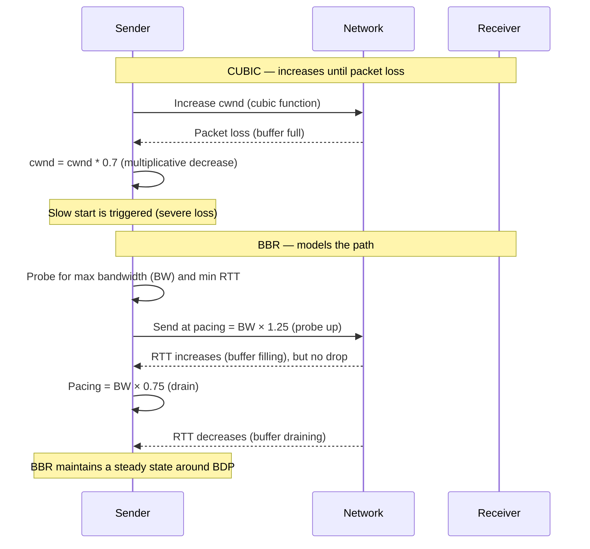
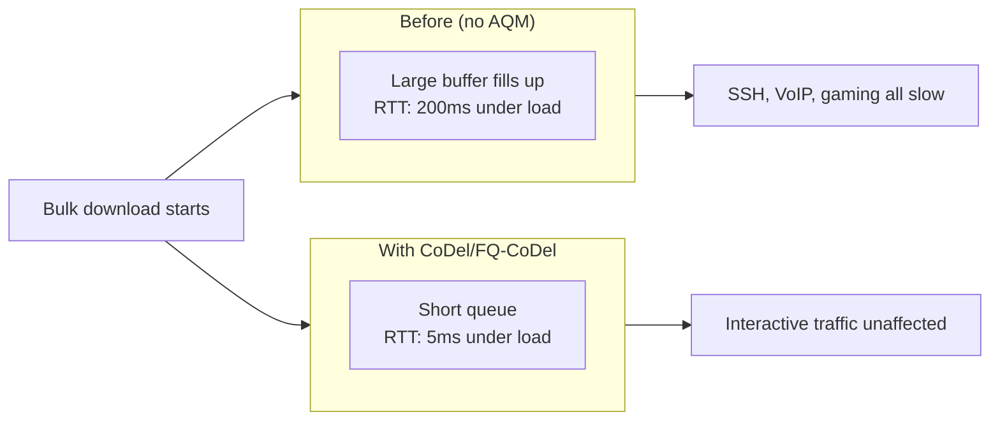

# Congestion Control and QoS

> [!summary] Goal
> Understand TCP congestion control algorithms (Cubic, BBR, Reno), bufferbloat, and Quality of Service (QoS) techniques — traffic shaping, policing, and queuing disciplines. Learn to use Linux `tc` for traffic control.

## Table of Contents

1. [Congestion Control Algorithms](#congestion-control-algorithms)
2. [Bufferbloat](#bufferbloat)
3. [Quality of Service (QoS)](#quality-of-service)
4. [Linux tc (Traffic Control)](#linux-tc)
5. [Verification Commands](#verification-commands)
6. [Pitfalls](#pitfalls)

---

## Congestion Control Algorithms

> [!info] Congestion control
> TCP congestion control determines how fast to send data. It probes the network for available bandwidth and reduces the send rate when congestion is detected. Different algorithms have different strategies for detecting congestion and adjusting the rate.

### Algorithm comparison

| Algorithm | Approach | Loss detection | Best for |
|-----------|----------|:--------------:|----------|
| **Reno** | AIMD (Additive Increase, Multiplicative Decrease) | Packet loss (3 dup ACKs) | Low-loss links |
| **Cubic** | Cubic function — more aggressive growth | Packet loss | Long-fat networks (Linux default) |
| **BBR** | Model-based (bandwidth + RTT) | No loss-based backoff | Mixed loss, high bandwidth |
| **Westwood** | Bandwidth estimation | ACK rate monitoring | Wireless (lossy links) |

### Cubic vs BBR behavior



```bash
# Check current congestion control algorithm
sysctl net.ipv4.tcp_congestion_control     # Default: cubic
sysctl net.ipv4.tcp_available_congestion_control  # All available algos

# Change algorithm
sysctl -w net.ipv4.tcp_congestion_control=bbr

# Check which algorithm each connection uses
ss -ti | head -5                           # Shows "bbr" or "cubic" in output
netstat -s | grep -i "congestion\|retransmit\|reorder"
```

---

## Bufferbloat

> [!info] Bufferbloat
> Bufferbloat is the excessive buffering of packets in network queues. It causes high latency (high RTT) under load, even for interactive traffic like SSH and VoIP. Large buffers fill up quickly when a fast sender transmits, causing all flows to experience increased latency. The cure is **Active Queue Management (AQM)** — algorithms like CoDel and FQ-CoDel that keep queues short.



```bash
# Check current queuing discipline
tc qdisc show dev eth0                    # Current qdisc
# Typical output: qdisc pfifo_fast 0: root bands 3 priomap ...

# Install fq_codel (Fair Queuing + CoDel)
tc qdisc replace dev eth0 root fq_codel

# Test for bufferbloat
# https://www.waveform.com/tools/bufferbloat
# Or use netperf + ping
ping -c 100 -i 0.01 server               # Ping during bulk download
# If ping RTT jumps from 5ms to 500ms during download → bufferbloat

# Check interface queue length
ip -s link show eth0                      # Look at backlog/drops
```

---

## Quality of Service (QoS)

> [!info] QoS
> QoS prioritizes certain types of traffic over others. Not enough bandwidth for everyone? QoS ensures VoIP and SSH get priority over bulk downloads. QoS is implemented via **traffic shaping** (limit rate) and **policing** (drop above rate), using **queuing disciplines** at the network interface.

### QoS components

| Component | Function | Example |
|-----------|----------|---------|
| **Classification** | Identify traffic types | Match on port (ssh=22, dns=53) or DSCP |
| **Marking** | Set priority bits | Set DSCP = 46 for VoIP |
| **Policing** | Drop or mark above a rate | Limit P2P to 1 Mbps |
| **Shaping** | Buffer and delay above a rate | Shape outbound traffic to 100 Mbps |
| **Queuing** | Prioritize among queues | Strict priority or fair queuing |

### DiffServ/DSCP marking

| Traffic class | DSCP value | Priority | Common uses |
|:-------------:|:----------:|:--------:|-------------|
| EF (Expedited Forwarding) | 46 | Highest | VoIP, real-time |
| AF41 | 34 | High | Interactive video |
| AF31 | 26 | Medium | Streaming video |
| AF21 | 18 | Low-medium | Bulk data |
| BE (Best Effort) | 0 | Default | Everything else |
| CS1 | 8 | Low | Scavenger (lowest) |

### Linux tc — traffic shaping example

```bash
# Shape all outbound traffic to 100 Mbps
tc qdisc add dev eth0 root tbf rate 100mbit burst 32kbit latency 50ms

# Create HTB (Hierarchical Token Bucket) for multiple classes
tc qdisc add dev eth0 root handle 1: htb default 30

# Root class — total bandwidth 1 Gbps
tc class add dev eth0 parent 1: classid 1:1 htb rate 1gbit

# VoIP traffic — guaranteed 256 Kbps, burst up to 1 Gbps
tc class add dev eth0 parent 1:1 classid 1:10 htb rate 256kbit ceil 1gbit
tc filter add dev eth0 parent 1:0 protocol ip prio 1 \
  u32 match ip dport 5060 0xffff flowid 1:10         # SIP
tc filter add dev eth0 parent 1:0 protocol ip prio 1 \
  u32 match ip dport 16384 0xfff8 flowid 1:10        # RTP

# SSH traffic — guaranteed 2 Mbps, burst up to 1 Gbps
tc class add dev eth0 parent 1:1 classid 1:20 htb rate 2mbit ceil 1gbit
tc filter add dev eth0 parent 1:0 protocol ip prio 2 \
  u32 match ip dport 22 0xffff flowid 1:20

# Default (best effort) — no guarantee, share remaining
tc class add dev eth0 parent 1:1 classid 1:30 htb rate 100mbit ceil 1gbit
```

---

## Verification Commands

```bash
# Current congestion control algorithm
sysctl net.ipv4.tcp_congestion_control
cat /proc/sys/net/ipv4/tcp_available_congestion_control

# Per-connection congestion algorithm
ss -ti | grep -E "cubic|bbr|reno"        # Shows algo for each connection

# Queue discipline
tc qdisc show dev eth0                     # Current qdisc
tc -s qdisc show dev eth0                  # With statistics (drops, overlimits, backlog)

# Traffic shaping stats
tc -s class show dev eth0                  # Per-class statistics
tc -s filter show dev eth0                 # Filter statistics

# Network statistics
netstat -s | head -20                      # Protocol statistics
netstat -s | grep -i "retransmit|loss|congestion|reorder"
ip -s link show eth0                       # Interface statistics

# Bufferbloat test
# Run a bulk download (iperf) and measure ping at the same time
iperf3 -c server -t 30 &                   # Background: bulk TCP download
ping -c 10 server                          # During download: measure RTT
# If RTT during download is much higher than idle RTT → bufferbloat

# Bandwidth measurement
iperf3 -c server -t 10                     # Bandwidth test (TCP)
iperf3 -c server -u -b 100M -t 10          # Bandwidth test (UDP, 100 Mbps target)

# Path MTU discovery test
ping -M do -s 1472 8.8.8.8                 # Test MTU (1472 = 1500 - 20 IP - 8 ICMP)
ping -M do -s 9000 10.0.0.1               # Test jumbo frames (9000 MTU)
```

---

## Pitfalls

### Assuming more bandwidth solves everything

Bandwidth isn't the problem — latency and packet loss are. A 1 Gbps link with 200ms RTT (Bufferbloat) is worse for interactive traffic than a 100 Mbps link with 5ms RTT. Adding bandwidth without addressing bufferbloat makes things worse (more data to fill the same bloated buffer).

### QoS on the wrong interface

QoS must be applied on the **outbound** interface where congestion occurs. For a home router, the bottleneck is the WAN interface (slow). Apply shaping to the outbound WAN direction. Shaping inbound traffic is ineffective (the sender controls the rate, not you).

### Setting DSCP markings without end-to-end trust

DSCP markings are often stripped by ISP equipment. Marking traffic on your LAN helps your own routers prioritize, but once traffic leaves your network, the ISP may ignore the marks or reset them. Some ISPs support DSCP for business-grade connections; consumer connections rarely honor alternative marks.

### Over-queuing with shaping

A shaper that buffers too aggressively adds latency (defeating the purpose). Use `fq_codel` or `cake` as the queuing discipline — they keep queues short while providing fair queuing. `pfifo_fast` (the default) does NOT control bufferbloat.

---

> [!question]- Interview Questions
>
> **Q: What's the difference between Cubic and BBR congestion control?**
> A: Cubic increases the send rate until packet loss occurs, then cuts by ~30%. It assumes loss = congestion. This works well on clean links but unnecessarily throttles on lossy links (wireless). BBR models the path (bandwidth and RTT) and paces accordingly — it doesn't wait for loss to slow down. BBR handles bufferbloat better than Cubic.
>
> **Q: What is bufferbloat and how do you fix it?**
> A: Bufferbloat is excessive buffering in network queues, causing high latency under load. Large buffers fill up during bulk transfers, adding to RTT for all traffic (including interactive). Fix: implement Active Queue Management (AQM) like CoDel or FQ-CoDel, which keeps queues short by dropping packets when the queue grows beyond a target (typically 5ms).
>
> **Q: What is the difference between traffic shaping and policing?**
> A: Shaping buffers (queues) traffic that exceeds the rate, smoothing bursts but adding latency. Policing drops excess traffic immediately (no buffering). Shaping is applied to outbound traffic (controls the outgoing rate). Policing is typically inbound (drops what can't be handled). Shaping causes latency; policing causes drops.
>
> **Q: How does DiffServ / DSCP marking work?**
> A: DSCP (Differentiated Services Code Point) marks packets in the IP header's ToS byte with a priority class (0-63). Routers in the path can prioritize based on the mark. Common classes: EF (VoIP, highest), AF (assured forwarding, medium), BE (best effort, default), CS1 (scavenger, lowest). Marking must be trusted end-to-end.
>
> **Q: What is CoDel and how does it work?**
> A: CoDel (Controlled Delay) is an Active Queue Management algorithm. It tracks the minimum RTT over a window. If the minimum RTT exceeds the target (5ms), it drops packets to signal the sender to slow down. FQ-CoDel adds fair queuing — each flow gets its own queue, so one aggressive flow doesn't harm others. Built-in to `fq_codel` qdisc.

---

## Cross-Links

- [[Networking/01_Foundations/04_TCP_Deep_Dive]] for TCP congestion control
- [[Networking/03_Advanced/06_Troubleshooting_Toolkit]] for iperf3 and bandwidth testing
- [[Networking/02_Core/04_Proxies_NAT_and_Firewalls]] for QoS on firewalls
- [[Networking/03_Advanced/01_Routing_BGP_OSPF]] for BGP QoS communities
- [[Networking/02_Core/05_Load_Balancing_and_Service_Discovery]] for LB QoS
