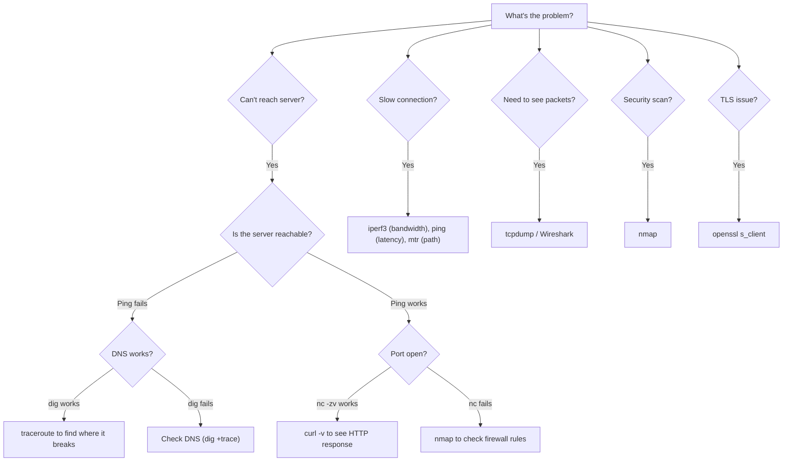

# Network Troubleshooting Toolkit

> [!summary] Goal
> Master the essential network troubleshooting tools: tcpdump, Wireshark, ss, nmap, iperf3, dig, curl, openssl, nc, and their Windows equivalents. Each tool is presented with practical examples and verification steps.

## Table of Contents

1. [Tool Selection Flowchart](#tool-selection-flowchart)
2. [ping](#ping)
3. [traceroute / mtr](#traceroute-mtr)
4. [tcpdump / tshark](#tcpdump-tshark)
5. [ss / netstat](#ss-netstat)
6. [nmap](#nmap)
7. [dig / nslookup](#dig-nslookup)
8. [curl / wget](#curl-wget)
9. [openssl](#openssl)
10. [nc (netcat)](#nc)
11. [iperf3](#iperf3)
12. [Pitfalls](#pitfalls)

---

## Tool Selection Flowchart



---

## ping

> [!info] ping
> Sends ICMP Echo Requests and measures round-trip time. Tests basic Layer 3 connectivity. Packet loss and high latency indicate network issues.

```bash
# Basic
ping -c 4 8.8.8.8                              # 4 pings, Linux
ping -n 4 8.8.8.8                              # 4 pings, Windows

# Advanced
ping -c 100 -i 0.01 8.8.8.8                    # 100 pings, 10ms interval (load test)
ping -f 8.8.8.8                                 # Flood ping (root, 100/sec)
ping -s 1472 -M do 8.8.8.8                     # MTU test (don't fragment)
ping -I eth0 8.8.8.8                            # Bind to specific interface
ping -c 4 -W 2 8.8.8.8                         # 2 second timeout per ping

# Interpretation
# Packet loss > 0%  → connectivity issue or congestion
# RTT variance high  → network congestion or bufferbloat
# RTT > 150ms       → geographic distance or congestion
# Destination Host Unreachable → no route (check gateway)
# Request timed out → host not responding (firewall or down)
```

---

## traceroute / mtr

> [!info] traceroute
> Shows the path packets take to a destination by using increasing TTL values. Each router decrements TTL and sends ICMP Time Exceeded. `mtr` combines ping + traceroute for continuous monitoring.

```bash
# traceroute
traceroute -n 8.8.8.8                          # Numeric, no DNS
traceroute -n -w 1 8.8.8.8                     # 1 second timeout per hop
traceroute -T -p 80 8.8.8.8                    # TCP-based (works when ICMP blocked)
traceroute -U -p 53 8.8.8.8                    # UDP-based (default on Linux)

# mtr (better — continuous stats)
mtr -n 8.8.8.8                                 # Continuous, numeric
mtr -n -c 20 8.8.8.8                          # 20 cycles then exit

# Windows
tracert -d 8.8.8.8                             # Numeric

# Interpretation
# * * * at a hop → router doesn't respond to ICMP (normal at Internet core)
# High latency consistently at one hop → congestion at that router
# High loss at one hop → may be policed (router prioritizes data traffic over ICMP)
# Path changes between runs → BGP route flapping
```

---

## tcpdump / tshark

> [!info] tcpdump
> The standard packet analyzer for the command line. Captures packets at the interface level and displays them in real-time. `tshark` is the command-line version of Wireshark.

```bash
# Basic capture
tcpdump -i eth0                                 # Capture on eth0
tcpdump -i any                                  # Capture on all interfaces
tcpdump -i eth0 -c 100                          # Stop after 100 packets
tcpdump -i eth0 -w capture.pcap                 # Save to file

# Filters (BPF — Berkeley Packet Filter)
tcpdump -i eth0 host 192.168.1.1                # Traffic to/from host
tcpdump -i eth0 src host 192.168.1.10           # From specific source
tcpdump -i eth0 dst host 192.168.1.10           # To specific destination
tcpdump -i eth0 port 80                         # Specific port
tcpdump -i eth0 port 80 or port 443             # Multiple ports
tcpdump -i eth0 'tcp port 80'                   # TCP on port 80
tcpdump -i eth0 'udp port 53'                   # UDP on port 53
tcpdump -i eth0 'tcp[tcpflags] & tcp-syn != 0'  # SYN packets only
tcpdump -i eth0 'tcp[tcpflags] & tcp-syn != 0 and tcp[tcpflags] & tcp-ack == 0'  # SYN only (no ACK)

# Display options
tcpdump -i eth0 -nn                             # Don't resolve hostnames/ports
tcpdump -i eth0 -v                              # Verbose
tcpdump -i eth0 -X                              # Hex + ASCII dump
tcpdump -i eth0 -A                              # ASCII only (HTTP bodies)
tcpdump -i eth0 -e                              # Link-layer headers (MACs)

# Read saved capture
tcpdump -r capture.pcap
tcpdump -r capture.pcap -nn 'port 80'
tcpdump -r capture.pcap -X | head -50

# Practical examples
tcpdump -i any -nn 'port 443'                   # HTTPS traffic
tcpdump -i any -nn 'port 53'                    # DNS traffic
tcpdump -i any -nn 'icmp'                       # ICMP (ping) traffic
tcpdump -i any -nn 'arp'                        # ARP traffic
tcpdump -i any -nn 'port 67 or port 68'         # DHCP traffic
tcpdump -i eth0 -s 0 -w huge.pcap              # Full packet capture (no truncation)

# tshark (Wireshark CLI)
tshark -i eth0                                  # Live capture
tshark -r capture.pcap -Y "http.request"        # Display filter
tshark -r capture.pcap -T fields -e ip.src -e ip.dst -e http.request.uri  # Extract fields
```

---

## ss / netstat

> [!info] ss (Socket Statistics)
> The modern replacement for netstat. Shows socket statistics, TCP connections, and listening services. Much faster than netstat (reads directly from kernel). Use `ss` instead of `netstat` on modern Linux.

```bash
# All sockets
ss -t                                           # TCP sockets
ss -u                                           # UDP sockets
ss -a                                           # All sockets (listening and established)
ss -l                                           # Listening sockets only

# Display options
ss -p                                           # Show process using the socket
ss -n                                           # Don't resolve names (faster)
ss -i                                           # Show TCP internal info
ss -s                                           # Summary statistics

# Practical
ss -tulpn                                       # All listening TCP + UDP with processes
ss -tan                                         # All TCP connections (numeric)
ss -t state established '( dport = :80 or dport = :443 )'  # HTTP/HTTPS established
ss -t state time-wait                           # TIME-WAIT connections
ss -ti                                          # TCP info (cwnd, rtt, congestion algo)
ss -t '( sport = :22 )'                         # SSH connections

# netstat (for older systems and Windows)
netstat -tan                                    # All TCP connections
netstat -tulpn                                  # All listening
netstat -s                                      # Protocol statistics
netstat -i                                      # Interface statistics

# Windows PowerShell
Get-NetTCPConnection -State Established
Get-NetUDPEndpoint
Get-NetIPConfiguration
```

---

## nmap

> [!info] nmap
> Port scanner, network mapper, and service detector. Essential for security audits and network inventory. Always get permission before scanning networks you don't own.

```bash
# Host discovery
nmap -sn 192.168.1.0/24                         # Ping sweep
nmap -PS80,443 192.168.1.0/24                   # TCP SYN to port 80,443

# Port scanning
nmap -sS 192.168.1.1                            # SYN scan (stealth)
nmap -sT 192.168.1.1                            # TCP connect scan
nmap -sU 192.168.1.1                            # UDP scan (slow)
nmap -p 22,80,443 192.168.1.1                   # Specific ports
nmap -p- 192.168.1.1                            # All 65535 ports
nmap --top-ports 100 192.168.1.1                # Top 100 ports

# Service and OS detection
nmap -sV 192.168.1.1                            # Version detection
nmap -O 192.168.1.1                             # OS detection
nmap -A 192.168.1.1                             # Aggressive (OS + version + scripts)

# Scripts
nmap --script vuln 192.168.1.1                  # Vulnerability scan
nmap --script ssl-enum-ciphers -p 443 192.168.1.1  # TLS ciphers
```

---

## dig / nslookup

```bash
# dig — DNS query tool
dig google.com                                  # A record (default)
dig google.com MX                              # Mail exchange
dig google.com AAAA                            # IPv6
dig google.com TXT                             # Text records
dig -x 8.8.8.8                                 # Reverse DNS
dig +short google.com                          # Short answer (just the value)
dig +trace google.com                          # Full resolution path (root→TLD→authoritative)
dig @8.8.8.8 google.com                       # Query a specific resolver

# nslookup (simpler, older)
nslookup google.com
nslookup -type=MX google.com
nslookup google.com 8.8.8.8
```

---

## curl / wget

```bash
# curl — HTTP/HTTPS client
curl -I https://example.com                     # Headers only
curl -v https://example.com                    # Verbose (request + response)
curl -X POST -d '{"key":"value"}' -H "Content-Type: application/json" https://api.example.com
curl --connect-timeout 5 --max-time 10 https://example.com  # Timeouts
curl -w '%{time_connect}s %{time_total}s\n' -o /dev/null -s https://example.com  # Timing
curl --http2 https://example.com               # Force HTTP/2
curl --http3 https://example.com               # Force HTTP/3
curl -x http://proxy:8080 https://example.com  # Use forward proxy
curl --cert client.crt --key client.key https://example.com  # Client cert auth
curl -H "Authorization: Bearer $TOKEN" https://api.example.com  # Bearer auth
```

---

## openssl

```bash
# Test TLS connection
openssl s_client -connect example.com:443              # Full TLS handshake
openssl s_client -connect example.com:443 -tls1_3      # Force TLS 1.3
openssl s_client -connect example.com:443 -showcerts   # Show certificate chain

# Certificate inspection
openssl s_client -connect example.com:443 | openssl x509 -text -noout
openssl s_client -connect example.com:443 | openssl x509 -dates -subject -issuer -noout

# Debugging
openssl s_client -connect example.com:443 -debug       # Hex dump of handshake
openssl s_client -connect example.com:443 -CAfile ca.pem # Custom CA
```

---

## nc (netcat)

```bash
# Port scanning / connectivity test
nc -zv google.com 80                           # Test TCP port (verbose)
nc -zv google.com 80 443 22                    # Test multiple ports
nc -z -w 2 google.com 80                      # 2 second timeout

# Data transfer
echo "GET / HTTP/1.1\r\nHost: example.com\r\n\r\n" | nc example.com 80  # HTTP request

# Listen for connections
nc -l -p 5000                                   # Listen on TCP 5000 (server)
nc -lu -p 5000                                  # Listen on UDP 5000

# File transfer (receiver)
nc -l -p 5000 > received.txt
# File transfer (sender)
nc server 5000 < file.txt

# Chat
nc -l -p 5000                                   # Alice listens
nc alice-ip 5000                                # Bob connects

# Backdoor shell (DANGEROUS — only on isolated networks)
nc -l -p 5000 -e /bin/bash                     # Listen with shell
```

---

## iperf3

> [!info] iperf3
> Bandwidth measurement tool. Tests TCP and UDP throughput between two endpoints. Essential for capacity planning and performance troubleshooting.

```bash
# Server (run on one machine)
iperf3 -s                                        # Default port 5201
iperf3 -s -p 5001                                # Custom port

# Client (TCP test)
iperf3 -c server                                 # Default test (10 seconds)
iperf3 -c server -t 30                           # 30 second test
iperf3 -c server -P 4                            # 4 parallel streams
iperf3 -c server -R                              # Reverse mode (server → client)
iperf3 -c server --bidir                         # Bidirectional test

# Client (UDP test)
iperf3 -c server -u -b 100M                     # UDP, 100 Mbps target rate
iperf3 -c server -u -b 100M -l 1400             # UDP, custom packet size

# Output interpretation
# [ ID] Interval         Transfer    Bitrate         Retr  Cwnd
# [  5] 0.00-10.00 sec  1.10 GBytes  945 Mbits/sec   0    663 KB
# Retr = 0 → no packet loss, good
# Retr > 0 → packet loss, congestion
# Cwnd (congestion window) — small value means path has BW or RTT limitations
```

---

## Pitfalls

### Ping is blocked but TCP works

Many firewalls block ICMP. A failed ping doesn't mean the host is down — try TCP connectivity with `nc -zv host 80` or `curl -I http://host`. Conversely, a working ping doesn't mean the application is up — the web server may be crashed while the OS responds to ICMP.

### tcpdump buffer overflow

Running `tcpdump -i any` without a filter on a busy interface drops packets because the capture buffer overflows. Always use filters (`port 80`, `host x.x.x.x`) and consider `-n` (no DNS resolution) to reduce CPU load. Use `tcpdump -s 0` cautiously — full packet captures are large.

### traceroute shows * * * at the destination

Stars (`* * *`) at the LAST hop usually mean the destination host doesn't send ICMP Time Exceeded. This is normal — many servers don't respond to traceroute. If stars appear in the MIDDLE, the router at that hop is configured not to respond.

### ss vs netstat output confusion

`ss -l` shows LISTENING sockets. `ss -a` shows all (listening + established). `ss -t` shows TCP only. `ss -lntu` is the most common combination (Listening, Numeric, TCP, UDP). On Windows, `netstat -ano` is equivalent.

---

## Cross-Links

- [[Networking/01_Foundations/03_ARP_ICMP_and_DHCP]] for ping/traceroute internals
- [[Networking/01_Foundations/04_TCP_Deep_Dive]] for TCP handshake and tcpdump analysis
- [[Networking/02_Core/01_DNS_Deep_Dive]] for dig and DNS debugging
- [[Networking/02_Core/03_TLS_and_Certificates]] for openssl s_client
- [[Networking/03_Advanced/04_Network_Security]] for nmap security scanning
