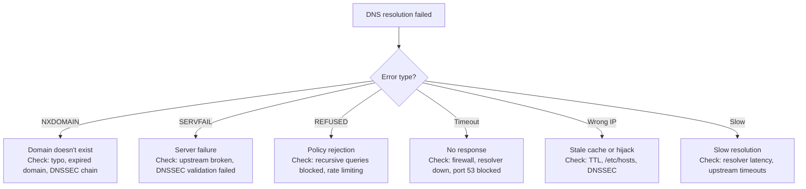

# Playbook: Debug DNS Issues

> [!summary] Goal
> Diagnose and fix DNS issues — NXDOMAIN, SERVFAIL, slow resolution, DNS poisoning, DNSSEC failures, and split-brain DNS. Step-by-step approach from client to authoritative server.

## Table of Contents

1. [DNS Issue Diagnosis Tree](#dns-issue-diagnosis-tree)
2. [Step-by-Step Debugging](#step-by-step-debugging)
3. [Common DNS Errors](#common-dns-errors)
4. [Pitfalls](#pitfalls)

---

## DNS Issue Diagnosis Tree



---

## Step-by-Step Debugging

### 1. Check local configuration

```bash
# What DNS server is configured?
cat /etc/resolv.conf                    # Linux (usually points to systemd-resolved or NetworkManager)
resolvectl status                        # systemd-resolved status

# Is the problem specific to this machine?
nslookup google.com                     # Test with local resolver
dig google.com                          # More verbose

# Check /etc/hosts
cat /etc/hosts                          # Static overrides (may override DNS)
```

### 2. Test with a public resolver

```bash
# Bypass local resolver — query 8.8.8.8 directly
dig google.com @8.8.8.8
dig google.com @1.1.1.1

# If this works but local resolver fails → problem is your DNS server
# If both fail → problem is upstream or the domain itself
```

### 3. Trace the full resolution path

```bash
# Show each step: root → TLD → authoritative
dig +trace google.com

# Interpretation:
# First lines: root servers (a.root-servers.net.)
# Next: TLD servers (.com)
# Last: authoritative nameserver (ns1.google.com)

# If the trace stops at root → your resolver can't reach root servers
# If it stops at TLD → .com servers unreachable
# If it stops at authoritative → that server is down or unreachable
```

### 4. Check specific record types

```bash
# A (IPv4)
dig google.com A

# AAAA (IPv6)
dig google.com AAAA

# MX (mail)
dig google.com MX

# If A works but AAAA fails → there's no IPv6 record
# If A fails but MX works → check the A record specifically
```

### 5. Check DNSSEC

```bash
# Check if DNSSEC is enabled for the domain
dig google.com DNSKEY                    # Zone's public signing keys
dig google.com DS                        # Delegation Signer

# Verify DNSSEC
delv google.com @8.8.8.8               # Validated lookup

# Look for the 'ad' flag (authenticated data)
dig +dnssec google.com @8.8.8.8
# Flags: qr rd ra ad  → 'ad' = DNSSEC validation passed
# If no 'ad' flag → DNSSEC validation failed or not configured
```

---

## Common DNS Errors

| dig response | Meaning | Action |
|:------------:|---------|--------|
| **status: NXDOMAIN** | Domain doesn't exist | Check for typo, domain expiry |
| **status: SERVFAIL** | Server failure (upstream timeout, DNSSEC failure) | Check resolver, try `+dnssec` |
| **status: REFUSED** | Policy rejection | Resolver is not configured for this zone |
| **status: NOERROR + 0 answers** | Record type doesn't exist | Check for A vs AAAA |
| **Query timed out** | No response received | Firewall, resolver down, port 53 blocked |

### DNSSEC validation failure

```bash
# Test DNSSEC validation
delv example.com @8.8.8.8
# If "validation failure" → DNSSEC chain is broken
# Possible causes:
# 1. Zone not properly signed
# 2. DS record missing or mismatched in parent zone
# 3. Clock skew (NTP not synced)

# Debug with:
dig example.com DNSKEY @8.8.8.8 +dnssec +multiline
dig example.com DS @whois.verisign-grs.com +multiline  # DS from parent
```

### Slow DNS resolution

```bash
# Measure query time
dig google.com +stats                    # Shows "Query time: 12 msec"

# Check why it's slow
dig +trace google.com                    # Each hop shows timing
# Look for slow responses at any level

# Common causes:
# - Slow upstream resolver (change to 1.1.1.1 or 8.8.8.8)
# - High latency to resolver (choose one geographically closer)
# - Firewall inspection of DNS traffic
# - DNSSEC validation (adds 1-2 queries)
```

---

## Pitfalls

### Clearing the wrong DNS cache

There are MULTIPLE DNS caches: browser, OS, systemd-resolved, dnsmasq, and upstream resolvers. Clearing one may not fix the problem. Clear ALL local caches: browser cache, `resolvectl flush-caches`, restart dnsmasq. Upstream caches (ISP, 8.8.8.8) clear on their own based on TTL — you can't force them.

### DNSSEC with clock skew

DNSSEC validation depends on accurate time (signature inception/expiration timestamps). If the resolver's clock is off by more than a few seconds, DNSSEC validation fails with SERVFAIL. Always run NTP on DNS servers. Check with `timedatectl`.

### Split-brain DNS

Internal DNS servers may return different IPs than external ones (e.g., internal: 10.0.0.1, external: 203.0.113.1). If you're inside the network and querying an external resolver (8.8.8.8), you get the external IP. Use the internal resolver for internal queries.

---

## Cross-Links

- [[Networking/02_Core/01_DNS_Deep_Dive]] for DNS fundamentals
- [[Networking/03_Advanced/06_Troubleshooting_Toolkit]] for dig and nslookup reference
- [[Networking/02_Core/03_TLS_and_Certificates]] for DNS-integrated certificate validation
- [[Networking/03_Advanced/04_Network_Security]] for DNS security (DNSSEC, DNS poisoning)
