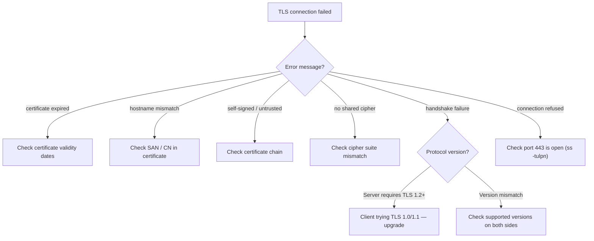

# Playbook: Debug TLS/SSL Handshake Failures

> [!summary] Goal
> Diagnose and fix TLS handshake failures — certificate expiry, hostname mismatch, untrusted CA, weak cipher suites, protocol version mismatch, and mutual TLS issues.

## Table of Contents

1. [TLS Troubleshooting Flowchart](#tls-troubleshooting-flowchart)
2. [Step-by-Step: openssl debug](#step-by-step-openssl-debug)
3. [Common TLS Errors](#common-tls-errors)
4. [Verification Commands](#verification-commands)
5. [Pitfalls](#pitfalls)

---

## TLS Troubleshooting Flowchart



---

## Step-by-Step: openssl debug

### 1. Basic connectivity test

```bash
# Test basic TLS connection
openssl s_client -connect example.com:443

# If it succeeds: can connect, see certificate chain, session established
# If it fails: "connect: Connection refused" → port isn't open
```

### 2. Check TLS version support

```bash
# Test specific TLS versions
openssl s_client -connect example.com:443 -tls1      2>/dev/null | grep -E "Protocol|error"
openssl s_client -connect example.com:443 -tls1_1    2>/dev/null | grep -E "Protocol|error"
openssl s_client -connect example.com:443 -tls1_2    2>/dev/null | grep -E "Protocol|error"
openssl s_client -connect example.com:443 -tls1_3    2>/dev/null | grep -E "Protocol|error"

# If TLS 1.3 works but TLS 1.2 doesn't: server only supports TLS 1.3
# If TLS 1.2 works but TLS 1.3 doesn't: client needs to update
```

### 3. Inspect the certificate

```bash
# View certificate details
openssl s_client -connect example.com:443 -showcerts 2>/dev/null | openssl x509 -text -noout

# Check dates
echo | openssl s_client -connect example.com:443 2>/dev/null | openssl x509 -noout -dates
# notBefore=Jan  1 00:00:00 2026 GMT
# notAfter=Dec 31 23:59:59 2026 GMT   ← if past this date, expired!

# Check hostname (SAN)
echo | openssl s_client -connect example.com:443 2>/dev/null | openssl x509 -noout -ext subjectAltName
# X509v3 Subject Alternative Name:
#     DNS:example.com, DNS:www.example.com, DNS:api.example.com
```

### 4. Check the certificate chain

```bash
# Show the full chain
openssl s_client -connect example.com:443 -showcerts 2>/dev/null

# Each -----BEGIN CERTIFICATE----- block is one certificate:
#  1. Server/leaf certificate
#  2. Intermediate CA (optional, but common)
#  3. Root CA (optional — excluded if the client already has it)

# Check chain validation
openssl s_client -connect example.com:443 -verify_return_error -CApath /etc/ssl/certs/ 2>&1

# Verify against a specific CA
openssl verify -CAfile ca.pem -untrusted intermediate.pem server.pem
```

### 5. Test cipher suites

```bash
# List supported cipher suites
openssl s_client -connect example.com:443 -cipher 'ECDHE+AESGCM' 2>/dev/null | grep "Cipher"

# Test specific cipher
openssl s_client -connect example.com:443 -cipher 'ECDHE-RSA-AES128-GCM-SHA256' 2>/dev/null

# Scan ciphers (better with sslscan or testssl.sh)
sslscan example.com:443
# testssl.sh example.com  (more comprehensive)
```

---

## Common TLS Errors

| Error | Cause | Fix |
|-------|-------|-----|
| **certificate expired** | Certificate is past the `notAfter` date | Renew certificate |
| **certificate has expired** | Same as above — older OpenSSL messages | Renew certificate |
| **self-signed certificate** | Server used a cert not signed by a trusted CA | Add CA to trust store, or use a public CA |
| **unable to get local issuer certificate** | Missing intermediate CA in chain | Server must send the full chain |
| **hostname mismatch** | CN/SAN doesn't match the hostname you connected to | Get certificate for the correct hostname |
| **no shared cipher** | Client and server don't have any cipher in common | Update both sides to support modern ciphers |
| **wrong version number** | Usually TLS version mismatch | Enable TLS 1.2+ on both sides |
| **sslv3 alert handshake failure** | Generic handshake failure | Check certificate, cipher, version |
| **tlsv1 unrecognized name** | SNI (Server Name Indication) issue | Server may not support the requested hostname |
| **connect: Connection refused** | Port 443 is closed or filtered | Check firewall, whether service is running |

### Server not sending intermediate certificate

```bash
# Symptom: browser says "untrusted" but openssl shows the server cert
# Cause: server sends only the leaf certificate, not the intermediates
# Fix: configure the server to include the full chain

# Check:
openssl s_client -connect example.com:443 -showcerts 2>/dev/null | grep "subject="
# If only one certificate, the chain is incomplete

# Correct config (Nginx):
# ssl_certificate /etc/letsencrypt/live/example.com/fullchain.pem;
```

---

## Verification Commands

```bash
# Quick TLS check
openssl s_client -connect example.com:443 -brief
# Output: CONNECTED, TLSv1.3, cipher TLS_AES_256_GCM_SHA384, peer certificate = OK

# Full debug
openssl s_client -connect example.com:443 -debug 2>&1 | head -50

# Custom CA
openssl s_client -connect internal.example.com:443 -CAfile /path/to/my-ca.pem

# Check SNI (multiple sites on same IP)
openssl s_client -connect 1.2.3.4:443 -servername site1.example.com 2>/dev/null | openssl x509 -subject -noout
openssl s_client -connect 1.2.3.4:443 -servername site2.example.com 2>/dev/null | openssl x509 -subject -noout
# Each returns a different certificate based on the requested hostname

# Automated scanning
sslscan example.com:443
testssl.sh https://example.com
nmap --script ssl-enum-ciphers -p 443 example.com
```

---

## Pitfalls

### Certificate renewal but not restarting the server

The certificate file is read when the server starts (or config is reloaded). Renewing the certificate on disk doesn't automatically apply. After renewal: `nginx -s reload`, `systemctl reload nginx`, or restart the service. Let's Encrypt's certbot does this automatically with post-hooks.

### Missing intermediate certificate

The most common certificate error. The browser has root CAs pre-installed but doesn't have all intermediates. The server MUST send the intermediate certificate along with the server certificate. Configuring `fullchain.pem` (which includes the intermediates) fixes this.

### Self-signed certificate in testing

If you use a self-signed cert for testing, tools will report "untrusted" (expected). Suppress verification with `curl -k`, `wget --no-check-certificate`, or `openssl s_client -CAfile /dev/null`. For proper testing, use a private CA and distribute the CA certificate.

---

## Cross-Links

- [[Networking/02_Core/03_TLS_and_Certificates]] for TLS fundamentals
- [[Networking/03_Advanced/06_Troubleshooting_Toolkit]] for openssl reference
- [[Networking/02_Core/02_HTTP_1_1_HTTP_2_HTTP_3]] for HTTPS context
- [[Networking/02_Core/01_DNS_Deep_Dive]] for DNS-integrated TLS (ACME)
- [[Networking/03_Advanced/04_Network_Security]] for TLS security considerations
