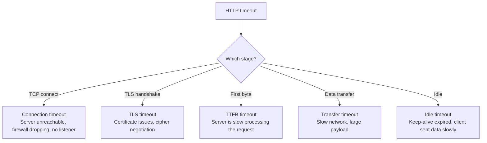

# Playbook: Debug HTTP Timeouts and Retries

> [!summary] Goal
> Diagnose and fix HTTP/HTTPS timeouts and retry issues. Understand the differences between connection timeouts, request timeouts, idle timeouts, and how to measure each with curl.

## Table of Contents

1. [Timeout Classification](#timeout-classification)
2. [Timing Breakdown with curl](#timing-breakdown-with-curl)
3. [Step-by-Step Debugging](#step-by-step-debugging)
4. [Retry Logic](#retry-logic)
5. [Pitfalls](#pitfalls)

---

## Timeout Classification

> [!info] Timeout types
> HTTP timeouts come in several flavors. A "connection timeout" means the server didn't respond to TCP SYN. A "request timeout" means the server accepted the connection but didn't send a response in time. An "idle timeout" means the server closed an idle connection.



| Timeout type | Where it occurs | Typical cause |
|:------------:|:---------------:|---------------|
| **Connection** | TCP 3-way handshake | Server down, firewall, wrong port |
| **TLS** | TLS handshake | Cipher mismatch, cert issues, TLS version |
| **TTFB (First Byte)** | After handshake, waiting for response | Server overload, slow DB, bad code |
| **Transfer** | Downloading response body | Large files, slow pipe, throttling |
| **Idle** | Between requests on keep-alive | Connection pooling misconfig |
| **DNS** | Before connection | Resolver down, wrong domain |

---

## Timing Breakdown with curl

```bash
# Full timing breakdown
curl -w "
  time_namelookup:  %{time_namelookup}s   (DNS)
  time_connect:     %{time_connect}s      (TCP handshake)
  time_appconnect:  %{time_appconnect}s   (TLS)
  time_starttransfer: %{time_starttransfer}s (TTFB)
  time_total:       %{time_total}s        (Total)

  speed_download:   %{speed_download}B/s
  http_code:        %{http_code}
  size_download:    %{size_download} bytes
" -o /dev/null -s https://example.com

# Compare HTTP/1.1 vs HTTP/2 vs HTTPS
curl -w "HTTP/1.1: %{time_total}s\n" --http1.1 -o /dev/null -s https://example.com
curl -w "HTTP/2:   %{time_total}s\n" --http2 -o /dev/null -s https://example.com
```

### Interpreting the timing

```text
DNS lookup > 1s:    DNS resolver is slow (try 1.1.1.1)
TCP connect > 1s:   Network latency or firewall delay
TLS handshake > 1s: Certificate validation or negotiation issues
TTFB > 2s:          Server processing is slow (check app/BE/DB)
Transfer rate low:  Bandwidth limitation or large payload

Compare:
  time_connect to a nearby host should be < 50ms
  time_appconnect should be < 200ms (TLS 1.3) or < 400ms (TLS 1.2)
  TTFB for a simple endpoint should be < 500ms
```

---

## Step-by-Step Debugging

### 1. Is it DNS?

```bash
# Time DNS resolution only
dig google.com +short +stats

# If DNS takes > 500ms, change resolver
# Check: /etc/resolv.conf, resolvectl status
```

### 2. Is the server reachable?

```bash
# Ping to check basic connectivity
ping -c 4 -W 2 example.com

# TCP check
time nc -zv example.com 80              # Measure TCP connection time
time nc -zv example.com 443
```

### 3. Is TLS the bottleneck?

```bash
# Measure TLS handshake time
curl -w "TCP: %{time_connect}s, TLS: %{time_appconnect}s\n" \
  -o /dev/null -s https://example.com

# TLS > 500ms → cipher negotiation, cert chain size, or OCSP
# Check:
openssl s_client -connect example.com:443 -debug 2>&1 | grep "SSL handshake"
```

### 4. Is the server processing slow?

```bash
# TTFB (First Byte) is the time between the request being sent and
# the first byte of the response being received

curl -w "TTFB: %{time_starttransfer}s\n" -o /dev/null -s https://example.com/api

# High TTFB → server-side processing (backend, database)
# Check:
# - Server load (top, htop)
# - Database query times
# - Application logs

# Compare different endpoints:
curl -w "Home: %{time_starttransfer}s\n" -o /dev/null -s https://example.com/
curl -w "API:  %{time_starttransfer}s\n" -o /dev/null -s https://example.com/api/data
curl -w "Auth: %{time_starttransfer}s\n" -o /dev/null -s https://example.com/login
```

### 5. Is the network the bottleneck?

```bash
# Bandwidth test
iperf3 -c server -t 10                     # TCP throughput

# Check for packet loss
mtr -n -c 50 example.com                   # Continuous path + loss + latency

# Traceroute
traceroute -n example.com                  # Path inspection
```

---

## Retry Logic

### Common retry mistakes

```text
❌ Immediate retry:     Same request hits the same overloaded server
❌ Unlimited retries:   Infinite retry loop — server never recovers
❌ Retry on 4xx:        400/401/403/404 will always fail — don't retry
❌ No backoff:          Retry storm — all clients retry simultaneously

✅ Exponential backoff: Wait 1s, 2s, 4s, 8s before retrying
✅ Jitter:              Add randomness: wait 1.0-2.0s, 2.0-4.0s
✅ Max retries:         3-5 retries maximum
✅ Retry on:            5xx, 429 (Retry-After), network errors
✅ Don't retry on:      4xx (except 429)
```

```bash
# curl retry options
curl --retry 3 --retry-delay 2 --retry-max-time 30 https://example.com
# Retry 3 times, wait 2s between retries, max total retry time 30s
```

### Capping timeouts

```bash
# Set timeouts on every request
curl --connect-timeout 5 --max-time 30 https://example.com
# connect-timeout: wait max 5s for TCP/TLS handshake
# max-time: wait max 30s for complete transfer

# Without timeouts, a misconfigured server can wait forever!
```

---

## Pitfalls

### Confusing connection timeout with request timeout

Connection timeout = time to establish TCP. Request timeout = time to get a response after connection. If your API is slow on the backend, increasing the connection timeout won't fix it — increase the request timeout (`--max-time` in curl).

### Not setting keep-alive timeouts

Without keep-alive, every request opens a new TCP connection (plus TLS). With long-lived keep-alive, the server may hold idle connections for hours. Set keep-alive timeouts on both client and server (typically 5-30 seconds for inactivity, 100-300 seconds total).

### Retry storms on server overload

When a server is overwhelmed, every client retry makes it worse. Implement: (a) circuit breakers — stop calling after N consecutive failures, (b) exponential backoff with jitter, (c) client-side rate limiting, (d) Retry-After header on server side.

---

## Cross-Links

- [[Networking/02_Core/02_HTTP_1_1_HTTP_2_HTTP_3]] for HTTP protocol details
- [[Networking/03_Advanced/06_Troubleshooting_Toolkit]] for curl reference
- [[Networking/01_Foundations/04_TCP_Deep_Dive]] for TCP timeout mechanics
- [[Networking/03_Advanced/05_Congestion_and_QoS]] for QoS impact on latency
- [[Networking/02_Core/06_CDN_Caching_and_Web_Performance]] for performance metrics
