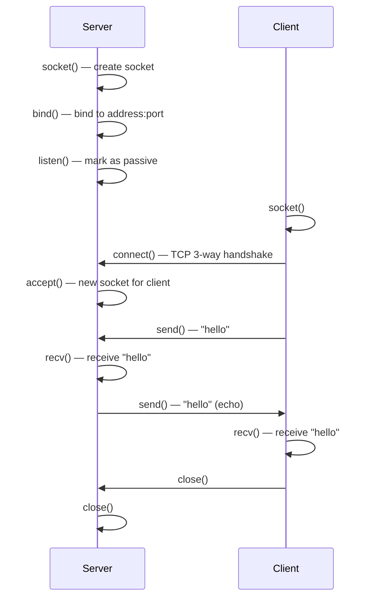

# Project: Build a TCP Echo Server and Client

> [!summary] Goal
> Build a TCP echo server and client from scratch in C and Python. Understand the socket lifecycle, blocking vs non-blocking I/O, select/poll multiplexing, and how to handle partial reads.

## Table of Contents

1. [Socket Lifecycle](#socket-lifecycle)
2. [C Implementation](#c-implementation)
3. [Python Implementation](#python-implementation)
4. [Testing and Verification](#testing-and-verification)
5. [Pitfalls](#pitfalls)

---

## Socket Lifecycle



| Function | Purpose | Blocking? |
|----------|---------|:---------:|
| `socket()` | Create an endpoint | No |
| `bind()` | Assign address to socket | No |
| `listen()` | Mark socket as passive | No |
| `accept()` | Wait for client connection | ✅ Yes |
| `connect()` | Connect to server | ✅ Yes |
| `send()` / `write()` | Send data | ✅ Yes (can block) |
| `recv()` / `read()` | Receive data | ✅ Yes (can block) |
| `close()` | Close connection | No |

---

## C Implementation

```c
#include <stdio.h>
#include <stdlib.h>
#include <string.h>
#include <unistd.h>
#include <sys/socket.h>
#include <netinet/in.h>
#include <arpa/inet.h>

#define PORT 8080
#define BUFFER_SIZE 1024

int main(void) {
    int server_fd, client_fd;
    struct sockaddr_in address;
    int opt = 1;
    int addrlen = sizeof(address);
    char buffer[BUFFER_SIZE] = {0};

    // Create
    server_fd = socket(AF_INET, SOCK_STREAM, 0);
    if (server_fd < 0) { perror("socket"); exit(1); }

    // Reuse address
    setsockopt(server_fd, SOL_SOCKET, SO_REUSEADDR, &opt, sizeof(opt));

    // Bind
    address.sin_family = AF_INET;
    address.sin_addr.s_addr = INADDR_ANY;
    address.sin_port = htons(PORT);
    if (bind(server_fd, (struct sockaddr *)&address, sizeof(address)) < 0) {
        perror("bind"); exit(1);
    }

    // Listen
    if (listen(server_fd, 3) < 0) { perror("listen"); exit(1); }
    printf("Server listening on port %d\n", PORT);

    // Accept
    client_fd = accept(server_fd, (struct sockaddr *)&address,
                       (socklen_t *)&addrlen);
    if (client_fd < 0) { perror("accept"); exit(1); }

    printf("Client connected: %s\n", inet_ntoa(address.sin_addr));

    // Echo loop
    int n;
    while ((n = read(client_fd, buffer, BUFFER_SIZE)) > 0) {
        write(client_fd, buffer, n);
        memset(buffer, 0, BUFFER_SIZE);
    }

    close(client_fd);
    close(server_fd);
    return 0;
}
```

---

## Python Implementation

```python
import socket
import sys

def echo_server(host='0.0.0.0', port=8080):
    server = socket.socket(socket.AF_INET, socket.SOCK_STREAM)
    server.setsockopt(socket.SOL_SOCKET, socket.SO_REUSEADDR, 1)
    server.bind((host, port))
    server.listen(5)
    print(f"Server listening on {host}:{port}")

    while True:
        client, addr = server.accept()
        print(f"Client connected: {addr}")
        with client:
            while True:
                data = client.recv(1024)
                if not data:
                    break
                client.sendall(data)  # Echo
                print(f"Echo: {data.decode().strip()}")

def echo_client(host='127.0.0.1', port=8080):
    client = socket.socket(socket.AF_INET, socket.SOCK_STREAM)
    client.connect((host, port))
    print(f"Connected to {host}:{port}")
    print("Type messages (Ctrl+C to quit)")

    try:
        while True:
            msg = input("> ")
            client.sendall(msg.encode())
            response = client.recv(1024)
            print(f"Echo: {response.decode()}")
    except KeyboardInterrupt:
        pass
    finally:
        client.close()

if __name__ == '__main__':
    if len(sys.argv) > 1 and sys.argv[1] == 'client':
        echo_client()
    else:
        echo_server()
```

---

## Testing and Verification

```bash
# Compile and run C server
gcc -o echo_server echo_server.c
./echo_server

# Test with nc (netcat) in another terminal
nc -v localhost 8080
# Type "hello" → server echoes "hello"
# Type Ctrl+C to exit

# Run Python server
python3 echo_server.py

# Test Python client
python3 echo_server.py client

# Test with curl (HTTP over TCP won't work — not HTTP)
# Use nc for raw TCP

# Test from another machine
nc -v server-ip 8080

# Capture the echo with tcpdump
tcpdump -i any -nn 'port 8080'

# Measure throughput
echo "This is a test message" | nc localhost 8080
# Should print back: This is a test message
```

---

## Pitfalls

### Not handling partial reads

TCP is a stream protocol — one `send()` may be split into multiple `recv()` calls, or multiple `send()`s may be combined into one `recv()`. Always loop: `while (total < expected) { n = read(fd, buf + total, remaining); total += n; }`.

### Blocking accept

A single-process echo server can only handle one client at a time. To handle multiple clients: (a) fork per client, (b) thread per client, (c) non-blocking I/O with select/poll/epoll.

### Not setting SO_REUSEADDR

Without `SO_REUSEADDR`, restarting the server fails with "Address already in use" because the previous socket is in TIME_WAIT state.

---

## Cross-Links

- [[Networking/01_Foundations/04_TCP_Deep_Dive]] for TCP stream semantics
- [[Networking/03_Advanced/06_Troubleshooting_Toolkit]] for nc and tcpdump testing
- [[C/03_Advanced/04_Socket_Programming]] for C socket programming
- [[C/02_Core/02_File_IO_and_POSIX_System_Calls]] for read/write system calls
- [[Networking/02_Core/04_Proxies_NAT_and_Firewalls]] for port forwarding to echo server
