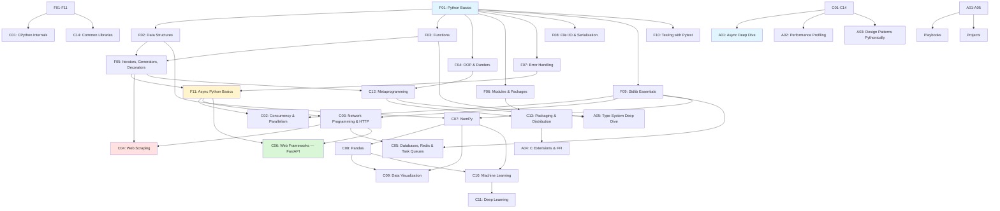

# Python

> [!summary] Scope
> Complete Python reference from language fundamentals through CPython internals, async, web frameworks, data science, metaprogramming, performance profiling, and production deployment. Covers all major libraries: FastAPI, SQLAlchemy, NumPy, Pandas, scikit-learn, PyTorch, Scrapy, Celery, Redis, httpx, Typer, Rich, and more.

## Learning Path

## Topic Map

### Foundations (11 files)

| File | Topics |
|------|--------|
| **F01** [[Python/01_Foundations/01_Python_Basics]] | Dynamic typing, numbers, strings (f-strings), `bool`, `is` vs `==`, control flow, comprehensions, walrus `:=`, naming |
| **F02** [[Python/01_Foundations/02_Data_Structures]] | `list`/`dict`/`set` internals, `tuple`, `deque`, `Counter`, `defaultdict`, mutable default args pitfall |
| **F03** [[Python/01_Foundations/03_Functions_Deep_Dive]] | `*args`/`**kwargs`, positional-only `/`, keyword-only `*`, closures, `nonlocal`, annotations, `@lru_cache`, `functools.partial` |
| **F04** [[Python/01_Foundations/04_OOP_Classes_Dunder_Methods]] | `__init__`/`__new__`, `@property`, `@staticmethod`/`@classmethod`, inheritance/MRO, `super()`, `__slots__`, `dataclasses`, descriptors intro |
| **F05** [[Python/01_Foundations/05_Iterators_Generators_Decorators]] | `__iter__`/`__next__`, `yield`/`yield from`, `itertools`, decorator pattern, `@contextmanager`, `@wraps` |
| **F06** [[Python/01_Foundations/06_Modules_Packages_Virtual_Envs]] | `import` mechanics (finder/loader), `__init__.py`, `__all__`, relative imports, `venv`, `pip`, `pyproject.toml` |
| **F07** [[Python/01_Foundations/07_Error_Handling_Context_Managers]] | `try`/`except`/`else`/`finally`, `raise from`, custom exceptions, `with` protocol, `contextlib`, pitfalls |
| **F08** [[Python/01_Foundations/08_File_IO_Serialization]] | `open()`, `pathlib.Path`, `io.StringIO`/`BytesIO`, `json`, `csv`, `pickle`, `tomllib`, `configparser`, `shutil` |
| **F09** [[Python/01_Foundations/09_Stdlib_Essentials]] | `datetime`, `re`, `math`, `argparse`, `logging`, `functools`/`itertools`, `typing` basics |
| **F10** [[Python/01_Foundations/10_Testing_with_Pytest]] | `pytest` fixtures, `parametrize`, `conftest.py`, mocking, `pytest-asyncio`, `factory_boy`, `Faker`, `vcrpy`, coverage |
| **F11** [[Python/01_Foundations/11_Async_Python_Basics]] | `async`/`await`, `asyncio.run`, Tasks, `gather`, `asyncio.Queue`, `aiohttp` intro, `asyncio.Lock` |

### Core (15 files)

| File | Topics |
|------|--------|
| **C01** [[Python/02_Core/01_CPython_Internals]] | `PyObject` struct, bytecode (`dis`), GIL internals, refcounting, cyclic GC (generational), pymalloc, type objects, `__slots__` |
| **C02** [[Python/02_Core/02_Concurrency_Parallelism]] | `threading` (Lock/RLock/Condition/Semaphore), GIL impact, `multiprocessing` (Pool/Queue/Manager), `concurrent.futures`, `subprocess` |
| **C03** [[Python/02_Core/03_Network_Programming_HTTP]] | `socket` (TCP/UDP), `selectors`, `requests` (session, timeout, retry), `httpx` (async, HTTP/2), `websockets`, gRPC overview |
| **C04** [[Python/02_Core/04_Web_Scraping]] | `BeautifulSoup`, `lxml`, `Scrapy` (spiders, pipelines, middlewares), `Selenium`/`Playwright`, anti-detection, pagination, async scraping |
| **C05** [[Python/02_Core/05_Databases_Redis_Task_Queues]] | SQLAlchemy 2.0 ORM + Core, Alembic, `asyncpg`, `aiosqlite`, `Motor`, `redis-py` (cache, pub/sub), `Celery`/`RQ`, connection pooling |
| **C06** [[Python/02_Core/06_Web_Frameworks_FastAPI]] | Full FastAPI: routing, Pydantic v2, DI, middleware, lifespan, WebSocket, testing, deployment. Flask/Django comparison |
| **C07** [[Python/02_Core/07_NumPy_Deep_Dive]] | ndarray (strides, contiguity), broadcasting, ufuncs, indexing, `np.where`, `linalg`, random, structured arrays |
| **C08** [[Python/02_Core/08_Pandas_Deep_Dive]] | Series/DataFrame internals, groupby, merge/join, multi-index, time series, I/O, chaining, pitfalls |
| **C09** [[Python/02_Core/09_Data_Visualization]] | matplotlib OOP API, seaborn, plotly interactive, subplots, custom styles, when to use which |
| **C10** [[Python/02_Core/10_Machine_Learning]] | scikit-learn estimator API, Pipelines, ColumnTransformer, CV, grid search, feature engineering, model persistence |
| **C11** [[Python/02_Core/11_Deep_Learning_PyTorch]] | Tensor, `nn.Module`, autograd, training loop, DataLoader, GPU, CNN example, saving/loading |
| **C12** [[Python/02_Core/12_Metaprogramming_Descriptors]] | `__getattr__`/`__setattr__`, descriptors (`__get__`/`__set__`), `__init_subclass__`, `__set_name__`, metaclasses, `@dataclass` internals |
| **C13** [[Python/02_Core/13_Packaging_Distribution]] | `pyproject.toml`, setuptools, entry points, wheel, twine, C extensions, mypyc, PyInstaller, cibuildwheel |
| **C14** [[Python/02_Core/14_Common_Libraries_Reference]] | Typer, Rich, Pydantic v2, pydantic-settings, Loguru, attrs, tqdm, python-dotenv |

### Advanced (5 files)

| File | Topics |
|------|--------|
| **A01** [[Python/03_Advanced/01_Async_Deep_Dive]] | Event loop internals, coroutine protocol, `Future` vs `Task`, `asyncio.Queue`/`Lock`/`Semaphore`, `anyio`/`trio` comparison, debugging |
| **A02** [[Python/03_Advanced/02_Performance_Profiling]] | `cProfile`, `py-spy`, `memory_profiler`, `tracemalloc`, flamegraphs, `dis`, Cython, Numba, mypyc, numpy vectorization |
| **A03** [[Python/03_Advanced/03_Design_Patterns_Pythonically]] | Singleton, Factory, Observer, Strategy, Adapter, DI — Pythonic implementations with closures, descriptors, `__init_subclass__` |
| **A04** [[Python/03_Advanced/04_C_Extensions_FFI]] | `ctypes`, `cffi`, `pybind11`, `Cython` `.pyx`, numpy C API, setuptools build |
| **A05** [[Python/03_Advanced/05_Type_System_Deep_Dive]] | `Protocol`, `TypedDict`, `Literal`, `Final`, `@overload`, `TypeGuard`, `Self`, `Never`, `mypy` strict, `.pyi` stubs |

### Playbooks (3 files)

| File | Topics |
|------|--------|
| **P01** [[Python/04_Playbooks/01_Debug_Memory_Leaks]] | `tracemalloc`, `objgraph`, `gc` module, `py-spy`, leak patterns, `asyncio` memory leaks |
| **P02** [[Python/04_Playbooks/02_Debug_Concurrency]] | Race conditions, deadlocks, `asyncio` debugging, `multiprocessing` pickling, signal safety |
| **P03** [[Python/04_Playbooks/03_Production_Readiness]] | Logging (dictConfig, structured), config (pydantic-settings), secrets, Docker, health checks, graceful shutdown, CI/CD, monitoring |

### Projects (3 files)

| File | Topics |
|------|--------|
| **Pr01** [[Python/05_Projects/01_REST_API_FastAPI_Postgres]] | FastAPI + SQLAlchemy async + Alembic + pytest + Docker Compose |
| **Pr02** [[Python/05_Projects/02_Async_Web_Scraper]] | `aiohttp` + `BeautifulSoup` + backoff + rate limiting + structured logging |
| **Pr03** [[Python/05_Projects/03_CLI_Tool_Typer_Rich]] | Typer + Rich + httpx + pytest + PyPI publish |

## Recommended Paths

| Path | Files | Target |
|------|-------|--------|
| **Quick Start** | F01-F06, F09 | Learn Python in a week |
| **Backend Engineer** | F01-F11, C02-C06, C12-C14 | Build production services |
| **Data Science** | F01-F04, C07-C11 | NumPy → Pandas → Viz → ML → DL |
| **Performance** | C01, A02, P01 | Profile and optimize Python code |
| **CLI/Tools** | F01-F06, C14, Pr03 | Build and ship CLI tools |

## Cross-Links

- [[DSA/DataStructures]] for data structure fundamentals
- [[DSA/Algorithms]] for algorithm patterns
- [[CICD/Docker/00_MOC/00_Docker_MOC]] for containerisation
- [[CICD/GitHubActions/00_MOC/00_GitHubActions_MOC]] for CI/CD
- [[SystemDesign/00_MOC/00_SystemDesign_MOC]] for system design concepts
- [[C++/00_MOC/00_Cpp_MOC]] for C++ performance comparison

## References

- [Python Documentation](https://docs.python.org/3/)
- [CPython Source](https://github.com/python/cpython)
- [Python Packaging Guide](https://packaging.python.org/)
- [Real Python](https://realpython.com/)
- [PEP Index](https://peps.python.org/)
