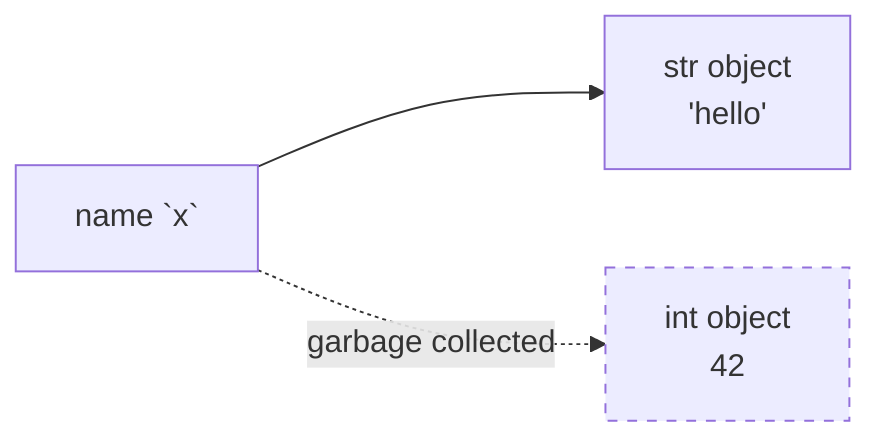

# Python Basics

> [!summary] Goal
> Master Python's type system, core syntax, control flow, comprehensions, and naming conventions — the foundation everything else builds on.

## Table of Contents

1. [Dynamic Typing and Names](#dynamic-typing-and-names)
2. [Numbers and Arithmetic](#numbers-and-arithmetic)
3. [Strings and f-strings](#strings-and-f-strings)
4. [Booleans and Truthiness](#booleans-and-truthiness)
5. [`is` vs `==`](#is-vs-)
6. [Control Flow](#control-flow)
7. [Comprehensions](#comprehensions)
8. [Walrus Operator `:=`](#walrus-operator-)
9. [Naming Conventions](#naming-conventions)
10. [Pitfalls](#pitfalls)

---

## Dynamic Typing and Names

> [!info] Everything is an object
> In Python, **everything** — integers, strings, functions, classes — is a runtime object. Variables are **names** that reference objects, not typed containers. The type lives on the object, not the name.

```python
x = 42          # x → int object(42)
x = "hello"     # x → str object("hello")   # Same name, different type — perfectly fine
x = [1, 2, 3]   # x → list object([1, 2, 3]) # Re-bound again
```



### Mutable vs Immutable

| Category | Types | Mutable? |
|----------|-------|:--------:|
| Numbers | `int`, `float`, `complex` | ❌ |
| Strings | `str`, `bytes` | ❌ |
| Booleans | `bool` | ❌ |
| Tuples | `tuple` | ❌ |
| Lists | `list` | ✅ |
| Dicts | `dict` | ✅ |
| Sets | `set`, `frozenset` | ✅ (`set` only) |

```python
# Immutable: operations create new objects
x = 42
y = x + 1          # x is still 42; y is a NEW int

# Mutable: operations modify in place
xs = [1, 2, 3]
xs.append(4)       # xs is the SAME list, now [1, 2, 3, 4]
```

---

## Numbers and Arithmetic

```python
# int — arbitrary precision (unlike C/Java)
big = 2**1000      # Works fine, no overflow

# float — IEEE 754 double precision
pi = 3.14159
tiny = 1e-300

# Division always returns float
5 / 2   # 2.5
5 // 2  # 2   (floor division)
5 % 2   # 1   (modulo)

# Complex numbers
c = 1 + 2j
c.real  # 1.0
c.imag  # 2.0

# Underscore separators (PEP 515)
million = 1_000_000
hex_mask = 0xFF_FF_FF_FF
```

> [!warning] Float equality
> Never compare floats with `==`. Use `math.isclose(a, b, rel_tol=1e-9)` instead.

---

## Strings and f-strings

```python
# Creation
s1 = 'single quotes'
s2 = "double quotes"
s3 = """multi
line"""

# f-strings (Python 3.6+) — preferred
name = "Alice"
age = 30
print(f"{name} is {age} years old")    # "Alice is 30 years old"

# Expressions inside f-strings
print(f"2 + 2 = {2 + 2}")              # "2 + 2 = 4"

# Format spec
pi = 3.14159265
print(f"{pi:.2f}")                     # "3.14"
print(f"{pi:>10.2f}")                  # "      3.14"  (right-aligned, width 10)

# Raw strings (regex, Windows paths)
raw = r"C:\Users\name\file.txt"        # No escaping needed

# Methods
s = "hello world"
s.upper()          # "HELLO WORLD"
s.split()          # ["hello", "world"]
s.startswith("h")  # True
" ".join(["a", "b"])  # "a b"
```

---

## Booleans and Truthiness

```python
# Falsy values (evaluated as False in boolean context)
False, None, 0, 0.0, 0j, "", [], (), {}, set(), range(0)

# Truthy values — everything else
True, 1, -1, "hello", [0], (None,), {0: "zero"}

# Short-circuit evaluation
def get_user():
    print("get_user called")
    return {"name": "Alice"}

user = get_user() or {"name": "Guest"}   # If get_user returns falsy, use default
```

---

## `is` vs `==`

```python
a = [1, 2, 3]
b = [1, 2, 3]
c = a

a == b   # True   — same VALUE
a is b   # False  — different OBJECTS
a is c   # True   — same OBJECT

# Common pitfall: comparing to None
x = None
x is None     # ✅ correct
x == None     # ❌ technically works but is the wrong idiom
```

> [!tip] Rule of thumb
> - Use `==` for value comparison
> - Use `is` for `None`, `True`, `False`, and singleton checks
> - `is` is faster (pointer comparison, no `__eq__` call)

---

## Control Flow

```python
# if / elif / else
x = 42
if x < 0:
    print("negative")
elif x == 0:
    print("zero")
else:
    print("positive")

# for loop — always iterates over an iterable
for i in range(5):        # 0, 1, 2, 3, 4
    print(i)

for idx, val in enumerate(["a", "b", "c"]):
    print(f"{idx}: {val}")  # 0: a, 1: b, 2: c

for key, val in {"name": "Alice", "age": 30}.items():
    print(f"{key}={val}")

# while loop
count = 0
while count < 3:
    count += 1

# break / continue / else on loops
for n in range(10):
    if n == 5:
        break
else:
    print("never reached")    # Only runs if loop completed without break
```

---

## Comprehensions

```python
# List comprehension — the Pythonic way to build lists
squares = [x**2 for x in range(10)]          # [0, 1, 4, 9, 16, 25, 36, 49, 64, 81]

# With condition
evens = [x for x in range(10) if x % 2 == 0]  # [0, 2, 4, 6, 8]

# Nested
matrix = [[i + j for j in range(3)] for i in range(3)]

# Dict comprehension
square_map = {x: x**2 for x in range(5)}     # {0: 0, 1: 1, 2: 4, 3: 9, 4: 16}

# Set comprehension
unique = {x % 3 for x in range(10)}          # {0, 1, 2}

# Generator expression (lazy — see F05)
total = sum(x**2 for x in range(1_000_000))   # No list built
```

---

## Walrus Operator `:=`

> [!info] Assignment expression (PEP 572, Python 3.8+)
> Assigns a value within an expression. Useful to avoid repeating expensive calls.

```python
# Without walrus — calls get_data() twice
data = get_data()
if data is not None:
    process(data)

# With walrus — calls once
if (data := get_data()) is not None:
    process(data)

# In list comprehensions
results = [y for x in data if (y := transform(x)) is not None]

# In while loops
while (line := file.readline()) != "":
    print(line)
```

---

## Naming Conventions

| Pattern | Use | Example |
|---------|-----|---------|
| `snake_case` | Variables, functions, methods | `get_user()`, `file_size` |
| `UPPER_SNAKE_CASE` | Constants | `MAX_RETRIES = 3` |
| `PascalCase` | Classes, exceptions | `class FileReader`, `class ValidationError` |
| `_single_leading` | Internal / private-by-convention | `_internal_helper()` |
| `__double_leading` | Name mangling in classes | `__private_attr` → `_ClassName__private_attr` |
| `__dunder__` | Magic methods (don't invent) | `__init__`, `__str__`, `__eq__` |

> [!tip] PEP 8
> Follow [PEP 8](https://peps.python.org/pep-0008/) consistently. Use `ruff` or `black` to auto-format.

---

## Pitfalls

### Mutable default arguments

```python
def add_item(item, items=[]):    # ❌ List is created ONCE at function definition
    items.append(item)
    return items

add_item(1)   # [1]
add_item(2)   # [1, 2] — NOT [2]!
```

```python
def add_item(item, items=None):  # ✅ Correct
    if items is None:
        items = []
    items.append(item)
    return items
```

### Late binding closures

```python
funcs = [lambda: i for i in range(5)]
[f() for f in funcs]   # [4, 4, 4, 4, 4] — all see the same `i` from enclosing scope

# Fix: capture by default argument
funcs = [lambda i=i: i for i in range(5)]
[f() for f in funcs]   # [0, 1, 2, 3, 4]
```

### Chained comparisons

```python
x = 5
1 < x < 10    # True — Python evaluates as 1 < x and x < 10

# This works but is confusing:
5 > x < 10    # 5 > x and x < 10
```

---

> [!question]- Interview Questions
>
> **Q: What's the difference between `is` and `==`?**
> A: `==` checks value equality (calls `__eq__`). `is` checks identity equality (same object in memory). Use `is` for `None`, `True`, `False`, and singletons. Use `==` for everything else.
>
> **Q: How does Python handle dynamic typing?**
> A: Variables are names that reference objects. The type is stored on the object (via `ob_type` in CPython), not on the name. A name can reference any type at any time. This gives flexibility but means type errors are only caught at runtime (unless you use `mypy`).
>
> **Q: What are comprehensions and when should you prefer them over loops?**
> A: Comprehensions are expressions that build lists/dicts/sets in a single line. Prefer them when the logic fits in a single expression (mapping + optional filter). For complex logic, side effects, or try/except blocks, use a regular for loop.

---

## Cross-Links

- [[Python/01_Foundations/02_Data_Structures]] for `list`/`dict`/`set` internals
- [[Python/01_Foundations/03_Functions_Deep_Dive]] for function parameters and closures
- [[Python/01_Foundations/09_Stdlib_Essentials]] for `math`, `datetime`, `re`
- [[Python/01_Foundations/10_Good_Coding_Practices]] — file doesn't exist yet, referencing general conventions
