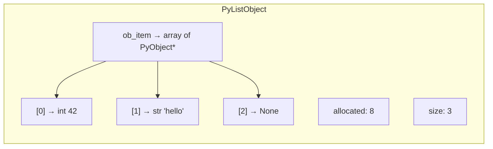
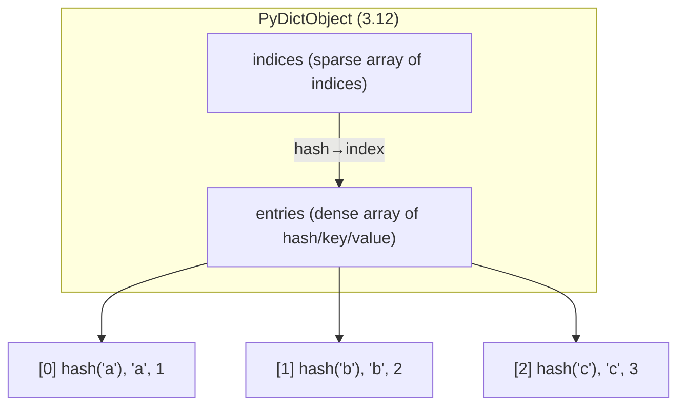

# Data Structures

> [!summary] Goal
> Understand Python's built-in data structures at the API and internals level — when to use which, how they work under the hood, and common pitfalls.

## Table of Contents

1. [List](#list)
2. [Tuple](#tuple)
3. [Dict](#dict)
4. [Set](#set)
5. [collections Module](#collections-module)
6. [Pitfalls](#pitfalls)

---

## List

> [!info] `list` — dynamic array
> Python's list is a **dynamic array** of `PyObject*` pointers. It overallocates to make `append` amortised O(1). Indexing is O(1); insert/delete at the front is O(n).

### Internals



```python
# Overallocation pattern (CPython 3.12):
# New empty list: allocated = 0
# First append:   allocated = 4
# Growth:  0 → 4 → 8 → 16 → 25 → 35 → 46 → ...
# Formula: new_allocated = (size >> 3) + (size < 9 ? 3 : 6) + size

import sys
xs = []
sys.getsizeof(xs)    # 56 bytes (empty list overhead)
xs.append(1)
sys.getsizeof(xs)    # 88 bytes (after first overallocation)
```

### Key Operations

```python
# Creation
empty = []
literal = [1, 2, 3]
from_iter = list(range(5))
repeated = [0] * 10           # [0, 0, 0, 0, 0, 0, 0, 0, 0, 0]

# Indexing and slicing
xs = [0, 1, 2, 3, 4]
xs[0]       # 0
xs[-1]      # 4  (last element)
xs[1:3]     # [1, 2]  (copy — O(k))
xs[::-1]    # [4, 3, 2, 1, 0]  (reversed copy)

# Mutation
xs.append(5)           # O(1) amortised
xs.extend([6, 7])      # O(k)
xs.insert(0, -1)       # O(n) — shifts all elements
xs.pop()               # O(1) — remove from end
xs.pop(0)              # O(n) — remove from front
xs.remove(3)           # O(n) — find and remove first match
del xs[2]              # O(n) — delete by index

# Searching
xs.index(3)            # O(n) — raises ValueError if not found
3 in xs                # O(n) — membership test
xs.count(3)            # O(n) — count occurrences

# Sorting
xs.sort()              # O(n log n) — in-place, Timsort
sorted(xs)             # returns new sorted list
xs.sort(key=len)       # sort by key function
xs.sort(reverse=True)  # descending
```

> [!warning] List multiplication with mutable objects
> `[[0]] * 5` creates **one** inner list repeated 5 times — mutating one affects all. Use `[[0] for _ in range(5)]` instead.

---

## Tuple

> [!info] `tuple` — immutable sequence
> Tuples are fixed-size arrays. Because they're immutable, they can be used as dict keys and set elements. They're also more memory-efficient than lists.

```python
# Creation
empty = ()
single = (42,)          # Trailing comma required!
pair = (1, 2)
without_parens = 1, 2   # Tuple packing — same as (1, 2)

# Unpacking
a, b = (1, 2)           # a=1, b=2
a, *rest = (1, 2, 3, 4) # a=1, rest=[2, 3, 4] (Python 3+)

# Named tuple
from collections import namedtuple
Point = namedtuple("Point", ["x", "y"])
p = Point(1, 2)
p.x     # 1
p[0]    # 1
```

> [!tip] When to use tuple vs list
> - **Tuple**: fixed-size heterogeneous data (records, function return values, dict keys)
> - **List**: variable-size homogeneous data (sequences you'll append to, sort, or modify)

---

## Dict

> [!info] `dict` — hash table
> Python's dict is a **sparse hash table** with open addressing (since 3.6: compact + insertion-order preserving). Keys must be hashable (implement `__hash__` and `__eq__`).

### Internals



```python
# Creation
empty = {}
literal = {"a": 1, "b": 2}
from_pairs = dict([("a", 1), ("b", 2)])
from_keys = dict.fromkeys(["a", "b"], 0)   # {"a": 0, "b": 0}
comprehension = {x: x**2 for x in range(5)}

# Access
d = {"a": 1, "b": 2}
d["a"]               # 1 — raises KeyError if missing
d.get("a")           # 1 — returns None if missing
d.get("c", 0)        # 0 — default
d.setdefault("c", 3) # sets d["c"] = 3 if key missing, returns value
d.setdefault("c", 10) # returns 3 (existing value unchanged)

# Mutation
d["d"] = 4           # insert or update
d.update({"e": 5})   # batch update
del d["a"]           # O(1) — raises KeyError if missing

# Iteration
for key in d: ...                  # keys
for key in d.keys(): ...           # explicit keys (view)
for val in d.values(): ...         # values (view)
for key, val in d.items(): ...     # key-value pairs (view — most common)
```

> [!warning] Dict views are dynamic
> `d.keys()`, `d.values()`, `d.items()` return **views** — they reflect changes to the dict in real time. Don't modify the dict while iterating over a view.

### Hashability

```python
# Hashable: int, str, tuple (of hashables), frozenset
hash(42)              # 42
hash("hello")         # some large integer
hash((1, 2, 3))       # works
hash([1, 2])          # ❌ TypeError: unhashable type: 'list'
hash({1, 2})          # ❌ TypeError: unhashable type: 'set'
```

---

## Set

> [!info] `set` — hash table of keys only
> A `set` is a dict with values omitted. Same hash-table implementation, same hashability constraints. `frozenset` is the immutable version.

```python
# Creation
empty = set()          # NOT {} — that's an empty dict
literal = {1, 2, 3}
from_iter = set([1, 2, 3])
comprehension = {x for x in range(5)}

# Set operations
a = {1, 2, 3}
b = {3, 4, 5}

a | b   # union:     {1, 2, 3, 4, 5}
a & b   # intersect: {3}
a - b   # difference: {1, 2}
a ^ b   # symmetric: {1, 2, 4, 5}

a <= b  # subset?   False
a >= b  # superset? False
a.isdisjoint(b)  # False

# Mutation
a.add(4)
a.remove(4)    # raises KeyError if missing
a.discard(4)   # no error if missing
a.pop()        # remove and return arbitrary element
```

---

## collections Module

| Class | When to use |
|-------|-------------|
| `deque` | O(1) append/pop at **both** ends. Great for queues, sliding windows |
| `Counter` | Count hashable items. `most_common(n)`, arithmetic `+`/`-`/`&`/`|` |
| `defaultdict` | Dict that auto-creates missing keys with a factory |
| `OrderedDict` | Dict with guaranteed insertion order (redundant since 3.7, but has `move_to_end`) |
| `namedtuple` | Lightweight immutable record type |
| `ChainMap` | Combine multiple dicts into one view (good for scoped config) |

```python
from collections import deque, Counter, defaultdict, ChainMap

# deque — O(1) at both ends
dq = deque(maxlen=3)    # bounded deque — auto-evicts old items
dq.append(1)
dq.appendleft(2)
dq.pop()                # from right
dq.popleft()            # from left

# Counter
c = Counter("hello world")
c.most_common(3)        # [('l', 3), ('o', 2), ('h', 1)]

# defaultdict
d = defaultdict(list)
d["key"].append(1)      # No KeyError — auto-creates empty list

# ChainMap
defaults = {"theme": "dark", "lang": "en"}
overrides = {"theme": "light"}
config = ChainMap(overrides, defaults)
config["theme"]         # "light" — overrides wins
config["lang"]          # "en" — falls back to defaults
```

---

## Pitfalls

### Mutable default arguments

```python
def add_to(item, items=[]):   # The list is created once at definition time
    items.append(item)
    return items

add_to(1)   # [1]
add_to(2)   # [1, 2]  — same list!
```

Fixed with `None`:

```python
def add_to(item, items=None):
    if items is None:
        items = []
    items.append(item)
    return items
```

### Modifying a list/dict while iterating

```python
# ❌ Don't modify while iterating
items = [1, 2, 3, 4]
for i, item in enumerate(items):
    if item % 2 == 0:
        del items[i]   # Skips next element!

# ✅ Correct: build a new list
items = [x for x in items if x % 2 != 0]

# ✅ Or iterate over a copy
for item in items[:]:   # slice copy
    if item % 2 == 0:
        items.remove(item)
```

### Dict key type consistency

```python
d = {}
d[1] = "int"
d[1.0] = "float"     # Overwrites! 1 == 1.0 is True
d[(1,)] = "tuple"    # Separate key — (1,) != 1
```

---

> [!question]- Interview Questions
>
> **Q: How does `dict` handle hash collisions?**
> A: CPython uses open addressing (since 3.6: compact dict with sparse index + dense entries). When two keys hash to the same index, it probes for the next free slot using perturbed quadratic probing. The dense entries array preserves insertion order.
>
> **Q: When would you use `deque` over `list`?**
> A: When you need O(1) append/pop at both ends. `list` only has O(1) at the end; `list.pop(0)` and `list.insert(0, x)` are O(n). Use `deque` for queues, sliding windows, and round-robin schedulers.
>
> **Q: Why can't you use a `list` as a `dict` key?**
> A: Dict keys must be hashable, meaning they need `__hash__()` and `__eq__()`. Lists are mutable, so their hash would change if modified. If a list mutated while in a dict, the dict would break. Tuples (immutable) are hashable if all their elements are hashable.

---

## Cross-Links

- [[Python/01_Foundations/01_Python_Basics]] for type system fundamentals
- [[Python/02_Core/01_CPython_Internals]] for `PyDictObject` and `PyListObject` source
- [[Python/01_Foundations/09_Stdlib_Essentials]] for `itertools`, `functools`
