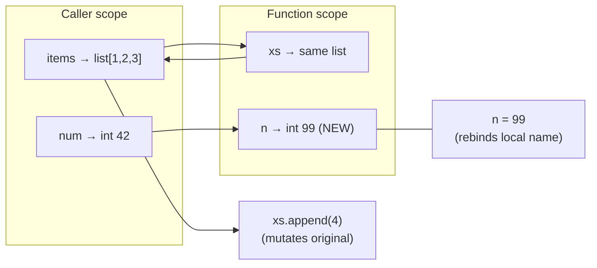

# Functions Deep Dive

> [!summary] Goal
> Master Python functions: parameter passing, closures, function annotations, `functools` utilities, and common patterns.

## Table of Contents

1. [Parameter Passing](#parameter-passing)
2. [Positional-Only and Keyword-Only](#positional-only-and-keyword-only)
3. [`*args` and `**kwargs`](#args-and-kwargs)
4. [Closures](#closures)
5. [`nonlocal` and `global`](#nonlocal-and-global)
6. [Annotations](#annotations)
7. [Lambdas](#lambdas)
8. [`functools` Utilities](#functools-utilities)
9. [Pitfalls](#pitfalls)

---

## Parameter Passing

> [!info] "Call by sharing"
> Python uses **call by sharing** (sometimes called "call by object reference"). The function receives a reference to the same object. If the object is mutable, modifications inside the function are visible outside. If it's immutable (int, str, tuple), "modification" creates a new object and rebinds the local name.

```python
def mutate(xs, d, n):
    xs.append(4)       # Mutates the original list
    d["new"] = "val"   # Mutates the original dict
    n = 99             # Reassigns LOCAL name n — original int unchanged

items = [1, 2, 3]
config = {"a": 1}
num = 42

mutate(items, config, num)
items   # [1, 2, 3, 4]  — changed
config  # {"a": 1, "new": "val"}  — changed
num     # 42  — unchanged
```



---

## Positional-Only and Keyword-Only

```python
# Positional-only (PEP 570, Python 3.8+)
def div(a, b, /):
    return a / b

div(10, 2)       # ✅ 5.0
div(a=10, b=2)   # ❌ TypeError — / prevents keyword args

# Keyword-only (Python 3+)
def safe_div(a, b, *, clamp=True):
    result = a / b
    return min(result, 1e6) if clamp else result

safe_div(10, 2)               # ✅ 5.0
safe_div(10, 2, False)        # ❌ TypeError — * prevents positional
safe_div(10, 2, clamp=False)  # ✅ 5.0

# Combined
def func(a, b, /, c, d, *, e, f):
    pass

func(1, 2, 3, d=4, e=5, f=6)  # ✅
```

> [!tip] When to use which
> - **Positional-only** (`/`): when parameter names are meaningless (e.g., `div(a, b, /)`)
> - **Keyword-only** (`*`): when you want to force explicit naming for clarity or to leave room for future positional params

---

## `*args` and `**kwargs`

```python
def log(level, *messages, **metadata):
    """Log with variable number of messages and metadata."""
    prefix = f"[{level}]"
    for msg in messages:
        print(f"{prefix} {msg}")
    for key, val in metadata.items():
        print(f"{prefix}   {key}={val}")

log("INFO", "Server started", "Listening on :8080",
    user="alice", duration_ms=42)
# [INFO] Server started
# [INFO] Listening on :8080
# [INFO]    user=alice
# [INFO]    duration_ms=42

# Unpacking
def add(a, b, c):
    return a + b + c

args = (1, 2, 3)
add(*args)            # 6 — unpack tuple

kwargs = {"a": 1, "b": 2, "c": 3}
add(**kwargs)          # 6 — unpack dict
```

> [!warning] Argument order
> Parameters must be in this order: positional, `*args`, keyword-only, `**kwargs`. Violating this is a syntax error.

---

## Closures

> [!info] Closure
> A function that captures variables from its enclosing scope. The captured variables remain accessible even after the outer function has returned. Implemented via **cell objects** in CPython.

```python
def make_counter(start=0):
    count = start               # captured variable
    def counter():
        nonlocal count          # bind to enclosing `count`
        count += 1
        return count - 1
    return counter

c1 = make_counter(10)
c1()  # 10
c1()  # 11

c2 = make_counter(0)
c2()  # 0
c1()  # 12  — c1's closure is independent
```

```python
# What happens internally (CPython)
def outer(x):
    def inner():
        return x
    return inner

f = outer(42)
f.__closure__         # (<cell at 0x...: int object at 0x...>,)
f.__closure__[0].cell_contents  # 42
```

### Common uses

```python
# Factory functions
def make_multiplier(factor):
    def multiply(x):
        return x * factor
    return multiply

double = make_multiplier(2)
double(5)  # 10

# Partial application (see functools.partial)
def power(base, exp):
    return base ** exp

square = lambda x: power(x, 2)        # closure over 2
cube = lambda x: power(x, 3)          # closure over 3
```

---

## `nonlocal` and `global`

```python
x = "module"          # module-level global

def outer():
    x = "outer"       # enclosing local

    def inner():
        nonlocal x     # bind to outer's x
        x = "inner"
        print(x)

    inner()            # "inner"
    print(x)           # "inner" (modified by nonlocal)

outer()
print(x)               # "module" (module global unchanged)
```

> [!tip] `nonlocal` vs `global`
> - `global` binds to the module-level scope
> - `nonlocal` binds to the nearest enclosing scope that is **not global**
> - Without `nonlocal`, assignment creates a new local variable (shadowing the outer name)

---

## Annotations

```python
# Function annotations (PEP 484, Python 3.5+)
def greet(name: str, age: int = 30) -> str:
    return f"{name} is {age} years old"

# Annotations are stored in __annotations__
greet.__annotations__
# {'name': str, 'age': int, 'return': str}

# At runtime, annotations are NOT enforced by default
greet(42, "hello")   # ✅ works (TypeError only with mypy/pyright)

# Forward references (PEP 563, Python 3.7+, default in 3.11+)
class Node:
    def connect(self, other: "Node") -> None: ...  # string literal
    # Python 3.11+: from __future__ import annotations → all annotations are strings
```

---

## Lambdas

```python
# Lambda — single-expression anonymous function
square = lambda x: x ** 2
square(5)  # 25

# Common use: sorting with a key
data = [(1, "z"), (2, "y"), (3, "a")]
sorted(data, key=lambda x: x[1])  # [(3, 'a'), (2, 'y'), (1, 'z')]

# Filtering
list(filter(lambda x: x > 0, [-1, 0, 1, 2]))   # [1, 2]

# The lambda cannot contain statements (no assignments, no return)
# ✅ lambda x: x + 1
# ❌ lambda x: x += 1
# ❌ lambda x: return x + 1
```

> [!warning] Lambdas in loops — late binding
> See F01 pitfalls. `lambda: i` in a loop captures the **variable** `i`, not its current value. Capture by default argument: `lambda i=i: i`.

---

## `functools` Utilities

### `partial` — pre-fill arguments

```python
from functools import partial

def power(base, exp):
    return base ** exp

square = partial(power, exp=2)
cube = partial(power, exp=3)

square(5)  # 25
cube(5)    # 125
```

### `lru_cache` / `cache` — memoization

```python
from functools import lru_cache

@lru_cache(maxsize=128)     # Least Recently Used cache
def fib(n):
    if n < 2:
        return n
    return fib(n - 1) + fib(n - 2)

fib(100)   # 354224848179261915075 — instant

# @functools.cache (3.9+) — simpler, unbounded
from functools import cache

@cache
def expensive(n: int) -> int:
    ...  # result is cached forever
```

### `wraps` — preserve metadata in decorators

```python
from functools import wraps

def my_decorator(func):
    @wraps(func)                    # Preserves func.__name__, __doc__, etc.
    def wrapper(*args, **kwargs):
        print(f"Calling {func.__name__}")
        return func(*args, **kwargs)
    return wrapper
```

### `singledispatch` — single-dispatch generic functions

```python
from functools import singledispatch

@singledispatch
def to_json(obj):
    raise TypeError(f"Unsupported type: {type(obj)}")

@to_json.register(int)
def _(obj):
    return str(obj)

@to_json.register(list)
def _(obj):
    return "[" + ", ".join(to_json(x) for x in obj) + "]"

to_json([1, 2, 3])   # "[1, 2, 3]"
```

---

## Pitfalls

### Late binding in closures

```python
funcs = [lambda: i for i in range(5)]
[f() for f in funcs]   # [4, 4, 4, 4, 4]
```

### Mutable default arguments

Already covered in F01 — but here's the function-specific view:

```python
def append_to(item, container=[]):    # container is created ONCE
    container.append(item)
    return container

append_to(1)  # [1]
append_to(2)  # [1, 2] — same container!
```

### Forgetting to return

```python
def get_value(d, key):
    if key in d:
        return d[key]
    # Missing return — returns None when key is absent!

result = get_value({"a": 1}, "b")  # None
```

### Using mutable default with `dataclasses`

```python
@dataclass
class Config:
    items: list = []    # ❌ All instances share the same list!

@dataclass
class Config:
    items: list = field(default_factory=list)  # ✅ Fresh list per instance
```

---

> [!question]- Interview Questions
>
> **Q: What is a closure and how does Python implement it?**
> A: A closure is a function that captures variables from its enclosing scope. In CPython, each captured variable becomes a `cell` object stored in `func.__closure__`. The cells live on the heap, so they persist after the outer function returns. Accessing them goes through `LOAD_DEREF` bytecode instead of `LOAD_FAST`.
>
> **Q: What's the difference between `*args` and `**kwargs`?**
> A: `*args` captures excess positional arguments as a tuple. `**kwargs` captures excess keyword arguments as a dict. They must appear in that order (positional, `*args`, keyword-only, `**kwargs`).
>
> **Q: Why does Python have the walrus operator when closures already capture state?**
> A: The walrus operator (`:=`) captures a value in an expression context, not a closure scope. It avoids calling a function twice or writing a separate assignment line. Closures capture entire variables and can span multiple function calls. They address different problems.
>
> **Q: How does `@lru_cache` work internally?**
> A: It wraps the function in a callable object that stores results in a dict keyed by the call arguments. When called, it hashes the args and kwargs dict, looks up the cache, returns the hit, or calls the underlying function, stores the result, and returns it. `maxsize` limits the dict size with an LRU eviction policy (linked list + dict).

---

## Cross-Links

- [[Python/01_Foundations/05_Iterators_Generators_Decorators]] for decorator patterns
- [[Python/01_Foundations/01_Python_Basics]] for function basics
- [[Python/02_Core/01_CPython_Internals]] for `LOAD_DEREF`, `MAKE_FUNCTION` bytecode
- [[Python/01_Foundations/09_Stdlib_Essentials]] for `functools`, `itertools`
