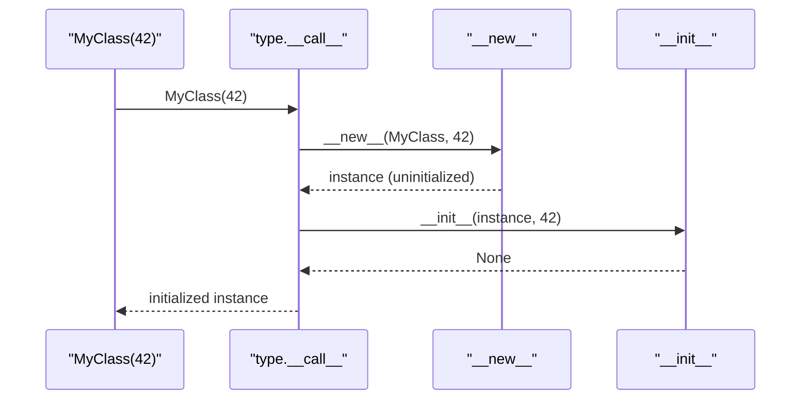
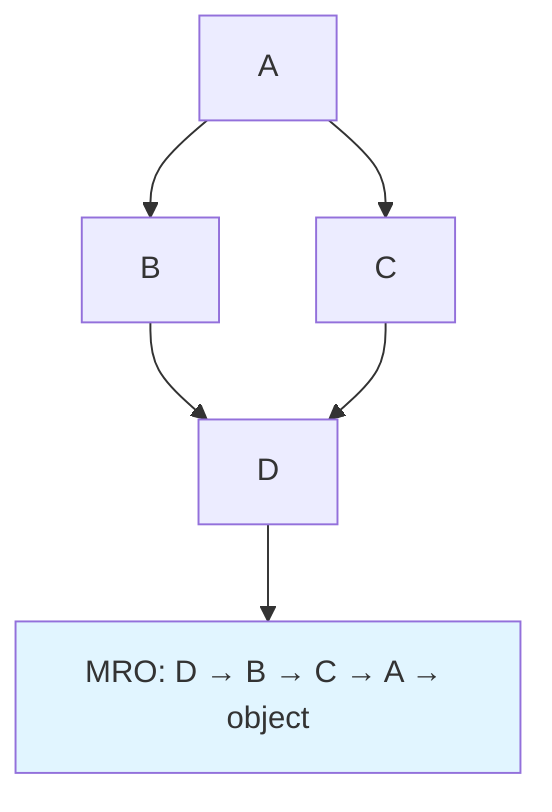

# OOP: Classes and Dunder Methods

> [!summary] Goal
> Master Python's object model: constructors, attributes, properties, inheritance, MRO, `dataclasses`, and the descriptor protocol.

## Table of Contents

1. [Class Basics](#class-basics)
2. [`__init__` vs `__new__`](#__init__-vs-__new__)
3. [`@property`](#property)
4. [`@staticmethod` and `@classmethod`](#staticmethod-and-classmethod)
5. [Inheritance and MRO](#inheritance-and-mro)
6. [`super()`](#super)
7. [`__slots__`](#__slots__)
8. [`dataclasses`](#dataclasses)
9. [Dunder Methods Reference](#dunder-methods-reference)
10. [Descriptors (Intro)](#descriptors-intro)
11. [Pitfalls](#pitfalls)

---

## Class Basics

```python
class BankAccount:
    """A simple bank account."""

    interest_rate = 0.02          # Class variable — shared by all instances

    def __init__(self, owner: str, balance: float = 0.0):
        self.owner = owner         # Instance variable
        self._balance = balance    # "Protected" by convention

    def deposit(self, amount: float) -> None:
        if amount <= 0:
            raise ValueError("Amount must be positive")
        self._balance += amount

    def withdraw(self, amount: float) -> bool:
        if amount <= self._balance:
            self._balance -= amount
            return True
        return False

    @property
    def balance(self) -> float:
        return self._balance

    def __repr__(self) -> str:
        return f"BankAccount(owner={self.owner!r}, balance={self._balance})"

    def __eq__(self, other) -> bool:
        if not isinstance(other, BankAccount):
            return NotImplemented
        return self.owner == other.owner and self._balance == other._balance


# Usage
acc = BankAccount("Alice", 1000)
acc.deposit(500)
acc.balance                    # 1500 — uses @property
print(acc)                     # BankAccount(owner='Alice', balance=1500.0)
```

---

## `__init__` vs `__new__`

```python
class MyClass:
    def __new__(cls, *args, **kwargs):
        """Responsible for CREATING the instance (rarely overridden)."""
        print("1. __new__ called")
        instance = super().__new__(cls)
        return instance

    def __init__(self, value):
        """Responsible for INITIALIZING the instance."""
        print("2. __init__ called")
        self.value = value

obj = MyClass(42)
```



> [!tip] When to override `__new__`
> - Singletons
> - Customising instance creation (e.g., returning a cached or different class instance)
> - Metaclasses (rare)

---

## `@property`

```python
class Temperature:
    def __init__(self, celsius: float):
        self._celsius = celsius

    @property
    def celsius(self) -> float:
        """Getter — called as `obj.celsius`."""
        return self._celsius

    @celsius.setter
    def celsius(self, value: float):
        """Setter — called as `obj.celsius = 10`."""
        if value < -273.15:
            raise ValueError("Below absolute zero")
        self._celsius = value

    @celsius.deleter
    def celsius(self):
        """Deleter — called as `del obj.celsius`."""
        print("Deleting celsius")
        del self._celsius

    @property
    def fahrenheit(self) -> float:
        """Read-only computed property."""
        return self._celsius * 9 / 5 + 32

t = Temperature(25)
t.celsius          # 25 (getter)
t.celsius = 30     # setter
t.fahrenheit       # 86.0 (computed, read-only)
del t.celsius      # deleter
```

---

## `@staticmethod` and `@classmethod`

```python
class DateUtils:
    format_str = "%Y-%m-%d"

    @staticmethod
    def is_weekend(day: int) -> bool:        # No `self` or `cls`
        return day in (5, 6)

    @classmethod
    def from_string(cls, date_str: str):      # Receives `cls`
        from datetime import datetime
        return datetime.strptime(date_str, cls.format_str)

    @classmethod
    def set_format(cls, fmt: str):
        cls.format_str = fmt

DateUtils.is_weekend(5)       # True — called on class
DateUtils.from_string("2026-05-29")  # returns datetime
```

> [!tip] When to use what
> - `@staticmethod`: utility function that belongs in the class namespace but doesn't need class or instance state
> - `@classmethod`: alternative constructors and factory methods that need the class (e.g., `dict.fromkeys()`)
> - Regular method: needs `self` (instance state)

---

## Inheritance and MRO

> [!info] MRO (Method Resolution Order)
> Python uses **C3 linearization** to determine the order in which classes are searched for attributes/methods. `MyClass.__mro__` shows the full order.

```python
class A:
    def method(self): return "A"

class B(A):
    def method(self): return "B"

class C(A):
    def method(self): return "C"

class D(B, C):
    pass

d = D()
d.method()          # "B" (B comes before C in MRO)
D.__mro__           # (D, B, C, A, object)
                    #    0  1  2  3  4
```



### Diamond inheritance

```python
class Base:
    def method(self): return "Base"

class Left(Base):
    def method(self): return "Left"

class Right(Base):
    def method(self): return "Right"

class Bottom(Left, Right):
    pass

Bottom.__mro__  # (Bottom, Left, Right, Base, object)
Bottom().method()  # "Left"
```

---

## `super()`

> [!info] `super()` follows MRO, not the parent class
> `super()` in a method returns a proxy object that dispatches according to `self.__class__.__mro__`, not the "parent class" of the current class.

```python
class Base:
    def __init__(self):
        print("Base.__init__")

class Mixin:
    def __init__(self):
        print("Mixin.__init__")
        super().__init__()     # Calls next in MRO

class Child(Mixin, Base):
    def __init__(self):
        super().__init__()     # Calls Mixin.__init__ (Mixin is first in MRO)
        print("Child.__init__")

Child.__mro__  # (Child, Mixin, Base, object)
c = Child()
# Mixin.__init__
# Base.__init__
# Child.__init__
```

> [!tip] Always use `super()` for cooperative multiple inheritance
> Avoid hardcoding parent class names. `super()` ensures each class in the MRO is called exactly once.

---

## `__slots__`

> [!info] `__slots__` saves memory and attribute lookup time
> By default, instances store attributes in a `__dict__`. `__slots__` declares a fixed set of attributes, which are stored in a compact array rather than a dict. This reduces memory per instance (no dict overhead) and speeds up attribute access.

```python
class Point:
    __slots__ = ("x", "y")   # Only these two attributes allowed

    def __init__(self, x, y):
        self.x = x
        self.y = y

p = Point(1, 2)
p.z = 3            # ❌ AttributeError: 'Point' object has no attribute 'z'
hasattr(p, '__dict__')  # False — no dict, saves memory

# Memory comparison
import sys
class RegularPoint:
    def __init__(self, x, y):
        self.x, self.y = x, y

sys.getsizeof(RegularPoint(1, 2))  # 56 bytes (+ dict: ~120 bytes more)
sys.getsizeof(Point(1, 2))          # 32 bytes (no dict)
```

> [!warning] `__slots__` caveats
> - Prevents `__dict__` creation (unless `'__dict__'` is in `__slots__`)
> - Breaks pickling by default (unless `'__dict__'` or `__getstate__`/`__setstate__`)
> - Subclasses must define their own `__slots__` or they'll get `__dict__` again

---

## `dataclasses`

> [!info] `dataclasses` (Python 3.7+) auto-generates `__init__`, `__repr__`, `__eq__`, `__hash__`, `__order__`, and more.

```python
from dataclasses import dataclass, field, asdict, astuple

@dataclass(order=True, frozen=True)
class Point:
    x: float
    y: float
    label: str = field(default="", compare=False)  # exclude from comparisons

@dataclass
class Circle:
    center: Point
    radius: float = 1.0

    @property
    def area(self) -> float:
        return 3.14159 * self.radius ** 2

p1 = Point(1.0, 2.0, "A")
p2 = Point(1.0, 2.0, "B")
p1 == p2          # True (label excluded from eq)
asdict(p1)        # {'x': 1.0, 'y': 2.0, 'label': 'A'}

# Frozen dataclass (immutable) — __hash__ is generated
hash(p1)          # works because frozen=True
```

| Field option | Purpose |
|-------------|---------|
| `default` | Default value (for immutable) |
| `default_factory` | Mutable default (e.g., `list`, `dict`) |
| `init=False` | Exclude from `__init__` |
| `repr=False` | Exclude from `__repr__` |
| `compare=False` | Exclude from `__eq__` / ordering |
| `hash=False` | Exclude from `__hash__` |

---

## Dunder Methods Reference

| Category | Methods | Purpose |
|----------|---------|---------|
| **Construction** | `__new__`, `__init__`, `__del__` | Create, initialise, destroy |
| **Representation** | `__repr__`, `__str__`, `__format__` | Display (repr for devs, str for users) |
| **Container** | `__len__`, `__getitem__`, `__setitem__`, `__delitem__`, `__contains__`, `__iter__`, `__reversed__` | Act like a container |
| **Attribute** | `__getattr__`, `__setattr__`, `__delattr__`, `__getattribute__` | Attribute access control |
| **Comparison** | `__eq__`, `__ne__`, `__lt__`, `__le__`, `__gt__`, `__ge__`, `__hash__` | Equality and ordering |
| **Arithmetic** | `__add__`, `__sub__`, `__mul__`, `__truediv__`, `__floordiv__`, `__mod__`, `__pow__` | `+`, `-`, `*`, etc. |
| **Conversion** | `__int__`, `__float__`, `__bool__`, `__bytes__` | Type conversion |
| **Context** | `__enter__`, `__exit__` | `with` statement |
| **Callable** | `__call__` | Make object callable |
| **Pickling** | `__getstate__`, `__setstate__` | Serialization |

```python
class Vector:
    def __init__(self, x, y):
        self.x, self.y = x, y

    def __repr__(self):
        return f"Vector({self.x}, {self.y})"

    def __add__(self, other):
        if not isinstance(other, Vector):
            return NotImplemented
        return Vector(self.x + other.x, self.y + other.y)

    def __mul__(self, scalar):
        return Vector(self.x * scalar, self.y * scalar)

    def __rmul__(self, scalar):   # scalar * Vector
        return self.__mul__(scalar)

    def __bool__(self):
        return self.x != 0 or self.y != 0

    def __len__(self):
        return int((self.x ** 2 + self.y ** 2) ** 0.5)

v1 = Vector(1, 2)
v2 = Vector(3, 4)
v1 + v2    # Vector(4, 6)
v1 * 3     # Vector(3, 6)
3 * v1     # Vector(3, 6) (via __rmul__)
bool(v1)   # True
```

---

## Descriptors (Intro)

> [!info] Descriptor protocol
> Any object that defines `__get__`, `__set__`, or `__delete__` is a descriptor. `@property`, `@classmethod`, `@staticmethod`, and `__slots__` all use descriptors under the hood.

```python
class ValidatedField:
    """A descriptor that validates values."""
    def __init__(self, min_val, max_val):
        self.min_val = min_val
        self.max_val = max_val

    def __set_name__(self, owner, name):        # Python 3.6+
        self.private_name = f"_{name}"

    def __get__(self, obj, objtype=None):
        if obj is None:                         # accessed on class, not instance
            return self
        return getattr(obj, self.private_name)

    def __set__(self, obj, value):
        if not (self.min_val <= value <= self.max_val):
            raise ValueError(f"{value} is not in [{self.min_val}, {self.max_val}]")
        setattr(obj, self.private_name, value)

class Order:
    quantity = ValidatedField(1, 1000)
    price = ValidatedField(0.01, 1_000_000.0)

    def __init__(self, quantity, price):
        self.quantity = quantity
        self.price = price

o = Order(100, 50.0)
o.quantity = 2000   # ❌ ValueError
```

---

## Pitfalls

### Mutable class variables

```python
class Dog:
    tricks = []            # ❌ Shared by ALL instances

d1 = Dog()
d2 = Dog()
d1.tricks.append("roll over")  # d2.tricks also sees it!

class Dog:
    def __init__(self):
        self.tricks = []    # ✅ Per-instance
```

### Forgetting `super()` in `__init__`

```python
class Base:
    def __init__(self):
        print("Base init")

class Child(Base):
    def __init__(self):
        super().__init__()    # Must call super!
```

### Using `__slots__` and forgetting subclass

```python
class Base:
    __slots__ = ("x",)

class Child(Base):
    pass                       # Child gets a __dict__ again!

class Child(Base):
    __slots__ = ("y",)         # ✅ Define child's own __slots__
```

### `NotImplemented` vs `NotImplementedError`

```python
# NotImplemented — sentinel returned by dunder methods for unsupported types
class A:
    def __add__(self, other):
        if not isinstance(other, A):
            return NotImplemented   # Python will try __radd__ on other
        return A(self.value + other.value)

# NotImplementedError — exception for abstract methods
class AbstractBase:
    def method(self):
        raise NotImplementedError    # Subclass must override
```

---

> [!question]- Interview Questions
>
> **Q: What's the difference between `__init__` and `__new__`?**
> A: `__new__` creates the instance (returns it). `__init__` initialises the already-created instance. `__new__` is rarely overridden; it's used for singletons, caching, or returning a different class. `__init__` is the normal constructor.
>
> **Q: How does `super()` work?**
> A: `super()` returns a proxy object that dispatches method calls according to the `__mro__` of `self.__class__`. It ensures cooperative multiple inheritance — each class in the MRO is called in order, exactly once. Without `super()`, hardcoding parent names breaks diamond inheritance and may skip classes.
>
> **Q: What are descriptors and how does `@property` use them?**
> A: A descriptor is an object that defines `__get__`, `__set__`, or `__delete__`. When a descriptor is a class attribute, Python intercepts access to it and calls the descriptor methods instead. `@property` creates a descriptor from the getter/setter/deleter methods. `__slots__`, `@classmethod`, and `@staticmethod` all use the descriptor protocol.
>
> **Q: When would you use `__slots__`?**
> A: When you create millions of instances and memory matters (e.g., data science, game entities). `__slots__` removes the per-instance `__dict__`, saving ~60-120 bytes per object. The trade-off: no dynamic attributes, and subclasses must also define `__slots__`.

---

## Cross-Links

- [[Python/01_Foundations/05_Iterators_Generators_Decorators]] for `@property` internals
- [[Python/02_Core/12_Metaprogramming_Descriptors]] for advanced descriptors and metaclasses
- [[Python/02_Core/01_CPython_Internals]] for `tp_*` slots in CPython
- [[Python/01_Foundations/03_Functions_Deep_Dive]] for closures and `nonlocal`
