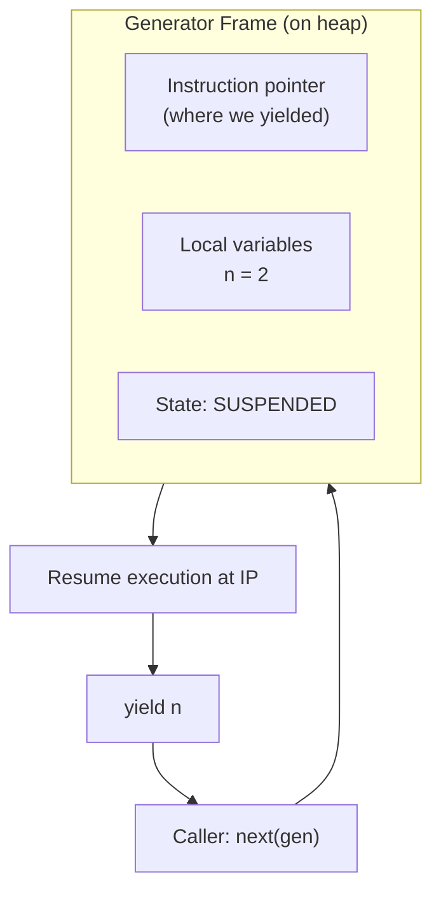

# Iterators, Generators, and Decorators

> [!summary] Goal
> Master Python's iteration protocol, lazy evaluation with generators, and the decorator pattern — three of the most useful Python idioms.

## Table of Contents

1. [Iterator Protocol](#iterator-protocol)
2. [Generators](#generators)
3. [`yield from`](#yield-from)
4. [`itertools`](#itertools)
5. [Decorators](#decorators)
6. [Decorators with Arguments](#decorators-with-arguments)
7. [Context Managers](#context-managers)
8. [Pitfalls](#pitfalls)

---

## Iterator Protocol

> [!info] Every `for` loop uses the iterator protocol
> When you write `for x in obj`, Python calls `iter(obj)` → `obj.__iter__()` to get an iterator, then `next(iterator)` → `iterator.__next__()` until `StopIteration` is raised.

```mermaid
sequenceDiagram
    participant Loop as "for x in obj:"
    participant obj as "obj"
    participant it as "iterator"
    Loop->>obj: iter(obj) / obj.__iter__()
    obj-->>Loop: iterator object
    Loop->>it: next(it) / it.__next__()
    it-->>Loop: x (first value)
    Loop->>it: next(it)
    it-->>Loop: x (second value)
    Loop->>it: next(it)
    it-->>Loop: Raise StopIteration
    Note over Loop: Loop ends
```

```python
class Range:
    """Custom range iterator — demonstrates the protocol."""
    def __init__(self, start, stop):
        self.current = start
        self.stop = stop

    def __iter__(self):          # Returns the iterator (usually self)
        return self

    def __next__(self):          # Returns next item or raises StopIteration
        if self.current >= self.stop:
            raise StopIteration
        value = self.current
        self.current += 1
        return value

for x in Range(0, 3):
    print(x)  # 0, 1, 2

# The protocol also works manually
r = Range(0, 3)
it = iter(r)
next(it)  # 0
next(it)  # 1
next(it)  # 2
next(it)  # StopIteration
```

### Iterable vs Iterator

| Feature | Iterable (`__iter__`) | Iterator (`__iter__` + `__next__`) |
|---------|-----------------------|-------------------------------------|
| Returns | An iterator | Itself |
| Can be used in `for` loop | ✅ Yes | ✅ Yes |
| Can be consumed multiple times | ✅ Yes | ❌ No (exhausted once) |
| Examples | `list`, `str`, `dict`, `set`, `tuple`, `Range` (above) | `file`, `generator`, `map`, `filter`, `zip` |

```python
xs = [1, 2, 3]
it = iter(xs)
list(it)  # [1, 2, 3]
list(it)  # [] — exhausted!

# Re-iterate: get a fresh iterator
it2 = iter(xs)
list(it2)  # [1, 2, 3]
```

---

## Generators

> [!info] Generator — a lazy iterator created with `yield`
> A generator function looks like a regular function but contains `yield`. When called, it returns a **generator iterator** — each call to `next()` runs the function until the next `yield`.

```python
def countdown(n):
    """Generator that counts down from n."""
    while n > 0:
        yield n
        n -= 1

for x in countdown(3):
    print(x)   # 3, 2, 1

# Generators are single-use
c = countdown(3)
list(c)  # [3, 2, 1]
list(c)  # [] — exhausted
```

### How generators work internally



```python
# Generators save their entire execution state (frame on heap)
# not just the current value. This is why they can be paused/resumed.

def fib():
    a, b = 0, 1
    while True:
        yield a
        a, b = b, a + b

f = fib()
[next(f) for _ in range(10)]  # [0, 1, 1, 2, 3, 5, 8, 13, 21, 34]
```

### Generator expressions

```python
# Generator expression — lazy, no list built
squares = (x**2 for x in range(1_000_000))
sum(squares)  # computes one value at a time

# When to use generator expression vs list comprehension
# Generator: large data, single pass, chaining
# List: need random access, multiple passes, small data
```

### `send()`, `throw()`, `close()`

```python
def running_average():
    total = 0.0
    count = 0
    avg = None
    while True:
        val = yield avg         # yield AND receive
        total += val
        count += 1
        avg = total / count

avg = running_average()
next(avg)          # Start: None
avg.send(10)       # 10.0
avg.send(20)       # 15.0
avg.send(30)       # 20.0
avg.close()        # Stop the generator
```

> [!tip] `yield` is both an exit AND an entry point
> The value after `yield` is sent to the caller. The value from `send()` is received by `yield`. This two-way communication is what makes coroutines (pre-`async/await`) possible.

---

## `yield from`

> [!info] `yield from` delegates to another generator (Python 3.3+)

```python
def flatten(nested):
    for item in nested:
        if isinstance(item, (list, tuple)):
            yield from flatten(item)   # Recursively yield from sublist
        else:
            yield item

list(flatten([1, [2, [3, 4]], 5]))  # [1, 2, 3, 4, 5]

# Simplifies generator chaining
def read_lines(paths):
    for path in paths:
        with open(path) as f:
            yield from f              # Delegate to file iterator
```

---

## `itertools`

> [!info] `itertools` — lazy combinatorics and iteration tools
> All functions in `itertools` return iterators. They're memory-efficient and composable.

| Function | Purpose | Example |
|----------|---------|---------|
| `chain(*iters)` | Concatenate iterables | `chain([1,2], [3,4])` → `1,2,3,4` |
| `cycle(iterable)` | Repeat infinitely | `cycle("AB")` → `A,B,A,B,...` |
| `repeat(x, n=None)` | Repeat a value | `repeat(42, 3)` → `42,42,42` |
| `count(start, step)` | Infinite counter | `count(10, 2)` → `10,12,14,...` |
| `accumulate(iterable)` | Running sum | `accumulate([1,2,3])` → `1,3,6` |
| `islice(iter, stop)` | Slice an iterator | `islice(count(), 5)` → `0..4` |
| `tee(iter, n=2)` | Clone an iterator | `a,b = tee(xs)` — 2 independent iterators |
| `product(*iters)` | Cartesian product | `product("AB", range(2))` → `(A,0),(A,1),(B,0),(B,1)` |
| `permutations(iter, r)` | All permutations | `permutations("ABC", 2)` |
| `combinations(iter, r)` | All combinations | `combinations("ABC", 2)` |
| `groupby(iter, key)` | Group by key | `groupby(sorted(data, key=k), k)` |

```python
from itertools import (
    chain, cycle, count, islice, tee,
    product, permutations, combinations, groupby
)

# Chaining
combined = chain([1, 2], [3, 4])
list(combined)  # [1, 2, 3, 4]

# Infinite + slice
first_10 = islice(count(0, 2), 10)
list(first_10)  # [0, 2, 4, 6, 8, 10, 12, 14, 16, 18]

# Groupby — requires sorted input
data = [("A", 1), ("A", 2), ("B", 3)]
for key, group in groupby(data, key=lambda x: x[0]):
    print(key, list(group))  # A [(A,1),(A,2)]  B [(B,3)]
```

---

## Decorators

> [!info] Decorator — a function that takes a function and returns a function
> `@decorator` is syntactic sugar for `func = decorator(func)`. Decorators run at **import time**, not at call time.

### Basic decorator

```python
from functools import wraps

def timer(func):
    """Print the runtime of the decorated function."""
    @wraps(func)
    def wrapper(*args, **kwargs):
        import time
        start = time.perf_counter()
        result = func(*args, **kwargs)
        end = time.perf_counter()
        print(f"{func.__name__} took {end - start:.6f}s")
        return result
    return wrapper

@timer
def slow_add(a, b):
    import time; time.sleep(0.1)
    return a + b

slow_add(1, 2)   # "slow_add took 0.100123s"
```

### Class-based decorator

```python
class CountCalls:
    def __init__(self, func):
        self.func = func
        self.count = 0

    def __call__(self, *args, **kwargs):
        self.count += 1
        print(f"Call {self.count} of {self.func.__name__}")
        return self.func(*args, **kwargs)

@CountCalls
def greet(name):
    return f"Hello, {name}"

greet("Alice")  # Call 1 of greet
greet("Bob")    # Call 2 of greet
```

---

## Decorators with Arguments

```python
def repeat(n: int):
    """Decorator factory — returns a decorator."""
    def decorator(func):
        @wraps(func)
        def wrapper(*args, **kwargs):
            for _ in range(n - 1):
                func(*args, **kwargs)
            return func(*args, **kwargs)
        return wrapper
    return decorator

@repeat(3)
def say_hi(name):
    print(f"Hi, {name}")

say_hi("Alice")
# Hi, Alice
# Hi, Alice
# Hi, Alice

# What this expands to:
# say_hi = repeat(3)(say_hi)
```

```python
# Optional arguments decorator — works with or without arguments
@dataclass
class logged:
    """A decorator that logs calls. Works with or without args."""
    func: callable = None
    level: str = "INFO"

    def __call__(self, *args, **kwargs):
        if self.func:                          # Used as @logged (no args)
            return self._wrap(self.func)(*args, **kwargs)
        return self._wrap(args[0])(*args[1:])  # Used as @logged(level=...)

    def _wrap(self, func):
        @wraps(func)
        def wrapper(*args, **kwargs):
            print(f"[{self.level}] Calling {func.__name__}")
            return func(*args, **kwargs)
        return wrapper

@logged
def f1(x): return x

@logged(level="DEBUG")
def f2(x): return x
```

---

## Context Managers

> [!info] Context managers handle setup/teardown via `__enter__`/`__exit__` or `@contextmanager`.

### Class-based

```python
class ManagedFile:
    def __init__(self, path, mode="r"):
        self.path = path
        self.mode = mode

    def __enter__(self):
        self.file = open(self.path, self.mode)
        return self.file           # What `as` binds to

    def __exit__(self, exc_type, exc_val, exc_tb):
        self.file.close()
        # Return True to suppress exceptions
        # Return None/False to propagate
        return False

with ManagedFile("data.txt", "w") as f:
    f.write("hello")
```

### Generator-based (`@contextmanager`)

```python
from contextlib import contextmanager

@contextmanager
def managed_file(path, mode="r"):
    f = open(path, mode)
    try:
        yield f                   # What `as` binds to
    finally:
        f.close()                 # Always runs, even on exception

with managed_file("data.txt", "w") as f:
    f.write("hello")
```

### Useful `contextlib` utilities

```python
from contextlib import suppress, redirect_stdout, closing

# Suppress specific exceptions
with suppress(FileNotFoundError):
    os.remove("temp.txt")          # No error if file doesn't exist

# Redirect stdout
with redirect_stdout(open("out.log", "w")):
    print("This goes to the log file")

# closing — call close() on exit
from urllib.request import urlopen
with closing(urlopen("https://python.org")) as page:
    ...
```

---

## Pitfalls

### Forgetting `@wraps`

```python
def bad_decorator(func):
    def wrapper(*args, **kwargs):
        return func(*args, **kwargs)
    return wrapper

@bad_decorator
def greet(name): "A greeting function"; return f"Hi {name}"

greet.__name__  # 'wrapper' — not 'greet'!
greet.__doc__   # None — lost the docstring!
```

### Exhausting an iterator

```python
it = iter([1, 2, 3])
list(it)  # [1, 2, 3]
list(it)  # [] — gone!

# Don't do this:
items = map(str, range(10))
if 5 in items:    # Consumes up to 5
    print(list(items))  # Only [6, 7, 8, 9] remains!
```

### Stateful generator reuse

```python
gen = (x**2 for x in range(5))
list(gen)  # [0, 1, 4, 9, 16]
list(gen)  # [] — exhausted. Need a new generator.

# Create a factory if you need reuse
def squares(n):
    return (x**2 for x in range(n))
```

### Decorator stacking order

```python
@decorator_a       # Applied last (outermost)
@decorator_b       # Applied first (innermost)
def func():
    pass

# Equivalent to: func = decorator_a(decorator_b(func))
```

---

> [!question]- Interview Questions
>
> **Q: What's the difference between an iterable and an iterator?**
> A: An iterable has `__iter__()` that returns an iterator. An iterator has both `__iter__()` (returns self) and `__next__()` (raises StopIteration when done). Lists are iterables (not iterators) — you can get multiple independent iterators from them. Generators are both iterable and iterator — single-use, forward-only.
>
> **Q: How does a generator work internally?**
> A: When a generator function is called, it returns a generator object that holds a reference to the function's frame (locals, instruction pointer). Each call to `next()` enters the frame, runs until `yield`, saves the frame state, and returns the yielded value. This lets the generator pause and resume arbitrarily.
>
> **Q: When would you use `yield from`?**
> A: To delegate from one generator to another. It avoids nesting loops and manual `for` loops inside generators. Common uses: flattening nested structures, reading multiple files, delegating to sub-generators in complex iteration logic.
>
> **Q: What's the difference between `@contextmanager` and a class-based context manager?**
> A: `@contextmanager` is simpler (single function with `yield`). Class-based gives you finer control (`__enter__` return value, exception handling in `__exit__`). For most cases, `@contextmanager` is sufficient. Use class-based when you need to store state or handle exceptions in detail.

---

## Cross-Links

- [[Python/01_Foundations/03_Functions_Deep_Dive]] for `functools.wraps`
- [[Python/01_Foundations/04_OOP_Classes_Dunder_Methods]] for `__call__`, `__enter__`/`__exit__`
- [[Python/01_Foundations/11_Async_Python_Basics]] for `async for`, `async with`
- [[Python/02_Core/12_Metaprogramming_Descriptors]] for advanced decorator patterns
