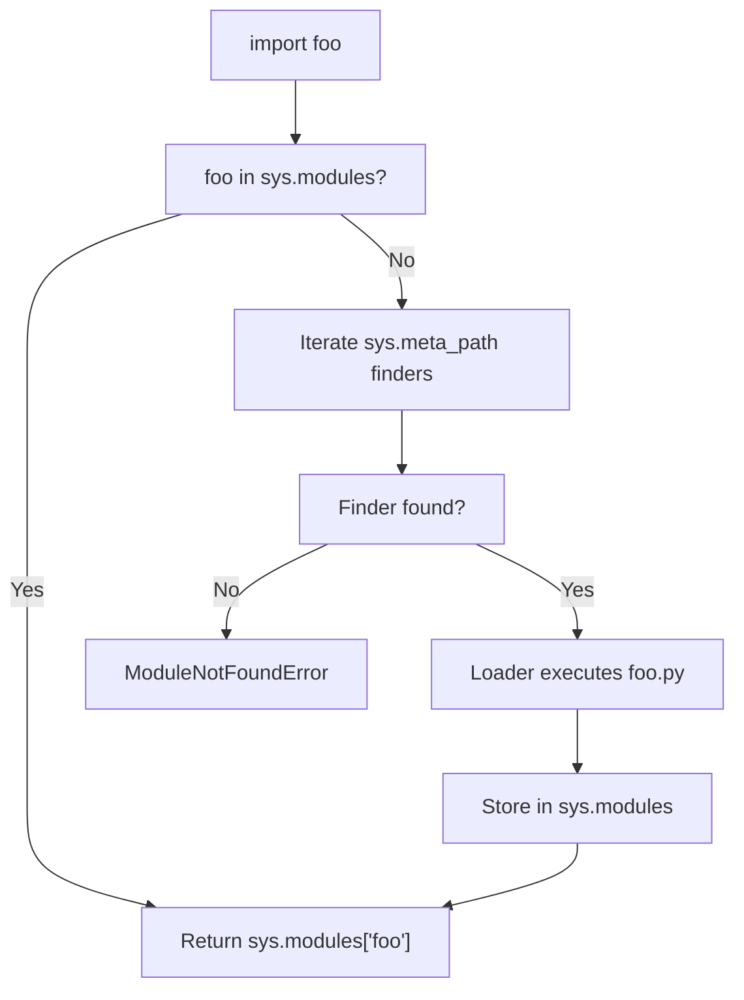
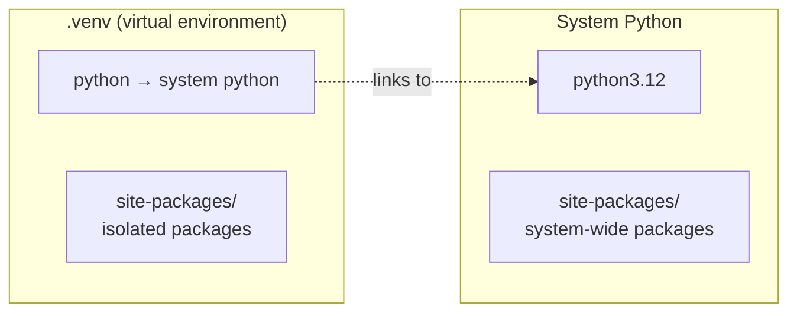

# Modules, Packages, and Virtual Environments

> [!summary] Goal
> Understand Python's import system, how to structure projects with modules and packages, manage dependencies with pip, and isolate environments with venv.

## Table of Contents

1. [Import Mechanics](#import-mechanics)
2. [`__init__.py` and `__all__`](#__init__py-and-__all__)
3. [Relative vs Absolute Imports](#relative-vs-absolute-imports)
4. [Namespace Packages](#namespace-packages)
5. [`if __name__ == "__main__"`](#if-__name__--__main__)
6. [Virtual Environments](#virtual-environments)
7. [pip and Dependencies](#pip-and-dependencies)
8. [Circular Imports](#circular-imports)
9. [Pitfalls](#pitfalls)

---

## Import Mechanics

> [!info] Import steps (CPython)
> When you write `import foo`, Python:
> 1. Looks in `sys.modules` (cache) — if found, done
> 2. Finds the **finder** via `sys.meta_path` (order: `zipimport`, `pathfinder`, custom)
> 3. Finder creates a **loader** (specifically a `SourceFileLoader` for `.py` files)
> 4. Loader executes the module, adds it to `sys.modules`, returns it



```python
import sys

# Where Python looks for modules
sys.path
# ['', '/usr/lib/python3.12', '/usr/lib/python3.12/site-packages', ...]
# First empty string = current directory

# Cache — avoids re-executing
sys.modules["os"]   # <module 'os' from '/usr/lib/python3.12/os.py'>
```

### The `import` statement variants

```python
import os                    # import module
from os import path          # import specific name
from os import *             # import all names in __all__
import os.path as osp        # alias
from os.path import join as pjoin  # alias with from
```

---

## `__init__.py` and `__all__`

```python
# mypackage/__init__.py
"""Documentation for the package."""
from . import submodule
from .other import useful_function

__all__ = ["submodule", "useful_function"]   # Controls `from mypackage import *`
```

> [!info] `__init__.py` runs when the package is imported
> It can be empty (just marks the directory as a package), or it can initialise package-level state, import submodules, or define `__all__`.

```python
# Without __init__.py (Python 3.3+) — namespace package
# Multiple directories on sys.path with same top-level name merge
```

---

## Relative vs Absolute Imports

```python
# Project structure:
# myproject/
#   __init__.py
#   core/
#     __init__.py
#     utils.py
#     models.py
#   tests/
#     __init__.py
#     test_utils.py

# Absolute import (PREFERRED)
from myproject.core.utils import parse_config

# Relative imports (use sparingly, only within a package)
from . import utils                # sibling
from ..core.models import User     # parent → sibling
from .subpkg import thing          # child

# ❌ Relative import in script (__name__ == "__main__")
# Relative imports only work inside a package (with a parent __init__.py)
```

> [!tip] Always prefer absolute imports
> Absolute imports are clearer and less error-prone. Use relative imports only for deep package-internal references where the absolute path would be very long.

---

## Namespace Packages

> [!info] A namespace package is a package without `__init__.py` (Python 3.3+)
> Multiple directories from different locations on `sys.path` with the same top-level name merge into one namespace.

```python
# /path1/mypackage/foo.py
# /path2/mypackage/bar.py
# No __init__.py in either!

import mypackage.foo   # uses /path1/mypackage/foo.py
import mypackage.bar   # uses /path2/mypackage/bar.py
# Both coexist — mypackage is a namespace package
```

> [!tip] Namespace packages are useful for
> - Splitting a large package across multiple repositories
> - Plugins (each plugin is a separate directory)
> - Large frameworks (Django, Plone)

---

## `if __name__ == "__main__"`

```python
# script.py
def main():
    """Entry point for the script."""
    import sys
    print(f"Arguments: {sys.argv[1:]}")

if __name__ == "__main__":
    main()

# When run directly: python script.py arg1
#   __name__ == "__main__" → True → main() runs

# When imported: import script
#   __name__ == "script" → False → main() does NOT run
```

> [!tip] Always guard script code
> Putting executable code behind `if __name__ == "__main__"` lets you import the file for testing or reuse without side effects.

---

## Virtual Environments

```bash
# Create
python -m venv .venv

# Activate (Linux/Mac)
source .venv/bin/activate

# Activate (Windows)
.venv\Scripts\activate

# Deactivate
deactivate

# What venv does:
# 1. Creates a .venv directory with bin/, lib/, etc.
# 2. Copies/links python executable
# 3. Creates isolated site-packages
# 4. Activates by modifying PATH
```



> [!tip] Always use virtual environments
> Even for small projects. `python -m venv .venv && source .venv/bin/activate && pip install -e .` is the standard starting workflow.

---

## pip and Dependencies

```bash
# Install
pip install requests
pip install requests==2.31.0           # exact version
pip install "requests>=2.0,<3.0"       # version range
pip install -r requirements.txt         # from file
pip install -e .                        # editable (development) install

# Freeze
pip freeze > requirements.txt           # snapshot current environment

# Uninstall
pip uninstall requests

# List
pip list                                # installed packages
pip list --outdated                     # outdated packages
```

### Modern dependency management (Python 3.12+)

```toml
# pyproject.toml (PEP 621)
[build-system]
requires = ["setuptools>=68.0"]
build-backend = "setuptools.backends._legacy:_Backend"

[project]
name = "myproject"
version = "0.1.0"
requires-python = ">=3.12"
dependencies = [
    "requests>=2.31",
    "click>=8.0",
]

[project.optional-dependencies]
dev = [
    "pytest>=7.0",
    "ruff>=0.1",
]
```

---

## Circular Imports

> [!warning] Circular imports happen when module A imports B and B imports A (directly or indirectly)

```python
# module_a.py
from module_b import B_func

def A_func():
    return B_func()

# module_b.py
from module_a import A_func  # ❌ Circular! A_func is None at import time

def B_func():
    return 42
```

### Fixes

```python
# Fix 1: Import inside the function (lazy import)
# module_b.py
def B_func():
    from module_a import A_func    # ✅ Imported only when B_func is called
    return A_func()

# Fix 2: Restructure — move shared code to a third module
# Fix 3: Use import at the bottom of the module instead of the top
```

---

## Pitfalls

### `sys.path` pollution

Running a script from a different directory changes `sys.path`. The first entry (`''`) is the script's directory, not necessarily your project root.

```python
# Fix: add project root to sys.path
import sys
from pathlib import Path
sys.path.insert(0, str(Path(__file__).parent.parent))
```

### Shadowing stdlib modules

```python
# Don't name your file the same as a standard library module!
# math.py, json.py, sys.py — all shadow the original

import math    # This imports your math.py, not stdlib math!
```

### `__pycache__` confusion

Python caches bytecode in `__pycache__/`. If you change source files without changing the modification time, stale `.pyc` files may be used. Always use `python -B` to disable bytecode caching, or just trust CPython's timestamp checks.

### Accidental namespace packages

If you forget `__init__.py` in a package directory, Python 3.3+ treats it as a namespace package. This can merge with other directories with the same name on `sys.path`. Always add `__init__.py` (even empty) to regular packages.

---

> [!question]- Interview Questions
>
> **Q: How does Python find modules?**
> A: Python searches `sys.path` — a list of directories (current working directory first, then `PYTHONPATH`, then site-packages). It uses `importlib` finders (`sys.meta_path`): first `zipimport` for `.zip` files, then `pathfinder` for filesystem `.py`/`.so`, then custom finders. Once found, the loader executes the module and caches it in `sys.modules`.
>
> **Q: What's the difference between a regular package and a namespace package?**
> A: A regular package has an `__init__.py` and owns its namespace. A namespace package (Python 3.3+) has no `__init__.py` and can be split across multiple directories on `sys.path`. Regular packages are for single projects; namespace packages are for plugins or distributed systems.
>
> **Q: What is `if __name__ == "__main__"` and why is it important?**
> A: It guards code that should only run when the file is executed directly (as a script), not when imported as a module. When run directly, `__name__` is `"__main__"`. When imported, `__name__` is the module name. Without this guard, imports would execute the script code with side effects.

---

## Cross-Links

- [[Python/02_Core/13_Packaging_Distribution]] for publishing packages to PyPI
- [[Python/01_Foundations/09_Stdlib_Essentials]] for `importlib`, `sys.path`
- [[Python/04_Playbooks/03_Production_Readiness]] for dependency management in production
