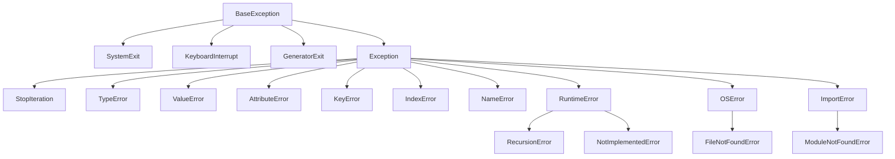
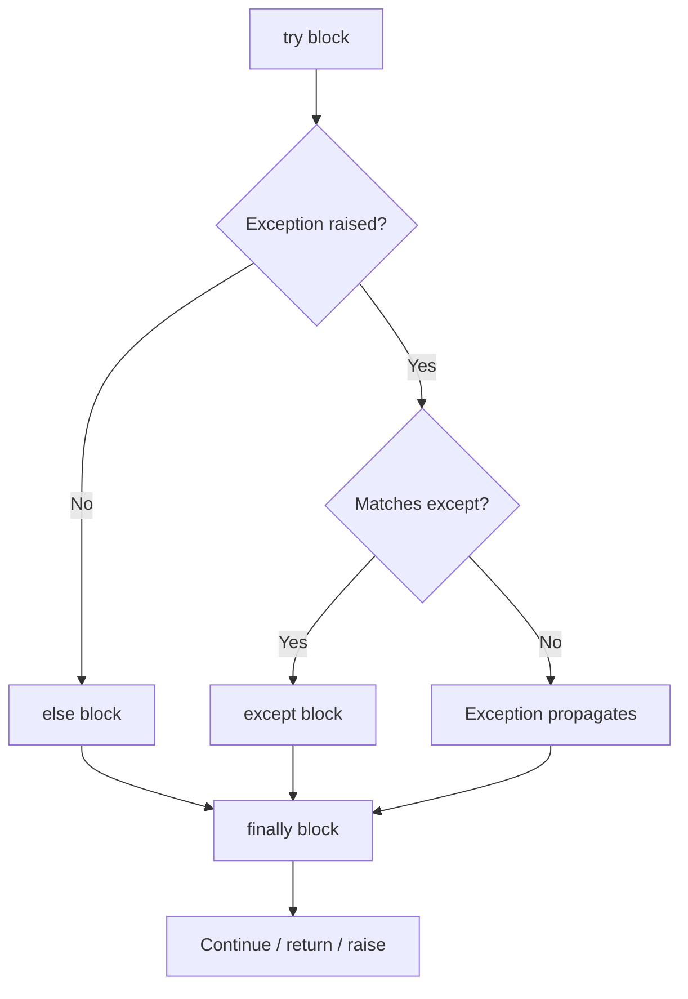

# Error Handling and Context Managers

> [!summary] Goal
> Master Python's exception handling model — `try`/`except`/`else`/`finally`, exception chaining, custom exceptions, and context managers for reliable resource management.

## Table of Contents

1. [Exception Hierarchy](#exception-hierarchy)
2. [`try`/`except`/`else`/`finally`](#tryexceptelsefinally)
3. [Exception Chaining](#exception-chaining)
4. [Custom Exceptions](#custom-exceptions)
5. [`assert`](#assert)
6. [Context Manager Protocol](#context-manager-protocol)
7. [`contextlib` Utilities](#contextlib-utilities)
8. [Pitfalls](#pitfalls)

---

## Exception Hierarchy



> [!warning] Never catch `BaseException` directly
> That catches `SystemExit` and `KeyboardInterrupt` too — preventing graceful shutdown. Always catch `Exception` or a specific subclass.

---

## `try`/`except`/`else`/`finally`

```python
try:
    file = open("data.txt")
    data = file.read()
    value = int(data)
except FileNotFoundError:
    print("File not found")
    value = 0
except ValueError as e:
    print(f"Invalid number: {e}")
    value = -1
except (OSError, PermissionError):     # Catch multiple types
    print("I/O error")
    raise                                # Re-raise unchanged
else:
    # Runs ONLY if no exception occurred
    print(f"Read successfully: {value}")
finally:
    # ALWAYS runs — even on return, break, or unhandled exception
    file.close()
```



---

## Exception Chaining

```python
# Implicit chaining — Python attaches original exception as __context__
try:
    int("not_a_number")
except ValueError as e:
    raise RuntimeError("Failed to parse input") from e   # Explicit: __cause__
    # Without `from e`:
    raise RuntimeError("Failed to parse input")           # Implicit: __context__

# Suppress chaining
try:
    int("not_a_number")
except ValueError:
    raise RuntimeError("Failed") from None   # No chain displayed

# Chaining chain
# ValueError → RuntimeError → ... → traceback shows the full chain
```

> [!tip] Always use `raise X from Y` when translating exceptions
> It preserves the original traceback, making debugging much easier.

---

## Custom Exceptions

```python
class APIError(Exception):
    """Base exception for API errors."""
    pass

class NotFoundError(APIError):
    """Resource not found."""
    def __init__(self, resource: str, id: str):
        self.resource = resource
        self.id = id
        super().__init__(f"{resource} with id {id} not found")

class RateLimitError(APIError):
    """Rate limit exceeded."""
    def __init__(self, retry_after: int):
        self.retry_after = retry_after
        super().__init__(f"Rate limited, retry after {retry_after}s")

# Usage
try:
    raise NotFoundError("User", "123")
except NotFoundError as e:
    print(e.resource)   # "User"
    print(e.id)         # "123"
    print(e)            # "User with id 123 not found"
```

> [!tip] Custom exception convention
> - Inherit from `Exception` (not `BaseException`)
> - Name ends with `Error`
> - Store relevant data for the handler
> - Keep them in a dedicated `exceptions.py` module

---

## `assert`

```python
def divide(a, b):
    assert b != 0, "Division by zero"     # Can be disabled!
    return a / b

# Assertions are removed with -O (optimise) flag:
# python -O script.py  — assert statements are compiled away

# Use assert for:
# - Internal invariants (should never happen)
# - Testing/validation in development
#
# Do NOT use assert for:
# - User input validation (use proper if + raise ValueError)
# - Security checks (can be disabled)
# - Anything that must always run
```

---

## Context Manager Protocol

> [!info] The `with` statement calls `__enter__` and `__exit__` in sequence
> `__exit__` receives exception details if one occurred. Returning `True` suppresses the exception.

```python
class DatabaseTransaction:
    def __init__(self, conn):
        self.conn = conn

    def __enter__(self):
        self.conn.begin()
        return self.conn             # Bound to `as`

    def __exit__(self, exc_type, exc_val, exc_tb):
        if exc_type is None:
            self.conn.commit()       # No exception → commit
        else:
            self.conn.rollback()     # Exception → rollback
            return False             # Don't suppress — propagate

# Usage
with DatabaseTransaction(conn) as cursor:
    cursor.execute("INSERT ...")
    cursor.execute("UPDATE ...")
    # If either fails, the transaction is rolled back automatically
```

### `@contextmanager` (generator-based)

```python
from contextlib import contextmanager

@contextmanager
def transaction(conn):
    conn.begin()
    try:
        yield conn
    except:
        conn.rollback()
        raise                       # Re-raise after rollback
    else:
        conn.commit()

with transaction(conn) as cursor:
    cursor.execute("INSERT ...")
```

---

## `contextlib` Utilities

| Utility | Purpose |
|---------|---------|
| `@contextmanager` | Generator-based context manager |
| `closing(obj)` | Call `obj.close()` on exit |
| `suppress(*exceptions)` | Suppress specific exceptions |
| `redirect_stdout(file)` | Temporarily redirect stdout |
| `redirect_stderr(file)` | Temporarily redirect stderr |
| `nullcontext()` | No-op context manager (useful as default) |
| `ExitStack` | Manage multiple context managers dynamically |

### `ExitStack` — dynamic context manager composition

```python
from contextlib import ExitStack

def process_files(paths):
    with ExitStack() as stack:
        files = [stack.enter_context(open(p)) for p in paths]
        # All files open; if one fails, previous ones are closed
        return [f.read() for f in files]
```

### `suppress` — ignore specific errors

```python
from contextlib import suppress

# Instead of:
try:
    os.remove("temp.txt")
except FileNotFoundError:
    pass

# Use:
with suppress(FileNotFoundError):
    os.remove("temp.txt")
```

---

## Pitfalls

### Bare `except:` — catches everything

```python
try:
    risky_operation()
except:                       # ❌ Catches SystemExit, KeyboardInterrupt, GeneratorExit
    pass                      # Masks Ctrl+C!

# ✅ Always specify
except Exception:             # Or a specific type
```

### Swallowing exceptions silently

```python
try:
    parse(data)
except ValueError:
    pass                      # ❌ Silent failure — will haunt you later

# ✅ At least log it
import logging
try:
    parse(data)
except ValueError as e:
    logging.warning("Parse failed: %s", e)
```

### `finally` without cleanup being insufficient

```python
f = open("file.txt")
try:
    process(f)
finally:
    f.close()                 # ✅ Good
    # But what if process(f) opens other files?
```

### Raising from a context manager

```python
@contextmanager
def bad():
    try:
        yield
    except:
        raise RuntimeError("Wrapped")   # ❌ Loses original traceback!

@contextmanager
def good():
    try:
        yield
    except Exception as e:
        raise RuntimeError("Wrapped") from e   # ✅ Preserves chain
```

---

> [!question]- Interview Questions
>
> **Q: What's the difference between `raise` and `raise from`?**
> A: `raise` alone re-raises the current exception unchanged. `raise X from Y` raises X with Y as the explicit cause (`__cause__`). Without `from`, if an exception occurs during exception handling, Python sets `__context__` implicitly. `raise from None` suppresses the chain.
>
> **Q: When should you use `else` in a try/except block?**
> A: Use `else` for code that should run only if the try block succeeded (no exception). This separates "success path" code from code that might raise a different exception, and avoids accidentally catching exceptions from the success handling in the wrong `except` block.
>
> **Q: How does `ExitStack` work?**
> A: `ExitStack` manages a dynamic collection of context managers. Each call to `enter_context()` adds a CM whose `__exit__` is called when the stack exits. If any CM's `__enter__` fails, all previously entered CMs are cleaned up. This is useful when you don't know how many resources you'll need at compile time.

---

## Cross-Links

- [[Python/01_Foundations/05_Iterators_Generators_Decorators]] for `@contextmanager` generators
- [[Python/01_Foundations/02_Data_Structures]] for `defaultdict` with error handling
- [[Python/02_Core/01_CPython_Internals]] for `PyErr_*` in CPython
- [[Python/04_Playbooks/03_Production_Readiness]] for logging and error monitoring
