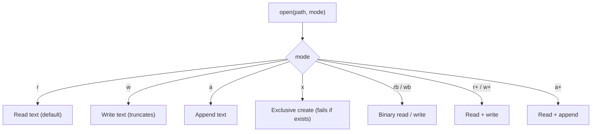

# File I/O and Serialization

> [!summary] Goal
> Master Python's file I/O: `open()` modes, `pathlib` for path manipulation, serialisation formats (JSON, CSV, pickle, TOML), and `shutil` for file operations.

## Table of Contents

1. [Opening Files](#opening-files)
2. [File Modes](#file-modes)
3. [`pathlib.Path`](#pathlibpath)
4. [`io.StringIO` and `io.BytesIO`](#iostringio-and-iobytesio)
5. [JSON](#json)
6. [CSV](#csv)
7. [Pickle](#pickle)
8. [TOML and Config](#toml-and-config)
9. [shutil](#shutil)
10. [Pitfalls](#pitfalls)

---

## Opening Files

```python
# The modern way — with statement + pathlib
from pathlib import Path

path = Path("data.txt")

# Read entire file
content = path.read_text()          # str — convenience method
content = path.read_bytes()         # bytes

# Write entire file
path.write_text("hello world")      # str
path.write_bytes(b"\x00\x01")       # bytes

# The traditional way (more control)
with open("data.txt", "r") as f:
    f.read()                        # entire file as string
    f.readline()                    # one line
    f.readlines()                   # list of lines

# Iterating over lines (memory efficient — for large files)
with open("large_file.txt") as f:
    for line in f:
        process(line)               # Only one line in memory at a time
```

---

## File Modes



| Mode | Read? | Write? | Truncates? | Position |
|------|:-----:|:------:|:----------:|:--------:|
| `r` | ✅ | ❌ | ❌ | Start |
| `w` | ❌ | ✅ | ✅ | Start |
| `a` | ❌ | ✅ | ❌ | End |
| `x` | ❌ | ✅ | N/A | Start |
| `r+` | ✅ | ✅ | ❌ | Start |
| `w+` | ✅ | ✅ | ✅ | Start |
| `a+` | ✅ | ✅ | ❌ | End |

---

## `pathlib.Path`

> [!info] `pathlib` (Python 3.4+) is the modern way to handle filesystem paths
> It replaces `os.path` with an object-oriented API. Paths are cross-platform (uses `/` on all platforms).

```python
from pathlib import Path

# Construction
p = Path(".")                          # relative
p = Path("/usr/bin/python3")           # absolute
p = Path.home() / "Documents" / "file.txt"  # join with /
p = Path(__file__).parent              # directory of current file

# Properties
p.name           # "file.txt"
p.stem           # "file" (name without extension)
p.suffix         # ".txt"
p.parent         # Path("/home/user/Documents")
p.anchor         # "/" (root)

# Testing
p.exists()       # True/False
p.is_file()      # True/False
p.is_dir()       # True/False
p.is_symlink()   # True/False

# Reading / writing (see above)
p.read_text()
p.write_text("data")

# Directory operations
p.mkdir(exist_ok=True)                 # mkdir -p
p.mkdir(parents=True, exist_ok=True)   # like mkdir -p
p.rmdir()                              # remove empty directory

# File operations
p.rename("new_name.txt")
p.unlink()                             # remove file
p.symlink_to(target)

# Glob
list(Path("src").glob("**/*.py"))      # all Python files recursively

# Iteration
for child in Path(".").iterdir():
    if child.is_file():
        print(child)
```

### `pathlib` vs `os.path`

```python
# Old way
import os
os.path.join("dir", "sub", "file.txt")
os.path.exists("file.txt")
os.path.getsize("file.txt")

# New way
from pathlib import Path
Path("dir") / "sub" / "file.txt"
Path("file.txt").exists()
Path("file.txt").stat().st_size
```

---

## `io.StringIO` and `io.BytesIO`

> [!info] In-memory file-like objects — great for testing and string manipulation

```python
from io import StringIO, BytesIO

# StringIO — treat a string as a file
buffer = StringIO()
buffer.write("hello\n")
buffer.write("world\n")
content = buffer.getvalue()     # "hello\nworld\n"
buffer.close()

# As a temporary readable file
buf = StringIO("line1\nline2\n")
for line in buf:
    print(line.strip())          # line1, line2

# BytesIO — binary version
buf = BytesIO()
buf.write(b"\x00\x01\x02")
buf.seek(0)
data = buf.read()                # b'\x00\x01\x02'
```

---

## JSON

```python
import json

data = {"name": "Alice", "scores": [90, 85, 92], "active": True}

# Serialize
json_str = json.dumps(data, indent=2)        # str
with open("data.json", "w") as f:
    json.dump(data, f, indent=2)

# Deserialize
data = json.loads(json_str)                   # from str
with open("data.json") as f:
    data = json.load(f)                       # from file

# Custom serialization
class User:
    def __init__(self, name, age):
        self.name, self.age = name, age

def user_to_dict(obj):
    if isinstance(obj, User):
        return {"__class__": "User", "name": obj.name, "age": obj.age}
    raise TypeError

user = User("Alice", 30)
json.dumps(user, default=user_to_dict)  # {"__class__":"User","name":"Alice","age":30}

# Custom deserialization
def dict_to_user(dct):
    if dct.get("__class__") == "User":
        return User(dct["name"], dct["age"])
    return dct

User = json.loads(json_str, object_hook=dict_to_user)
```

---

## CSV

```python
import csv

# Reading
with open("data.csv", newline="") as f:
    reader = csv.reader(f)                  # List of lists
    header = next(reader)                   # Skip header
    for row in reader:
        print(row[0], row[1])

# DictReader — access by column name
with open("data.csv", newline="") as f:
    reader = csv.DictReader(f)
    for row in reader:
        print(row["name"], row["age"])

# Writing
with open("output.csv", "w", newline="") as f:
    writer = csv.writer(f)
    writer.writerow(["name", "age"])         # header
    writer.writerow(["Alice", 30])
    writer.writerows([["Bob", 25], ["Carol", 35]])

# DictWriter
with open("output.csv", "w", newline="") as f:
    fieldnames = ["name", "age"]
    writer = csv.DictWriter(f, fieldnames=fieldnames)
    writer.writeheader()
    writer.writerow({"name": "Alice", "age": 30})
```

> [!tip] Always use `newline=""` when writing CSV
> Otherwise, on Windows, extra `\r` characters may be inserted.

---

## Pickle

```python
import pickle

# Serialize any Python object (except file handles, some lambdas, etc.)
data = {"users": [User("Alice", 30)], "version": 2}

# To bytes
bytes_data = pickle.dumps(data)

# To file
with open("data.pkl", "wb") as f:
    pickle.dump(data, f)

# From bytes
data = pickle.loads(bytes_data)

# From file
with open("data.pkl", "rb") as f:
    data = pickle.load(f)
```

> [!warning] Pickle is not secure
> Never unpickle untrusted data — `pickle.loads()` can execute arbitrary code during deserialization. Use JSON or another safe format for external data.

---

## TOML and Config

```toml
# config.toml
[server]
host = "localhost"
port = 8080

[database]
url = "postgresql://localhost/mydb"
pool_size = 5
```

```python
# Python 3.11+ — tomllib built-in
import tomllib
with open("config.toml", "rb") as f:
    config = tomllib.load(f)
# config["server"]["host"] — "localhost"

# Python 3.10 and earlier: pip install tomli

# configparser — for .ini style configs
from configparser import ConfigParser
cfg = ConfigParser()
cfg.read("config.ini")
cfg["server"]["host"]  # "localhost"
```

---

## shutil

```python
import shutil

# Copy files
shutil.copy("source.txt", "dest.txt")        # file → file
shutil.copy2("source.txt", "dest.txt")       # preserves metadata
shutil.copyfile("src.txt", "dst.txt")        # content only, no metadata
shutil.copytree("src_dir", "dst_dir")        # recursive directory copy

# Move / rename
shutil.move("source.txt", "archive/")        # move to directory

# Remove
shutil.rmtree("temp_dir")                    # recursive delete (like rm -rf)

# Archive
shutil.make_archive("backup", "zip", "my_project")
shutil.unpack_archive("backup.zip", "extract_dir")

# Disk usage
total, used, free = shutil.disk_usage("/")
```

---

## Pitfalls

### Forgetting to close files

```python
f = open("data.txt")    # ❌ Resource leak if exception occurs
data = f.read()

# Always use `with`:
with open("data.txt") as f:
    data = f.read()     # ✅ Closed automatically on block exit
```

### Newline handling in CSV on Windows

```python
with open("data.csv", "w", newline="") as f:   # ✅ Required on Windows
    writer = csv.writer(f)
```

### Binary mode for non-text files

```python
# ❌ Text mode corrupts binary data
with open("image.jpg", "r") as f:   # reads as text — may corrupt
    data = f.read()

# ✅ Binary mode
with open("image.jpg", "rb") as f:
    data = f.read()
```

### `pathlib` slash operator only works with `Path` objects

```python
Path("dir") + "/file.txt"       # ❌ TypeError
Path("dir") / "file.txt"        # ✅
str(Path("dir")) + "/file.txt"  # ✅ (but why?)
```

---

> [!question]- Interview Questions
>
> **Q: What's the difference between `open()` modes `w`, `a`, and `x`?**
> A: `w` truncates and overwrites. `a` appends at the end. `x` creates a new file and fails if it already exists (exclusive creation). Use `x` for lock files or "write once" patterns.
>
> **Q: When would you use `StringIO` instead of a temporary file?**
> A: When you need a file-like API but don't want to touch the filesystem. Common uses: testing functions that write to a file, building strings incrementally with file operations, mocking file I/O in tests.
>
> **Q: Why is pickle unsafe?**
> A: `pickle` serialises Python objects by encoding bytecode that reconstructs them. During `pickle.loads()`, this bytecode is executed. Malicious pickles can execute arbitrary system commands. Use JSON for untrusted data.

---

## Cross-Links

- [[Python/01_Foundations/07_Error_Handling_Context_Managers]] for `with` statements
- [[Python/01_Foundations/09_Stdlib_Essentials]] for `tempfile`, `argparse` with file args
- [[Python/02_Core/03_Network_Programming_HTTP]] for `requests` response handling
- [[Python/02_Core/08_Pandas_Deep_Dive]] for CSV I/O with pandas
