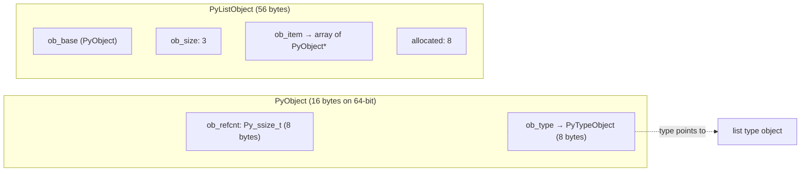
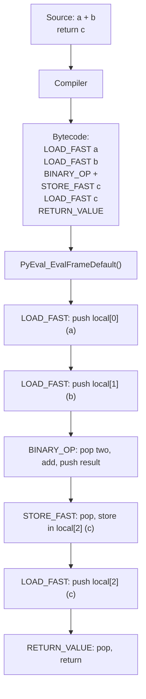
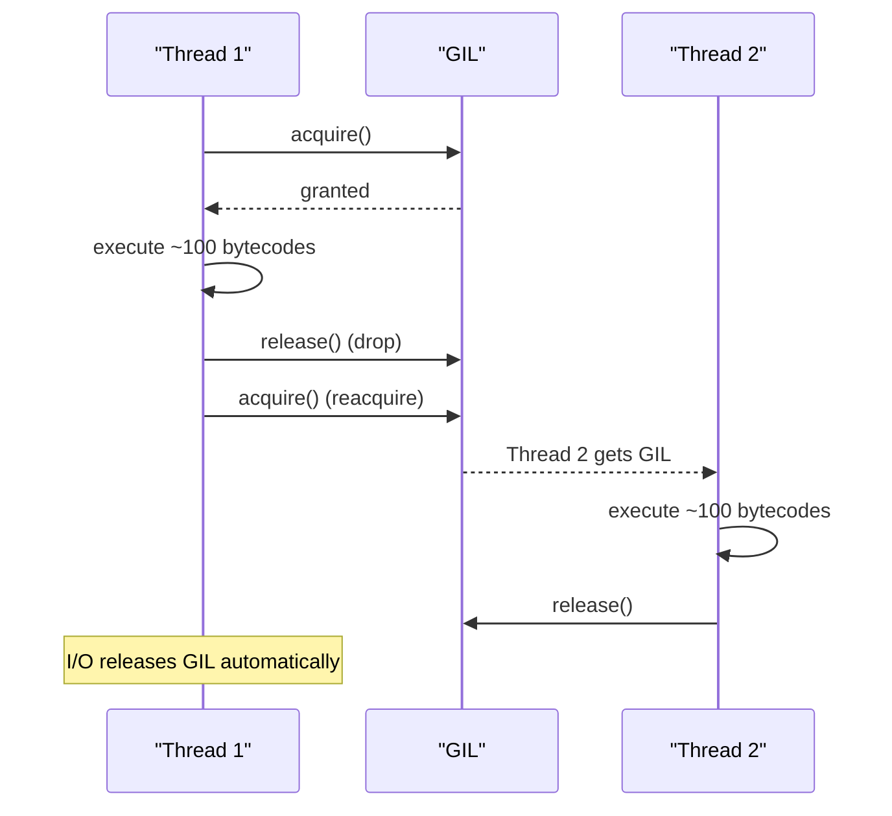

# CPython Internals

> [!summary] Goal
> Understand how CPython works under the hood — the `PyObject` struct, bytecode execution, the GIL (Global Interpreter Lock), reference counting, cyclic garbage collection, pymalloc, and type objects. This knowledge separates "Python user" from "Python expert."

## Table of Contents

1. [PyObject and Memory Layout](#pyobject-and-memory-layout)
2. [Bytecode Execution](#bytecode-execution)
3. [GIL Internals](#gil-internals)
4. [Reference Counting](#reference-counting)
5. [Cyclic Garbage Collection](#cyclic-garbage-collection)
6. [pymalloc](#pymalloc)
7. [Type Objects](#type-objects)
8. [Pitfalls](#pitfalls)

---

## PyObject and Memory Layout

> [!info] Every Python object is a `PyObject` struct
> In CPython, all objects start with the same header: reference count + type pointer.

```c
// CPython 3.12 Include/object.h (simplified)
typedef struct _object {
    Py_ssize_t ob_refcnt;        // Reference count
    PyTypeObject *ob_type;       // Type (every object's type)
} PyObject;

// Objects with variable length (list, str, tuple, bytes)
typedef struct {
    PyObject ob_base;            // ob_refcnt + ob_type
    Py_ssize_t ob_size;          // Number of items
} PyVarObject;
```



```python
import sys

# Memory cost of Python objects
sys.getsizeof(42)           # 28 bytes (int)
sys.getsizeof("hello")      # 54 bytes (str)
sys.getsizeof([])           # 56 bytes (empty list)
sys.getsizeof([1, 2, 3])    # 80 bytes (list + 3 * 8-byte pointers)
sys.getsizeof({})           # 72 bytes (empty dict)
```

---

## Bytecode Execution

> [!info] Python source → AST → bytecode → executed by the bytecode evaluation loop
> The `dis` module lets you inspect the bytecode that CPython generates.

```python
import dis

def add(a, b):
    c = a + b
    return c

dis.dis(add)
#   2           0 LOAD_FAST                0 (a)
#               2 LOAD_FAST                1 (b)
#               4 BINARY_OP                0 (+)
#               8 STORE_FAST               2 (c)
#   3          10 LOAD_FAST                2 (c)
#              12 RETURN_VALUE
```



### The evaluation loop (conceptual)

```c
// Python/ceval.c (simplified — the main interpreter loop)
PyObject* _PyEval_EvalFrameDefault(PyThreadState *tstate, _PyInterpreterFrame *frame) {
    for (;;) {
        opcode = next_opcode(frame);           // Read next instruction
        switch (opcode) {
            case LOAD_FAST:                    // Most common — local variable
                value = GETLOCAL(oparg);       // Index into frame->locals
                PUSH(value);
                break;
            case BINARY_OP:                    // a + b, a - b, etc.
                rhs = POP();
                lhs = POP();
                result = PyNumber_Add(lhs, rhs);  // Calls lhs.__add__(rhs)
                PUSH(result);
                break;
            case RETURN_VALUE:
                retval = POP();
                return retval;
            // ... 100+ other opcodes
        }
        CHECK_GIL();                           // Check for signals every ~100 ops
    }
}
```

### Frame and block stack

```python
# Each function call creates a frame:
#   Frame stores: locals, globals, builtins, code object, instruction pointer
#   Frames live on the call stack (C stack for Python calls)

import sys
def inner():
    return sys._getframe(0)    # Current frame

def outer():
    return inner()

f = outer()
f.f_code.co_name       # "inner"
f.f_back.f_code.co_name  # "outer"
```

---

## GIL Internals

> [!info] The GIL (Global Interpreter Lock) prevents two Python threads from executing bytecode simultaneously
> It's a mutex that protects all CPython internal state. Only one thread can hold the GIL at any time.



### GIL release points

```c
// The GIL is released and reacquired:
// 1. Every ~100 bytecode instructions (check interval)
// 2. Before blocking I/O (read(), write(), select(), etc.)
// 3. During time.sleep()
// 4. During C extension calls that release the GIL

// Python 3.12+: Per-interpreter GIL (--disable-gil build)
// Sub-interpreters can have independent GILs (PEP 684)
// Python 3.13+: Experimental free-threaded build (no GIL)
```

> [!warning] GIL ≠ thread safety
> The GIL protects CPython internals, not your data. Two threads appending to the same list can still corrupt it (race condition on `list.append`). Use `threading.Lock` for shared data.

```python
import threading

counter = 0
lock = threading.Lock()

def increment():
    global counter
    for _ in range(1_000_000):
        with lock:           # Needed even with GIL!
            counter += 1     # += is not atomic
```

---

## Reference Counting

> [!info] Every `PyObject` has an `ob_refcnt` that tracks how many references point to it
> When `ob_refcnt` reaches 0, the object is deallocated immediately. This is deterministic (unlike GC in Java/Go).

```python
import sys

x = 42
sys.getrefcount(x)   # At least 2 (x + argument to getrefcount)

y = x                # Same object — refcount incremented
sys.getrefcount(x)   # At least 3

del y                # Refcount decremented
sys.getrefcount(x)   # At least 2
```

```c
// Python 3.12: Include/object.h
#define Py_INCREF(op) ((op)->ob_refcnt++)
#define Py_DECREF(op)                             \
    if (--(op)->ob_refcnt == 0) {                 \
        _Py_Dealloc((PyObject *)(op));            \
    }

// _Py_Dealloc dispatches through tp_dealloc
void _Py_Dealloc(PyObject *op) {
    destructor dealloc = Py_TYPE(op)->tp_dealloc;
    (*dealloc)(op);           // Calls the type's specific deallocator
}
```

### Immortal objects (Python 3.12+)

```python
# Python 3.12 introduces immortal objects — refcount that never reaches 0
# These include: None, True, False, small ints (-5..256), empty tuple
# Immortal objects are never deallocated — saves atomic refcount operations

x = None
sys.getrefcount(x)   # A very large number (immortal sentinel)
```

---

## Cyclic Garbage Collection

> [!info] Reference counting alone can't handle cycles
> Two objects referencing each other never reach refcount=0, even if nothing else references them. The cyclic GC (generational) detects and collects these cycles.

```python
import gc

# Enable debug output
gc.set_debug(gc.DEBUG_SAVEALL)

class Node:
    def __init__(self):
        self.ref = None
    def __del__(self):
        print(f"Deleting {id(self)}")

# Create a cycle
a = Node()
b = Node()
a.ref = b
b.ref = a

del a, b               # Refcounts: both have 1 (from each other)
gc.collect()           # Force collection — detects and breaks the cycle
# "Deleting ..." x 2
```

```mermaid
flowchart TD
    A["Node A<br/>refcount: 1<br/>(from B)"] -->|"a.ref = b"| B["Node B<br/>refcount: 1<br/>(from A)"]
    B -->|"b.ref = a"| A
    G["External refs: 0"] -.-> A
    G -.-> B
    note for A "Refcount > 0 but<br/>unreachable from root"
    note for B "GC detects via<br/>tentative refcount"
```

### Generational GC

```python
# Three generations: 0, 1, 2
gc.get_threshold()        # (700, 10, 10)
# Gen 0: collect every 700 allocations
# Gen 1: collect every 10 gen0 collections
# Gen 2: collect every 10 gen1 collections

# Manual control
gc.collect(0)             # Collect only gen 0
gc.collect()              # Collect all generations (full GC)

gc.set_threshold(500, 5, 5)  # Tune for your app

# Finding referrers
import gc, objgraph       # pip install objgraph
objgraph.show_refs([my_object], filename="refs.png")
```

---

## pymalloc

> [!info] CPython's small-object allocator
> For objects ≤ 512 bytes, pymalloc uses pre-allocated arenas (256KB each) divided into pools. This avoids calling `malloc()` for every small object, reducing fragmentation and improving performance.

```python
# pymalloc memory layout
# Arena (256KB) → Pools (4KB each, same size class) → Blocks (8..512 bytes)

# Objects > 512 bytes go directly to system malloc
# Objects ≤ 512 bytes use pymalloc

import sys
# Small objects (pymalloc)
sys.getsizeof([])      # 56 bytes → pymalloc
sys.getsizeof([1]*100) # 856 bytes → system malloc

# Disable pymalloc for debugging
# PYTHONMALLOC=malloc python script.py   # Force system malloc everywhere
# PYTHONMALLOC=debug python script.py    # Enable allocator debug hooks
```

---

## Type Objects

> [!info] `PyTypeObject` is the struct behind `type` — it defines all operations for a type
> Every Python object's `ob_type` points to its type object, which contains function pointers (`tp_*` slots) for all operations.

```python
# Key tp_* slots in PyTypeObject (Include/cpython/object.h)
# tp_dealloc     → destructor
# tp_str         → __str__
# tp_repr        → __repr__
# tp_hash        → __hash__
# tp_call        → __call__
# tp_new         → __new__
# tp_init        → __init__
# tp_iter        → __iter__
# tp_iternext    → __next__
# tp_getattro    → __getattribute__
# tp_setattro    → __setattr__
# tp_getset      → @property descriptors
# tp_methods     → method table
# tp_mro         → __mro__

# Subclassing a built-in type
class MyInt(int):
    """Inherits all of int's tp_* slots."""

# The MRO is computed (C3 linearization) and stored in tp_mro
MyInt.__mro__   # (MyInt, int, object)
```

---

## Pitfalls

### `is` on integers

```python
# CPython caches small ints (-5 to 256)
a = 256
b = 256
a is b          # True (same cached object)

c = 257
d = 257
c is d          # False (different objects — use ==)
```

### Reference cycles with `__del__`

```python
class Cyclic:
    def __init__(self):
        self.other = None
    def __del__(self):
        print("Deleting")

a = Cyclic(); b = Cyclic()
a.other = b; b.other = a
del a, b
gc.collect()    # __del__ is NOT called if cycle has __del__!
# Cyclic objects with __del__ become "garbage" that can't be collected
```

### Not understanding immortals (3.12+)

Immortal objects (`None`, `True`, `False`, small ints) never have their refcount decremented to 0. CPython special-cases these to avoid atomic operations. Don't rely on `sys.getrefcount()` for these.

---

> [!question]- Interview Questions
>
> **Q: How does CPython's bytecode execution work?**
> A: Python source is compiled to bytecode (stored in `.pyc` files or code objects). The evaluation loop (`PyEval_EvalFrameDefault`) is a gigantic `switch` statement that reads each opcode, executes it (pushing/popping from the value stack), and advances to the next instruction. Each function call creates a new frame with its own locals and stack.
>
> **Q: How does the GIL affect Python performance?**
> A: The GIL prevents true parallel execution of Python bytecode across CPU cores. CPU-bound tasks see no benefit from threads (one runs, others wait). I/O-bound tasks work well because the GIL is released during I/O. For CPU parallelism, use `multiprocessing` or C extensions that release the GIL.
>
> **Q: How does Python's garbage collection differ from reference counting?**
> A: Reference counting is immediate and deterministic — objects are freed when their refcount hits 0. The cyclic GC is a backup that runs periodically to detect and collect unreachable cycles. Most objects are freed by refcounting; the GC handles the ~5% that form cycles. Reference counting has overhead on every assignment; the GC runs only on demand or at thresholds.

---

## Cross-Links

- [[Python/01_Foundations/04_OOP_Classes_Dunder_Methods]] for `tp_*` slot mapping
- [[Python/02_Core/02_Concurrency_Parallelism]] for threading and multiprocessing
- [[Python/03_Advanced/02_Performance_Profiling]] for profiling optimisations
- [[Python/04_Playbooks/01_Debug_Memory_Leaks]] for memory debugging
- [CPython Source](https://github.com/python/cpython)
