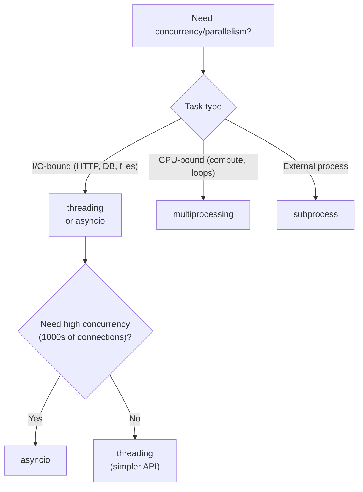

# Concurrency and Parallelism

> [!summary] Goal
> Understand Python's concurrency options — `threading` (I/O-bound, GIL-limited), `multiprocessing` (CPU-bound, true parallelism), `concurrent.futures` (high-level API), and `subprocess` (external processes). When to use each and how to avoid common pitfalls.

## Table of Contents

1. [When to Use What](#when-to-use-what)
2. [threading](#threading)
3. [GIL Impact on Threading](#gil-impact-on-threading)
4. [multiprocessing](#multiprocessing)
5. [concurrent.futures](#concurrentfutures)
6. [subprocess](#subprocess)
7. [Pitfalls](#pitfalls)

---

## When to Use What



| Approach | Best for | GIL impact | Memory model |
|----------|----------|:----------:|--------------|
| `threading` | I/O-bound, moderate concurrency | Blocked by GIL during CPU work | Shared (via `Lock`) |
| `asyncio` | I/O-bound, high concurrency | Single-threaded (no GIL contention) | Shared (cooperative) |
| `multiprocessing` | CPU-bound, data parallelism | No GIL (separate processes) | Separate (via `Queue`, `Pipe`) |
| `concurrent.futures` | High-level thread/process pool | Same as underlying | Same as underlying |
| `subprocess` | Running external programs | No GIL | Separate (via PIPE) |

---

## threading

```python
import threading
import time

# Basic thread
def worker(name: str, delay: float):
    print(f"{name} starting")
    time.sleep(delay)
    print(f"{name} finished")

threads = []
for i in range(3):
    t = threading.Thread(target=worker, args=(f"W{i}", i))
    threads.append(t)
    t.start()

for t in threads:
    t.join()                # Wait for all to complete

print("All done")
```

### Thread Safety — Lock, RLock, Condition

```python
import threading

counter = 0
lock = threading.Lock()

def increment():
    global counter
    for _ in range(100_000):
        with lock:            # Acquire/release — even with GIL!
            counter += 1

# RLock — re-entrant lock (same thread can acquire multiple times)
rlock = threading.RLock()

def recursive_lock(n):
    with rlock:
        if n > 0:
            recursive_lock(n - 1)   # Same thread re-acquires — OK with RLock!

# Condition — signal between threads
condition = threading.Condition()
data_ready = []

def producer():
    with condition:
        data_ready.append("item")
        condition.notify()          # Wake one consumer

def consumer():
    with condition:
        while not data_ready:
            condition.wait()        # Release lock, wait for notify
        item = data_ready.pop()

# Event — one-shot signal
event = threading.Event()

def waiter():
    print("Waiting...")
    event.wait()                    # Blocks until set
    print("Go!")

def setter():
    time.sleep(1)
    event.set()

# Semaphore — limit concurrent access
sem = threading.Semaphore(5)

def limited_work():
    with sem:
        ...  # Max 5 concurrent
```

### Thread-local data

```python
import threading

local = threading.local()

def worker():
    local.user_id = threading.get_ident()  # Each thread has its own `user_id`
    print(local.user_id)

# Thread-local stores data per-thread — no locking needed for per-thread data
```

---

## GIL Impact on Threading

> [!info] The GIL prevents Python bytecode from running on multiple cores simultaneously
> Threading is great for I/O-bound work (the GIL is released during I/O) but **not** for CPU-bound work.

```python
# CPU-bound — threading provides NO speedup (GIL contention)
import time

def cpu_heavy(n):
    while n > 0:
        n -= 1

# Single-threaded: ~0.5s
start = time.time()
cpu_heavy(50_000_000)
cpu_heavy(50_000_000)
print(f"Sequential: {time.time() - start:.2f}s")

# Multi-threaded: ~0.5s (same!) — GIL serialises execution
start = time.time()
t1 = threading.Thread(target=cpu_heavy, args=(50_000_000,))
t2 = threading.Thread(target=cpu_heavy, args=(50_000_000,))
t1.start(); t2.start()
t1.join(); t2.join()
print(f"Threaded: {time.time() - start:.2f}s")

# I/O-bound — threading DOES help
def io_heavy():
    time.sleep(1)         # GIL released during sleep

# Single: ~2s
# Threaded: ~1s (both sleep concurrently)
```

> [!warning] The GIL is released during I/O, sleep, and C extension calls that explicitly release it
> But it's held during pure Python computation. For CPU work, use `multiprocessing` or C extensions.

---

## multiprocessing

```python
import multiprocessing as mp
import time

def cpu_worker(n):
    count = 0
    while n > 0:
        count += n
        n -= 1
    return count

# Process pool — map across CPU cores
with mp.Pool(processes=4) as pool:
    results = pool.map(cpu_worker, [50_000_000] * 4)
    print(results)

# Or manually
def worker(q: mp.Queue, result: mp.Queue):
    n = q.get()
    result.put(cpu_worker(n))

q = mp.Queue()
result_q = mp.Queue()
q.put(50_000_000)
p = mp.Process(target=worker, args=(q, result_q))
p.start()
p.join()
print(result_q.get())
```

### Multiprocessing patterns

```python
import multiprocessing as mp

# Shared memory with Value/Array
counter = mp.Value('i', 0)       # Shared integer
arr = mp.Array('d', [0.0] * 10)  # Shared array of doubles

def increment(c):
    with c.get_lock():            # Multiprocessing-aware lock
        c.value += 1

# Manager — share Python objects across processes
with mp.Manager() as manager:
    shared_dict = manager.dict()
    shared_list = manager.list()

    def update(d):
        d["key"] = "value"

    p = mp.Process(target=update, args=(shared_dict,))
    p.start(); p.join()
    print(shared_dict)            # {"key": "value"}

# Pool with starmap
def add(a, b):
    return a + b

with mp.Pool() as pool:
    results = pool.starmap(add, [(1, 2), (3, 4), (5, 6)])
    # [3, 7, 11]

# Pool with async
result = pool.apply_async(cpu_worker, (50_000_000,))
# Do other work
print(result.get(timeout=10))     # Block until ready
```

> [!warning] Pickling limitation
> Arguments passed to `multiprocessing` must be picklable. Lambdas, nested functions, and many objects with C extensions can't be pickled. Use `pathos.multiprocessing` or `cloudpickle` for complex objects.

---

## concurrent.futures

```python
from concurrent.futures import ThreadPoolExecutor, ProcessPoolExecutor, as_completed
import time

def fetch_url(url: str) -> str:
    time.sleep(1)                  # Simulate network
    return f"Data from {url}"

# Thread pool (I/O-bound)
with ThreadPoolExecutor(max_workers=5) as executor:
    urls = ["http://a.com", "http://b.com", "http://c.com"]

    # Submit individual tasks
    futures = [executor.submit(fetch_url, url) for url in urls]

    # Process as they complete
    for future in as_completed(futures):
        print(future.result())

    # Or use map (simpler, but blocks on slowest)
    results = list(executor.map(fetch_url, urls))

# Process pool (CPU-bound)
with ProcessPoolExecutor(max_workers=4) as executor:
    results = list(executor.map(cpu_worker, [50_000_000] * 4))

# Timeout
future = executor.submit(fetch_url, "http://slow.com")
try:
    result = future.result(timeout=2)
except TimeoutError:
    print("Timed out")

# Callbacks
def on_done(future):
    print(f"Done: {future.result()}")

future = executor.submit(fetch_url, "/a")
future.add_done_callback(on_done)
```

---

## subprocess

```python
import subprocess

# Run and wait
result = subprocess.run(["ls", "-l"], capture_output=True, text=True)
print(result.stdout)           # Captured stdout
print(result.returncode)       # 0 = success

# Run with input
result = subprocess.run(
    ["grep", "error"],
    input="line1\nline2 error line3\nline4",
    capture_output=True, text=True,
)
print(result.stdout)           # "line2 error line3\n"

# Run without waiting (Popen)
proc = subprocess.Popen(
    ["ping", "-c", "4", "google.com"],
    stdout=subprocess.PIPE,
    stderr=subprocess.PIPE,
    text=True,
)

# Do other work while ping runs
for line in proc.stdout:
    print(f"PING: {line.strip()}")

proc.wait()                    # Wait for completion

# Timeout
try:
    result = subprocess.run(["sleep", "10"], timeout=5)
except subprocess.TimeoutExpired:
    print("Process timed out")

# Shell injection warning
user_input = "hello; rm -rf /"
# ❌ Never do this:
# subprocess.run(f"echo {user_input}", shell=True)
# ✅ Use list form (no shell):
subprocess.run(["echo", user_input])
```

> [!warning] Avoid `shell=True` with untrusted input
> It's a shell injection vulnerability. Use the list form (`["cmd", "arg1", "arg2"]`) instead.

---

## Pitfalls

### GIL vs threading for CPU

Threading doesn't speed up CPU-bound Python code. Use `multiprocessing` or `ProcessPoolExecutor` for parallelism.

### Shared state in multiprocessing

Each process has its own memory space. Modifying a global variable in one process doesn't affect others. Use `mp.Value`, `mp.Array`, `mp.Manager`, or `mp.Queue` for sharing.

### Pickling limitations

```python
# ❌ Can't pickle lambdas
with mp.Pool() as pool:
    pool.map(lambda x: x * 2, [1, 2, 3])  # AttributeError!

# ✅ Use a named function
def double(x): return x * 2
pool.map(double, [1, 2, 3])
```

### Zombie processes

Always call `.join()` or `.close()` on `multiprocessing.Process` objects. Unjoined processes become zombies.

### Thread safety of `concurrent.futures`

The callable passed to `submit()` runs in a separate thread. Accessing shared data without locks can cause race conditions — even with the GIL.

---

> [!question]- Interview Questions
>
> **Q: What's the difference between concurrency and parallelism?**
> A: Concurrency is about dealing with many tasks at once (task switching). Parallelism is about doing many tasks at once (multiple CPU cores). Threading and asyncio provide concurrency; multiprocessing provides parallelism. Python threads are concurrent but not parallel (GIL).
>
> **Q: When would you use `multiprocessing` over `threading`?**
> A: Use `multiprocessing` for CPU-bound tasks that need true parallelism (data processing, computation, ML training). Use `threading` for I/O-bound tasks (HTTP requests, file operations, database queries). The GIL makes threading worthless for CPU-bound Python code.
>
> **Q: How does the GIL affect `concurrent.futures.ThreadPoolExecutor`?**
> A: `ThreadPoolExecutor` uses threads under the hood. CPU-bound tasks submitted to it will be serialised by the GIL. I/O-bound tasks benefit because the GIL is released during I/O. For CPU-bound work, use `ProcessPoolExecutor` instead.

---

## Cross-Links

- [[Python/01_Foundations/11_Async_Python_Basics]] for async comparison
- [[Python/02_Core/01_CPython_Internals]] for GIL internals
- [[Python/03_Advanced/02_Performance_Profiling]] for profiling concurrent code
- [[Python/04_Playbooks/02_Debug_Concurrency]] for debugging concurrency issues
- [[Python/02_Core/03_Network_Programming_HTTP]] for I/O-bound threading use cases
