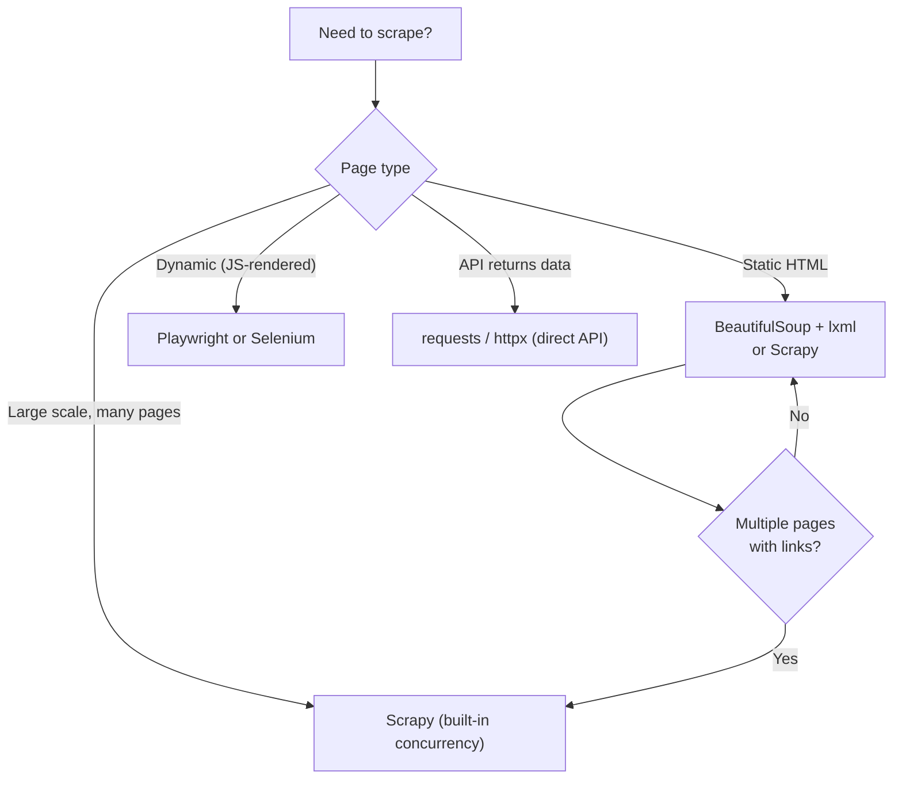

# Web Scraping

> [!summary] Goal
> Master web scraping in Python — from simple HTML parsing with BeautifulSoup to large-scale Scrapy spiders, dynamic content with Playwright, anti-detection techniques, pagination patterns, and async scraping.

## Table of Contents

1. [Tool Selection](#tool-selection)
2. [BeautifulSoup and lxml](#beautifulsoup-and-lxml)
3. [Scrapy](#scrapy)
4. [Selenium and Playwright](#selenium-and-playwright)
5. [Anti-Detection Techniques](#anti-detection-techniques)
6. [Pagination Patterns](#pagination-patterns)
7. [Async Scraping](#async-scraping)
8. [Data Extraction and Storage](#data-extraction-and-storage)
9. [Pitfalls](#pitfalls)

---

## Tool Selection



| Library | Use Case | Speed | JavaScript |
|---------|----------|:-----:|:----------:|
| `requests` + `BeautifulSoup` | Simple, single-page scraping | Fast | ❌ |
| `urlopen` + `lxml` | Performance-critical parsing | Fastest | ❌ |
| `Scrapy` | Large-scale, multi-page spiders | Very fast (async) | ❌ (needs Splash) |
| `Playwright` | JavaScript-rendered pages | Moderate | ✅ |
| `Selenium` | Legacy dynamic scraping | Slow | ✅ |

---

## BeautifulSoup and lxml

```python
import requests
from bs4 import BeautifulSoup

response = requests.get("https://example.com/products", timeout=10)
soup = BeautifulSoup(response.text, "lxml")       # lxml parser (fastest)

# Tag selection
soup.title                            # <title>Page Title</title>
soup.title.text                       # "Page Title"
soup.find("h1")                       # First <h1>
soup.find_all("a")                    # All <a> tags
soup.find_all("a", class_="product")  # With CSS class
soup.find_all("div", {"data-id": "123"})  # With attribute

# CSS selectors (Python 3.9+: select() is built into BS4)
soup.select(".product .price")        # CSS selector
soup.select_one("#main-title")        # First match

# Attribute access
link = soup.find("a")
link.get("href")                      # "https://..."
link["href"]                          # Same, raises KeyError if missing

# Navigating the tree
soup.find("div").parent               # Parent node
soup.find("div").children             # Direct children
soup.find("div").find_next_sibling("p")  # Next <p> sibling
soup.find("div").find_previous_sibling("h2")  # Previous <h2>

# Text extraction
soup.get_text(separator=" ", strip=True)     # All text, cleaned
[s.get_text(strip=True) for s in soup.find_all("p")]

# lxml directly (for raw speed)
from lxml import html
tree = html.fromstring(response.content)
tree.xpath("//div[@class='product']//span/text()")  # XPath
tree.cssselect(".product .price")                    # CSS selector
```

---

## Scrapy

> [!info] Scrapy is an asynchronous web scraping framework
> It handles request scheduling, concurrency, retries, item pipelines, and data export out of the box.

```python
# spiders/products_spider.py
import scrapy

class ProductsSpider(scrapy.Spider):
    name = "products"
    start_urls = ["https://example.com/products"]

    def parse(self, response):
        # Extract product links
        for product in response.css(".product"):
            yield scrapy.Request(
                url=product.css("a::attr(href)").get(),
                callback=self.parse_product,
            )

        # Follow pagination
        next_page = response.css("a.next::attr(href)").get()
        if next_page:
            yield scrapy.Request(url=next_page, callback=self.parse)

    def parse_product(self, response):
        yield {
            "name": response.css("h1::text").get(),
            "price": response.css(".price::text").get(),
            "description": response.css(".desc::text").get().strip(),
        }

# items.py — structured data
import scrapy

class ProductItem(scrapy.Item):
    name = scrapy.Field()
    price = scrapy.Field()
    url = scrapy.Field()
    scraped_at = scrapy.Field()

# pipelines.py — data processing
class ProductPipeline:
    def process_item(self, item, spider):
        item["price"] = float(item["price"].replace("$", ""))
        item["scraped_at"] = datetime.utcnow()
        return item

# middlewares.py — request/response hooks
class ThrottleMiddleware:
    def process_request(self, request, spider):
        request.meta["download_timeout"] = 30
        return None

# settings.py
CONCURRENT_REQUESTS = 16
DOWNLOAD_DELAY = 0.5
USER_AGENT = "Mozilla/5.0 (compatible; MyScraper/1.0)"
ITEM_PIPELINES = {
    "myproject.pipelines.ProductPipeline": 300,
}

# Running
# scrapy crawl products -o output.json
```

### Scrapy vs BeautifulSoup

| Feature | BeautifulSoup | Scrapy |
|---------|:-------------:|:------:|
| Concurrency | Manual (threads/async) | Built-in (Twisted) |
| Link following | Manual | Automatic (CrawlSpider) |
| Data pipelines | Manual | Built-in |
| Retries/middleware | Manual | Built-in |
| Export formats | Manual | JSON, CSV, XML, Parquet |
| Learning curve | Low | Medium |

---

## Selenium and Playwright

> [!info] For JavaScript-rendered pages, you need a browser automation tool
> Playwright is the modern choice (faster, better API, cross-browser). Selenium is older but more widely documented.

### Playwright (Recommended)

```python
# pip install playwright
# playwright install chromium

import asyncio
from playwright.async_api import async_playwright

async def scrape_dynamic():
    async with async_playwright() as p:
        browser = await p.chromium.launch(headless=True)
        page = await browser.new_page()

        await page.goto("https://example.com/dynamic")
        await page.wait_for_selector(".product-list")         # Wait for content

        # Extract data
        products = await page.eval_on_selector_all(
            ".product",
            """elements => elements.map(el => ({
                name: el.querySelector('h2').textContent,
                price: el.querySelector('.price').textContent,
            }))"""
        )

        # Take screenshot (debugging)
        await page.screenshot(path="page.png")

        # Click "Load More" until all loaded
        while await page.locator("button.load-more").is_visible():
            await page.click("button.load-more")
            await page.wait_for_timeout(1000)

        await browser.close()
        return products

results = asyncio.run(scrape_dynamic())
```

### Selenium (Legacy)

```python
from selenium import webdriver
from selenium.webdriver.common.by import By
from selenium.webdriver.support.ui import WebDriverWait
from selenium.webdriver.support import expected_conditions as EC

driver = webdriver.Chrome()
driver.get("https://example.com")

# Wait for element
wait = WebDriverWait(driver, 10)
element = wait.until(EC.presence_of_element_located((By.CLASS_NAME, "product")))

# Extract
products = driver.find_elements(By.CLASS_NAME, "product")
data = [{"name": p.find_element(By.TAG_NAME, "h2").text} for p in products]

driver.quit()
```

---

## Anti-Detection Techniques

```python
import random
import time

# 1. Rotate User-Agents
USER_AGENTS = [
    "Mozilla/5.0 (Windows NT 10.0; Win64; x64) AppleWebKit/537.36 ...",
    "Mozilla/5.0 (Macintosh; Intel Mac OS X 10_15_7) AppleWebKit/537.36 ...",
    # ... 10+ more
]

def get_session():
    session = requests.Session()
    session.headers.update({
        "User-Agent": random.choice(USER_AGENTS),
        "Accept": "text/html,application/xhtml+xml,application/xml;q=0.9,*/*;q=0.8",
        "Accept-Language": "en-US,en;q=0.5",
        "Accept-Encoding": "gzip, deflate, br",
        "Connection": "keep-alive",
    })
    return session

# 2. Random delays
def polite_request(url, session):
    delay = random.uniform(1.0, 3.0)
    time.sleep(delay)
    return session.get(url, timeout=10)

# 3. Rotating proxies
proxies = ["http://proxy1:8080", "http://proxy2:8080"]

def get_with_proxy(url, session):
    proxy = random.choice(proxies)
    return session.get(url, proxies={"http": proxy, "https": proxy})

# 4. Playwright anti-detection
async def stealth_page(browser):
    page = await browser.new_page()
    await page.add_init_script("""
        // Override navigator.webdriver
        Object.defineProperty(navigator, 'webdriver', { get: () => false });
    """)
    return page

# 5. Respect robots.txt
from urllib.robotparser import RobotFileParser

rp = RobotFileParser()
rp.set_url("https://example.com/robots.txt")
rp.read()
if rp.can_fetch("*", "https://example.com/products"):
    # Safe to scrape
    pass
```

---

## Pagination Patterns

```python
# 1. URL-based pagination (?page=2)
def scrape_page(base_url, start=1, end=10):
    for page_num in range(start, end + 1):
        url = f"{base_url}?page={page_num}"
        yield from parse_page(url)

# 2. "Load More" button (Playwright)
async def load_more(page):
    while True:
        try:
            await page.click("button.load-more", timeout=3000)
            await page.wait_for_timeout(1000)
        except:
            break

# 3. Infinite scroll (Playwright)
async def infinite_scroll(page):
    previous_height = 0
    while True:
        current_height = await page.evaluate("document.body.scrollHeight")
        if current_height == previous_height:
            break
        await page.evaluate("window.scrollTo(0, document.body.scrollHeight)")
        await page.wait_for_timeout(2000)
        previous_height = current_height

# 4. Cursor-based pagination (?after=cursor123)
def scrape_cursor(api_url):
    cursor = None
    while True:
        params = {"cursor": cursor} if cursor else {}
        data = requests.get(api_url, params=params).json()
        yield from data["results"]
        cursor = data.get("next_cursor")
        if not cursor:
            break
```

---

## Async Scraping

```python
import asyncio
import aiohttp
from bs4 import BeautifulSoup
from asyncio import Semaphore

sem = Semaphore(10)                  # Max 10 concurrent requests

async def fetch(session, url):
    async with sem:
        try:
            async with session.get(url, timeout=aiohttp.ClientTimeout(30)) as resp:
                html = await resp.text()
                return url, html
        except Exception as e:
            return url, None

async def parse(url, html):
    if not html:
        return None
    soup = BeautifulSoup(html, "lxml")
    title = soup.title.text if soup.title else None
    return {"url": url, "title": title}

async def scrape_many(urls):
    async with aiohttp.ClientSession() as session:
        # Fetch all pages concurrently
        fetch_tasks = [fetch(session, url) for url in urls]
        results = await asyncio.gather(*fetch_tasks)

        # Parse each result
        parse_tasks = [parse(url, html) for url, html in results]
        return await asyncio.gather(*parse_tasks)

urls = [f"https://example.com/page/{i}" for i in range(100)]
data = asyncio.run(scrape_many(urls))
```

---

## Data Extraction and Storage

```python
import csv, json
from pathlib import Path

# Save to JSON
def save_json(data: list, path: str):
    Path(path).write_text(json.dumps(data, indent=2, default=str))

# Save to CSV
def save_csv(data: list, path: str):
    if not data:
        return
    with open(path, "w", newline="") as f:
        writer = csv.DictWriter(f, fieldnames=data[0].keys())
        writer.writeheader()
        writer.writerows(data)

# Save to database
import sqlite3

def save_to_db(data: list):
    conn = sqlite3.connect("scraped.db")
    conn.execute("""CREATE TABLE IF NOT EXISTS products (
        name TEXT, price REAL, url TEXT UNIQUE, scraped_at TEXT
    )""")
    for item in data:
        conn.execute(
            "INSERT OR REPLACE INTO products VALUES (?, ?, ?, ?)",
            (item["name"], item["price"], item["url"], item["scraped_at"]),
        )
    conn.commit()
```

---

## Pitfalls

### Scraping too fast

```python
# ❌ 100 requests per second — likely to get blocked
for url in urls:
    requests.get(url)

# ✅ Polite delays
for url in urls:
    time.sleep(random.uniform(1, 3))
    requests.get(url)
```

### Not handling rate limits (HTTP 429)

```python
response = requests.get(url)
if response.status_code == 429:
    retry_after = int(response.headers.get("Retry-After", 60))
    time.sleep(retry_after)
    response = requests.get(url)     # Retry
```

### Ignoring `robots.txt`

Always check `robots.txt` first. Some sites disallow scraping entirely. Scraping disallowed paths may be legally problematic.

### Brittle selectors

```python
# ❌ Fragile — breaks on minor HTML changes
soup.find_all("div", class_="product-item-123")

# ✅ Robust — use semantic selectors
soup.select("[data-product-id]")
soup.find("article").find("h2")
```

### JavaScript-rendered content

If `requests.get(url)` returns empty HTML, the page likely uses JavaScript to load data. Use Playwright, or check if the site has a public API (look at Network tab in DevTools).

---

> [!question]- Interview Questions
>
> **Q: What's the difference between Scrapy and BeautifulSoup?**
> A: Scrapy is a full scraping framework with built-in concurrency (Twisted), request scheduling, retries, item pipelines, and export. BeautifulSoup is an HTML parsing library that needs you to handle HTTP requests, concurrency, and data flow manually. Use Scrapy for large-scale projects; use BS4 for quick, single-page extraction.
>
> **Q: When would you use Playwright over Selenium?**
> A: Playwright is faster, has a cleaner async API, supports multiple browsers (Chromium, Firefox, WebKit) with the same API, and has built-in auto-wait and network interception. Selenium is older, slower, and has a more complex API. For new projects, use Playwright.
>
> **Q: How do you handle rate limiting when scraping?**
> A: Check HTTP status 429, parse the `Retry-After` header, wait that long (or use exponential backoff with jitter), then retry. Also implement polite delays between requests, rotate user-agents and proxies, and respect `robots.txt`.

---

## Cross-Links

- [[Python/02_Core/03_Network_Programming_HTTP]] for HTTP fundamentals
- [[Python/01_Foundations/11_Async_Python_Basics]] for async patterns
- [[Python/01_Foundations/08_File_IO_Serialization]] for data export
- [[Python/05_Projects/02_Async_Web_Scraper]] for a complete project
