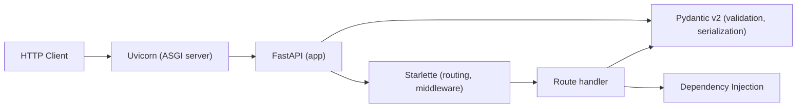

# Web Frameworks — FastAPI

> [!summary] Goal
> Master FastAPI — routing, Pydantic v2 models, dependency injection, middleware, lifespan, WebSockets, testing, and deployment. Includes comparison with Flask and Django.

## Table of Contents

1. [FastAPI Overview](#fastapi-overview)
2. [Routing](#routing)
3. [Pydantic v2 Models](#pydantic-v2-models)
4. [Dependency Injection](#dependency-injection)
5. [Middleware and CORS](#middleware-and-cors)
6. [Lifespan Protocol](#lifespan-protocol)
7. [Background Tasks](#background-tasks)
8. [WebSockets](#websockets)
9. [Error Handling](#error-handling)
10. [Testing](#testing)
11. [Deployment](#deployment)
12. [Flask and Django Comparison](#flask-and-django-comparison)
13. [Pitfalls](#pitfalls)

---

## FastAPI Overview

```python
from fastapi import FastAPI

app = FastAPI(
    title="My API",
    version="1.0.0",
    description="API for managing users",
)

@app.get("/")
async def root():
    return {"message": "Hello World"}

# Run with: uvicorn main:app --reload
```

> [!info] FastAPI is built on Starlette (ASGI) and Pydantic
> It automatically generates OpenAPI docs (`/docs`) and supports async natively. Python 3.8+.



---

## Routing

```python
from fastapi import FastAPI, Path, Query, Body

app = FastAPI()

# Path parameter
@app.get("/users/{user_id}")
async def get_user(user_id: int = Path(..., ge=1)):
    return {"user_id": user_id}

# Query parameters
@app.get("/users/")
async def list_users(
    skip: int = Query(0, ge=0),
    limit: int = Query(10, ge=1, le=100),
    sort: str = Query("name", pattern="^(name|email|age)$"),
):
    return {"skip": skip, "limit": limit, "sort": sort}

# Request body
@app.post("/users/")
async def create_user(user: UserCreate):           # Pydantic model
    return {"created": user}

# Path and query combined
@app.get("/items/{item_id}")
async def get_item(
    item_id: int,
    q: str | None = Query(None, max_length=50),
    short: bool = False,
):
    return {"item_id": item_id, "q": q, "short": short}
```

### HTTP methods

```python
@app.get("/resource")          # Read
@app.post("/resource")         # Create
@app.put("/resource/{id}")     # Full update
@app.patch("/resource/{id}")   # Partial update
@app.delete("/resource/{id}")  # Delete
```

### Route ordering matters

```python
# ✅ Specific routes first
@app.get("/users/me")          # Must come before /users/{id}
async def get_current_user(): ...

@app.get("/users/{user_id}")
async def get_user(user_id: int): ...
```

---

## Pydantic v2 Models

> [!info] Pydantic v2 uses Rust-based `pydantic-core` for 5-50× faster validation than v1.

```python
from pydantic import BaseModel, Field, EmailStr, ConfigDict
from datetime import datetime
from typing import Optional

# Request model
class UserCreate(BaseModel):
    name: str = Field(..., min_length=1, max_length=100)
    email: EmailStr
    age: int = Field(ge=0, le=150, default=None)
    tags: list[str] = Field(default_factory=list)

# Response model (with computed fields)
class UserResponse(BaseModel):
    model_config = ConfigDict(from_attributes=True)   # ORM mode

    id: int
    name: str
    email: str
    created_at: datetime
    is_adult: bool = Field(default=False)

    @field_validator("is_adult", mode="before")
    @classmethod
    def compute_is_adult(cls, v, info):
        age = info.data.get("age")
        return age is not None and age >= 18

# Nested models
class PostCreate(BaseModel):
    title: str = Field(..., min_length=1)
    content: str
    tags: list[str] = []

class PostResponse(PostCreate):
    id: int
    author: UserResponse
    created_at: datetime

# Union types (Python 3.10+)
from typing import Union

class SuccessResponse(BaseModel):
    status: str = "ok"
    data: dict

class ErrorResponse(BaseModel):
    status: str = "error"
    message: str

Response = Union[SuccessResponse, ErrorResponse]

# Using in routes
@app.post("/users", response_model=UserResponse, status_code=201)
async def create_user(user: UserCreate) -> UserResponse:
    db_user = await create_in_db(user)
    return db_user

@app.get("/users/{user_id}", response_model=UserResponse | ErrorResponse)
async def get_user(user_id: int):
    user = await find_user(user_id)
    if not user:
        return ErrorResponse(message="User not found")
    return user
```

### Pydantic Settings

```python
from pydantic_settings import BaseSettings

class Settings(BaseSettings):
    model_config = ConfigDict(env_file=".env")

    database_url: str = "sqlite:///db.sqlite3"
    redis_url: str = "redis://localhost:6379"
    debug: bool = False
    secret_key: str

settings = Settings()
# Loads from .env file or environment variables
```

---

## Dependency Injection

> [!info] FastAPI's DI system resolves dependencies based on type hints
> Dependencies can be functions, callable classes, generators (with cleanup), and can depend on other dependencies.

```python
from fastapi import Depends, HTTPException, status
from fastapi.security import HTTPBearer, HTTPAuthorizationCredentials

# Basic dependency
async def get_current_user(
    credentials: HTTPAuthorizationCredentials = Depends(HTTPBearer()),
) -> User:
    token = credentials.credentials
    user = await verify_token(token)
    if user is None:
        raise HTTPException(status_code=401)
    return user

# Dependency with sub-dependencies
async def get_db():
    async with get_session() as session:
        yield session              # Cleanup after yield

async def get_user_service(db = Depends(get_db)):
    return UserService(db)

# Using dependencies
@app.get("/users/me")
async def get_my_profile(
    current_user: User = Depends(get_current_user),
):
    return current_user

@app.get("/users/{user_id}")
async def get_user(
    user_id: int,
    service: UserService = Depends(get_user_service),
    current_user: User = Depends(get_current_user),  # Auth
):
    return await service.get_user(user_id)

# Dependency with parameters (callable class)
class Pagination:
    def __init__(self, default_size: int = 10):
        self.default_size = default_size

    async def __call__(self, skip: int = Query(0), limit: int | None = None):
        return {"skip": skip, "limit": limit or self.default_size}

@app.get("/items")
async def list_items(pagination: dict = Depends(Pagination(default_size=20))):
    return pagination
```

---

## Middleware and CORS

```python
from fastapi.middleware.cors import CORSMiddleware
from fastapi import Request
import time

# CORS
app.add_middleware(
    CORSMiddleware,
    allow_origins=["https://myapp.com"],
    allow_credentials=True,
    allow_methods=["*"],
    allow_headers=["*"],
)

# Custom middleware
@app.middleware("http")
async def add_process_time_header(request: Request, call_next):
    start = time.time()
    response = await call_next(request)
    response.headers["X-Process-Time"] = str(time.time() - start)
    return response

# Trusted hosts
from fastapi.middleware.trustedhost import TrustedHostMiddleware
app.add_middleware(
    TrustedHostMiddleware,
    allowed_hosts=["myapp.com", "*.myapp.com"],
)

# GZip
from fastapi.middleware.gzip import GZipMiddleware
app.add_middleware(GZipMiddleware, minimum_size=1000)
```

---

## Lifespan Protocol

> [!info] The lifespan context manager replaces the old `startup`/`shutdown` events (FastAPI 0.93+)

```python
from contextlib import asynccontextmanager

@asynccontextmanager
async def lifespan(app: FastAPI):
    # Startup
    app.state.db = await create_pool()
    app.state.redis = await aioredis.from_url(settings.redis_url)
    yield
    # Shutdown
    await app.state.db.close()
    await app.state.redis.close()

app = FastAPI(lifespan=lifespan)

@app.get("/health")
async def health():
    return {"status": "healthy", "db": app.state.db is not None}
```

---

## Background Tasks

```python
from fastapi import BackgroundTasks

def log_request(url: str):
    with open("requests.log", "a") as f:
        f.write(f"{url}\n")

@app.post("/send-email")
async def send_email(
    email: str,
    background_tasks: BackgroundTasks,
):
    background_tasks.add_task(send_email_async, email)
    background_tasks.add_task(log_request, "/send-email")
    return {"message": "Email queued"}

# Or use Celery for heavier tasks
```

---

## WebSockets

```python
from fastapi import WebSocket, WebSocketDisconnect

class ConnectionManager:
    def __init__(self):
        self.active: list[WebSocket] = []

    async def connect(self, ws: WebSocket):
        await ws.accept()
        self.active.append(ws)

    def disconnect(self, ws: WebSocket):
        self.active.remove(ws)

    async def broadcast(self, message: str):
        for ws in self.active:
            await ws.send_text(message)

manager = ConnectionManager()

@app.websocket("/ws/{client_id}")
async def websocket_endpoint(ws: WebSocket, client_id: str):
    await manager.connect(ws)
    try:
        while True:
            data = await ws.receive_text()
            await manager.broadcast(f"Client {client_id}: {data}")
    except WebSocketDisconnect:
        manager.disconnect(ws)
        await manager.broadcast(f"Client {client_id} disconnected")
```

---

## Error Handling

```python
from fastapi import HTTPException, Request
from fastapi.responses import JSONResponse

# Custom exception
class NotFoundError(Exception):
    def __init__(self, resource: str, id: str):
        self.message = f"{resource} with id {id} not found"

@app.exception_handler(NotFoundError)
async def not_found_handler(request: Request, exc: NotFoundError):
    return JSONResponse(
        status_code=404,
        content={"message": exc.message},
    )

# Route-level
@app.get("/users/{user_id}")
async def get_user(user_id: int):
    user = await find_user(user_id)
    if not user:
        raise NotFoundError("User", str(user_id))
        # or raise HTTPException(status_code=404)
    return user

# Validation error override
from fastapi.exceptions import RequestValidationError
from fastapi.responses import JSONResponse

@app.exception_handler(RequestValidationError)
async def validation_handler(request, exc):
    return JSONResponse(
        status_code=422,
        content={"detail": exc.errors(), "body": exc.body},
    )
```

---

## Testing

```python
import pytest
from httpx import AsyncClient, ASGITransport

@pytest.fixture
def app():
    from main import app
    return app

@pytest.mark.asyncio
async def test_create_user(app):
    transport = ASGITransport(app=app)
    async with AsyncClient(transport=transport, base_url="http://test") as client:
        response = await client.post("/users/", json={
            "name": "Alice",
            "email": "alice@test.com",
            "age": 30,
        })
    assert response.status_code == 201
    data = response.json()
    assert data["name"] == "Alice"

@pytest.mark.asyncio
async def test_unauthorized(app):
    transport = ASGITransport(app=app)
    async with AsyncClient(transport=transport, base_url="http://test") as client:
        response = await client.get("/users/me")
    assert response.status_code == 401

# Testing WebSockets
@pytest.mark.asyncio
async def test_websocket(app):
    transport = ASGITransport(app=app)
    async with AsyncClient(transport=transport, base_url="http://test") as client:
        async with client.websocket_connect("/ws/test") as ws:
            await ws.send_text("Hello")
            data = await ws.receive_text()
            assert "Hello" in data
```

---

## Deployment

```bash
# Basic
uvicorn main:app --host 0.0.0.0 --port 8000

# With workers
uvicorn main:app --host 0.0.0.0 --port 8000 --workers 4

# Gunicorn with uvicorn workers (recommended for production)
gunicorn main:app -w 4 -k uvicorn.workers.UvicornWorker --bind 0.0.0.0:8000

# Docker
FROM python:3.12-slim
WORKDIR /app
COPY pyproject.toml .
RUN pip install .
COPY . .
CMD ["uvicorn", "main:app", "--host", "0.0.0.0", "--port", "8000"]

# docker-compose.yml
services:
  api:
    build: .
    ports: ["8000:8000"]
    environment:
      - DATABASE_URL=postgresql+asyncpg://user:pass@db/db
    depends_on:
      - db
  db:
    image: postgres:16
```

### Environment-specific configuration

```python
# settings.py
from pydantic_settings import BaseSettings

class Settings(BaseSettings):
    model_config = ConfigDict(env_file=".env")

    debug: bool = False
    database_url: str
    cors_origins: list[str] = ["http://localhost:5173"]

settings = Settings()
```

---

## Flask and Django Comparison

| Feature | FastAPI | Flask | Django |
|---------|:-------:|:-----:|:------:|
| **Type** | ASGI (async) | WSGI (sync) | WSGI (async since 3.0) |
| **Performance** | Fast (async) | Moderate | Moderate |
| **Validation** | Pydantic (built-in) | Manual / marshmallow | DRF serializers |
| **Docs** | Auto (OpenAPI + ReDoc) | Manual (flasgger) | Manual (drf-spectacular) |
| **Admin** | None (add sqladmin) | None | Built-in |
| **ORM** | Any (SQLAlchemy common) | Any | Django ORM |
| **DI** | Built-in | Manual | Manual |
| **Use case** | APIs, microservices | Small-medium apps | Full-stack, admin sites |

---

## Pitfalls

### Not using `response_model`

```python
@app.post("/users/")                  # Returns all fields, including password!
async def create_user(user: UserCreate):
    return await create_in_db(user)

@app.post("/users/", response_model=UserResponse)  # ✅ Safe
async def create_user(user: UserCreate):
    return await create_in_db(user)
```

### Mixing async and sync in route handlers

```python
@app.get("/slow")                     # ❌ Blocking the event loop
def slow_route():
    time.sleep(5)                     # Blocks ALL requests!
    return {"done"}

@app.get("/slow")                     # ✅ Use async or run_in_executor
async def slow_route():
    await asyncio.sleep(5)
    return {"done"}
```

### Forgetting `await` in async routes

```python
@app.get("/user/{id}")
async def get_user(id: int):
    user = get_user_from_db(id)       # ❌ Coroutine never awaited!
    return user

@app.get("/user/{id}")
async def get_user(id: int):
    user = await get_user_from_db(id)  # ✅
    return user
```

### Not closing database connections

Always use connection pools and close them on shutdown (lifespan handler).

---

> [!question]- Interview Questions
>
> **Q: How does FastAPI's dependency injection work?**
> A: FastAPI resolves dependencies based on type hints. Each parameter with `Depends()` triggers the dependency function, which can itself have dependencies. Results can be cached per request (default) or per route. Dependencies support cleanup via `yield` (context manager pattern). This is resolved at runtime, not with a DI container.
>
> **Q: How does FastAPI compare to Flask for building APIs?**
> A: FastAPI is async-first, auto-generates OpenAPI docs, has built-in validation (Pydantic), and dependency injection. Flask is sync, requires manual validation and doc generation, and has a larger ecosystem. FastAPI is generally preferred for new APIs; Flask for small apps or when you need a lightweight framework.
>
> **Q: How do you handle database connections in FastAPI?**
> A: Use the lifespan protocol (`@asynccontextmanager`) to create/destroy a connection pool on startup/shutdown. Store the pool in `app.state`. Each request gets a session from the pool via a dependency. Use async drivers (asyncpg, aiosqlite) with SQLAlchemy's `AsyncSession`.

---

## Cross-Links

- [[Python/01_Foundations/11_Async_Python_Basics]] for async fundamentals
- [[Python/02_Core/05_Databases_Redis_Task_Queues]] for database integration
- [[Python/01_Foundations/10_Testing_with_Pytest]] for testing patterns
- [[Python/05_Projects/01_REST_API_FastAPI_Postgres]] for a complete project
- [[Python/04_Playbooks/03_Production_Readiness]] for production deployment
