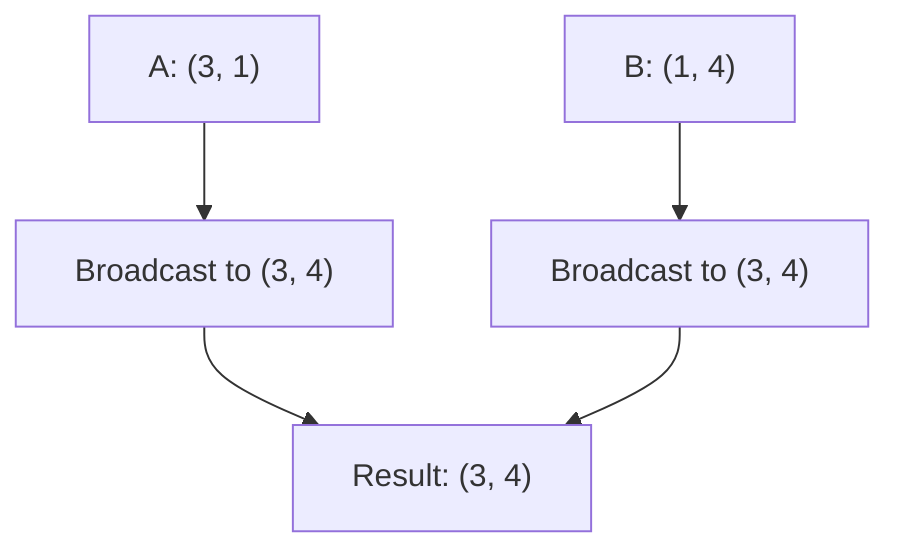

# NumPy Deep Dive

> [!summary] Goal
> Master NumPy — `ndarray` memory layout, broadcasting rules, vectorization over Python loops, universal functions, indexing tricks, and linear algebra. Essential for data science and high-performance computing.

## Table of Contents

1. [ndarray Memory Layout](#ndarray-memory-layout)
2. [Vectorization](#vectorization)
3. [Broadcasting](#broadcasting)
4. [Indexing](#indexing)
5. [Universal Functions](#universal-functions)
6. [Linear Algebra](#linear-algebra)
7. [Random](#random)
8. [Pitfalls](#pitfalls)

---

## ndarray Memory Layout

> [!info] NumPy arrays store data in a contiguous C-style (row-major) or Fortran-style (column-major) buffer
> The array object stores: data pointer, shape (tuple), strides (tuple in bytes), dtype, and flags.

```python
import numpy as np

# Creation
arr = np.array([1, 2, 3, 4, 5])           # 1D
matrix = np.array([[1, 2], [3, 4]])        # 2D
zeros = np.zeros((3, 4))                   # All zeros
ones = np.ones((2, 3))                     # All ones
eye = np.eye(3)                            # Identity
rng = np.arange(0, 10, 2)                 # [0, 2, 4, 6, 8]
lin = np.linspace(0, 1, 5)                # [0, 0.25, 0.5, 0.75, 1]

# Memory layout
arr.shape          # (5,)
matrix.shape       # (2, 2)
matrix.strides     # (16, 8)  — bytes to next row, bytes to next column
matrix.dtype       # dtype('int64')
arr.nbytes         # 40 (5 * 8 bytes)
matrix.flags.c_contiguous  # True (row-major)
```

```mermaid
flowchart LR
    subgraph ndarray["ndarray object"]
        DATA["data → buffer pointer"]
        SHAPE["shape: (3, 4)"]
        STRIDES["strides: (32, 8)"]
        DTYPE["dtype: float64"]
    end
    subgramh Buffer["buffer (C-contiguous, 96 bytes)"]
        R0["row0: [0,1,2,3]"]
        R1["row1: [4,5,6,7]"]
        R2["row2: [8,9,10,11]"]
        DATA --> R0 --> R1 --> R2
    end
```

### Contiguity and performance

```python
# C-contiguous (row-major) — default, fastest for row operations
c_arr = np.array([[1, 2], [3, 4]], order='C')

# F-contiguous (column-major) — fastest for column operations
f_arr = np.array([[1, 2], [3, 4]], order='F')

# Checking
c_arr.flags.c_contiguous  # True
f_arr.flags.f_contiguous  # True
```

---

## Vectorization

> [!info] Vectorized operations run in C, 10-100× faster than Python loops
> Avoid explicit `for` loops over NumPy arrays — use array operations instead.

```python
import numpy as np
import time

N = 1_000_000
data = np.random.randn(N)

# ❌ Python loop — slow
def python_loop(arr):
    result = np.empty_like(arr)
    for i in range(len(arr)):
        result[i] = arr[i] * 2 + 1
    return result

# ✅ Vectorized — fast (C speed)
def vectorized(arr):
    return arr * 2 + 1

# Comparison
start = time.time(); python_loop(data); print(time.time() - start)  # ~0.3s
start = time.time(); vectorized(data); print(time.time() - start)   # ~0.005s
```

### Conditional vectorization

```python
arr = np.array([1, -2, 3, -4, 5])

# np.where — vectorized if/else
result = np.where(arr > 0, arr, 0)          # [1, 0, 3, 0, 5]

# np.select — multiple conditions
conditions = [arr < 0, arr == 0, arr > 0]
choices = [-1, 0, 1]
result = np.select(conditions, choices)      # [1, -1, 1, -1, 1]
```

---

## Broadcasting

> [!info] Broadcasting lets NumPy operate on arrays of different shapes
> Rules: (1) prepend 1s to the smaller shape, (2) dimensions must match or be 1, (3) dimension of 1 is stretched.

```python
# Scalar + array
arr = np.array([1, 2, 3])
arr + 10                    # [11, 12, 13] — scalar broadcast to all elements

# (3,) + (1,) → stretch (1,) to (3,)
arr + np.array([10])        # [11, 12, 13]

# (3,1) + (1,4) → (3,4)
a = np.array([[1], [2], [3]])     # shape (3, 1)
b = np.array([[10, 20, 30, 40]]) # shape (1, 4)
a + b  # shape (3, 4)
# [[11, 21, 31, 41],
#  [12, 22, 32, 42],
#  [13, 23, 33, 43]]
```



### Broadcasting rules

| Array shapes | Compatible? | Result |
|:------------:|:-----------:|:------:|
| (3,) + (1,) | ✅ | (3,) |
| (3, 1) + (1, 4) | ✅ | (3, 4) |
| (3, 4) + (4,) | ❌ | Error (can't align dims) |
| (3, 4) + (1, 4) | ✅ | (3, 4) |
| (3, 4, 5) + (4, 5) | ✅ | (3, 4, 5) |

---

## Indexing

```python
arr = np.arange(12).reshape(3, 4)
# [[ 0,  1,  2,  3],
#  [ 4,  5,  6,  7],
#  [ 8,  9, 10, 11]]

# Basic indexing
arr[1, 2]         # 6
arr[0]            # [0, 1, 2, 3]
arr[:, 1]         # [1, 5, 9] — column 1

# Slicing (returns VIEW — no copy!)
arr[1:, :2]       # [[4, 5], [8, 9]]
arr[::2, ::2]     # [[0, 2], [8, 10]]

# Fancy indexing (returns COPY)
arr[[0, 2], :]    # [[0, 1, 2, 3], [8, 9, 10, 11]]
arr[:, [0, 2]]    # [[0, 2], [4, 6], [8, 10]]

# Boolean indexing
mask = arr > 5
arr[mask]         # [6, 7, 8, 9, 10, 11]

# np.where with boolean
np.where(arr > 5, arr, -1)  # Replace values ≤ 5 with -1
```

> [!warning] Slicing returns a VIEW, not a copy
> Modifying a slice modifies the original array! Use `.copy()` if you need independent data.

---

## Universal Functions

> [!info] ufuncs operate element-wise on arrays with broadcasting support
> They're implemented in C and are the building blocks of vectorized NumPy.

```python
arr = np.array([1, 2, 3, 4, 5])

# Arithmetic
np.add(arr, 10)          # [11, 12, 13, 14, 15]
np.multiply(arr, 2)      # [2, 4, 6, 8, 10]
np.power(arr, 2)         # [1, 4, 9, 16, 25]

# Trig / exp / log
np.sin(arr)              # Element-wise sin
np.exp(arr)              # e^x
np.log(arr)              # Natural log
np.log10(arr)            # Base 10 log

# Aggregation (reduction)
np.sum(arr)              # 15
np.mean(arr)             # 3.0
np.std(arr)              # ~1.41
np.min(arr)              # 1
np.argmax(arr)           # 4 (index of max)

# Axis-based aggregation
matrix = np.arange(12).reshape(3, 4)
np.sum(matrix, axis=0)   # [12, 15, 18, 21] — sum columns
np.sum(matrix, axis=1)   # [6, 22, 38] — sum rows
```

---

## Linear Algebra

```python
from numpy.linalg import inv, det, eig, svd, norm, solve

A = np.array([[1, 2], [3, 4]])
b = np.array([5, 6])

# Matrix operations
A.T                  # Transpose
np.dot(A, [1, 1])    # [3, 7] — matrix multiplication
A @ [1, 1]           # Same — @ operator (Python 3.5+)
A @ np.linalg.inv(A) # ≈ Identity

# Solve Ax = b
x = solve(A, b)      # [-4.0, 4.5]

# Decompositions
det(A)               # -2.0
inv(A)               # [[-2.0, 1.0], [1.5, -0.5]]
eig(A)               # Eigenvalues + eigenvectors
svd(A)               # Singular value decomposition

# Norms
norm(A)              # Frobenius norm
norm(A, ord=1)       # Max column sum
norm(A, ord=np.inf)  # Max row sum
```

---

## Random

```python
rng = np.random.default_rng(42)     # Reproducible (preferred since 1.17)

# Distributions
rng.random((3, 4))                  # Uniform [0, 1)
rng.normal(0, 1, size=1000)         # Normal(mean=0, std=1)
rng.integers(0, 10, size=10)        # Random integers [0, 10)
rng.poisson(lam=3, size=100)        # Poisson
rng.binomial(n=10, p=0.5, size=100) # Binomial

# Sampling
arr = np.arange(10)
rng.shuffle(arr)                     # In-place shuffle
rng.choice(arr, size=5)              # Random sample
rng.choice(arr, size=5, replace=False)  # Without replacement

# Seed for reproducibility
np.random.seed(42)                   # Old API (still works)
rng = np.random.default_rng(42)      # New API (preferred)
```

---

## Pitfalls

### View vs copy confusion

```python
arr = np.arange(12).reshape(3, 4)
view = arr[:, 1:3]          # View — shares data
view[0, 0] = 999
print(arr[0, 1])            # 999! Original modified!

copy = arr[:, 1:3].copy()  # Independent copy
```

### Mutating during iteration

```python
# ❌ Modifying array while iterating
for i in range(len(arr)):
    arr[i] = arr[i] * 2      # Fine for 1D

# ✅ For 2D, use vectorized or flatten
arr = arr * 2                # Vectorized — always preferred
```

### `np.array()` of lists vs `np.asarray()`

```python
# np.array() always copies
a = np.array([1, 2, 3])

# np.asarray() avoids copy if already ndarray
b = np.asarray(a)            # Same object — no copy
b is a                       # True

# Use asarray for type conversion without unnecessary copies
```

### Floating point precision

```python
# np.sum of large + small values loses precision
# Use np.sum with dtype=np.longdouble for critical cases
```

---

> [!question]- Interview Questions
>
> **Q: What is broadcasting in NumPy?**
> A: Broadcasting lets NumPy perform operations on arrays with different shapes by virtually stretching dimensions of size 1 to match the other array. Rules: dimensions are aligned from the right, each dimension must be equal or one of them must be 1. Broadcasting avoids creating temporary expanded arrays in memory.
>
> **Q: What's the difference between a view and a copy in NumPy?**
> A: A view shares data with the original array (slicing returns views). A copy has independent data (`.copy()`, fancy indexing, boolean indexing). Modifying a view modifies the original; modifying a copy does not. Views are memory-efficient but can cause subtle bugs.
>
> **Q: How do you vectorize a Python loop in NumPy?**
> A: Replace the loop with array operations: `arr * 2 + 1` instead of `for i, v in enumerate(arr): result[i] = v * 2 + 1`. For conditionals, use `np.where()`. For multiple conditions, use `np.select()`. Vectorized operations run in C and are 10-100× faster.

---

## Cross-Links

- [[Python/02_Core/08_Pandas_Deep_Dive]] for DataFrame operations (built on NumPy)
- [[Python/02_Core/09_Data_Visualization]] for plotting NumPy data
- [[Python/02_Core/10_Machine_Learning]] for scikit-learn (NumPy-based)
- [[Python/03_Advanced/02_Performance_Profiling]] for NumPy performance optimization
