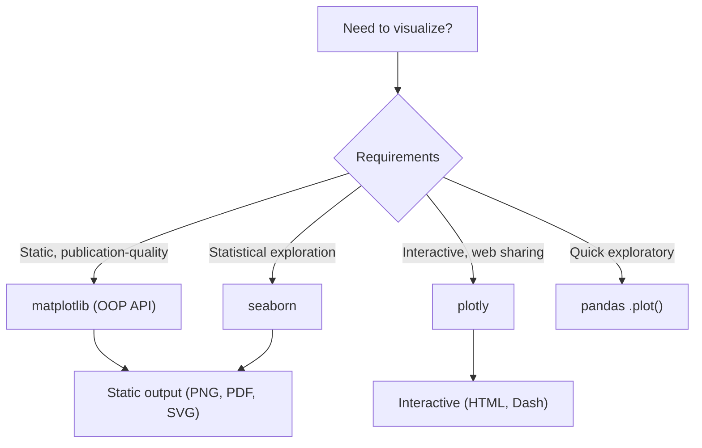

# Data Visualization

> [!summary] Goal
> Master Python data visualization — matplotlib's OOP API, seaborn for statistical plots, plotly for interactive visualizations, and when to use each.

## Table of Contents

1. [Tool Selection](#tool-selection)
2. [Matplotlib OOP API](#matplotlib-oop-api)
3. [Seaborn](#seaborn)
4. [Plotly](#plotly)
5. [Pitfalls](#pitfalls)

---

## Tool Selection



| Library | Output | Complexity | Best for |
|---------|:------:|:----------:|----------|
| **matplotlib** | Static (PNG, PDF, SVG, etc.) | Medium | Publication, custom layouts |
| **seaborn** | Static (matplotlib-based) | Low | Statistical exploration |
| **plotly** | Interactive (HTML) | Medium | Dashboards, web sharing |
| **pandas .plot()** | Static (matplotlib wrapper) | Very low | Quick EDA |

---

## Matplotlib OOP API

> [!info] Always use the OOP API (`plt.subplots()` + `ax.*` methods), never `plt.plot()` stateful style
> The OOP API gives you explicit control over axes, legends, subplots, and styling.

```python
import matplotlib.pyplot as plt
import numpy as np

# OOP API — preferred
fig, ax = plt.subplots(figsize=(10, 6))

x = np.linspace(0, 10, 100)
y1 = np.sin(x)
y2 = np.cos(x)

ax.plot(x, y1, label="sin", color="blue", linewidth=2)
ax.plot(x, y2, label="cos", color="red", linestyle="--")
ax.set_xlabel("X axis")
ax.set_ylabel("Y axis")
ax.set_title("Sine and Cosine")
ax.legend()
ax.grid(True, alpha=0.3)

fig.savefig("plot.png", dpi=300, bbox_inches="tight")
plt.close(fig)             # Free memory
```

### Subplots

```python
fig, axes = plt.subplots(2, 3, figsize=(12, 8), sharex=True, sharey=True)

for i, ax in enumerate(axes.flat):
    ax.plot(x, np.sin(x + i * np.pi / 4))
    ax.set_title(f"Phase shift {i}")

fig.suptitle("Multiple Subplots")
fig.tight_layout()
```

### Common chart types

```python
fig, axes = plt.subplots(2, 3, figsize=(15, 10))

# Line plot
axes[0, 0].plot(x, y)

# Scatter plot
axes[0, 1].scatter(x, y + np.random.randn(100) * 0.1, s=20, alpha=0.5)

# Bar plot
axes[0, 2].bar(["A", "B", "C"], [10, 20, 15])

# Histogram
axes[1, 0].hist(np.random.randn(1000), bins=30, edgecolor="black")

# Box plot
axes[1, 1].boxplot([np.random.randn(100) for _ in range(3)], labels=["X", "Y", "Z"])

# Heatmap
im = axes[1, 2].imshow(np.random.randn(10, 10), cmap="RdBu")
fig.colorbar(im, ax=axes[1, 2])
```

### Custom styles

```python
# Available styles
plt.style.available   # ['ggplot', 'seaborn-v0_8', 'dark_background', ...]

plt.style.use("seaborn-v0_8")        # Apply globally
with plt.style.context("ggplot"):     # Temporarily
    fig, ax = plt.subplots()
    ax.plot(x, y)
```

---

## Seaborn

> [!info] Seaborn provides statistical visualisations with automatic aggregation
> It works natively with pandas DataFrames. Built on matplotlib.

```python
import seaborn as sns
import pandas as pd

# Built-in datasets
tips = sns.load_dataset("tips")

# Relational plots
sns.relplot(data=tips, x="total_bill", y="tip", hue="time", col="sex")
sns.lineplot(data=tips, x="size", y="tip", estimator="mean")

# Categorical plots
sns.catplot(data=tips, x="day", y="total_bill", kind="box")
sns.catplot(data=tips, x="day", y="total_bill", kind="violin")
sns.barplot(data=tips, x="day", y="total_bill", hue="sex")
sns.countplot(data=tips, x="day")

# Distribution plots
sns.histplot(data=tips, x="total_bill", bins=30, kde=True)
sns.kdeplot(data=tips, x="total_bill", hue="sex")
sns.ecdfplot(data=tips, x="total_bill")

# Matrix plots
corr = tips[["total_bill", "tip", "size"]].corr()
sns.heatmap(corr, annot=True, cmap="RdBu", vmin=-1, vmax=1)

# Pair plot (great for EDA)
sns.pairplot(tips, hue="sex")
```

### Seaborn figure-level vs axes-level

```python
# Figure-level (relplot, catplot, displot) — creates its own figure
# Supports `col`, `row`, `hue` for faceting
sns.relplot(data=tips, x="total_bill", y="tip", col="day")

# Axes-level (scatterplot, lineplot, histplot) — plots on existing axes
fig, ax = plt.subplots()
sns.histplot(data=tips, x="total_bill", ax=ax)
```

---

## Plotly

> [!info] Plotly creates interactive plots that zoom, pan, and show data on hover
> Output is HTML/JavaScript. Works in Jupyter, web apps, and standalone HTML.

```python
import plotly.express as px
import plotly.graph_objects as go

# Plotly Express (high-level, like seaborn)
df = px.data.iris()

fig = px.scatter(df, x="sepal_width", y="sepal_length",
                 color="species", size="petal_length",
                 hover_data=["petal_width"],
                 title="Iris Dataset")
fig.show()

# Line chart
fig = px.line(df, x="sepal_length", y="sepal_width", color="species")

# Histogram
fig = px.histogram(df, x="sepal_length", color="species", marginal="box")

# Box plot
fig = px.box(df, x="species", y="sepal_length")

# Correlation heatmap
fig = px.imshow(df.select_dtypes("number").corr(), text_auto=True)

# 3D scatter
fig = px.scatter_3d(df, x="sepal_length", y="sepal_width", z="petal_length",
                    color="species")

# Graph Objects (low-level, full control)
fig = go.Figure()
fig.add_trace(go.Scatter(x=[1, 2, 3], y=[4, 5, 6], mode="lines+markers"))
fig.update_layout(title="Custom", xaxis_title="X", yaxis_title="Y")
fig.show()

# Subplots
from plotly.subplots import make_subplots
fig = make_subplots(rows=2, cols=2, subplot_titles=["A", "B", "C", "D"])
fig.add_trace(go.Scatter(x=[1, 2], y=[3, 4]), row=1, col=1)
fig.add_trace(go.Bar(x=["A", "B"], y=[10, 20]), row=1, col=2)
fig.update_layout(height=600, showlegend=False)

# Save as HTML
fig.write_html("plot.html")

# For Jupyter: fig.show() renders inline
# For web: embed HTML or use Dash
```

---

## Pitfalls

### Stateful matplotlib (`plt.plot()`)

```python
# ❌ Stateful API — implicit "current axes" — leads to confusion
plt.plot(x, y)
plt.title("Plot")
# What if there are multiple figures open?

# ✅ OOP API — explicit
fig, ax = plt.subplots()
ax.plot(x, y)
ax.set_title("Plot")
```

### Not closing figures

```python
# Memory leak in loops
for i in range(100):
    fig, ax = plt.subplots()
    ax.plot(x, y)
    fig.savefig(f"plot_{i}.png")
    plt.close(fig)          # ✅ Always close
```

### Seaborn style conflicts

Setting a seaborn style globally affects all subsequent matplotlib plots. Use `with plt.style.context("seaborn-v0_8"):` for local scoping.

### Large data with plotly

Plotly sends **all data** to the browser. For datasets > 10K points, use `plotly.graph_objects` with downsampling, or `datashader` for rasterization.

### Overplotting

When plotting > 1000 points, use `alpha`, `sns.kdeplot`, or hexagonal binning (`plt.hexbin`) instead of raw scatter.

---

> [!question]- Interview Questions
>
> **Q: Why should you use matplotlib's OOP API instead of the pyplot stateful API?**
> A: The OOP API (`fig, ax = plt.subplots(); ax.plot()`) gives explicit control over which axes is being modified, supports multiple figures and subplots cleanly, and avoids implicit state. The stateful API (`plt.plot()`) modifies whatever the "current axes" is, which causes confusion in complex multi-plot layouts.
>
> **Q: When would you use plotly over matplotlib?**
> A: Plotly for interactive exploration, dashboards, web sharing, and when you need zoom/pan/hover. Matplotlib for publication-quality static figures, PDF/SVG output, and when you need fine-grained control over every visual element.
>
> **Q: What's the difference between figure-level and axes-level seaborn functions?**
> A: Figure-level functions (`relplot`, `catplot`, `displot`) create their own figure and support faceting (`col`, `row`). Axes-level functions (`scatterplot`, `histplot`, `boxplot`) plot on an existing `ax`. Figure-level is easier for faceted plots; axes-level gives more control for custom layouts.

---

## Cross-Links

- [[Python/02_Core/07_NumPy_Deep_Dive]] for NumPy data
- [[Python/02_Core/08_Pandas_Deep_Dive]] for pandas DataFrames
- [[Python/02_Core/10_Machine_Learning]] for ML visualisation
- [[Python/01_Foundations/09_Stdlib_Essentials]] for date formatting in plots
