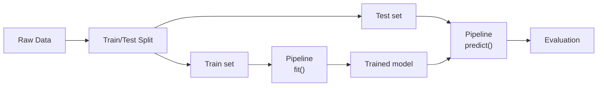

# Machine Learning with scikit-learn

> [!summary] Goal
> Master scikit-learn's estimator API, pipelines, cross-validation, grid search, feature engineering, and model persistence. Focus on practical patterns and common pitfalls.

## Table of Contents

1. [Estimator API](#estimator-api)
2. [Train/Test Split](#traintest-split)
3. [Pipelines](#pipelines)
4. [Cross-Validation](#cross-validation)
5. [Grid and Random Search](#grid-and-random-search)
6. [Feature Engineering](#feature-engineering)
7. [Classification Models](#classification-models)
8. [Model Persistence](#model-persistence)
9. [Pitfalls](#pitfalls)

---

## Estimator API

> [!info] All scikit-learn estimators follow the same API: `fit(X, y)` → `predict(X)` / `transform(X)`

```python
from sklearn.ensemble import RandomForestClassifier
from sklearn.datasets import make_classification

# Generate synthetic data
X, y = make_classification(n_samples=1000, n_features=20, random_state=42)

# Model — follows estimator API
model = RandomForestClassifier(n_estimators=100, random_state=42)
model.fit(X, y)                              # Train
predictions = model.predict(X)               # Predict
probabilities = model.predict_proba(X)       # Class probabilities
score = model.score(X, y)                    # Accuracy
```



---

## Train/Test Split

```python
from sklearn.model_selection import train_test_split

X_train, X_test, y_train, y_test = train_test_split(
    X, y,
    test_size=0.2,
    random_state=42,
    stratify=y,           # Preserve class distribution
)

# Scale features (fit ONLY on training data!)
from sklearn.preprocessing import StandardScaler

scaler = StandardScaler()
X_train_scaled = scaler.fit_transform(X_train)
X_test_scaled = scaler.transform(X_test)     # ✅ Use same scaler
```

> [!warning] Never use data from the test set during training
> `fit` the scaler on `X_train` only; `transform` both `X_train` and `X_test`. Otherwise, you leak information from the test set and overestimate performance.

---

## Pipelines

> [!info] Pipelines chain preprocessing and modelling into a single estimator
> This prevents data leakage and simplifies cross-validation and grid search.

```python
from sklearn.pipeline import Pipeline
from sklearn.preprocessing import StandardScaler
from sklearn.decomposition import PCA
from sklearn.ensemble import RandomForestClassifier

pipeline = Pipeline([
    ("scaler", StandardScaler()),
    ("pca", PCA(n_components=10)),
    ("classifier", RandomForestClassifier(n_estimators=100)),
])

# Use as a single estimator
pipeline.fit(X_train, y_train)
predictions = pipeline.predict(X_test)

# ColumnTransformer — different preprocessing per column type
from sklearn.compose import ColumnTransformer
from sklearn.preprocessing import OneHotEncoder

preprocessor = ColumnTransformer(
    transformers=[
        ("num", StandardScaler(), ["age", "salary", "years"]),
        ("cat", OneHotEncoder(), ["department", "role"]),
    ]
)

full_pipeline = Pipeline([
    ("preprocessor", preprocessor),
    ("classifier", RandomForestClassifier()),
])

full_pipeline.fit(X_train, y_train)
```

---

## Cross-Validation

```python
from sklearn.model_selection import cross_val_score, cross_validate

# 5-fold cross-validation
scores = cross_val_score(pipeline, X, y, cv=5, scoring="accuracy")
print(f"Accuracy: {scores.mean():.3f} ± {scores.std():.3f}")

# Multiple metrics
cv_results = cross_validate(
    pipeline, X, y,
    cv=5,
    scoring=["accuracy", "precision", "recall", "f1"],
    return_train_score=True,
)

# Stratified k-fold (maintains class distribution)
from sklearn.model_selection import StratifiedKFold
cv = StratifiedKFold(n_splits=5, shuffle=True, random_state=42)
scores = cross_val_score(pipeline, X, y, cv=cv)
```

---

## Grid and Random Search

```python
from sklearn.model_selection import GridSearchCV, RandomizedSearchCV
from scipy.stats import randint, uniform

# Grid search — exhaustive
param_grid = {
    "classifier__n_estimators": [50, 100, 200],
    "classifier__max_depth": [None, 10, 20],
    "pca__n_components": [5, 10, 15],
}

grid_search = GridSearchCV(
    pipeline,
    param_grid,
    cv=5,
    scoring="accuracy",
    n_jobs=-1,               # Use all CPU cores
    verbose=1,
)
grid_search.fit(X_train, y_train)

print(grid_search.best_params_)
print(grid_search.best_score_)
best_model = grid_search.best_estimator_

# Random search — faster for large spaces
param_dist = {
    "classifier__n_estimators": randint(50, 500),
    "classifier__max_depth": randint(3, 30),
    "classifier__min_samples_split": randint(2, 20),
}

random_search = RandomizedSearchCV(
    pipeline,
    param_dist,
    n_iter=50,               # Try 50 random combinations
    cv=5,
    scoring="accuracy",
    n_jobs=-1,
    random_state=42,
)
random_search.fit(X_train, y_train)
```

---

## Feature Engineering

```python
from sklearn.preprocessing import (
    StandardScaler, MinMaxScaler, RobustScaler,
    OneHotEncoder, OrdinalEncoder, LabelEncoder,
    PolynomialFeatures, KBinsDiscretizer,
)
from sklearn.feature_selection import SelectKBest, f_classif
from sklearn.decomposition import PCA

# Numerical features
scaler = StandardScaler()                    # Zero mean, unit variance
minmax = MinMaxScaler()                      # Scale to [0, 1]
robust = RobustScaler()                      # Robust to outliers (uses median/IQR)

# Categorical features
ohe = OneHotEncoder(sparse_output=False)     # One-hot encoding
ordinal = OrdinalEncoder()                   # Integer encoding (for ordinal categories)

# Feature interactions
poly = PolynomialFeatures(degree=2, interaction_only=True, include_bias=False)

# Feature selection
selector = SelectKBest(score_func=f_classif, k=10)

# Dimensionality reduction
pca = PCA(n_components=0.95)                 # Keep components explaining 95% variance
```

---

## Classification Models

```python
from sklearn.linear_model import LogisticRegression
from sklearn.tree import DecisionTreeClassifier
from sklearn.ensemble import RandomForestClassifier, GradientBoostingClassifier
from sklearn.svm import SVC

# Quick comparison
models = {
    "logistic": LogisticRegression(max_iter=1000),
    "tree": DecisionTreeClassifier(max_depth=5),
    "rf": RandomForestClassifier(n_estimators=100),
    "gbm": GradientBoostingClassifier(n_estimators=100),
    "svm": SVC(kernel="rbf", probability=True),
}

for name, model in models.items():
    scores = cross_val_score(model, X_train, y_train, cv=5)
    print(f"{name}: {scores.mean():.3f}")

# Evaluation
from sklearn.metrics import (
    accuracy_score, precision_score, recall_score, f1_score,
    confusion_matrix, classification_report, roc_auc_score, RocCurveDisplay,
)

y_pred = best_model.predict(X_test)
print(classification_report(y_test, y_pred))
#               precision    recall  f1-score   support
#            0       0.95      0.93      0.94       100
#            1       0.93      0.95      0.94       100
```

---

## Model Persistence

```python
import joblib

# Save
joblib.dump(best_model, "model.joblib")

# Load
loaded_model = joblib.load("model.joblib")
predictions = loaded_model.predict(X_test)

# Pickle also works (but joblib is more efficient for large NumPy arrays)
import pickle
with open("model.pkl", "wb") as f:
    pickle.dump(best_model, f)

# ONNX — cross-platform model exchange
# pip install skl2onnx
from skl2onnx import convert_sklearn
from skl2onnx.common.data_types import FloatTensorType

initial_type = [("float_input", FloatTensorType([None, X.shape[1]]))]
onnx_model = convert_sklearn(best_model, initial_types=initial_type)
with open("model.onnx", "wb") as f:
    f.write(onnx_model.SerializeToString())
```

---

## Pitfalls

### Data leakage

```python
# ❌ LEAKAGE: scaler fitted on ALL data (including test set)
scaler = StandardScaler()
X_scaled = scaler.fit_transform(X)       # Leaks test statistics!
X_train, X_test, y_train, y_test = train_test_split(X_scaled, y)

# ✅ Correct: split first, then fit scaler on training set only
X_train, X_test, y_train, y_test = train_test_split(X, y)
scaler = StandardScaler()
X_train = scaler.fit_transform(X_train)
X_test = scaler.transform(X_test)
```

### Not using stratify for imbalanced data

```python
# Without stratify, one fold may have no samples from a minority class
train_test_split(X, y, test_size=0.2, stratify=y)   # ✅
```

### Overfitting in grid search

```python
# Grid search on full data without CV → overfits
grid_search.fit(X, y)                          # ❌
grid_search.fit(X_train, y_train)              # ✅ Use CV within grid search
```

### Target encoding on test data

```python
# ❌ Never use y_test to transform features
```

### Not setting `random_state`

```python
# Results will vary between runs — set random_state for reproducibility
model = RandomForestClassifier(random_state=42)
```

---

> [!question]- Interview Questions
>
> **Q: What's the purpose of pipelines in scikit-learn?**
> A: Pipelines chain preprocessing and modeling into one estimator, preventing data leakage (fit on training set only), simplifying cross-validation and grid search, and ensuring the same preprocessing is applied to training and test sets.
>
> **Q: What is data leakage and how do you prevent it?**
> A: Data leakage occurs when information from the test set is used during training (e.g., fitting a scaler on the full dataset). This inflates performance metrics. Prevent with pipelines and always fit preprocessing on training data only.
>
> **Q: How do you handle imbalanced datasets?**
> A: Use stratified train/test splits and cross-validation, class weights (`class_weight="balanced"`), oversampling (SMOTE), undersampling, or different scoring metrics (precision, recall, F1 instead of accuracy).

---

## Cross-Links

- [[Python/02_Core/07_NumPy_Deep_Dive]] for NumPy arrays (scikit-learn input)
- [[Python/02_Core/08_Pandas_Deep_Dive]] for DataFrame preprocessing
- [[Python/02_Core/09_Data_Visualization]] for model evaluation plots
- [[Python/02_Core/11_Deep_Learning_PyTorch]] for deep learning
