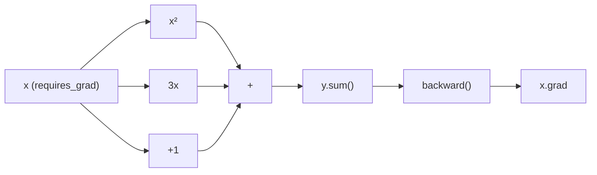

# Deep Learning with PyTorch

> [!summary] Goal
> Understand PyTorch fundamentals — tensors, autograd, `nn.Module`, training loops, DataLoader, GPU acceleration, and building a CNN. Reference-level — not a full deep learning course, but enough to get started and understand the core concepts.

## Table of Contents

1. [Tensors](#tensors)
2. [Autograd](#autograd)
3. [nn.Module](#nnmodule)
4. [Training Loop](#training-loop)
5. [DataLoader](#dataloader)
6. [GPU](#gpu)
7. [CNN Example](#cnn-example)
8. [Saving and Loading](#saving-and-loading)
9. [Pitfalls](#pitfalls)

---

## Tensors

> [!info] PyTorch tensors are like NumPy arrays but with GPU support and automatic differentiation

```python
import torch

# Creation
t = torch.tensor([[1, 2], [3, 4]])         # From data
t = torch.zeros(3, 4)                      # Zeros
t = torch.ones(2, 3)                       # Ones
t = torch.randn(3, 4)                      # Normal distribution
t = torch.arange(0, 10, 2)                # [0, 2, 4, 6, 8]
t = torch.linspace(0, 1, 5)               # [0, 0.25, 0.5, 0.75, 1]

# Properties
t.shape           # torch.Size([3, 4])
t.dtype           # torch.float32
t.device          # device(type='cpu')
t.requires_grad   # False

# Operations — similar to NumPy
t = torch.randn(3, 4)
t + 10              # Broadcast
t * 2
t @ t.T             # Matrix multiplication
torch.cat([t, t], dim=0)    # Concatenate
torch.stack([t, t], dim=0)  # Stack along new dim

# Reshaping
t.view(12)          # Reshape to 1D (contiguous required)
t.reshape(12)       # Reshape (handles non-contiguous)
t.transpose(0, 1)   # Swap dimensions
t.squeeze()         # Remove size-1 dimensions
t.unsqueeze(0)      # Add dimension at position 0

# NumPy conversion
np_arr = t.numpy()                      # Tensor → NumPy (shared memory!)
t = torch.from_numpy(np_arr)            # NumPy → Tensor
```

---

## Autograd

> [!info] Autograd automatically computes gradients — the engine behind neural network training

```python
import torch

# Track operations for gradient computation
x = torch.tensor([2.0, 3.0], requires_grad=True)
y = x ** 2 + 3 * x + 1                  # y = x² + 3x + 1
z = y.sum()

# Compute gradients
z.backward()

# dz/dx at x=2.0: 2*2 + 3 = 7
# dz/dx at x=3.0: 2*3 + 3 = 9
print(x.grad)                            # tensor([7., 9.])

# Gradient accumulation — gradients ADD by default
# Zero them before each backward pass:
optimizer.zero_grad()

# Detach — remove from computation graph
x_detached = x.detach()                  # No gradient tracking

# no_grad context — for inference
with torch.no_grad():
    y = model(x)                         # No graph built, faster
```



---

## nn.Module

> [!info] All neural network layers and models inherit from `nn.Module`

```python
import torch.nn as nn
import torch.nn.functional as F

# Define a model
class MLP(nn.Module):
    def __init__(self, input_dim, hidden_dim, output_dim):
        super().__init__()
        self.fc1 = nn.Linear(input_dim, hidden_dim)
        self.fc2 = nn.Linear(hidden_dim, hidden_dim)
        self.fc3 = nn.Linear(hidden_dim, output_dim)
        self.dropout = nn.Dropout(0.2)

    def forward(self, x):
        x = F.relu(self.fc1(x))
        x = self.dropout(x)
        x = F.relu(self.fc2(x))
        x = self.fc3(x)                   # No softmax — included in loss
        return x

model = MLP(input_dim=784, hidden_dim=256, output_dim=10)
print(model)

# Parameters
for name, param in model.named_parameters():
    print(f"{name}: {param.shape}")

# Move to GPU
model = model.to("cuda")
```

### Common layers

```python
nn.Linear(in_features, out_features)          # Fully connected
nn.Conv2d(in_channels, out_channels, kernel_size)  # 2D convolution
nn.MaxPool2d(kernel_size)                     # Max pooling
nn.BatchNorm1d(num_features)                  # Batch normalization
nn.Dropout(p=0.5)                             # Dropout
nn.Embedding(num_embeddings, embedding_dim)   # Embedding layer
nn.LSTM(input_size, hidden_size)              # LSTM
nn.Transformer(d_model, nhead)                # Transformer (nn.Transformer)
```

---

## Training Loop

```python
import torch.optim as optim

# Model, loss, optimizer
model = MLP(784, 256, 10)
criterion = nn.CrossEntropyLoss()            # Includes softmax
optimizer = optim.Adam(model.parameters(), lr=0.001)

# Training loop
num_epochs = 10
for epoch in range(num_epochs):
    model.train()                            # Training mode (dropout active)
    running_loss = 0.0

    for batch_idx, (inputs, targets) in enumerate(train_loader):
        # Move to GPU
        inputs, targets = inputs.to("cuda"), targets.to("cuda")

        # Zero gradients
        optimizer.zero_grad()

        # Forward pass
        outputs = model(inputs)
        loss = criterion(outputs, targets)

        # Backward pass + optimize
        loss.backward()
        optimizer.step()

        running_loss += loss.item()

    # Evaluate
    model.eval()                             # Evaluation mode (dropout off)
    correct = 0
    total = 0
    with torch.no_grad():
        for inputs, targets in test_loader:
            inputs, targets = inputs.to("cuda"), targets.to("cuda")
            outputs = model(inputs)
            _, predicted = torch.max(outputs, 1)
            total += targets.size(0)
            correct += (predicted == targets).sum().item()

    print(f"Epoch {epoch+1}: loss={running_loss:.4f}, acc={100*correct/total:.2f}%")
```

---

## DataLoader

```python
from torch.utils.data import Dataset, DataLoader, TensorDataset

# From tensors
X = torch.randn(1000, 784)
y = torch.randint(0, 10, (1000,))
dataset = TensorDataset(X, y)
loader = DataLoader(dataset, batch_size=32, shuffle=True)

# Custom Dataset
class CustomDataset(Dataset):
    def __init__(self, csv_file):
        import pandas as pd
        self.df = pd.read_csv(csv_file)
        self.features = self.df.drop("label", axis=1).values
        self.labels = self.df["label"].values

    def __len__(self):
        return len(self.df)

    def __getitem__(self, idx):
        x = torch.tensor(self.features[idx], dtype=torch.float32)
        y = torch.tensor(self.labels[idx], dtype=torch.long)
        return x, y

dataset = CustomDataset("data.csv")
loader = DataLoader(dataset, batch_size=64, shuffle=True, num_workers=4)

# Iterating
for inputs, targets in loader:
    print(inputs.shape, targets.shape)   # (64, 784), (64,)
```

---

## GPU

```python
# Check GPU
device = torch.device("cuda" if torch.cuda.is_available() else "cpu")
print(f"Using {device}")

# Move tensors
t = torch.randn(3, 4)
t = t.to(device)                           # CPU → GPU

# Move model
model = MLP(784, 256, 10).to(device)

# Move batch in training loop
for inputs, targets in loader:
    inputs = inputs.to(device)
    targets = targets.to(device)
    ...

# Multi-GPU
model = nn.DataParallel(model)             # Split batch across GPUs
```

---

## CNN Example

```python
class CNN(nn.Module):
    def __init__(self, num_classes=10):
        super().__init__()
        self.conv1 = nn.Conv2d(1, 32, kernel_size=3, padding=1)
        self.conv2 = nn.Conv2d(32, 64, kernel_size=3, padding=1)
        self.pool = nn.MaxPool2d(2, 2)
        self.fc1 = nn.Linear(64 * 7 * 7, 128)
        self.fc2 = nn.Linear(128, num_classes)
        self.dropout = nn.Dropout(0.5)

    def forward(self, x):
        # Input: (batch, 1, 28, 28)
        x = self.pool(F.relu(self.conv1(x)))   # (32, 14, 14)
        x = self.pool(F.relu(self.conv2(x)))   # (64, 7, 7)
        x = x.view(x.size(0), -1)              # Flatten: (batch, 64*7*7)
        x = F.relu(self.fc1(x))
        x = self.dropout(x)
        x = self.fc2(x)
        return x

# MNIST
from torchvision import datasets, transforms

transform = transforms.Compose([
    transforms.ToTensor(),
    transforms.Normalize((0.1307,), (0.3081,)),
])

train_dataset = datasets.MNIST("./data", train=True, download=True, transform=transform)
train_loader = DataLoader(train_dataset, batch_size=64, shuffle=True)

model = CNN().to(device)
criterion = nn.CrossEntropyLoss()
optimizer = optim.Adam(model.parameters(), lr=0.001)

# Train as above
```

---

## Saving and Loading

```python
# Save entire model (architecture + weights)
torch.save(model, "model.pth")
model = torch.load("model.pth")

# Save only state_dict (recommended — smaller, portable)
torch.save(model.state_dict(), "model_state.pth")

model = CNN()
model.load_state_dict(torch.load("model_state.pth"))
model.eval()                                 # IMPORTANT: set to eval mode

# Save checkpoint for resuming training
checkpoint = {
    "epoch": epoch,
    "model_state": model.state_dict(),
    "optimizer_state": optimizer.state_dict(),
    "loss": loss,
}
torch.save(checkpoint, "checkpoint.pth")

# Resume
checkpoint = torch.load("checkpoint.pth")
model.load_state_dict(checkpoint["model_state"])
optimizer.load_state_dict(checkpoint["optimizer_state"])
start_epoch = checkpoint["epoch"] + 1
```

---

## Pitfalls

### Not calling `model.eval()` during inference

```python
# Dropout and batch norm behave differently in train vs eval
model.eval()           # ✅ Disables dropout, uses running stats
```

### Forgetting `optimizer.zero_grad()`

Gradients accumulate by default. If you don't zero them, each `backward()` adds to existing gradients.

### `torch.no_grad()` for inference

Always wrap inference code in `with torch.no_grad():` to disable gradient tracking, saving memory and compute.

### Mixing devices

```python
# ❌ Tensor on CPU, model on GPU
inputs = torch.randn(64, 784)      # CPU
outputs = model(inputs)             # Error!

# ✅ Move inputs to same device as model
inputs = inputs.to(device)
```

### Non-contiguous tensors

`tensor.view()` requires contiguous memory. Use `tensor.reshape()` (doesn't require contiguous) or `tensor.contiguous().view(...)`.

---

> [!question]- Interview Questions
>
> **Q: How does autograd work in PyTorch?**
> A: Autograd builds a computation graph as operations are performed on tensors with `requires_grad=True`. Each operation records its gradient function. When `backward()` is called, it traverses the graph backward, applying the chain rule to compute gradients. Gradients are accumulated in the `.grad` attribute of each leaf tensor.
>
> **Q: What's the difference between `model.train()` and `model.eval()`?**
> A: `train()` enables dropout and batch normalization training behavior (uses batch statistics). `eval()` disables dropout and uses running statistics for batch norm. Always call `model.eval()` before inference.
>
> **Q: Why do we call `optimizer.zero_grad()` before each `backward()`?**
> A: PyTorch accumulates gradients by default (adds to `.grad`). Without zeroing, gradients from each batch would sum, which is incorrect for mini-batch gradient descent. `zero_grad()` resets all gradients to zero before computing the new batch's gradients.

---

## Cross-Links

- [[Python/02_Core/07_NumPy_Deep_Dive]] for NumPy to PyTorch conversion
- [[Python/02_Core/10_Machine_Learning]] for scikit-learn comparison
- [[Python/03_Advanced/02_Performance_Profiling]] for GPU profiling
- [[Python/02_Core/05_Databases_Redis_Task_Queues]] for model serving with Celery
