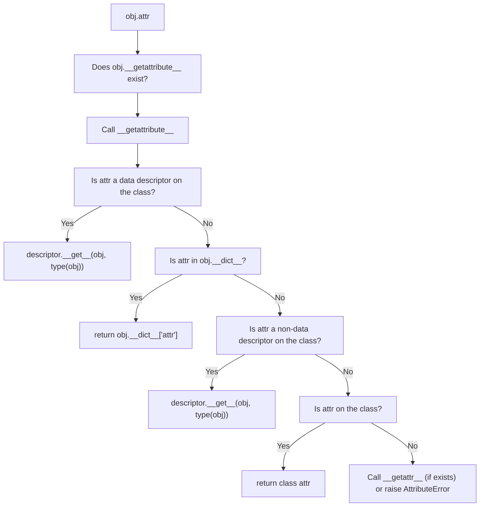
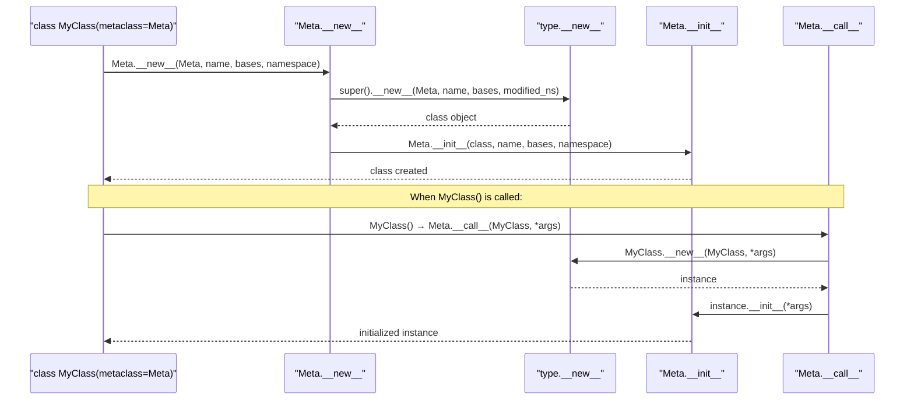

# Metaprogramming and Descriptors

> [!summary] Goal
> Master Python metaprogramming — descriptors (`__get__`/`__set__`/`__delete__`), attribute access control, metaclasses, `__init_subclass__`, and how `@property` and `@dataclass` work internally.

## Table of Contents

1. [Descriptor Protocol](#descriptor-protocol)
2. [Attribute Access Control](#attribute-access-control)
3. [How `@property` Works](#how-property-works)
4. [`__init_subclass__`](#__init_subclass__)
5. [Metaclasses](#metaclasses)
6. [How `@dataclass` Works](#how-dataclass-works)
7. [Pitfalls](#pitfalls)

---

## Descriptor Protocol

> [!info] A descriptor is an object that implements `__get__`, `__set__`, or `__delete__`
> When a descriptor is a class attribute, Python intercepts attribute access and calls the descriptor methods instead of returning the attribute directly.

```python
class ValidatedField:
    """A descriptor that validates and caches values."""

    def __set_name__(self, owner, name):        # Python 3.6+
        self.public_name = name
        self.private_name = f"_{name}"

    def __get__(self, obj, objtype=None):
        if obj is None:                         # Accessed on class, not instance
            return self
        return getattr(obj, self.private_name)

    def __set__(self, obj, value):
        self.validate(value)
        setattr(obj, self.private_name, value)

    def validate(self, value):
        raise NotImplementedError

class PositiveInt(ValidatedField):
    def validate(self, value):
        if not isinstance(value, int) or value <= 0:
            raise ValueError(f"{self.public_name} must be a positive int, got {value}")

class Order:
    quantity = PositiveInt()
    price = PositiveInt()

    def __init__(self, quantity, price):
        self.quantity = quantity
        self.price = price

o = Order(10, 500)
o.quantity = -5          # ValueError!
```

### Types of descriptors

| Type | Defines | Overrides instance dict? |
|------|---------|:------------------------:|
| **Data descriptor** | `__get__` + `__set__` or `__delete__` | ✅ Yes |
| **Non-data descriptor** | `__get__` only | ❌ No (instance dict wins) |

```python
# Non-data descriptor — method-like
class MethodDescriptor:
    def __get__(self, obj, objtype=None):
        if obj is None:
            return self
        # Return a bound method
        return functools.partial(self.method, obj)

# Data descriptor — property-like
class DataDescriptor:
    def __get__(self, obj, objtype=None):
        ...
    def __set__(self, obj, value):
        ...
```

---

## Attribute Access Control

```python
class SecureAttributes:
    def __init__(self):
        self._data = {}

    def __getattr__(self, name):
        """Called when normal attribute lookup fails."""
        if name in self._data:
            return self._data[name]
        raise AttributeError(f"{name} not found")

    def __setattr__(self, name, value):
        """Called on every attribute assignment."""
        if name.startswith("_"):
            super().__setattr__(name, value)    # Normal path for private attrs
        elif isinstance(value, (int, float, str)):
            self._data[name] = value
        else:
            raise TypeError(f"Only primitives allowed, got {type(value).__name__}")

    def __delattr__(self, name):
        """Called on `del obj.name`."""
        if name in self._data:
            del self._data[name]
        else:
            super().__delattr__(name)

    def __getattribute__(self, name):
        """Called on EVERY attribute access (use with care)."""
        if name == "password":
            raise PermissionError("Cannot access password directly")
        return super().__getattribute__(name)
```



---

## How `@property` Works

> [!info] `@property` creates a data descriptor from the getter/setter/deleter methods

```python
# Equivalent implementation:
class property:
    def __init__(self, fget=None, fset=None, fdel=None, doc=None):
        self.fget = fget
        self.fset = fset
        self.fdel = fdel
        if doc is None and fget is not None:
            doc = fget.__doc__
        self.__doc__ = doc

    def __get__(self, obj, objtype=None):
        if obj is None:
            return self                     # Accessed on class
        if self.fget is None:
            raise AttributeError("unreadable attribute")
        return self.fget(obj)

    def __set__(self, obj, value):
        if self.fset is None:
            raise AttributeError("can't set attribute")
        self.fset(obj, value)

    def __delete__(self, obj):
        if self.fdel is None:
            raise AttributeError("can't delete attribute")
        self.fdel(obj)

    def getter(self, fget):
        return type(self)(fget, self.fset, self.fdel, self.__doc__)

    def setter(self, fset):
        return type(self)(self.fget, fset, self.fdel, self.__doc__)

    def deleter(self, fdel):
        return type(self)(self.fget, self.fset, fdel, self.__doc__)
```

---

## `__init_subclass__`

> [!info] `__init_subclass__` is called when a subclass is created (Python 3.6+)
> It's a simpler alternative to metaclasses for subclass validation and registration.

```python
class PluginBase:
    plugins = {}                            # Registry

    def __init_subclass__(cls, name=None, **kwargs):
        super().__init_subclass__(**kwargs)
        if name is None:
            name = cls.__name__.lower()
        cls.plugin_name = name
        PluginBase.plugins[name] = cls

    def run(self):
        raise NotImplementedError

class LogPlugin(PluginBase, name="log"):
    def run(self):
        print("Logging enabled")

class MetricsPlugin(PluginBase, name="metrics"):
    def run(self):
        print("Metrics enabled")

PluginBase.plugins  # {"log": LogPlugin, "metrics": MetricsPlugin}
```

> [!tip] `__init_subclass__` vs metaclasses
> Use `__init_subclass__` for simple subclass registration/validation. Use metaclasses when you need to modify the class **body** or control `__new__`/`__call__` behavior.

---

## Metaclasses

> [!info] A metaclass is the class of a class. `type` is the default metaclass
> Metaclasses can intercept class creation and modify the class before it's defined.

```python
# Metaclass that adds a prefix to all method names
class PrefixedMeta(type):
    def __new__(mcs, name, bases, namespace):
        prefixed = {}
        for key, value in namespace.items():
            if callable(value) and not key.startswith("__"):
                prefixed[f"my_{key}"] = value
            else:
                prefixed[key] = value
        return super().__new__(mcs, name, bases, prefixed)

class MyClass(metaclass=PrefixedMeta):
    def greet(self):
        return "Hello"

obj = MyClass()
obj.my_greet()          # "Hello" — renamed by metaclass
# obj.greet()           # AttributeError!
```

### Metaclass chain of events



```python
# Common metaclass pattern: Singleton
class SingletonMeta(type):
    _instances = {}

    def __call__(cls, *args, **kwargs):
        if cls not in cls._instances:
            cls._instances[cls] = super().__call__(*args, **kwargs)
        return cls._instances[cls]

class Database(metaclass=SingletonMeta):
    def __init__(self):
        print("Database connection created")

db1 = Database()   # "Database connection created"
db2 = Database()   # No print — same instance
db1 is db2         # True
```

---

## How `@dataclass` Works

> [!info] `@dataclass` generates `__init__`, `__repr__`, `__eq__`, `__hash__`, and more by inspecting type annotations

```python
# Simplified implementation:
from functools import wraps

def dataclass(cls):
    annotations = cls.__annotations__
    fields = list(annotations.items())

    # Generate __init__
    def __init__(self, **kwargs):
        for name, _ in fields:
            setattr(self, name, kwargs[name])

    # Generate __repr__
    def __repr__(self):
        field_strs = [f"{name}={getattr(self, name)!r}" for name, _ in fields]
        return f"{cls.__name__}({', '.join(field_strs)})"

    cls.__init__ = __init__
    cls.__repr__ = __repr__

    # Generate __eq__
    def __eq__(self, other):
        if not isinstance(other, cls):
            return NotImplemented
        return all(
            getattr(self, name) == getattr(other, name) for name, _ in fields
        )

    cls.__eq__ = __eq__
    return cls

@dataclass
class Point:
    x: float
    y: float

p = Point(x=1.0, y=2.0)   # Generated __init__
print(p)                    # Point(x=1.0, y=2.0)  — generated __repr__
```

---

## Pitfalls

### Descriptor `__set_name__` not called on reassignment

```python
class Descriptor:
    def __set_name__(self, owner, name):
        self.name = name

class MyClass:
    attr = Descriptor()
    attr = Descriptor()     # __set_name__ is NOT called again!
```

### `__getattr__` vs `__getattribute__` performance

`__getattribute__` is called on **every** attribute access, making it expensive. Use `__getattr__` (fallback) whenever possible.

### Metaclass conflicts

Two metaclasses must be compatible (a class can inherit from multiple metaclasses only if they share a common ancestor). This limits metaclass composition.

### `@property` can't be used with `__slots__`' attributes

Properties are class-level descriptors. `__slots__` attributes are instance-level. They work together but you need to be careful about naming.

---

> [!question]- Interview Questions
>
> **Q: What is the descriptor protocol?**
> A: A descriptor is an object that defines `__get__`, `__set__`, or `__delete__`. When a descriptor is a class attribute, Python intercepts attribute access and calls these methods. `@property`, `@classmethod`, `@staticmethod`, and `__slots__` are all implemented using descriptors.
>
> **Q: What's the difference between `__getattr__` and `__getattribute__`?**
> A: `__getattribute__` is called on EVERY attribute access (including `self.xxx` inside methods). `__getattr__` is called only when normal attribute lookup fails. `__getattribute__` is powerful but dangerous (easy to cause infinite recursion) and slower.
>
> **Q: When would you use a metaclass vs `__init_subclass__`?**
> A: Use `__init_subclass__` for simple subclass registration, validation, or attribute injection. Use metaclasses when you need to override `__new__` (to modify the class **before** it's created), implement singletons, or control class instantiation. Metaclasses are more powerful but more complex.

---

## Cross-Links

- [[Python/01_Foundations/04_OOP_Classes_Dunder_Methods]] for class basics
- [[Python/01_Foundations/05_Iterators_Generators_Decorators]] for decorator patterns
- [[Python/02_Core/01_CPython_Internals]] for `tp_*` slot dispatch
- [[Python/03_Advanced/05_Type_System_Deep_Dive]] for `Protocol` and structural typing
