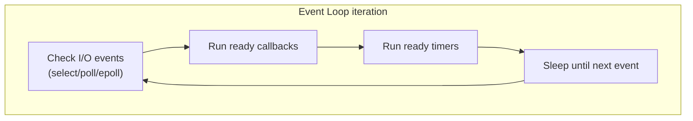

# Async Deep Dive

> [!summary] Goal
> Deep understanding of Python async — event loop internals, the coroutine protocol (`__await__`), `Future` vs `Task`, asyncio synchronization primitives, advanced patterns, and comparison with `anyio`/`trio`.

## Table of Contents

1. [Event Loop Internals](#event-loop-internals)
2. [Coroutine Protocol](#coroutine-protocol)
3. [Future vs Task](#future-vs-task)
4. [Async Synchronization](#async-synchronization)
5. [Async Generators and Context Managers](#async-generators-and-context-managers)
6. [anyio and trio](#anyio-and-trio)
7. [Debugging Async Code](#debugging-async-code)
8. [Pitfalls](#pitfalls)

---

## Event Loop Internals

> [!info] The event loop runs a single-threaded loop: check I/O readiness → run callbacks → sleep until the next timer fires



```python
# Conceptual event loop (simplified)
class EventLoop:
    def __init__(self):
        self._ready = []               # Callbacks ready to run
        self._timers = []              # Scheduled timer callbacks
        self._stopping = False

    def call_soon(self, callback, *args):
        self._ready.append((callback, args))

    def call_later(self, delay, callback, *args):
        deadline = time.monotonic() + delay
        heapq.heappush(self._timers, (deadline, callback, args))

    def _run_once(self):
        # Run ready callbacks
        while self._ready:
            cb, args = self._ready.pop(0)
            cb(*args)

        # Check timers
        now = time.monotonic()
        while self._timers and self._timers[0][0] <= now:
            _, cb, args = heapq.heappop(self._timers)
            cb(*args)

    def run_forever(self):
        while not self._stopping:
            self._run_once()
            # Poll for I/O (select/epoll) with timeout to next timer
```

```python
# The real event loop differs by platform:
# - Linux:    epoll (scalable, O(1))
# - macOS:    kqueue
# - Windows:  I/O Completion Ports (IOCP) via ProactorEventLoop
import asyncio
loop = asyncio.get_running_loop()
print(type(loop)._selector)   # e.g., <class 'selectors.EpollSelector'>
```

---

## Coroutine Protocol

> [!info] The `async/await` syntax is syntactic sugar over `__await__` and `send()`/`throw()`/`close()`

```python
# Low-level coroutine protocol — what `async def` compiles to
class Coroutine:
    def __await__(self):
        # Returns an iterator; each yield returns control to the event loop
        # The event loop uses .send() to resume
        result = yield from self._run()
        return result

# Simplified: what `await coro` does
# 1. Calls coro.__await__() to get an iterator
# 2. Calls iterator.__next__() / iterator.send()
# 3. The iterator yields control to the event loop
# 4. Event loop resumes via send() when ready

# Manual coroutine execution (no event loop)
async def simple():
    return 42

coro = simple()
try:
    coro.send(None)          # Start — raises StopIteration with value
except StopIteration as e:
    print(e.value)           # 42
```

### Awaitables

```python
import asyncio

# Three types of awaitables:
# 1. Coroutine (async def)
# 2. asyncio.Task
# 3. asyncio.Future

# Check if something is awaitable
import inspect
inspect.isawaitable(coro)               # True
inspect.isawaitable(42)                 # False

# Coroutine has __await__ — returns iterator
coro = simple()
hasattr(coro, "__await__")              # True
```

---

## Future vs Task

```python
import asyncio

# Future — low-level, represents a result that will be available later
future = asyncio.get_event_loop().create_future()

# Set result (from somewhere else)
future.set_result(42)

# Get result
result = await future                   # 42

# Task — wraps a coroutine into a Future (schedules on event loop)
# Task IS a Future + scheduling
task = asyncio.create_task(simple())    # Creates + schedules

await task                             # 42 (same as Future)

# Task methods
task.cancel()                          # Cancel the coroutine
task.done()                            # Bool
task.result()                          # Raises if not done
task.exception()                       # Get exception if raised
```

```python
# Task lifecycle
async def worker():
    try:
        await asyncio.sleep(10)
    except asyncio.CancelledError:
        print("Cancelled!")
        raise

task = asyncio.create_task(worker())
await asyncio.sleep(0.1)
task.cancel()
try:
    await task
except asyncio.CancelledError:
    print("Task was cancelled")
```

### Future vs Task comparison

| Feature | Future | Task |
|---------|:------:|:----:|
| Wraps | Any result | Coroutine |
| Auto-scheduled | ❌ | ✅ (on creation) |
| Cancellable | ✅ | ✅ |
| Lifecycle | Manually set result | Coroutine lifecycle |
| Use case | Interop with callbacks/threads | Running coroutines |

---

## Async Synchronisation

```python
import asyncio

# Lock — mutual exclusion
lock = asyncio.Lock()

async def safe_update(resource_id):
    async with lock:
        value = await get_value(resource_id)
        await set_value(resource_id, value + 1)

# Semaphore — limit concurrency
sem = asyncio.Semaphore(5)

async def limited_request(url):
    async with sem:
        return await fetch(url)

# Event — one-shot signal
event = asyncio.Event()

async def waiter():
    print("Waiting...")
    await event.wait()
    print("Done!")

# Condition — notify multiple waiters
condition = asyncio.Condition()

async def consumer():
    async with condition:
        await condition.wait()
        data = queue.pop()

async def producer():
    async with condition:
        queue.append(item)
        condition.notify()

# Queue — producer/consumer
queue = asyncio.Queue(maxsize=10)

async def producer():
    for i in range(100):
        await queue.put(f"item_{i}")

async def consumer():
    while True:
        item = await queue.get()
        process(item)
        queue.task_done()
```

---

## Async Generators and Context Managers

```python
# Async generator — yields values asynchronously
async def ticker(interval: float, count: int):
    for i in range(count):
        await asyncio.sleep(interval)
        yield i

async def main():
    async for tick in ticker(0.5, 5):
        print(tick)                     # 0, 1, 2, 3, 4

# Async context manager — setup/teardown with async operations
class Database:
    async def __aenter__(self):
        self.conn = await create_connection()
        return self.conn

    async def __aexit__(self, exc_type, exc_val, exc_tb):
        await self.conn.close()

async def main():
    async with Database() as conn:
        await conn.execute("SELECT 1")
```

---

## anyio and trio

> [!info] `trio` and `anyio` provide structured concurrency — a task-based model that prevents common asyncio bugs

```python
# Trio — structured concurrency
import trio

async def child():
    await trio.sleep(1)
    return "done"

async def parent():
    async with trio.open_nursery() as nursery:
        nursery.start_soon(child)
        nursery.start_soon(child)
        # Both children complete before nursery exits

trio.run(parent)

# anyio — unified async backend (trio or asyncio)
import anyio

async def main():
    async with anyio.create_task_group() as tg:
        tg.start_soon(child)
        tg.start_soon(child)

anyio.run(main, backend="trio")       # Use trio backend
```

### Structured concurrency vs asyncio

| Feature | asyncio | trio / anyio |
|---------|:-------:|:------------:|
| Spawn & forget | `create_task` | `nursery.start_soon` |
| Error propagation | Manual (gather) | Automatic (nursery) |
| Cancellation | Manual | Built-in |
| Task scope | Global | Scoped to nursery |
| Learning curve | Medium | Lower |

---

## Debugging Async Code

```python
import asyncio

# Enable debug mode
asyncio.run(main(), debug=True)
# or:
loop = asyncio.new_event_loop()
loop.set_debug(True)

# Environment variable
# PYTHONASYNCIODEBUG=1 python script.py

# What debug mode does:
# 1. Warns about coroutines that take > 100ms (slow callbacks)
# 2. Detects "was never awaited" coroutines
# 3. Logs when the event loop is blocked
# 4. Shows callback traces

# Finding blocking calls
import time

async def bad():
    time.sleep(5)               # Blocks event loop — debug mode warns!
    await asyncio.sleep(5)       # ✅

# Detecting forgotten awaits
async def main():
    fetch_data()                 # ❌ Coroutine created but not awaited
    # Debug mode warns: "coroutine was never awaited"

# Cancellation safety
async def cleanup():
    try:
        await asyncio.sleep(10)
    except asyncio.CancelledError:
        await release_resources()    # ✅ Clean up on cancel
        raise                        # ✅ Re-raise

# asyncio.all_tasks() — inspect running tasks
pending = asyncio.all_tasks()
for task in pending:
    print(task.get_coro(), task.done())
```

---

## Pitfalls

### Not awaiting coroutines in callbacks

```python
loop.call_soon(some_async_func())          # ❌ Creates coroutine, doesn't run
loop.call_soon(lambda: asyncio.create_task(some_async_func()))  # ✅
```

### Mixing asyncio and threading

Use `asyncio.run_coroutine_threadsafe()` to submit coroutines from other threads.

### Not handling CancelledError

```python
async def worker():
    while True:
        await asyncio.sleep(1)
        # If cancelled here, resource may leak

    # ✅ Handle cancellation
    try:
        while True:
            await asyncio.sleep(1)
    except asyncio.CancelledError:
        await cleanup()
        raise
```

### `asyncio.gather()` with `return_exceptions=False` (default)

One failure cancels all other tasks. Use `return_exceptions=True` if you want partial results.

### Event loop blocking

`time.sleep()`, CPU-bound loops, and synchronous I/O block the entire event loop. Offload with `loop.run_in_executor()`.

---

> [!question]- Interview Questions
>
> **Q: What's the difference between a Future and a Task?**
> A: A Future is a low-level awaitable that will hold a result later (manually set). A Task is a subclass of Future that wraps a coroutine and automatically schedules it on the event loop. Tasks start running as soon as they're created; Futures need `set_result()` called explicitly.
>
> **Q: What is structured concurrency?**
> A: Structured concurrency (trio/anyio) ensures that all spawned tasks complete before the enclosing scope exits. If any task raises, others are cancelled and the exception propagates. This prevents "fire and forget" mistakes, resource leaks, and makes error handling deterministic.
>
> **Q: How do you debug asyncio code?**
> A: Enable debug mode (`asyncio.run(main(), debug=True)` or `PYTHONASYNCIODEBUG=1`). It warns about slow callbacks (>100ms), unawaited coroutines, and blocked event loops. Use `asyncio.all_tasks()` to inspect running tasks. For blocking calls, set a shorter `slow_callback_duration`.

---

## Cross-Links

- [[Python/01_Foundations/11_Async_Python_Basics]] for async fundamentals
- [[Python/02_Core/02_Concurrency_Parallelism]] for threading comparison
- [[Python/02_Core/06_Web_Frameworks_FastAPI]] for async web patterns
- [[Python/02_Core/04_Web_Scraping]] for async scraping
