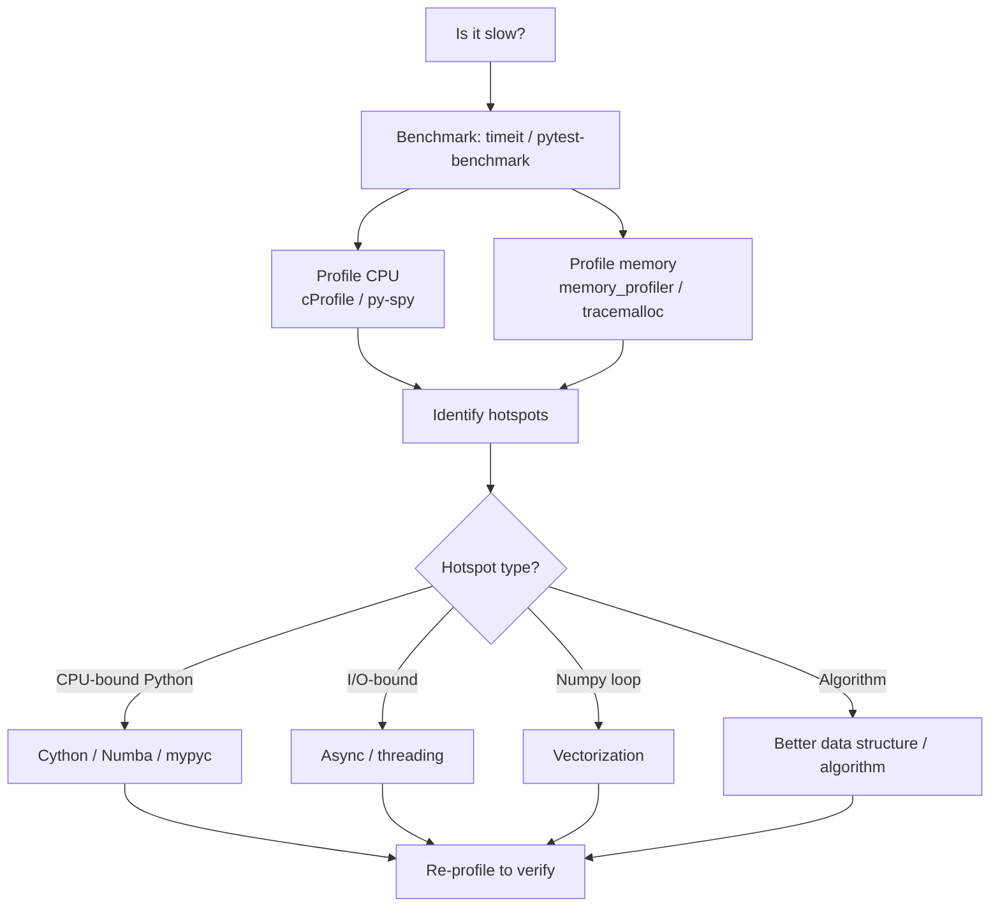

# Performance Profiling and Optimization

> [!summary] Goal
> Master Python performance — profiling tools (`cProfile`, `py-spy`, `memory_profiler`, `tracemalloc`), flamegraphs, bytecode inspection with `dis`, and optimization strategies (Cython, Numba, mypyc, numpy vectorization).

## Table of Contents

1. [Profiling Workflow](#profiling-workflow)
2. [cProfile](#cprofile)
3. [py-spy](#py-spy)
4. [Memory Profiling](#memory-profiling)
5. [Bytecode Inspection](#bytecode-inspection)
6. [Optimization Strategies](#optimization-strategies)
7. [Cython](#cython)
8. [Numba](#numba)
9. [Pitfalls](#pitfalls)

---

## Profiling Workflow



---

## cProfile

```python
import cProfile
import pstats

# Profile a function
profiler = cProfile.Profile()
profiler.enable()
slow_function()
profiler.disable()

# Save results
profiler.dump_stats("profile.prof")

# Analyze with pstats
stats = pstats.Stats(profiler)
stats.sort_stats("cumtime")         # Cumulative time
stats.print_stats(20)               # Top 20

# Sort options:
# 'cumtime' — cumulative time (total including subcalls)
# 'tottime' — time spent in function only (excluding subcalls)
# 'ncalls'  — number of calls
```

```bash
# From command line
python -m cProfile -o profile.prof myscript.py

# View as table
python -m pstats profile.prof
# In pstats: sort cumtime
# In pstats: stats 20

# Generate flamegraph with snakeviz
pip install snakeviz
snakeviz profile.prof         # Opens browser with interactive flamegraph
```

---

## py-spy

> [!info] `py-spy` is a sampling profiler — no code changes needed, works on running processes

```bash
# Profile a running process
py-spy record -o profile.svg --pid 12345

# Profile a command
py-spy record -o profile.svg -- python myscript.py

# Top-like live view
py-spy top --pid 12345

# Native speed, safe for production (sampling, no pauses)
# Identifies native extensions too
```

```python
# Programmatic
import py_spy  # Not needed — use CLI

# py-spy is especially useful for:
# - Production profiling (no overhead)
# - Profiling C extensions
# - Profiling multi-threaded applications
```

---

## Memory Profiling

### tracemalloc (stdlib, Python 3.4+)

```python
import tracemalloc

# Start tracing
tracemalloc.start()

# ... your code ...
large_list = [i for i in range(1_000_000)]

# Snapshot
snapshot = tracemalloc.take_snapshot()
top_stats = snapshot.statistics("lineno")

for stat in top_stats[:10]:
    print(stat)
    # e.g., "test.py:7: size=7.8 MiB, count=1, average=7.8 MiB"

# Compare with previous snapshot
snapshot2 = tracemalloc.take_snapshot()
diff = snapshot2.compare_to(snapshot, "lineno")
for stat in diff[:10]:
    print(stat)
```

### memory_profiler

```bash
pip install memory_profiler
```

```python
from memory_profiler import profile

@profile
def memory_hungry():
    data = [i for i in range(1_000_000)]
    more = [i * 2 for i in data]
    return more

memory_hungry()
# Line #    Mem usage    Increment  Occurrences   Line Contents
# =============================================================
#      5     42.1 MiB     42.1 MiB           1   @profile
#      6     67.5 MiB     25.4 MiB           1       data = ...
#      7     90.2 MiB     22.7 MiB           1       more = ...
```

### objgraph

```python
# pip install objgraph
import objgraph

objgraph.show_most_common_types(limit=10)
# dict      1234
# list      987
# tuple     567
# ...

# Find reference chains to an object
objgraph.show_backrefs(some_object, max_depth=5, filename="refs.png")

# Show growth between two points
objgraph.show_growth(limit=5)
```

---

## Bytecode Inspection

```python
import dis

# Compare fast vs slow code at bytecode level
def slow_add(x):
    result = []
    for i in range(len(x)):
        result.append(x[i] + 1)
    return result

def fast_add(x):
    return [v + 1 for v in x]

dis.dis(slow_add)
# Shows: LOAD_GLOBAL, GET_ITER, FOR_ITER, etc.

dis.dis(fast_add)
# Shows: LOAD_CONST, LOAD_FAST, LIST_COMP, etc.
# Faster because: local variables (LOAD_FAST), no attribute lookup
```

```python
# Key bytecodes for performance
# LOAD_FAST    — local variable (fastest)
# LOAD_DEREF   — closure variable
# LOAD_GLOBAL  — global variable (~10× slower than local)
# LOAD_ATTR    — attribute access (~5× slower than local)
```

---

## Optimization Strategies

### 1. Use local variables

```python
# ❌ Global lookups are slow
def slow():
    for i in range(1000):
        math.sin(i)

# ✅ Local binding speeds up
def fast():
    sin = math.sin
    for i in range(1000):
        sin(i)
```

### 2. Avoid attribute lookups in loops

```python
# ❌ Attribute lookup every iteration
for item in items:
    process(item.status_code)

# ✅ Local binding
status = lambda item: item.status_code
for item in items:
    process(status(item))
```

### 3. Use built-in functions and comprehensions

```python
# ❌ Loop
squares = []
for i in range(1000):
    squares.append(i * i)

# ✅ Comprehension
squares = [i * i for i in range(1000)]
```

### 4. Profile before optimizing

Don't optimize without profiling first. The 80/20 rule applies — 80% of time is spent in 20% of the code.

---

## Cython

```python
# mymath.pyx — Cython file
def fib(int n):
    cdef int a = 0, b = 1, i
    for i in range(n):
        a, b = b, a + b
    return a

# setup.py
from setuptools import setup
from Cython.Build import cythonize

setup(ext_modules=cythonize("mymath.pyx"))

# Build: python setup.py build_ext --inplace
# Result: mymath.cpython-312-x86_64-linux-gnu.so
# 10-50× speedup over pure Python
```

> [!tip] Cython gives C-level speed with Python-like syntax
> Use it for CPU-bound loops, numerical computation, and wrapping C libraries.

---

## Numba

> [!info] Numba JIT-compiles Python functions to machine code using LLVM

```python
from numba import jit, vectorize
import numpy as np

@jit(nopython=True)
def sum_squares(arr):
    total = 0.0
    for i in range(len(arr)):
        total += arr[i] ** 2
    return total

# First call compiles, subsequent calls run at native speed
arr = np.random.randn(1_000_000)
result = sum_squares(arr)

# Vectorize — like NumPy ufuncs
@vectorize(["float64(float64, float64)"])
def add_scaled(a, b):
    return a * 2 + b * 3

result = add_scaled(arr1, arr2)

# nopython=True is required for maximum performance
# Without it, Numba falls back to object mode (slower)
```

---

## Pitfalls

### Premature optimization

```python
# ❌ Optimizing before knowing what's slow
clever_obscure_implementation()

# ✅ Profile first, then optimize the hotspots
```

### Profiling overhead

`cProfile` adds ~20-50% overhead. Use `py-spy` (sampling, ~1% overhead) for production profiling.

### Trusting micro-benchmarks

```python
# timeit is great, but real-world performance differs
# due to caching, memory bandwidth, compiler optimizations

# Always profile at the application level after micro-optimizing
```

### Cython/Numba limitations

Not all Python code can be compiled. Dynamic dispatch, arbitrary classes, and some built-in functions may fail in `nopython=True` mode.

### Memory profiling overhead

`tracemalloc` and `memory_profiler` add significant overhead. Use them in development, not production.

---

> [!question]- Interview Questions
>
> **Q: What's the difference between `cProfile` and `py-spy`?**
> A: `cProfile` is a deterministic profiler that instruments every function call (tracing). `py-spy` is a statistical profiler that samples the call stack at intervals (~100 Hz). `cProfile` gives exact counts but adds overhead. `py-spy` is safe for production (~1% overhead), works on running processes, and profiles native extensions.
>
> **Q: What are the most effective Python optimizations?**
> A: (1) Use local variable bindings to avoid global/attribute lookups. (2) Replace loops with comprehensions and built-in functions. (3) Use NumPy vectorization instead of Python loops. (4) Use `__slots__` for memory-bound classes. (5) Profile first — don't guess. The biggest gains come from algorithm improvements, not micro-optimizations.
>
> **Q: When would you use Cython vs Numba vs mypyc?**
> A: Cython for wrapping C libraries and when you need explicit C types and manual control. Numba for numerical/mathematical code with loops (JIT-compile Python functions). mypyc for the easiest path (just add type hints). For pure Python code, mypyc is simplest. For numerical code, Numba is fastest. For C interop, Cython wins.

---

## Cross-Links

- [[Python/02_Core/01_CPython_Internals]] for bytecode and GIL
- [[Python/02_Core/07_NumPy_Deep_Dive]] for vectorization
- [[Python/04_Playbooks/01_Debug_Memory_Leaks]] for memory debugging
- [[Python/02_Core/13_Packaging_Distribution]] for mypyc compilation
