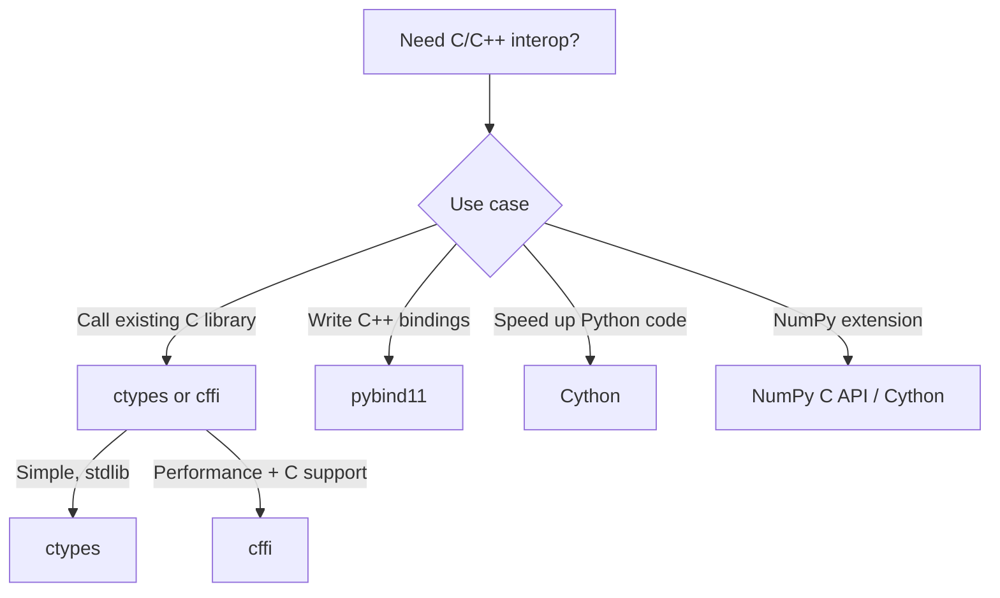

# C Extensions and FFI

> [!summary] Goal
> Understand how to call C/C++ from Python and extend Python with C. Covers `ctypes`, `cffi`, `pybind11`, `Cython` C extensions, and the NumPy C API.

## Table of Contents

1. [Tool Selection](#tool-selection)
2. [ctypes](#ctypes)
3. [cffi](#cffi)
4. [pybind11](#pybind11)
5. [Cython C Extensions](#cython-c-extensions)
6. [NumPy C API](#numpy-c-api)
7. [Pitfalls](#pitfalls)

---

## Tool Selection



| Tool | Language | Build step | Performance | Ease |
|------|:--------:|:----------:|:-----------:|:----:|
| `ctypes` | C (FFI) | No | Moderate | Easy |
| `cffi` | C (FFI) | No | Good | Medium |
| `pybind11` | C++ | Yes (setuptools) | Excellent | Medium |
| `Cython` | Python-like → C | Yes | Excellent | Medium |
| NumPy C API | C | Yes | Maximum | Hard |

---

## ctypes

> [!info] `ctypes` calls C functions from Python without compiling anything — just load the `.so`/`.dll`

```c
// math_utils.c
double add(double a, double b) { return a + b; }
double multiply(double a, double b) { return a * b; }

// gcc -shared -o libmath.so -fPIC math_utils.c
```

```python
import ctypes

# Load shared library
lib = ctypes.CDLL("./libmath.so")

# Define function signatures (return type + argument types)
lib.add.restype = ctypes.c_double
lib.add.argtypes = [ctypes.c_double, ctypes.c_double]

lib.multiply.restype = ctypes.c_double
lib.multiply.argtypes = [ctypes.c_double, ctypes.c_double]

# Call
result = lib.add(3.14, 2.71)        # 5.85
print(result)

# Working with structs
class Point(ctypes.Structure):
    _fields_ = [
        ("x", ctypes.c_double),
        ("y", ctypes.c_double),
    ]

# Arrays
arr = (ctypes.c_int * 10)(1, 2, 3)  # C array of 10 ints

# Callbacks
CALLBACK = ctypes.CFUNCTYPE(None, ctypes.c_int)
def callback(n):
    print(f"C called back with {n}")

lib.register_callback(CALLBACK(callback))
```

---

## cffi

> [!info] `cffi` is faster than `ctypes` and supports both ABI and API modes

```python
# pip install cffi

from cffi import FFI

ffi = FFI()

# Declare C functions (ABI mode — load existing .so)
ffi.cdef("""
    double add(double a, double b);
    double multiply(double a, double b);
""")

lib = ffi.dlopen("./libmath.so")
result = lib.add(3.14, 2.71)          # 5.85

# API mode — compile C source inline
ffi_builder = FFI()
ffi_builder.cdef("int factorial(int n);")
ffi_builder.set_source("_factorial", """
    int factorial(int n) {
        if (n <= 1) return 1;
        return n * factorial(n - 1);
    }
""")

ffi_builder.compile()                 # Builds _factorial.cpython-*.so
# Result: from _factorial import ffi, lib
#         lib.factorial(5)  # 120
```

### ctypes vs cffi

| Feature | ctypes | cffi |
|---------|:------:|:----:|
| Stdlib | ✅ Yes | ❌ Need install |
| Performance | Moderate | Good |
| C structs | Manual `_fields_` | Declarative |
| API mode (compile C) | ❌ | ✅ |
| Error messages | Often cryptic | Better |

---

## pybind11

> [!info] `pybind11` creates C++ Python bindings with minimal boilerplate (C++11 required)

```cpp
// example.cpp
#include <pybind11/pybind11.h>
#include <pybind11/stl.h>
namespace py = pybind11;

// C++ function
int add(int a, int b) { return a + b; }

// C++ class
class Calculator {
public:
    Calculator(double factor) : factor_(factor) {}
    double multiply(double a, double b) { return a * b * factor_; }
    double factor_;
};

PYBIND11_MODULE(example, m) {
    m.doc() = "Example pybind11 module";
    m.def("add", &add, "Add two integers");

    py::class_<Calculator>(m, "Calculator")
        .def(py::init<double>())
        .def("multiply", &Calculator::multiply)
        .def_readwrite("factor", &Calculator::factor_);
}
```

```python
# setup.py
from setuptools import setup, Extension
import pybind11

ext = Extension(
    "example",
    ["example.cpp"],
    include_dirs=[pybind11.get_include()],
    language="c++",
    extra_compile_args=["-std=c++11"],
)

setup(name="example", ext_modules=[ext])

# pip install .
# python -c "import example; print(example.add(1, 2))"  # 3
```

---

## Cython C Extensions

> [!info] Cython compiles Python-like code to C with optional type declarations

```python
# fastmath.pyx
def fib_cython(int n):
    cdef int a = 0, b = 1, i
    for i in range(n):
        a, b = b, a + b
    return a

def sum_squares_cython(double[:] arr):    # Typed memoryview
    cdef double total = 0.0
    cdef int i
    for i in range(arr.shape[0]):
        total += arr[i] * arr[i]
    return total
```

```python
# setup.py
from setuptools import setup
from Cython.Build import cythonize
import numpy

setup(
    ext_modules=cythonize("fastmath.pyx"),
    include_dirs=[numpy.get_include()],
)
```

```python
# Usage — import like a normal Python module
from fastmath import fib_cython, sum_squares_cython
```

### Cython vs pybind11

| Feature | Cython | pybind11 |
|---------|:------:|:--------:|
| Language | Python-like | C++ |
| Speed | 10-50× Python | Near-native C++ |
| NumPy integration | Excellent (memoryviews) | Manual |
| C++ classes | Via `cdef extern from` | Direct |
| Learning curve | Medium | Medium (C++ required) |

---

## NumPy C API

> [!info] The NumPy C API gives direct access to array data — maximum performance for custom operations

```c
// sum_squares.c
#include <Python.h>
#include <numpy/arrayobject.h>

static PyObject* sum_squares(PyObject* self, PyObject* args) {
    PyArrayObject* arr;
    if (!PyArg_ParseTuple(args, "O!", &PyArray_Type, &arr))
        return NULL;

    npy_intp size = PyArray_SIZE(arr);
    double* data = (double*)PyArray_DATA(arr);
    double total = 0.0;

    for (npy_intp i = 0; i < size; i++) {
        total += data[i] * data[i];
    }
    return PyFloat_FromDouble(total);
}
```

```python
# Using the extension
import sum_squares_ext
import numpy as np

arr = np.array([1.0, 2.0, 3.0], dtype=np.float64)
result = sum_squares_ext.sum_squares(arr)   # 14.0
```

---

## Pitfalls

### Reference counting in C extensions

```python
# Every Py_INCREF/Py_DECREF mismatch causes crashes
# Use Py_NewRef (Python 3.10+) or careful manual management
```

### GIL management

```python
# CPU-bound C code should release the GIL
Py_BEGIN_ALLOW_THREADS
// ... CPU work ...
Py_END_ALLOW_THREADS
```

### Platform-specific shared libraries

```python
# .so (Linux), .dylib (macOS), .dll (Windows)
import platform
if platform.system() == "Windows":
    lib = ctypes.CDLL("mylib.dll")
else:
    lib = ctypes.CDLL("libmylib.so")
```

### Memory ownership

With `ctypes`, you must manage memory manually. With `pybind11` and Cython, memory is managed automatically (RAII for pybind11, reference counting for Cython).

### NumPy C API: module init

```c
// Must call import_array() in module init
PyMODINIT_FUNC PyInit_module(void) {
    import_array();
    return PyModule_Create(&module);
}
```

---

> [!question]- Interview Questions
>
> **Q: What's the difference between ctypes and cffi?**
> A: ctypes is in the stdlib and calls C functions directly from Python. cffi requires installation but is faster, supports both ABI mode (load .so) and API mode (compile C inline), and has better C struct support. For simple cases, ctypes is sufficient. For performance-critical FFI, use cffi.
>
> **Q: When would you use pybind11 over Cython?**
> A: Use pybind11 when you have existing C++ code and want to expose it to Python with minimal wrapper code. Use Cython when you're starting from Python and want to gradually add static types for performance. Cython has better NumPy integration; pybind11 has better C++ integration.
>
> **Q: How do you manage the GIL in C extensions?**
> A: Release the GIL before CPU-bound operations with `Py_BEGIN_ALLOW_THREADS` / `Py_END_ALLOW_THREADS`. Re-acquire it when accessing Python objects. Never release the GIL if you're calling back into Python code or accessing Python objects.

---

## Cross-Links

- [[Python/02_Core/13_Packaging_Distribution]] for building C extensions
- [[Python/02_Core/07_NumPy_Deep_Dive]] for NumPy basics
- [[Python/02_Core/01_CPython_Internals]] for `PyObject` and reference counting
- [[Python/03_Advanced/02_Performance_Profiling]] for profiling C extensions
