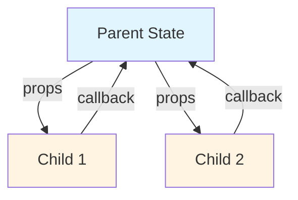
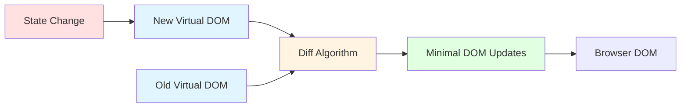
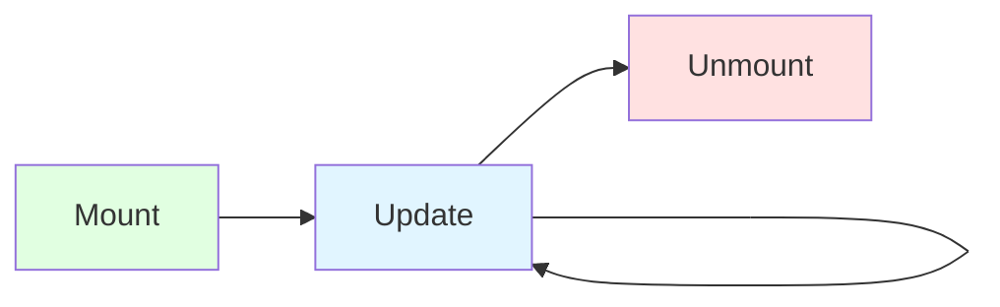
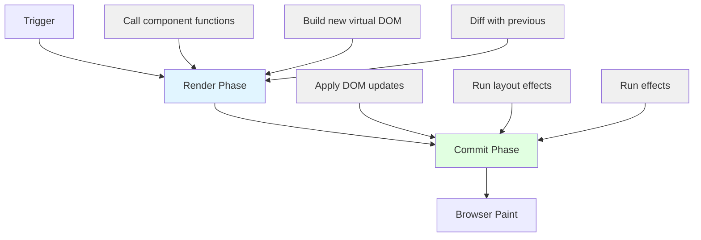
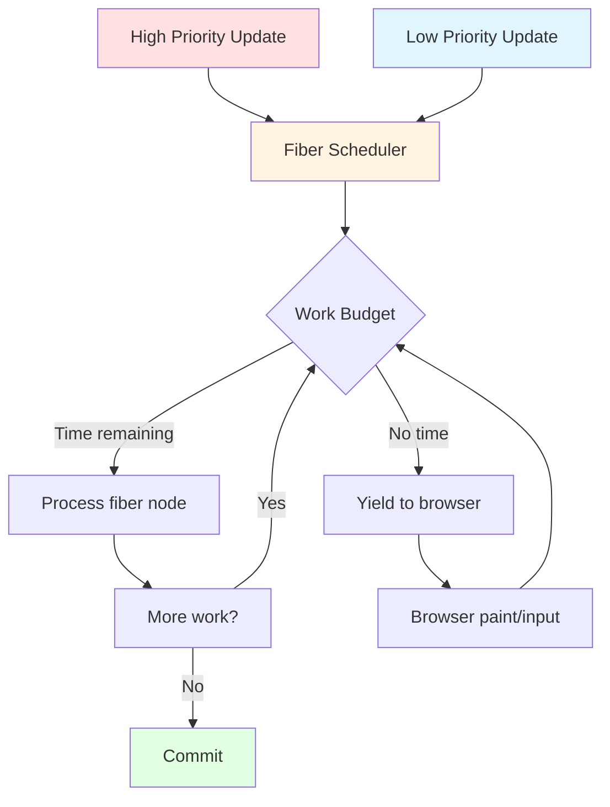
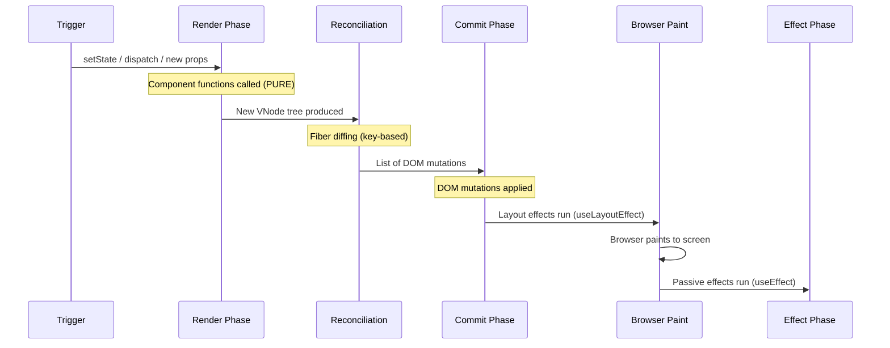
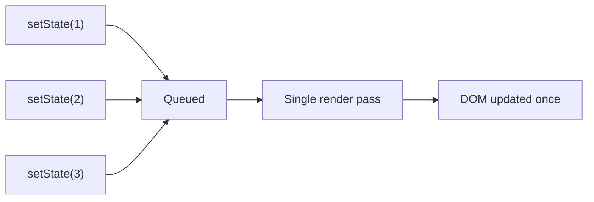
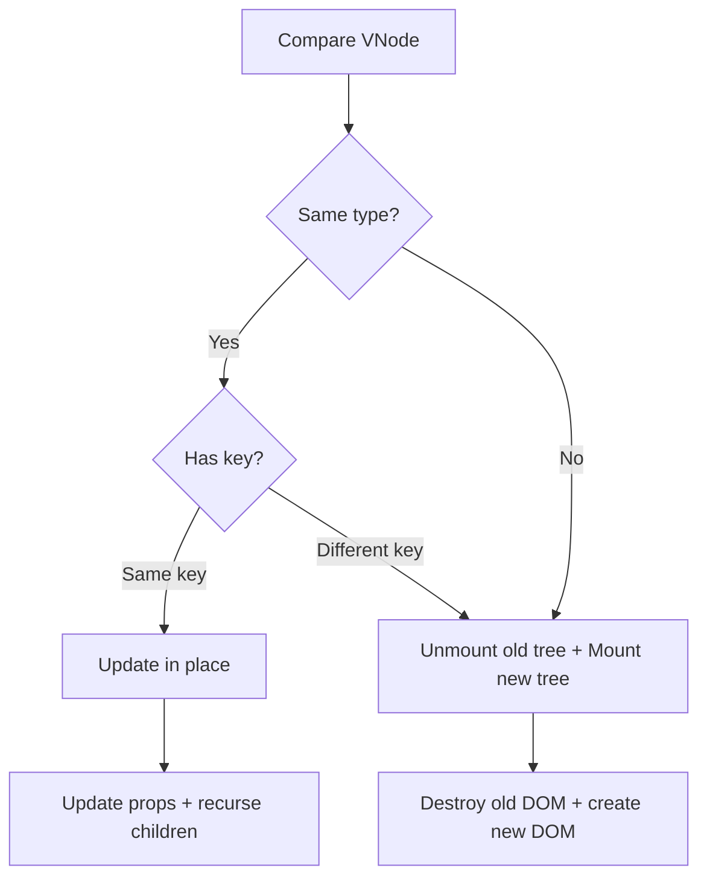
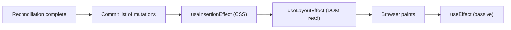
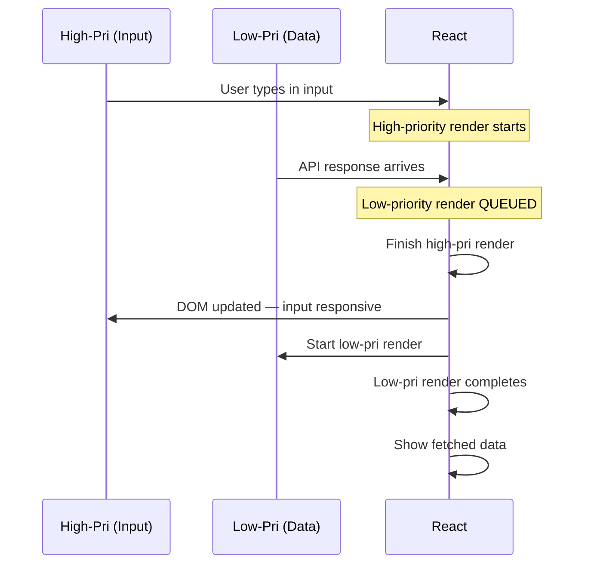

# React Mental Model and Rendering

> [!summary] Core Mental Model
> A React component is a **pure function** from (props, state, context) to UI. Rendering is React calling those functions to compute what the UI should look like. React then compares the result to the previous UI and commits minimal changes to the DOM.

## Table of Contents

- [React Mental Model](#react-mental-model)
- [Component as Function of State](#component-as-function-of-state)
- [Declarative vs Imperative](#declarative-vs-imperative)
- [One-Way Data Flow](#one-way-data-flow)
- [Virtual DOM and Reconciliation](#virtual-dom-and-reconciliation)
- [Component Lifecycle](#component-lifecycle)
- [JSX Deep Dive](#jsx-deep-dive)
- [Rendering Behavior](#rendering-behavior)
- [Fiber Architecture](#fiber-architecture)
- [Common Pitfalls](#common-pitfalls)
- [TypeScript Integration](#typescript-integration)
- [Best Practices](#best-practices)
- [Interview Questions](#interview-questions)

---

## React Mental Model

### Component as Function of State

React components are **deterministic functions**:

```typescript
UI = f(state, props, context)
```

**Key principles:**

1. **Pure during render**: No side effects, mutations, or randomness during render
2. **Deterministic**: Same inputs always produce same output
3. **Composable**: Components build UIs from smaller components
4. **Declarative**: Describe what UI should look like, not how to build it

```typescript
// Pure component - always produces same output for same input
interface GreetingProps {
  name: string;
  count: number;
}

function Greeting({ name, count }: GreetingProps) {
  // ✅ Pure computation during render
  const message = `Hello ${name}, you have ${count} messages`;
  
  return <div>{message}</div>;
}

// ❌ IMPURE - has side effects during render
function BadGreeting({ name }: { name: string }) {
  // Don't do this! Side effect during render
  document.title = name;
  
  return <div>Hello {name}</div>;
}

// ✅ PURE - side effects in useEffect
function GoodGreeting({ name }: { name: string }) {
  useEffect(() => {
    document.title = name;
  }, [name]);
  
  return <div>Hello {name}</div>;
}
```

**Why purity matters:**

- **Predictability**: Easy to reason about component behavior
- **Testability**: Pure functions are trivial to test
- **Concurrent rendering**: React can safely interrupt/restart renders
- **Time-travel debugging**: Can replay state changes
- **Server-side rendering**: Can render on server safely

---

## Declarative vs Imperative

### Imperative (DOM manipulation)

```typescript
// Imperative - tell the browser HOW to update
function updateCounter(value: number) {
  const counter = document.getElementById('counter');
  if (counter) {
    counter.textContent = String(value);
  }
  
  if (value > 10) {
    counter?.classList.add('highlight');
  } else {
    counter?.classList.remove('highlight');
  }
}

// You manage every step
updateCounter(5);
updateCounter(11); // Must remember to add class
updateCounter(8);  // Must remember to remove class
```

### Declarative (React)

```typescript
// Declarative - describe WHAT the UI should look like
interface CounterProps {
  value: number;
}

function Counter({ value }: CounterProps) {
  return (
    <div className={value > 10 ? 'highlight' : ''}>
      {value}
    </div>
  );
}

// React figures out how to update DOM
<Counter value={5} />
<Counter value={11} /> // React adds class
<Counter value={8} />  // React removes class
```

**Benefits of declarative:**

- Less error-prone (no manual DOM sync)
- Self-documenting (UI is function of state)
- Composable (build complex UIs from simple pieces)
- Time-travel debugging possible

---

## One-Way Data Flow

React enforces **unidirectional data flow**: data flows down through props, events flow up through callbacks.



```typescript
// Parent owns state and passes down
function TodoApp() {
  const [todos, setTodos] = useState<Todo[]>([]);
  
  const addTodo = (text: string) => {
    setTodos([...todos, { id: nanoid(), text, done: false }]);
  };
  
  const toggleTodo = (id: string) => {
    setTodos(todos.map(t => 
      t.id === id ? { ...t, done: !t.done } : t
    ));
  };
  
  return (
    <>
      {/* Data flows down via props */}
      <TodoInput onAdd={addTodo} />
      <TodoList todos={todos} onToggle={toggleTodo} />
    </>
  );
}

// Children receive data and callbacks
function TodoInput({ onAdd }: { onAdd: (text: string) => void }) {
  const [text, setText] = useState('');
  
  return (
    <form onSubmit={(e) => {
      e.preventDefault();
      onAdd(text); // Events flow up via callbacks
      setText('');
    }}>
      <input value={text} onChange={e => setText(e.target.value)} />
    </form>
  );
}
```

**Why one-way data flow:**

- **Predictable**: Easy to trace where state changes come from
- **Debuggable**: Can set breakpoints on state updates
- **Maintainable**: Clear ownership of state
- **Performance**: Can optimize re-renders with memoization

---

## Virtual DOM and Reconciliation

### What is Virtual DOM?

The Virtual DOM is a **lightweight JavaScript representation** of the real DOM. React maintains this virtual tree and uses it to compute minimal DOM updates.



### JSX to Virtual DOM

```typescript
// JSX
<div className="container">
  <h1>Hello {name}</h1>
  <Button onClick={handleClick}>Click me</Button>
</div>

// Compiles to React.createElement calls
React.createElement('div', { className: 'container' },
  React.createElement('h1', null, 'Hello ', name),
  React.createElement(Button, { onClick: handleClick }, 'Click me')
);

// Creates Virtual DOM (simplified)
{
  type: 'div',
  props: {
    className: 'container',
    children: [
      {
        type: 'h1',
        props: { children: ['Hello ', 'Alice'] }
      },
      {
        type: Button,
        props: { onClick: handleClick, children: 'Click me' }
      }
    ]
  }
}
```

### Reconciliation Algorithm

React compares old and new virtual DOM trees using a **heuristic O(n) algorithm** (instead of O(n³) tree diff):

**Key heuristics:**

1. **Different types produce different trees**: `<div>` → `<span>` = full replacement
2. **Use keys to match children**: Stable identity across renders
3. **Component type stability**: Same component type = update, different = unmount + mount

```typescript
// Different element types = full replacement
// Old:
<div><Counter /></div>

// New:
<span><Counter /></span>
// Result: Counter unmounts and remounts (state lost!)

// Same element type = update props
// Old:
<div className="old"><Counter /></div>

// New:
<div className="new"><Counter /></div>
// Result: Counter stays mounted, className updates
```

---

## Component Lifecycle

### Three Phases



### Render Phase vs Commit Phase

React's rendering process has two distinct phases:



**Render Phase** (can be interrupted in Concurrent Mode):
- Pure, no side effects
- Calls component functions
- Computes new virtual DOM
- Diffs with previous virtual DOM
- Prepares changes

**Commit Phase** (synchronous, cannot interrupt):
- Applies DOM updates
- Runs `useLayoutEffect` (synchronous)
- Browser paints
- Runs `useEffect` (asynchronous)

```typescript
function LifecycleExample() {
  console.log('1. Render phase - component function runs');
  
  const [count, setCount] = useState(0);
  
  useLayoutEffect(() => {
    console.log('3. Layout effect - after DOM updates, before paint');
    return () => console.log('Layout effect cleanup');
  });
  
  useEffect(() => {
    console.log('4. Effect - after paint');
    return () => console.log('Effect cleanup');
  });
  
  console.log('2. Render phase continues');
  
  return <div>{count}</div>;
}

// Console output on mount:
// 1. Render phase - component function runs
// 2. Render phase continues
// 3. Layout effect - after DOM updates, before paint
// 4. Effect - after paint

// Console output on unmount:
// Layout effect cleanup
// Effect cleanup
```

### Mounting

```typescript
function MountExample() {
  useEffect(() => {
    console.log('Component mounted');
    
    // Setup
    const subscription = subscribe();
    
    // Cleanup runs on unmount
    return () => {
      console.log('Component unmounting');
      subscription.unsubscribe();
    };
  }, []); // Empty deps = run once on mount
  
  return <div>Mounted</div>;
}
```

### Updating

```typescript
function UpdateExample({ userId }: { userId: string }) {
  const [user, setUser] = useState<User | null>(null);
  
  useEffect(() => {
    console.log(`Fetching user ${userId}`);
    
    let cancelled = false;
    fetchUser(userId).then(u => {
      if (!cancelled) setUser(u);
    });
    
    // Cleanup runs before next effect
    return () => {
      cancelled = true;
      console.log(`Cleanup for user ${userId}`);
    };
  }, [userId]); // Runs when userId changes
  
  return <div>{user?.name}</div>;
}

// userId changes from '1' to '2':
// 1. Render with userId='2'
// 2. Commit DOM updates
// 3. Cleanup for user 1
// 4. Fetching user 2
```

### Batching Updates

React batches multiple state updates to minimize re-renders.

```typescript
function BatchingExample() {
  const [count, setCount] = useState(0);
  const [flag, setFlag] = useState(false);
  
  function handleClick() {
    // React 18: All batched, even in async
    setCount(c => c + 1);
    setFlag(f => !f);
    setCount(c => c + 1);
    // Only 1 re-render for all 3 updates
  }
  
  async function handleAsyncClick() {
    await fetch('/api');
    // React 18: Still batched
    setCount(c => c + 1);
    setFlag(f => !f);
    // Only 1 re-render
  }
  
  console.log('Render'); // Logs once per batch
  
  return <button onClick={handleClick}>Update</button>;
}
```

**React 18 Automatic Batching:**

- Batches updates in event handlers
- Batches updates in async code (new!)
- Batches updates in timeouts/promises
- Opt-out with `flushSync` if needed

```typescript
import { flushSync } from 'react-dom';

function handleClick() {
  flushSync(() => {
    setCount(c => c + 1); // Re-render 1
  });
  
  flushSync(() => {
    setFlag(f => !f); // Re-render 2
  });
  // Forces 2 separate re-renders (rarely needed)
}
```

---

## JSX Deep Dive

### JSX Transformation

Modern React uses the **new JSX transform** (no need to import React):

```typescript
// Your code
function App() {
  return <div>Hello</div>;
}

// Compiled by Babel/SWC to:
import { jsx as _jsx } from 'react/jsx-runtime';

function App() {
  return _jsx('div', { children: 'Hello' });
}
```

**Old transform** (React <17):

```typescript
import React from 'react';

function App() {
  return React.createElement('div', null, 'Hello');
}
```

### createElement Internals

```typescript
// Simplified createElement
function createElement(
  type: string | ComponentType,
  props: object | null,
  ...children: ReactNode[]
): ReactElement {
  return {
    $$typeof: Symbol.for('react.element'),
    type,
    props: {
      ...props,
      children: children.length === 1 ? children[0] : children
    },
    key: props?.key ?? null,
    ref: props?.ref ?? null,
  };
}
```

### Fragments

Fragments let you return multiple elements without extra DOM nodes:

```typescript
// ✅ With Fragment
function List() {
  return (
    <>
      <li>Item 1</li>
      <li>Item 2</li>
    </>
  );
}

// ✅ With explicit Fragment (when you need a key)
function List({ items }: { items: Item[] }) {
  return items.map(item => (
    <Fragment key={item.id}>
      <dt>{item.term}</dt>
      <dd>{item.definition}</dd>
    </Fragment>
  ));
}

// ❌ Wrapper div pollutes DOM
function List() {
  return (
    <div> {/* unnecessary wrapper */}
      <li>Item 1</li>
      <li>Item 2</li>
    </div>
  );
}
```

### Conditional Rendering Patterns

```typescript
// Pattern 1: && operator
function Greeting({ user }: { user: User | null }) {
  return (
    <div>
      {user && <h1>Hello {user.name}</h1>}
      {/* ⚠️ Gotcha: {count && <div>{count}</div>} renders "0" */}
    </div>
  );
}

// Pattern 2: Ternary
function Status({ isOnline }: { isOnline: boolean }) {
  return (
    <div>
      {isOnline ? <GreenDot /> : <GrayDot />}
    </div>
  );
}

// Pattern 3: Early return
function Profile({ user }: { user: User | null }) {
  if (!user) {
    return <div>Loading...</div>;
  }
  
  return <div>Welcome {user.name}</div>;
}

// Pattern 4: Immediately invoked function (complex logic)
function Dashboard({ data }: { data: Data }) {
  return (
    <div>
      {(() => {
        if (data.status === 'loading') return <Spinner />;
        if (data.status === 'error') return <Error />;
        return <Content data={data.result} />;
      })()}
    </div>
  );
}

// Pattern 5: Variable
function Widget({ mode }: { mode: string }) {
  let content;
  
  switch (mode) {
    case 'view':
      content = <ViewMode />;
      break;
    case 'edit':
      content = <EditMode />;
      break;
    default:
      content = <DefaultMode />;
  }
  
  return <div>{content}</div>;
}
```

### Lists and Keys

Keys help React identify which items changed, added, or removed.

```typescript
interface Todo {
  id: string;
  text: string;
}

// ✅ GOOD: Stable unique key
function TodoList({ todos }: { todos: Todo[] }) {
  return (
    <ul>
      {todos.map(todo => (
        <li key={todo.id}>{todo.text}</li>
      ))}
    </ul>
  );
}

// ❌ BAD: Index as key (breaks when reordering)
function BadTodoList({ todos }: { todos: Todo[] }) {
  return (
    <ul>
      {todos.map((todo, index) => (
        <li key={index}>{todo.text}</li>
      ))}
    </ul>
  );
}

// ❌ BAD: Non-unique key
function BadUserList({ users }: { users: User[] }) {
  return (
    <ul>
      {users.map(user => (
        <li key={user.role}> {/* Multiple users can have same role! */}
          {user.name}
        </li>
      ))}
    </ul>
  );
}
```

**Why keys matter:**

```typescript
// Without proper keys:
// Initial: ['A', 'B', 'C']
<li key={0}>A <input /></li>
<li key={1}>B <input /></li>
<li key={2}>C <input /></li>

// After removing 'A': ['B', 'C']
// React thinks:
// - Item 0 changed from A to B (updates text, keeps input state!)
// - Item 1 changed from B to C (updates text, keeps input state!)
// - Item 2 removed
// Result: Input state is wrong!

// With proper keys:
<li key="a">A <input /></li>
<li key="b">B <input /></li>
<li key="c">C <input /></li>

// After removing 'A':
// React knows:
// - Item 'a' removed (unmounts input)
// - Items 'b' and 'c' unchanged
// Result: Correct behavior!
```

---

## Rendering Behavior

### What Triggers a Re-render?

1. **State change** in the component
2. **Props change** from parent
3. **Context value change** that component consumes
4. **Parent re-renders** (unless memoized)

```typescript
function Parent() {
  const [count, setCount] = useState(0);
  
  return (
    <>
      <button onClick={() => setCount(c => c + 1)}>
        Count: {count}
      </button>
      <Child /> {/* Re-renders even though no props! */}
    </>
  );
}

function Child() {
  console.log('Child rendered');
  return <div>I am child</div>;
}
```

### Render vs Commit

**Render**: Calling component function to compute next UI
**Commit**: Applying changes to actual DOM

```typescript
function RenderVsCommit() {
  const [count, setCount] = useState(0);
  
  console.log('RENDER - component function called');
  
  useLayoutEffect(() => {
    console.log('COMMIT - DOM updated, before paint');
  });
  
  useEffect(() => {
    console.log('AFTER COMMIT - after paint');
  });
  
  // Clicking button:
  // 1. RENDER - component function called
  // 2. COMMIT - DOM updated, before paint
  // 3. Browser paints
  // 4. AFTER COMMIT - after paint
  
  return <button onClick={() => setCount(c => c + 1)}>{count}</button>;
}
```

**Key insight**: Render is cheap (just function calls), commit is expensive (DOM updates).

### React.memo() - Preventing Re-renders

`React.memo()` memoizes a component based on props comparison:

```typescript
interface ChildProps {
  name: string;
  onClick: () => void;
}

// Without memo: re-renders whenever parent renders
function Child({ name, onClick }: ChildProps) {
  console.log('Child rendered');
  return <button onClick={onClick}>{name}</button>;
}

// With memo: only re-renders if props change
const MemoizedChild = React.memo(function Child({ name, onClick }: ChildProps) {
  console.log('Child rendered');
  return <button onClick={onClick}>{name}</button>;
});

// Custom comparison
const CustomMemoChild = React.memo(
  Child,
  (prevProps, nextProps) => {
    // Return true if props are equal (skip render)
    return prevProps.name === nextProps.name;
  }
);
```

**Shallow comparison:**

```typescript
// memo does shallow comparison by default
const props1 = { name: 'Alice', config: { theme: 'dark' } };
const props2 = { name: 'Alice', config: { theme: 'dark' } };

// Shallow comparison:
props1.name === props2.name // true
props1.config === props2.config // false (different object reference)
// Result: Component re-renders even though config is same!
```

### useMemo() and useCallback()

**useMemo**: Memoize computed value

```typescript
function SearchResults({ query, items }: Props) {
  // ❌ Without memo: filters on every render
  const filtered = items.filter(item => item.name.includes(query));
  
  // ✅ With memo: only filters when query or items change
  const filtered = useMemo(
    () => items.filter(item => item.name.includes(query)),
    [query, items]
  );
  
  return <List items={filtered} />;
}
```

**useCallback**: Memoize function reference

```typescript
function Parent() {
  const [count, setCount] = useState(0);
  const [text, setText] = useState('');
  
  // ❌ New function every render
  const handleClick = () => console.log(count);
  
  // ✅ Stable function reference
  const handleClick = useCallback(
    () => console.log(count),
    [count]
  );
  
  return (
    <>
      <input value={text} onChange={e => setText(e.target.value)} />
      <MemoizedChild onClick={handleClick} />
    </>
  );
}
```

**When to use memoization:**

✅ **Use when:**
- Expensive computation (verified by profiling)
- Passing to memoized children
- Dependency of useEffect/useMemo/useCallback
- Large list filtering/sorting

❌ **Don't use when:**
- Cheap computation (primitive operations)
- Premature optimization
- Every single component (overhead cost)

---

## Fiber Architecture

### What is Fiber?

**Fiber** is React's reconciliation engine rewrite (React 16+). It enables:

- **Incremental rendering**: Split work into chunks
- **Pause, abort, resume** work
- **Priority** for different updates
- **Concurrent rendering**



### Fiber Node Structure

```typescript
// Simplified Fiber node
interface Fiber {
  // Identity
  type: any; // Component type
  key: string | null;
  
  // Relationships
  return: Fiber | null; // Parent
  child: Fiber | null; // First child
  sibling: Fiber | null; // Next sibling
  
  // State
  memoizedState: any; // Current state
  memoizedProps: any; // Current props
  pendingProps: any; // New props
  
  // Effects
  flags: number; // Side effects (update, delete, etc.)
  
  // Scheduling
  lanes: number; // Priority
}
```

### Concurrent Rendering

React 18 enables concurrent features:

```typescript
// Before: Blocking render
function App() {
  const [query, setQuery] = useState('');
  const results = filterHugeList(query); // Blocks UI!
  
  return (
    <>
      <input value={query} onChange={e => setQuery(e.target.value)} />
      <Results items={results} />
    </>
  );
}

// After: Non-blocking with useTransition
function App() {
  const [query, setQuery] = useState('');
  const [deferredQuery, setDeferredQuery] = useState('');
  const [isPending, startTransition] = useTransition();
  
  const results = filterHugeList(deferredQuery);
  
  return (
    <>
      <input
        value={query}
        onChange={e => {
          setQuery(e.target.value); // Urgent: Update input immediately
          startTransition(() => {
            setDeferredQuery(e.target.value); // Non-urgent: Filter in background
          });
        }}
      />
      <Results items={results} isPending={isPending} />
    </>
  );
}
```

### Time Slicing

Fiber breaks work into small units and yields to browser:

```typescript
// Conceptual time slicing
function workLoop(deadline: IdleDeadline) {
  let shouldYield = false;
  
  while (nextUnitOfWork && !shouldYield) {
    nextUnitOfWork = performUnitOfWork(nextUnitOfWork);
    shouldYield = deadline.timeRemaining() < 1;
  }
  
  if (nextUnitOfWork) {
    // More work, schedule next chunk
    requestIdleCallback(workLoop);
  } else {
    // Work done, commit
    commitRoot();
  }
}

requestIdleCallback(workLoop);
```

### Suspense Boundaries

Suspense lets components "wait" for async data:

```typescript
// Lazy load component
const LazyComponent = React.lazy(() => import('./LazyComponent'));

function App() {
  return (
    <Suspense fallback={<Spinner />}>
      <LazyComponent />
    </Suspense>
  );
}

// Suspense for data (with frameworks like Relay, Next.js)
function ProfilePage({ userId }: { userId: string }) {
  return (
    <Suspense fallback={<Skeleton />}>
      <Profile userId={userId} />
    </Suspense>
  );
}

function Profile({ userId }: { userId: string }) {
  // Suspends while data loads
  const user = use(fetchUser(userId));
  return <div>{user.name}</div>;
}
```

---

## The Complete Render Cycle: Step by Step

### Overview

Every time a component state changes, React goes through three phases:



### Phase 1: Trigger

A render is triggered by one of three things:

| Trigger | Example | Description |
|---------|---------|-------------|
| **State update** | `setCount(42)` | `useState` or `useReducer` dispatch. Marks the component as "dirty". |
| **Prop change** | `return <Child value={parentState} />` | Parent re-renders → child receives new props → child re-renders. |
| **Context change** | `contextValue = "new"` | Any consumer of the context value re-renders, regardless of memoization. |

### React 18 Automatic Batching

In React 18, **all** `setState` calls are batched by default:

```typescript
function handleClick() {
  setCount(c => c + 1);     // Queued — not immediately applied
  setFlag(f => !f);          // Queued together
  setName("Alice");           // All three batch into ONE render
}
// Before React 18: events → batched. Timeouts → NOT batched.
// React 18+: EVERYTHING → batched (timeouts, promises, native events)
```



If you need to flush synchronously (rare): use `flushSync`:

```typescript
import { flushSync } from 'react-dom';
flushSync(() => setCount(c => c + 1)); // Forces immediate DOM update
```

### Phase 2: Render Phase (Pure & Side-Effect-Free)

React calls your component functions top-down from the root of the dirty subtree:

```typescript
function Parent() {
  const [count, setCount] = useState(0);
  console.log("Parent renders");       // 1st
  return <Child value={count} />;
}

function Child({ value }: { value: number }) {
  console.log("Child renders");        // 2nd
  return <div>{value}</div>;
}
```

**Rules during render phase:**
- ✅ Read state, props, context
- ✅ Compute derived values
- ✅ Create React elements (`createElement`, JSX)
- ❌ Side effects (API calls, timers, DOM mutations, subscriptions)
- ❌ Mutate existing state or refs

> Render phase can be **paused, aborted, or restarted** in Concurrent mode. React may call your component function multiple times for the same render — the result is thrown away if a higher-priority update interrupts.

### Phase 3: Reconciliation (Diffing)

React compares the new Virtual DOM tree with the previous one using the **Fiber reconciler**:



Rules:
- **Same element type at same position** → React updates the existing component in place
- **Different element type** → React unmounts the old component and mounts a new one
- **Keys** help React identify which children changed, even if their position in the array changed

```typescript
// With keys — React can reorder without destroying DOM
{items.map(item => <ListItem key={item.id} item={item} />)}
```

### Phase 4: Commit Phase

React applies the list of DOM mutations computed during reconciliation. This happens **synchronously** (in a single tick):



1. React applies all DOM mutations to the real DOM
2. Runs `useInsertionEffect` cleanup → setup (CSS-in-JS injects styles before paint)
3. Runs `useLayoutEffect` cleanup → setup (for reading layout, measuring)
4. Browser paints the screen
5. Runs `useEffect` cleanup → setup (data fetching, subscriptions, logging)

### Phase 5: Effect Phase

Passive effects (`useEffect`) run **after** the browser has painted:

```typescript
useEffect(() => {
  // ✅ Runs AFTER paint — user already sees the UI
  fetch('/api/data').then(setData);
  
  return () => {
    // Cleanup runs BEFORE next effect or unmount
  };
}, []);
```

### Concurrent Mode Rendering

React 18 introduced **Concurrent Features** that allow rendering to be interrupted:



- `startTransition` marks state updates as low-priority
- `useDeferredValue` defers a value's update for low-priority work
- React **discards** interrupted renders — always commits the latest state
- No partial renders: each commit is internally consistent

---

## Common Pitfalls

### 1. Derived State Anti-pattern

```typescript
// ❌ BAD: Storing derived state
function SearchResults({ items, query }: Props) {
  const [filteredItems, setFilteredItems] = useState<Item[]>([]);
  
  useEffect(() => {
    setFilteredItems(items.filter(item => item.name.includes(query)));
  }, [items, query]);
  
  return <List items={filteredItems} />;
}

// ✅ GOOD: Compute during render
function SearchResults({ items, query }: Props) {
  const filteredItems = useMemo(
    () => items.filter(item => item.name.includes(query)),
    [items, query]
  );
  
  return <List items={filteredItems} />;
}

// ✅ EVEN BETTER: Compute without memo if cheap
function SearchResults({ items, query }: Props) {
  const filteredItems = items.filter(item => item.name.includes(query));
  return <List items={filteredItems} />;
}
```

### 2. Object/Array Identity in Dependencies

```typescript
// ❌ BAD: New object every render
function Profile({ userId }: { userId: string }) {
  const config = { theme: 'dark', locale: 'en' }; // New object!
  
  useEffect(() => {
    fetchProfile(userId, config); // Runs every render!
  }, [userId, config]);
  
  return <div>Profile</div>;
}

// ✅ GOOD: Stable reference
function Profile({ userId }: { userId: string }) {
  const config = useMemo(() => ({ theme: 'dark', locale: 'en' }), []);
  
  useEffect(() => {
    fetchProfile(userId, config);
  }, [userId, config]);
  
  return <div>Profile</div>;
}

// ✅ BETTER: Move outside component
const CONFIG = { theme: 'dark', locale: 'en' };

function Profile({ userId }: { userId: string }) {
  useEffect(() => {
    fetchProfile(userId, CONFIG);
  }, [userId]);
  
  return <div>Profile</div>;
}

// ✅ BEST: Only include primitives in deps
function Profile({ userId }: { userId: string }) {
  useEffect(() => {
    fetchProfile(userId, { theme: 'dark', locale: 'en' });
  }, [userId]);
  
  return <div>Profile</div>;
}
```

### 3. Stale Closures

```typescript
// ❌ BAD: Stale closure
function Counter() {
  const [count, setCount] = useState(0);
  
  useEffect(() => {
    const id = setInterval(() => {
      console.log(count); // Always logs 0!
    }, 1000);
    
    return () => clearInterval(id);
  }, []); // count not in deps
  
  return <button onClick={() => setCount(c => c + 1)}>{count}</button>;
}

// ✅ GOOD: Include in deps
function Counter() {
  const [count, setCount] = useState(0);
  
  useEffect(() => {
    const id = setInterval(() => {
      console.log(count); // Logs current count
    }, 1000);
    
    return () => clearInterval(id);
  }, [count]); // Re-creates interval when count changes
  
  return <button onClick={() => setCount(c => c + 1)}>{count}</button>;
}

// ✅ BETTER: Use ref for latest value
function Counter() {
  const [count, setCount] = useState(0);
  const countRef = useRef(count);
  
  useEffect(() => {
    countRef.current = count;
  });
  
  useEffect(() => {
    const id = setInterval(() => {
      console.log(countRef.current); // Always latest
    }, 1000);
    
    return () => clearInterval(id);
  }, []); // Only create once
  
  return <button onClick={() => setCount(c => c + 1)}>{count}</button>;
}
```

### 4. Mutating State Directly

```typescript
// ❌ BAD: Direct mutation
function TodoList() {
  const [todos, setTodos] = useState<Todo[]>([]);
  
  const addTodo = (text: string) => {
    todos.push({ id: nanoid(), text }); // Mutation!
    setTodos(todos); // React won't detect change
  };
  
  return <div>...</div>;
}

// ✅ GOOD: Immutable update
function TodoList() {
  const [todos, setTodos] = useState<Todo[]>([]);
  
  const addTodo = (text: string) => {
    setTodos([...todos, { id: nanoid(), text }]); // New array
  };
  
  return <div>...</div>;
}

// ✅ GOOD: Using Immer (with Redux Toolkit)
import { produce } from 'immer';

function TodoList() {
  const [todos, setTodos] = useState<Todo[]>([]);
  
  const addTodo = (text: string) => {
    setTodos(produce(draft => {
      draft.push({ id: nanoid(), text }); // Looks like mutation, but safe!
    }));
  };
  
  return <div>...</div>;
}
```

---

## TypeScript Integration

### Typing Props

```typescript
// Interface (recommended for public APIs)
interface ButtonProps {
  label: string;
  onClick: () => void;
  variant?: 'primary' | 'secondary';
  disabled?: boolean;
}

function Button({ label, onClick, variant = 'primary', disabled }: ButtonProps) {
  return (
    <button onClick={onClick} disabled={disabled}>
      {label}
    </button>
  );
}

// Type alias (for unions, intersections)
type ButtonProps = {
  label: string;
  onClick: () => void;
} & (
  | { variant: 'primary'; color?: never }
  | { variant: 'secondary'; color: string }
);
```

### Typing Children

```typescript
import { ReactNode, ReactElement } from 'react';

// ReactNode: Most flexible (string, number, element, array, null)
interface ContainerProps {
  children: ReactNode;
}

function Container({ children }: ContainerProps) {
  return <div>{children}</div>;
}

// ReactElement: Requires actual React element
interface WrapperProps {
  children: ReactElement;
}

function Wrapper({ children }: WrapperProps) {
  return <div>{children}</div>;
}

<Container>Hello</Container> // ✅
<Container><div>Hello</div></Container> // ✅

<Wrapper>Hello</Wrapper> // ❌ Type error
<Wrapper><div>Hello</div></Wrapper> // ✅
```

### Generic Components

```typescript
interface ListProps<T> {
  items: T[];
  renderItem: (item: T) => ReactNode;
  keyExtractor: (item: T) => string;
}

function List<T>({ items, renderItem, keyExtractor }: ListProps<T>) {
  return (
    <ul>
      {items.map(item => (
        <li key={keyExtractor(item)}>
          {renderItem(item)}
        </li>
      ))}
    </ul>
  );
}

// Usage
interface User {
  id: string;
  name: string;
}

<List<User>
  items={users}
  renderItem={user => <span>{user.name}</span>}
  keyExtractor={user => user.id}
/>
```

### Event Handlers

```typescript
import { ChangeEvent, FormEvent, MouseEvent } from 'react';

function Form() {
  // Input change
  const handleChange = (e: ChangeEvent<HTMLInputElement>) => {
    console.log(e.target.value);
  };
  
  // Form submit
  const handleSubmit = (e: FormEvent<HTMLFormElement>) => {
    e.preventDefault();
  };
  
  // Button click
  const handleClick = (e: MouseEvent<HTMLButtonElement>) => {
    console.log(e.currentTarget);
  };
  
  return (
    <form onSubmit={handleSubmit}>
      <input onChange={handleChange} />
      <button onClick={handleClick}>Submit</button>
    </form>
  );
}
```

### useState with TypeScript

```typescript
// Type inference (recommended when initial value is present)
const [count, setCount] = useState(0); // number
const [name, setName] = useState('Alice'); // string

// Explicit type (when initial value is null/undefined)
interface User {
  id: string;
  name: string;
}

const [user, setUser] = useState<User | null>(null);

// Type for useState setter
type SetState<T> = Dispatch<SetStateAction<T>>;

interface ComponentProps {
  value: number;
  onChange: SetState<number>;
}

function Component({ value, onChange }: ComponentProps) {
  return (
    <button onClick={() => onChange(v => v + 1)}>
      {value}
    </button>
  );
}
```

---

## Best Practices

### 1. Component Organization

```typescript
// ✅ GOOD: Clear structure
interface UserProfileProps {
  userId: string;
}

function UserProfile({ userId }: UserProfileProps) {
  // 1. Hooks
  const [user, setUser] = useState<User | null>(null);
  const [loading, setLoading] = useState(true);
  
  // 2. Effects
  useEffect(() => {
    fetchUser(userId).then(setUser).finally(() => setLoading(false));
  }, [userId]);
  
  // 3. Event handlers
  const handleEdit = () => {
    // ...
  };
  
  // 4. Derived state
  const displayName = user ? `${user.firstName} ${user.lastName}` : '';
  
  // 5. Early returns
  if (loading) return <Spinner />;
  if (!user) return <Error />;
  
  // 6. Main render
  return (
    <div>
      <h1>{displayName}</h1>
      <button onClick={handleEdit}>Edit</button>
    </div>
  );
}
```

### 2. Prop Drilling Solutions

```typescript
// ❌ BAD: Prop drilling
function App() {
  const [user, setUser] = useState<User | null>(null);
  return <Layout user={user} setUser={setUser} />;
}

function Layout({ user, setUser }: Props) {
  return <Sidebar user={user} setUser={setUser} />;
}

function Sidebar({ user, setUser }: Props) {
  return <UserMenu user={user} setUser={setUser} />;
}

// ✅ GOOD: Context
const UserContext = createContext<UserContextValue | null>(null);

function App() {
  const [user, setUser] = useState<User | null>(null);
  
  return (
    <UserContext.Provider value={{ user, setUser }}>
      <Layout />
    </UserContext.Provider>
  );
}

function UserMenu() {
  const { user, setUser } = useContext(UserContext)!;
  return <div>{user?.name}</div>;
}
```

### 3. Separation of Concerns

```typescript
// ✅ GOOD: Presentational vs Container
// Container: handles logic
function UserProfileContainer({ userId }: { userId: string }) {
  const { data: user, isLoading, error } = useUser(userId);
  
  if (isLoading) return <Spinner />;
  if (error) return <Error error={error} />;
  if (!user) return null;
  
  return <UserProfileView user={user} />;
}

// Presentational: pure rendering
interface UserProfileViewProps {
  user: User;
}

function UserProfileView({ user }: UserProfileViewProps) {
  return (
    <div>
      <h1>{user.name}</h1>
      <p>{user.email}</p>
    </div>
  );
}
```

### 4. Custom Hooks for Reusable Logic

```typescript
// Extract reusable logic to custom hooks
function useUser(userId: string) {
  const [user, setUser] = useState<User | null>(null);
  const [loading, setLoading] = useState(true);
  const [error, setError] = useState<Error | null>(null);
  
  useEffect(() => {
    setLoading(true);
    fetchUser(userId)
      .then(setUser)
      .catch(setError)
      .finally(() => setLoading(false));
  }, [userId]);
  
  return { user, loading, error };
}

// Usage
function UserProfile({ userId }: { userId: string }) {
  const { user, loading, error } = useUser(userId);
  
  if (loading) return <Spinner />;
  if (error) return <Error error={error} />;
  
  return <div>{user?.name}</div>;
}
```

---

## Interview Questions

### Q1: Explain React's rendering process in detail.

**Answer:**

React's rendering has three phases:

1. **Trigger**: State/props/context change or parent re-render
2. **Render Phase** (pure, interruptible in concurrent mode):
   - Call component functions
   - Build new virtual DOM tree
   - Diff with previous tree (reconciliation)
   - Mark nodes that need updates (effects flags)

3. **Commit Phase** (synchronous):
   - Apply DOM mutations
   - Run `useLayoutEffect` (before paint)
   - Browser paints screen
   - Run `useEffect` (after paint)

Key points:
- Render phase can be interrupted/restarted (Fiber)
- Multiple state updates are batched (React 18: automatic batching)
- Render should be pure (no side effects)

### Q2: What is reconciliation and how does React's algorithm work?

**Answer:**

Reconciliation is the process of diffing old and new virtual DOM to compute minimal DOM updates.

React uses a **heuristic O(n) algorithm** based on:

1. **Different types → full replacement**
   - `<div>` → `<span>` = unmount + remount

2. **Same type → update props**
   - `<div className="old">` → `<div className="new">` = update attribute

3. **Keys for list identity**
   - Stable keys help React match elements across renders
   - Without keys, React matches by position (can cause bugs)

Example:
```typescript
// Old: [A, B, C]
// New: [B, C, D]
// Without keys: Updates A→B, B→C, C→D (wrong!)
// With keys: Removes A, adds D (correct!)
```

### Q3: Explain the difference between `useMemo` and `useCallback`.

**Answer:**

**useMemo**: Memoizes a **computed value**
```typescript
const expensiveValue = useMemo(() => computeExpensive(a, b), [a, b]);
```

**useCallback**: Memoizes a **function reference**
```typescript
const memoizedCallback = useCallback(() => doSomething(a, b), [a, b]);
```

They're equivalent:
```typescript
useCallback(fn, deps) === useMemo(() => fn, deps)
```

**When to use:**
- `useMemo`: Expensive computation that slows renders
- `useCallback`: Function passed to memoized child or used in deps array

**Don't overuse**: Memoization has overhead. Profile first!

### Q4: What are the differences between Render Phase and Commit Phase?

**Answer:**

| Aspect | Render Phase | Commit Phase |
|--------|--------------|--------------|
| **Purpose** | Compute what changed | Apply changes |
| **Purity** | Must be pure | Can have side effects |
| **Interruptible** | Yes (concurrent mode) | No (synchronous) |
| **Work** | Call components, diff trees | Update DOM, run effects |
| **Effects** | No effects allowed | `useLayoutEffect`, `useEffect` |
| **Timing** | Can be delayed | Happens immediately |

### Q5: Explain stale closures in React and how to fix them.

**Answer:**

**Stale closure**: When a function captures old values because it was created with old dependencies.

```typescript
// Problem
function Counter() {
  const [count, setCount] = useState(0);
  
  useEffect(() => {
    const id = setInterval(() => {
      console.log(count); // Stale! Always logs 0
    }, 1000);
    return () => clearInterval(id);
  }, []); // count not in deps = closure over initial value
  
  return <button onClick={() => setCount(c => c + 1)}>{count}</button>;
}
```

**Solutions:**

1. **Add to dependencies** (recreates effect each time):
```typescript
useEffect(() => {
  const id = setInterval(() => console.log(count), 1000);
  return () => clearInterval(id);
}, [count]); // Recreate interval when count changes
```

2. **Use functional update**:
```typescript
useEffect(() => {
  const id = setInterval(() => {
    setCount(c => console.log(c)); // Get latest
  }, 1000);
  return () => clearInterval(id);
}, []);
```

3. **Use ref for latest value**:
```typescript
const countRef = useRef(count);
useEffect(() => { countRef.current = count; });

useEffect(() => {
  const id = setInterval(() => console.log(countRef.current), 1000);
  return () => clearInterval(id);
}, []);
```

### Q6: What is React Fiber and why was it introduced?

**Answer:**

**Fiber** is React's reconciliation engine (React 16+). It's a complete rewrite of the rendering algorithm.

**Why Fiber:**

1. **Incremental rendering**: Break work into chunks
2. **Pause/resume**: Yield to browser for high-priority work
3. **Priority**: Prioritize user input over background updates
4. **Concurrent features**: Enable features like Suspense, useTransition

**How it works:**

- Fiber represents UI as a **tree of fiber nodes** (linked list)
- Each node represents a component or DOM element
- Nodes have relationships: parent, child, sibling
- React can pause at any fiber node and resume later

**Benefits:**

- Smoother UI (no blocking renders)
- Better perceived performance
- Concurrent features (useTransition, useDeferredValue)

### Q7: How does React 18's automatic batching work?

**Answer:**

**Batching**: Grouping multiple state updates into single re-render for better performance.

**React 17 and earlier:**

- Batched updates in **event handlers only**
- Updates in async code (promises, setTimeout) were **not batched**

```typescript
// React 17
function handleClick() {
  setCount(c => c + 1);
  setFlag(f => !f);
  // ✅ Batched (1 re-render)
}

async function handleAsync() {
  await fetch('/api');
  setCount(c => c + 1);
  setFlag(f => !f);
  // ❌ NOT batched (2 re-renders)
}
```

**React 18:**

- **Automatic batching everywhere**: event handlers, promises, setTimeout, native events

```typescript
// React 18
async function handleAsync() {
  await fetch('/api');
  setCount(c => c + 1);
  setFlag(f => !f);
  // ✅ Batched (1 re-render)
}
```

**Opt-out** with `flushSync`:
```typescript
import { flushSync } from 'react-dom';

flushSync(() => {
  setCount(c => c + 1); // Re-render 1
});
flushSync(() => {
  setFlag(f => !f); // Re-render 2
});
```

### Q8: When should you use keys in React, and what happens if you don't?

**Answer:**

**Keys** give elements stable identity across renders.

**When to use:**

- **Always** in lists (`.map()`)
- Dynamic children that can reorder/add/remove
- Resetting component state (changing key forces remount)

**What makes a good key:**

- ✅ Unique stable ID from data (`item.id`)
- ❌ Index (breaks when reordering)
- ❌ Random value (creates new element every render)

**Without proper keys:**

```typescript
// Initial state: ['A', 'B', 'C']
{items.map((item, i) => (
  <Item key={i} name={item} /> // Using index!
))}

// User types in Item A's input, then removes A
// New state: ['B', 'C']

// React thinks:
// - Item 0 (was A) is now B → update name, KEEP input state
// - Item 1 (was B) is now C → update name, KEEP input state
// - Item 2 removed
// Result: Input values are wrong!
```

**With proper keys:**
```typescript
{items.map(item => (
  <Item key={item.id} name={item.name} />
))}

// React knows:
// - Item A removed → unmount, lose input state ✅
// - Items B, C unchanged → keep as-is ✅
```

---

## Cross-Links

- **Hooks Deep Dive**: [[React/01_Foundations/02_Hooks_Complete_Reference]]
- **Common Pitfalls**: [[React/01_Foundations/03_State_and_Effects_Common_Pitfalls]]
- **Performance**: [[React/03_Advanced/02_Performance_and_Profiling]]
- **Architecture**: [[React/03_Advanced/03_React_App_Architecture_Playbook]]
- **Testing**: [[React/03_Advanced/01_Testing_React_TL_and_MSW]]

---

## References

- [React Docs: Render and Commit](https://react.dev/learn/render-and-commit)
- [React Docs: Reconciliation](https://react.dev/learn/preserving-and-resetting-state)
- [React Fiber Architecture](https://github.com/acdlite/react-fiber-architecture)
- [React 18 Working Group](https://github.com/reactwg/react-18)
- [Lin Clark: A Cartoon Intro to Fiber](https://www.youtube.com/watch?v=ZCuYPiUIONs)
