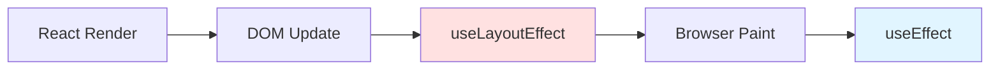
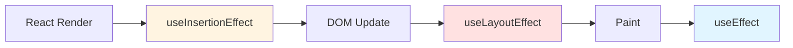
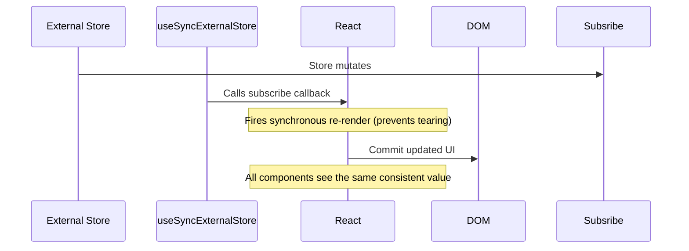
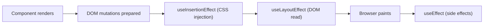
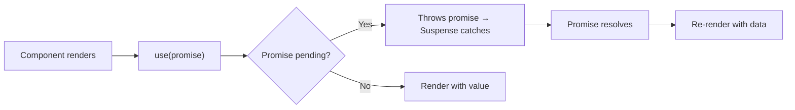
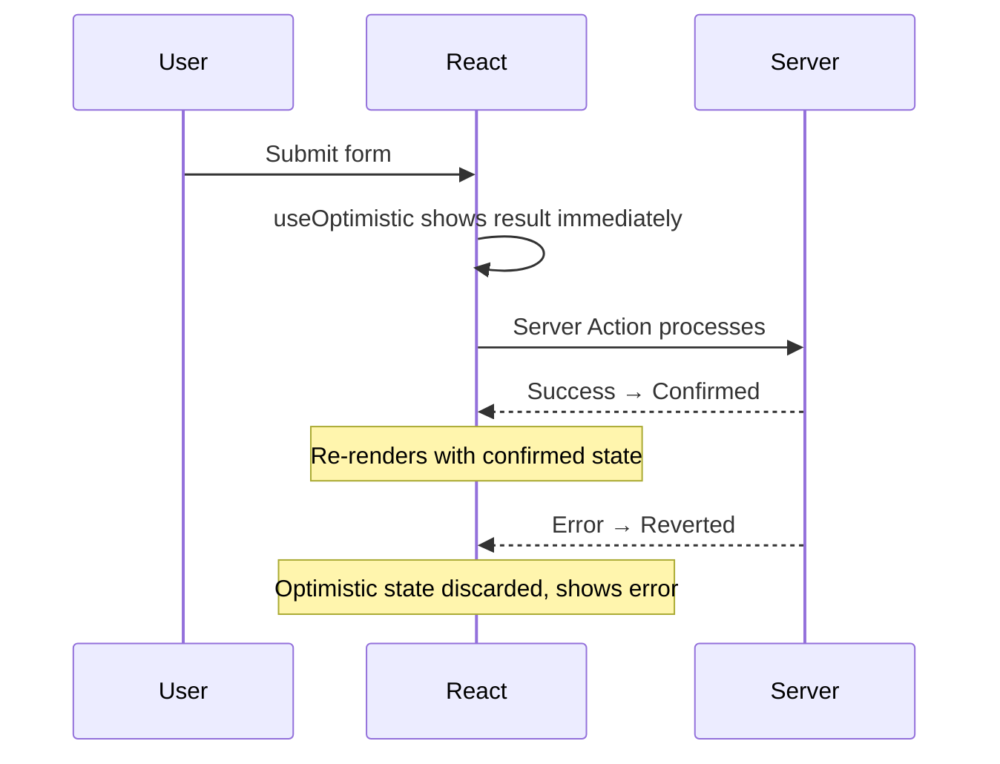

# Hooks: Complete Reference

> [!summary] Golden Rule
> Hooks are functions that let you "hook into" React features from function components. They must be called **unconditionally**, in the **same order**, at the **top level** of a component or custom hook.

## Table of Contents

- [Rules of Hooks](#rules-of-hooks)
- [State Hooks](#state-hooks)
- [Effect Hooks](#effect-hooks)
- [Context Hook](#context-hook)
- [Ref Hooks](#ref-hooks)
- [Memoization Hooks](#memoization-hooks)
- [React 18 Concurrent Hooks](#react-18-concurrent-hooks)
- [Other Hooks](#other-hooks)
- [Custom Hooks](#custom-hooks)
- [Hook Patterns](#hook-patterns)
- [Testing Hooks](#testing-hooks)
- [Best Practices](#best-practices)
- [Interview Questions](#interview-questions)

---

## Rules of Hooks

### The Two Rules

**Rule 1: Only call hooks at the top level**

```typescript
// ❌ BAD: Conditional hook call
function Bad({ condition }: { condition: boolean }) {
  if (condition) {
    const [state, setState] = useState(0); // Error!
  }
  return <div />;
}

// ❌ BAD: Hook in loop
function Bad({ items }: { items: Item[] }) {
  items.forEach(item => {
    const [state, setState] = useState(item.value); // Error!
  });
  return <div />;
}

// ✅ GOOD: Unconditional at top level
function Good({ condition }: { condition: boolean }) {
  const [state, setState] = useState(0);
  
  if (condition) {
    // Use state here
  }
  
  return <div />;
}
```

**Rule 2: Only call hooks from React functions**

```typescript
// ❌ BAD: Hook in regular function
function regularFunction() {
  const [state, setState] = useState(0); // Error!
  return state;
}

// ✅ GOOD: Hook in component
function Component() {
  const [state, setState] = useState(0);
  return <div>{state}</div>;
}

// ✅ GOOD: Hook in custom hook
function useCustomHook() {
  const [state, setState] = useState(0);
  return state;
}
```

### Why These Rules?

React relies on **call order** to match hooks across renders:

```typescript
function Component({ condition }: { condition: boolean }) {
  // First render: condition = true
  const [name, setName] = useState('Alice');     // Hook 1
  if (condition) {
    const [age, setAge] = useState(25);          // Hook 2
  }
  const [email, setEmail] = useState('');        // Hook 3
  
  // Second render: condition = false
  // React tries to match:
  // Hook 1: name ✅
  // Hook 2: email ❌ (expects age, gets email)
  // Hook 3: ??? ❌ (missing)
  // Result: State corruption!
}
```

### ESLint Plugin

```bash
npm install eslint-plugin-react-hooks --save-dev
```

```json
// .eslintrc.json
{
  "plugins": ["react-hooks"],
  "rules": {
    "react-hooks/rules-of-hooks": "error",
    "react-hooks/exhaustive-deps": "warn"
  }
}
```

---

## State Hooks

### useState

**Basic usage:**

```typescript
import { useState } from 'react';

function Counter() {
  const [count, setCount] = useState(0);
  //     ↑ state   ↑ setter  ↑ initial value
  
  return (
    <button onClick={() => setCount(count + 1)}>
      Count: {count}
    </button>
  );
}
```

**Functional updates:**

When next state depends on previous state, use functional form:

```typescript
function Counter() {
  const [count, setCount] = useState(0);
  
  // ❌ BAD: Using current value
  function handleClick() {
    setCount(count + 1);
    setCount(count + 1);
    // Result: count increases by 1 (not 2!)
  }
  
  // ✅ GOOD: Functional update
  function handleClick() {
    setCount(c => c + 1);
    setCount(c => c + 1);
    // Result: count increases by 2 ✅
  }
  
  return <button onClick={handleClick}>{count}</button>;
}
```

**Lazy initialization:**

For expensive initial state computation:

```typescript
// ❌ BAD: Runs every render
function Component() {
  const [state, setState] = useState(expensiveComputation());
  return <div />;
}

// ✅ GOOD: Runs only once
function Component() {
  const [state, setState] = useState(() => expensiveComputation());
  return <div />;
}

// Example
function TodoList() {
  const [todos, setTodos] = useState(() => {
    // Only runs on initial render
    const saved = localStorage.getItem('todos');
    return saved ? JSON.parse(saved) : [];
  });
  
  return <ul>...</ul>;
}
```

**Multiple state variables vs single object:**

```typescript
// Option 1: Multiple variables (recommended for independent state)
function Form() {
  const [name, setName] = useState('');
  const [email, setEmail] = useState('');
  const [age, setAge] = useState(0);
  
  // Easy to update individually
  setName('Alice');
}

// Option 2: Single object (for related state)
function Form() {
  const [form, setForm] = useState({
    name: '',
    email: '',
    age: 0
  });
  
  // Must spread to preserve other fields
  setForm(f => ({ ...f, name: 'Alice' }));
}
```

**TypeScript typing:**

```typescript
// Type inference (when initial value is known)
const [count, setCount] = useState(0); // number
const [name, setName] = useState(''); // string

// Explicit type (when initial value is null/undefined)
interface User {
  id: string;
  name: string;
}

const [user, setUser] = useState<User | null>(null);

// Union types
type Status = 'idle' | 'loading' | 'success' | 'error';
const [status, setStatus] = useState<Status>('idle');

// Array state
const [items, setItems] = useState<string[]>([]);
const [users, setUsers] = useState<User[]>([]);
```

---

### useReducer

For complex state logic or state machines.

**Basic usage:**

```typescript
import { useReducer } from 'react';

// 1. Define state and actions
type State = { count: number };
type Action = 
  | { type: 'increment' }
  | { type: 'decrement' }
  | { type: 'reset'; payload: number };

// 2. Define reducer
function reducer(state: State, action: Action): State {
  switch (action.type) {
    case 'increment':
      return { count: state.count + 1 };
    case 'decrement':
      return { count: state.count - 1 };
    case 'reset':
      return { count: action.payload };
    default:
      return state;
  }
}

// 3. Use reducer
function Counter() {
  const [state, dispatch] = useReducer(reducer, { count: 0 });
  
  return (
    <>
      <p>Count: {state.count}</p>
      <button onClick={() => dispatch({ type: 'increment' })}>+</button>
      <button onClick={() => dispatch({ type: 'decrement' })}>-</button>
      <button onClick={() => dispatch({ type: 'reset', payload: 0 })}>Reset</button>
    </>
  );
}
```

**When to use useReducer vs useState:**

| useState | useReducer |
|----------|------------|
| Simple state (primitive, single object) | Complex state (multiple sub-values) |
| Updates are independent | Updates have complex logic |
| Next state is simple function of current | State transitions follow patterns |
| Few update functions | Many update functions |

**Complex example - Form with validation:**

```typescript
interface FormState {
  values: {
    email: string;
    password: string;
  };
  errors: {
    email?: string;
    password?: string;
  };
  touched: {
    email: boolean;
    password: boolean;
  };
  isSubmitting: boolean;
}

type FormAction =
  | { type: 'SET_FIELD'; field: keyof FormState['values']; value: string }
  | { type: 'SET_ERROR'; field: keyof FormState['errors']; error?: string }
  | { type: 'SET_TOUCHED'; field: keyof FormState['touched'] }
  | { type: 'SUBMIT_START' }
  | { type: 'SUBMIT_SUCCESS' }
  | { type: 'SUBMIT_ERROR'; error: string }
  | { type: 'RESET' };

const initialState: FormState = {
  values: { email: '', password: '' },
  errors: {},
  touched: { email: false, password: false },
  isSubmitting: false
};

function formReducer(state: FormState, action: FormAction): FormState {
  switch (action.type) {
    case 'SET_FIELD':
      return {
        ...state,
        values: { ...state.values, [action.field]: action.value }
      };
    case 'SET_ERROR':
      return {
        ...state,
        errors: { ...state.errors, [action.field]: action.error }
      };
    case 'SET_TOUCHED':
      return {
        ...state,
        touched: { ...state.touched, [action.field]: true }
      };
    case 'SUBMIT_START':
      return { ...state, isSubmitting: true };
    case 'SUBMIT_SUCCESS':
      return initialState;
    case 'SUBMIT_ERROR':
      return {
        ...state,
        isSubmitting: false,
        errors: { ...state.errors, submit: action.error }
      };
    case 'RESET':
      return initialState;
    default:
      return state;
  }
}

function LoginForm() {
  const [state, dispatch] = useReducer(formReducer, initialState);
  
  const handleSubmit = async (e: FormEvent) => {
    e.preventDefault();
    dispatch({ type: 'SUBMIT_START' });
    
    try {
      await login(state.values);
      dispatch({ type: 'SUBMIT_SUCCESS' });
    } catch (err) {
      dispatch({ type: 'SUBMIT_ERROR', error: err.message });
    }
  };
  
  return (
    <form onSubmit={handleSubmit}>
      <input
        value={state.values.email}
        onChange={e => dispatch({ 
          type: 'SET_FIELD', 
          field: 'email', 
          value: e.target.value 
        })}
        onBlur={() => dispatch({ type: 'SET_TOUCHED', field: 'email' })}
      />
      {state.touched.email && state.errors.email && (
        <span>{state.errors.email}</span>
      )}
      
      {/* Similar for password */}
      
      <button disabled={state.isSubmitting}>
        {state.isSubmitting ? 'Logging in...' : 'Login'}
      </button>
    </form>
  );
}
```

**Dispatch is stable:**

```typescript
// dispatch never changes across renders
const [state, dispatch] = useReducer(reducer, initialState);

useEffect(() => {
  // Safe to use dispatch without adding to dependencies
  dispatch({ type: 'FETCH_START' });
  
  fetchData().then(data => {
    dispatch({ type: 'FETCH_SUCCESS', payload: data });
  });
}, []); // dispatch not in deps (it's stable)
```

---

## Effect Hooks

### useEffect

Synchronizes component with external systems (network, DOM, subscriptions).

**Basic usage:**

```typescript
import { useEffect } from 'react';

function Component() {
  useEffect(() => {
    // Effect runs after render
    console.log('Component rendered');
    
    // Cleanup (optional)
    return () => {
      console.log('Component will unmount or re-run effect');
    };
  }, []); // Dependency array
  
  return <div />;
}
```

**Dependency array rules:**

```typescript
// No deps: Runs after every render
useEffect(() => {
  console.log('Every render');
});

// Empty deps: Runs once on mount
useEffect(() => {
  console.log('Mount only');
  return () => console.log('Unmount');
}, []);

// With deps: Runs when deps change
useEffect(() => {
  console.log(`Count changed to ${count}`);
}, [count]);

// Multiple deps
useEffect(() => {
  console.log(`User ${userId} query ${query}`);
}, [userId, query]);
```

**Cleanup function:**

```typescript
// Cleanup subscriptions
function Chat({ roomId }: { roomId: string }) {
  useEffect(() => {
    const connection = connectToChat(roomId);
    
    return () => {
      connection.disconnect(); // Runs before next effect or unmount
    };
  }, [roomId]);
  
  return <div>Chat room {roomId}</div>;
}

// Cleanup timers
function Timer() {
  const [count, setCount] = useState(0);
  
  useEffect(() => {
    const id = setInterval(() => {
      setCount(c => c + 1);
    }, 1000);
    
    return () => clearInterval(id); // Clear on unmount
  }, []);
  
  return <div>{count}</div>;
}

// Cleanup event listeners
function WindowSize() {
  const [size, setSize] = useState({ width: 0, height: 0 });
  
  useEffect(() => {
    const handleResize = () => {
      setSize({ width: window.innerWidth, height: window.innerHeight });
    };
    
    window.addEventListener('resize', handleResize);
    handleResize(); // Initial size
    
    return () => window.removeEventListener('resize', handleResize);
  }, []);
  
  return <div>{size.width} x {size.height}</div>;
}
```

**Common patterns:**

**1. Data fetching:**

```typescript
function UserProfile({ userId }: { userId: string }) {
  const [user, setUser] = useState<User | null>(null);
  const [loading, setLoading] = useState(true);
  const [error, setError] = useState<Error | null>(null);
  
  useEffect(() => {
    let cancelled = false;
    
    setLoading(true);
    setError(null);
    
    fetchUser(userId)
      .then(data => {
        if (!cancelled) {
          setUser(data);
          setLoading(false);
        }
      })
      .catch(err => {
        if (!cancelled) {
          setError(err);
          setLoading(false);
        }
      });
    
    return () => {
      cancelled = true; // Prevent state updates after unmount
    };
  }, [userId]);
  
  if (loading) return <Spinner />;
  if (error) return <Error error={error} />;
  return <div>{user?.name}</div>;
}
```

**2. Subscriptions:**

```typescript
function LiveData({ source }: { source: string }) {
  const [data, setData] = useState<Data | null>(null);
  
  useEffect(() => {
    const subscription = subscribe(source, setData);
    
    return () => subscription.unsubscribe();
  }, [source]);
  
  return <div>{data?.value}</div>;
}
```

**3. DOM manipulation:**

```typescript
function AutoFocus() {
  const inputRef = useRef<HTMLInputElement>(null);
  
  useEffect(() => {
    inputRef.current?.focus();
  }, []); // Focus on mount
  
  return <input ref={inputRef} />;
}
```

**When NOT to use useEffect:**

```typescript
// ❌ BAD: Deriving state (compute during render instead)
function Bad({ items, filter }: Props) {
  const [filtered, setFiltered] = useState<Item[]>([]);
  
  useEffect(() => {
    setFiltered(items.filter(filter));
  }, [items, filter]);
  
  return <List items={filtered} />;
}

// ✅ GOOD: Compute during render
function Good({ items, filter }: Props) {
  const filtered = items.filter(filter);
  return <List items={filtered} />;
}

// ❌ BAD: Event handlers (call in event instead)
function Bad() {
  const [submitted, setSubmitted] = useState(false);
  
  useEffect(() => {
    if (submitted) {
      sendAnalytics();
    }
  }, [submitted]);
  
  return <button onClick={() => setSubmitted(true)}>Submit</button>;
}

// ✅ GOOD: Call in event handler
function Good() {
  const handleSubmit = () => {
    sendAnalytics();
  };
  
  return <button onClick={handleSubmit}>Submit</button>;
}
```

---

### useLayoutEffect

Identical to useEffect but fires **synchronously** after DOM mutations, **before browser paint**.

**Use cases:**

1. Measuring DOM elements
2. Preventing visual flicker
3. DOM mutations before paint

```typescript
import { useLayoutEffect } from 'react';

// Measuring DOM
function Tooltip() {
  const [height, setHeight] = useState(0);
  const ref = useRef<HTMLDivElement>(null);
  
  useLayoutEffect(() => {
    // Runs before paint, no flicker
    const rect = ref.current?.getBoundingClientRect();
    setHeight(rect?.height ?? 0);
  }, []);
  
  return (
    <div ref={ref} style={{ top: -height }}>
      Tooltip
    </div>
  );
}

// Preventing flicker
function Modal() {
  const modalRef = useRef<HTMLDivElement>(null);
  
  useLayoutEffect(() => {
    // Position modal before it's painted
    const { top, left } = calculatePosition();
    if (modalRef.current) {
      modalRef.current.style.top = `${top}px`;
      modalRef.current.style.left = `${left}px`;
    }
  }, []);
  
  return <div ref={modalRef}>Modal</div>;
}
```

**Timing comparison:**



**Default to useEffect:**

```typescript
// ✅ Start with useEffect
useEffect(() => {
  // Most effects go here
}, []);

// ⚠️ Only use useLayoutEffect if:
// - Measuring/mutating DOM before paint
// - Preventing visual flicker
// - Need synchronous execution
useLayoutEffect(() => {
  // Special cases only
}, []);
```

---

### useInsertionEffect

For CSS-in-JS libraries to inject styles **before any DOM reads**.

**Timing:**



**Example (CSS-in-JS):**

```typescript
import { useInsertionEffect } from 'react';

function useCSS(rule: string) {
  useInsertionEffect(() => {
    // Inject before any DOM reads
    const style = document.createElement('style');
    style.textContent = rule;
    document.head.appendChild(style);
    
    return () => {
      document.head.removeChild(style);
    };
  }, [rule]);
}

function Component() {
  useCSS('.my-class { color: red; }');
  return <div className="my-class">Styled</div>;
}
```

> [!warning]
> **Avoid in application code!** Only for CSS-in-JS libraries. Use useEffect or useLayoutEffect instead.

---

## Context Hook

### useContext

Reads context value from nearest provider.

**Basic usage:**

```typescript
import { createContext, useContext } from 'react';

// 1. Create context
interface ThemeContextValue {
  theme: 'light' | 'dark';
  toggleTheme: () => void;
}

const ThemeContext = createContext<ThemeContextValue | null>(null);

// 2. Provider
function App() {
  const [theme, setTheme] = useState<'light' | 'dark'>('light');
  
  const toggleTheme = () => {
    setTheme(t => t === 'light' ? 'dark' : 'light');
  };
  
  return (
    <ThemeContext.Provider value={{ theme, toggleTheme }}>
      <Page />
    </ThemeContext.Provider>
  );
}

// 3. Consumer
function Button() {
  const context = useContext(ThemeContext);
  
  if (!context) {
    throw new Error('Button must be used within ThemeProvider');
  }
  
  const { theme, toggleTheme } = context;
  
  return (
    <button 
      onClick={toggleTheme}
      className={theme === 'light' ? 'light-button' : 'dark-button'}
    >
      Toggle Theme
    </button>
  );
}
```

**Custom hook for context:**

```typescript
// Create custom hook
function useTheme() {
  const context = useContext(ThemeContext);
  
  if (!context) {
    throw new Error('useTheme must be used within ThemeProvider');
  }
  
  return context;
}

// Usage
function Button() {
  const { theme, toggleTheme } = useTheme(); // Cleaner!
  
  return <button onClick={toggleTheme}>{theme}</button>;
}
```

**Multiple contexts:**

```typescript
// Auth context
interface AuthContextValue {
  user: User | null;
  login: (email: string, password: string) => Promise<void>;
  logout: () => void;
}

const AuthContext = createContext<AuthContextValue | null>(null);

// Theme context
const ThemeContext = createContext<ThemeContextValue | null>(null);

// App
function App() {
  return (
    <AuthContext.Provider value={authValue}>
      <ThemeContext.Provider value={themeValue}>
        <Page />
      </ThemeContext.Provider>
    </AuthContext.Provider>
  );
}

// Component uses both
function Header() {
  const { user, logout } = useContext(AuthContext)!;
  const { theme } = useContext(ThemeContext)!;
  
  return (
    <header className={theme}>
      <span>{user?.name}</span>
      <button onClick={logout}>Logout</button>
    </header>
  );
}
```

**Context performance:**

Context value change triggers re-render of **all consumers**, even if they don't use the changed part.

```typescript
// ❌ BAD: Single context with all state
interface AppContextValue {
  user: User | null;
  theme: string;
  language: string;
  settings: Settings;
}

// Changing theme re-renders all consumers!

// ✅ GOOD: Split contexts
const UserContext = createContext<User | null>(null);
const ThemeContext = createContext<string>('light');
const LanguageContext = createContext<string>('en');

// Only components using theme re-render
```

**Optimize with useMemo:**

```typescript
function App() {
  const [user, setUser] = useState<User | null>(null);
  const [theme, setTheme] = useState('light');
  
  // ❌ BAD: New object every render
  return (
    <AppContext.Provider value={{ user, setUser, theme, setTheme }}>
      <Page />
    </AppContext.Provider>
  );
  
  // ✅ GOOD: Memoize value
  const value = useMemo(
    () => ({ user, setUser, theme, setTheme }),
    [user, theme]
  );
  
  return (
    <AppContext.Provider value={value}>
      <Page />
    </AppContext.Provider>
  );
}
```

---

## Ref Hooks

### useRef

Creates mutable ref object that persists across renders **without triggering re-renders**.

**Use cases:**

1. **DOM refs** (accessing DOM elements)
2. **Mutable values** (storing values that don't need to trigger re-renders)
3. **Previous values** (storing previous state/props)

**DOM refs:**

```typescript
import { useRef } from 'react';

function TextInput() {
  const inputRef = useRef<HTMLInputElement>(null);
  
  const focusInput = () => {
    inputRef.current?.focus();
  };
  
  return (
    <>
      <input ref={inputRef} />
      <button onClick={focusInput}>Focus</button>
    </>
  );
}

// Measuring DOM
function MeasureDiv() {
  const divRef = useRef<HTMLDivElement>(null);
  
  const measure = () => {
    const rect = divRef.current?.getBoundingClientRect();
    console.log('Width:', rect?.width);
  };
  
  return (
    <>
      <div ref={divRef}>Measure me</div>
      <button onClick={measure}>Measure</button>
    </>
  );
}
```

**Mutable values:**

```typescript
// Storing timer ID
function Timer() {
  const [count, setCount] = useState(0);
  const intervalRef = useRef<number | null>(null);
  
  const start = () => {
    if (intervalRef.current !== null) return; // Already running
    
    intervalRef.current = window.setInterval(() => {
      setCount(c => c + 1);
    }, 1000);
  };
  
  const stop = () => {
    if (intervalRef.current === null) return;
    
    window.clearInterval(intervalRef.current);
    intervalRef.current = null;
  };
  
  useEffect(() => {
    return () => {
      if (intervalRef.current !== null) {
        window.clearInterval(intervalRef.current);
      }
    };
  }, []);
  
  return (
    <div>
      <p>{count}</p>
      <button onClick={start}>Start</button>
      <button onClick={stop}>Stop</button>
    </div>
  );
}
```

**Previous value pattern:**

```typescript
function usePrevious<T>(value: T): T | undefined {
  const ref = useRef<T>();
  
  useEffect(() => {
    ref.current = value;
  });
  
  return ref.current;
}

// Usage
function Counter() {
  const [count, setCount] = useState(0);
  const prevCount = usePrevious(count);
  
  return (
    <div>
      <p>Current: {count}</p>
      <p>Previous: {prevCount}</p>
      <button onClick={() => setCount(c => c + 1)}>Increment</button>
    </div>
  );
}
```

**Avoiding stale closures:**

```typescript
function Chat({ roomId }: { roomId: string }) {
  const [message, setMessage] = useState('');
  
  // ❌ BAD: Stale message in interval
  useEffect(() => {
    const id = setInterval(() => {
      console.log(message); // Always logs initial message!
    }, 1000);
    return () => clearInterval(id);
  }, [roomId]); // message not in deps
  
  // ✅ GOOD: Use ref for latest value
  const messageRef = useRef(message);
  
  useEffect(() => {
    messageRef.current = message;
  });
  
  useEffect(() => {
    const id = setInterval(() => {
      console.log(messageRef.current); // Always latest!
    }, 1000);
    return () => clearInterval(id);
  }, [roomId]);
  
  return <input value={message} onChange={e => setMessage(e.target.value)} />;
}
```

---

### useImperativeHandle

Customizes ref value exposed to parent. Use with `forwardRef`.

```typescript
import { forwardRef, useImperativeHandle, useRef } from 'react';

// Define methods exposed to parent
interface InputRef {
  focus: () => void;
  clear: () => void;
}

interface InputProps {
  placeholder?: string;
}

const Input = forwardRef<InputRef, InputProps>((props, ref) => {
  const inputRef = useRef<HTMLInputElement>(null);
  
  // Expose custom methods, not DOM element
  useImperativeHandle(ref, () => ({
    focus: () => {
      inputRef.current?.focus();
    },
    clear: () => {
      if (inputRef.current) {
        inputRef.current.value = '';
      }
    }
  }));
  
  return <input ref={inputRef} {...props} />;
});

// Parent
function Form() {
  const inputRef = useRef<InputRef>(null);
  
  return (
    <>
      <Input ref={inputRef} />
      <button onClick={() => inputRef.current?.focus()}>Focus</button>
      <button onClick={() => inputRef.current?.clear()}>Clear</button>
    </>
  );
}
```

**Why use it:**

- Encapsulation (parent doesn't access full DOM element)
- Simplified API (expose only needed methods)
- Abstraction (implementation can change without breaking parent)

---

## Memoization Hooks

### useMemo

Memoizes **computed value** to avoid expensive recalculations.

```typescript
import { useMemo } from 'react';

function ExpensiveComponent({ items, filter }: Props) {
  // ❌ Without memo: Recomputes every render
  const filtered = items.filter(item => item.name.includes(filter));
  
  // ✅ With memo: Only recomputes when items or filter changes
  const filtered = useMemo(
    () => items.filter(item => item.name.includes(filter)),
    [items, filter]
  );
  
  return <List items={filtered} />;
}
```

**When to use:**

```typescript
// ✅ Use for expensive computations
const sortedItems = useMemo(
  () => [...items].sort((a, b) => complexSort(a, b)),
  [items]
);

// ✅ Use for referential equality (passing to memoized child)
const config = useMemo(() => ({ theme: 'dark', locale: 'en' }), []);

return <MemoizedChild config={config} />;

// ❌ Don't use for cheap computations
const fullName = useMemo(() => `${first} ${last}`, [first, last]); // Overkill!
const fullName = `${first} ${last}`; // Just compute it
```

---

### useCallback

Memoizes **function reference** to avoid creating new functions every render.

```typescript
import { useCallback } from 'react';

function Parent() {
  const [count, setCount] = useState(0);
  const [text, setText] = useState('');
  
  // ❌ Without callback: New function every render
  const handleClick = () => {
    console.log(count);
  };
  
  // ✅ With callback: Stable function reference
  const handleClick = useCallback(() => {
    console.log(count);
  }, [count]); // Recreate when count changes
  
  return (
    <>
      <input value={text} onChange={e => setText(e.target.value)} />
      <MemoizedChild onClick={handleClick} />
    </>
  );
}
```

**Equivalence:**

```typescript
useCallback(fn, deps) === useMemo(() => fn, deps)
```

**When to use:**

```typescript
// ✅ Passing to memoized child
const handleClick = useCallback(() => {/* ... */}, []);
return <MemoizedChild onClick={handleClick} />;

// ✅ Dependency of useEffect/useMemo/useCallback
const fetchData = useCallback(() => {
  return fetch(`/api/${userId}`);
}, [userId]);

useEffect(() => {
  fetchData().then(setData);
}, [fetchData]);

// ❌ Don't use for event handlers in non-memoized children
const handleClick = useCallback(() => {/* ... */}, []); // Unnecessary
return <button onClick={handleClick}>Click</button>; // button not memoized
```

---

## React 18 Concurrent Hooks

### useTransition

Marks state updates as **non-urgent** (low priority), keeping UI responsive.

```typescript
import { useTransition, useState } from 'react';

function SearchResults() {
  const [query, setQuery] = useState('');
  const [results, setResults] = useState<Result[]>([]);
  const [isPending, startTransition] = useTransition();
  
  const handleChange = (e: ChangeEvent<HTMLInputElement>) => {
    const value = e.target.value;
    
    // Urgent: Update input immediately
    setQuery(value);
    
    // Non-urgent: Filter large list (doesn't block input)
    startTransition(() => {
      const filtered = filterLargeList(value);
      setResults(filtered);
    });
  };
  
  return (
    <>
      <input value={query} onChange={handleChange} />
      {isPending && <Spinner />}
      <Results items={results} />
    </>
  );
}
```

**Before vs After:**

```typescript
// ❌ Before: Blocks UI
function Search() {
  const [query, setQuery] = useState('');
  
  const handleChange = (e) => {
    const value = e.target.value;
    setQuery(value); // Blocks until expensive computation done
  };
  
  const results = filterHugeList(query); // Expensive!
  
  return (
    <>
      <input value={query} onChange={handleChange} /> {/* Laggy input! */}
      <Results items={results} />
    </>
  );
}

// ✅ After: Non-blocking
function Search() {
  const [query, setQuery] = useState('');
  const [deferredQuery, setDeferredQuery] = useState('');
  const [isPending, startTransition] = useTransition();
  
  const handleChange = (e) => {
    setQuery(e.target.value); // Immediate
    startTransition(() => {
      setDeferredQuery(e.target.value); // Non-blocking
    });
  };
  
  const results = filterHugeList(deferredQuery);
  
  return (
    <>
      <input value={query} onChange={handleChange} /> {/* Smooth! */}
      <Results items={results} isPending={isPending} />
    </>
  );
}
```

---

### useDeferredValue

Defers updating a value to keep UI responsive. Like debouncing without setTimeout.

```typescript
import { useDeferredValue, useState } from 'react';

function Search() {
  const [query, setQuery] = useState('');
  const deferredQuery = useDeferredValue(query);
  
  // query updates immediately (input stays responsive)
  // deferredQuery updates after urgent renders
  const results = filterHugeList(deferredQuery);
  
  return (
    <>
      <input value={query} onChange={e => setQuery(e.target.value)} />
      <Results items={results} />
    </>
  );
}
```

**useTransition vs useDeferredValue:**

| useTransition | useDeferredValue |
|---------------|------------------|
| Control when state updates | Control when value is used |
| Wrap state setter | Wrap value |
| Get isPending flag | No pending flag |
| More control | Simpler API |

**Example with pending UI:**

```typescript
function Search() {
  const [query, setQuery] = useState('');
  const deferredQuery = useDeferredValue(query);
  const isStale = query !== deferredQuery;
  
  const results = filterHugeList(deferredQuery);
  
  return (
    <>
      <input value={query} onChange={e => setQuery(e.target.value)} />
      <div style={{ opacity: isStale ? 0.5 : 1 }}>
        <Results items={results} />
      </div>
    </>
  );
}
```

---

## Other Hooks

### useId

Generates unique stable IDs for accessibility.

```typescript
import { useId } from 'react';

function Form() {
  const id = useId(); // e.g., ":r1:"
  
  return (
    <>
      <label htmlFor={id}>Name:</label>
      <input id={id} />
    </>
  );
}

// Multiple IDs
function MultiForm() {
  const id = useId();
  
  return (
    <>
      <label htmlFor={`${id}-name`}>Name:</label>
      <input id={`${id}-name`} />
      
      <label htmlFor={`${id}-email`}>Email:</label>
      <input id={`${id}-email`} />
    </>
  );
}
```

**Why not Math.random():**

- SSR mismatch (server and client generate different IDs)
- Hydration errors
- Not stable across renders

**useId is:**

- Stable across renders
- Unique within the tree
- SSR-safe (same ID on server and client)

---

### useSyncExternalStore

Subscribes to an external store (not React state) and returns its value. Ensures UI consistency during concurrent rendering — prevents "tearing" (showing inconsistent values from different renders).

```typescript
import { useSyncExternalStore } from 'react';

// Example: subscribe to browser's online/offline status
function useOnlineStatus(): boolean {
  const isOnline = useSyncExternalStore(
    subscribe,     // subscription function
    getSnapshot,   // returns current value (client)
    getServerSnapshot, // returns initial value (SSR — optional)
  );
  return isOnline;
}

function subscribe(callback: () => void): () => void {
  window.addEventListener('online', callback);
  window.addEventListener('offline', callback);
  return () => {
    window.removeEventListener('online', callback);
    window.removeEventListener('offline', callback);
  };
}

function getSnapshot(): boolean {
  return navigator.onLine;
}

function getServerSnapshot(): boolean {
  return true; // Assume online for SSR
}
```

**When to use:**
- Third-party state managers (Redux stores outside React)
- Browser APIs that change over time (online status, window dimensions, media queries, CSS custom properties)
- Legacy data layers that aren't React-aware

**How it works:**



**useSyncExternalStore vs useState vs useReducer:**

| Aspect | `useState`/`useReducer` | `useSyncExternalStore` |
|--------|------------------------|------------------------|
| **State source** | React internal | External store |
| **Concurrent-safe** | ✅ Yes (built-in) | ✅ Yes (subscription guarantees) |
| **SSR support** | ✅ Yes | ✅ Requires `getServerSnapshot` |
| **When to use** | Component-local state | Browser APIs, non-Redux stores, legacy state |

---

### useInsertionEffect

Intended for CSS-in-JS libraries to inject styles **before** React makes DOM mutations. Runs synchronously before `useLayoutEffect` and `useEffect`.

```typescript
import { useInsertionEffect } from 'react';

// ❌ DON'T use this in app code — it's for library authors
// ✅ CSS-in-JS libraries use it to inject styles before paint
function useCSSRule(rule: string) {
  useInsertionEffect(() => {
    const style = document.createElement('style');
    style.textContent = rule;
    document.head.appendChild(style);
    return () => style.remove();
  }, [rule]);
}
```



**useInsertionEffect vs useLayoutEffect vs useEffect:**

| Aspect | `useInsertionEffect` | `useLayoutEffect` | `useEffect` |
|--------|---------------------|-------------------|-------------|
| **Timing** | Before DOM mutation | After DOM mutation, before paint | After paint |
| **DOM access** | ❌ No | ✅ Yes | ✅ Yes |
| **Ref access** | ❌ No | ✅ Yes | ✅ Yes |
| **State updates** | ❌ No | ✅ Yes (but avoid) | ✅ Yes |
| **Who uses it** | CSS-in-JS libraries | App code (rare) | App code (common) |
| **Use case** | Inject `@font-face`, keyframes | Measure layout, fix flash | Data fetching, subscriptions |

Labels custom hooks in React DevTools.

```typescript
import { useDebugValue } from 'react';

function useOnlineStatus() {
  const [isOnline, setIsOnline] = useState(true);
  
  useDebugValue(isOnline ? 'Online' : 'Offline');
  
  useEffect(() => {
    // Subscribe to online/offline events
  }, []);
  
  return isOnline;
}

// React DevTools shows: "OnlineStatus: Online"
```

**With formatter (for expensive values):**

```typescript
function useUser(userId: string) {
  const [user, setUser] = useState<User | null>(null);
  
  useDebugValue(user, user => 
    user ? `User: ${user.name}` : 'No user'
  ); // Formatter only called when DevTools open
  
  return user;
}
```

---

## React 19 Preview Features

React 19 introduces several new hooks and patterns. These are available in the React 19 RC (Release Candidate) and are expected to be stable soon.

> [!warning] React 19 APIs may change before final release. These examples reflect the RC specification.

### `use()` — Read Promises in Render

`use()` reads a promise or context directly during render — no `useEffect`, no `useState`. The component suspends until the promise resolves:

```typescript
import { use } from 'react';

function UserProfile({ userId }: { userId: string }) {
  const user = use(fetchUser(userId));
  // Component suspends until fetchUser resolves
  return <div>{user.name}</div>;
}

// Works with context too:
function ThemeButton() {
  const theme = use(ThemeContext);
  return <button className={theme}>Click</button>;
}
```



**Key differences from `useEffect` fetching:**
- No loading state to manage — `<Suspense>` handles it
- No `useEffect` cleanup needed
- Works in Server Components and Client Components
- Integrates with `startTransition` for pending states

### `useFormStatus()` — Form Submission State

Returns the status of the parent `<form>` — no more prop drilling for submitting state:

```typescript
import { useFormStatus } from 'react-dom';

function SubmitButton() {
  const { pending, data, action } = useFormStatus();
  // pending: true while the form action is running
  // data: FormData being submitted (before action completes)
  
  return (
    <button type="submit" disabled={pending}>
      {pending ? 'Saving...' : 'Save'}
    </button>
  );
}

function MyForm() {
  return (
    <form action={submitAction}>
      <input name="email" type="email" />
      <SubmitButton />  {/* No isSubmitting prop needed! */}
    </form>
  );
}
```

### `useOptimistic()` — Instant UI Feedback

Shows the expected result immediately while the server processes the change, then confirms or reverts:

```typescript
import { useOptimistic, useRef } from 'react';
import { useFormStatus } from 'react-dom';

function MessageList({ messages, sendMessage }: {
  messages: Message[];
  sendMessage: (formData: FormData) => Promise<void>;
}) {
  const [optimisticMessages, addOptimisticMessage] = useOptimistic(
    messages,  // current state
    (state, newMessage: Message) => [...state, newMessage],  // merge function
  );

  async function formAction(formData: FormData) {
    const newMessage = {
      id: crypto.randomUUID(),
      text: formData.get('text') as string,
      sending: true,
    };
    addOptimisticMessage(newMessage);  // Show immediately
    await sendMessage(formData);        // Server processes
    // If sendMessage rejects, optimistic state reverts
  }

  return (
    <form action={formAction}>
      <input name="text" required />
      <SubmitButton />
      <ul>
        {optimisticMessages.map(msg => (
          <li key={msg.id} className={msg.sending ? 'opacity-50' : ''}>
            {msg.text}
          </li>
        ))}
      </ul>
    </form>
  );
}
```



### `<form action>` — Server Actions

Forms in React 19 can call Server Actions directly — no API route, no JavaScript needed for basic forms:

```typescript
async function submitAction(formData: FormData) {
  'use server';  // Runs on the server
  const email = formData.get('email');
  await db.users.create({ email });
  revalidatePath('/users');  // Refresh the page data
}

function SignupForm() {
  return (
    <form action={submitAction}>
      <input name="email" type="email" required />
      <button type="submit">Sign Up</button>
    </form>
  );
}
```

| Pattern | Before React 19 | React 19 |
|---------|-----------------|----------|
| **Form submission** | `onSubmit` handler, `fetch`, loading state | `<form action={serverAction}>` |
| **Submit button loading** | Prop drilling `isSubmitting` | `useFormStatus()` |
| **Optimistic UI** | Complex state management with rollback | `useOptimistic()` |
| **Data fetching** | `useEffect` + `useState` | `use(promise)` + `<Suspense>` |
| **Server rendering** | `getServerSideProps` (Pages Router) | Server Components + Server Actions |

---

## Custom Hooks

Custom hooks let you extract and reuse stateful logic.

### Naming Convention

Always start with `use` (enforced by linter):

```typescript
// ✅ Custom hooks
function useWindowSize() { }
function useFetch() { }
function useLocalStorage() { }

// ❌ Not hooks (can't call hooks inside)
function getWindowSize() { }
function createFetcher() { }
```

### Example 1: useLocalStorage

```typescript
function useLocalStorage<T>(key: string, initialValue: T) {
  // State to store value
  const [storedValue, setStoredValue] = useState<T>(() => {
    try {
      const item = window.localStorage.getItem(key);
      return item ? JSON.parse(item) : initialValue;
    } catch (error) {
      console.error(error);
      return initialValue;
    }
  });
  
  // Return wrapped version of useState's setter
  const setValue = (value: T | ((val: T) => T)) => {
    try {
      const valueToStore = value instanceof Function ? value(storedValue) : value;
      setStoredValue(valueToStore);
      window.localStorage.setItem(key, JSON.stringify(valueToStore));
    } catch (error) {
      console.error(error);
    }
  };
  
  return [storedValue, setValue] as const;
}

// Usage
function Component() {
  const [name, setName] = useLocalStorage('name', 'Alice');
  
  return (
    <input value={name} onChange={e => setName(e.target.value)} />
  );
}
```

### Example 2: useFetch

```typescript
interface UseFetchResult<T> {
  data: T | null;
  loading: boolean;
  error: Error | null;
  refetch: () => void;
}

function useFetch<T>(url: string): UseFetchResult<T> {
  const [data, setData] = useState<T | null>(null);
  const [loading, setLoading] = useState(true);
  const [error, setError] = useState<Error | null>(null);
  const [refetchIndex, setRefetchIndex] = useState(0);
  
  const refetch = useCallback(() => {
    setRefetchIndex(i => i + 1);
  }, []);
  
  useEffect(() => {
    let cancelled = false;
    
    setLoading(true);
    setError(null);
    
    fetch(url)
      .then(res => {
        if (!res.ok) throw new Error(`HTTP ${res.status}`);
        return res.json();
      })
      .then(data => {
        if (!cancelled) {
          setData(data);
          setLoading(false);
        }
      })
      .catch(err => {
        if (!cancelled) {
          setError(err);
          setLoading(false);
        }
      });
    
    return () => {
      cancelled = true;
    };
  }, [url, refetchIndex]);
  
  return { data, loading, error, refetch };
}

// Usage
function UserProfile({ userId }: { userId: string }) {
  const { data: user, loading, error, refetch } = useFetch<User>(
    `/api/users/${userId}`
  );
  
  if (loading) return <Spinner />;
  if (error) return <Error error={error} onRetry={refetch} />;
  
  return <div>{user?.name}</div>;
}
```

### Example 3: useDebounce

```typescript
function useDebounce<T>(value: T, delay: number): T {
  const [debouncedValue, setDebouncedValue] = useState(value);
  
  useEffect(() => {
    const handler = setTimeout(() => {
      setDebouncedValue(value);
    }, delay);
    
    return () => {
      clearTimeout(handler);
    };
  }, [value, delay]);
  
  return debouncedValue;
}

// Usage
function SearchInput() {
  const [query, setQuery] = useState('');
  const debouncedQuery = useDebounce(query, 500);
  
  useEffect(() => {
    if (debouncedQuery) {
      // Only searches 500ms after user stops typing
      searchAPI(debouncedQuery);
    }
  }, [debouncedQuery]);
  
  return <input value={query} onChange={e => setQuery(e.target.value)} />;
}
```

### Example 4: useMediaQuery

```typescript
function useMediaQuery(query: string): boolean {
  const [matches, setMatches] = useState(false);
  
  useEffect(() => {
    const media = window.matchMedia(query);
    
    if (media.matches !== matches) {
      setMatches(media.matches);
    }
    
    const listener = () => setMatches(media.matches);
    media.addEventListener('change', listener);
    
    return () => media.removeEventListener('change', listener);
  }, [query, matches]);
  
  return matches;
}

// Usage
function ResponsiveComponent() {
  const isMobile = useMediaQuery('(max-width: 768px)');
  
  return isMobile ? <MobileView /> : <DesktopView />;
}
```

### Example 5: useInterval

```typescript
function useInterval(callback: () => void, delay: number | null) {
  const savedCallback = useRef(callback);
  
  // Remember latest callback
  useEffect(() => {
    savedCallback.current = callback;
  }, [callback]);
  
  // Set up interval
  useEffect(() => {
    if (delay === null) return;
    
    const id = setInterval(() => savedCallback.current(), delay);
    
    return () => clearInterval(id);
  }, [delay]);
}

// Usage
function Timer() {
  const [count, setCount] = useState(0);
  const [delay, setDelay] = useState(1000);
  
  useInterval(() => {
    setCount(c => c + 1);
  }, delay);
  
  return (
    <div>
      <p>Count: {count}</p>
      <button onClick={() => setDelay(delay === 1000 ? 100 : 1000)}>
        Toggle Speed
      </button>
    </div>
  );
}
```

---

## Testing Hooks

### renderHook from @testing-library/react

```typescript
import { renderHook, act } from '@testing-library/react';

// Test useState
test('useCounter increments', () => {
  function useCounter() {
    const [count, setCount] = useState(0);
    const increment = () => setCount(c => c + 1);
    return { count, increment };
  }
  
  const { result } = renderHook(() => useCounter());
  
  expect(result.current.count).toBe(0);
  
  act(() => {
    result.current.increment();
  });
  
  expect(result.current.count).toBe(1);
});

// Test with props
test('useFetch fetches data', async () => {
  const { result, rerender } = renderHook(
    ({ url }) => useFetch(url),
    { initialProps: { url: '/api/users/1' } }
  );
  
  expect(result.current.loading).toBe(true);
  
  await waitFor(() => {
    expect(result.current.loading).toBe(false);
  });
  
  expect(result.current.data).toEqual({ id: 1, name: 'Alice' });
  
  // Change props
  rerender({ url: '/api/users/2' });
  
  await waitFor(() => {
    expect(result.current.data).toEqual({ id: 2, name: 'Bob' });
  });
});
```

---

## Best Practices

### 1. Co-locate State

Put state as close as possible to where it's used:

```typescript
// ❌ BAD: State too high
function App() {
  const [modalOpen, setModalOpen] = useState(false);
  const [formData, setFormData] = useState({});
  
  return (
    <div>
      <Header />
      <Sidebar />
      <Content modalOpen={modalOpen} setModalOpen={setModalOpen} formData={formData} />
    </div>
  );
}

// ✅ GOOD: State where needed
function App() {
  return (
    <div>
      <Header />
      <Sidebar />
      <Content />
    </div>
  );
}

function Content() {
  const [modalOpen, setModalOpen] = useState(false);
  const [formData, setFormData] = useState({});
  
  return <div>{/* Use state here */}</div>;
}
```

### 2. Extract to Custom Hooks

```typescript
// ❌ Complex component
function UserProfile({ userId }: { userId: string }) {
  const [user, setUser] = useState(null);
  const [posts, setPosts] = useState([]);
  const [loading, setLoading] = useState(true);
  
  useEffect(() => {
    // Fetch user...
  }, [userId]);
  
  useEffect(() => {
    // Fetch posts...
  }, [userId]);
  
  // ...
}

// ✅ Extract to hooks
function UserProfile({ userId }: { userId: string }) {
  const { user, loading: userLoading } = useUser(userId);
  const { posts, loading: postsLoading } = useUserPosts(userId);
  
  // ...
}
```

### 3. Don't Optimize Prematurely

```typescript
// ❌ Over-optimization
function Component({ items, filter }) {
  const filtered = useMemo(() => items.filter(filter), [items, filter]);
  const handleClick = useCallback(() => {/* ... */}, []);
  const value = useMemo(() => compute(), []);
  
  // ...
}

// ✅ Optimize when needed (profiling shows issue)
function Component({ items, filter }) {
  const filtered = items.filter(filter); // Just compute it
  const handleClick = () => {/* ... */}; // Just create it
  const value = compute(); // Just compute it
  
  // ...
}
```

---

## Interview Questions

### Q1: Explain the Rules of Hooks and why they exist.

**Answer:**

**Two rules:**

1. Only call hooks at the top level (not in loops, conditions, nested functions)
2. Only call hooks from React functions (components or custom hooks)

**Why:**

React relies on **call order** to preserve state between renders. React maintains an internal array of state values and matches them by position.

```typescript
// First render:
useState('Alice');  // State 0
useState(25);       // State 1

// Second render:
useState('Alice');  // Matches State 0 ✅
useState(25);       // Matches State 1 ✅

// With conditional:
// First render: condition = true
useState('Alice');  // State 0
if (condition) {
  useState(25);     // State 1
}
useState('');       // State 2

// Second render: condition = false
useState('Alice');  // State 0 ✅
useState('');       // State 1 ❌ (expects 25, gets '')
                    // State 2 missing ❌
```

Breaking the rules corrupts state.

### Q2: What's the difference between useEffect and useLayoutEffect?

**Answer:**

**Timing:**

| useEffect | useLayoutEffect |
|-----------|-----------------|
| After browser paint | Before browser paint |
| Asynchronous | Synchronous |
| Most effects | Measuring/mutating DOM |

**Execution order:**

```
1. React renders
2. DOM updated
3. useLayoutEffect runs (synchronous)
4. Browser paints
5. useEffect runs (asynchronous)
```

**When to use useLayoutEffect:**

- Measuring DOM elements
- Preventing visual flicker
- Synchronous DOM mutations

```typescript
// useEffect: May flicker
useEffect(() => {
  const height = divRef.current.offsetHeight;
  setTooltipPosition(-height); // Flickers (paint → measure → update → repaint)
}, []);

// useLayoutEffect: No flicker
useLayoutEffect(() => {
  const height = divRef.current.offsetHeight;
  setTooltipPosition(-height); // Smooth (measure → update → paint once)
}, []);
```

**Default to useEffect** (useLayoutEffect blocks paint).

### Q3: When should you use useReducer instead of useState?

**Answer:**

**Use useState when:**

- Simple state (primitive or single object)
- Independent updates
- Few update functions

**Use useReducer when:**

- Complex state (multiple sub-values)
- State transitions have patterns/logic
- Many update functions
- State machine-like behavior
- Next state depends on previous in complex ways

**Example:**

```typescript
// useState: Simple
const [count, setCount] = useState(0);

// useReducer: Complex state with patterns
type State = {
  data: Data | null;
  loading: boolean;
  error: Error | null;
};

type Action =
  | { type: 'FETCH_START' }
  | { type: 'FETCH_SUCCESS'; payload: Data }
  | { type: 'FETCH_ERROR'; error: Error };

function reducer(state: State, action: Action): State {
  switch (action.type) {
    case 'FETCH_START':
      return { ...state, loading: true, error: null };
    case 'FETCH_SUCCESS':
      return { data: action.payload, loading: false, error: null };
    case 'FETCH_ERROR':
      return { ...state, loading: false, error: action.error };
  }
}
```

### Q4: Explain useCallback and when to use it.

**Answer:**

**useCallback** memoizes a function to preserve reference equality.

```typescript
const memoizedFn = useCallback(() => {
  doSomething(a, b);
}, [a, b]);
```

**When to use:**

1. **Passing to memoized child:**
```typescript
const handleClick = useCallback(() => {/* ... */}, []);
return <MemoChild onClick={handleClick} />; // Stable reference
```

2. **Dependency of other hooks:**
```typescript
const fetchData = useCallback(() => fetch(url), [url]);

useEffect(() => {
  fetchData().then(setData);
}, [fetchData]); // Stable reference
```

**When NOT to use:**

```typescript
// ❌ Unnecessary (child not memoized)
const handleClick = useCallback(() => {/* ... */}, []);
return <button onClick={handleClick}>Click</button>;

// ✅ Just create it
const handleClick = () => {/* ... */};
return <button onClick={handleClick}>Click</button>;
```

**Cost-benefit:**

- Has overhead (memory, comparison)
- Only helps if it prevents expensive work
- Profile before optimizing

### Q5: How do useTransition and useDeferredValue differ?

**Answer:**

**useTransition:**

- Marks **state updates** as non-urgent
- You control **when** to defer
- Returns `isPending` flag
- Wrap setState calls

```typescript
const [isPending, startTransition] = useTransition();

startTransition(() => {
  setState(newValue); // Non-urgent
});
```

**useDeferredValue:**

- Defers **using a value**
- React controls **when** to defer
- No pending flag (compare values)
- Wrap value

```typescript
const deferredValue = useDeferredValue(value);
const isPending = value !== deferredValue;
```

**When to use:**

- **useTransition**: You control state updates
- **useDeferredValue**: You receive props/values

**Example:**

```typescript
// useTransition: Control setState
function Parent() {
  const [query, setQuery] = useState('');
  const [isPending, startTransition] = useTransition();
  
  const handleChange = (e) => {
    startTransition(() => setQuery(e.target.value));
  };
  
  return <input onChange={handleChange} />;
}

// useDeferredValue: Receive prop
function Child({ query }: { query: string }) {
  const deferredQuery = useDeferredValue(query);
  const results = filterLargeList(deferredQuery);
  
  return <Results items={results} />;
}
```

### Q6: What are refs and when should you use them?

**Answer:**

**Refs** are mutable values that:
- Persist across renders
- Don't trigger re-renders when changed
- Store references to DOM elements or values

**Use cases:**

1. **DOM access:**
```typescript
const inputRef = useRef<HTMLInputElement>(null);
inputRef.current?.focus();
```

2. **Mutable values (no re-render):**
```typescript
const timerRef = useRef<number | null>(null);
timerRef.current = setTimeout(() => {}, 1000);
```

3. **Previous values:**
```typescript
const prevCountRef = useRef<number>();
useEffect(() => { prevCountRef.current = count; });
```

4. **Avoiding stale closures:**
```typescript
const latestValue = useRef(value);
useEffect(() => { latestValue.current = value; });
```

**When NOT to use:**

- State that should trigger re-renders (use useState)
- Computed values (derive during render)
- Event handlers (just create functions)

**Key difference from state:**

```typescript
// State: Triggers re-render
const [count, setCount] = useState(0);
setCount(1); // Re-renders component

// Ref: No re-render
const countRef = useRef(0);
countRef.current = 1; // No re-render
```

### Q7: How do you test custom hooks?

**Answer:**

Use **@testing-library/react**'s `renderHook` and `act`:

```typescript
import { renderHook, act, waitFor } from '@testing-library/react';

// Hook to test
function useCounter(initial = 0) {
  const [count, setCount] = useState(initial);
  const increment = () => setCount(c => c + 1);
  const decrement = () => setCount(c => c - 1);
  return { count, increment, decrement };
}

// Test
test('useCounter', () => {
  const { result } = renderHook(() => useCounter(10));
  
  // Initial value
  expect(result.current.count).toBe(10);
  
  // Increment
  act(() => {
    result.current.increment();
  });
  expect(result.current.count).toBe(11);
  
  // Decrement
  act(() => {
    result.current.decrement();
  });
  expect(result.current.count).toBe(10);
});

// With props
test('useFetch', async () => {
  const { result, rerender } = renderHook(
    ({ url }) => useFetch(url),
    { initialProps: { url: '/api/users/1' } }
  );
  
  expect(result.current.loading).toBe(true);
  
  await waitFor(() => {
    expect(result.current.loading).toBe(false);
  });
  
  expect(result.current.data).toBeDefined();
  
  // Update props
  rerender({ url: '/api/users/2' });
  
  await waitFor(() => {
    expect(result.current.data?.id).toBe(2);
  });
});
```

**Key points:**

- Use `act` for state updates
- Use `waitFor` for async operations
- Use `rerender` to test prop changes
- Test cleanup with `unmount`

### Q8: Explain the exhaustive-deps rule and how to handle it.

**Answer:**

**exhaustive-deps** rule: All values from component scope used in effect should be in dependency array.

**Why:**

Prevent stale closures and ensure effect runs when dependencies change.

**Scenarios:**

**1. Add to deps:**
```typescript
useEffect(() => {
  console.log(count); // Uses count
}, [count]); // Include count
```

**2. Move inside effect:**
```typescript
// ❌ Bad
const getMessage = () => `Count: ${count}`;
useEffect(() => {
  console.log(getMessage());
}, []); // Missing getMessage, count

// ✅ Good
useEffect(() => {
  const getMessage = () => `Count: ${count}`;
  console.log(getMessage());
}, [count]);
```

**3. Memoize (if needed):**
```typescript
const fetchData = useCallback(() => {
  return fetch(`/api/${userId}`);
}, [userId]);

useEffect(() => {
  fetchData().then(setData);
}, [fetchData]); // fetchData stable
```

**4. Extract primitive:**
```typescript
// ❌ Bad: Object in deps
const config = { theme: 'dark' };
useEffect(() => {
  apply(config);
}, [config]); // New object every render

// ✅ Good: Primitive in deps
const theme = 'dark';
useEffect(() => {
  apply({ theme });
}, [theme]);
```

**5. Use ref (escape hatch):**
```typescript
const configRef = useRef(config);
useEffect(() => { configRef.current = config; });

useEffect(() => {
  apply(configRef.current);
}, []); // Only when truly needed
```

---

## Cross-Links

- **Mental Model**: [[React/01_Foundations/01_React_Mental_Model_and_Rendering]]
- **Pitfalls**: [[React/01_Foundations/03_State_and_Effects_Common_Pitfalls]]
- **Testing**: [[React/03_Advanced/01_Testing_React_TL_and_MSW]]
- **Performance**: [[React/03_Advanced/02_Performance_and_Profiling]]

---

## References

- [React Docs: Hooks API Reference](https://react.dev/reference/react)
- [React Docs: Rules of Hooks](https://react.dev/warnings/invalid-hook-call-warning)
- [useHooks.com](https://usehooks.com/)
- [React Hook Form](https://react-hook-form.com/)
