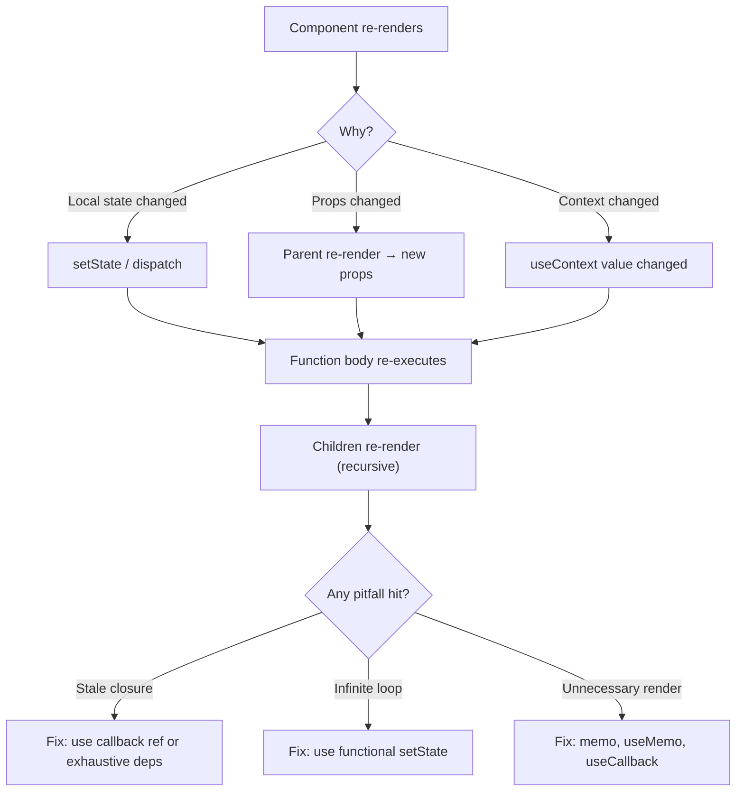

# State and Effects: Common Pitfalls

> [!summary] Golden Rule
> If you're synchronizing React state with an external system, use an effect. If you're deriving UI from existing state/props, **compute during render**. Most effect bugs come from using effects when you shouldn't.

## Table of Contents

- [State Pitfalls](#state-pitfalls)
- [Effect Pitfalls](#effect-pitfalls)
- [Closure Pitfalls](#closure-pitfalls)
- [Performance Pitfalls](#performance-pitfalls)
- [TypeScript Pitfalls](#typescript-pitfalls)
- [Debugging Techniques](#debugging-techniques)
- [Best Practices](#best-practices)
- [Interview Questions](#interview-questions)

---

## State Pitfalls

> [!info] Re-render in React
> React re-renders a component when its **state** changes, its **props** change (compared via shallow equality), or its **parent** re-renders. Understanding when and why components re-render is the foundation for fixing performance issues. Every pitfall in this section traces back to an unexpected re-render or a stale closure.



---

### 2. Stale State in Callbacks

```typescript
// ❌ BAD: Stale closure
function Counter() {
  const [count, setCount] = useState(0);
  
  const handleClick = () => {
    setTimeout(() => {
      setCount(count + 1); // Captures count=0, always sets to 1
    }, 3000);
  };
  
  return (
    <>
      <p>{count}</p>
      <button onClick={handleClick}>Increment after 3s</button>
    </>
  );
}

// Click 3 times quickly:
// Expected: count = 3
// Actual: count = 1 (all timeouts capture count=0)

// ✅ GOOD: Functional update
function Counter() {
  const [count, setCount] = useState(0);
  
  const handleClick = () => {
    setTimeout(() => {
      setCount(c => c + 1); // Always uses latest
    }, 3000);
  };
  
  return (
    <>
      <p>{count}</p>
      <button onClick={handleClick}>Increment after 3s</button>
    </>
  );
}

// Click 3 times: count = 3 ✅
```

---

### 3. Derived State Anti-pattern

```typescript
// ❌ BAD: Storing derived state
interface Props {
  items: Item[];
  filter: string;
}

function SearchResults({ items, filter }: Props) {
  const [filteredItems, setFilteredItems] = useState<Item[]>([]);
  
  useEffect(() => {
    setFilteredItems(items.filter(item => item.name.includes(filter)));
  }, [items, filter]);
  
  return <List items={filteredItems} />;
}

// Problems:
// 1. Extra state to manage
// 2. Can get out of sync
// 3. Extra re-render (effect runs after render)

// ✅ GOOD: Compute during render
function SearchResults({ items, filter }: Props) {
  const filteredItems = items.filter(item => item.name.includes(filter));
  
  return <List items={filteredItems} />;
}

// ✅ BETTER: Memoize if expensive
function SearchResults({ items, filter }: Props) {
  const filteredItems = useMemo(
    () => items.filter(item => item.name.includes(filter)),
    [items, filter]
  );
  
  return <List items={filteredItems} />;
}
```

**More examples:**

```typescript
// ❌ BAD: Deriving from props
function UserGreeting({ user }: { user: User }) {
  const [fullName, setFullName] = useState('');
  
  useEffect(() => {
    setFullName(`${user.firstName} ${user.lastName}`);
  }, [user]);
  
  return <h1>Hello {fullName}</h1>;
}

// ✅ GOOD: Compute
function UserGreeting({ user }: { user: User }) {
  const fullName = `${user.firstName} ${user.lastName}`;
  
  return <h1>Hello {fullName}</h1>;
}

// ❌ BAD: Duplicating prop in state
function Form({ initialEmail }: { initialEmail: string }) {
  const [email, setEmail] = useState(initialEmail);
  
  // Problem: If initialEmail prop changes, state doesn't update!
  
  return <input value={email} onChange={e => setEmail(e.target.value)} />;
}

// ✅ GOOD: Use key to reset
function Parent() {
  const [userId, setUserId] = useState('1');
  
  // When userId changes, Form remounts with new key
  return <Form key={userId} initialEmail={users[userId].email} />;
}

// ✅ OR: Controlled component
function Form({ email, onEmailChange }: Props) {
  return <input value={email} onChange={e => onEmailChange(e.target.value)} />;
}
```

---

### 4. State Initialization from Props

```typescript
// ❌ BAD: Doesn't update when prop changes
function EditForm({ user }: { user: User }) {
  const [name, setName] = useState(user.name);
  
  // If user prop changes, name state stays old value!
  
  return <input value={name} onChange={e => setName(e.target.value)} />;
}

// ✅ SOLUTION 1: Reset with key
function Parent() {
  const [currentUser, setCurrentUser] = useState(users[0]);
  
  // Changing key forces remount
  return <EditForm key={currentUser.id} user={currentUser} />;
}

// ✅ SOLUTION 2: Sync in effect
function EditForm({ user }: { user: User }) {
  const [name, setName] = useState(user.name);
  
  useEffect(() => {
    setName(user.name);
  }, [user.id]); // Reset when user changes
  
  return <input value={name} onChange={e => setName(e.target.value)} />;
}

// ✅ SOLUTION 3: Fully controlled
function EditForm({ name, onNameChange }: Props) {
  return <input value={name} onChange={e => onNameChange(e.target.value)} />;
}
```

---

### 5. Resetting State with Key

**Key changes force unmount + remount:**

```typescript
// Problem: Share component for different users
function ProfileEditor({ userId }: { userId: string }) {
  const [bio, setBio] = useState('');
  
  useEffect(() => {
    fetchUser(userId).then(user => setBio(user.bio));
  }, [userId]);
  
  // Problem: When userId changes, old bio briefly visible
  
  return <textarea value={bio} onChange={e => setBio(e.target.value)} />;
}

// ✅ SOLUTION: Use key to reset
function Parent() {
  const [userId, setUserId] = useState('1');
  
  return (
    <>
      <button onClick={() => setUserId('2')}>Switch User</button>
      <ProfileEditor key={userId} userId={userId} />
      {/* Key change = unmount + remount = fresh state */}
    </>
  );
}
```

**More examples:**

```typescript
// Reset form when switching items
function ItemEditor({ itemId }: { itemId: string }) {
  const [name, setName] = useState('');
  const [price, setPrice] = useState(0);
  
  // Complex: Reset all state in effect
  useEffect(() => {
    fetchItem(itemId).then(item => {
      setName(item.name);
      setPrice(item.price);
      // What if more fields?
    });
  }, [itemId]);
  
  return <form>...</form>;
}

// ✅ Simple: Key resets everything
function Parent() {
  return <ItemEditor key={itemId} itemId={itemId} />;
}
```

---

### 6. State in Wrong Component

```typescript
// ❌ BAD: State too high
function App() {
  const [modalOpen, setModalOpen] = useState(false);
  const [modalContent, setModalContent] = useState('');
  
  return (
    <div>
      <Header />
      <Sidebar />
      <Content 
        onOpenModal={(content) => {
          setModalContent(content);
          setModalOpen(true);
        }}
      />
      <Modal open={modalOpen} onClose={() => setModalOpen(false)}>
        {modalContent}
      </Modal>
    </div>
  );
}

// ✅ GOOD: Co-locate state
function Content() {
  const [modalOpen, setModalOpen] = useState(false);
  const [modalContent, setModalContent] = useState('');
  
  return (
    <>
      <button onClick={() => {
        setModalContent('Hello');
        setModalOpen(true);
      }}>
        Open Modal
      </button>
      
      <Modal open={modalOpen} onClose={() => setModalOpen(false)}>
        {modalContent}
      </Modal>
    </>
  );
}
```

---

## Effect Pitfalls

### 1. Infinite Effect Loops

```typescript
// ❌ BAD: No dependency array
function Component() {
  const [count, setCount] = useState(0);
  
  useEffect(() => {
    setCount(count + 1); // Infinite loop!
  }); // Runs after every render, which causes render, which runs effect...
  
  return <div>{count}</div>;
}

// ❌ BAD: Dependency changes in effect
function Component() {
  const [count, setCount] = useState(0);
  const [data, setData] = useState([]);
  
  useEffect(() => {
    setData([...data, count]); // data changes, triggers effect, changes data...
  }, [data, count]); // Infinite loop!
  
  return <div>{data.length}</div>;
}

// ✅ GOOD: Use functional update
function Component() {
  const [count, setCount] = useState(0);
  const [data, setData] = useState([]);
  
  useEffect(() => {
    setData(prevData => [...prevData, count]);
  }, [count]); // Only depends on count
  
  return <div>{data.length}</div>;
}
```

---

### 2. Missing Dependencies

```typescript
// ❌ BAD: Missing dependency
function Chat({ roomId }: { roomId: string }) {
  const [message, setMessage] = useState('');
  
  useEffect(() => {
    const connection = createConnection(roomId);
    connection.connect();
    
    return () => connection.disconnect();
  }, []); // Missing roomId!
  
  // Problem: roomId changes but effect doesn't re-run
  // Still connected to old room!
  
  return <input value={message} onChange={e => setMessage(e.target.value)} />;
}

// ✅ GOOD: Include all dependencies
function Chat({ roomId }: { roomId: string }) {
  const [message, setMessage] = useState('');
  
  useEffect(() => {
    const connection = createConnection(roomId);
    connection.connect();
    
    return () => connection.disconnect();
  }, [roomId]); // roomId in deps
  
  return <input value={message} onChange={e => setMessage(e.target.value)} />;
}
```

**ESLint exhaustive-deps:**

```bash
npm install eslint-plugin-react-hooks
```

```json
{
  "rules": {
    "react-hooks/exhaustive-deps": "warn"
  }
}
```

---

### 3. Unnecessary Dependencies

```typescript
// ❌ BAD: Unstable dependency
function SearchResults({ query }: { query: string }) {
  const options = { caseSensitive: false }; // New object every render!
  
  useEffect(() => {
    fetchResults(query, options).then(setResults);
  }, [query, options]); // options changes every render, effect re-runs
  
  return <div>...</div>;
}

// ✅ SOLUTION 1: Move outside component
const OPTIONS = { caseSensitive: false };

function SearchResults({ query }: { query: string }) {
  useEffect(() => {
    fetchResults(query, OPTIONS).then(setResults);
  }, [query]); // Stable
  
  return <div>...</div>;
}

// ✅ SOLUTION 2: Include in effect
function SearchResults({ query }: { query: string }) {
  useEffect(() => {
    const options = { caseSensitive: false };
    fetchResults(query, options).then(setResults);
  }, [query]); // options not needed in deps
  
  return <div>...</div>;
}

// ✅ SOLUTION 3: Memoize
function SearchResults({ query }: { query: string }) {
  const options = useMemo(() => ({ caseSensitive: false }), []);
  
  useEffect(() => {
    fetchResults(query, options).then(setResults);
  }, [query, options]); // options stable
  
  return <div>...</div>;
}
```

---

### 4. Race Conditions in Effects

```typescript
// ❌ BAD: Race condition
function UserProfile({ userId }: { userId: string }) {
  const [user, setUser] = useState<User | null>(null);
  
  useEffect(() => {
    fetchUser(userId).then(setUser);
  }, [userId]);
  
  // Problem: Fast user switches
  // 1. userId = '1', fetch started
  // 2. userId = '2', fetch started
  // 3. Response for '2' arrives, setUser(user2)
  // 4. Response for '1' arrives, setUser(user1) - WRONG!
  
  return <div>{user?.name}</div>;
}

// ✅ GOOD: Cleanup with cancellation flag
function UserProfile({ userId }: { userId: string }) {
  const [user, setUser] = useState<User | null>(null);
  
  useEffect(() => {
    let cancelled = false;
    
    fetchUser(userId).then(data => {
      if (!cancelled) {
        setUser(data);
      }
    });
    
    return () => {
      cancelled = true; // Ignore stale responses
    };
  }, [userId]);
  
  return <div>{user?.name}</div>;
}

// ✅ BETTER: AbortController
function UserProfile({ userId }: { userId: string }) {
  const [user, setUser] = useState<User | null>(null);
  
  useEffect(() => {
    const controller = new AbortController();
    
    fetch(`/api/users/${userId}`, { signal: controller.signal })
      .then(res => res.json())
      .then(setUser)
      .catch(err => {
        if (err.name !== 'AbortError') {
          console.error(err);
        }
      });
    
    return () => {
      controller.abort(); // Cancel in-flight request
    };
  }, [userId]);
  
  return <div>{user?.name}</div>;
}
```

---

### 5. Cleanup Not Working

```typescript
// ❌ BAD: Cleanup doesn't run
function Timer() {
  useEffect(() => {
    const id = setInterval(() => console.log('tick'), 1000);
    // Missing cleanup!
  }, []);
  
  // Memory leak: interval keeps running after unmount
  
  return <div>Timer</div>;
}

// ✅ GOOD: Return cleanup function
function Timer() {
  useEffect(() => {
    const id = setInterval(() => console.log('tick'), 1000);
    
    return () => {
      clearInterval(id); // Cleanup
    };
  }, []);
  
  return <div>Timer</div>;
}

// ❌ BAD: Async function (can't return cleanup)
function Component() {
  useEffect(async () => {
    const data = await fetchData();
    setData(data);
    
    return () => cleanup(); // Error: async function returns Promise
  }, []);
}

// ✅ GOOD: Async inside effect
function Component() {
  useEffect(() => {
    let cancelled = false;
    
    async function fetch() {
      const data = await fetchData();
      if (!cancelled) setData(data);
    }
    
    fetch();
    
    return () => {
      cancelled = true; // Cleanup
    };
  }, []);
}
```

---

### 6. Effect Running Twice (Strict Mode)

```typescript
// Observation: Effect runs twice in development

function Component() {
  useEffect(() => {
    console.log('Effect ran'); // Logs twice!
    
    return () => console.log('Cleanup'); // Logs once between mounts
  }, []);
  
  return <div>Component</div>;
}

// React 18 Strict Mode:
// 1. Mount -> Effect
// 2. Unmount -> Cleanup
// 3. Remount -> Effect again

// Why: Surfaces bugs (missing cleanup, non-idempotent effects)

// ✅ Make effects idempotent
function Component() {
  useEffect(() => {
    const subscription = subscribe();
    
    return () => subscription.unsubscribe();
  }, []);
  
  // Runs twice but safe (cleanup between runs)
  
  return <div>Component</div>;
}

// ❌ Not idempotent
function Component() {
  useEffect(() => {
    analytics.track('page_view'); // Tracks twice in dev!
  }, []);
  
  return <div>Component</div>;
}

// ✅ Fix: Check if already tracked
function Component() {
  useEffect(() => {
    let tracked = false;
    
    if (!tracked) {
      analytics.track('page_view');
      tracked = true;
    }
    
    return () => {
      tracked = false;
    };
  }, []);
  
  return <div>Component</div>;
}
```

---

### 7. Using Effects for Event Handling

```typescript
// ❌ BAD: Effect reacting to state change
function Form() {
  const [submitted, setSubmitted] = useState(false);
  
  useEffect(() => {
    if (submitted) {
      analytics.track('form_submitted');
      setSubmitted(false);
    }
  }, [submitted]);
  
  return <button onClick={() => setSubmitted(true)}>Submit</button>;
}

// ✅ GOOD: Call directly in event handler
function Form() {
  const handleSubmit = () => {
    analytics.track('form_submitted');
  };
  
  return <button onClick={handleSubmit}>Submit</button>;
}

// ❌ BAD: Effect for chaining actions
function Component() {
  const [data, setData] = useState(null);
  const [processed, setProcessed] = useState(null);
  
  useEffect(() => {
    if (data) {
      setProcessed(processData(data));
    }
  }, [data]);
  
  return <button onClick={() => fetchData().then(setData)}>Load</button>;
}

// ✅ GOOD: Chain in event handler
function Component() {
  const [processed, setProcessed] = useState(null);
  
  const handleLoad = async () => {
    const data = await fetchData();
    const result = processData(data);
    setProcessed(result);
  };
  
  return <button onClick={handleLoad}>Load</button>;
}
```

---

## Closure Pitfalls

### 1. Stale Closures Explained

```typescript
function createCounter() {
  let count = 0;
  
  return function() {
    console.log(count); // Closure over count
  };
}

const counter1 = createCounter();
const counter2 = createCounter();

counter1(); // 0
counter2(); // 0 (different count variable)

// In React:
function Counter() {
  const [count, setCount] = useState(0);
  
  useEffect(() => {
    const id = setInterval(() => {
      console.log(count); // Closure over count from this render
    }, 1000);
    
    return () => clearInterval(id);
  }, []); // Effect created once, captures count=0
  
  // count changes but interval still logs 0
  
  return <button onClick={() => setCount(c => c + 1)}>{count}</button>;
}
```

**Visualizing:**

```typescript
// Render 1: count = 0
const effect1 = () => {
  const id = setInterval(() => {
    console.log(0); // count = 0
  }, 1000);
  return () => clearInterval(id);
};

// Render 2: count = 1
// But effect1 still running with count = 0!

// Render 3: count = 2
// Still effect1 with count = 0!
```

---

### 2. Event Handler Closures

```typescript
// ❌ BAD: Stale closure in event handler
function Component() {
  const [count, setCount] = useState(0);
  
  const handleClick = () => {
    setTimeout(() => {
      console.log(count); // Stale
    }, 3000);
  };
  
  // Click when count=0, wait 3s, count=5
  // Logs 0 (not 5)
  
  return (
    <>
      <button onClick={() => setCount(c => c + 1)}>Inc</button>
      <button onClick={handleClick}>Log after 3s</button>
    </>
  );
}

// ✅ SOLUTION 1: Functional update
function Component() {
  const [count, setCount] = useState(0);
  
  const handleClick = () => {
    setTimeout(() => {
      setCount(c => {
        console.log(c); // Latest value
        return c;
      });
    }, 3000);
  };
  
  return (
    <>
      <button onClick={() => setCount(c => c + 1)}>Inc</button>
      <button onClick={handleClick}>Log after 3s</button>
    </>
  );
}

// ✅ SOLUTION 2: Ref
function Component() {
  const [count, setCount] = useState(0);
  const countRef = useRef(count);
  
  useEffect(() => {
    countRef.current = count;
  });
  
  const handleClick = () => {
    setTimeout(() => {
      console.log(countRef.current); // Latest value
    }, 3000);
  };
  
  return (
    <>
      <button onClick={() => setCount(c => c + 1)}>Inc</button>
      <button onClick={handleClick}>Log after 3s</button>
    </>
  );
}
```

---

### 3. setTimeout/setInterval in Effects

```typescript
// ❌ BAD: Recreates interval on every count change
function Timer() {
  const [count, setCount] = useState(0);
  
  useEffect(() => {
    const id = setInterval(() => {
      console.log(count);
    }, 1000);
    
    return () => clearInterval(id);
  }, [count]); // Recreates interval every second!
  
  return <button onClick={() => setCount(c => c + 1)}>{count}</button>;
}

// ✅ GOOD: Functional update
function Timer() {
  const [count, setCount] = useState(0);
  
  useEffect(() => {
    const id = setInterval(() => {
      setCount(c => c + 1); // No need for count in deps
    }, 1000);
    
    return () => clearInterval(id);
  }, []); // Creates once
  
  return <div>{count}</div>;
}

// ✅ GOOD: Ref for reading latest value
function Timer({ onTick }: { onTick: (count: number) => void }) {
  const [count, setCount] = useState(0);
  const onTickRef = useRef(onTick);
  
  useEffect(() => {
    onTickRef.current = onTick;
  });
  
  useEffect(() => {
    const id = setInterval(() => {
      setCount(c => {
        onTickRef.current(c); // Latest callback
        return c + 1;
      });
    }, 1000);
    
    return () => clearInterval(id);
  }, []); // No deps, but uses latest callback
  
  return <div>{count}</div>;
}
```

---

## Performance Pitfalls

### 1. Premature Optimization

```typescript
// ❌ Over-optimized
function Component({ a, b, c, items, filter }: Props) {
  const value1 = useMemo(() => a + b, [a, b]); // Overkill
  const value2 = useMemo(() => c * 2, [c]); // Overkill
  const handleClick = useCallback(() => {}, []); // Unnecessary
  const filtered = useMemo(() => items.filter(filter), [items, filter]); // Maybe
  
  return <div onClick={handleClick}>{value1 + value2}</div>;
}

// ✅ Optimize when needed
function Component({ a, b, c, items, filter }: Props) {
  const value1 = a + b; // Just compute it
  const value2 = c * 2; // Just compute it
  const handleClick = () => {}; // Just create it
  
  // Only memoize expensive computation (profile first!)
  const filtered = useMemo(
    () => items.filter(filter),
    [items, filter]
  );
  
  return <div onClick={handleClick}>{value1 + value2}</div>;
}
```

---

### 2. Over-Memoization

```typescript
// ❌ Memoization overhead > saved work
function Component({ name }: { name: string }) {
  const greeting = useMemo(() => `Hello ${name}`, [name]);
  
  // Cost of useMemo:
  // - Function call
  // - Dependency comparison
  // - Memory for cached value
  
  // Cost without memo:
  // - String concatenation (nanoseconds)
  
  // Memoization is MORE expensive!
  
  return <div>{greeting}</div>;
}

// ✅ Just compute it
function Component({ name }: { name: string }) {
  const greeting = `Hello ${name}`;
  return <div>{greeting}</div>;
}
```

---

### 3. Context Causing Re-renders

```typescript
// ❌ BAD: Entire tree re-renders
interface AppContextValue {
  user: User | null;
  theme: string;
  language: string;
  settings: Settings;
}

const AppContext = createContext<AppContextValue | null>(null);

function App() {
  const [user, setUser] = useState<User | null>(null);
  const [theme, setTheme] = useState('light');
  // ...
  
  return (
    <AppContext.Provider value={{ user, theme, ... }}>
      <Page />
    </AppContext.Provider>
  );
}

// Changing theme re-renders every consumer, even if they only use user!

// ✅ SOLUTION 1: Split contexts
const UserContext = createContext<User | null>(null);
const ThemeContext = createContext<string>('light');

function App() {
  const [user, setUser] = useState<User | null>(null);
  const [theme, setTheme] = useState('light');
  
  return (
    <UserContext.Provider value={user}>
      <ThemeContext.Provider value={theme}>
        <Page />
      </ThemeContext.Provider>
    </UserContext.Provider>
  );
}

// Now changing theme only re-renders theme consumers

// ✅ SOLUTION 2: Memoize value
function App() {
  const [user, setUser] = useState<User | null>(null);
  const [theme, setTheme] = useState('light');
  
  const value = useMemo(
    () => ({ user, theme }),
    [user, theme]
  );
  
  return (
    <AppContext.Provider value={value}>
      <Page />
    </AppContext.Provider>
  );
}
```

---

### 4. Large Component Trees

```typescript
// ❌ BAD: Heavy component passed as children
function Layout({ children }: { children: ReactNode }) {
  const [sidebarOpen, setSidebarOpen] = useState(false);
  
  return (
    <div>
      <Sidebar open={sidebarOpen} />
      <Main>{children}</Main>
    </div>
  );
}

// sidebarOpen changes → Layout re-renders → children re-render

// ✅ GOOD: children prop doesn't re-render
function App() {
  return (
    <Layout>
      <ExpensiveComponent /> {/* Doesn't re-render when sidebar toggles! */}
    </Layout>
  );
}

// Why: JSX creates element once, passed as prop
// Element identity doesn't change when Layout re-renders
```

---

## TypeScript Pitfalls

### 1. Type Inference Issues

```typescript
// ❌ BAD: Inferred as never[]
const [items, setItems] = useState([]);
items.push({ id: 1, name: 'Item' }); // Error: never[]

// ✅ GOOD: Explicit type
interface Item {
  id: number;
  name: string;
}

const [items, setItems] = useState<Item[]>([]);

// ❌ BAD: Null without type
const [user, setUser] = useState(null); // null type
setUser({ id: 1, name: 'Alice' }); // Error

// ✅ GOOD: Union type
const [user, setUser] = useState<User | null>(null);
```

---

### 2. Event Handler Typing

```typescript
// ❌ BAD: any
function Component() {
  const handleChange = (e: any) => {
    console.log(e.target.value);
  };
  
  return <input onChange={handleChange} />;
}

// ✅ GOOD: Specific type
import { ChangeEvent } from 'react';

function Component() {
  const handleChange = (e: ChangeEvent<HTMLInputElement>) => {
    console.log(e.target.value); // Typed!
  };
  
  return <input onChange={handleChange} />;
}

// Common event types:
import {
  ChangeEvent,
  FormEvent,
  MouseEvent,
  KeyboardEvent,
  FocusEvent
} from 'react';

function Form() {
  const handleSubmit = (e: FormEvent<HTMLFormElement>) => {
    e.preventDefault();
  };
  
  const handleClick = (e: MouseEvent<HTMLButtonElement>) => {
    console.log(e.currentTarget);
  };
  
  const handleKeyDown = (e: KeyboardEvent<HTMLInputElement>) => {
    if (e.key === 'Enter') {
      // ...
    }
  };
  
  return <form onSubmit={handleSubmit}>...</form>;
}
```

---

### 3. Generic Components

```typescript
// ❌ BAD: Loses type information
interface Props {
  items: any[];
  renderItem: (item: any) => ReactNode;
}

function List({ items, renderItem }: Props) {
  return <ul>{items.map(renderItem)}</ul>;
}

// ✅ GOOD: Generic component
interface ListProps<T> {
  items: T[];
  renderItem: (item: T) => ReactNode;
  keyExtractor: (item: T) => string;
}

function List<T>({ items, renderItem, keyExtractor }: ListProps<T>) {
  return (
    <ul>
      {items.map(item => (
        <li key={keyExtractor(item)}>
          {renderItem(item)}
        </li>
      ))}
    </ul>
  );
}

// Usage: Fully typed
interface User {
  id: string;
  name: string;
}

<List<User>
  items={users}
  renderItem={user => <span>{user.name}</span>} // user is User
  keyExtractor={user => user.id}
/>
```

---

## Debugging Techniques

### 1. React DevTools

```typescript
// Profiler tab: Record and analyze renders
// Components tab: Inspect props, state, hooks

function Component() {
  // React DevTools shows:
  // - Props
  // - State
  // - Hooks (in order)
  // - Renders (highlighted when re-renders)
  
  return <div />;
}
```

### 2. useDebugValue

```typescript
function useUser(userId: string) {
  const [user, setUser] = useState<User | null>(null);
  
  useDebugValue(user ? `User: ${user.name}` : 'Loading...');
  
  // React DevTools shows custom label
  
  return user;
}
```

### 3. Console Logging

```typescript
function Component({ prop }: { prop: string }) {
  const [state, setState] = useState(0);
  
  console.log('Render:', { prop, state }); // Track renders
  
  useEffect(() => {
    console.log('Effect ran'); // Track effect runs
    
    return () => console.log('Cleanup'); // Track cleanups
  }, [prop]);
  
  return <div />;
}
```

### 4. why-did-you-render

```bash
npm install @welldone-software/why-did-you-render
```

```typescript
import whyDidYouRender from '@welldone-software/why-did-you-render';

if (process.env.NODE_ENV === 'development') {
  whyDidYouRender(React, {
    trackAllPureComponents: true,
  });
}

// Logs why components re-rendered
```

---

## Best Practices

### 1. Effects Checklist

Before writing useEffect, ask:

- ✅ Is this synchronizing with external system?
- ❌ Can I compute during render?
- ❌ Should this be in event handler?
- ✅ Do I need cleanup?
- ✅ Are all dependencies included?

### 2. State Checklist

- ✅ Is state co-located (as close to usage as possible)?
- ❌ Am I duplicating props in state?
- ❌ Am I storing derived values?
- ✅ Can I use key to reset state?
- ✅ Should this be controlled/uncontrolled?

### 3. Performance Checklist

- ✅ Did I profile before optimizing?
- ❌ Am I memoizing cheap computations?
- ✅ Are my context values stable?
- ✅ Did I split large contexts?
- ✅ Are keys stable and unique?

---

## Interview Questions

### Q1: What causes an infinite loop in useEffect?

**Answer:**

**Cause 1: No dependency array**
```typescript
useEffect(() => {
  setState(value); // Triggers render → runs effect → triggers render...
});
```

**Cause 2: Dependency changes in effect**
```typescript
useEffect(() => {
  setData([...data, newItem]); // data changes → effect runs → data changes...
}, [data]);
```

**Solutions:**
- Add dependency array
- Use functional updates
- Move computation outside effect

### Q2: Explain stale closures and how to fix them.

**Answer:** See detailed explanation in Closure Pitfalls section above (01_React_Mental_Model_and_Rendering.md:1567-1640).

### Q3: What's the derived state anti-pattern?

**Answer:** Storing in state what can be computed from props/state. Causes extra re-renders and sync issues.

```typescript
// ❌ Anti-pattern
const [filteredItems, setFilteredItems] = useState([]);
useEffect(() => {
  setFilteredItems(items.filter(filter));
}, [items, filter]);

// ✅ Solution
const filteredItems = items.filter(filter);
```

### Q4: How does React 18's automatic batching work?

**Answer:** See State Pitfalls section above (01_React_Mental_Model_and_Rendering.md:1806).

---

## Cross-Links

- **Mental Model**: [[React/01_Foundations/01_React_Mental_Model_and_Rendering]]
- **Hooks Reference**: [[React/01_Foundations/02_Hooks_Complete_Reference]]
- **Performance**: [[React/03_Advanced/02_Performance_and_Profiling]]
- **Debugging Playbook**: [[React/04_Playbooks/01_Debug_Rerenders_and_Perf_Issues]]

---

## References

- [React Docs: You Might Not Need an Effect](https://react.dev/learn/you-might-not-need-an-effect)
- [React Docs: Removing Effect Dependencies](https://react.dev/learn/removing-effect-dependencies)
- [Overreacted: A Complete Guide to useEffect](https://overreacted.io/a-complete-guide-to-useeffect/)
