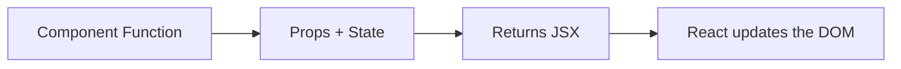
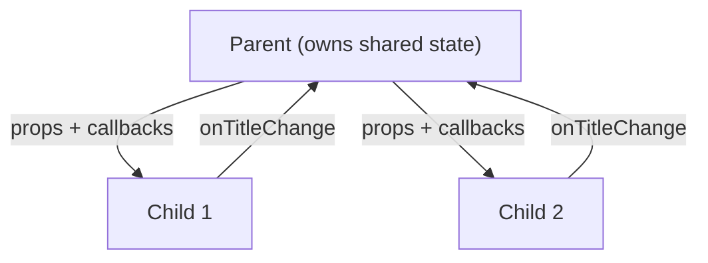

# React Basics: Components, Props, and State

> [!summary] Goal
> Build your first React components and understand how props and state drive the UI — no prior React knowledge assumed.

## Table of Contents

1. [What React Is (and Isn't)](#what-react-is-and-isnt)
2. [First Component](#first-component)
3. [Embedding Expressions in JSX](#embedding-expressions-in-jsx)
4. [Props: Passing Data Down](#props-passing-data-down)
5. [Children and Composition](#children-and-composition)
6. [Lists, Keys, and Conditional Rendering](#lists-keys-and-conditional-rendering)
7. [State: Making a Component Interactive](#state-making-a-component-interactive)
8. [Lifting State Up](#lifting-state-up)
9. [Mini Project: Simple Scoreboard](#mini-project-simple-scoreboard)
10. [Pitfalls](#pitfalls)
11. [Q&A](#qa)

---

## What React Is (and Isn't)

React is a **library for building user interfaces from components**. A component is just a function that returns a description of what should appear on screen.



**React is not:**
- A full framework (it handles only the view layer).
- A templating language (JSX *is* JavaScript — you can embed any expression).
- Opinionated about routing, state management, or data fetching (you add libraries for those).

---

## First Component

```tsx
function Greeting() {
  return <h1>Hello, React!</h1>;
}
```

To render it to the page:

```tsx
import { createRoot } from 'react-dom/client';

const root = createRoot(document.getElementById('root')!);
root.render(<Greeting />);
```

### What's happening

- `Greeting` is a function component — it takes no arguments and returns JSX.
- JSX looks like HTML but gets compiled to `React.createElement` calls.
- You can use a component in JSX with angle brackets: `<Greeting />`.

---

## Embedding Expressions in JSX

Use `{ }` to embed any JavaScript expression:

```tsx
function Greeting() {
  const name = 'Alice';
  const hour = new Date().getHours();
  const isMorning = hour < 12;

  return (
    <div>
      <h1>Hello, {name}!</h1>
      <p>It is {isMorning ? 'morning' : 'afternoon'}.</p>
    </div>
  );
}
```

**Rules:**
- `{}` accepts any *expression* (variables, function calls, ternary, `map`).
- Do not put `if`/`else` or `for` loops inside JSX directly — use ternary or extract logic beforehand.
- Attributes in JSX use camelCase: `className`, `onClick`, `htmlFor`.

---

## Props: Passing Data Down

Props are the **inputs** to a component. They are passed like HTML attributes:

```tsx
function UserCard({ name, age, isOnline }: { name: string; age: number; isOnline: boolean }) {
  return (
    <div className="card">
      <h2>{name}</h2>
      <p>Age: {age}</p>
      <span className={isOnline ? 'online' : 'offline'}>
        {isOnline ? 'Online' : 'Offline'}
      </span>
    </div>
  );
}

// Usage
<UserCard name="Bob" age={30} isOnline={true} />
```

### Default values

```tsx
function Greeting({ name = 'Guest' }: { name?: string }) {
  return <h1>Hello, {name}</h1>;
}
```

### Spreading props

```tsx
const user = { name: 'Alice', age: 25 };
<UserCard {...user} isOnline={true} />;
```

> [!tip] Be explicit with prop names for clarity. Spread only in generic wrapper components.

---

## Children and Composition

`children` is a special prop — any JSX placed between a component's tags is passed as `children`.

```tsx
function Card({ title, children }: { title: string; children: React.ReactNode }) {
  return (
    <div className="card">
      <h2 className="card-title">{title}</h2>
      <div className="card-body">{children}</div>
    </div>
  );
}

// Usage
<Card title="Profile">
  <UserCard name="Alice" age={25} isOnline={true} />
</Card>
```

---

## Lists, Keys, and Conditional Rendering

### Rendering lists

```tsx
function TodoList({ items }: { items: { id: string; text: string }[] }) {
  return (
    <ul>
      {items.map(item => (
        <li key={item.id}>{item.text}</li>
      ))}
    </ul>
  );
}
```

### Why keys matter

Keys help React identify which items changed, were added, or removed.

```tsx
// ❌ Bad — using index as key
{items.map((item, i) => <li key={i}>{item.text}</li>)}

// ✅ Good — using stable id
{items.map(item => <li key={item.id}>{item.text}</li>)}
```

### Conditional rendering

```tsx
function Status({ isLoggedIn }: { isLoggedIn: boolean }) {
  return (
    <div>
      {isLoggedIn ? <LogoutButton /> : <LoginButton />}
      {isLoggedIn && <Dashboard />}
    </div>
  );
}
```

---

## State: Making a Component Interactive

`useState` gives a component memory. When state changes, React re-renders the component with the new value.

```tsx
import { useState } from 'react';

function Counter() {
  const [count, setCount] = useState(0);

  return (
    <div>
      <p>Count: {count}</p>
      <button onClick={() => setCount(count + 1)}>+1</button>
      <button onClick={() => setCount(count - 1)}>-1</button>
    </div>
  );
}
```

### Key rules

```tsx
function GoodComponent() {
  // ✅ Fine: multiple independent states
  const [name, setName] = useState('');
  const [age, setAge] = useState(0);

  // ✅ Fine: functional update when next depends on previous
  const increment = () => setCount(c => c + 1);
}
```

### Controlled inputs

```tsx
function LoginForm() {
  const [email, setEmail] = useState('');

  return (
    <input
      type="email"
      value={email}
      onChange={e => setEmail(e.target.value)}
      placeholder="Enter email"
    />
  );
}
```

---

## Lifting State Up

When two components need to share state, move the state to their closest common ancestor.



```tsx
function App() {
  const [title, setTitle] = useState('Default');

  return (
    <>
      <InputField value={title} onChange={setTitle} />
      <DisplayText text={title} />
    </>
  );
}

function InputField({ value, onChange }: { value: string; onChange: (v: string) => void }) {
  return <input value={value} onChange={e => onChange(e.target.value)} />;
}

function DisplayText({ text }: { text: string }) {
  return <p>{text}</p>;
}
```

---

## Mini Project: Simple Scoreboard

Build these components — try it yourself before looking at the solution.

**Requirements:**
1. A `Scoreboard` component that holds scores for two teams.
2. Each team has a `TeamScore` component with +1 and -1 buttons.
3. A `Reset` button.

<details>
<summary>Solution (spoiler)</summary>

```tsx
function Scoreboard() {
  const [scores, setScores] = useState({ teamA: 0, teamB: 0 });

  return (
    <div>
      <h1>Scoreboard</h1>
      <TeamScore
        name="Team A"
        score={scores.teamA}
        onIncrement={() => setScores(s => ({ ...s, teamA: s.teamA + 1 }))}
        onDecrement={() => setScores(s => ({ ...s, teamA: s.teamA - 1 }))}
      />
      <TeamScore
        name="Team B"
        score={scores.teamB}
        onIncrement={() => setScores(s => ({ ...s, teamB: s.teamB + 1 }))}
        onDecrement={() => setScores(s => ({ ...s, teamB: s.teamB - 1 }))}
      />
      <button onClick={() => setScores({ teamA: 0, teamB: 0 })}>Reset</button>
    </div>
  );
}

function TeamScore({ name, score, onIncrement, onDecrement }: {
  name: string; score: number; onIncrement: () => void; onDecrement: () => void;
}) {
  return (
    <div>
      <h2>{name}: {score}</h2>
      <button onClick={onIncrement}>+1</button>
      <button onClick={onDecrement}>-1</button>
    </div>
  );
}
```
</details>

---

## Pitfalls

- **Mutating state directly** — always use the setter function; `state.count++` does not re-render.
- **Using index as key** — causes subtle bugs with list reordering; use a stable id.
- **Too many divs** — use `<></>` (Fragment) instead of wrapping every pair of elements in a div.
- **Forgetting `return` in arrow functions** — `const fn = () => <div />` works; `const fn = () => { <div /> }` does not.
- **Calling hooks conditionally** — hooks must be called in the same order every render.

---

## Q&A

> [!question]- Can I use class components or should I learn only functions?

The official recommendation is **function components with hooks**. Class components still work but are the legacy API — all modern React code uses functions.

> [!question]- What's the difference between `==` and `===` in JSX conditionals?

Same as in JavaScript: `===` is strict equality. Prefer `===` to avoid type coercion surprises.

> [!question]- Why does my component not update when I change a variable?

Local variables don't trigger re-renders. Only `useState` (or a state management tool) tells React to re-render.

## References

- [React Docs – Your First Component](https://react.dev/learn/your-first-component)
- [React Docs – Describing the UI](https://react.dev/learn/describing-the-ui)
- [React Docs – State: A Component's Memory](https://react.dev/learn/state-a-components-memory)
- [[React/01_Foundations/01_React_Mental_Model_and_Rendering]]
- [[React/01_Foundations/02_Hooks_Complete_Reference]]
