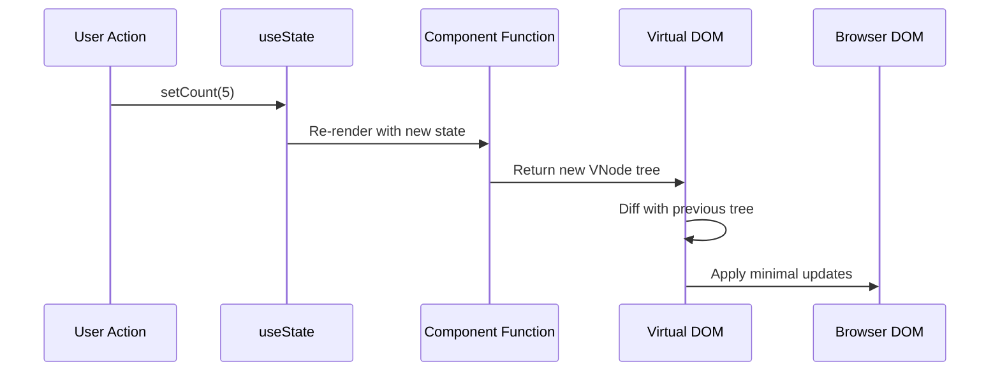
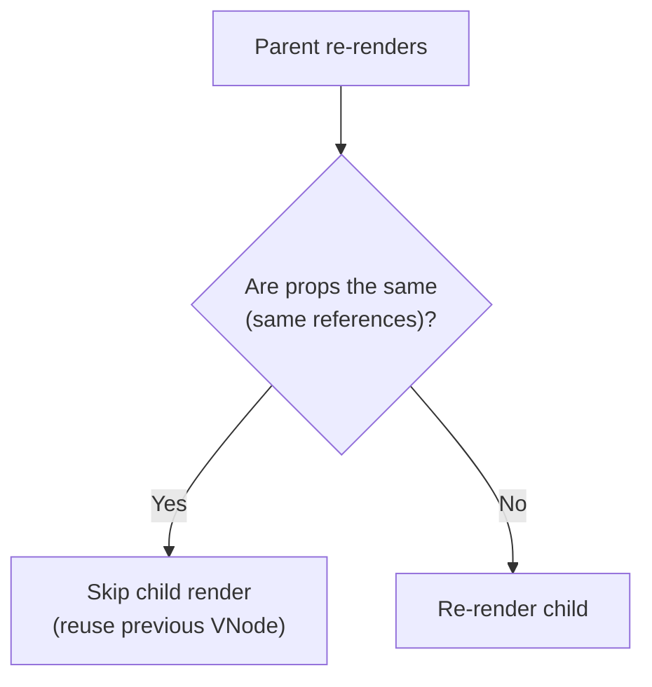
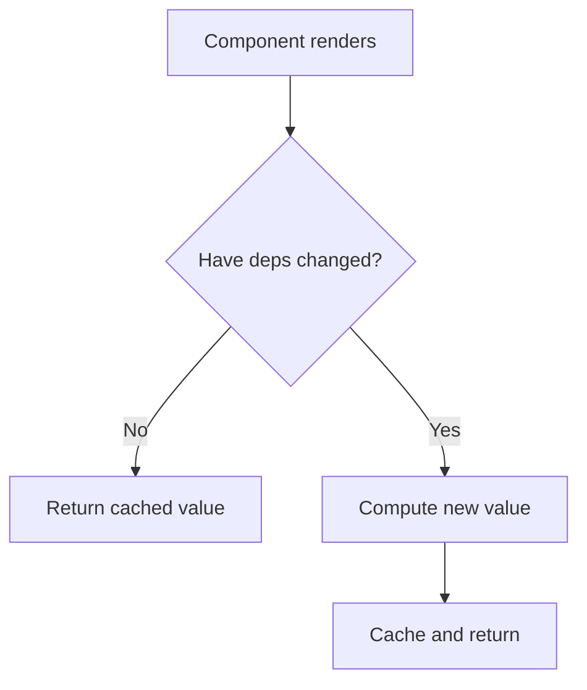
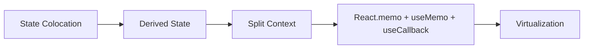
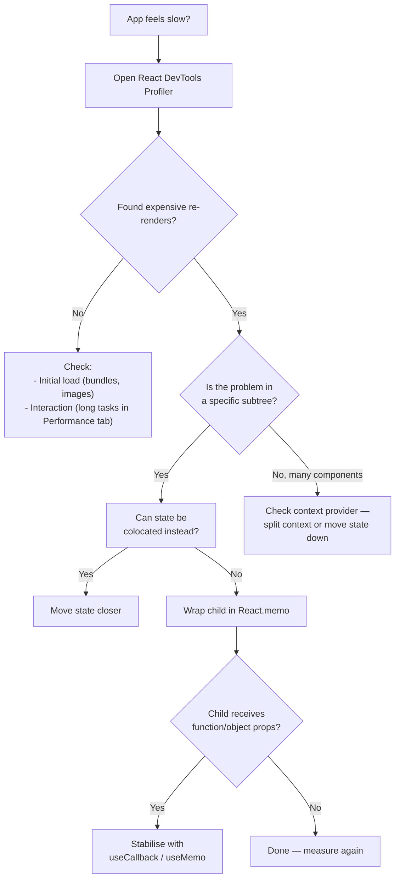

# Memoization and Re-renders: Mental Model

> [!summary] Goal
> Understand why React components re-render, when `React.memo`, `useMemo`, and `useCallback` help, and — just as importantly — when they don't.

## Table of Contents

1. [What a Re-render Actually Is](#what-a-re-render-actually-is)
2. [Why Components Re-render](#why-components-re-render)
3. [What Costs Time During Rendering](#what-costs-time-during-rendering)
4. [React.memo: Memoizing a Component](#reactmemo-memoizing-a-component)
5. [useMemo: Memoizing a Value](#usememo-memoizing-a-value)
6. [useCallback: Memoizing a Function](#usecallback-memoizing-a-function)
7. [The Golden Rule: Optimise from the Outside In](#the-golden-rule-optimise-from-the-outside-in)
8. [Performance Decision Flowchart](#performance-decision-flowchart)
9. [Note on the React Compiler](#note-on-the-react-compiler)
10. [Pitfalls](#pitfalls)
11. [Q&A](#qa)

---

## What a Re-render Actually Is

When you call `setState`, React schedules a **render** of that component. A render is just a function call:

```tsx
// React calls your component function
function MyComponent({ count }: { count: number }) {
  // This function body runs:
  const doubled = count * 2;

  // It returns a description of the UI
  return <div>{doubled}</div>;
}
```



**Important:** A render doesn't mean the DOM actually changed. React calls the function, creates the virtual DOM, diffs it, and only *commits* real DOM changes. The render itself is cheap for small trees.

---

## Why Components Re-render

A component re-renders when:

1. **Its state changes** — via `useState` or `useReducer`.
2. **Its props change** — the parent passed new values.
3. **Its parent re-renders** — React re-renders *all* children of a re-rendering parent by default, even if their props haven't changed.

The third one is the source of most unnecessary work.

```tsx
function Parent() {
  const [count, setCount] = useState(0);

  return (
    <div>
      <button onClick={() => setCount(c => c + 1)}>{count}</button>
      {/* This child re-renders every time Parent renders, */}
      {/* even though its props never changed! */}
      <ExpensiveChild />
    </div>
  );
}
```

---

## What Costs Time During Rendering

Not all re-renders are equal. These are the operations that actually cost:

| Operation | Cost | Evidence |
|-----------|------|----------|
| Large list mapping | High | Flame graph shows many `Item` components |
| Deep prop drilling through 10+ components | Medium | Flame graph shows long component chain all re-rendering |
| Expensive calculation (loop, sort, filter) | High | CPU profiling shows long `render` frame |
| Heavy DOM structure | Medium | Layout/Paint time in Performance tab |

**Rule of thumb:** Only optimise when you've *measured* a problem. Premature memoization adds complexity without benefit.

---

## React.memo: Memoizing a Component

`React.memo` wraps a component so that it **skips re-rendering if its props are referentially equal** to the previous render.

```tsx
import { memo } from 'react';

const ExpensiveList = memo(function ExpensiveList({ items }: { items: Item[] }) {
  // This only re-renders when items reference changes
  return (
    <ul>
      {items.map(item => <li key={item.id}>{item.text}</li>)}
    </ul>
  );
});
```

### How it works



### Custom comparison function

```tsx
const UserCard = memo(
  ({ user }: { user: { id: string; name: string } }) => <div>{user.name}</div>,
  (prevProps, nextProps) => prevProps.user.id === nextProps.user.id
);
```

### When React.memo actually helps

- The component renders **expensive subtrees** (large lists, complex layouts).
- The component re-renders **often** with the same props.

### When React.memo doesn't help

- The component is cheap to render (a simple button or text node).
- Props change on every render anyway (inline objects, inline functions) — you need `useMemo`/`useCallback` to make the comparison work.

---

## useMemo: Memoizing a Value

`useMemo` caches the result of an expensive calculation and only recomputes when its dependencies change.

```tsx
const filteredUsers = useMemo(
  () => users.filter(u => u.role === 'admin').sort(byName),
  [users]
);
```



### When to use

- Expensive computation in the render body (sorting/filtering arrays, math operations).
- Stabilising an object reference that a `memo`ized child depends on.

### When to skip

- The computation is trivial (string concatenation, simple math).
- The value is used only once in a handler or effect, not the render output.

---

## useCallback: Memoizing a Function

`useCallback` is `useMemo` for functions. It returns the same function reference across renders unless dependencies change.

```tsx
const handleClick = useCallback(
  (id: string) => dispatch({ type: 'SELECT', payload: id }),
  [dispatch]
);
```

### Why this matters for memo

```tsx
// Without useCallback — the function is new every render
<ExpensiveChild onClick={() => doSomething()} />
// React.memo sees new props every time → always re-renders

// With useCallback — same function reference
<ExpensiveChild onClick={handleClick} />
// React.memo sees stable props → skips render
```

### When to use

- The function is passed as prop to a `memo`ized child.
- The function is used in a `useEffect` dependency array.

### When not to use

- Everywhere "just in case" — `useCallback` itself has overhead.
- The child component isn't wrapped in `React.memo`.

---

## The Golden Rule: Optimise from the Outside In



*Do these in order.*

1. **State Colocation** — move state as close as possible to where it's used. If a state change only affects one branch, that branch should own the state.
2. **Derived State** — compute derived values in the render body without extra state (`const enabled = count > 0`).
3. **Split Contexts** — if context changes cause wide re-renders, split a single context into several smaller ones.
4. **Memoization** — after measuring, add `React.memo`, `useMemo`, `useCallback` to the specific bottlenecks you found.
5. **Virtualization** — for very large lists, use `react-window` or `react-virtuoso`.

---

## Performance Decision Flowchart



---

## Note on the React Compiler

The React Compiler (React Forget) is designed to automatically memoize your components — it understands when `useMemo`, `useCallback`, and `React.memo` are needed and applies them at build time.

**Implications:**
- You may write all components without manual memoization and let the compiler handle it.
- The mental model here is still useful: the compiler follows the same rules you would.
- For now, manual memoization is the standard — adopt the compiler when your toolchain supports it.

---

## Pitfalls

- **Default comparisons are shallow** — `React.memo` uses `Object.is` on each prop. Passing `{ user: { id: 1 } }` is always a "new" object.
- **`useMemo` doesn't guarantee no calculation** — if deps change, it runs. For truly expensive work, move to a Web Worker.
- **"Just in case" `useCallback`** — every `useCallback` creates a closure you pay for on every render. Only use when needed.
- **Custom `React.memo` comparer that returns `true` for stale props** — the UI will not update. Test your comparer with actual prop changes.

---

## Q&A

> [!question]- I wrapped a child in React.memo and it still re-renders. Why?

Check if the parent passes an inline function or inline object — these create new references every render. Use `useCallback` or `useMemo` to stabilise them.

> [!question]- Is useMemo faster than just recomputing?

Only if the computation is expensive and the deps change infrequently. The `useMemo` itself has memory and comparison overhead. Measure first.

> [!question]- Should I use `memo` from React or a third-party library?

React's built-in `memo` is the standard. Third-party libraries (like `react-tracked`) offer more granular subscriptions but are rarely needed.

## References

- [React Docs – memo](https://react.dev/reference/react/memo)
- [React Docs – useMemo](https://react.dev/reference/react/useMemo)
- [React Docs – useCallback](https://react.dev/reference/react/useCallback)
- [Before You memo()](https://overreacted.io/before-you-memo/)
- [[React/01_Foundations/02_Hooks_Complete_Reference]]
- [[React/03_Advanced/02_Performance_and_Profiling]]
- [[React/04_Playbooks/01_Debug_Rerenders_and_Perf_Issues]]
