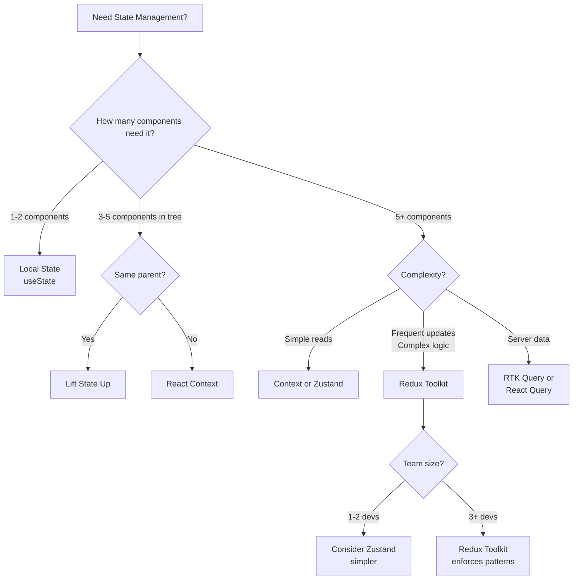
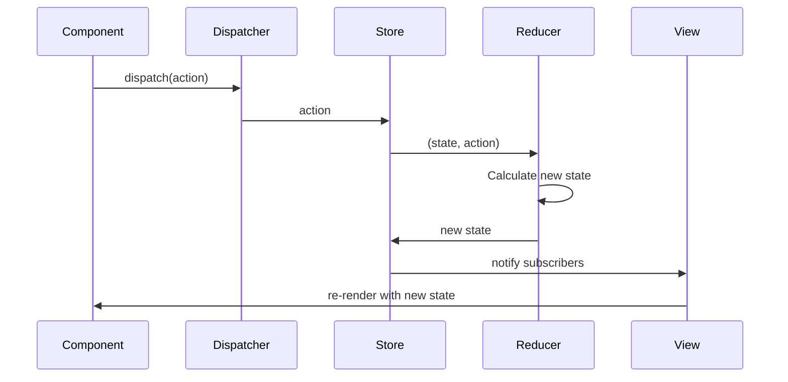

# Redux Toolkit Essentials

**Complete guide to Redux Toolkit for React applications**

---

## Metadata
```yaml
topic: Redux Toolkit
difficulty: intermediate
prerequisites:
  - React fundamentals
  - Hooks (useState, useEffect)
  - JavaScript ES6+ (destructuring, spread)
  - TypeScript basics
related:
  - "[[02_RTK_Query_Essentials]]"
  - "[[02_Hooks_Complete_Reference]]"
  - "[[03_State_and_Effects_Common_Pitfalls]]"
status: stable
last_updated: 2026-04-26
```

---

## Table of Contents
1. [Why Redux Toolkit?](#why-redux-toolkit)
2. [Core Concepts](#core-concepts)
3. [Installation and Setup](#installation-and-setup)
4. [configureStore](#configurestore)
5. [createSlice](#createslice)
6. [createAsyncThunk](#createasyncthunk)
7. [useSelector and useDispatch](#useselector-and-usedispatch)
8. [Redux DevTools](#redux-devtools)
9. [Folder Structure](#folder-structure)
10. [Testing](#testing)
11. [Complete Todo CRUD Example](#complete-todo-crud-example)
12. [State Management Comparison](#state-management-comparison)
13. [Common Pitfalls](#common-pitfalls)
14. [Best Practices](#best-practices)
15. [Interview Questions](#interview-questions)

---

## Why Redux Toolkit?

### Problems with Vanilla Redux

**Boilerplate Hell:**
```typescript
// Vanilla Redux - TOO MUCH CODE
// actions/todos.ts
const ADD_TODO = 'ADD_TODO';
const TOGGLE_TODO = 'TOGGLE_TODO';

interface AddTodoAction {
  type: typeof ADD_TODO;
  payload: { id: string; text: string };
}

export const addTodo = (text: string): AddTodoAction => ({
  type: ADD_TODO,
  payload: { id: Date.now().toString(), text }
});

// reducers/todos.ts
interface TodosState {
  items: Todo[];
}

const initialState: TodosState = { items: [] };

export function todosReducer(
  state = initialState,
  action: TodoAction
): TodosState {
  switch (action.type) {
    case ADD_TODO:
      return {
        ...state,
        items: [...state.items, action.payload]
      };
    default:
      return state;
  }
}

// store.ts
import { createStore, combineReducers } from 'redux';
import { todosReducer } from './reducers/todos';

const rootReducer = combineReducers({
  todos: todosReducer
});

export const store = createStore(rootReducer);
```

**Redux Toolkit - MUCH SIMPLER:**
```typescript
// features/todos/todosSlice.ts
import { createSlice, PayloadAction } from '@reduxjs/toolkit';

interface Todo {
  id: string;
  text: string;
  completed: boolean;
}

interface TodosState {
  items: Todo[];
}

const initialState: TodosState = { items: [] };

const todosSlice = createSlice({
  name: 'todos',
  initialState,
  reducers: {
    addTodo: (state, action: PayloadAction<string>) => {
      state.items.push({
        id: Date.now().toString(),
        text: action.payload,
        completed: false
      });
    },
    toggleTodo: (state, action: PayloadAction<string>) => {
      const todo = state.items.find(t => t.id === action.payload);
      if (todo) {
        todo.completed = !todo.completed;
      }
    }
  }
});

export const { addTodo, toggleTodo } = todosSlice.actions;
export default todosSlice.reducer;
```

### Redux Toolkit Advantages

| Feature | Vanilla Redux | Redux Toolkit |
|---------|---------------|---------------|
| **Boilerplate** | High (actions, action creators, reducers) | Low (slices auto-generate) |
| **Immutability** | Manual (spread operators) | Automatic (Immer) |
| **DevTools** | Manual setup | Auto-configured |
| **Middleware** | Manual (redux-thunk) | Included by default |
| **TypeScript** | Manual typing | Better type inference |
| **Async Logic** | redux-thunk or redux-saga | `createAsyncThunk` built-in |
| **Store Setup** | `createStore` + `combineReducers` | `configureStore` (one call) |

### When to Use Redux (vs Context/Zustand)



**Use Redux Toolkit when:**
- ✅ Many components need the same state
- ✅ State updates have complex logic
- ✅ Frequent state updates (performance)
- ✅ Time-travel debugging needed
- ✅ Large team (enforces structure)
- ✅ Need middleware (logging, analytics)

**DON'T use Redux when:**
- ❌ Only 1-2 components need state
- ❌ State is mostly server data (use RTK Query/React Query)
- ❌ Simple read-only data (Context is fine)
- ❌ Temporary UI state (modals, form inputs)

---

## Core Concepts

### Redux Data Flow



### Key Concepts

**1. Store**: Single source of truth for all state
```typescript
const store = configureStore({
  reducer: {
    todos: todosReducer,
    user: userReducer
  }
});
```

**2. Slice**: Feature-specific reducer + actions
```typescript
const todosSlice = createSlice({
  name: 'todos',
  initialState,
  reducers: { /* ... */ }
});
```

**3. Reducer**: Pure function `(state, action) => newState`
```typescript
reducers: {
  addTodo: (state, action) => {
    state.items.push(action.payload); // Immer makes this safe
  }
}
```

**4. Action**: Plain object describing what happened
```typescript
{ type: 'todos/addTodo', payload: 'Learn Redux' }
```

**5. Selector**: Function to extract state
```typescript
const selectTodos = (state: RootState) => state.todos.items;
```

---

## Installation and Setup

### Installation

```bash
# Create Vite + React + TypeScript project
npm create vite@latest my-app -- --template react-ts
cd my-app

# Install Redux Toolkit and React-Redux
npm install @reduxjs/toolkit react-redux

# Optional: Redux DevTools (browser extension)
# Chrome: https://chrome.google.com/webstore (search "Redux DevTools")
```

### Basic Setup Structure

```
src/
├── app/
│   ├── store.ts              # Store configuration
│   └── hooks.ts              # Typed hooks
├── features/
│   ├── todos/
│   │   ├── todosSlice.ts     # Slice
│   │   └── TodoList.tsx      # Component
│   └── user/
│       └── userSlice.ts
└── main.tsx                  # Provider setup
```

---

## configureStore

### Basic Store Setup

```typescript
// app/store.ts
import { configureStore } from '@reduxjs/toolkit';
import todosReducer from '../features/todos/todosSlice';
import userReducer from '../features/user/userSlice';

export const store = configureStore({
  reducer: {
    todos: todosReducer,
    user: userReducer
  }
});

// Infer RootState and AppDispatch types
export type RootState = ReturnType<typeof store.getState>;
export type AppDispatch = typeof store.dispatch;
```

### Advanced Store Configuration

```typescript
// app/store.ts
import { configureStore, Middleware } from '@reduxjs/toolkit';
import { setupListeners } from '@reduxjs/toolkit/query';
import todosReducer from '../features/todos/todosSlice';

// Custom logging middleware
const loggerMiddleware: Middleware = storeAPI => next => action => {
  console.log('Dispatching:', action.type);
  const result = next(action);
  console.log('Next State:', storeAPI.getState());
  return result;
};

// Error catching middleware
const errorMiddleware: Middleware = storeAPI => next => action => {
  try {
    return next(action);
  } catch (error) {
    console.error('Caught error in reducer:', error);
    // Send to error tracking service (Sentry, etc.)
    throw error;
  }
};

export const store = configureStore({
  reducer: {
    todos: todosReducer
  },
  middleware: (getDefaultMiddleware) =>
    getDefaultMiddleware({
      serializableCheck: {
        // Ignore these action types
        ignoredActions: ['todos/addTodoWithDate'],
        // Ignore these field paths in state
        ignoredPaths: ['todos.dateCreated']
      }
    })
    .concat(loggerMiddleware)
    .concat(errorMiddleware),
  devTools: process.env.NODE_ENV !== 'production'
});

// Enable refetchOnFocus/refetchOnReconnect for RTK Query
setupListeners(store.dispatch);

export type RootState = ReturnType<typeof store.getState>;
export type AppDispatch = typeof store.dispatch;
```

### Provider Setup

```typescript
// main.tsx
import React from 'react';
import ReactDOM from 'react-dom/client';
import { Provider } from 'react-redux';
import { store } from './app/store';
import App from './App';
import './index.css';

ReactDOM.createRoot(document.getElementById('root')!).render(
  <React.StrictMode>
    <Provider store={store}>
      <App />
    </Provider>
  </React.StrictMode>
);
```

---

## createSlice

### Basic Slice

```typescript
// features/counter/counterSlice.ts
import { createSlice, PayloadAction } from '@reduxjs/toolkit';

interface CounterState {
  value: number;
  status: 'idle' | 'loading';
}

const initialState: CounterState = {
  value: 0,
  status: 'idle'
};

const counterSlice = createSlice({
  name: 'counter',
  initialState,
  reducers: {
    increment: (state) => {
      state.value += 1; // Immer makes this mutation safe
    },
    decrement: (state) => {
      state.value -= 1;
    },
    incrementByAmount: (state, action: PayloadAction<number>) => {
      state.value += action.payload;
    },
    reset: (state) => {
      state.value = 0;
    }
  }
});

export const { increment, decrement, incrementByAmount, reset } = counterSlice.actions;
export default counterSlice.reducer;
```

### Slice with Prepare Callback

```typescript
// features/todos/todosSlice.ts
import { createSlice, PayloadAction, nanoid } from '@reduxjs/toolkit';

interface Todo {
  id: string;
  text: string;
  completed: boolean;
  createdAt: number;
}

interface TodosState {
  items: Todo[];
}

const initialState: TodosState = {
  items: []
};

const todosSlice = createSlice({
  name: 'todos',
  initialState,
  reducers: {
    // Simple reducer (RTK auto-generates action creator)
    toggleTodo: (state, action: PayloadAction<string>) => {
      const todo = state.items.find(t => t.id === action.payload);
      if (todo) {
        todo.completed = !todo.completed;
      }
    },
    
    // Reducer with prepare callback (customize payload)
    addTodo: {
      reducer: (state, action: PayloadAction<Todo>) => {
        state.items.push(action.payload);
      },
      prepare: (text: string) => {
        return {
          payload: {
            id: nanoid(),
            text,
            completed: false,
            createdAt: Date.now()
          }
        };
      }
    },
    
    removeTodo: (state, action: PayloadAction<string>) => {
      state.items = state.items.filter(t => t.id !== action.payload);
    }
  }
});

export const { addTodo, toggleTodo, removeTodo } = todosSlice.actions;
export default todosSlice.reducer;
```

### Immer Integration (Mutative Updates)

Redux Toolkit uses [Immer](https://immerjs.github.io/immer/) under the hood, allowing "mutative" code:

```typescript
const todosSlice = createSlice({
  name: 'todos',
  initialState: { items: [] } as TodosState,
  reducers: {
    // ✅ CORRECT: Mutative update (Immer converts to immutable)
    addTodo: (state, action: PayloadAction<Todo>) => {
      state.items.push(action.payload);
    },
    
    // ✅ ALSO CORRECT: Immutable update (return new state)
    addTodoImmutable: (state, action: PayloadAction<Todo>) => {
      return {
        ...state,
        items: [...state.items, action.payload]
      };
    },
    
    // ❌ WRONG: Mixing mutation and return
    addTodoWrong: (state, action: PayloadAction<Todo>) => {
      state.items.push(action.payload);
      return state; // DON'T DO THIS
    }
  }
});
```

**Immer Rules:**
1. **Either mutate the draft OR return a new state, not both**
2. **Mutations are only safe in RTK reducers** (Immer wraps them)
3. **Complex updates may be clearer with immutable style**

---

## createAsyncThunk

### Basic Async Thunk

```typescript
// features/todos/todosSlice.ts
import { createSlice, createAsyncThunk, PayloadAction } from '@reduxjs/toolkit';
import axios from 'axios';

interface Todo {
  id: string;
  text: string;
  completed: boolean;
}

interface TodosState {
  items: Todo[];
  status: 'idle' | 'loading' | 'succeeded' | 'failed';
  error: string | null;
}

const initialState: TodosState = {
  items: [],
  status: 'idle',
  error: null
};

// Async thunk
export const fetchTodos = createAsyncThunk(
  'todos/fetchTodos',
  async () => {
    const response = await axios.get<Todo[]>('https://api.example.com/todos');
    return response.data;
  }
);

const todosSlice = createSlice({
  name: 'todos',
  initialState,
  reducers: {
    // Synchronous reducers
  },
  extraReducers: (builder) => {
    builder
      .addCase(fetchTodos.pending, (state) => {
        state.status = 'loading';
        state.error = null;
      })
      .addCase(fetchTodos.fulfilled, (state, action: PayloadAction<Todo[]>) => {
        state.status = 'succeeded';
        state.items = action.payload;
      })
      .addCase(fetchTodos.rejected, (state, action) => {
        state.status = 'failed';
        state.error = action.error.message ?? 'Failed to fetch todos';
      });
  }
});

export default todosSlice.reducer;
```

### Thunk with Arguments and Error Handling

```typescript
// features/todos/todosSlice.ts
import { createAsyncThunk } from '@reduxjs/toolkit';
import axios, { AxiosError } from 'axios';

interface AddTodoArgs {
  text: string;
  userId: string;
}

interface ValidationError {
  message: string;
  field: string;
}

// Typed thunk with error handling
export const addTodoAsync = createAsyncThunk<
  Todo,                    // Return type
  AddTodoArgs,             // Argument type
  { rejectValue: ValidationError }  // Reject type
>(
  'todos/addTodo',
  async (args, { rejectWithValue }) => {
    try {
      const response = await axios.post<Todo>('/api/todos', args);
      return response.data;
    } catch (err) {
      const error = err as AxiosError<ValidationError>;
      if (error.response) {
        return rejectWithValue(error.response.data);
      }
      throw error;
    }
  }
);

// In slice extraReducers:
extraReducers: (builder) => {
  builder
    .addCase(addTodoAsync.pending, (state) => {
      state.status = 'loading';
    })
    .addCase(addTodoAsync.fulfilled, (state, action) => {
      state.items.push(action.payload);
      state.status = 'succeeded';
    })
    .addCase(addTodoAsync.rejected, (state, action) => {
      state.status = 'failed';
      if (action.payload) {
        // Typed ValidationError
        state.error = `${action.payload.field}: ${action.payload.message}`;
      } else {
        state.error = action.error.message ?? 'Unknown error';
      }
    });
}
```

### Thunk with ThunkAPI

```typescript
// Access store state and dispatch in thunk
import { createAsyncThunk } from '@reduxjs/toolkit';
import { RootState } from '../../app/store';

export const fetchTodosByUserId = createAsyncThunk<
  Todo[],
  void,
  { state: RootState }
>(
  'todos/fetchByUserId',
  async (_, { getState, dispatch }) => {
    const state = getState();
    const userId = state.user.currentUser?.id;
    
    if (!userId) {
      throw new Error('No user logged in');
    }
    
    const response = await axios.get<Todo[]>(`/api/users/${userId}/todos`);
    
    // Dispatch another action
    dispatch(logActivity('Fetched todos'));
    
    return response.data;
  }
);
```

### Conditional Thunk Execution

```typescript
export const fetchTodos = createAsyncThunk<
  Todo[],
  void,
  { state: RootState }
>(
  'todos/fetchTodos',
  async () => {
    const response = await axios.get<Todo[]>('/api/todos');
    return response.data;
  },
  {
    condition: (_, { getState }) => {
      const { todos } = getState();
      // Don't fetch if already loading or recently fetched
      if (todos.status === 'loading') {
        return false;
      }
      return true;
    }
  }
);
```

---

## useSelector and useDispatch

### Typed Hooks

```typescript
// app/hooks.ts
import { TypedUseSelectorHook, useDispatch, useSelector } from 'react-redux';
import type { RootState, AppDispatch } from './store';

// Use throughout app instead of plain `useDispatch` and `useSelector`
export const useAppDispatch = () => useDispatch<AppDispatch>();
export const useAppSelector: TypedUseSelectorHook<RootState> = useSelector;
```

### Using in Components

```typescript
// features/todos/TodoList.tsx
import React, { useEffect } from 'react';
import { useAppDispatch, useAppSelector } from '../../app/hooks';
import { fetchTodos, addTodo, toggleTodo } from './todosSlice';

export const TodoList: React.FC = () => {
  const dispatch = useAppDispatch();
  
  // Select state with automatic TypeScript typing
  const todos = useAppSelector(state => state.todos.items);
  const status = useAppSelector(state => state.todos.status);
  const error = useAppSelector(state => state.todos.error);
  
  useEffect(() => {
    if (status === 'idle') {
      dispatch(fetchTodos());
    }
  }, [status, dispatch]);
  
  const handleAddTodo = (text: string) => {
    dispatch(addTodo(text));
  };
  
  const handleToggle = (id: string) => {
    dispatch(toggleTodo(id));
  };
  
  if (status === 'loading') return <div>Loading...</div>;
  if (status === 'failed') return <div>Error: {error}</div>;
  
  return (
    <div>
      <h2>Todos</h2>
      <ul>
        {todos.map(todo => (
          <li key={todo.id}>
            <input
              type="checkbox"
              checked={todo.completed}
              onChange={() => handleToggle(todo.id)}
            />
            <span style={{ textDecoration: todo.completed ? 'line-through' : 'none' }}>
              {todo.text}
            </span>
          </li>
        ))}
      </ul>
    </div>
  );
};
```

### Memoized Selectors with createSelector

```typescript
// features/todos/todosSlice.ts
import { createSelector } from '@reduxjs/toolkit';
import { RootState } from '../../app/store';

// Basic selector
export const selectTodos = (state: RootState) => state.todos.items;

// Memoized selector - only recomputes if todos change
export const selectCompletedTodos = createSelector(
  [selectTodos],
  (todos) => todos.filter(todo => todo.completed)
);

export const selectActiveTodos = createSelector(
  [selectTodos],
  (todos) => todos.filter(todo => !todo.completed)
);

// Selector with parameter
export const selectTodoById = createSelector(
  [selectTodos, (state: RootState, todoId: string) => todoId],
  (todos, todoId) => todos.find(todo => todo.id === todoId)
);

// Complex memoized selector
export const selectTodosStats = createSelector(
  [selectTodos],
  (todos) => ({
    total: todos.length,
    completed: todos.filter(t => t.completed).length,
    active: todos.filter(t => !t.completed).length,
    completionPercentage: todos.length > 0
      ? Math.round((todos.filter(t => t.completed).length / todos.length) * 100)
      : 0
  })
);

// Usage in component:
function TodoStats() {
  const stats = useAppSelector(selectTodosStats);
  
  return (
    <div>
      <p>Total: {stats.total}</p>
      <p>Completed: {stats.completed}</p>
      <p>Active: {stats.active}</p>
      <p>Completion: {stats.completionPercentage}%</p>
    </div>
  );
}
```

### Performance: useSelector Pitfalls

```typescript
// ❌ BAD: Creates new array every render (causes re-render)
const completedTodos = useAppSelector(state => 
  state.todos.items.filter(t => t.completed)
);

// ✅ GOOD: Use memoized selector
const completedTodos = useAppSelector(selectCompletedTodos);

// ❌ BAD: Creates new object every time
const user = useAppSelector(state => ({
  name: state.user.name,
  email: state.user.email
}));

// ✅ GOOD: Select primitives separately
const userName = useAppSelector(state => state.user.name);
const userEmail = useAppSelector(state => state.user.email);

// ✅ ALSO GOOD: Use shallowEqual
import { shallowEqual } from 'react-redux';

const user = useAppSelector(
  state => ({
    name: state.user.name,
    email: state.user.email
  }),
  shallowEqual
);
```

---

## Redux DevTools

### Features

1. **Action History**: See all dispatched actions
2. **Time Travel**: Jump to any previous state
3. **State Diff**: See what changed
4. **Action Replay**: Test state changes
5. **Export/Import**: Save and restore state

### DevTools Usage

**View dispatched actions:**
```typescript
// Automatically logged when action dispatched
dispatch(addTodo('Learn Redux'));
// DevTools shows: todos/addTodo { payload: 'Learn Redux' }
```

**Jump to action:**
- Click any action in timeline
- State reverts to that point
- UI updates automatically

**Monitor state changes:**
```typescript
// Before: { todos: { items: [] } }
dispatch(addTodo('Test'));
// After: { todos: { items: [{ id: '1', text: 'Test', completed: false }] } }
// DevTools highlights changed fields
```

### Custom DevTools Tracing

```typescript
// Add action metadata for better debugging
const todosSlice = createSlice({
  name: 'todos',
  initialState,
  reducers: {
    addTodo: {
      reducer: (state, action: PayloadAction<Todo, string, { timestamp: number }>) => {
        state.items.push(action.payload);
      },
      prepare: (text: string) => ({
        payload: {
          id: nanoid(),
          text,
          completed: false
        },
        meta: { timestamp: Date.now() }
      })
    }
  }
});

// Meta shows in DevTools action details
```

---

## Folder Structure

### Feature-Based Structure (Recommended)

```
src/
├── app/
│   ├── store.ts                    # Store configuration
│   └── hooks.ts                    # Typed useDispatch/useSelector
│
├── features/
│   ├── todos/
│   │   ├── todosSlice.ts           # Slice (state + reducers + thunks)
│   │   ├── TodoList.tsx            # Container component
│   │   ├── TodoItem.tsx            # Presentational component
│   │   ├── AddTodoForm.tsx         # Form component
│   │   └── todosSlice.test.ts      # Tests
│   │
│   ├── user/
│   │   ├── userSlice.ts
│   │   ├── Login.tsx
│   │   └── Profile.tsx
│   │
│   └── filters/
│       ├── filtersSlice.ts
│       └── FilterButtons.tsx
│
├── components/                      # Shared components
│   ├── Button.tsx
│   └── Modal.tsx
│
├── utils/                           # Utilities
│   └── api.ts
│
└── main.tsx                         # Provider setup
```

### Layer-Based Structure (Alternative)

```
src/
├── store/
│   ├── index.ts                    # Store setup
│   ├── slices/
│   │   ├── todosSlice.ts
│   │   └── userSlice.ts
│   └── hooks.ts
│
├── components/
│   ├── todos/
│   │   ├── TodoList.tsx
│   │   └── TodoItem.tsx
│   └── user/
│       └── Profile.tsx
│
└── main.tsx
```

---

## Testing

### Testing Reducers

```typescript
// features/todos/todosSlice.test.ts
import reducer, { addTodo, toggleTodo, removeTodo } from './todosSlice';
import { TodosState } from './todosSlice';

describe('todosSlice', () => {
  const initialState: TodosState = {
    items: [],
    status: 'idle',
    error: null
  };
  
  it('should handle initial state', () => {
    expect(reducer(undefined, { type: 'unknown' })).toEqual(initialState);
  });
  
  it('should add a todo', () => {
    const actual = reducer(initialState, addTodo('Test todo'));
    expect(actual.items).toHaveLength(1);
    expect(actual.items[0].text).toBe('Test todo');
    expect(actual.items[0].completed).toBe(false);
  });
  
  it('should toggle todo', () => {
    const withTodo = reducer(initialState, addTodo('Test'));
    const todoId = withTodo.items[0].id;
    
    const toggled = reducer(withTodo, toggleTodo(todoId));
    expect(toggled.items[0].completed).toBe(true);
    
    const toggledBack = reducer(toggled, toggleTodo(todoId));
    expect(toggledBack.items[0].completed).toBe(false);
  });
  
  it('should remove todo', () => {
    const withTodo = reducer(initialState, addTodo('Test'));
    const todoId = withTodo.items[0].id;
    
    const removed = reducer(withTodo, removeTodo(todoId));
    expect(removed.items).toHaveLength(0);
  });
});
```

### Testing Async Thunks

```typescript
// features/todos/todosSlice.test.ts
import { configureStore } from '@reduxjs/toolkit';
import axios from 'axios';
import MockAdapter from 'axios-mock-adapter';
import todosReducer, { fetchTodos } from './todosSlice';

const mock = new MockAdapter(axios);

describe('fetchTodos', () => {
  let store: ReturnType<typeof configureStore>;
  
  beforeEach(() => {
    store = configureStore({
      reducer: { todos: todosReducer }
    });
  });
  
  afterEach(() => {
    mock.reset();
  });
  
  it('should fetch todos successfully', async () => {
    const mockTodos = [
      { id: '1', text: 'Test 1', completed: false },
      { id: '2', text: 'Test 2', completed: true }
    ];
    
    mock.onGet('https://api.example.com/todos').reply(200, mockTodos);
    
    await store.dispatch(fetchTodos());
    
    const state = store.getState().todos;
    expect(state.status).toBe('succeeded');
    expect(state.items).toEqual(mockTodos);
    expect(state.error).toBeNull();
  });
  
  it('should handle fetch error', async () => {
    mock.onGet('https://api.example.com/todos').reply(500);
    
    await store.dispatch(fetchTodos());
    
    const state = store.getState().todos;
    expect(state.status).toBe('failed');
    expect(state.error).toBeTruthy();
  });
});
```

### Testing Components with Redux

```typescript
// features/todos/TodoList.test.tsx
import { render, screen, waitFor } from '@testing-library/react';
import userEvent from '@testing-library/user-event';
import { Provider } from 'react-redux';
import { configureStore } from '@reduxjs/toolkit';
import todosReducer from './todosSlice';
import { TodoList } from './TodoList';

// Helper to render with Redux
function renderWithRedux(
  ui: React.ReactElement,
  {
    preloadedState = {},
    store = configureStore({
      reducer: { todos: todosReducer },
      preloadedState
    })
  } = {}
) {
  return {
    ...render(<Provider store={store}>{ui}</Provider>),
    store
  };
}

describe('TodoList', () => {
  it('renders empty state', () => {
    renderWithRedux(<TodoList />);
    expect(screen.getByText(/no todos/i)).toBeInTheDocument();
  });
  
  it('renders todos from state', () => {
    renderWithRedux(<TodoList />, {
      preloadedState: {
        todos: {
          items: [
            { id: '1', text: 'Test Todo', completed: false }
          ],
          status: 'succeeded',
          error: null
        }
      }
    });
    
    expect(screen.getByText('Test Todo')).toBeInTheDocument();
  });
  
  it('toggles todo when clicked', async () => {
    const user = userEvent.setup();
    const { store } = renderWithRedux(<TodoList />, {
      preloadedState: {
        todos: {
          items: [
            { id: '1', text: 'Test Todo', completed: false }
          ],
          status: 'succeeded',
          error: null
        }
      }
    });
    
    const checkbox = screen.getByRole('checkbox');
    await user.click(checkbox);
    
    const state = store.getState().todos;
    expect(state.items[0].completed).toBe(true);
  });
});
```

---

## Complete Todo CRUD Example

### Slice with All Operations

```typescript
// features/todos/todosSlice.ts
import { createSlice, createAsyncThunk, PayloadAction, nanoid } from '@reduxjs/toolkit';
import axios from 'axios';

// Types
export interface Todo {
  id: string;
  text: string;
  completed: boolean;
  createdAt: number;
}

interface TodosState {
  items: Todo[];
  status: 'idle' | 'loading' | 'succeeded' | 'failed';
  error: string | null;
  filter: 'all' | 'active' | 'completed';
}

const initialState: TodosState = {
  items: [],
  status: 'idle',
  error: null,
  filter: 'all'
};

// Async Thunks
export const fetchTodos = createAsyncThunk(
  'todos/fetchTodos',
  async () => {
    const response = await axios.get<Todo[]>('/api/todos');
    return response.data;
  }
);

export const addTodoAsync = createAsyncThunk(
  'todos/addTodo',
  async (text: string) => {
    const response = await axios.post<Todo>('/api/todos', {
      text,
      completed: false
    });
    return response.data;
  }
);

export const updateTodoAsync = createAsyncThunk(
  'todos/updateTodo',
  async (todo: Todo) => {
    const response = await axios.put<Todo>(`/api/todos/${todo.id}`, todo);
    return response.data;
  }
);

export const deleteTodoAsync = createAsyncThunk(
  'todos/deleteTodo',
  async (id: string) => {
    await axios.delete(`/api/todos/${id}`);
    return id;
  }
);

// Slice
const todosSlice = createSlice({
  name: 'todos',
  initialState,
  reducers: {
    // Optimistic local updates
    addTodoLocal: {
      reducer: (state, action: PayloadAction<Todo>) => {
        state.items.push(action.payload);
      },
      prepare: (text: string) => ({
        payload: {
          id: nanoid(),
          text,
          completed: false,
          createdAt: Date.now()
        }
      })
    },
    
    toggleTodoLocal: (state, action: PayloadAction<string>) => {
      const todo = state.items.find(t => t.id === action.payload);
      if (todo) {
        todo.completed = !todo.completed;
      }
    },
    
    removeTodoLocal: (state, action: PayloadAction<string>) => {
      state.items = state.items.filter(t => t.id !== action.payload);
    },
    
    updateTodoText: (state, action: PayloadAction<{ id: string; text: string }>) => {
      const todo = state.items.find(t => t.id === action.payload.id);
      if (todo) {
        todo.text = action.payload.text;
      }
    },
    
    setFilter: (state, action: PayloadAction<'all' | 'active' | 'completed'>) => {
      state.filter = action.payload;
    },
    
    clearCompleted: (state) => {
      state.items = state.items.filter(t => !t.completed);
    }
  },
  
  extraReducers: (builder) => {
    builder
      // Fetch todos
      .addCase(fetchTodos.pending, (state) => {
        state.status = 'loading';
        state.error = null;
      })
      .addCase(fetchTodos.fulfilled, (state, action) => {
        state.status = 'succeeded';
        state.items = action.payload;
      })
      .addCase(fetchTodos.rejected, (state, action) => {
        state.status = 'failed';
        state.error = action.error.message ?? 'Failed to fetch';
      })
      
      // Add todo
      .addCase(addTodoAsync.fulfilled, (state, action) => {
        state.items.push(action.payload);
      })
      
      // Update todo
      .addCase(updateTodoAsync.fulfilled, (state, action) => {
        const index = state.items.findIndex(t => t.id === action.payload.id);
        if (index !== -1) {
          state.items[index] = action.payload;
        }
      })
      
      // Delete todo
      .addCase(deleteTodoAsync.fulfilled, (state, action) => {
        state.items = state.items.filter(t => t.id !== action.payload);
      });
  }
});

export const {
  addTodoLocal,
  toggleTodoLocal,
  removeTodoLocal,
  updateTodoText,
  setFilter,
  clearCompleted
} = todosSlice.actions;

export default todosSlice.reducer;

// Selectors
import { createSelector } from '@reduxjs/toolkit';
import { RootState } from '../../app/store';

export const selectTodos = (state: RootState) => state.todos.items;
export const selectFilter = (state: RootState) => state.todos.filter;
export const selectStatus = (state: RootState) => state.todos.status;

export const selectFilteredTodos = createSelector(
  [selectTodos, selectFilter],
  (todos, filter) => {
    switch (filter) {
      case 'active':
        return todos.filter(t => !t.completed);
      case 'completed':
        return todos.filter(t => t.completed);
      default:
        return todos;
    }
  }
);

export const selectTodoStats = createSelector(
  [selectTodos],
  (todos) => ({
    total: todos.length,
    completed: todos.filter(t => t.completed).length,
    active: todos.filter(t => !t.completed).length
  })
);
```

### Complete Todo App Component

```typescript
// features/todos/TodoApp.tsx
import React, { useEffect, useState } from 'react';
import { useAppDispatch, useAppSelector } from '../../app/hooks';
import {
  fetchTodos,
  addTodoLocal,
  toggleTodoLocal,
  removeTodoLocal,
  updateTodoText,
  setFilter,
  clearCompleted,
  selectFilteredTodos,
  selectTodoStats,
  selectFilter,
  selectStatus
} from './todosSlice';

export const TodoApp: React.FC = () => {
  const dispatch = useAppDispatch();
  const todos = useAppSelector(selectFilteredTodos);
  const stats = useAppSelector(selectTodoStats);
  const filter = useAppSelector(selectFilter);
  const status = useAppSelector(selectStatus);
  
  const [newTodoText, setNewTodoText] = useState('');
  const [editingId, setEditingId] = useState<string | null>(null);
  const [editText, setEditText] = useState('');
  
  useEffect(() => {
    if (status === 'idle') {
      dispatch(fetchTodos());
    }
  }, [status, dispatch]);
  
  const handleAddTodo = (e: React.FormEvent) => {
    e.preventDefault();
    if (newTodoText.trim()) {
      dispatch(addTodoLocal(newTodoText.trim()));
      setNewTodoText('');
    }
  };
  
  const handleToggle = (id: string) => {
    dispatch(toggleTodoLocal(id));
  };
  
  const handleDelete = (id: string) => {
    dispatch(removeTodoLocal(id));
  };
  
  const handleEditStart = (id: string, currentText: string) => {
    setEditingId(id);
    setEditText(currentText);
  };
  
  const handleEditSave = () => {
    if (editingId && editText.trim()) {
      dispatch(updateTodoText({ id: editingId, text: editText.trim() }));
      setEditingId(null);
      setEditText('');
    }
  };
  
  const handleEditCancel = () => {
    setEditingId(null);
    setEditText('');
  };
  
  if (status === 'loading') {
    return <div className="loading">Loading todos...</div>;
  }
  
  return (
    <div className="todo-app">
      <h1>Todo App</h1>
      
      {/* Add Todo Form */}
      <form onSubmit={handleAddTodo} className="add-todo-form">
        <input
          type="text"
          value={newTodoText}
          onChange={(e) => setNewTodoText(e.target.value)}
          placeholder="What needs to be done?"
          className="todo-input"
        />
        <button type="submit">Add</button>
      </form>
      
      {/* Stats */}
      <div className="stats">
        <span>{stats.active} active</span>
        <span>{stats.completed} completed</span>
        <span>{stats.total} total</span>
      </div>
      
      {/* Filters */}
      <div className="filters">
        <button
          className={filter === 'all' ? 'active' : ''}
          onClick={() => dispatch(setFilter('all'))}
        >
          All
        </button>
        <button
          className={filter === 'active' ? 'active' : ''}
          onClick={() => dispatch(setFilter('active'))}
        >
          Active
        </button>
        <button
          className={filter === 'completed' ? 'active' : ''}
          onClick={() => dispatch(setFilter('completed'))}
        >
          Completed
        </button>
      </div>
      
      {/* Todo List */}
      <ul className="todo-list">
        {todos.map(todo => (
          <li key={todo.id} className={todo.completed ? 'completed' : ''}>
            {editingId === todo.id ? (
              <div className="edit-mode">
                <input
                  type="text"
                  value={editText}
                  onChange={(e) => setEditText(e.target.value)}
                  onKeyDown={(e) => {
                    if (e.key === 'Enter') handleEditSave();
                    if (e.key === 'Escape') handleEditCancel();
                  }}
                  autoFocus
                />
                <button onClick={handleEditSave}>Save</button>
                <button onClick={handleEditCancel}>Cancel</button>
              </div>
            ) : (
              <div className="view-mode">
                <input
                  type="checkbox"
                  checked={todo.completed}
                  onChange={() => handleToggle(todo.id)}
                />
                <span onDoubleClick={() => handleEditStart(todo.id, todo.text)}>
                  {todo.text}
                </span>
                <button onClick={() => handleDelete(todo.id)}>×</button>
              </div>
            )}
          </li>
        ))}
      </ul>
      
      {/* Clear Completed */}
      {stats.completed > 0 && (
        <button onClick={() => dispatch(clearCompleted())} className="clear-completed">
          Clear completed
        </button>
      )}
    </div>
  );
};
```

---

## State Management Comparison

### Redux vs Context vs Zustand vs Jotai

| Feature | Redux Toolkit | React Context | Zustand | Jotai |
|---------|---------------|---------------|---------|-------|
| **Learning Curve** | Medium | Low | Low | Low |
| **Boilerplate** | Low (with RTK) | Very Low | Very Low | Very Low |
| **DevTools** | ✅ Excellent | ❌ No | ✅ Good | ✅ Good |
| **TypeScript** | ✅ Excellent | ⚠️ Manual | ✅ Great | ✅ Great |
| **Performance** | ✅ Excellent | ⚠️ Can cause re-renders | ✅ Excellent | ✅ Excellent |
| **Middleware** | ✅ Yes | ❌ No | ✅ Yes | ⚠️ Limited |
| **Async** | ✅ createAsyncThunk | ❌ Manual | ✅ Built-in | ✅ Built-in |
| **Code Splitting** | ✅ Yes | ❌ No | ✅ Yes | ✅ Yes |
| **Time Travel** | ✅ Yes | ❌ No | ⚠️ With middleware | ❌ No |
| **Bundle Size** | ~15 KB | 0 KB | ~1 KB | ~3 KB |
| **Best For** | Large apps, teams | Simple shared state | Small-medium apps | Atomic state |

### Code Comparison

**Redux Toolkit:**
```typescript
// Store
const store = configureStore({
  reducer: { counter: counterSlice.reducer }
});

// Slice
const counterSlice = createSlice({
  name: 'counter',
  initialState: { value: 0 },
  reducers: {
    increment: (state) => { state.value += 1; }
  }
});

// Component
const count = useAppSelector(state => state.counter.value);
dispatch(increment());
```

**React Context:**
```typescript
// Context
const CounterContext = createContext({ value: 0, increment: () => {} });

// Provider
function CounterProvider({ children }) {
  const [value, setValue] = useState(0);
  const increment = () => setValue(v => v + 1);
  return (
    <CounterContext.Provider value={{ value, increment }}>
      {children}
    </CounterContext.Provider>
  );
}

// Component
const { value, increment } = useContext(CounterContext);
```

**Zustand:**
```typescript
// Store
const useCounterStore = create((set) => ({
  value: 0,
  increment: () => set((state) => ({ value: state.value + 1 }))
}));

// Component
const { value, increment } = useCounterStore();
```

**Jotai:**
```typescript
// Atom
const counterAtom = atom(0);

// Component
const [value, setValue] = useAtom(counterAtom);
const increment = () => setValue(v => v + 1);
```

---

## Common Pitfalls

### 1. Mutating State Outside Reducers

```typescript
// ❌ WRONG: Mutating state before dispatching
const todos = useAppSelector(state => state.todos.items);
todos.push({ id: '1', text: 'Bad', completed: false }); // NEVER DO THIS

// ✅ CORRECT: Dispatch action
dispatch(addTodo('Good'));
```

### 2. Returning State in Immer Reducers

```typescript
// ❌ WRONG: Mixing mutation and return
reducers: {
  addTodo: (state, action) => {
    state.items.push(action.payload);
    return state; // Don't do this with Immer
  }
}

// ✅ CORRECT: Either mutate OR return
reducers: {
  addTodo: (state, action) => {
    state.items.push(action.payload); // Just mutate
  }
  // OR
  addTodo: (state, action) => {
    return { // Return new state
      ...state,
      items: [...state.items, action.payload]
    };
  }
}
```

### 3. Non-Serializable Values in State

```typescript
// ❌ WRONG: Storing functions, Promises, Dates
const userSlice = createSlice({
  name: 'user',
  initialState: {
    loginDate: new Date(), // ❌
    fetchPromise: fetch('/api'), // ❌
    callback: () => {} // ❌
  }
});

// ✅ CORRECT: Store serializable data
const userSlice = createSlice({
  name: 'user',
  initialState: {
    loginTimestamp: Date.now(), // ✅
    isLoading: false, // ✅
  }
});
```

### 4. Selecting Too Much State

```typescript
// ❌ BAD: Component re-renders when ANY user field changes
const user = useAppSelector(state => state.user);

// ✅ GOOD: Only re-renders when name changes
const userName = useAppSelector(state => state.user.name);
```

### 5. Not Handling Async Errors

```typescript
// ❌ BAD: No error handling
export const fetchTodos = createAsyncThunk(
  'todos/fetch',
  async () => {
    const res = await fetch('/api/todos');
    return res.json(); // What if this fails?
  }
);

// ✅ GOOD: Proper error handling
export const fetchTodos = createAsyncThunk(
  'todos/fetch',
  async (_, { rejectWithValue }) => {
    try {
      const res = await fetch('/api/todos');
      if (!res.ok) throw new Error('Failed to fetch');
      return res.json();
    } catch (error) {
      return rejectWithValue((error as Error).message);
    }
  }
);
```

---

## Best Practices

### 1. **Use Feature-Based Folder Structure**

```
features/
├── todos/
│   ├── todosSlice.ts      # State logic
│   ├── TodoList.tsx       # UI components
│   └── todosSlice.test.ts # Tests
└── user/
    └── userSlice.ts
```

### 2. **Type Everything**

```typescript
// ✅ Type state
interface TodosState {
  items: Todo[];
  status: 'idle' | 'loading' | 'succeeded' | 'failed';
}

// ✅ Type actions
reducers: {
  addTodo: (state, action: PayloadAction<string>) => { }
}

// ✅ Type thunks
export const fetchTodos = createAsyncThunk<Todo[], void>(
  'todos/fetch',
  async () => { }
);
```

### 3. **Use Memoized Selectors for Derived State**

```typescript
// ✅ Memoized - only recomputes if todos change
export const selectCompletedTodos = createSelector(
  [selectTodos],
  (todos) => todos.filter(t => t.completed)
);
```

### 4. **Normalize Complex State**

```typescript
// ❌ Nested array (hard to update)
{
  posts: [
    { id: '1', title: 'Post 1', author: { id: 'u1', name: 'Alice' } }
  ]
}

// ✅ Normalized (easy to update)
{
  posts: {
    byId: { '1': { id: '1', title: 'Post 1', authorId: 'u1' } },
    allIds: ['1']
  },
  users: {
    byId: { 'u1': { id: 'u1', name: 'Alice' } },
    allIds: ['u1']
  }
}
```

### 5. **Keep State Minimal**

```typescript
// ❌ Storing derived state
{
  todos: [...],
  completedTodos: [...],  // Redundant
  activeTodos: [...]      // Redundant
}

// ✅ Derive in selectors
{
  todos: [...]
}

export const selectCompletedTodos = createSelector(
  [selectTodos],
  (todos) => todos.filter(t => t.completed)
);
```

---

## Interview Questions

### Q1: Explain the difference between Redux and Redux Toolkit.

**Answer:**

Redux Toolkit (RTK) is the official, opinionated toolset for Redux that simplifies Redux development:

**Key Differences:**

1. **Less Boilerplate:**
   - Redux: Separate action types, action creators, reducers
   - RTK: `createSlice` auto-generates actions and reducers

2. **Immer Integration:**
   - Redux: Manual immutable updates with spread operators
   - RTK: "Mutative" code (Immer handles immutability)

3. **Store Setup:**
   - Redux: `createStore`, manual middleware, manual DevTools
   - RTK: `configureStore` (all included by default)

4. **Async Logic:**
   - Redux: Manual thunk setup
   - RTK: `createAsyncThunk` with lifecycle actions

**Example:**
```typescript
// Redux: ~50 lines for simple counter
// RTK: ~10 lines
const counterSlice = createSlice({
  name: 'counter',
  initialState: { value: 0 },
  reducers: {
    increment: state => { state.value += 1; }
  }
});
```

---

### Q2: How does Immer work in Redux Toolkit, and what are the rules?

**Answer:**

Immer allows "mutative" code that produces immutable updates:

**How it Works:**
1. RTK wraps your reducer in Immer's `produce()`
2. You receive a "draft" state (Proxy)
3. Mutations to draft are tracked
4. Immer produces new immutable state

**Rules:**

1. **Either mutate OR return, not both:**
```typescript
// ✅ GOOD
increment: state => { state.value += 1; }

// ✅ ALSO GOOD
increment: state => ({ value: state.value + 1 })

// ❌ BAD
increment: state => {
  state.value += 1;
  return state; // Don't mix
}
```

2. **Only works in RTK reducers:**
```typescript
// ❌ Outside reducer
const todos = useAppSelector(state => state.todos);
todos.push(newTodo); // BREAKS Redux
```

3. **Can't return undefined:**
```typescript
// ❌ Returns undefined
reset: () => undefined

// ✅ Return new state
reset: () => initialState
```

---

### Q3: Explain `createAsyncThunk` lifecycle and how to handle loading states.

**Answer:**

`createAsyncThunk` generates three action types:

```typescript
export const fetchUser = createAsyncThunk(
  'user/fetch',
  async (userId: string) => {
    const res = await api.get(`/users/${userId}`);
    return res.data;
  }
);
```

**Lifecycle Actions:**
1. **`pending`**: Dispatched when thunk starts
2. **`fulfilled`**: Dispatched when promise resolves
3. **`rejected`**: Dispatched when promise rejects

**Handling in Slice:**
```typescript
const userSlice = createSlice({
  name: 'user',
  initialState: {
    data: null,
    status: 'idle', // 'idle' | 'loading' | 'succeeded' | 'failed'
    error: null
  },
  reducers: {},
  extraReducers: builder => {
    builder
      .addCase(fetchUser.pending, state => {
        state.status = 'loading';
        state.error = null;
      })
      .addCase(fetchUser.fulfilled, (state, action) => {
        state.status = 'succeeded';
        state.data = action.payload;
      })
      .addCase(fetchUser.rejected, (state, action) => {
        state.status = 'failed';
        state.error = action.error.message;
      });
  }
});
```

**In Component:**
```typescript
const status = useAppSelector(state => state.user.status);

if (status === 'loading') return <Spinner />;
if (status === 'failed') return <Error />;
```

---

### Q4: When should you use `useSelector` with `shallowEqual`?

**Answer:**

Use `shallowEqual` when selecting an object/array to prevent unnecessary re-renders:

**Problem:**
```typescript
// ❌ New object every time (causes re-render even if values same)
const user = useAppSelector(state => ({
  name: state.user.name,
  email: state.user.email
}));
```

**Solution 1: shallowEqual**
```typescript
import { shallowEqual } from 'react-redux';

const user = useAppSelector(
  state => ({
    name: state.user.name,
    email: state.user.email
  }),
  shallowEqual // Only re-render if name or email change
);
```

**Solution 2: Select primitives**
```typescript
const name = useAppSelector(state => state.user.name);
const email = useAppSelector(state => state.user.email);
```

**Solution 3: Memoized selector**
```typescript
const selectUserInfo = createSelector(
  [state => state.user.name, state => state.user.email],
  (name, email) => ({ name, email })
);

const user = useAppSelector(selectUserInfo); // Memoized
```

**When to Use:**
- ✅ Selecting multiple primitives as object
- ✅ Filtering/mapping arrays
- ❌ Don't need if selecting single primitive
- ❌ Don't need with `createSelector`

---

### Q5: How do you handle optimistic updates in Redux Toolkit?

**Answer:**

Optimistic updates immediately update UI, then sync with server:

**Pattern:**
```typescript
const todosSlice = createSlice({
  name: 'todos',
  initialState: {
    items: [],
    pendingIds: [] // Track optimistic updates
  },
  reducers: {
    // Optimistic add
    addTodoOptimistic: (state, action: PayloadAction<Todo>) => {
      state.items.push(action.payload);
      state.pendingIds.push(action.payload.id);
    },
    // Confirm or rollback
    confirmTodo: (state, action: PayloadAction<string>) => {
      state.pendingIds = state.pendingIds.filter(id => id !== action.payload);
    },
    rollbackTodo: (state, action: PayloadAction<string>) => {
      state.items = state.items.filter(t => t.id !== action.payload);
      state.pendingIds = state.pendingIds.filter(id => id !== action.payload);
    }
  }
});

// Thunk
export const addTodoWithOptimism = createAsyncThunk(
  'todos/addOptimistic',
  async (text: string, { dispatch }) => {
    const tempId = nanoid();
    const tempTodo = { id: tempId, text, completed: false };
    
    // Optimistic update
    dispatch(addTodoOptimistic(tempTodo));
    
    try {
      // Server request
      const response = await api.post('/todos', { text });
      dispatch(confirmTodo(tempId));
      return response.data;
    } catch (error) {
      // Rollback on error
      dispatch(rollbackTodo(tempId));
      throw error;
    }
  }
);
```

**UI:**
```typescript
function TodoItem({ todo }) {
  const isPending = useAppSelector(
    state => state.todos.pendingIds.includes(todo.id)
  );
  
  return (
    <li className={isPending ? 'pending' : ''}>
      {todo.text}
      {isPending && <Spinner />}
    </li>
  );
}
```

---

### Q6: Explain the difference between `reducers` and `extraReducers` in `createSlice`.

**Answer:**

**`reducers`**: Define slice's own actions
```typescript
const todosSlice = createSlice({
  name: 'todos',
  initialState,
  reducers: {
    // Creates action: todos/addTodo
    addTodo: (state, action: PayloadAction<string>) => {
      state.items.push({ id: nanoid(), text: action.payload });
    }
  }
});

// Auto-generated action
export const { addTodo } = todosSlice.actions;
dispatch(addTodo('Test'));
```

**`extraReducers`**: Respond to external actions (thunks, other slices)
```typescript
const todosSlice = createSlice({
  name: 'todos',
  initialState,
  reducers: { /* ... */ },
  extraReducers: builder => {
    builder
      // Respond to thunk
      .addCase(fetchTodos.fulfilled, (state, action) => {
        state.items = action.payload;
      })
      // Respond to other slice's action
      .addCase(userSlice.actions.logout, state => {
        state.items = [];
      });
  }
});
```

**Key Differences:**

| `reducers` | `extraReducers` |
|------------|-----------------|
| Defines slice's own actions | Responds to external actions |
| Auto-generates action creators | Uses existing actions |
| Simplified syntax | Builder callback syntax |
| For sync logic | Often for async (thunks) |

---

### Q7: How do you test Redux Toolkit slices and components?

**Answer:**

**1. Test Reducers:**
```typescript
import reducer, { addTodo } from './todosSlice';

test('adds todo', () => {
  const state = reducer(undefined, addTodo('Test'));
  expect(state.items).toHaveLength(1);
  expect(state.items[0].text).toBe('Test');
});
```

**2. Test Async Thunks:**
```typescript
import { configureStore } from '@reduxjs/toolkit';
import axios from 'axios';
import MockAdapter from 'axios-mock-adapter';

const mock = new MockAdapter(axios);

test('fetches todos', async () => {
  mock.onGet('/api/todos').reply(200, [{ id: '1', text: 'Test' }]);
  
  const store = configureStore({ reducer: { todos: todosReducer } });
  await store.dispatch(fetchTodos());
  
  expect(store.getState().todos.items).toHaveLength(1);
});
```

**3. Test Components:**
```typescript
import { render } from '@testing-library/react';
import { Provider } from 'react-redux';
import { configureStore } from '@reduxjs/toolkit';

function renderWithStore(component, { initialState } = {}) {
  const store = configureStore({
    reducer: { todos: todosReducer },
    preloadedState: initialState
  });
  
  return {
    ...render(<Provider store={store}>{component}</Provider>),
    store
  };
}

test('displays todos', () => {
  const { getByText } = renderWithStore(<TodoList />, {
    initialState: {
      todos: { items: [{ id: '1', text: 'Test' }] }
    }
  });
  
  expect(getByText('Test')).toBeInTheDocument();
});
```

---

### Q8: What are the performance implications of Redux Toolkit, and how do you optimize?

**Answer:**

**Performance Characteristics:**

1. **Selector Performance:**
```typescript
// ❌ BAD: New array every render
const filtered = useAppSelector(state => 
  state.todos.filter(t => t.completed)
);

// ✅ GOOD: Memoized selector
const filtered = useAppSelector(selectCompletedTodos);
```

2. **Re-render Optimization:**
```typescript
// ❌ Selects whole object (re-renders on any change)
const todos = useAppSelector(state => state.todos);

// ✅ Select minimal data
const count = useAppSelector(state => state.todos.items.length);
```

3. **Batch Updates:**
```typescript
// ✅ React 18 auto-batches
dispatch(action1());
dispatch(action2()); // Single re-render

// Pre-React 18: use batch from react-redux
import { batch } from 'react-redux';

batch(() => {
  dispatch(action1());
  dispatch(action2());
});
```

**Optimization Strategies:**

1. **Normalize state** (avoid nested updates)
2. **Use `createSelector`** for derived data
3. **Split large slices** into smaller ones
4. **Use `shallowEqual`** for object selectors
5. **Avoid selecting functions/objects** (select primitives)

**Benchmarks:**
- Redux Toolkit selector: ~0.1ms
- Memoized selector hit: ~0.01ms
- Component re-render: ~1-10ms

**When Redux is Slow:**
- 1000+ components subscribing to same slice
- Deep nested state updates
- Solution: Normalize, split context, or use Zustand

---

## Summary

Redux Toolkit eliminates Redux boilerplate while enforcing best practices:

**Key Takeaways:**
1. ✅ Use `configureStore` for automatic setup
2. ✅ Use `createSlice` for reducers + actions
3. ✅ Use `createAsyncThunk` for async logic
4. ✅ Use typed hooks (`useAppDispatch`/`useAppSelector`)
5. ✅ Use `createSelector` for derived state
6. ✅ Feature-based folder structure
7. ✅ Type everything with TypeScript
8. ✅ Test reducers, thunks, and components

**When to Use Redux Toolkit:**
- ✅ Complex state logic
- ✅ Many components need same state
- ✅ Large team needs structure
- ✅ Need time-travel debugging

**When NOT to Use:**
- ❌ Simple local state
- ❌ Mostly server data (use RTK Query)
- ❌ Small app (Context/Zustand simpler)

---

**Related:**
- [[02_RTK_Query_Essentials]] - Server state management
- [[02_Hooks_Complete_Reference]] - React hooks for Redux
- [[03_Testing_React_TL_and_MSW]] - Testing Redux apps
- [[03_React_App_Architecture_Playbook]] - Structuring Redux apps

---

**Last Updated:** 2026-04-26
