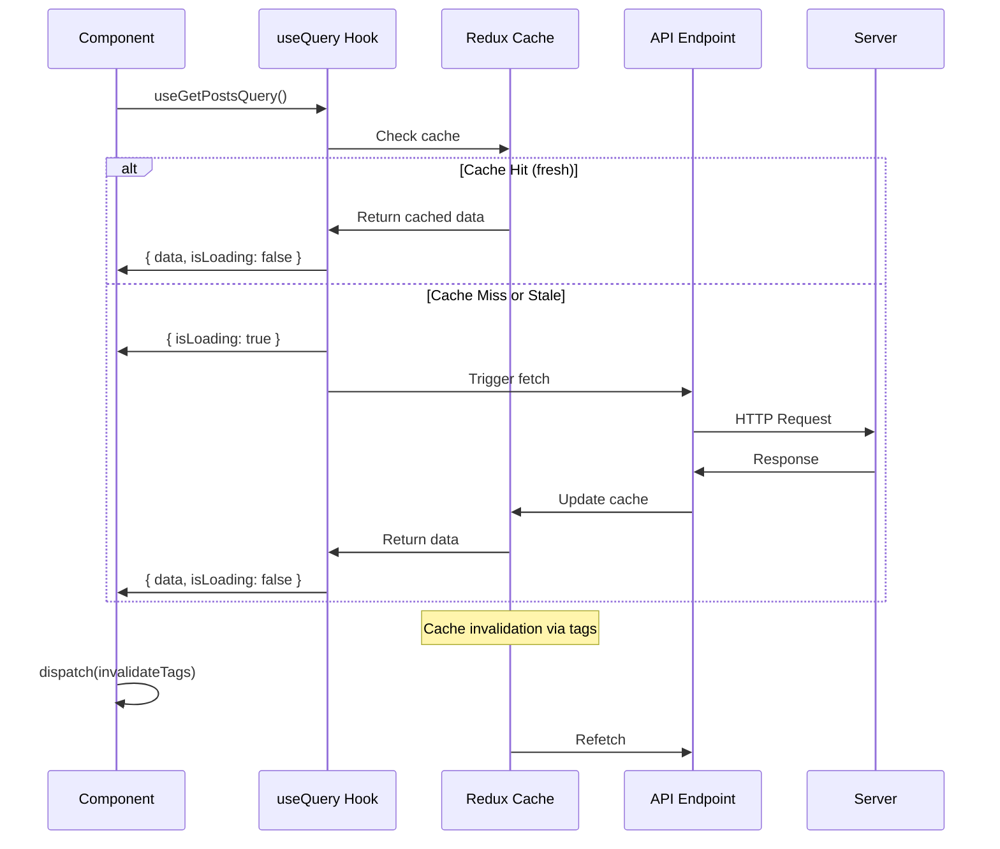
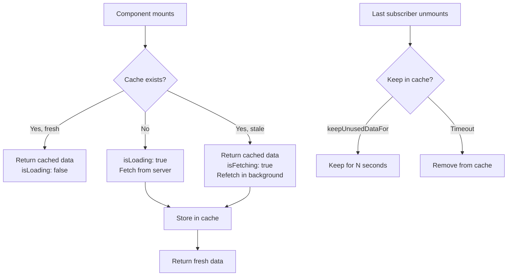

# RTK Query Essentials

**Complete guide to RTK Query for server state management in React**

---

## Metadata
```yaml
topic: RTK Query
difficulty: intermediate
prerequisites:
  - Redux Toolkit basics
  - REST APIs and HTTP
  - React hooks
  - TypeScript
related:
  - "[[01_Redux_Toolkit_Essentials]]"
  - "[[03_Testing_React_TL_and_MSW]]"
  - "[[04_Forms_and_Validation]]"
status: stable
last_updated: 2026-04-26
```

---

## Table of Contents
1. [What is RTK Query?](#what-is-rtk-query)
2. [Setup and Installation](#setup-and-installation)
3. [createApi and baseQuery](#createapi-and-basequery)
4. [Defining Endpoints](#defining-endpoints)
5. [Generated Hooks](#generated-hooks)
6. [Cache Behavior](#cache-behavior)
7. [Mutations and Optimistic Updates](#mutations-and-optimistic-updates)
8. [Error Handling](#error-handling)
9. [Authentication](#authentication)
10. [Code Splitting](#code-splitting)
11. [TypeScript Integration](#typescript-integration)
12. [Testing](#testing)
13. [Complete REST API Example](#complete-rest-api-example)
14. [Comparison with Alternatives](#comparison-with-alternatives)
15. [Common Pitfalls](#common-pitfalls)
16. [Best Practices](#best-practices)
17. [Interview Questions](#interview-questions)

---

## What is RTK Query?

### Overview

**RTK Query** is a powerful data fetching and caching tool built on Redux Toolkit:

- ✅ **Built on Redux Toolkit** - integrates seamlessly
- ✅ **Automatic caching** - smart cache invalidation
- ✅ **Auto-generated hooks** - `useGetPostsQuery`, etc.
- ✅ **TypeScript-first** - excellent type inference
- ✅ **Optimistic updates** - instant UI feedback
- ✅ **Polling & refetching** - keep data fresh
- ✅ **Request deduplication** - avoid duplicate requests

### vs React Query vs SWR vs Axios

| Feature | RTK Query | React Query | SWR | Axios + Redux |
|---------|-----------|-------------|-----|---------------|
| **Redux Integration** | ✅ Native | ⚠️ Separate | ⚠️ Separate | Manual |
| **Learning Curve** | Medium | Low-Medium | Low | High |
| **Bundle Size** | ~9 KB | ~13 KB | ~5 KB | ~15+ KB |
| **TypeScript** | ✅ Excellent | ✅ Excellent | ✅ Good | Manual |
| **Code Generation** | ✅ Hooks | ✅ Hooks | ✅ Hooks | ❌ Manual |
| **Caching** | ✅ Redux store | ✅ Separate cache | ✅ Separate cache | ❌ Manual |
| **DevTools** | ✅ Redux DevTools | ✅ React Query DevTools | ⚠️ Limited | ✅ Redux DevTools |
| **Optimistic Updates** | ✅ Built-in | ✅ Built-in | ⚠️ Manual | ❌ Manual |
| **Polling** | ✅ Yes | ✅ Yes | ✅ Yes | ❌ Manual |
| **Normalization** | ✅ Easy | ⚠️ Manual | ⚠️ Manual | ❌ Manual |
| **Best For** | Redux apps | Any React app | Small apps | Full control |

### RTK Query Data Flow



---

## Setup and Installation

### Installation

```bash
# RTK Query is included in Redux Toolkit
npm install @reduxjs/toolkit react-redux

# Optional: For OpenAPI/Swagger code generation
npm install --save-dev @rtk-query/codegen-openapi
```

### Basic Project Structure

```
src/
├── app/
│   ├── store.ts                # Store with API middleware
│   └── hooks.ts                # Typed hooks
├── services/
│   ├── api.ts                  # Base API slice
│   ├── posts.ts                # Posts endpoints (code split)
│   └── users.ts                # Users endpoints (code split)
├── features/
│   ├── posts/
│   │   └── PostsList.tsx       # Component using hooks
│   └── users/
│       └── UserProfile.tsx
└── main.tsx                    # Provider setup
```

---

## createApi and baseQuery

### Basic API Setup

```typescript
// services/api.ts
import { createApi, fetchBaseQuery } from '@reduxjs/toolkit/query/react';

export const api = createApi({
  reducerPath: 'api',
  baseQuery: fetchBaseQuery({ 
    baseUrl: 'https://jsonplaceholder.typicode.com'
  }),
  tagTypes: ['Post', 'User'],
  endpoints: (builder) => ({
    // Endpoints defined here or via code splitting
  })
});

export default api;
```

### Store Configuration

```typescript
// app/store.ts
import { configureStore } from '@reduxjs/toolkit';
import { api } from '../services/api';

export const store = configureStore({
  reducer: {
    // Add the generated reducer as a specific top-level slice
    [api.reducerPath]: api.reducer,
    // Add other reducers here
  },
  // Adding the api middleware enables caching, invalidation, polling
  middleware: (getDefaultMiddleware) =>
    getDefaultMiddleware().concat(api.middleware),
});

export type RootState = ReturnType<typeof store.getState>;
export type AppDispatch = typeof store.dispatch;
```

### Advanced baseQuery Configuration

```typescript
// services/api.ts
import { fetchBaseQuery } from '@reduxjs/toolkit/query/react';
import type { RootState } from '../app/store';

const baseQuery = fetchBaseQuery({
  baseUrl: import.meta.env.VITE_API_URL || 'http://localhost:3000/api',
  
  // Add auth token to every request
  prepareHeaders: (headers, { getState }) => {
    const token = (getState() as RootState).auth.token;
    
    if (token) {
      headers.set('Authorization', `Bearer ${token}`);
    }
    
    headers.set('Content-Type', 'application/json');
    return headers;
  },
  
  // Credentials for CORS
  credentials: 'include',
  
  // Timeout
  timeout: 10000,
});

export const api = createApi({
  reducerPath: 'api',
  baseQuery,
  tagTypes: ['Post', 'User', 'Comment'],
  endpoints: () => ({}), // Injected with code splitting
});
```

### Custom baseQuery with Error Handling

```typescript
// services/api.ts
import { fetchBaseQuery } from '@reduxjs/toolkit/query/react';
import type { BaseQueryFn, FetchArgs, FetchBaseQueryError } from '@reduxjs/toolkit/query';

const baseQueryWithReauth: BaseQueryFn<
  string | FetchArgs,
  unknown,
  FetchBaseQueryError
> = async (args, api, extraOptions) => {
  let result = await baseQuery(args, api, extraOptions);
  
  // Handle 401 Unauthorized - try to refresh token
  if (result.error && result.error.status === 401) {
    console.log('Token expired, refreshing...');
    
    // Try to get a new token
    const refreshResult = await baseQuery(
      { url: '/auth/refresh', method: 'POST' },
      api,
      extraOptions
    );
    
    if (refreshResult.data) {
      // Store the new token
      api.dispatch(setToken(refreshResult.data.token));
      
      // Retry the original query with new token
      result = await baseQuery(args, api, extraOptions);
    } else {
      // Refresh failed - logout
      api.dispatch(logout());
    }
  }
  
  return result;
};

export const api = createApi({
  reducerPath: 'api',
  baseQuery: baseQueryWithReauth,
  tagTypes: ['Post', 'User'],
  endpoints: () => ({}),
});
```

---

## Defining Endpoints

### Query vs Mutation

**Query**: Fetch data (GET requests)
**Mutation**: Modify data (POST/PUT/DELETE requests)

```typescript
// services/posts.ts
import { api } from './api';

interface Post {
  id: number;
  title: string;
  body: string;
  userId: number;
}

export const postsApi = api.injectEndpoints({
  endpoints: (builder) => ({
    // QUERY: Fetch all posts
    getPosts: builder.query<Post[], void>({
      query: () => '/posts',
      providesTags: ['Post'],
    }),
    
    // QUERY: Fetch single post
    getPost: builder.query<Post, number>({
      query: (id) => `/posts/${id}`,
      providesTags: (result, error, id) => [{ type: 'Post', id }],
    }),
    
    // MUTATION: Create post
    addPost: builder.mutation<Post, Partial<Post>>({
      query: (body) => ({
        url: '/posts',
        method: 'POST',
        body,
      }),
      invalidatesTags: ['Post'],
    }),
    
    // MUTATION: Update post
    updatePost: builder.mutation<Post, Partial<Post> & { id: number }>({
      query: ({ id, ...patch }) => ({
        url: `/posts/${id}`,
        method: 'PATCH',
        body: patch,
      }),
      invalidatesTags: (result, error, { id }) => [{ type: 'Post', id }],
    }),
    
    // MUTATION: Delete post
    deletePost: builder.mutation<void, number>({
      query: (id) => ({
        url: `/posts/${id}`,
        method: 'DELETE',
      }),
      invalidatesTags: (result, error, id) => [{ type: 'Post', id }],
    }),
  }),
});

// Export hooks for usage in components
export const {
  useGetPostsQuery,
  useGetPostQuery,
  useAddPostMutation,
  useUpdatePostMutation,
  useDeletePostMutation,
} = postsApi;
```

### Advanced Query Options

```typescript
export const postsApi = api.injectEndpoints({
  endpoints: (builder) => ({
    getPosts: builder.query<Post[], { page?: number; limit?: number }>({
      query: ({ page = 1, limit = 10 } = {}) => ({
        url: '/posts',
        params: { _page: page, _limit: limit },
      }),
      
      // Transform response before caching
      transformResponse: (response: Post[]) => {
        return response.map(post => ({
          ...post,
          title: post.title.toUpperCase(), // Example transformation
        }));
      },
      
      // Transform error
      transformErrorResponse: (response: { status: number; data: any }) => {
        return {
          status: response.status,
          message: response.data?.message || 'Unknown error',
        };
      },
      
      // Provide tags for cache invalidation
      providesTags: (result) =>
        result
          ? [
              ...result.map(({ id }) => ({ type: 'Post' as const, id })),
              { type: 'Post', id: 'LIST' },
            ]
          : [{ type: 'Post', id: 'LIST' }],
      
      // Keep unused data for 60 seconds
      keepUnusedDataFor: 60,
      
      // Merge new data with existing (for pagination)
      serializeQueryArgs: ({ queryArgs }) => {
        // Same cache key for all pages
        return 'posts-list';
      },
      
      merge: (currentCache, newItems) => {
        currentCache.push(...newItems);
      },
      
      forceRefetch: ({ currentArg, previousArg }) => {
        // Refetch if page changed
        return currentArg?.page !== previousArg?.page;
      },
    }),
    
    // Lazy query (fetch only when triggered)
    getPostsByUser: builder.query<Post[], number>({
      query: (userId) => `/posts?userId=${userId}`,
      // Only fetch when userId is provided
      skip: (userId) => !userId,
    }),
    
    // Query with headers
    getProtectedPost: builder.query<Post, number>({
      query: (id) => ({
        url: `/posts/${id}`,
        headers: {
          'X-Custom-Header': 'value',
        },
      }),
    }),
  }),
});
```

---

## Generated Hooks

### Query Hook Return Values

```typescript
import { useGetPostsQuery } from '../services/posts';

function PostsList() {
  const {
    data,           // Typed response data
    error,          // Error object
    isLoading,      // True on first fetch
    isFetching,     // True on any fetch (including refetch)
    isSuccess,      // True when data available
    isError,        // True when error occurred
    refetch,        // Function to manually refetch
    status,         // 'pending' | 'fulfilled' | 'rejected'
  } = useGetPostsQuery();
  
  // Loading state (first fetch)
  if (isLoading) return <div>Loading...</div>;
  
  // Error state
  if (isError) return <div>Error: {error.message}</div>;
  
  // Success state
  return (
    <div>
      {data.map(post => (
        <div key={post.id}>{post.title}</div>
      ))}
    </div>
  );
}
```

### Mutation Hook Return Values

```typescript
import { useAddPostMutation } from '../services/posts';

function AddPostForm() {
  const [
    addPost,          // Trigger function
    {
      data,           // Response data
      error,          // Error object
      isLoading,      // True while request in flight
      isSuccess,      // True when mutation succeeded
      isError,        // True when mutation failed
      reset,          // Reset mutation state
    }
  ] = useAddPostMutation();
  
  const handleSubmit = async (values: { title: string; body: string }) => {
    try {
      const result = await addPost(values).unwrap();
      console.log('Post created:', result);
    } catch (err) {
      console.error('Failed to create post:', err);
    }
  };
  
  return (
    <form onSubmit={handleSubmit}>
      {/* Form fields */}
      <button type="submit" disabled={isLoading}>
        {isLoading ? 'Creating...' : 'Create Post'}
      </button>
      {isSuccess && <div>Post created successfully!</div>}
      {isError && <div>Error: {error.message}</div>}
    </form>
  );
}
```

### Hook Options

```typescript
function PostsList() {
  const { data } = useGetPostsQuery(
    { page: 1, limit: 10 },
    {
      // Polling - refetch every 5 seconds
      pollingInterval: 5000,
      
      // Skip query if condition not met
      skip: !userId,
      
      // Refetch on window focus
      refetchOnFocus: true,
      
      // Refetch on reconnect
      refetchOnReconnect: true,
      
      // Refetch on mount if data is stale
      refetchOnMountOrArgChange: true, // or number of seconds
      
      // Select subset of data
      selectFromResult: ({ data, ...rest }) => ({
        ...rest,
        post: data?.find(p => p.id === selectedId),
      }),
    }
  );
}
```

### Lazy Queries

```typescript
import { useLazyGetPostQuery } from '../services/posts';

function SearchPosts() {
  const [trigger, result] = useLazyGetPostQuery();
  
  const handleSearch = (id: number) => {
    trigger(id); // Manually trigger query
  };
  
  return (
    <div>
      <button onClick={() => handleSearch(1)}>Load Post 1</button>
      {result.isLoading && <div>Loading...</div>}
      {result.data && <div>{result.data.title}</div>}
    </div>
  );
}
```

---

## Cache Behavior

### How Caching Works



### Tag-Based Invalidation

```typescript
export const api = createApi({
  baseQuery: fetchBaseQuery({ baseUrl: '/api' }),
  tagTypes: ['Post', 'User', 'Comment'],
  endpoints: (builder) => ({
    // PROVIDE tags (what this query provides)
    getPosts: builder.query<Post[], void>({
      query: () => '/posts',
      providesTags: (result) =>
        result
          ? [
              ...result.map(({ id }) => ({ type: 'Post' as const, id })),
              { type: 'Post', id: 'LIST' },
            ]
          : [{ type: 'Post', id: 'LIST' }],
    }),
    
    getPost: builder.query<Post, number>({
      query: (id) => `/posts/${id}`,
      providesTags: (result, error, id) => [{ type: 'Post', id }],
    }),
    
    // INVALIDATE tags (what this mutation affects)
    addPost: builder.mutation<Post, Partial<Post>>({
      query: (body) => ({
        url: '/posts',
        method: 'POST',
        body,
      }),
      // Invalidates all 'Post' queries
      invalidatesTags: [{ type: 'Post', id: 'LIST' }],
    }),
    
    updatePost: builder.mutation<Post, Partial<Post> & { id: number }>({
      query: ({ id, ...patch }) => ({
        url: `/posts/${id}`,
        method: 'PATCH',
        body: patch,
      }),
      // Invalidates specific post and list
      invalidatesTags: (result, error, { id }) => [
        { type: 'Post', id },
        { type: 'Post', id: 'LIST' },
      ],
    }),
    
    deletePost: builder.mutation<void, number>({
      query: (id) => ({
        url: `/posts/${id}`,
        method: 'DELETE',
      }),
      invalidatesTags: (result, error, id) => [
        { type: 'Post', id },
        { type: 'Post', id: 'LIST' },
      ],
    }),
  }),
});
```

**How it works:**
1. `getPosts` provides `{ type: 'Post', id: 'LIST' }` tag
2. `addPost` invalidates `{ type: 'Post', id: 'LIST' }` tag
3. RTK Query automatically refetches `getPosts` query

### Manual Cache Updates

```typescript
import { api } from '../services/api';
import { useAppDispatch } from '../app/hooks';

function MyComponent() {
  const dispatch = useAppDispatch();
  
  // Manually invalidate tags
  const handleInvalidate = () => {
    dispatch(api.util.invalidateTags(['Post']));
  };
  
  // Reset API state (clear all cache)
  const handleReset = () => {
    dispatch(api.util.resetApiState());
  };
  
  // Update cache entry directly
  const handleUpdateCache = () => {
    dispatch(
      api.util.updateQueryData('getPosts', undefined, (draft) => {
        draft.push({ id: 999, title: 'New Post', body: 'Body', userId: 1 });
      })
    );
  };
}
```

### Cache Entry Lifecycle

```typescript
export const postsApi = api.injectEndpoints({
  endpoints: (builder) => ({
    getPosts: builder.query<Post[], void>({
      query: () => '/posts',
      
      // Keep unused data in cache for 60 seconds (default: 60)
      keepUnusedDataFor: 60,
      
      // Callbacks
      onQueryStarted: async (arg, { dispatch, queryFulfilled }) => {
        console.log('Query started');
        try {
          const { data } = await queryFulfilled;
          console.log('Query succeeded:', data);
        } catch (err) {
          console.log('Query failed:', err);
        }
      },
      
      onCacheEntryAdded: async (
        arg,
        { cacheDataLoaded, cacheEntryRemoved, updateCachedData }
      ) => {
        // Wait for cache entry to be added
        await cacheDataLoaded;
        
        // WebSocket example: listen for updates
        const ws = new WebSocket('ws://localhost:8080');
        ws.onmessage = (event) => {
          updateCachedData((draft) => {
            // Update cache with WebSocket data
            draft.push(JSON.parse(event.data));
          });
        };
        
        // Cleanup when cache entry removed
        await cacheEntryRemoved;
        ws.close();
      },
    }),
  }),
});
```

---

## Mutations and Optimistic Updates

### Basic Mutation

```typescript
function EditPostForm({ post }: { post: Post }) {
  const [updatePost, { isLoading }] = useUpdatePostMutation();
  
  const handleSubmit = async (values: { title: string; body: string }) => {
    try {
      await updatePost({
        id: post.id,
        ...values,
      }).unwrap();
      
      alert('Post updated!');
    } catch (error) {
      alert('Failed to update post');
    }
  };
  
  return (
    <form onSubmit={handleSubmit}>
      {/* Form fields */}
    </form>
  );
}
```

### Optimistic Update

```typescript
export const postsApi = api.injectEndpoints({
  endpoints: (builder) => ({
    updatePost: builder.mutation<Post, Partial<Post> & { id: number }>({
      query: ({ id, ...patch }) => ({
        url: `/posts/${id}`,
        method: 'PATCH',
        body: patch,
      }),
      
      // Optimistic update
      async onQueryStarted({ id, ...patch }, { dispatch, queryFulfilled }) {
        // Update cache immediately (optimistic)
        const patchResult = dispatch(
          api.util.updateQueryData('getPost', id, (draft) => {
            Object.assign(draft, patch);
          })
        );
        
        try {
          await queryFulfilled;
          // Success - optimistic update is correct
        } catch {
          // Rollback optimistic update on error
          patchResult.undo();
        }
      },
    }),
    
    // Optimistic delete
    deletePost: builder.mutation<void, number>({
      query: (id) => ({
        url: `/posts/${id}`,
        method: 'DELETE',
      }),
      
      async onQueryStarted(id, { dispatch, queryFulfilled }) {
        // Optimistically remove from list
        const patchResult = dispatch(
          api.util.updateQueryData('getPosts', undefined, (draft) => {
            const index = draft.findIndex(post => post.id === id);
            if (index !== -1) {
              draft.splice(index, 1);
            }
          })
        );
        
        try {
          await queryFulfilled;
        } catch {
          patchResult.undo();
        }
      },
    }),
  }),
});
```

### Pessimistic Update (Wait for Server)

```typescript
export const postsApi = api.injectEndpoints({
  endpoints: (builder) => ({
    addPost: builder.mutation<Post, Partial<Post>>({
      query: (body) => ({
        url: '/posts',
        method: 'POST',
        body,
      }),
      
      // Pessimistic: Update cache AFTER server response
      async onQueryStarted(arg, { dispatch, queryFulfilled }) {
        try {
          const { data: newPost } = await queryFulfilled;
          
          // Now update cache with server response
          dispatch(
            api.util.updateQueryData('getPosts', undefined, (draft) => {
              draft.unshift(newPost);
            })
          );
        } catch {
          // Handle error
        }
      },
    }),
  }),
});
```

---

## Error Handling

### Typed Errors

```typescript
// Define error type
interface ApiError {
  status: number;
  data: {
    message: string;
    errors?: Record<string, string[]>;
  };
}

// In component
function PostsList() {
  const { data, error, isError } = useGetPostsQuery();
  
  if (isError) {
    const apiError = error as ApiError;
    
    if ('status' in apiError) {
      if (apiError.status === 404) {
        return <div>Posts not found</div>;
      }
      if (apiError.status === 500) {
        return <div>Server error: {apiError.data.message}</div>;
      }
    }
    
    return <div>Unknown error</div>;
  }
  
  // ...
}
```

### Global Error Handling

```typescript
// services/api.ts
import { createApi, fetchBaseQuery } from '@reduxjs/toolkit/query/react';

const baseQuery = fetchBaseQuery({ baseUrl: '/api' });

const baseQueryWithErrorHandling = async (args, api, extraOptions) => {
  const result = await baseQuery(args, api, extraOptions);
  
  if (result.error) {
    // Log to error tracking service
    console.error('API Error:', result.error);
    
    // Show toast notification
    if (result.error.status === 500) {
      toast.error('Server error occurred');
    }
    
    // Redirect on 401
    if (result.error.status === 401) {
      window.location.href = '/login';
    }
  }
  
  return result;
};

export const api = createApi({
  reducerPath: 'api',
  baseQuery: baseQueryWithErrorHandling,
  endpoints: () => ({}),
});
```

### Retry Logic

```typescript
import { retry } from '@reduxjs/toolkit/query/react';

const baseQuery = fetchBaseQuery({ baseUrl: '/api' });

// Retry failed requests
const baseQueryWithRetry = retry(
  baseQuery,
  {
    maxRetries: 3,
  }
);

export const api = createApi({
  reducerPath: 'api',
  baseQuery: baseQueryWithRetry,
  endpoints: () => ({}),
});

// Or per-endpoint retry
export const postsApi = api.injectEndpoints({
  endpoints: (builder) => ({
    getPosts: builder.query<Post[], void>({
      query: () => '/posts',
      
      // Retry this endpoint up to 5 times
      extraOptions: {
        maxRetries: 5,
      },
    }),
  }),
});
```

---

## Authentication

### Token-Based Auth

```typescript
// services/api.ts
import { fetchBaseQuery } from '@reduxjs/toolkit/query/react';
import type { RootState } from '../app/store';

const baseQuery = fetchBaseQuery({
  baseUrl: '/api',
  prepareHeaders: (headers, { getState }) => {
    // Get token from Redux state
    const token = (getState() as RootState).auth.token;
    
    if (token) {
      headers.set('Authorization', `Bearer ${token}`);
    }
    
    return headers;
  },
});

export const api = createApi({
  reducerPath: 'api',
  baseQuery,
  endpoints: () => ({}),
});
```

### Token Refresh Flow

```typescript
// services/api.ts
import { fetchBaseQuery } from '@reduxjs/toolkit/query/react';
import type { BaseQueryFn, FetchArgs, FetchBaseQueryError } from '@reduxjs/toolkit/query';
import { setToken, logout } from '../features/auth/authSlice';

const baseQuery = fetchBaseQuery({
  baseUrl: '/api',
  prepareHeaders: (headers, { getState }) => {
    const token = (getState() as RootState).auth.token;
    if (token) {
      headers.set('Authorization', `Bearer ${token}`);
    }
    return headers;
  },
});

const baseQueryWithReauth: BaseQueryFn<
  string | FetchArgs,
  unknown,
  FetchBaseQueryError
> = async (args, api, extraOptions) => {
  let result = await baseQuery(args, api, extraOptions);
  
  if (result.error && result.error.status === 401) {
    console.log('Refreshing token...');
    
    // Get refresh token
    const refreshToken = (api.getState() as RootState).auth.refreshToken;
    
    // Try to refresh
    const refreshResult = await baseQuery(
      {
        url: '/auth/refresh',
        method: 'POST',
        body: { refreshToken },
      },
      api,
      extraOptions
    );
    
    if (refreshResult.data) {
      // Store new token
      api.dispatch(setToken(refreshResult.data));
      
      // Retry original query with new token
      result = await baseQuery(args, api, extraOptions);
    } else {
      // Refresh failed - logout
      api.dispatch(logout());
    }
  }
  
  return result;
};

export const api = createApi({
  reducerPath: 'api',
  baseQuery: baseQueryWithReauth,
  tagTypes: ['User', 'Post'],
  endpoints: () => ({}),
});
```

### Auth Endpoints

```typescript
// services/auth.ts
import { api } from './api';

interface LoginRequest {
  email: string;
  password: string;
}

interface AuthResponse {
  user: {
    id: string;
    email: string;
    name: string;
  };
  token: string;
  refreshToken: string;
}

export const authApi = api.injectEndpoints({
  endpoints: (builder) => ({
    login: builder.mutation<AuthResponse, LoginRequest>({
      query: (credentials) => ({
        url: '/auth/login',
        method: 'POST',
        body: credentials,
      }),
      
      // Update auth state on success
      async onQueryStarted(arg, { dispatch, queryFulfilled }) {
        try {
          const { data } = await queryFulfilled;
          dispatch(setToken(data.token));
          dispatch(setUser(data.user));
        } catch (err) {
          // Handle error
        }
      },
    }),
    
    logout: builder.mutation<void, void>({
      query: () => ({
        url: '/auth/logout',
        method: 'POST',
      }),
      
      async onQueryStarted(arg, { dispatch }) {
        dispatch(clearAuth());
        dispatch(api.util.resetApiState()); // Clear all cache
      },
    }),
    
    getProfile: builder.query<User, void>({
      query: () => '/auth/profile',
      providesTags: ['User'],
    }),
  }),
});

export const { useLoginMutation, useLogoutMutation, useGetProfileQuery } = authApi;
```

---

## Code Splitting

### Injecting Endpoints

```typescript
// services/api.ts (Base API)
import { createApi, fetchBaseQuery } from '@reduxjs/toolkit/query/react';

export const api = createApi({
  reducerPath: 'api',
  baseQuery: fetchBaseQuery({ baseUrl: '/api' }),
  tagTypes: ['Post', 'User', 'Comment'],
  endpoints: () => ({}), // Empty - endpoints injected elsewhere
});

export default api;
```

```typescript
// services/posts.ts (Code-split endpoints)
import { api } from './api';

interface Post {
  id: number;
  title: string;
  body: string;
}

export const postsApi = api.injectEndpoints({
  endpoints: (builder) => ({
    getPosts: builder.query<Post[], void>({
      query: () => '/posts',
      providesTags: ['Post'],
    }),
    
    addPost: builder.mutation<Post, Partial<Post>>({
      query: (body) => ({
        url: '/posts',
        method: 'POST',
        body,
      }),
      invalidatesTags: ['Post'],
    }),
  }),
});

export const { useGetPostsQuery, useAddPostMutation } = postsApi;
```

```typescript
// services/users.ts (Another split)
import { api } from './api';

export const usersApi = api.injectEndpoints({
  endpoints: (builder) => ({
    getUsers: builder.query<User[], void>({
      query: () => '/users',
      providesTags: ['User'],
    }),
  }),
});

export const { useGetUsersQuery } = usersApi;
```

### Lazy Loading Endpoints

```typescript
// features/posts/PostsPage.tsx
import React, { Suspense, lazy } from 'react';

// Lazy load posts API
const PostsList = lazy(() => import('./PostsList'));

export function PostsPage() {
  return (
    <Suspense fallback={<div>Loading...</div>}>
      <PostsList />
    </Suspense>
  );
}
```

```typescript
// features/posts/PostsList.tsx
import { useGetPostsQuery } from '../../services/posts'; // Imports API only when needed

export default function PostsList() {
  const { data: posts } = useGetPostsQuery();
  
  return (
    <div>
      {posts?.map(post => (
        <div key={post.id}>{post.title}</div>
      ))}
    </div>
  );
}
```

---

## TypeScript Integration

### Typing Responses

```typescript
// types/api.ts
export interface Post {
  id: number;
  title: string;
  body: string;
  userId: number;
  createdAt: string;
}

export interface User {
  id: number;
  name: string;
  email: string;
}

export interface PaginatedResponse<T> {
  data: T[];
  total: number;
  page: number;
  pageSize: number;
}

export interface ApiError {
  status: number;
  data: {
    message: string;
    errors?: Record<string, string[]>;
  };
}
```

```typescript
// services/posts.ts
import { api } from './api';
import type { Post, PaginatedResponse } from '../types/api';

export const postsApi = api.injectEndpoints({
  endpoints: (builder) => ({
    // Type query: <ReturnType, ArgumentType>
    getPosts: builder.query<PaginatedResponse<Post>, { page: number }>({
      query: ({ page }) => ({
        url: '/posts',
        params: { page },
      }),
    }),
    
    // Type mutation: <ReturnType, ArgumentType, ErrorType>
    addPost: builder.mutation<Post, Partial<Post>>({
      query: (body) => ({
        url: '/posts',
        method: 'POST',
        body,
      }),
    }),
  }),
});

export const { useGetPostsQuery, useAddPostMutation } = postsApi;
```

### Auto-Generated Types

```typescript
// Infer types from hooks
import { useGetPostsQuery } from '../services/posts';

function PostsList() {
  const {
    data,     // Type: PaginatedResponse<Post> | undefined
    error,    // Type: FetchBaseQueryError | SerializedError
    isLoading // Type: boolean
  } = useGetPostsQuery({ page: 1 });
  
  // TypeScript knows the shape of data
  if (data) {
    console.log(data.total); // ✅ OK
    console.log(data.foo);   // ❌ Error: Property 'foo' does not exist
  }
}
```

### Entity Adapter (Normalized State)

```typescript
// services/posts.ts
import { createEntityAdapter } from '@reduxjs/toolkit';
import { api } from './api';

interface Post {
  id: number;
  title: string;
  body: string;
}

// Create adapter
const postsAdapter = createEntityAdapter<Post>({
  selectId: (post) => post.id,
  sortComparer: (a, b) => b.id - a.id, // Sort by ID descending
});

const initialState = postsAdapter.getInitialState({
  status: 'idle' as 'idle' | 'loading' | 'succeeded' | 'failed',
});

export const postsApi = api.injectEndpoints({
  endpoints: (builder) => ({
    getPosts: builder.query({
      query: () => '/posts',
      
      // Transform to normalized state
      transformResponse: (response: Post[]) => {
        return postsAdapter.setAll(initialState, response);
      },
    }),
  }),
});

// Selectors
export const {
  selectAll: selectAllPosts,
  selectById: selectPostById,
  selectIds: selectPostIds,
} = postsAdapter.getSelectors((state: RootState) => state.api.queries['getPosts']?.data ?? initialState);
```

---

## Testing

### Testing with Mock Service Worker (MSW)

```typescript
// mocks/handlers.ts
import { rest } from 'msw';

export const handlers = [
  rest.get('/api/posts', (req, res, ctx) => {
    return res(
      ctx.status(200),
      ctx.json([
        { id: 1, title: 'Test Post', body: 'Body', userId: 1 },
      ])
    );
  }),
  
  rest.post('/api/posts', (req, res, ctx) => {
    return res(
      ctx.status(201),
      ctx.json({ id: 2, ...req.body })
    );
  }),
  
  rest.delete('/api/posts/:id', (req, res, ctx) => {
    return res(ctx.status(204));
  }),
];
```

```typescript
// setupTests.ts
import { setupServer } from 'msw/node';
import { handlers } from './mocks/handlers';

export const server = setupServer(...handlers);

beforeAll(() => server.listen());
afterEach(() => server.resetHandlers());
afterAll(() => server.close());
```

### Testing Components with RTK Query

```typescript
// features/posts/PostsList.test.tsx
import { render, screen, waitFor } from '@testing-library/react';
import { Provider } from 'react-redux';
import { configureStore } from '@reduxjs/toolkit';
import { api } from '../../services/api';
import PostsList from './PostsList';

function renderWithProvider(component: React.ReactElement) {
  const store = configureStore({
    reducer: {
      [api.reducerPath]: api.reducer,
    },
    middleware: (getDefaultMiddleware) =>
      getDefaultMiddleware().concat(api.middleware),
  });
  
  return {
    ...render(<Provider store={store}>{component}</Provider>),
    store,
  };
}

describe('PostsList', () => {
  it('renders posts from API', async () => {
    renderWithProvider(<PostsList />);
    
    // Wait for data to load
    await waitFor(() => {
      expect(screen.getByText('Test Post')).toBeInTheDocument();
    });
  });
  
  it('handles error state', async () => {
    // Override MSW handler for error
    server.use(
      rest.get('/api/posts', (req, res, ctx) => {
        return res(ctx.status(500), ctx.json({ message: 'Server error' }));
      })
    );
    
    renderWithProvider(<PostsList />);
    
    await waitFor(() => {
      expect(screen.getByText(/error/i)).toBeInTheDocument();
    });
  });
});
```

### Testing Mutations

```typescript
// features/posts/AddPostForm.test.tsx
import { render, screen, waitFor } from '@testing-library/react';
import userEvent from '@testing-library/user-event';
import { Provider } from 'react-redux';
import { configureStore } from '@reduxjs/toolkit';
import { api } from '../../services/api';
import AddPostForm from './AddPostForm';

test('creates post on submit', async () => {
  const user = userEvent.setup();
  const store = configureStore({
    reducer: { [api.reducerPath]: api.reducer },
    middleware: (gDM) => gDM().concat(api.middleware),
  });
  
  render(
    <Provider store={store}>
      <AddPostForm />
    </Provider>
  );
  
  // Fill form
  await user.type(screen.getByLabelText(/title/i), 'New Post');
  await user.type(screen.getByLabelText(/body/i), 'Post body');
  
  // Submit
  await user.click(screen.getByRole('button', { name: /create/i }));
  
  // Check for success message
  await waitFor(() => {
    expect(screen.getByText(/created successfully/i)).toBeInTheDocument();
  });
});
```

---

## Complete REST API Example

### Full CRUD API with Authentication

```typescript
// services/api.ts
import { createApi, fetchBaseQuery } from '@reduxjs/toolkit/query/react';
import type { RootState } from '../app/store';

const baseQuery = fetchBaseQuery({
  baseUrl: import.meta.env.VITE_API_URL || 'http://localhost:3000/api',
  prepareHeaders: (headers, { getState }) => {
    const token = (getState() as RootState).auth.token;
    if (token) {
      headers.set('Authorization', `Bearer ${token}`);
    }
    return headers;
  },
});

export const api = createApi({
  reducerPath: 'api',
  baseQuery,
  tagTypes: ['Post', 'User', 'Comment'],
  endpoints: () => ({}),
});

export default api;
```

```typescript
// services/posts.ts
import { api } from './api';

export interface Post {
  id: number;
  title: string;
  body: string;
  authorId: number;
  createdAt: string;
  updatedAt: string;
}

export interface CreatePostDto {
  title: string;
  body: string;
}

export interface UpdatePostDto {
  title?: string;
  body?: string;
}

export const postsApi = api.injectEndpoints({
  endpoints: (builder) => ({
    // Get all posts
    getPosts: builder.query<Post[], { page?: number; limit?: number }>({
      query: ({ page = 1, limit = 10 } = {}) => ({
        url: '/posts',
        params: { page, limit },
      }),
      providesTags: (result) =>
        result
          ? [
              ...result.map(({ id }) => ({ type: 'Post' as const, id })),
              { type: 'Post', id: 'LIST' },
            ]
          : [{ type: 'Post', id: 'LIST' }],
    }),
    
    // Get single post
    getPost: builder.query<Post, number>({
      query: (id) => `/posts/${id}`,
      providesTags: (result, error, id) => [{ type: 'Post', id }],
    }),
    
    // Create post
    createPost: builder.mutation<Post, CreatePostDto>({
      query: (body) => ({
        url: '/posts',
        method: 'POST',
        body,
      }),
      invalidatesTags: [{ type: 'Post', id: 'LIST' }],
      
      // Optimistic update
      async onQueryStarted(newPost, { dispatch, queryFulfilled }) {
        const tempId = Date.now();
        const optimisticPost: Post = {
          id: tempId,
          ...newPost,
          authorId: 0,
          createdAt: new Date().toISOString(),
          updatedAt: new Date().toISOString(),
        };
        
        const patchResult = dispatch(
          api.util.updateQueryData('getPosts', {}, (draft) => {
            draft.unshift(optimisticPost);
          })
        );
        
        try {
          await queryFulfilled;
        } catch {
          patchResult.undo();
        }
      },
    }),
    
    // Update post
    updatePost: builder.mutation<Post, { id: number; data: UpdatePostDto }>({
      query: ({ id, data }) => ({
        url: `/posts/${id}`,
        method: 'PATCH',
        body: data,
      }),
      invalidatesTags: (result, error, { id }) => [
        { type: 'Post', id },
        { type: 'Post', id: 'LIST' },
      ],
    }),
    
    // Delete post
    deletePost: builder.mutation<void, number>({
      query: (id) => ({
        url: `/posts/${id}`,
        method: 'DELETE',
      }),
      invalidatesTags: (result, error, id) => [
        { type: 'Post', id },
        { type: 'Post', id: 'LIST' },
      ],
    }),
    
    // Get posts by user
    getPostsByUser: builder.query<Post[], number>({
      query: (userId) => `/users/${userId}/posts`,
      providesTags: (result, error, userId) => [
        { type: 'Post', id: `USER_${userId}` },
      ],
    }),
  }),
});

export const {
  useGetPostsQuery,
  useGetPostQuery,
  useCreatePostMutation,
  useUpdatePostMutation,
  useDeletePostMutation,
  useGetPostsByUserQuery,
} = postsApi;
```

```typescript
// features/posts/PostsList.tsx
import React, { useState } from 'react';
import {
  useGetPostsQuery,
  useDeletePostMutation,
  useCreatePostMutation,
} from '../../services/posts';

export function PostsList() {
  const [page, setPage] = useState(1);
  const { data: posts, isLoading, error } = useGetPostsQuery({ page, limit: 10 });
  const [deletePost] = useDeletePostMutation();
  const [createPost, { isLoading: isCreating }] = useCreatePostMutation();
  
  const [newTitle, setNewTitle] = useState('');
  const [newBody, setNewBody] = useState('');
  
  const handleDelete = async (id: number) => {
    if (confirm('Delete this post?')) {
      try {
        await deletePost(id).unwrap();
      } catch (err) {
        alert('Failed to delete post');
      }
    }
  };
  
  const handleCreate = async (e: React.FormEvent) => {
    e.preventDefault();
    
    if (!newTitle.trim() || !newBody.trim()) return;
    
    try {
      await createPost({ title: newTitle, body: newBody }).unwrap();
      setNewTitle('');
      setNewBody('');
    } catch (err) {
      alert('Failed to create post');
    }
  };
  
  if (isLoading) return <div>Loading...</div>;
  if (error) return <div>Error loading posts</div>;
  
  return (
    <div className="posts-container">
      <h1>Posts</h1>
      
      {/* Create Form */}
      <form onSubmit={handleCreate} className="create-form">
        <h2>Create Post</h2>
        <input
          type="text"
          placeholder="Title"
          value={newTitle}
          onChange={(e) => setNewTitle(e.target.value)}
        />
        <textarea
          placeholder="Body"
          value={newBody}
          onChange={(e) => setNewBody(e.target.value)}
        />
        <button type="submit" disabled={isCreating}>
          {isCreating ? 'Creating...' : 'Create Post'}
        </button>
      </form>
      
      {/* Posts List */}
      <div className="posts-list">
        {posts?.map(post => (
          <div key={post.id} className="post-card">
            <h3>{post.title}</h3>
            <p>{post.body}</p>
            <div className="post-meta">
              <small>Posted: {new Date(post.createdAt).toLocaleDateString()}</small>
              <button onClick={() => handleDelete(post.id)}>Delete</button>
            </div>
          </div>
        ))}
      </div>
      
      {/* Pagination */}
      <div className="pagination">
        <button onClick={() => setPage(p => Math.max(1, p - 1))} disabled={page === 1}>
          Previous
        </button>
        <span>Page {page}</span>
        <button onClick={() => setPage(p => p + 1)}>Next</button>
      </div>
    </div>
  );
}
```

---

## Comparison with Alternatives

### RTK Query vs React Query vs SWR

**Bundle Size:**
- RTK Query: ~9 KB (gzipped)
- React Query: ~13 KB (gzipped)
- SWR: ~5 KB (gzipped)

**Code Comparison:**

```typescript
// RTK Query
const { data, isLoading } = useGetPostsQuery();

// React Query
const { data, isLoading } = useQuery(['posts'], () => fetch('/api/posts').then(r => r.json()));

// SWR
const { data, isLoading } = useSWR('/api/posts', fetcher);
```

**When to Choose:**

| Use Case | Recommendation |
|----------|----------------|
| Already using Redux | ✅ RTK Query |
| New project, no Redux | React Query or SWR |
| Small app, simple caching | SWR |
| Complex state + server data | RTK Query |
| Need normalized caching | RTK Query (Entity Adapter) |
| GraphQL | React Query (better support) |

---

## Common Pitfalls

### 1. Forgetting to Add Middleware

```typescript
// ❌ WRONG: Missing middleware
const store = configureStore({
  reducer: {
    [api.reducerPath]: api.reducer,
  },
  // Missing: middleware
});

// ✅ CORRECT
const store = configureStore({
  reducer: {
    [api.reducerPath]: api.reducer,
  },
  middleware: (getDefaultMiddleware) =>
    getDefaultMiddleware().concat(api.middleware),
});
```

### 2. Incorrect Tag Invalidation

```typescript
// ❌ WRONG: Invalidates all posts, even unrelated ones
invalidatesTags: ['Post']

// ✅ CORRECT: Invalidate specific post and list
invalidatesTags: (result, error, id) => [
  { type: 'Post', id },
  { type: 'Post', id: 'LIST' },
]
```

### 3. Not Handling Errors

```typescript
// ❌ WRONG: No error handling
const [updatePost] = useUpdatePostMutation();

onClick={() => updatePost({ id, title: 'New' })}

// ✅ CORRECT: Handle errors
const [updatePost] = useUpdatePostMutation();

const handleUpdate = async () => {
  try {
    await updatePost({ id, title: 'New' }).unwrap();
    toast.success('Updated!');
  } catch (err) {
    toast.error('Failed to update');
  }
};
```

### 4. Overusing Polling

```typescript
// ❌ BAD: Polling every second (too frequent)
const { data } = useGetPostsQuery(undefined, {
  pollingInterval: 1000,
});

// ✅ GOOD: Use refetchOnFocus instead
const { data } = useGetPostsQuery(undefined, {
  refetchOnFocus: true,
  refetchOnReconnect: true,
});
```

### 5. Not Using TypeScript Properly

```typescript
// ❌ WRONG: No types
const postsApi = api.injectEndpoints({
  endpoints: (builder) => ({
    getPosts: builder.query({
      query: () => '/posts',
    }),
  }),
});

// ✅ CORRECT: Typed
const postsApi = api.injectEndpoints({
  endpoints: (builder) => ({
    getPosts: builder.query<Post[], void>({
      query: () => '/posts',
    }),
  }),
});
```

---

## Best Practices

### 1. **Use Code Splitting**

```typescript
// Keep base API small
// services/api.ts
export const api = createApi({
  endpoints: () => ({}), // Empty
});

// Inject endpoints per feature
// services/posts.ts
export const postsApi = api.injectEndpoints({ ... });
```

### 2. **Normalize State for Relationships**

```typescript
// Use Entity Adapter for normalized data
const postsAdapter = createEntityAdapter<Post>();

const postsApi = api.injectEndpoints({
  endpoints: (builder) => ({
    getPosts: builder.query({
      transformResponse: (response: Post[]) => {
        return postsAdapter.setAll(initialState, response);
      },
    }),
  }),
});
```

### 3. **Use Optimistic Updates for Better UX**

```typescript
// Update UI immediately, rollback on error
onQueryStarted: async (newData, { dispatch, queryFulfilled }) => {
  const patch = dispatch(api.util.updateQueryData(...));
  try {
    await queryFulfilled;
  } catch {
    patch.undo();
  }
}
```

### 4. **Type Everything**

```typescript
// Define types
interface Post { ... }
interface CreatePostDto { ... }

// Use in endpoints
builder.mutation<Post, CreatePostDto>({ ... })
```

### 5. **Handle Loading and Error States**

```typescript
const { data, isLoading, isError, error } = useGetPostsQuery();

if (isLoading) return <Spinner />;
if (isError) return <ErrorMessage error={error} />;
if (!data) return <EmptyState />;

return <PostsList posts={data} />;
```

---

## Interview Questions

### Q1: Explain how RTK Query caching works.

**Answer:**

RTK Query uses **tag-based cache invalidation**:

1. **Queries provide tags** (what data they contain):
```typescript
getPosts: builder.query({
  query: () => '/posts',
  providesTags: [{ type: 'Post', id: 'LIST' }],
})
```

2. **Mutations invalidate tags** (what data they affect):
```typescript
addPost: builder.mutation({
  query: (body) => ({ url: '/posts', method: 'POST', body }),
  invalidatesTags: [{ type: 'Post', id: 'LIST' }],
})
```

3. **When tags invalidated, queries refetch automatically**:
```
User creates post → addPost mutation
  → Invalidates 'Post LIST' tag
  → getPosts query refetches automatically
  → UI updates
```

**Cache Entry Lifecycle:**
- Data fetched → Stored in Redux state
- Component unmounts → `keepUnusedDataFor` timer starts (default 60s)
- Timer expires → Data removed from cache
- Component remounts → Fetch from server again

---

### Q2: What's the difference between a query and a mutation in RTK Query?

**Answer:**

| Query | Mutation |
|-------|----------|
| **Purpose** | Fetch data | Modify data |
| **HTTP Methods** | GET | POST/PUT/PATCH/DELETE |
| **Caching** | Cached automatically | Not cached |
| **Refetching** | Auto-refetch on invalidation | Manual trigger |
| **Hook** | `useGetPostsQuery()` | `useAddPostMutation()` |
| **Return** | `{ data, isLoading, ... }` | `[trigger, { data, isLoading, ... }]` |
| **Usage** | Runs automatically on mount | Call trigger function |

**Example:**
```typescript
// Query - runs automatically
const { data } = useGetPostsQuery();

// Mutation - manual trigger
const [addPost] = useAddPostMutation();
const handleClick = () => addPost({ title: 'New' });
```

---

### Q3: How do you implement optimistic updates in RTK Query?

**Answer:**

Optimistic updates immediately update the UI before the server responds:

```typescript
updatePost: builder.mutation({
  query: ({ id, ...patch }) => ({
    url: `/posts/${id}`,
    method: 'PATCH',
    body: patch,
  }),
  
  async onQueryStarted({ id, ...patch }, { dispatch, queryFulfilled }) {
    // 1. Optimistically update cache
    const patchResult = dispatch(
      api.util.updateQueryData('getPost', id, (draft) => {
        Object.assign(draft, patch);
      })
    );
    
    try {
      // 2. Wait for server response
      await queryFulfilled;
      // 3. Success - optimistic update is correct
    } catch {
      // 4. Error - rollback optimistic update
      patchResult.undo();
    }
  },
})
```

**Steps:**
1. Update cache immediately (user sees change instantly)
2. Send request to server
3. On success: keep optimistic update
4. On error: rollback with `undo()`

---

### Q4: How do you handle authentication with RTK Query?

**Answer:**

**1. Add token to requests:**
```typescript
const baseQuery = fetchBaseQuery({
  baseUrl: '/api',
  prepareHeaders: (headers, { getState }) => {
    const token = (getState() as RootState).auth.token;
    if (token) {
      headers.set('Authorization', `Bearer ${token}`);
    }
    return headers;
  },
});
```

**2. Handle token refresh on 401:**
```typescript
const baseQueryWithReauth = async (args, api, extraOptions) => {
  let result = await baseQuery(args, api, extraOptions);
  
  if (result.error?.status === 401) {
    // Refresh token
    const refreshResult = await baseQuery('/auth/refresh', api, extraOptions);
    
    if (refreshResult.data) {
      api.dispatch(setToken(refreshResult.data));
      result = await baseQuery(args, api, extraOptions); // Retry
    } else {
      api.dispatch(logout());
    }
  }
  
  return result;
};
```

**3. Clear cache on logout:**
```typescript
logout: builder.mutation({
  query: () => ({ url: '/auth/logout', method: 'POST' }),
  async onQueryStarted(arg, { dispatch }) {
    dispatch(api.util.resetApiState()); // Clear all cache
  },
})
```

---

### Q5: When should you use RTK Query vs React Query?

**Answer:**

**Use RTK Query when:**
- ✅ Already using Redux Toolkit
- ✅ Need Redux DevTools for all state
- ✅ Want single source of truth (Redux store)
- ✅ Need normalized caching (Entity Adapter)
- ✅ Complex client state + server state

**Use React Query when:**
- ✅ New project, not using Redux
- ✅ Prefer standalone solution
- ✅ GraphQL (better GraphQL support)
- ✅ Only managing server state
- ✅ Want smaller bundle size

**Code Comparison:**

```typescript
// RTK Query
const { data } = useGetPostsQuery();

// React Query
const { data } = useQuery({
  queryKey: ['posts'],
  queryFn: () => fetch('/api/posts').then(r => r.json())
});
```

**Both are excellent choices** - decision often comes down to whether you're using Redux.

---

### Q6: How do you test components that use RTK Query?

**Answer:**

**Use Mock Service Worker (MSW):**

```typescript
// setupTests.ts
import { setupServer } from 'msw/node';
import { rest } from 'msw';

export const server = setupServer(
  rest.get('/api/posts', (req, res, ctx) => {
    return res(ctx.json([{ id: 1, title: 'Test' }]));
  })
);

beforeAll(() => server.listen());
afterEach(() => server.resetHandlers());
afterAll(() => server.close());
```

**Test component:**
```typescript
import { render, screen, waitFor } from '@testing-library/react';
import { Provider } from 'react-redux';
import { configureStore } from '@reduxjs/toolkit';
import { api } from './services/api';
import PostsList from './PostsList';

test('renders posts', async () => {
  const store = configureStore({
    reducer: { [api.reducerPath]: api.reducer },
    middleware: (gDM) => gDM().concat(api.middleware),
  });
  
  render(
    <Provider store={store}>
      <PostsList />
    </Provider>
  );
  
  await waitFor(() => {
    expect(screen.getByText('Test')).toBeInTheDocument();
  });
});
```

**Override for error:**
```typescript
test('handles error', async () => {
  server.use(
    rest.get('/api/posts', (req, res, ctx) => {
      return res(ctx.status(500));
    })
  );
  
  // Test error UI
});
```

---

### Q7: Explain `providesTags` and `invalidatesTags` with an example.

**Answer:**

Tags create a **dependency graph** between queries and mutations:

```typescript
const api = createApi({
  tagTypes: ['Post'],
  endpoints: (builder) => ({
    // PROVIDES tags
    getPosts: builder.query<Post[], void>({
      query: () => '/posts',
      providesTags: (result) =>
        result
          ? [
              ...result.map(({ id }) => ({ type: 'Post', id })),
              { type: 'Post', id: 'LIST' },
            ]
          : [{ type: 'Post', id: 'LIST' }],
    }),
    
    getPost: builder.query<Post, number>({
      query: (id) => `/posts/${id}`,
      providesTags: (result, error, id) => [{ type: 'Post', id }],
    }),
    
    // INVALIDATES tags
    addPost: builder.mutation<Post, Partial<Post>>({
      query: (body) => ({ url: '/posts', method: 'POST', body }),
      invalidatesTags: [{ type: 'Post', id: 'LIST' }],
    }),
    
    updatePost: builder.mutation<Post, { id: number; data: Partial<Post> }>({
      query: ({ id, data }) => ({
        url: `/posts/${id}`,
        method: 'PATCH',
        body: data,
      }),
      invalidatesTags: (result, error, { id }) => [
        { type: 'Post', id },        // Specific post
        { type: 'Post', id: 'LIST' }, // List of all posts
      ],
    }),
  }),
});
```

**Flow:**
1. `getPosts` provides `{ type: 'Post', id: 'LIST' }` and `{ type: 'Post', id: 1 }`, etc.
2. `addPost` invalidates `{ type: 'Post', id: 'LIST' }`
3. RTK Query refetches `getPosts` automatically
4. `updatePost(id: 5)` invalidates `{ type: 'Post', id: 5 }` and `'LIST'`
5. Refetches `getPost(5)` and `getPosts`

---

### Q8: How do you handle pagination with RTK Query?

**Answer:**

**Basic Pagination:**
```typescript
function PostsList() {
  const [page, setPage] = useState(1);
  const { data, isLoading } = useGetPostsQuery({ page, limit: 10 });
  
  return (
    <div>
      {data?.posts.map(post => <div key={post.id}>{post.title}</div>)}
      <button onClick={() => setPage(p => p - 1)}>Prev</button>
      <button onClick={() => setPage(p => p + 1)}>Next</button>
    </div>
  );
}
```

**Infinite Scroll (merge pages):**
```typescript
const postsApi = api.injectEndpoints({
  endpoints: (builder) => ({
    getPosts: builder.query<Post[], { page: number }>({
      query: ({ page }) => ({ url: '/posts', params: { page } }),
      
      // Merge new pages into existing cache
      serializeQueryArgs: () => 'posts', // Same cache key for all pages
      
      merge: (currentCache, newItems) => {
        currentCache.push(...newItems);
      },
      
      forceRefetch: ({ currentArg, previousArg }) => {
        return currentArg?.page !== previousArg?.page;
      },
    }),
  }),
});
```

**Cursor-Based:**
```typescript
getPosts: builder.query<{ posts: Post[]; nextCursor: string | null }, { cursor?: string }>({
  query: ({ cursor }) => ({
    url: '/posts',
    params: { cursor },
  }),
  
  serializeQueryArgs: () => 'posts',
  merge: (current, response) => {
    current.posts.push(...response.posts);
    current.nextCursor = response.nextCursor;
  },
})
```

---

## Summary

RTK Query is a powerful data fetching and caching layer for Redux applications:

**Key Features:**
- ✅ Auto-generated hooks from API definitions
- ✅ Smart caching with tag-based invalidation
- ✅ Built on Redux Toolkit (seamless integration)
- ✅ TypeScript-first with excellent inference
- ✅ Optimistic updates for instant UX
- ✅ Automatic refetching and polling

**When to Use:**
- ✅ Already using Redux
- ✅ Need normalized caching
- ✅ Want Redux DevTools for all state
- ✅ Complex client + server state

**Best Practices:**
1. Use code splitting with `injectEndpoints`
2. Type all endpoints with TypeScript
3. Use tag-based cache invalidation
4. Handle errors properly
5. Implement optimistic updates for mutations

---

**Related:**
- [[01_Redux_Toolkit_Essentials]] - Redux Toolkit foundation
- [[03_Testing_React_TL_and_MSW]] - Testing with MSW
- [[04_Forms_and_Validation]] - Forms with RTK Query

---

**Last Updated:** 2026-04-26
