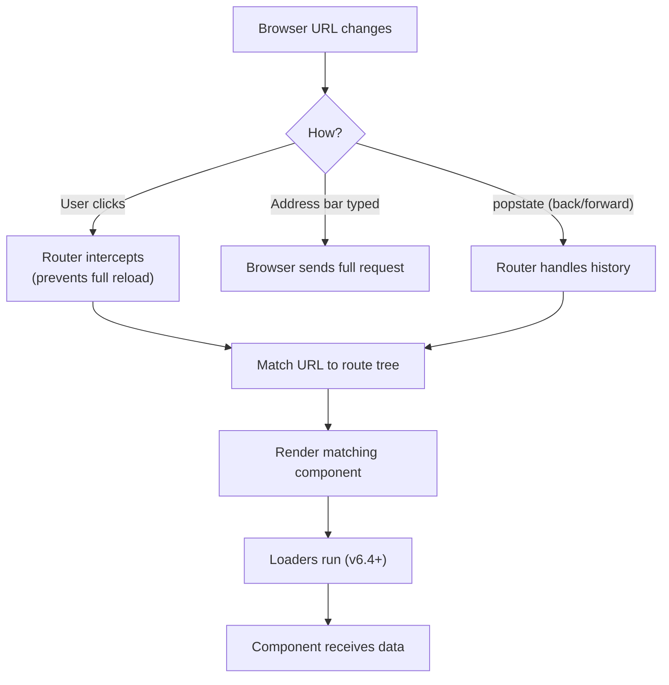

# Routing with React Router

**Complete guide to React Router v6 for client-side routing**

---

## Metadata
```yaml
topic: React Router
difficulty: intermediate
prerequisites:
  - React fundamentals
  - Hooks (useState, useEffect)
  - JavaScript ES6+
  - TypeScript basics
related:
  - "[[01_Redux_Toolkit_Essentials]]"
  - "[[03_React_App_Architecture_Playbook]]"
  - "[[04_Forms_and_Validation]]"
status: stable
last_updated: 2026-04-26
```

---

## Table of Contents
1. [Setup and Installation](#setup-and-installation)
2. [Routes and Route](#routes-and-route)
3. [Navigation](#navigation)
4. [Hooks](#hooks)
5. [Loaders and Actions (v6.4+)](#loaders-and-actions)
6. [Protected Routes](#protected-routes)
7. [Layout Routes](#layout-routes)
8. [Error Handling](#error-handling)
9. [Code Splitting](#code-splitting)
10. [TypeScript Integration](#typescript-integration)
11. [Complete Multi-Page App Example](#complete-multi-page-app-example)
12. [v5 to v6 Migration](#v5-to-v6-migration)
13. [Common Pitfalls](#common-pitfalls)
14. [Best Practices](#best-practices)
15. [Interview Questions](#interview-questions)

---

## Setup and Installation

### Installation

```bash
# Install React Router
npm install react-router-dom

# TypeScript types (included in react-router-dom 6+)
```

### Router Types

| Router | Use Case |
|--------|----------|
| **BrowserRouter** | Standard web apps (HTML5 History API) |
| **HashRouter** | Legacy browsers, static hosting |
| **MemoryRouter** | Testing, non-browser environments |
| **NativeRouter** | React Native |
| **StaticRouter** | Server-side rendering |

### Basic Setup

```typescript
// main.tsx
import React from 'react';
import ReactDOM from 'react-dom/client';
import { BrowserRouter } from 'react-router-dom';
import App from './App';

ReactDOM.createRoot(document.getElementById('root')!).render(
  <React.StrictMode>
    <BrowserRouter>
      <App />
    </BrowserRouter>
  </React.StrictMode>
);
```

---

## Routes and Route

> [!info] React Router
> React Router v6 is a client-side routing library that maps URL paths to React components. Unlike server-side routing (which requests a new page from the server), client-side routing intercepts navigation and renders components without a full page reload. React Router uses a declarative `Route` component hierarchy or a data-oriented `createBrowserRouter` API (v6.4+).



```tsx
import { createBrowserRouter, RouterProvider } from 'react-router-dom';

const router = createBrowserRouter([
  {
    path: '/',
    element: <RootLayout />,
    errorElement: <ErrorPage />,
    children: [
      { index: true, element: <Home /> },
      {
        path: 'users',
        loader: () => fetch('/api/users'),
        element: <UserList />,
      },
      {
        path: 'users/:id',
        loader: ({ params }) => fetch(`/api/users/${params.id}`),
        element: <UserDetail />,
      },
    ],
  },
]);

root.render(<RouterProvider router={router} />);
```

### Dynamic Segments

```typescript
// Dynamic route parameter
<Route path="/users/:userId" element={<UserProfile />} />
<Route path="/posts/:postId/comments/:commentId" element={<Comment />} />

// Optional parameter
<Route path="/products/:category?" element={<ProductList />} />

// Wildcard (splat route)
<Route path="/docs/*" element={<DocsPage />} />
```

### Nested Routes

```typescript
// App.tsx
import { Routes, Route, Outlet } from 'react-router-dom';

function App() {
  return (
    <Routes>
      <Route path="/" element={<Layout />}>
        <Route index element={<HomePage />} />
        <Route path="about" element={<AboutPage />} />
        <Route path="users" element={<UsersLayout />}>
          <Route index element={<UsersList />} />
          <Route path=":userId" element={<UserProfile />} />
          <Route path=":userId/edit" element={<EditUser />} />
        </Route>
      </Route>
    </Routes>
  );
}

// Layout component with Outlet
function Layout() {
  return (
    <div>
      <nav>{/* Navigation */}</nav>
      <main>
        <Outlet /> {/* Child routes render here */}
      </main>
      <footer>{/* Footer */}</footer>
    </div>
  );
}
```

### Index Routes

```typescript
// Index route renders when parent path matches exactly
<Route path="/users" element={<UsersLayout />}>
  <Route index element={<UsersList />} />  {/* Renders at /users */}
  <Route path=":userId" element={<UserProfile />} />  {/* Renders at /users/:userId */}
</Route>
```

---

## Navigation

### Link Component

```typescript
import { Link } from 'react-router-dom';

function Navigation() {
  return (
    <nav>
      <Link to="/">Home</Link>
      <Link to="/about">About</Link>
      <Link to="/users/123">User 123</Link>
      
      {/* Relative link */}
      <Link to="../">Back</Link>
      
      {/* With state */}
      <Link to="/login" state={{ from: '/dashboard' }}>Login</Link>
      
      {/* Replace (no history entry) */}
      <Link to="/home" replace>Home</Link>
    </nav>
  );
}
```

### NavLink (Active Styling)

```typescript
import { NavLink } from 'react-router-dom';

function Navigation() {
  return (
    <nav>
      <NavLink
        to="/"
        className={({ isActive }) => isActive ? 'nav-link active' : 'nav-link'}
        style={({ isActive }) => ({
          color: isActive ? 'red' : 'black',
        })}
      >
        Home
      </NavLink>
      
      <NavLink
        to="/about"
        className={({ isActive, isPending }) =>
          isPending ? 'pending' : isActive ? 'active' : ''
        }
      >
        About
      </NavLink>
    </nav>
  );
}
```

### Programmatic Navigation

```typescript
import { useNavigate } from 'react-router-dom';

function LoginForm() {
  const navigate = useNavigate();
  
  const handleSubmit = async (values: LoginData) => {
    await loginUser(values);
    
    // Navigate to dashboard
    navigate('/dashboard');
    
    // Navigate with state
    navigate('/dashboard', { state: { from: 'login' } });
    
    // Replace current entry (no back button)
    navigate('/dashboard', { replace: true });
    
    // Go back
    navigate(-1);
    
    // Go forward
    navigate(1);
  };
  
  return <form onSubmit={handleSubmit}>{/* ... */}</form>;
}
```

### Navigate Component

```typescript
import { Navigate } from 'react-router-dom';

// Redirect component
function OldPage() {
  return <Navigate to="/new-page" replace />;
}

// Conditional redirect
function Dashboard() {
  const { user } = useAuth();
  
  if (!user) {
    return <Navigate to="/login" state={{ from: '/dashboard' }} />;
  }
  
  return <div>Dashboard</div>;
}
```

---

## Hooks

### useParams (Get Route Parameters)

```typescript
import { useParams } from 'react-router-dom';

// Route: /users/:userId
function UserProfile() {
  const { userId } = useParams<{ userId: string }>();
  
  return <div>User ID: {userId}</div>;
}

// Multiple params: /posts/:postId/comments/:commentId
function Comment() {
  const { postId, commentId } = useParams<{ postId: string; commentId: string }>();
  
  return (
    <div>
      Post: {postId}, Comment: {commentId}
    </div>
  );
}
```

### useSearchParams (Query Strings)

```typescript
import { useSearchParams } from 'react-router-dom';

// URL: /products?category=electronics&sort=price
function ProductList() {
  const [searchParams, setSearchParams] = useSearchParams();
  
  const category = searchParams.get('category'); // 'electronics'
  const sort = searchParams.get('sort'); // 'price'
  
  const handleFilterChange = (newCategory: string) => {
    setSearchParams({ category: newCategory, sort: sort || 'name' });
  };
  
  return (
    <div>
      <p>Category: {category}</p>
      <button onClick={() => handleFilterChange('clothing')}>
        Show Clothing
      </button>
    </div>
  );
}
```

### useLocation

```typescript
import { useLocation } from 'react-router-dom';

function CurrentPath() {
  const location = useLocation();
  
  console.log(location.pathname);  // '/users/123'
  console.log(location.search);    // '?sort=name'
  console.log(location.hash);      // '#section1'
  console.log(location.state);     // State passed via navigate()
  console.log(location.key);       // Unique key for this location
  
  return <div>Current path: {location.pathname}</div>;
}

// Access state passed from navigation
function LoginRedirect() {
  const location = useLocation();
  const from = location.state?.from || '/';
  
  return <Navigate to={from} />;
}
```

### useNavigationType

```typescript
import { useNavigationType } from 'react-router-dom';

function Analytics() {
  const navigationType = useNavigationType();
  // 'POP' (back/forward)
  // 'PUSH' (new entry)
  // 'REPLACE' (replaced current entry)
  
  useEffect(() => {
    console.log('Navigation type:', navigationType);
  }, [navigationType]);
}
```

### useMatch

```typescript
import { useMatch } from 'react-router-dom';

function Navigation() {
  const isUsersPage = useMatch('/users/*');
  const isUserProfile = useMatch('/users/:userId');
  
  return (
    <div>
      {isUsersPage && <p>On users section</p>}
      {isUserProfile && <p>Viewing user: {isUserProfile.params.userId}</p>}
    </div>
  );
}
```

---

## Loaders and Actions (v6.4+)

### Setup with createBrowserRouter

```typescript
// main.tsx
import { createBrowserRouter, RouterProvider } from 'react-router-dom';
import Root from './routes/root';
import ErrorPage from './error-page';

const router = createBrowserRouter([
  {
    path: '/',
    element: <Root />,
    errorElement: <ErrorPage />,
    loader: rootLoader,
    action: rootAction,
    children: [
      {
        path: 'users/:userId',
        element: <UserProfile />,
        loader: userLoader,
      },
    ],
  },
]);

ReactDOM.createRoot(document.getElementById('root')!).render(
  <RouterProvider router={router} />
);
```

### Loaders (Data Fetching)

```typescript
// routes/user.tsx
import { useLoaderData, LoaderFunctionArgs } from 'react-router-dom';

interface User {
  id: string;
  name: string;
  email: string;
}

// Loader function
export async function userLoader({ params }: LoaderFunctionArgs) {
  const response = await fetch(\`/api/users/\${params.userId}\`);
  
  if (!response.ok) {
    throw new Response('User not found', { status: 404 });
  }
  
  const user: User = await response.json();
  return { user };
}

// Component
export default function UserProfile() {
  const { user } = useLoaderData() as { user: User };
  
  return (
    <div>
      <h1>{user.name}</h1>
      <p>{user.email}</p>
    </div>
  );
}
```

### Actions (Form Handling)

```typescript
// routes/edit-user.tsx
import { Form, redirect, useActionData, ActionFunctionArgs } from 'react-router-dom';

// Action function
export async function editUserAction({ request, params }: ActionFunctionArgs) {
  const formData = await request.formData();
  const updates = Object.fromEntries(formData);
  
  try {
    await fetch(\`/api/users/\${params.userId}\`, {
      method: 'PATCH',
      headers: { 'Content-Type': 'application/json' },
      body: JSON.stringify(updates),
    });
    
    return redirect(\`/users/\${params.userId}\`);
  } catch (error) {
    return { error: 'Failed to update user' };
  }
}

// Component
export default function EditUser() {
  const actionData = useActionData() as { error?: string };
  
  return (
    <Form method="post">
      <input name="name" placeholder="Name" />
      <input name="email" type="email" placeholder="Email" />
      <button type="submit">Save</button>
      {actionData?.error && <p>{actionData.error}</p>}
    </Form>
  );
}
```

### Defer (Streaming)

```typescript
import { defer, Await, useLoaderData } from 'react-router-dom';
import { Suspense } from 'react';

// Loader with deferred slow data
export async function loader() {
  const fastData = await fetch('/api/fast').then(r => r.json());
  const slowDataPromise = fetch('/api/slow').then(r => r.json()); // Don't await
  
  return defer({
    fastData,
    slowData: slowDataPromise, // Deferred
  });
}

// Component
export default function Page() {
  const { fastData, slowData } = useLoaderData() as {
    fastData: any;
    slowData: Promise<any>;
  };
  
  return (
    <div>
      <h1>{fastData.title}</h1>
      
      <Suspense fallback={<div>Loading slow data...</div>}>
        <Await resolve={slowData}>
          {(data) => <div>{data.content}</div>}
        </Await>
      </Suspense>
    </div>
  );
}
```

---

## Protected Routes

### Auth Context

```typescript
// context/AuthContext.tsx
import React, { createContext, useContext, useState } from 'react';

interface AuthContextType {
  user: User | null;
  login: (email: string, password: string) => Promise<void>;
  logout: () => void;
}

const AuthContext = createContext<AuthContextType | null>(null);

export function AuthProvider({ children }: { children: React.ReactNode }) {
  const [user, setUser] = useState<User | null>(null);
  
  const login = async (email: string, password: string) => {
    const response = await fetch('/api/auth/login', {
      method: 'POST',
      body: JSON.stringify({ email, password }),
    });
    const userData = await response.json();
    setUser(userData);
  };
  
  const logout = () => setUser(null);
  
  return (
    <AuthContext.Provider value={{ user, login, logout }}>
      {children}
    </AuthContext.Provider>
  );
}

export function useAuth() {
  const context = useContext(AuthContext);
  if (!context) throw new Error('useAuth must be used within AuthProvider');
  return context;
}
```

### Protected Route Component

```typescript
// components/ProtectedRoute.tsx
import { Navigate, useLocation } from 'react-router-dom';
import { useAuth } from '../context/AuthContext';

interface ProtectedRouteProps {
  children: React.ReactNode;
  requiredRole?: string;
}

export function ProtectedRoute({ children, requiredRole }: ProtectedRouteProps) {
  const { user } = useAuth();
  const location = useLocation();
  
  if (!user) {
    // Redirect to login, save attempted location
    return <Navigate to="/login" state={{ from: location.pathname }} replace />;
  }
  
  if (requiredRole && user.role !== requiredRole) {
    // Unauthorized
    return <Navigate to="/unauthorized" replace />;
  }
  
  return <>{children}</>;
}
```

### Usage in Routes

```typescript
// App.tsx
import { Routes, Route } from 'react-router-dom';
import { ProtectedRoute } from './components/ProtectedRoute';

function App() {
  return (
    <Routes>
      <Route path="/" element={<HomePage />} />
      <Route path="/login" element={<LoginPage />} />
      
      {/* Protected route */}
      <Route
        path="/dashboard"
        element={
          <ProtectedRoute>
            <Dashboard />
          </ProtectedRoute>
        }
      />
      
      {/* Admin-only route */}
      <Route
        path="/admin"
        element={
          <ProtectedRoute requiredRole="admin">
            <AdminPanel />
          </ProtectedRoute>
        }
      />
    </Routes>
  );
}
```

---

## Layout Routes

### Shared Layout

```typescript
// components/Layout.tsx
import { Outlet, Link } from 'react-router-dom';

export function Layout() {
  return (
    <div className="layout">
      <header>
        <nav>
          <Link to="/">Home</Link>
          <Link to="/about">About</Link>
          <Link to="/users">Users</Link>
        </nav>
      </header>
      
      <main>
        <Outlet /> {/* Child routes render here */}
      </main>
      
      <footer>© 2026 My App</footer>
    </div>
  );
}
```

### Nested Layouts

```typescript
// App.tsx
import { Routes, Route } from 'react-router-dom';
import { Layout } from './components/Layout';
import { DashboardLayout } from './components/DashboardLayout';

function App() {
  return (
    <Routes>
      {/* Public layout */}
      <Route element={<Layout />}>
        <Route path="/" element={<HomePage />} />
        <Route path="/about" element={<AboutPage />} />
      </Route>
      
      {/* Dashboard layout (different nav) */}
      <Route element={<DashboardLayout />}>
        <Route path="/dashboard" element={<Dashboard />} />
        <Route path="/dashboard/profile" element={<Profile />} />
        <Route path="/dashboard/settings" element={<Settings />} />
      </Route>
    </Routes>
  );
}
```

### Layout with Context

```typescript
// components/DashboardLayout.tsx
import { Outlet } from 'react-router-dom';
import { useState } from 'react';

export function DashboardLayout() {
  const [sidebarOpen, setSidebarOpen] = useState(true);
  
  return (
    <div className="dashboard">
      <aside className={sidebarOpen ? 'open' : 'closed'}>
        {/* Sidebar */}
      </aside>
      
      <main>
        <button onClick={() => setSidebarOpen(!sidebarOpen)}>
          Toggle Sidebar
        </button>
        <Outlet context={{ sidebarOpen }} />
      </main>
    </div>
  );
}

// Access context in child route
import { useOutletContext } from 'react-router-dom';

function Dashboard() {
  const { sidebarOpen } = useOutletContext<{ sidebarOpen: boolean }>();
  
  return <div>Sidebar is {sidebarOpen ? 'open' : 'closed'}</div>;
}
```

---

## Error Handling

### ErrorBoundary with useRouteError

```typescript
// error-page.tsx
import { useRouteError, isRouteErrorResponse } from 'react-router-dom';

export default function ErrorPage() {
  const error = useRouteError();
  
  let errorMessage: string;
  let errorStatus: number | undefined;
  
  if (isRouteErrorResponse(error)) {
    // Error from loader/action (thrown Response)
    errorStatus = error.status;
    errorMessage = error.statusText || error.data;
  } else if (error instanceof Error) {
    errorMessage = error.message;
  } else {
    errorMessage = 'Unknown error';
  }
  
  return (
    <div className="error-page">
      <h1>Oops!</h1>
      <p>Sorry, an unexpected error has occurred.</p>
      {errorStatus && <p>Status: {errorStatus}</p>}
      <p>
        <i>{errorMessage}</i>
      </p>
    </div>
  );
}
```

### Route-Level Error Boundaries

```typescript
const router = createBrowserRouter([
  {
    path: '/',
    element: <Root />,
    errorElement: <ErrorPage />, // Catches errors in this route and children
    children: [
      {
        path: 'users/:userId',
        element: <UserProfile />,
        errorElement: <UserError />, // Specific error for this route
        loader: userLoader,
      },
    ],
  },
]);
```

### 404 Not Found

```typescript
// App.tsx
<Routes>
  <Route path="/" element={<HomePage />} />
  <Route path="/about" element={<AboutPage />} />
  
  {/* Catch-all route for 404 */}
  <Route path="*" element={<NotFoundPage />} />
</Routes>
```

### Throwing Errors in Loaders

```typescript
export async function userLoader({ params }: LoaderFunctionArgs) {
  const response = await fetch(\`/api/users/\${params.userId}\`);
  
  if (response.status === 404) {
    throw new Response('User not found', { status: 404 });
  }
  
  if (!response.ok) {
    throw new Error('Failed to fetch user');
  }
  
  return response.json();
}
```

---

## Code Splitting

### React.lazy with Routes

```typescript
// App.tsx
import React, { Suspense, lazy } from 'react';
import { Routes, Route } from 'react-router-dom';

// Lazy load route components
const HomePage = lazy(() => import('./pages/HomePage'));
const AboutPage = lazy(() => import('./pages/AboutPage'));
const Dashboard = lazy(() => import('./pages/Dashboard'));

function App() {
  return (
    <Suspense fallback={<div>Loading...</div>}>
      <Routes>
        <Route path="/" element={<HomePage />} />
        <Route path="/about" element={<AboutPage />} />
        <Route path="/dashboard" element={<Dashboard />} />
      </Routes>
    </Suspense>
  );
}
```

### Route-Level Code Splitting

```typescript
import { createBrowserRouter } from 'react-router-dom';

const router = createBrowserRouter([
  {
    path: '/',
    lazy: () => import('./routes/root'),
  },
  {
    path: '/dashboard',
    lazy: async () => {
      const { Dashboard, loader } = await import('./routes/dashboard');
      return {
        Component: Dashboard,
        loader,
      };
    },
  },
]);
```

### Prefetching Routes

```typescript
import { Link } from 'react-router-dom';

function Navigation() {
  const handleMouseEnter = () => {
    // Prefetch dashboard route
    import('./pages/Dashboard');
  };
  
  return (
    <Link to="/dashboard" onMouseEnter={handleMouseEnter}>
      Dashboard
    </Link>
  );
}
```

---

## TypeScript Integration

### Typed Params

```typescript
import { useParams } from 'react-router-dom';

// Define param types
type UserParams = {
  userId: string;
};

function UserProfile() {
  const { userId } = useParams<UserParams>();
  // userId is typed as string | undefined
  
  if (!userId) {
    return <div>Invalid user ID</div>;
  }
  
  return <div>User: {userId}</div>;
}
```

### Typed Loaders

```typescript
import { LoaderFunctionArgs } from 'react-router-dom';

interface User {
  id: string;
  name: string;
  email: string;
}

interface UserLoaderData {
  user: User;
}

export async function userLoader({ params }: LoaderFunctionArgs): Promise<UserLoaderData> {
  const response = await fetch(\`/api/users/\${params.userId}\`);
  const user = await response.json();
  return { user };
}

// In component
import { useLoaderData } from 'react-router-dom';

function UserProfile() {
  const { user } = useLoaderData() as UserLoaderData;
  // user is typed as User
  
  return <div>{user.name}</div>;
}
```

### Typed Route Object

```typescript
import { RouteObject } from 'react-router-dom';

const routes: RouteObject[] = [
  {
    path: '/',
    element: <Root />,
    children: [
      {
        path: 'users/:userId',
        element: <UserProfile />,
        loader: userLoader,
      },
    ],
  },
];
```

---

## Complete Multi-Page App Example

```typescript
// main.tsx
import React from 'react';
import ReactDOM from 'react-dom/client';
import { createBrowserRouter, RouterProvider } from 'react-router-dom';
import { AuthProvider } from './context/AuthContext';
import Root, { loader as rootLoader } from './routes/root';
import ErrorPage from './error-page';

const router = createBrowserRouter([
  {
    path: '/',
    element: <Root />,
    errorElement: <ErrorPage />,
    loader: rootLoader,
    children: [
      {
        index: true,
        lazy: () => import('./routes/home'),
      },
      {
        path: 'login',
        lazy: () => import('./routes/login'),
      },
      {
        path: 'dashboard',
        lazy: () => import('./routes/dashboard'),
      },
      {
        path: 'users',
        lazy: () => import('./routes/users'),
        children: [
          {
            index: true,
            lazy: () => import('./routes/users-list'),
          },
          {
            path: ':userId',
            lazy: () => import('./routes/user-profile'),
          },
          {
            path: ':userId/edit',
            lazy: () => import('./routes/edit-user'),
          },
        ],
      },
    ],
  },
]);

ReactDOM.createRoot(document.getElementById('root')!).render(
  <React.StrictMode>
    <AuthProvider>
      <RouterProvider router={router} />
    </AuthProvider>
  </React.StrictMode>
);

// routes/root.tsx
import { Outlet, Link, useNavigation } from 'react-router-dom';
import { useAuth } from '../context/AuthContext';

export async function loader() {
  // Load app-wide data
  return { version: '1.0.0' };
}

export default function Root() {
  const { user, logout } = useAuth();
  const navigation = useNavigation();
  
  return (
    <div>
      <header>
        <nav>
          <Link to="/">Home</Link>
          {user ? (
            <>
              <Link to="/dashboard">Dashboard</Link>
              <Link to="/users">Users</Link>
              <button onClick={logout}>Logout</button>
            </>
          ) : (
            <Link to="/login">Login</Link>
          )}
        </nav>
      </header>
      
      <main className={navigation.state === 'loading' ? 'loading' : ''}>
        <Outlet />
      </main>
    </div>
  );
}

// routes/users.tsx
import { Outlet, Link } from 'react-router-dom';

export function Component() {
  return (
    <div className="users-layout">
      <aside>
        <h2>Users</h2>
        <nav>
          <Link to="/users">All Users</Link>
        </nav>
      </aside>
      
      <main>
        <Outlet />
      </main>
    </div>
  );
}

// routes/user-profile.tsx
import { useLoaderData, LoaderFunctionArgs } from 'react-router-dom';

interface User {
  id: string;
  name: string;
  email: string;
}

export async function loader({ params }: LoaderFunctionArgs) {
  const response = await fetch(\`/api/users/\${params.userId}\`);
  if (!response.ok) throw new Response('User not found', { status: 404 });
  const user = await response.json();
  return { user };
}

export function Component() {
  const { user } = useLoaderData() as { user: User };
  
  return (
    <div>
      <h1>{user.name}</h1>
      <p>{user.email}</p>
      <Link to="edit">Edit</Link>
    </div>
  );
}
```

---

## v5 to v6 Migration

### Key Changes

| v5 | v6 |
|----|-----|
| \`<Switch>\` | \`<Routes>\` |
| \`exact\` prop | Automatic exact matching |
| \`component\` prop | \`element\` prop |
| \`useHistory()\` | \`useNavigate()\` |
| \`useRouteMatch()\` | \`useMatch()\` |
| \`<Redirect>\` | \`<Navigate>\` |
| Nested \`<Route>\` anywhere | Only inside \`<Routes>\` |

### Migration Examples

**v5:**
```typescript
import { Switch, Route, useHistory, Redirect } from 'react-router-dom';

function App() {
  return (
    <Switch>
      <Route exact path="/" component={HomePage} />
      <Route path="/about" component={AboutPage} />
      <Redirect from="/old" to="/new" />
    </Switch>
  );
}

function MyComponent() {
  const history = useHistory();
  history.push('/dashboard');
}
```

**v6:**
```typescript
import { Routes, Route, useNavigate, Navigate } from 'react-router-dom';

function App() {
  return (
    <Routes>
      <Route path="/" element={<HomePage />} />
      <Route path="/about" element={<AboutPage />} />
      <Route path="/old" element={<Navigate to="/new" replace />} />
    </Routes>
  );
}

function MyComponent() {
  const navigate = useNavigate();
  navigate('/dashboard');
}
```

---

## Common Pitfalls

### 1. Nested Routes Outside \`<Routes>\`

```typescript
// ❌ WRONG
<Routes>
  <Route path="/" element={<Layout />} />
  <Route path="/about" element={<About />} />  {/* Outside parent */}
</Routes>

// ✅ CORRECT
<Routes>
  <Route path="/" element={<Layout />}>
    <Route path="about" element={<About />} />  {/* Nested */}
  </Route>
</Routes>
```

### 2. Missing \`<Outlet>\` in Layout

```typescript
// ❌ WRONG: Children won't render
function Layout() {
  return <div><nav /></div>;
}

// ✅ CORRECT
function Layout() {
  return (
    <div>
      <nav />
      <Outlet />  {/* Children render here */}
    </div>
  );
}
```

### 3. Using Absolute Paths in Nested Routes

```typescript
// ❌ WRONG
<Route path="/users" element={<UsersLayout />}>
  <Route path="/users/:userId" element={<UserProfile />} />  {/* Don't repeat /users */}
</Route>

// ✅ CORRECT
<Route path="/users" element={<UsersLayout />}>
  <Route path=":userId" element={<UserProfile />} />  {/* Relative path */}
</Route>
```

---

## Best Practices

1. **Use layouts for shared UI**
2. **Code split routes with React.lazy**
3. **Use loaders for data fetching (v6.4+)**
4. **Type your params and loaders**
5. **Implement error boundaries**
6. **Use NavLink for active states**
7. **Protect routes with auth checks**
8. **Handle 404 with catch-all route**

---

## Interview Questions

### Q1: What's the difference between \`Link\` and \`NavLink\`?

**Answer:**

\`Link\` is for basic navigation, \`NavLink\` adds active state:

```typescript
// Link - basic navigation
<Link to="/about">About</Link>

// NavLink - with active styling
<NavLink 
  to="/about" 
  className={({ isActive }) => isActive ? 'active' : ''}
>
  About
</NavLink>
```

**Use NavLink when:**
- Navigation menu (highlight active page)
- Tabs
- Breadcrumbs

### Q2: Explain loaders and actions in React Router v6.4+

**Answer:**

**Loaders** fetch data before rendering:
```typescript
export async function loader({ params }) {
  const user = await fetchUser(params.userId);
  return { user };
}
```

**Actions** handle form submissions:
```typescript
export async function action({ request }) {
  const formData = await request.formData();
  await updateUser(formData);
  return redirect('/users');
}
```

**Benefits:**
- Data loaded before render (no loading spinners)
- Forms work without JS (progressive enhancement)
- Automatic error handling

### Q3: How do you protect routes in React Router?

**Answer:**

Create a \`ProtectedRoute\` wrapper:

```typescript
function ProtectedRoute({ children }) {
  const { user } = useAuth();
  const location = useLocation();
  
  if (!user) {
    return <Navigate to="/login" state={{ from: location }} replace />;
  }
  
  return children;
}

// Usage
<Route path="/dashboard" element={
  <ProtectedRoute>
    <Dashboard />
  </ProtectedRoute>
} />
```

### Q4: What are index routes?

**Answer:**

Index routes render when the parent path matches exactly:

```typescript
<Route path="/users" element={<UsersLayout />}>
  <Route index element={<UsersList />} />  {/* Renders at /users */}
  <Route path=":userId" element={<UserProfile />} />
</Route>
```

Without index route, \`<Outlet />\` would be empty at \`/users\`.

### Q5: How do you handle 404 pages?

**Answer:**

Use a catch-all route with \`*\`:

```typescript
<Routes>
  <Route path="/" element={<Home />} />
  <Route path="/about" element={<About />} />
  <Route path="*" element={<NotFound />} />
</Routes>
```

The \`*\` matches any unmatched path.

### Q6: Explain \`useNavigate\` vs \`<Navigate>\`

**Answer:**

\`useNavigate\`: Hook for programmatic navigation
```typescript
const navigate = useNavigate();
navigate('/dashboard'); // In event handler
```

\`<Navigate>\`: Component for declarative redirects
```typescript
if (!user) return <Navigate to="/login" />; // In render
```

**Use \`useNavigate\`** for user actions (button clicks).
**Use \`<Navigate>\`** for conditional redirects (auth checks).

### Q7: How do you implement nested routes?

**Answer:**

```typescript
<Routes>
  <Route path="/dashboard" element={<DashboardLayout />}>
    <Route index element={<DashboardHome />} />
    <Route path="settings" element={<Settings />} />
    <Route path="profile" element={<Profile />} />
  </Route>
</Routes>

// DashboardLayout.tsx
function DashboardLayout() {
  return (
    <div>
      <nav>{/* Dashboard nav */}</nav>
      <Outlet /> {/* Child routes render here */}
    </div>
  );
}
```

Child routes render inside \`<Outlet />\`.

### Q8: How do you access route parameters?

**Answer:**

```typescript
// Route definition
<Route path="/users/:userId" element={<UserProfile />} />

// Component
function UserProfile() {
  const { userId } = useParams<{ userId: string }>();
  
  return <div>User ID: {userId}</div>;
}
```

\`useParams()\` returns an object with all route parameters.

---

**Related:**
- [[01_Redux_Toolkit_Essentials]]
- [[03_React_App_Architecture_Playbook]]
- [[04_Forms_and_Validation]]

---

**Last Updated:** 2026-04-26
