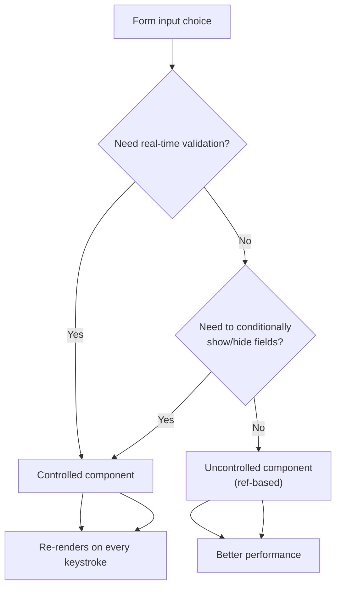

# Forms and Validation

> [!summary] Goal
> Master React forms—from controlled vs uncontrolled to React Hook Form, Zod/Yup validation, complex patterns (multi-step, dynamic fields, file uploads), accessibility, and testing.

## Table of Contents

1. [Controlled vs Uncontrolled Forms](#controlled-vs-uncontrolled-forms)
2. [React Hook Form Complete Guide](#react-hook-form-complete-guide)
3. [Validation Libraries](#validation-libraries)
4. [Complex Form Patterns](#complex-form-patterns)
5. [File Uploads](#file-uploads)
6. [Form Accessibility](#form-accessibility)
7. [Testing Forms](#testing-forms)
8. [Complete Examples](#complete-examples)
9. [Comparison Table](#comparison-table)
10. [Interview Questions](#interview-questions)

---

## Controlled vs Uncontrolled Forms

> [!info] Controlled vs uncontrolled
> A **controlled** component's value is controlled by React state — every keystroke calls `onChange` and sets state. An **uncontrolled** component manages its own internal DOM state — you access the value via a `ref` when needed. Controlled gives you real-time validation and conditional UI; uncontrolled gives you better performance for large forms.



### Controlled Forms

**Definition**: Form input values are stored in React state. React is the "single source of truth."

**When to use**:
- You need real-time validation
- You need to transform input (uppercase, formatting)
- You need to enable/disable submit based on input
- You need to sync multiple inputs
- You're building complex forms with conditional logic

**Pros**:
- Full control over input value
- Easy to validate on every keystroke
- Easy to implement conditional logic
- Easy to reset form
- Predictable state

**Cons**:
- More re-renders (one per keystroke)
- More boilerplate code
- Can impact performance with many inputs

**Example**:

```tsx
import { useState } from 'react';

interface LoginFormData {
  email: string;
  password: string;
}

function ControlledLoginForm() {
  const [formData, setFormData] = useState<LoginFormData>({
    email: '',
    password: ''
  });
  const [errors, setErrors] = useState<Partial<LoginFormData>>({});

  const handleChange = (field: keyof LoginFormData) => 
    (e: React.ChangeEvent<HTMLInputElement>) => {
      setFormData(prev => ({ ...prev, [field]: e.target.value }));
      // Clear error when user types
      if (errors[field]) {
        setErrors(prev => ({ ...prev, [field]: undefined }));
      }
    };

  const validate = (): boolean => {
    const newErrors: Partial<LoginFormData> = {};
    
    if (!formData.email) {
      newErrors.email = 'Email is required';
    } else if (!/^[^\s@]+@[^\s@]+\.[^\s@]+$/.test(formData.email)) {
      newErrors.email = 'Invalid email format';
    }
    
    if (!formData.password) {
      newErrors.password = 'Password is required';
    } else if (formData.password.length < 8) {
      newErrors.password = 'Password must be at least 8 characters';
    }
    
    setErrors(newErrors);
    return Object.keys(newErrors).length === 0;
  };

  const handleSubmit = (e: React.FormEvent) => {
    e.preventDefault();
    if (validate()) {
      console.log('Form submitted:', formData);
      // API call here
    }
  };

  return (
    <form onSubmit={handleSubmit} noValidate>
      <div>
        <label htmlFor="email">Email</label>
        <input
          id="email"
          type="email"
          value={formData.email}
          onChange={handleChange('email')}
          aria-invalid={!!errors.email}
          aria-describedby={errors.email ? 'email-error' : undefined}
        />
        {errors.email && (
          <span id="email-error" role="alert">
            {errors.email}
          </span>
        )}
      </div>

      <div>
        <label htmlFor="password">Password</label>
        <input
          id="password"
          type="password"
          value={formData.password}
          onChange={handleChange('password')}
          aria-invalid={!!errors.password}
          aria-describedby={errors.password ? 'password-error' : undefined}
        />
        {errors.password && (
          <span id="password-error" role="alert">
            {errors.password}
          </span>
        )}
      </div>

      <button type="submit">Login</button>
    </form>
  );
}
```

### Uncontrolled Forms

**Definition**: Form values are managed by the DOM. Read values using refs or FormData on submit.

**When to use**:
- Simple forms (contact form, newsletter signup)
- Performance is critical (thousands of inputs)
- Integrating with non-React code
- You only need values on submit

**Pros**:
- Fewer re-renders
- Less code
- Better performance with many inputs
- Closer to native HTML forms

**Cons**:
- Harder to validate on keystroke
- Harder to implement conditional logic
- Can't easily transform input values
- Less "React-like"

**Example with useRef**:

```tsx
import { useRef, useState } from 'react';

function UncontrolledForm() {
  const emailRef = useRef<HTMLInputElement>(null);
  const passwordRef = useRef<HTMLInputElement>(null);
  const [error, setError] = useState<string | null>(null);

  const handleSubmit = (e: React.FormEvent) => {
    e.preventDefault();
    
    const email = emailRef.current?.value || '';
    const password = passwordRef.current?.value || '';
    
    if (!email.includes('@')) {
      setError('Invalid email');
      return;
    }
    
    if (password.length < 8) {
      setError('Password must be at least 8 characters');
      return;
    }
    
    setError(null);
    console.log('Form submitted:', { email, password });
  };

  return (
    <form onSubmit={handleSubmit}>
      <div>
        <label htmlFor="email">Email</label>
        <input
          id="email"
          ref={emailRef}
          type="email"
          defaultValue=""
        />
      </div>

      <div>
        <label htmlFor="password">Password</label>
        <input
          id="password"
          ref={passwordRef}
          type="password"
          defaultValue=""
        />
      </div>

      {error && <p role="alert">{error}</p>}
      <button type="submit">Login</button>
    </form>
  );
}
```

**Example with FormData API** (modern approach):

```tsx
function FormDataExample() {
  const [error, setError] = useState<string | null>(null);

  const handleSubmit = (e: React.FormEvent<HTMLFormElement>) => {
    e.preventDefault();
    
    const formData = new FormData(e.currentTarget);
    const data = Object.fromEntries(formData.entries());
    
    console.log('Form data:', data);
    // { email: '...', password: '...' }
  };

  return (
    <form onSubmit={handleSubmit}>
      <input name="email" type="email" required />
      <input name="password" type="password" required />
      <button type="submit">Submit</button>
    </form>
  );
}
```

### Performance Comparison

```tsx
// Controlled: Re-renders on EVERY keystroke
function ControlledInput() {
  const [value, setValue] = useState('');
  console.log('Render!'); // Logs on every keystroke
  
  return <input value={value} onChange={e => setValue(e.target.value)} />;
}

// Uncontrolled: Re-renders only when you update state
function UncontrolledInput() {
  const ref = useRef<HTMLInputElement>(null);
  console.log('Render!'); // Logs only on mount
  
  return <input ref={ref} defaultValue="" />;
}
```

**Rule of thumb**: Start with controlled forms for better UX. Switch to uncontrolled if you have performance issues with 50+ inputs.

---

## React Hook Form Complete Guide

[React Hook Form](https://react-hook-form.com/) provides the best of both worlds: performance of uncontrolled forms with the DX of controlled forms.

### Installation

```bash
npm install react-hook-form
npm install @hookform/resolvers zod # For validation
```

### Core API: useForm Hook

```tsx
import { useForm } from 'react-hook-form';

interface FormData {
  email: string;
  password: string;
  age: number;
  terms: boolean;
}

function BasicRHFForm() {
  const {
    register,       // Register inputs
    handleSubmit,   // Handle form submission
    formState,      // Form state (errors, isDirty, isValid, etc.)
    watch,          // Watch input values
    setValue,       // Manually set value
    reset,          // Reset form
    getValues,      // Get current values
    setError,       // Set custom error
    clearErrors,    // Clear errors
  } = useForm<FormData>({
    mode: 'onSubmit',        // Validation strategy
    defaultValues: {
      email: '',
      password: '',
      age: 0,
      terms: false,
    },
  });

  const { errors, isSubmitting, isDirty, isValid } = formState;

  const onSubmit = (data: FormData) => {
    console.log('Valid data:', data);
  };

  return (
    <form onSubmit={handleSubmit(onSubmit)}>
      <input
        {...register('email', {
          required: 'Email is required',
          pattern: {
            value: /^[^\s@]+@[^\s@]+\.[^\s@]+$/,
            message: 'Invalid email',
          },
        })}
        type="email"
      />
      {errors.email && <span>{errors.email.message}</span>}

      <input
        {...register('password', {
          required: 'Password is required',
          minLength: {
            value: 8,
            message: 'Password must be at least 8 characters',
          },
        })}
        type="password"
      />
      {errors.password && <span>{errors.password.message}</span>}

      <input
        {...register('age', {
          valueAsNumber: true, // Convert to number
          min: { value: 18, message: 'Must be 18+' },
        })}
        type="number"
      />
      {errors.age && <span>{errors.age.message}</span>}

      <label>
        <input {...register('terms', { required: 'You must accept terms' })} type="checkbox" />
        Accept terms
      </label>
      {errors.terms && <span>{errors.terms.message}</span>}

      <button type="submit" disabled={isSubmitting}>
        {isSubmitting ? 'Submitting...' : 'Submit'}
      </button>
    </form>
  );
}
```

### Validation Modes

```tsx
useForm({
  mode: 'onSubmit',    // Validate on submit (default)
  mode: 'onBlur',      // Validate when input loses focus
  mode: 'onChange',    // Validate on every change (after first submit)
  mode: 'onTouched',   // Validate on blur, then on change
  mode: 'all',         // Validate on blur AND change
});
```

### register() Options

```tsx
register('fieldName', {
  required: 'This field is required',
  minLength: { value: 3, message: 'Min 3 chars' },
  maxLength: { value: 20, message: 'Max 20 chars' },
  min: { value: 0, message: 'Min value is 0' },
  max: { value: 100, message: 'Max value is 100' },
  pattern: {
    value: /^[A-Z]/,
    message: 'Must start with uppercase',
  },
  validate: (value) => {
    // Custom validation
    if (value.includes('admin')) {
      return 'Cannot contain "admin"';
    }
    return true;
  },
  validate: {
    // Multiple validators
    noSpaces: (v) => !v.includes(' ') || 'No spaces allowed',
    noSpecial: (v) => /^[a-zA-Z0-9]+$/.test(v) || 'Alphanumeric only',
  },
  valueAsNumber: true,  // Convert to number
  valueAsDate: true,    // Convert to Date
  setValueAs: (v) => v.toUpperCase(), // Custom transform
  disabled: true,       // Disable field
  onChange: (e) => console.log(e),
  onBlur: (e) => console.log(e),
});
```

### watch() - Observe Input Values

```tsx
function WatchExample() {
  const { register, watch } = useForm<{ country: string; state: string }>();
  
  // Watch all fields
  const allValues = watch();
  
  // Watch specific field
  const country = watch('country');
  
  // Watch multiple fields
  const [country2, state] = watch(['country', 'state']);
  
  // Watch with callback (better performance)
  useEffect(() => {
    const subscription = watch((value, { name, type }) => {
      console.log('Field changed:', name, 'Value:', value);
    });
    return () => subscription.unsubscribe();
  }, [watch]);

  return (
    <form>
      <select {...register('country')}>
        <option value="US">United States</option>
        <option value="CA">Canada</option>
      </select>
      
      {country === 'US' && (
        <select {...register('state')}>
          <option value="CA">California</option>
          <option value="NY">New York</option>
        </select>
      )}
    </form>
  );
}
```

### setValue() - Programmatically Set Values

```tsx
function SetValueExample() {
  const { register, setValue } = useForm<{ username: string; email: string }>();

  const fillDemoData = () => {
    setValue('username', 'johndoe', {
      shouldValidate: true,  // Trigger validation
      shouldDirty: true,     // Mark as dirty
      shouldTouch: true,     // Mark as touched
    });
    setValue('email', 'john@example.com');
  };

  return (
    <form>
      <input {...register('username')} />
      <input {...register('email')} />
      <button type="button" onClick={fillDemoData}>
        Fill Demo Data
      </button>
    </form>
  );
}
```

### reset() - Reset Form

```tsx
function ResetExample() {
  const { register, handleSubmit, reset } = useForm<{ name: string }>();

  const onSubmit = (data: { name: string }) => {
    console.log(data);
    reset(); // Reset to default values
  };

  const resetToSpecific = () => {
    reset({ name: 'New Default' }); // Reset to specific values
  };

  return (
    <form onSubmit={handleSubmit(onSubmit)}>
      <input {...register('name')} />
      <button type="submit">Submit</button>
      <button type="button" onClick={() => reset()}>
        Reset
      </button>
      <button type="button" onClick={resetToSpecific}>
        Reset to Specific
      </button>
    </form>
  );
}
```

### Controller - For Custom Components

Use `Controller` when integrating with UI libraries (Material-UI, Ant Design, React Select, etc.).

```tsx
import { useForm, Controller } from 'react-hook-form';
import Select from 'react-select'; // Example third-party component

interface FormData {
  country: { label: string; value: string } | null;
  agreeToTerms: boolean;
}

function ControllerExample() {
  const { control, handleSubmit } = useForm<FormData>();

  const onSubmit = (data: FormData) => console.log(data);

  return (
    <form onSubmit={handleSubmit(onSubmit)}>
      <Controller
        name="country"
        control={control}
        rules={{ required: 'Please select a country' }}
        render={({ field, fieldState }) => (
          <div>
            <Select
              {...field}
              options={[
                { value: 'us', label: 'United States' },
                { value: 'ca', label: 'Canada' },
                { value: 'uk', label: 'United Kingdom' },
              ]}
            />
            {fieldState.error && <span>{fieldState.error.message}</span>}
          </div>
        )}
      />

      <Controller
        name="agreeToTerms"
        control={control}
        rules={{ required: 'You must agree to terms' }}
        render={({ field }) => (
          <label>
            <input
              type="checkbox"
              checked={field.value}
              onChange={field.onChange}
            />
            I agree to terms
          </label>
        )}
      />

      <button type="submit">Submit</button>
    </form>
  );
}
```

### useFieldArray - Dynamic Fields

For adding/removing form fields dynamically (e.g., multiple phone numbers, addresses).

```tsx
import { useForm, useFieldArray } from 'react-hook-form';

interface FormData {
  users: Array<{
    name: string;
    email: string;
  }>;
}

function DynamicFieldsExample() {
  const { register, control, handleSubmit } = useForm<FormData>({
    defaultValues: {
      users: [{ name: '', email: '' }],
    },
  });

  const { fields, append, remove, insert, move } = useFieldArray({
    control,
    name: 'users',
  });

  const onSubmit = (data: FormData) => console.log(data);

  return (
    <form onSubmit={handleSubmit(onSubmit)}>
      {fields.map((field, index) => (
        <div key={field.id}>
          <input
            {...register(`users.${index}.name` as const, {
              required: 'Name is required',
            })}
            placeholder="Name"
          />
          <input
            {...register(`users.${index}.email` as const, {
              required: 'Email is required',
            })}
            placeholder="Email"
          />
          <button type="button" onClick={() => remove(index)}>
            Remove
          </button>
        </div>
      ))}

      <button
        type="button"
        onClick={() => append({ name: '', email: '' })}
      >
        Add User
      </button>

      <button type="submit">Submit</button>
    </form>
  );
}
```

### Async Validation

```tsx
function AsyncValidationExample() {
  const { register, handleSubmit, formState: { errors } } = useForm<{
    username: string;
  }>();

  const checkUsernameAvailability = async (username: string) => {
    // Simulate API call
    await new Promise((resolve) => setTimeout(resolve, 1000));
    
    const takenUsernames = ['admin', 'root', 'user'];
    if (takenUsernames.includes(username.toLowerCase())) {
      return 'Username is already taken';
    }
    return true;
  };

  return (
    <form onSubmit={handleSubmit((data) => console.log(data))}>
      <input
        {...register('username', {
          required: 'Username is required',
          minLength: { value: 3, message: 'Min 3 characters' },
          validate: checkUsernameAvailability, // Async validator
        })}
      />
      {errors.username && <span>{errors.username.message}</span>}
      <button type="submit">Submit</button>
    </form>
  );
}
```

---

## Validation Libraries

### Zod (Type-Safe Validation)

Zod provides runtime validation + TypeScript type inference.

```bash
npm install zod @hookform/resolvers
```

**Basic Zod Schema**:

```tsx
import { z } from 'zod';
import { useForm } from 'react-hook-form';
import { zodResolver } from '@hookform/resolvers/zod';

// Define schema (this also defines TypeScript type!)
const loginSchema = z.object({
  email: z
    .string()
    .min(1, 'Email is required')
    .email('Invalid email address'),
  password: z
    .string()
    .min(8, 'Password must be at least 8 characters')
    .regex(/[A-Z]/, 'Password must contain at least one uppercase letter')
    .regex(/[0-9]/, 'Password must contain at least one number'),
  age: z
    .number()
    .min(18, 'Must be 18 or older')
    .max(120, 'Invalid age'),
  terms: z
    .boolean()
    .refine((val) => val === true, 'You must accept terms'),
});

// Infer TypeScript type from schema
type LoginFormData = z.infer<typeof loginSchema>;

function ZodForm() {
  const {
    register,
    handleSubmit,
    formState: { errors },
  } = useForm<LoginFormData>({
    resolver: zodResolver(loginSchema),
  });

  const onSubmit = (data: LoginFormData) => {
    console.log('Valid data:', data);
  };

  return (
    <form onSubmit={handleSubmit(onSubmit)}>
      <input {...register('email')} type="email" />
      {errors.email && <span>{errors.email.message}</span>}

      <input {...register('password')} type="password" />
      {errors.password && <span>{errors.password.message}</span>}

      <input {...register('age', { valueAsNumber: true })} type="number" />
      {errors.age && <span>{errors.age.message}</span>}

      <label>
        <input {...register('terms')} type="checkbox" />
        Accept terms
      </label>
      {errors.terms && <span>{errors.terms.message}</span>}

      <button type="submit">Submit</button>
    </form>
  );
}
```

**30+ Zod Validation Rules**:

```tsx
import { z } from 'zod';

const comprehensiveSchema = z.object({
  // String validations
  username: z.string()
    .min(3, 'Min 3 chars')
    .max(20, 'Max 20 chars')
    .regex(/^[a-zA-Z0-9_]+$/, 'Alphanumeric and underscore only')
    .toLowerCase() // Transform to lowercase
    .trim(), // Remove whitespace
  
  email: z.string().email('Invalid email'),
  
  url: z.string().url('Invalid URL'),
  
  // Starts with, ends with
  code: z.string()
    .startsWith('CODE-', 'Must start with CODE-')
    .endsWith('-END', 'Must end with -END'),
  
  // Number validations
  age: z.number()
    .int('Must be an integer')
    .positive('Must be positive')
    .min(18, 'Min 18')
    .max(120, 'Max 120'),
  
  price: z.number()
    .nonnegative('Cannot be negative')
    .multipleOf(0.01, 'Max 2 decimal places'),
  
  // Date validations
  birthDate: z.date()
    .min(new Date('1900-01-01'), 'Too old')
    .max(new Date(), 'Cannot be in future'),
  
  // Boolean
  terms: z.boolean().refine(val => val === true, 'Must accept'),
  
  // Enums
  role: z.enum(['admin', 'user', 'guest'], {
    errorMap: () => ({ message: 'Invalid role' }),
  }),
  
  status: z.nativeEnum(MyEnum), // TypeScript enum
  
  // Arrays
  tags: z.array(z.string())
    .min(1, 'At least one tag')
    .max(5, 'Max 5 tags'),
  
  // Array of objects
  users: z.array(z.object({
    name: z.string(),
    email: z.string().email(),
  })).nonempty('At least one user required'),
  
  // Optional fields
  middleName: z.string().optional(),
  
  // Nullable
  avatar: z.string().url().nullable(),
  
  // Default values
  country: z.string().default('US'),
  
  // Union types
  id: z.union([z.string(), z.number()]),
  
  // Discriminated union
  notification: z.discriminatedUnion('type', [
    z.object({ type: z.literal('email'), address: z.string().email() }),
    z.object({ type: z.literal('sms'), phone: z.string() }),
  ]),
  
  // Object with specific keys
  metadata: z.record(z.string(), z.any()),
  
  // Tuple
  coordinates: z.tuple([z.number(), z.number()]),
  
  // Nested objects
  address: z.object({
    street: z.string(),
    city: z.string(),
    zip: z.string().regex(/^\d{5}$/, 'Invalid ZIP'),
  }),
  
  // Custom refinements
  password: z.string()
    .min(8)
    .refine(
      (val) => /[A-Z]/.test(val),
      'Must contain uppercase'
    )
    .refine(
      (val) => /[0-9]/.test(val),
      'Must contain number'
    ),
  
  // Cross-field validation
  confirmPassword: z.string(),
}).refine(
  (data) => data.password === data.confirmPassword,
  {
    message: 'Passwords must match',
    path: ['confirmPassword'], // Error will show on confirmPassword field
  }
);

// Type inference
type FormData = z.infer<typeof comprehensiveSchema>;
```

**Async Zod Validation**:

```tsx
const userSchema = z.object({
  username: z.string().min(3),
}).refine(
  async (data) => {
    // Check if username is available
    const response = await fetch(`/api/users/${data.username}`);
    return response.status === 404; // Available if not found
  },
  { message: 'Username is already taken' }
);
```

### Yup (Alternative to Zod)

```bash
npm install yup @hookform/resolvers
```

**Yup Schema Example**:

```tsx
import * as yup from 'yup';
import { useForm } from 'react-hook-form';
import { yupResolver } from '@hookform/resolvers/zod';

const schema = yup.object({
  email: yup
    .string()
    .required('Email is required')
    .email('Invalid email'),
  password: yup
    .string()
    .required('Password is required')
    .min(8, 'Min 8 characters')
    .matches(/[A-Z]/, 'Must contain uppercase')
    .matches(/[0-9]/, 'Must contain number'),
  age: yup
    .number()
    .required('Age is required')
    .min(18, 'Must be 18+')
    .integer('Must be integer'),
  confirmPassword: yup
    .string()
    .required('Please confirm password')
    .oneOf([yup.ref('password')], 'Passwords must match'),
  website: yup.string().url('Invalid URL'),
  terms: yup
    .boolean()
    .oneOf([true], 'You must accept terms'),
}).required();

type FormData = yup.InferType<typeof schema>;

function YupForm() {
  const { register, handleSubmit, formState: { errors } } = useForm<FormData>({
    resolver: yupResolver(schema),
  });

  return (
    <form onSubmit={handleSubmit(data => console.log(data))}>
      {/* ... */}
    </form>
  );
}
```

**30+ Yup Validation Rules**:

```tsx
import * as yup from 'yup';

const yupSchema = yup.object({
  // String
  username: yup.string()
    .required('Required')
    .min(3, 'Min 3')
    .max(20, 'Max 20')
    .matches(/^[a-zA-Z0-9]+$/, 'Alphanumeric only')
    .lowercase()
    .trim(),
  
  email: yup.string().email('Invalid email').required(),
  url: yup.string().url('Invalid URL'),
  
  // Number
  age: yup.number()
    .required()
    .integer()
    .positive()
    .min(18)
    .max(120),
  
  // Date
  birthDate: yup.date()
    .required()
    .min(new Date('1900-01-01'))
    .max(new Date()),
  
  // Boolean
  terms: yup.boolean().oneOf([true], 'Must accept'),
  
  // Enum
  role: yup.string().oneOf(['admin', 'user', 'guest']),
  
  // Array
  tags: yup.array().of(yup.string()).min(1).max(5),
  
  // Array of objects
  items: yup.array().of(
    yup.object({
      name: yup.string().required(),
      qty: yup.number().required().positive(),
    })
  ),
  
  // Optional
  middleName: yup.string().optional(),
  
  // Nullable
  avatar: yup.string().nullable(),
  
  // Default
  country: yup.string().default('US'),
  
  // Conditional validation
  otherRole: yup.string().when('role', {
    is: 'other',
    then: (schema) => schema.required('Please specify role'),
    otherwise: (schema) => schema.optional(),
  }),
  
  // Custom test
  password: yup.string()
    .test('strong', 'Password is weak', (value) => {
      return /[A-Z]/.test(value || '') && /[0-9]/.test(value || '');
    }),
  
  // Cross-field validation
  confirmPassword: yup.string()
    .oneOf([yup.ref('password')], 'Passwords must match'),
});
```

### Comparison: Zod vs Yup

| Feature | Zod | Yup |
|---------|-----|-----|
| **Type Inference** | Excellent (type-first) | Good (schema-first) |
| **Bundle Size** | ~13KB | ~45KB |
| **TypeScript Support** | Native, excellent | Good |
| **Async Validation** | Yes | Yes |
| **Error Messages** | Customizable | Customizable |
| **Transformations** | Yes (`.transform()`) | Yes (`.transform()`) |
| **Community** | Growing fast | Mature |
| **Learning Curve** | Moderate | Easy |
| **Recommendation** | ✅ Use for new projects | Use if already familiar |

---

## Complex Form Patterns

### 1. Nested Objects

```tsx
import { useForm } from 'react-hook-form';
import { z } from 'zod';
import { zodResolver } from '@hookform/resolvers/zod';

const addressSchema = z.object({
  user: z.object({
    firstName: z.string().min(1, 'Required'),
    lastName: z.string().min(1, 'Required'),
  }),
  address: z.object({
    street: z.string().min(1, 'Required'),
    city: z.string().min(1, 'Required'),
    state: z.string().min(2).max(2),
    zip: z.string().regex(/^\d{5}$/, 'Invalid ZIP'),
  }),
  contact: z.object({
    email: z.string().email(),
    phone: z.string().regex(/^\d{10}$/, 'Invalid phone'),
  }),
});

type AddressFormData = z.infer<typeof addressSchema>;

function NestedForm() {
  const { register, handleSubmit, formState: { errors } } = useForm<AddressFormData>({
    resolver: zodResolver(addressSchema),
  });

  const onSubmit = (data: AddressFormData) => console.log(data);

  return (
    <form onSubmit={handleSubmit(onSubmit)}>
      <fieldset>
        <legend>Personal Info</legend>
        <input {...register('user.firstName')} placeholder="First Name" />
        {errors.user?.firstName && <span>{errors.user.firstName.message}</span>}
        
        <input {...register('user.lastName')} placeholder="Last Name" />
        {errors.user?.lastName && <span>{errors.user.lastName.message}</span>}
      </fieldset>

      <fieldset>
        <legend>Address</legend>
        <input {...register('address.street')} placeholder="Street" />
        {errors.address?.street && <span>{errors.address.street.message}</span>}
        
        <input {...register('address.city')} placeholder="City" />
        {errors.address?.city && <span>{errors.address.city.message}</span>}
        
        <input {...register('address.state')} placeholder="State" maxLength={2} />
        {errors.address?.state && <span>{errors.address.state.message}</span>}
        
        <input {...register('address.zip')} placeholder="ZIP" />
        {errors.address?.zip && <span>{errors.address.zip.message}</span>}
      </fieldset>

      <fieldset>
        <legend>Contact</legend>
        <input {...register('contact.email')} type="email" placeholder="Email" />
        {errors.contact?.email && <span>{errors.contact.email.message}</span>}
        
        <input {...register('contact.phone')} placeholder="Phone" />
        {errors.contact?.phone && <span>{errors.contact.phone.message}</span>}
      </fieldset>

      <button type="submit">Submit</button>
    </form>
  );
}
```

### 2. Conditional Fields

```tsx
function ConditionalFieldsForm() {
  const { register, watch, handleSubmit } = useForm<{
    hasCompany: boolean;
    companyName?: string;
    role?: string;
  }>();

  const hasCompany = watch('hasCompany');

  return (
    <form onSubmit={handleSubmit(data => console.log(data))}>
      <label>
        <input {...register('hasCompany')} type="checkbox" />
        I work for a company
      </label>

      {hasCompany && (
        <div>
          <input
            {...register('companyName', { required: 'Company name is required' })}
            placeholder="Company Name"
          />
          <input
            {...register('role', { required: 'Role is required' })}
            placeholder="Role"
          />
        </div>
      )}

      <button type="submit">Submit</button>
    </form>
  );
}
```

### 3. Multi-Step Wizard Form

```tsx
import { useState } from 'react';
import { useForm } from 'react-hook-form';
import { z } from 'zod';
import { zodResolver } from '@hookform/resolvers/zod';

// Step 1 schema
const step1Schema = z.object({
  firstName: z.string().min(1, 'Required'),
  lastName: z.string().min(1, 'Required'),
  email: z.string().email('Invalid email'),
});

// Step 2 schema
const step2Schema = z.object({
  address: z.string().min(1, 'Required'),
  city: z.string().min(1, 'Required'),
  zip: z.string().regex(/^\d{5}$/, 'Invalid ZIP'),
});

// Step 3 schema
const step3Schema = z.object({
  cardNumber: z.string().regex(/^\d{16}$/, 'Invalid card'),
  expiry: z.string().regex(/^\d{2}\/\d{2}$/, 'MM/YY format'),
  cvv: z.string().regex(/^\d{3}$/, 'Invalid CVV'),
});

// Combined schema
const fullSchema = step1Schema.merge(step2Schema).merge(step3Schema);

type FullFormData = z.infer<typeof fullSchema>;

function MultiStepWizard() {
  const [step, setStep] = useState(1);
  const [formData, setFormData] = useState<Partial<FullFormData>>({});

  const getSchema = () => {
    if (step === 1) return step1Schema;
    if (step === 2) return step2Schema;
    return step3Schema;
  };

  const {
    register,
    handleSubmit,
    formState: { errors },
    trigger,
  } = useForm<FullFormData>({
    resolver: zodResolver(getSchema()),
    defaultValues: formData,
  });

  const nextStep = async () => {
    const isValid = await trigger(); // Validate current step
    if (isValid) {
      setStep(step + 1);
    }
  };

  const prevStep = () => {
    setStep(step - 1);
  };

  const onSubmit = (data: FullFormData) => {
    setFormData({ ...formData, ...data });
    
    if (step < 3) {
      nextStep();
    } else {
      console.log('Final submission:', { ...formData, ...data });
      // Submit to API
    }
  };

  return (
    <div>
      {/* Progress indicator */}
      <div>
        Step {step} of 3
        <progress value={step} max={3} />
      </div>

      <form onSubmit={handleSubmit(onSubmit)}>
        {step === 1 && (
          <div>
            <h2>Personal Information</h2>
            <input {...register('firstName')} placeholder="First Name" />
            {errors.firstName && <span>{errors.firstName.message}</span>}
            
            <input {...register('lastName')} placeholder="Last Name" />
            {errors.lastName && <span>{errors.lastName.message}</span>}
            
            <input {...register('email')} type="email" placeholder="Email" />
            {errors.email && <span>{errors.email.message}</span>}
          </div>
        )}

        {step === 2 && (
          <div>
            <h2>Address</h2>
            <input {...register('address')} placeholder="Address" />
            {errors.address && <span>{errors.address.message}</span>}
            
            <input {...register('city')} placeholder="City" />
            {errors.city && <span>{errors.city.message}</span>}
            
            <input {...register('zip')} placeholder="ZIP" />
            {errors.zip && <span>{errors.zip.message}</span>}
          </div>
        )}

        {step === 3 && (
          <div>
            <h2>Payment</h2>
            <input {...register('cardNumber')} placeholder="Card Number" />
            {errors.cardNumber && <span>{errors.cardNumber.message}</span>}
            
            <input {...register('expiry')} placeholder="MM/YY" />
            {errors.expiry && <span>{errors.expiry.message}</span>}
            
            <input {...register('cvv')} placeholder="CVV" />
            {errors.cvv && <span>{errors.cvv.message}</span>}
          </div>
        )}

        <div>
          {step > 1 && (
            <button type="button" onClick={prevStep}>
              Previous
            </button>
          )}
          
          {step < 3 ? (
            <button type="submit">Next</button>
          ) : (
            <button type="submit">Submit</button>
          )}
        </div>
      </form>
    </div>
  );
}
```

### 4. Form Persistence (localStorage)

```tsx
import { useForm } from 'react-hook-form';
import { useEffect } from 'react';

function PersistentForm() {
  const STORAGE_KEY = 'myForm';
  
  const { register, handleSubmit, watch, reset } = useForm<{
    email: string;
    message: string;
  }>({
    defaultValues: () => {
      const saved = localStorage.getItem(STORAGE_KEY);
      return saved ? JSON.parse(saved) : { email: '', message: '' };
    },
  });

  // Save to localStorage on every change
  const formValues = watch();
  useEffect(() => {
    localStorage.setItem(STORAGE_KEY, JSON.stringify(formValues));
  }, [formValues]);

  const onSubmit = (data: { email: string; message: string }) => {
    console.log('Submitted:', data);
    localStorage.removeItem(STORAGE_KEY); // Clear after submit
    reset();
  };

  return (
    <form onSubmit={handleSubmit(onSubmit)}>
      <input {...register('email')} type="email" placeholder="Email" />
      <textarea {...register('message')} placeholder="Message" />
      <button type="submit">Submit</button>
    </form>
  );
}
```

---

## File Uploads

### Single File Upload

```tsx
import { useForm } from 'react-hook-form';
import { useState } from 'react';

interface FileFormData {
  avatar: FileList;
}

function SingleFileUpload() {
  const { register, handleSubmit, formState: { errors } } = useForm<FileFormData>();
  const [preview, setPreview] = useState<string | null>(null);

  const handleFileChange = (e: React.ChangeEvent<HTMLInputElement>) => {
    const file = e.target.files?.[0];
    if (file) {
      // Validate file type
      if (!file.type.startsWith('image/')) {
        alert('Only images allowed');
        return;
      }
      
      // Validate file size (e.g., max 5MB)
      if (file.size > 5 * 1024 * 1024) {
        alert('File too large (max 5MB)');
        return;
      }
      
      // Create preview
      const reader = new FileReader();
      reader.onloadend = () => {
        setPreview(reader.result as string);
      };
      reader.readAsDataURL(file);
    }
  };

  const onSubmit = async (data: FileFormData) => {
    const file = data.avatar[0];
    
    // Option 1: FormData (for multipart/form-data)
    const formData = new FormData();
    formData.append('avatar', file);
    
    const response = await fetch('/api/upload', {
      method: 'POST',
      body: formData,
    });
    
    const result = await response.json();
    console.log('Uploaded:', result);
  };

  return (
    <form onSubmit={handleSubmit(onSubmit)}>
      <input
        {...register('avatar', {
          required: 'Avatar is required',
          validate: {
            fileType: (files) => {
              const file = files[0];
              return file?.type.startsWith('image/') || 'Only images allowed';
            },
            fileSize: (files) => {
              const file = files[0];
              return file?.size <= 5 * 1024 * 1024 || 'Max 5MB';
            },
          },
        })}
        type="file"
        accept="image/*"
        onChange={handleFileChange}
      />
      {errors.avatar && <span>{errors.avatar.message}</span>}

      {preview && (
        <div>
          
        </div>
      )}

      <button type="submit">Upload</button>
    </form>
  );
}
```

### Multiple File Upload with Progress

```tsx
import { useForm } from 'react-hook-form';
import { useState } from 'react';

interface MultiFileFormData {
  files: FileList;
}

function MultiFileUpload() {
  const { register, handleSubmit } = useForm<MultiFileFormData>();
  const [uploadProgress, setUploadProgress] = useState<Record<string, number>>({});

  const onSubmit = async (data: MultiFileFormData) => {
    const files = Array.from(data.files);

    for (const file of files) {
      const formData = new FormData();
      formData.append('file', file);

      // Upload with progress tracking
      const xhr = new XMLHttpRequest();
      
      xhr.upload.addEventListener('progress', (e) => {
        if (e.lengthComputable) {
          const percentComplete = (e.loaded / e.total) * 100;
          setUploadProgress((prev) => ({
            ...prev,
            [file.name]: percentComplete,
          }));
        }
      });

      xhr.addEventListener('load', () => {
        console.log('Upload complete:', file.name);
      });

      xhr.open('POST', '/api/upload');
      xhr.send(formData);
    }
  };

  return (
    <form onSubmit={handleSubmit(onSubmit)}>
      <input
        {...register('files', {
          required: 'Please select files',
          validate: {
            maxFiles: (files) => files.length <= 10 || 'Max 10 files',
            totalSize: (files) => {
              const total = Array.from(files).reduce((acc, f) => acc + f.size, 0);
              return total <= 50 * 1024 * 1024 || 'Total size max 50MB';
            },
          },
        })}
        type="file"
        multiple
        accept="image/*"
      />

      {/* Progress bars */}
      <div>
        {Object.entries(uploadProgress).map(([filename, progress]) => (
          <div key={filename}>
            {filename}: <progress value={progress} max={100} /> {progress.toFixed(0)}%
          </div>
        ))}
      </div>

      <button type="submit">Upload All</button>
    </form>
  );
}
```

### Drag-and-Drop File Upload

```tsx
import { useState } from 'react';
import { useForm } from 'react-hook-form';

function DragDropUpload() {
  const { handleSubmit, setValue } = useForm<{ files: File[] }>();
  const [files, setFiles] = useState<File[]>([]);
  const [isDragging, setIsDragging] = useState(false);

  const handleDragOver = (e: React.DragEvent) => {
    e.preventDefault();
    setIsDragging(true);
  };

  const handleDragLeave = () => {
    setIsDragging(false);
  };

  const handleDrop = (e: React.DragEvent) => {
    e.preventDefault();
    setIsDragging(false);

    const droppedFiles = Array.from(e.dataTransfer.files);
    setFiles(droppedFiles);
    setValue('files', droppedFiles);
  };

  const onSubmit = (data: { files: File[] }) => {
    console.log('Files:', data.files);
  };

  return (
    <form onSubmit={handleSubmit(onSubmit)}>
      <div
        onDragOver={handleDragOver}
        onDragLeave={handleDragLeave}
        onDrop={handleDrop}
        style={{
          border: `2px dashed ${isDragging ? 'blue' : 'gray'}`,
          padding: '40px',
          textAlign: 'center',
        }}
      >
        {files.length === 0 ? (
          <p>Drag and drop files here, or click to select</p>
        ) : (
          <ul>
            {files.map((file, i) => (
              <li key={i}>{file.name}</li>
            ))}
          </ul>
        )}
      </div>

      <button type="submit">Upload</button>
    </form>
  );
}
```

---

## Form Accessibility

### ARIA Attributes and Labels

```tsx
function AccessibleForm() {
  const { register, handleSubmit, formState: { errors } } = useForm<{
    username: string;
    email: string;
  }>();

  return (
    <form onSubmit={handleSubmit(data => console.log(data))} noValidate>
      {/* Explicit label with htmlFor */}
      <label htmlFor="username">Username</label>
      <input
        id="username"
        {...register('username', { required: 'Username is required' })}
        aria-required="true"
        aria-invalid={!!errors.username}
        aria-describedby={errors.username ? 'username-error' : 'username-help'}
      />
      <span id="username-help">Choose a unique username</span>
      {errors.username && (
        <span id="username-error" role="alert" aria-live="polite">
          {errors.username.message}
        </span>
      )}

      {/* Email with autocomplete */}
      <label htmlFor="email">Email</label>
      <input
        id="email"
        type="email"
        {...register('email', { required: 'Email is required' })}
        autoComplete="email"
        aria-required="true"
        aria-invalid={!!errors.email}
        aria-describedby={errors.email ? 'email-error' : undefined}
      />
      {errors.email && (
        <span id="email-error" role="alert">
          {errors.email.message}
        </span>
      )}

      <button type="submit">Submit</button>
    </form>
  );
}
```

### Focus Management

```tsx
import { useRef, useEffect } from 'react';
import { useForm } from 'react-hook-form';

function FocusManagementForm() {
  const { register, handleSubmit, formState: { errors } } = useForm<{
    email: string;
    password: string;
  }>();
  
  const firstErrorRef = useRef<HTMLInputElement | null>(null);

  // Focus first error field
  useEffect(() => {
    if (Object.keys(errors).length > 0) {
      firstErrorRef.current?.focus();
    }
  }, [errors]);

  return (
    <form onSubmit={handleSubmit(data => console.log(data))}>
      <input
        {...register('email', { required: 'Required' })}
        ref={(e) => {
          register('email').ref(e);
          if (errors.email && !firstErrorRef.current) {
            firstErrorRef.current = e;
          }
        }}
      />
      {errors.email && <span role="alert">{errors.email.message}</span>}

      <input
        {...register('password', { required: 'Required' })}
        type="password"
      />
      {errors.password && <span role="alert">{errors.password.message}</span>}

      <button type="submit">Submit</button>
    </form>
  );
}
```

### Keyboard Navigation

```tsx
function KeyboardForm() {
  const { register, handleSubmit } = useForm();

  const handleKeyDown = (e: React.KeyboardEvent<HTMLFormElement>) => {
    // Submit on Ctrl+Enter
    if (e.ctrlKey && e.key === 'Enter') {
      handleSubmit(data => console.log(data))();
    }
  };

  return (
    <form onSubmit={handleSubmit(data => console.log(data))} onKeyDown={handleKeyDown}>
      <input {...register('field1')} placeholder="Field 1" />
      <input {...register('field2')} placeholder="Field 2" />
      <button type="submit">Submit</button>
      <p aria-live="polite">Press Ctrl+Enter to submit</p>
    </form>
  );
}
```

---

## Testing Forms

### Testing with React Testing Library

```tsx
import { render, screen, waitFor } from '@testing-library/react';
import userEvent from '@testing-library/user-event';
import { LoginForm } from './LoginForm';

describe('LoginForm', () => {
  it('should show validation errors on submit', async () => {
    const user = userEvent.setup();
    render(<LoginForm />);

    // Submit empty form
    const submitButton = screen.getByRole('button', { name: /submit/i });
    await user.click(submitButton);

    // Check for error messages
    expect(await screen.findByText(/email is required/i)).toBeInTheDocument();
    expect(await screen.findByText(/password is required/i)).toBeInTheDocument();
  });

  it('should validate email format', async () => {
    const user = userEvent.setup();
    render(<LoginForm />);

    const emailInput = screen.getByLabelText(/email/i);
    await user.type(emailInput, 'invalid-email');

    const submitButton = screen.getByRole('button', { name: /submit/i });
    await user.click(submitButton);

    expect(await screen.findByText(/invalid email/i)).toBeInTheDocument();
  });

  it('should submit valid form', async () => {
    const user = userEvent.setup();
    const handleSubmit = jest.fn();
    render(<LoginForm onSubmit={handleSubmit} />);

    // Fill form
    await user.type(screen.getByLabelText(/email/i), 'test@example.com');
    await user.type(screen.getByLabelText(/password/i), 'password123');

    // Submit
    await user.click(screen.getByRole('button', { name: /submit/i }));

    // Check submission
    await waitFor(() => {
      expect(handleSubmit).toHaveBeenCalledWith({
        email: 'test@example.com',
        password: 'password123',
      });
    });
  });

  it('should clear errors when user types', async () => {
    const user = userEvent.setup();
    render(<LoginForm />);

    // Trigger validation error
    await user.click(screen.getByRole('button', { name: /submit/i }));
    expect(await screen.findByText(/email is required/i)).toBeInTheDocument();

    // Type in field
    await user.type(screen.getByLabelText(/email/i), 'a');

    // Error should disappear
    expect(screen.queryByText(/email is required/i)).not.toBeInTheDocument();
  });
});
```

### Testing File Upload

```tsx
import { render, screen } from '@testing-library/react';
import userEvent from '@testing-library/user-event';
import { FileUploadForm } from './FileUploadForm';

describe('FileUploadForm', () => {
  it('should upload file', async () => {
    const user = userEvent.setup();
    const handleSubmit = jest.fn();
    render(<FileUploadForm onSubmit={handleSubmit} />);

    const file = new File(['hello'], 'hello.png', { type: 'image/png' });
    const input = screen.getByLabelText(/upload/i) as HTMLInputElement;

    await user.upload(input, file);

    expect(input.files?.[0]).toBe(file);
    expect(input.files).toHaveLength(1);

    await user.click(screen.getByRole('button', { name: /submit/i }));

    expect(handleSubmit).toHaveBeenCalled();
  });

  it('should reject invalid file type', async () => {
    const user = userEvent.setup();
    render(<FileUploadForm />);

    const file = new File(['content'], 'doc.pdf', { type: 'application/pdf' });
    const input = screen.getByLabelText(/upload/i);

    await user.upload(input, file);
    await user.click(screen.getByRole('button', { name: /submit/i }));

    expect(await screen.findByText(/only images allowed/i)).toBeInTheDocument();
  });
});
```

### Testing with MSW (Mock Service Worker)

```tsx
import { render, screen, waitFor } from '@testing-library/react';
import userEvent from '@testing-library/user-event';
import { rest } from 'msw';
import { setupServer } from 'msw/node';
import { RegistrationForm } from './RegistrationForm';

const server = setupServer(
  rest.post('/api/register', async (req, res, ctx) => {
    const body = await req.json();
    
    if (body.email === 'taken@example.com') {
      return res(
        ctx.status(400),
        ctx.json({ error: 'Email already exists' })
      );
    }
    
    return res(ctx.status(200), ctx.json({ success: true }));
  })
);

beforeAll(() => server.listen());
afterEach(() => server.resetHandlers());
afterAll(() => server.close());

describe('RegistrationForm', () => {
  it('should show server error for duplicate email', async () => {
    const user = userEvent.setup();
    render(<RegistrationForm />);

    await user.type(screen.getByLabelText(/email/i), 'taken@example.com');
    await user.type(screen.getByLabelText(/password/i), 'password123');
    await user.click(screen.getByRole('button', { name: /register/i }));

    expect(await screen.findByText(/email already exists/i)).toBeInTheDocument();
  });

  it('should successfully register new user', async () => {
    const user = userEvent.setup();
    render(<RegistrationForm />);

    await user.type(screen.getByLabelText(/email/i), 'new@example.com');
    await user.type(screen.getByLabelText(/password/i), 'password123');
    await user.click(screen.getByRole('button', { name: /register/i }));

    expect(await screen.findByText(/registration successful/i)).toBeInTheDocument();
  });
});
```

---

## Complete Examples

### Example 1: Login Form with Zod

```tsx
import { useForm } from 'react-hook-form';
import { z } from 'zod';
import { zodResolver } from '@hookform/resolvers/zod';

const loginSchema = z.object({
  email: z.string().min(1, 'Email is required').email('Invalid email'),
  password: z.string().min(8, 'Password must be at least 8 characters'),
  rememberMe: z.boolean().optional(),
});

type LoginFormData = z.infer<typeof loginSchema>;

export function LoginForm() {
  const {
    register,
    handleSubmit,
    formState: { errors, isSubmitting },
  } = useForm<LoginFormData>({
    resolver: zodResolver(loginSchema),
  });

  const onSubmit = async (data: LoginFormData) => {
    try {
      const response = await fetch('/api/login', {
        method: 'POST',
        headers: { 'Content-Type': 'application/json' },
        body: JSON.stringify(data),
      });

      if (!response.ok) {
        throw new Error('Login failed');
      }

      const result = await response.json();
      console.log('Login successful:', result);
    } catch (error) {
      console.error('Login error:', error);
    }
  };

  return (
    <form onSubmit={handleSubmit(onSubmit)} noValidate>
      <div>
        <label htmlFor="email">Email</label>
        <input
          id="email"
          type="email"
          {...register('email')}
          aria-invalid={!!errors.email}
          autoComplete="email"
        />
        {errors.email && <span role="alert">{errors.email.message}</span>}
      </div>

      <div>
        <label htmlFor="password">Password</label>
        <input
          id="password"
          type="password"
          {...register('password')}
          aria-invalid={!!errors.password}
          autoComplete="current-password"
        />
        {errors.password && <span role="alert">{errors.password.message}</span>}
      </div>

      <div>
        <label>
          <input {...register('rememberMe')} type="checkbox" />
          Remember me
        </label>
      </div>

      <button type="submit" disabled={isSubmitting}>
        {isSubmitting ? 'Logging in...' : 'Log In'}
      </button>
    </form>
  );
}
```

### Example 2: Registration Form with Complex Validation

```tsx
import { useForm } from 'react-hook-form';
import { z } from 'zod';
import { zodResolver } from '@hookform/resolvers/zod';

const registrationSchema = z.object({
  username: z.string()
    .min(3, 'Min 3 characters')
    .max(20, 'Max 20 characters')
    .regex(/^[a-zA-Z0-9_]+$/, 'Alphanumeric and underscore only'),
  email: z.string().email('Invalid email'),
  password: z.string()
    .min(8, 'Min 8 characters')
    .regex(/[A-Z]/, 'Must contain uppercase')
    .regex(/[a-z]/, 'Must contain lowercase')
    .regex(/[0-9]/, 'Must contain number')
    .regex(/[^a-zA-Z0-9]/, 'Must contain special character'),
  confirmPassword: z.string(),
  age: z.number().min(18, 'Must be 18+').max(120, 'Invalid age'),
  country: z.string().min(1, 'Please select a country'),
  terms: z.boolean().refine(val => val === true, 'You must accept terms'),
}).refine(data => data.password === data.confirmPassword, {
  message: 'Passwords must match',
  path: ['confirmPassword'],
});

type RegistrationFormData = z.infer<typeof registrationSchema>;

export function RegistrationForm() {
  const {
    register,
    handleSubmit,
    formState: { errors, isSubmitting },
  } = useForm<RegistrationFormData>({
    resolver: zodResolver(registrationSchema),
  });

  const onSubmit = async (data: RegistrationFormData) => {
    console.log('Registration data:', data);
  };

  return (
    <form onSubmit={handleSubmit(onSubmit)} noValidate>
      <div>
        <label htmlFor="username">Username</label>
        <input id="username" {...register('username')} />
        {errors.username && <span>{errors.username.message}</span>}
      </div>

      <div>
        <label htmlFor="email">Email</label>
        <input id="email" type="email" {...register('email')} />
        {errors.email && <span>{errors.email.message}</span>}
      </div>

      <div>
        <label htmlFor="password">Password</label>
        <input id="password" type="password" {...register('password')} />
        {errors.password && <span>{errors.password.message}</span>}
      </div>

      <div>
        <label htmlFor="confirmPassword">Confirm Password</label>
        <input id="confirmPassword" type="password" {...register('confirmPassword')} />
        {errors.confirmPassword && <span>{errors.confirmPassword.message}</span>}
      </div>

      <div>
        <label htmlFor="age">Age</label>
        <input id="age" type="number" {...register('age', { valueAsNumber: true })} />
        {errors.age && <span>{errors.age.message}</span>}
      </div>

      <div>
        <label htmlFor="country">Country</label>
        <select id="country" {...register('country')}>
          <option value="">Select...</option>
          <option value="US">United States</option>
          <option value="CA">Canada</option>
          <option value="UK">United Kingdom</option>
        </select>
        {errors.country && <span>{errors.country.message}</span>}
      </div>

      <div>
        <label>
          <input {...register('terms')} type="checkbox" />
          I accept the terms and conditions
        </label>
        {errors.terms && <span>{errors.terms.message}</span>}
      </div>

      <button type="submit" disabled={isSubmitting}>
        {isSubmitting ? 'Registering...' : 'Register'}
      </button>
    </form>
  );
}
```

### Example 3: Multi-Step Wizard (Full Implementation)

See [Multi-Step Wizard section](#3-multi-step-wizard-form) above.

### Example 4: Dynamic Form with useFieldArray

```tsx
import { useForm, useFieldArray } from 'react-hook-form';
import { z } from 'zod';
import { zodResolver } from '@hookform/resolvers/zod';

const itemSchema = z.object({
  name: z.string().min(1, 'Name is required'),
  quantity: z.number().min(1, 'Min 1').int('Must be integer'),
  price: z.number().min(0.01, 'Min $0.01'),
});

const orderSchema = z.object({
  customerName: z.string().min(1, 'Required'),
  items: z.array(itemSchema).min(1, 'Add at least one item'),
});

type OrderFormData = z.infer<typeof orderSchema>;

export function OrderForm() {
  const {
    register,
    control,
    handleSubmit,
    formState: { errors },
  } = useForm<OrderFormData>({
    resolver: zodResolver(orderSchema),
    defaultValues: {
      customerName: '',
      items: [{ name: '', quantity: 1, price: 0 }],
    },
  });

  const { fields, append, remove } = useFieldArray({
    control,
    name: 'items',
  });

  const onSubmit = (data: OrderFormData) => {
    const total = data.items.reduce((sum, item) => sum + item.quantity * item.price, 0);
    console.log('Order:', { ...data, total });
  };

  return (
    <form onSubmit={handleSubmit(onSubmit)}>
      <div>
        <label htmlFor="customerName">Customer Name</label>
        <input id="customerName" {...register('customerName')} />
        {errors.customerName && <span>{errors.customerName.message}</span>}
      </div>

      <fieldset>
        <legend>Items</legend>
        {fields.map((field, index) => (
          <div key={field.id} style={{ border: '1px solid #ccc', padding: '10px', marginBottom: '10px' }}>
            <div>
              <label>Item Name</label>
              <input {...register(`items.${index}.name`)} />
              {errors.items?.[index]?.name && (
                <span>{errors.items[index]?.name?.message}</span>
              )}
            </div>

            <div>
              <label>Quantity</label>
              <input
                type="number"
                {...register(`items.${index}.quantity`, { valueAsNumber: true })}
              />
              {errors.items?.[index]?.quantity && (
                <span>{errors.items[index]?.quantity?.message}</span>
              )}
            </div>

            <div>
              <label>Price</label>
              <input
                type="number"
                step="0.01"
                {...register(`items.${index}.price`, { valueAsNumber: true })}
              />
              {errors.items?.[index]?.price && (
                <span>{errors.items[index]?.price?.message}</span>
              )}
            </div>

            <button type="button" onClick={() => remove(index)}>
              Remove Item
            </button>
          </div>
        ))}
        
        {typeof errors.items === 'object' && 'message' in errors.items && (
          <span>{errors.items.message}</span>
        )}

        <button
          type="button"
          onClick={() => append({ name: '', quantity: 1, price: 0 })}
        >
          Add Item
        </button>
      </fieldset>

      <button type="submit">Submit Order</button>
    </form>
  );
}
```

### Example 5: File Upload Form with Preview

```tsx
import { useForm } from 'react-hook-form';
import { z } from 'zod';
import { zodResolver } from '@hookform/resolvers/zod';
import { useState } from 'react';

const MAX_FILE_SIZE = 5 * 1024 * 1024; // 5MB
const ACCEPTED_IMAGE_TYPES = ['image/jpeg', 'image/png', 'image/gif', 'image/webp'];

const profileSchema = z.object({
  name: z.string().min(1, 'Name is required'),
  bio: z.string().max(500, 'Max 500 characters'),
  avatar: z
    .custom<FileList>()
    .refine((files) => files?.length === 1, 'Please upload an image')
    .refine(
      (files) => files?.[0]?.size <= MAX_FILE_SIZE,
      'Max file size is 5MB'
    )
    .refine(
      (files) => ACCEPTED_IMAGE_TYPES.includes(files?.[0]?.type),
      'Only .jpg, .png, .gif, .webp formats are supported'
    ),
});

type ProfileFormData = z.infer<typeof profileSchema>;

export function ProfileForm() {
  const {
    register,
    handleSubmit,
    formState: { errors },
    watch,
  } = useForm<ProfileFormData>({
    resolver: zodResolver(profileSchema),
  });

  const [preview, setPreview] = useState<string | null>(null);

  const avatarFiles = watch('avatar');

  // Update preview when file changes
  React.useEffect(() => {
    if (avatarFiles && avatarFiles.length > 0) {
      const file = avatarFiles[0];
      const reader = new FileReader();
      reader.onloadend = () => {
        setPreview(reader.result as string);
      };
      reader.readAsDataURL(file);
    } else {
      setPreview(null);
    }
  }, [avatarFiles]);

  const onSubmit = async (data: ProfileFormData) => {
    const formData = new FormData();
    formData.append('name', data.name);
    formData.append('bio', data.bio);
    formData.append('avatar', data.avatar[0]);

    const response = await fetch('/api/profile', {
      method: 'POST',
      body: formData,
    });

    console.log('Profile updated:', await response.json());
  };

  return (
    <form onSubmit={handleSubmit(onSubmit)}>
      <div>
        <label htmlFor="name">Name</label>
        <input id="name" {...register('name')} />
        {errors.name && <span>{errors.name.message}</span>}
      </div>

      <div>
        <label htmlFor="bio">Bio</label>
        <textarea id="bio" {...register('bio')} rows={4} />
        {errors.bio && <span>{errors.bio.message}</span>}
      </div>

      <div>
        <label htmlFor="avatar">Avatar</label>
        <input
          id="avatar"
          type="file"
          accept="image/*"
          {...register('avatar')}
        />
        {errors.avatar && <span>{errors.avatar.message as string}</span>}
        
        {preview && (
          <div>
            
          </div>
        )}
      </div>

      <button type="submit">Save Profile</button>
    </form>
  );
}
```

---

## Comparison Table

### React Hook Form vs Formik vs Uncontrolled

| Feature | React Hook Form | Formik | Uncontrolled (refs) |
|---------|----------------|--------|---------------------|
| **Bundle Size** | ~9KB | ~13KB | 0KB (native) |
| **Performance** | ⭐⭐⭐⭐⭐ Excellent | ⭐⭐⭐ Good | ⭐⭐⭐⭐⭐ Excellent |
| **Re-renders** | Minimal (uncontrolled under hood) | High (controlled) | None |
| **DX** | ⭐⭐⭐⭐⭐ Excellent | ⭐⭐⭐⭐ Good | ⭐⭐ Basic |
| **TypeScript** | Excellent | Good | Manual |
| **Validation** | Built-in + resolvers | Built-in + Yup | Manual |
| **Field Arrays** | useFieldArray | FieldArray | Manual |
| **Learning Curve** | Moderate | Moderate | Easy |
| **Watch Values** | `watch()` | `values` | Manual refs |
| **Async Validation** | Yes | Yes | Manual |
| **Community** | Growing fast | Mature | N/A |
| **Best For** | All use cases | Legacy projects | Simple forms |
| **Recommendation** | ✅ Use this | Use if already in project | Avoid for complex forms |

### Validation Library Comparison

| Feature | Zod | Yup | Joi | Native HTML5 |
|---------|-----|-----|-----|--------------|
| **Type Inference** | ⭐⭐⭐⭐⭐ | ⭐⭐⭐ | ⭐⭐ | ❌ |
| **Bundle Size** | 13KB | 45KB | 146KB | 0KB |
| **TypeScript** | Native | Good | Good | N/A |
| **Browser Support** | All | All | All | Modern browsers |
| **Error Messages** | Customizable | Customizable | Customizable | Limited |
| **Async Validation** | Yes | Yes | Yes | No |
| **Transformations** | Yes | Yes | Yes | No |
| **Learning Curve** | Moderate | Easy | Moderate | Easy |
| **Recommendation** | ✅ Use for new projects | Use if familiar | Avoid (too large) | Only for simple cases |

---

## Interview Questions

### 1. **Controlled vs Uncontrolled forms: when to use each?**

**Answer**:

- **Controlled**: Use when you need real-time validation, conditional logic, or input transformation. React state is the source of truth. Trade-off: more re-renders.
- **Uncontrolled**: Use for simple forms or when performance is critical (50+ inputs). DOM is the source of truth, accessed via refs or FormData. Trade-off: less control.

**Example trade-off**: In a search input with autocomplete, controlled is better because you need to react to every keystroke. For a large checkout form with 30 fields, uncontrolled might be better to avoid re-rendering the entire form on every input change.

### 2. **How does React Hook Form achieve better performance than controlled forms?**

**Answer**:

React Hook Form uses **uncontrolled inputs** under the hood (via `ref`), so typing in an input doesn't trigger re-renders. It only re-renders when form state changes (like errors). It subscribes to input changes without causing parent component re-renders.

Key techniques:
- Uses `ref` instead of `value/onChange`
- Isolates re-renders to specific fields
- `watch()` uses subscription pattern instead of state updates

### 3. **Explain the difference between validation modes in React Hook Form.**

**Answer**:

```tsx
useForm({
  mode: 'onSubmit',    // Validate only on submit (least intrusive)
  mode: 'onBlur',      // Validate when field loses focus (good UX)
  mode: 'onChange',    // Validate on every keystroke (can be annoying)
  mode: 'onTouched',   // Validate on blur, then on change
  mode: 'all',         // Validate on blur AND change (most responsive)
});
```

**Best practice**: Start with `onBlur` for good UX. Use `onChange` after first submit to give instant feedback when fixing errors.

### 4. **How do you implement cross-field validation (e.g., password confirmation)?**

**Answer**:

With Zod:

```tsx
const schema = z.object({
  password: z.string().min(8),
  confirmPassword: z.string(),
}).refine(data => data.password === data.confirmPassword, {
  message: 'Passwords must match',
  path: ['confirmPassword'], // Show error on confirmPassword field
});
```

With React Hook Form validation:

```tsx
register('confirmPassword', {
  validate: (value) => {
    const password = getValues('password');
    return value === password || 'Passwords must match';
  },
});
```

### 5. **How do you handle async validation (e.g., checking username availability)?**

**Answer**:

```tsx
register('username', {
  validate: async (value) => {
    const response = await fetch(`/api/check-username?username=${value}`);
    const { available } = await response.json();
    return available || 'Username is taken';
  },
});
```

**Important**: Debounce async validation to avoid excessive API calls:

```tsx
const debouncedCheck = debounce(async (username: string) => {
  // API call
}, 500);

register('username', {
  validate: (value) => debouncedCheck(value),
});
```

### 6. **What's the purpose of `Controller` in React Hook Form?**

**Answer**:

`Controller` is used to integrate **third-party controlled components** (like Material-UI, React Select, or custom components) that don't expose a ref.

```tsx
<Controller
  name="country"
  control={control}
  render={({ field }) => (
    <Select {...field} options={countries} />
  )}
/>
```

Without `Controller`, you'd have to manually wire up `onChange`, `value`, etc.

### 7. **How do you implement file upload validation?**

**Answer**:

```tsx
register('avatar', {
  required: 'File is required',
  validate: {
    fileSize: (files) => 
      files[0]?.size <= 5 * 1024 * 1024 || 'Max 5MB',
    fileType: (files) =>
      ['image/jpeg', 'image/png'].includes(files[0]?.type) || 
      'Only JPG/PNG allowed',
  },
});
```

With Zod:

```tsx
avatar: z.custom<FileList>()
  .refine(files => files?.length === 1, 'Required')
  .refine(files => files[0]?.size <= 5MB, 'Max 5MB')
  .refine(
    files => ['image/jpeg', 'image/png'].includes(files[0]?.type),
    'Only JPG/PNG'
  ),
```

### 8. **How do you test forms with React Testing Library?**

**Answer**:

```tsx
import { render, screen, waitFor } from '@testing-library/react';
import userEvent from '@testing-library/user-event';

test('shows validation error', async () => {
  const user = userEvent.setup();
  render(<LoginForm />);

  // Submit empty form
  await user.click(screen.getByRole('button', { name: /submit/i }));

  // Check for error
  expect(await screen.findByText(/email is required/i)).toBeInTheDocument();
});

test('submits valid form', async () => {
  const user = userEvent.setup();
  const handleSubmit = jest.fn();
  render(<LoginForm onSubmit={handleSubmit} />);

  // Fill form
  await user.type(screen.getByLabelText(/email/i), 'test@example.com');
  await user.type(screen.getByLabelText(/password/i), 'password123');

  // Submit
  await user.click(screen.getByRole('button', { name: /submit/i }));

  // Verify submission
  await waitFor(() => {
    expect(handleSubmit).toHaveBeenCalledWith({
      email: 'test@example.com',
      password: 'password123',
    });
  });
});
```

**Key**: Use `userEvent` instead of `fireEvent` for realistic user interactions. Use `findBy` for async assertions.

---

## Best Practices

1. **Use React Hook Form for all but the simplest forms** - Better performance and DX than controlled forms.
2. **Prefer Zod over Yup** - Better TypeScript support, smaller bundle, type inference.
3. **Validate on blur, not on change** - Better UX (less annoying).
4. **Always validate on the server too** - Client-side validation can be bypassed.
5. **Use `Controller` for third-party components** - Don't fight the library.
6. **Implement proper ARIA attributes** - Accessibility matters.
7. **Focus the first error field** - Better UX.
8. **Debounce async validation** - Avoid excessive API calls.
9. **Use `useFieldArray` for dynamic fields** - Don't manage array state manually.
10. **Test error states, not just happy paths** - Most bugs are in edge cases.

---

## Common Pitfalls

1. **Using controlled forms for large forms** - Causes performance issues. Use React Hook Form instead.
2. **Not using `noValidate` on form** - Browser validation interferes with custom validation.
3. **Forgetting to preventDefault()** - Form will submit and reload page.
4. **Not clearing errors when user types** - Errors should disappear when user starts fixing them.
5. **Using wrong validation mode** - `onChange` can be too aggressive for first-time users.
6. **Not handling file upload errors** - File size/type validation is critical.
7. **Missing ARIA attributes** - Forms should be accessible.
8. **Not testing error states** - Most bugs appear in validation edge cases.

---

## References

- [React Hook Form Documentation](https://react-hook-form.com/)
- [Zod Documentation](https://zod.dev/)
- [Yup Documentation](https://github.com/jquense/yup)
- [MDN: Form Validation](https://developer.mozilla.org/en-US/docs/Learn/Forms/Form_validation)
- [WAI-ARIA: Form Validation](https://www.w3.org/WAI/tutorials/forms/validation/)
- [[01_React_Mental_Model_and_Rendering|React Mental Model]]
- [[02_Hooks_Complete_Reference|Hooks Reference]]
- [[01_Testing_React_TL_and_MSW|Testing Guide]]
- [[01_Vite_RR_TS_RTK_RTKQ_Starter_App|Starter App Project]]
