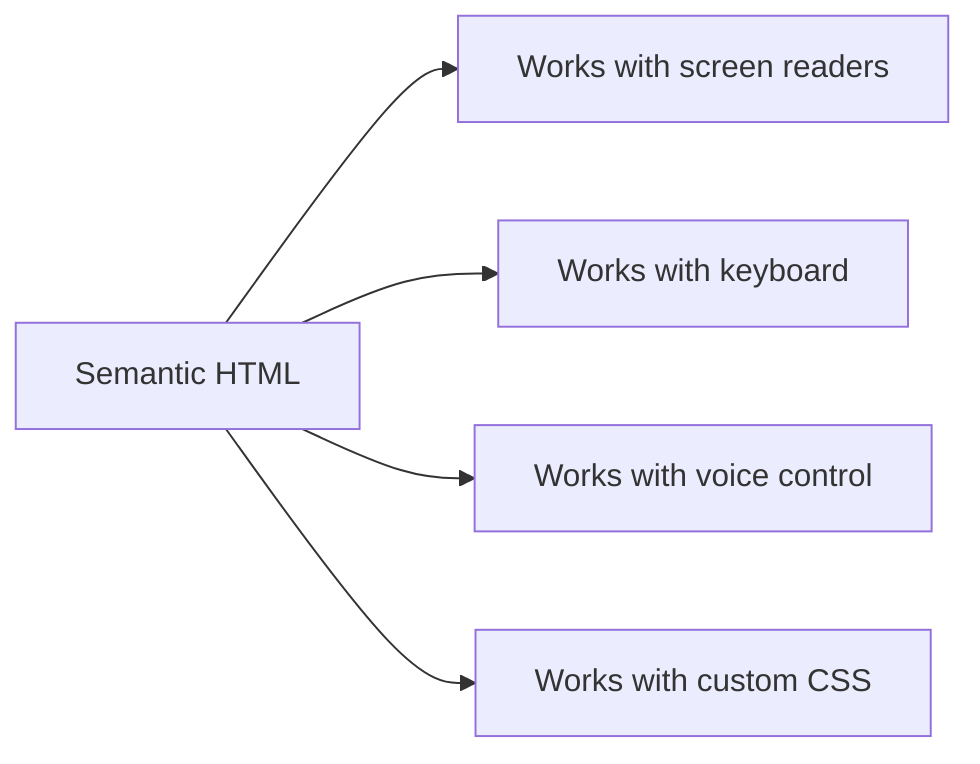
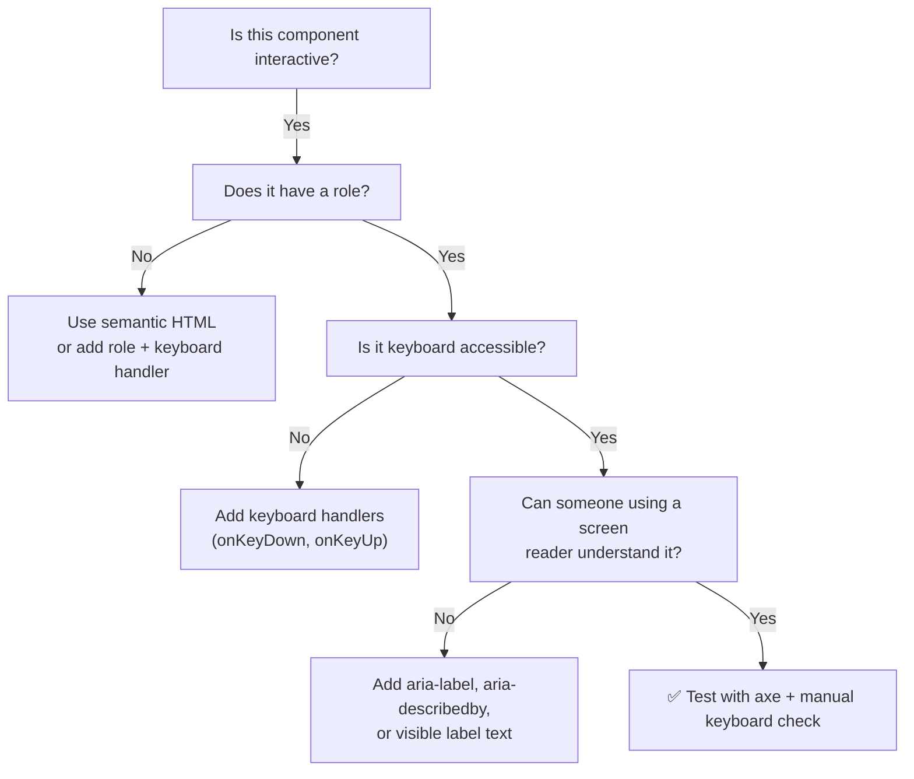

# Accessibility and A11y Testing in React

> [!summary] Goal
> Build React applications that work for everyone: keyboard-only users, screen reader users, and users with other disabilities. Cover both the *what* and the *how to test it*.

## Table of Contents

1. [Why Accessibility Matters](#why-accessibility-matters)
2. [Semantic HTML First](#semantic-html-first)
3. [Keyboard Navigation and Focus Management](#keyboard-navigation-and-focus-management)
4. [Form Controls and Validation](#form-controls-and-validation)
5. [Dynamic Content and Live Regions](#dynamic-content-and-live-regions)
6. [Portals, Modals, and Overlays](#portals-modals-and-overlays)
7. [Motion and Reduced Motion](#motion-and-reduced-motion)
8. [Testing Accessibility](#testing-accessibility)
9. [Pitfalls](#pitfalls)
10. [Q&A](#qa)

---

## Why Accessibility Matters

- **Legal**: WCAG 2.1 AA is a legal requirement in many jurisdictions.
- **Reach**: ~15% of the global population has some form of disability.
- **Quality**: Accessible UIs are generally better for *all* users (keyboard shortcuts, clear labels, high contrast).



---

## Semantic HTML First

### Default behaviour vs custom widget

```tsx
// ❌ Bad — no semantics, no keyboard interaction
<div className="btn" onClick={handleClick}>Submit</div>

// ✅ Good — semantic, keyboard accessible, free focus management
<button onClick={handleClick}>Submit</button>
```

### Landmarks

```tsx
<nav aria-label="Main navigation">...</nav>
<main>...</main>
<aside aria-label="Related articles">...</aside>
<footer>...</footer>
```

### Headings

```tsx
// ✅ Single h1 per page, nested h2/h3 by section
<h1>Dashboard</h1>
<section aria-labelledby="stats-heading">
  <h2 id="stats-heading">Statistics</h2>
</section>
```

---

## Keyboard Navigation and Focus Management

### Tab order

```tsx
// ✅ Natural tab order — order in DOM matches visual order
<div>
  <button>First</button>
  <button>Second</button>
  <button>Third</button>
</div>

// ❌ Avoid positive tabindex — it breaks the natural flow
<button tabIndex={5}>Skip to</button>
```

### Focus trap pattern (modal example)

```tsx
function FocusTrapModal({ isOpen, onClose, children }: {
  isOpen: boolean;
  onClose: () => void;
  children: React.ReactNode;
}) {
  const wrapperRef = useRef<HTMLDivElement>(null);

  useEffect(() => {
    if (!isOpen) return;

    const previouslyFocused = document.activeElement as HTMLElement;
    const focusableElements = wrapperRef.current!.querySelectorAll<HTMLElement>(
      'button, [href], input, select, textarea, [tabindex]:not([tabindex="-1"])'
    );
    const first = focusableElements[0];
    const last = focusableElements[focusableElements.length - 1];

    function handleTab(e: KeyboardEvent) {
      if (e.key !== 'Tab') return;
      if (e.shiftKey && document.activeElement === first) {
        e.preventDefault();
        last.focus();
      } else if (!e.shiftKey && document.activeElement === last) {
        e.preventDefault();
        first.focus();
      }
    }

    first?.focus();
    document.addEventListener('keydown', handleTab);

    return () => {
      document.removeEventListener('keydown', handleTab);
      previouslyFocused?.focus(); // restore focus on close
    };
  }, [isOpen]);

  if (!isOpen) return null;

  return (
    <div role="dialog" aria-modal="true" aria-labelledby="modal-title" ref={wrapperRef}>
      <h2 id="modal-title">{children}</h2>
      <button onClick={onClose}>Close</button>
    </div>
  );
}
```

---

## Form Controls and Validation

### Labels

```tsx
// ✅ Explicit label
<label htmlFor="email">Email</label>
<input id="email" type="email" />

// ✅ aria-label when no visible label
<button aria-label="Close dialog">X</button>

// ✅ aria-describedby for help text
<label htmlFor="password">Password</label>
<input id="password" type="password" aria-describedby="pw-hint" />
<p id="pw-hint">Must be at least 8 characters</p>
```

### Error messaging

```tsx
function FormField({ label, error, ...props }: {
  label: string;
  error?: string;
} & React.InputHTMLAttributes<HTMLInputElement>) {
  const id = useId();
  const errorId = `${id}-error`;

  return (
    <div>
      <label htmlFor={id}>{label}</label>
      <input
        id={id}
        aria-invalid={!!error}
        aria-describedby={error ? errorId : undefined}
        {...props}
      />
      {error && (
        <p id={errorId} role="alert" style={{ color: 'red' }}>
          {error}
        </p>
      )}
    </div>
  );
}

// Usage in a form
<FormField
  label="Email"
  type="email"
  value={email}
  onChange={handleChange}
  error={errors.email}
/>
```

---

## Dynamic Content and Live Regions

Use `aria-live` regions to announce content changes to screen readers without moving focus.

```tsx
function Toast({ message }: { message: string | null }) {
  return (
    <div aria-live="polite" aria-atomic="true">
      {message && <p>{message}</p>}
    </div>
  );
}
```

| Attribute | When to use |
|-----------|-------------|
| `aria-live="polite"` | Non-critical updates (toast, notification) |
| `aria-live="assertive"` | Critical updates (error, time-sensitive alert) |
| `role="status"` | Same as polite, clearer semantics |
| `role="alert"` | Same as assertive, clearer semantics |

---

## Portals, Modals, and Overlays

Portals render children into a different DOM node but preserve React event handling. This helps with stacking contexts (z-index, overflow).

```tsx
import { createPortal } from 'react-dom';

function Modal({ children, isOpen }: { children: React.ReactNode; isOpen: boolean }) {
  if (!isOpen) return null;

  return createPortal(
    <div role="dialog" aria-modal="true" aria-labelledby="modal-title">
      {children}
    </div>,
    document.body
  );
}
```

**A11y checklist for overlays:**
- Focus trap inside the overlay (see focus-trap pattern above).
- Close on `Escape` key.
- `aria-modal="true"` informs screen readers that content outside is not interactive.
- Restore focus to the trigger element on close.

---

## Motion and Reduced Motion

```tsx
import { useReducedMotion } from 'framer-motion';

function AnimatedBox() {
  const prefersReducedMotion = useReducedMotion();

  return (
    <motion.div
      animate={prefersReducedMotion ? { opacity: 1 } : { x: 100, opacity: 1 }}
      transition={{ duration: prefersReducedMotion ? 0 : 0.5 }}
    >
      Content
    </motion.div>
  );
}
```

### CSS approach

```css
@media (prefers-reduced-motion: reduce) {
  *, *::before, *::after {
    animation-duration: 0.01ms !important;
    transition-duration: 0.01ms !important;
  }
}
```

---

## Testing Accessibility

### Static analysis

```bash
npm install -D eslint-plugin-jsx-a11y
```

```json
{
  "plugins": ["jsx-a11y"],
  "extends": ["plugin:jsx-a11y/recommended"]
}
```

### Unit tests with jest-axe

```bash
npm install -D @axe-core/react @testing-library/jest-dom
```

```tsx
import { render } from '@testing-library/react';
import { axe, toHaveNoViolations } from 'jest-axe';

expect.extend(toHaveNoViolations);

it('renders without a11y violations', async () => {
  const { container } = render(<Button>Click me</Button>);
  const results = await axe(container);
  expect(results).toHaveNoViolations();
});
```

### Manual testing checklist

- Navigate the entire app with `Tab`, `Shift+Tab`, and `Enter` only.
- Verify every interactive element is reachable and operable.
- Test with a screen reader (VoiceOver on Mac, NVDA on Windows).
- Check colour contrast using DevTools or a contrast checker.

---

## Pitfalls

- **`div` soup** — a page full of `<div onClick>` with no semantic roles is inaccessible. Use `<button>`, `<a>`, `<nav>`, `<main>`.
- **Missing focus indicators** — never do `:focus { outline: none }` without providing an alternative focus ring.
- **Relying only on colour** — errors shown only by turning an input red need an icon, label, or `aria-invalid`.
- **Overriding browser defaults badly** — removing default button styles *and* not providing custom focus/active states.
- **Animations that can't be stopped** — always respect `prefers-reduced-motion`.



---

## Q&A

> [!question]- Should I use a library or build my own accessible components?

For complex patterns (tabs, accordions, combobox), use a library like **Radix UI**, **Reach UI**, or **React Aria**. They handle ARIA attributes and keyboard behaviour. For simple cases (button, link, form), native HTML with proper labelling is best.

> [!question]- Can I skip accessibility for internal tools?

No. Disabilities are not limited to external users. Keyboard-only usage is common among power users of internal apps.

> [!question]- How do I test accessibility in CI?

Add `jest-axe` to your test suite and run it on every PR. Use `pa11y-ci` for crawling pages. Set a threshold of "0 a11y violations" for merge.

## References

- [WCAG 2.1 Specification](https://www.w3.org/TR/WCAG21/)
- [MDN Accessibility](https://developer.mozilla.org/en-US/docs/Web/Accessibility)
- [React Aria](https://react-spectrum.adobe.com/react-aria/)
- [jest-axe](https://github.com/nickcolley/jest-axe)
- [[React/02_Core/04_Forms_and_Validation]]
- [[React/04_Playbooks/05_Portals_and_Teleporting_UI]]
- [[React/04_Playbooks/10_Animation_with_Framer_Motion]]
