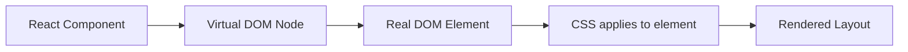

# Layout and Styling Debugging with React

> [!summary] Goal
> Understand how React components map to DOM elements, how CSS interacts with that structure, and how to debug layout problems effectively.

## Table of Contents

1. [Components vs DOM vs CSS](#components-vs-dom-vs-css)
2. [Common Layout Patterns in React Components](#common-layout-patterns-in-react-components)
3. [Tailwind and Component Structure](#tailwind-and-component-structure)
4. [Debugging Layout in DevTools](#debugging-layout-in-devtools)
5. [Layout Performance and Layout Thrash](#layout-performance-and-layout-thrash)
6. [Pitfalls](#pitfalls)
7. [Q&A](#qa)

---

## Components vs DOM vs CSS



- React manages which DOM elements exist and what their attributes/classes are.
- CSS manages the visual presentation of those elements.
- The browser's rendering engine paints the result.

### What React controls

- Which elements are rendered (`<div>`, `<section>`, `<button>`).
- Class names, inline styles, data attributes.
- When elements appear/disappear (conditional rendering).

### What React doesn't control

- How elements are laid out (flex, grid, block) — that is CSS.
- How elements respond to viewport size — that is media queries and CSS.

---

## Common Layout Patterns in React Components

### Sidebar + Content

```tsx
function Layout({ sidebar, children }: {
  sidebar: React.ReactNode;
  children: React.ReactNode;
}) {
  return (
    <div className="layout">
      <aside className="sidebar">{sidebar}</aside>
      <main className="content">{children}</main>
    </div>
  );
}
```

```css
.layout {
  display: grid;
  grid-template-columns: 250px 1fr;
  min-height: 100vh;
}
```

### Responsive Card Grid

```tsx
function CardGrid({ items }: { items: CardItem[] }) {
  return (
    <div className="card-grid">
      {items.map(item => <Card key={item.id} item={item} />)}
    </div>
  );
}
```

```css
.card-grid {
  display: grid;
  grid-template-columns: repeat(auto-fill, minmax(280px, 1fr));
  gap: 1rem;
}
```

### Centered Content

```tsx
function CenteredLayout({ children }: { children: React.ReactNode }) {
  return <div className="centered">{children}</div>;
}
```

```css
.centered {
  display: flex;
  flex-direction: column;
  align-items: center;
  justify-content: center;
  min-height: 100vh;
}
```

---

## Tailwind and Component Structure

```tsx
function ProductCard({ product }: { product: Product }) {
  return (
    <div className="flex rounded-lg border p-4 shadow-sm hover:shadow-md transition-shadow">
      
      <div className="ml-4 flex flex-col justify-between">
        <h3 className="text-lg font-semibold">{product.name}</h3>
        <p className="text-gray-600">${product.price}</p>
        <button className="mt-2 self-start rounded bg-blue-600 px-4 py-1 text-white hover:bg-blue-700">
          Add to cart
        </button>
      </div>
    </div>
  );
}
```

### Component-driven class composition

```tsx
function Container({ className = '', children }: {
  className?: string;
  children: React.ReactNode;
}) {
  return (
    <div className={`mx-auto max-w-7xl px-4 sm:px-6 lg:px-8 ${className}`}>
      {children}
    </div>
  );
}
```

---

## Debugging Layout in DevTools

### When a layout breaks

1. **Open Elements panel** (`F12` → Elements).
2. **Inspect the component** — right-click → Inspect.
3. **Check the computed box model**.
4. **Toggle CSS properties** to find which rule causes the issue.

### Common checks

```
🔍 Layout looks wrong:
  → Is the parent display: flex / grid?
  → Is a child taking more space than expected?
  → Is overflow: hidden cutting content?

🔍 Z-index not working:
  → Is there a stacking context (position, opacity, transform)?
  → Which element is the actual parent in the stacking order?

🔍 Gap appears unexpectedly:
  → Check margin on children.
  → Check for whitespace between inline-block elements.
```

### React DevTools integration

- React DevTools shows component hierarchies in the Components tab.
- Click a component → see its props, state, and rendered DOM.
- Use the **Profiler** to record interactions and check if many re-renders are causing layout shifts.

---

## Layout Performance and Layout Thrash

**Layout thrash** happens when JavaScript reads layout values (offsetHeight, scrollTop) then writes new styles in the same synchronous block, causing the browser to perform layout multiple times.

### Bad pattern (layout thrash)

```tsx
function BadExample({ items }: { items: Item[] }) {
  const listRef = useRef<HTMLUListElement>(null);

  useEffect(() => {
    items.forEach((_, i) => {
      // Read
      const height = listRef.current!.children[i].clientHeight;
      // Write — forces layout recalculation
      (listRef.current!.children[i] as HTMLElement).style.height = `${height * 1.5}px`;
    });
  }, [items]);

  return <ul ref={listRef}>...</ul>;
}
```

### Good pattern (batch reads/writes)

```tsx
function GoodExample({ items }: { items: Item[] }) {
  const listRef = useRef<HTMLUListElement>(null);

  useEffect(() => {
    const children = listRef.current!.children as HTMLCollectionOf<HTMLElement>;
    // Batch 1: read all heights
    const heights = Array.from(children).map(el => el.clientHeight);
    // Batch 2: write all heights
    children.forEach((el, i) => {
      el.style.height = `${heights[i] * 1.5}px`;
    });
  }, [items]);

  return <ul ref={listRef}>...</ul>;
}
```

### What to look for in DevTools Performance tab

- **Forced reflow** (red triangle): indicates layout thrash.
- **Long layout tasks** (>50ms): the browser spent too long recalculating layout.
- **Recurring pattern**: read/write/read/write alternating means thrash.

---

## Pitfalls

- **Extra wrapping elements** — a `<div>` wrapping every component can break CSS Grid/Flex layouts. Use `<>` fragments when you don't need a DOM node.
- **Inline styles for layout** — React inline `style={}` bypasses media queries and pseudo-classes. Use CSS modules, Tailwind, or a stylesheet for layout.
- **`useLayoutEffect` for reading before paint** — synchronously measuring and writing in `useLayoutEffect` can delay the paint. Prefer `useEffect` + `requestAnimationFrame` where possible.
- **Not accounting for scrollbar width** — `100vw` includes the scrollbar, `width: 100%` does not. When a component uses `100vw`, it may overflow on some OS configurations.
- **Assuming children have fixed size** — components that don't know their children's size should use flex/grid-based centering, not absolute positioning with magic numbers.

---

## Q&A

> [!question]- When should I use CSS Modules vs Tailwind vs styled-components?

- **CSS Modules**: component-scoped CSS with no runtime cost. Good for large, design-system-driven apps.
- **Tailwind**: utility-first, excellent for rapid prototyping and small/medium apps with custom designs.
- **styled-components** / **Emotion**: runtime CSS-in-JS with dynamic styling. Powerful but has a runtime cost. Use when you need dynamic styles at scale.

> [!question]- My grid layout looks different in React than in plain HTML. Why?

Check that React isn't adding extra wrapper elements. If you use `<>` properly and your CSS matches the expected DOM structure, it behaves identically. Common culprit: an extra `div` around a list item inside a grid.

> [!question]- How do I debug responsive layouts in React?

Use the browser's responsive design mode (DevTools → Toggle Device Toolbar). React components re-render on resize — check the Profiler to see if resize events cause excessive re-renders.

## References

- [MDN CSS Layout](https://developer.mozilla.org/en-US/docs/Learn/CSS/CSS_layout)
- [Web.dev – Avoid Layout Thrash](https://web.dev/avoid-large-complex-layouts-and-layout-thrashing/)
- [React DevTools](https://react.dev/learn/react-developer-tools)
- [[React/04_Playbooks/06_Tailwind_CSS_and_Styling_Strategies]]
- [[React/03_Advanced/02_Performance_and_Profiling]]
