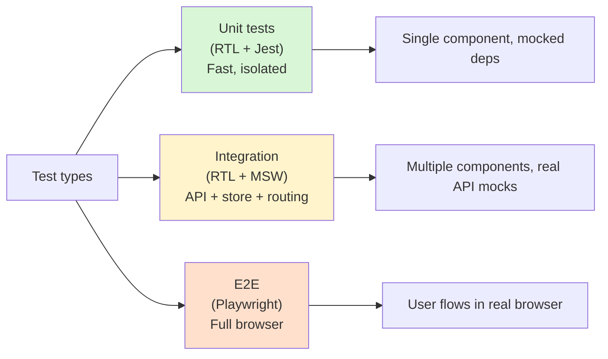

# Testing React (React Testing Library + MSW)

> [!summary] Philosophy
> Test your components the way users interact with them—query by accessible roles, labels, and text. Mock network requests with MSW instead of mocking implementation details.

## Table of Contents

1. [Testing Philosophy](#testing-philosophy)
2. [Setup and Configuration](#setup-and-configuration)
3. [React Testing Library API](#react-testing-library-api)
4. [Testing Patterns](#testing-patterns)
5. [Testing Hooks](#testing-hooks)
6. [Async Testing](#async-testing)
7. [MSW (Mock Service Worker)](#msw)
8. [Testing Redux and RTK Query](#testing-redux-and-rtk-query)
9. [Testing React Router](#testing-react-router)
10. [Complete Test Examples](#complete-test-examples)
11. [Testing Checklist](#testing-checklist)
12. [Interview Questions](#interview-questions)

---

## Testing Philosophy

> [!info] Testing Library philosophy
> React Testing Library encourages testing **behavior**, not implementation. You interact with your app as a user would: find elements by accessible labels, text content, and roles — not by internal IDs, classes, or state values. Tests focus on what the user sees and does, making them resilient to refactoring.



### Guiding Principles

**1. Test behavior, not implementation**

```tsx
// ❌ BAD: Testing implementation details
test('increments count state', () => {
  const { result } = renderHook(() => useCounter());
  expect(result.current.count).toBe(0);
  act(() => result.current.increment());
  expect(result.current.count).toBe(1);
});

// ✅ GOOD: Testing user behavior
test('increments count when button clicked', async () => {
  const user = userEvent.setup();
  render(<Counter />);
  
  expect(screen.getByText(/count: 0/i)).toBeInTheDocument();
  await user.click(screen.getByRole('button', { name: /increment/i }));
  expect(screen.getByText(/count: 1/i)).toBeInTheDocument();
});
```

**2. Query by accessibility attributes**

Priority order:
1. `getByRole` - Most accessible
2. `getByLabelText` - Form inputs
3. `getByPlaceholderText` - Fallback for inputs
4. `getByText` - Non-interactive content
5. `getByTestId` - Last resort

**3. Avoid testing React internals**

```tsx
// ❌ BAD: Testing state/props directly
expect(wrapper.state('isOpen')).toBe(true);
expect(wrapper.props().onClick).toHaveBeenCalled();

// ✅ GOOD: Testing visible behavior
expect(screen.getByRole('dialog')).toBeInTheDocument();
expect(screen.getByText(/modal content/i)).toBeInTheDocument();
```

**4. Write tests that resemble how users interact**

```tsx
// ❌ BAD: Directly calling handlers
const handleClick = jest.fn();
render(<Button onClick={handleClick} />);
handleClick();

// ✅ GOOD: Simulating user interaction
const user = userEvent.setup();
render(<Button onClick={handleClick} />);
await user.click(screen.getByRole('button'));
```

---

## Setup and Configuration

### Installation

```bash
# Core testing dependencies
npm install -D @testing-library/react @testing-library/jest-dom @testing-library/user-event
npm install -D vitest jsdom @vitest/ui
npm install -D msw

# For Redux testing
npm install -D @reduxjs/toolkit
```

### Vitest Configuration

**vite.config.ts**:

```ts
import { defineConfig } from 'vite';
import react from '@vitejs/plugin-react';

export default defineConfig({
  plugins: [react()],
  test: {
    globals: true,
    environment: 'jsdom',
    setupFiles: './src/test/setup.ts',
    css: true,
    coverage: {
      provider: 'v8',
      reporter: ['text', 'json', 'html'],
      exclude: [
        'node_modules/',
        'src/test/',
        '**/*.d.ts',
        '**/*.config.*',
        '**/mockData',
        'dist/',
      ],
    },
  },
});
```

### Test Setup File

**src/test/setup.ts**:

```ts
import '@testing-library/jest-dom';
import { cleanup } from '@testing-library/react';
import { afterEach } from 'vitest';

// Cleanup after each test
afterEach(() => {
  cleanup();
});

// Mock window.matchMedia
Object.defineProperty(window, 'matchMedia', {
  writable: true,
  value: vi.fn().mockImplementation(query => ({
    matches: false,
    media: query,
    onchange: null,
    addListener: vi.fn(), // Deprecated
    removeListener: vi.fn(), // Deprecated
    addEventListener: vi.fn(),
    removeEventListener: vi.fn(),
    dispatchEvent: vi.fn(),
  })),
});

// Mock IntersectionObserver
global.IntersectionObserver = class IntersectionObserver {
  constructor() {}
  disconnect() {}
  observe() {}
  takeRecords() {
    return [];
  }
  unobserve() {}
} as any;
```

### Custom Render Utility

**src/test/utils.tsx**:

```tsx
import { render, RenderOptions } from '@testing-library/react';
import { ReactElement } from 'react';
import { Provider } from 'react-redux';
import { BrowserRouter } from 'react-router-dom';
import { store } from '../store';

interface CustomRenderOptions extends Omit<RenderOptions, 'wrapper'> {
  initialState?: any;
  store?: any;
}

function AllTheProviders({ children }: { children: React.ReactNode }) {
  return (
    <Provider store={store}>
      <BrowserRouter>
        {children}
      </BrowserRouter>
    </Provider>
  );
}

export function renderWithProviders(
  ui: ReactElement,
  options?: CustomRenderOptions
) {
  return render(ui, { wrapper: AllTheProviders, ...options });
}

// Re-export everything
export * from '@testing-library/react';
export { default as userEvent } from '@testing-library/user-event';
```

---

## React Testing Library API

### Queries

**Query Types**:

| Query Type | Returns | Throws Error | Waits |
|------------|---------|--------------|-------|
| `getBy...` | Element | Yes (if not found) | No |
| `queryBy...` | Element or null | No | No |
| `findBy...` | Promise<Element> | Yes (if not found) | Yes |
| `getAllBy...` | Array<Element> | Yes (if empty) | No |
| `queryAllBy...` | Array<Element> | No | No |
| `findAllBy...` | Promise<Array<Element>> | Yes (if empty) | Yes |

**When to use each**:

```tsx
// getBy: Element is guaranteed to be present
const button = screen.getByRole('button', { name: /submit/i });

// queryBy: Check if element is NOT present
expect(screen.queryByText(/error/i)).not.toBeInTheDocument();

// findBy: Element appears asynchronously
const message = await screen.findByText(/success/i);

// getAllBy: Multiple elements
const listItems = screen.getAllByRole('listitem');
expect(listItems).toHaveLength(3);
```

### Query Methods (in priority order)

**1. ByRole (Most Accessible)**

```tsx
// Button
screen.getByRole('button', { name: /submit/i });

// Link
screen.getByRole('link', { name: /home/i });

// Heading
screen.getByRole('heading', { name: /title/i, level: 1 });

// Textbox (input type="text", textarea)
screen.getByRole('textbox', { name: /email/i });

// Checkbox
screen.getByRole('checkbox', { name: /agree/i });

// Radio
screen.getByRole('radio', { name: /yes/i });

// Select
screen.getByRole('combobox', { name: /country/i });

// List
screen.getByRole('list');
screen.getAllByRole('listitem');

// Dialog
screen.getByRole('dialog');

// Table
screen.getByRole('table');
screen.getAllByRole('row');
screen.getAllByRole('cell');

// Alert
screen.getByRole('alert');

// Common roles
// button, link, textbox, heading, listitem, checkbox, radio, combobox, dialog, etc.
```

**2. ByLabelText (Form Inputs)**

```tsx
// For <label htmlFor="email">Email</label>
screen.getByLabelText(/email/i);

// For <input aria-label="Email" />
screen.getByLabelText(/email/i);

// For wrapped label
// <label>Email <input /></label>
screen.getByLabelText(/email/i);
```

**3. ByPlaceholderText**

```tsx
screen.getByPlaceholderText(/enter email/i);
```

**4. ByText**

```tsx
// Exact match
screen.getByText('Exact Text');

// Case-insensitive regex
screen.getByText(/submit/i);

// Partial match function
screen.getByText((content, element) => content.startsWith('Hello'));

// Within specific element
const form = screen.getByRole('form');
within(form).getByText(/submit/i);
```

**5. ByDisplayValue**

```tsx
// For inputs with value
screen.getByDisplayValue('current value');
```

**6. ByAltText**

```tsx
// For images
screen.getByAltText(/company logo/i);
```

**7. ByTitle**

```tsx
// For elements with title attribute
screen.getByTitle(/close/i);
```

**8. ByTestId (Last Resort)**

```tsx
// Add data-testid="submit-button"
screen.getByTestId('submit-button');
```

### User Interactions

Always use `@testing-library/user-event` instead of `fireEvent`:

```tsx
import userEvent from '@testing-library/user-event';

test('user interactions', async () => {
  const user = userEvent.setup();

  // Click
  await user.click(screen.getByRole('button'));

  // Double click
  await user.dblClick(screen.getByRole('button'));

  // Type
  await user.type(screen.getByLabelText(/email/i), 'test@example.com');

  // Clear and type
  await user.clear(screen.getByLabelText(/email/i));
  await user.type(screen.getByLabelText(/email/i), 'new@example.com');

  // Select dropdown
  await user.selectOptions(screen.getByLabelText(/country/i), 'USA');

  // Upload file
  const file = new File(['hello'], 'hello.png', { type: 'image/png' });
  const input = screen.getByLabelText(/upload/i) as HTMLInputElement;
  await user.upload(input, file);

  // Checkbox
  await user.click(screen.getByRole('checkbox', { name: /agree/i }));

  // Hover
  await user.hover(screen.getByRole('button'));
  await user.unhover(screen.getByRole('button'));

  // Tab navigation
  await user.tab();

  // Keyboard
  await user.keyboard('{Enter}');
  await user.keyboard('{Escape}');
  await user.keyboard('{ArrowDown}{ArrowUp}');
});
```

### Assertions (jest-dom matchers)

```tsx
import '@testing-library/jest-dom';

// Presence
expect(element).toBeInTheDocument();
expect(element).not.toBeInTheDocument();

// Visibility
expect(element).toBeVisible();
expect(element).not.toBeVisible();

// Enabled/Disabled
expect(button).toBeEnabled();
expect(button).toBeDisabled();

// Form values
expect(input).toHaveValue('test@example.com');
expect(checkbox).toBeChecked();
expect(checkbox).not.toBeChecked();

// Text content
expect(element).toHaveTextContent('Hello World');
expect(element).toHaveTextContent(/hello/i);

// Attributes
expect(link).toHaveAttribute('href', '/home');
expect(input).toHaveAttribute('type', 'email');

// Classes
expect(element).toHaveClass('active');
expect(element).toHaveClass('btn', 'btn-primary');

// Style
expect(element).toHaveStyle('display: none');
expect(element).toHaveStyle({ color: 'red' });

// Focus
expect(input).toHaveFocus();

// Accessibility
expect(button).toHaveAccessibleName('Submit');
expect(input).toHaveAccessibleDescription('Enter your email');

// Form elements
expect(select).toHaveFormValues({ country: 'USA' });
expect(input).toHaveDisplayValue('test@example.com');

// Error messages
expect(input).toBeInvalid();
expect(input).toBeValid();
```

---

## Testing Patterns

### Testing a Simple Component

```tsx
// Button.tsx
interface ButtonProps {
  onClick: () => void;
  children: React.ReactNode;
  variant?: 'primary' | 'secondary';
  disabled?: boolean;
}

export function Button({ onClick, children, variant = 'primary', disabled }: ButtonProps) {
  return (
    <button
      onClick={onClick}
      className={`btn btn-${variant}`}
      disabled={disabled}
    >
      {children}
    </button>
  );
}

// Button.test.tsx
import { render, screen } from '@testing-library/react';
import userEvent from '@testing-library/user-event';
import { Button } from './Button';

describe('Button', () => {
  it('renders with children', () => {
    render(<Button onClick={() => {}}>Click Me</Button>);
    expect(screen.getByRole('button', { name: /click me/i })).toBeInTheDocument();
  });

  it('calls onClick when clicked', async () => {
    const user = userEvent.setup();
    const handleClick = vi.fn();
    render(<Button onClick={handleClick}>Click</Button>);

    await user.click(screen.getByRole('button'));
    expect(handleClick).toHaveBeenCalledTimes(1);
  });

  it('applies variant class', () => {
    render(<Button onClick={() => {}} variant="secondary">Click</Button>);
    expect(screen.getByRole('button')).toHaveClass('btn-secondary');
  });

  it('is disabled when disabled prop is true', () => {
    render(<Button onClick={() => {}} disabled>Click</Button>);
    expect(screen.getByRole('button')).toBeDisabled();
  });

  it('does not call onClick when disabled', async () => {
    const user = userEvent.setup();
    const handleClick = vi.fn();
    render(<Button onClick={handleClick} disabled>Click</Button>);

    await user.click(screen.getByRole('button'));
    expect(handleClick).not.toHaveBeenCalled();
  });
});
```

### Testing Form Components

```tsx
// LoginForm.tsx
import { useState } from 'react';

interface LoginFormProps {
  onSubmit: (data: { email: string; password: string }) => Promise<void>;
}

export function LoginForm({ onSubmit }: LoginFormProps) {
  const [email, setEmail] = useState('');
  const [password, setPassword] = useState('');
  const [error, setError] = useState<string | null>(null);
  const [isSubmitting, setIsSubmitting] = useState(false);

  const handleSubmit = async (e: React.FormEvent) => {
    e.preventDefault();
    setError(null);

    if (!email) {
      setError('Email is required');
      return;
    }

    if (!password) {
      setError('Password is required');
      return;
    }

    setIsSubmitting(true);
    try {
      await onSubmit({ email, password });
    } catch (err) {
      setError(err instanceof Error ? err.message : 'Login failed');
    } finally {
      setIsSubmitting(false);
    }
  };

  return (
    <form onSubmit={handleSubmit}>
      <div>
        <label htmlFor="email">Email</label>
        <input
          id="email"
          type="email"
          value={email}
          onChange={(e) => setEmail(e.target.value)}
        />
      </div>

      <div>
        <label htmlFor="password">Password</label>
        <input
          id="password"
          type="password"
          value={password}
          onChange={(e) => setPassword(e.target.value)}
        />
      </div>

      {error && <div role="alert">{error}</div>}

      <button type="submit" disabled={isSubmitting}>
        {isSubmitting ? 'Logging in...' : 'Log In'}
      </button>
    </form>
  );
}

// LoginForm.test.tsx
import { render, screen, waitFor } from '@testing-library/react';
import userEvent from '@testing-library/user-event';
import { LoginForm } from './LoginForm';

describe('LoginForm', () => {
  it('renders email and password inputs', () => {
    render(<LoginForm onSubmit={async () => {}} />);
    
    expect(screen.getByLabelText(/email/i)).toBeInTheDocument();
    expect(screen.getByLabelText(/password/i)).toBeInTheDocument();
    expect(screen.getByRole('button', { name: /log in/i })).toBeInTheDocument();
  });

  it('shows validation error when email is empty', async () => {
    const user = userEvent.setup();
    render(<LoginForm onSubmit={async () => {}} />);

    await user.click(screen.getByRole('button', { name: /log in/i }));

    expect(await screen.findByRole('alert')).toHaveTextContent(/email is required/i);
  });

  it('shows validation error when password is empty', async () => {
    const user = userEvent.setup();
    render(<LoginForm onSubmit={async () => {}} />);

    await user.type(screen.getByLabelText(/email/i), 'test@example.com');
    await user.click(screen.getByRole('button', { name: /log in/i }));

    expect(await screen.findByRole('alert')).toHaveTextContent(/password is required/i);
  });

  it('submits form with valid credentials', async () => {
    const user = userEvent.setup();
    const handleSubmit = vi.fn().mockResolvedValue(undefined);
    render(<LoginForm onSubmit={handleSubmit} />);

    await user.type(screen.getByLabelText(/email/i), 'test@example.com');
    await user.type(screen.getByLabelText(/password/i), 'password123');
    await user.click(screen.getByRole('button', { name: /log in/i }));

    await waitFor(() => {
      expect(handleSubmit).toHaveBeenCalledWith({
        email: 'test@example.com',
        password: 'password123',
      });
    });
  });

  it('shows error message when submission fails', async () => {
    const user = userEvent.setup();
    const handleSubmit = vi.fn().mockRejectedValue(new Error('Invalid credentials'));
    render(<LoginForm onSubmit={handleSubmit} />);

    await user.type(screen.getByLabelText(/email/i), 'test@example.com');
    await user.type(screen.getByLabelText(/password/i), 'wrong');
    await user.click(screen.getByRole('button', { name: /log in/i }));

    expect(await screen.findByRole('alert')).toHaveTextContent(/invalid credentials/i);
  });

  it('disables submit button while submitting', async () => {
    const user = userEvent.setup();
    const handleSubmit = vi.fn(() => new Promise(resolve => setTimeout(resolve, 100)));
    render(<LoginForm onSubmit={handleSubmit} />);

    await user.type(screen.getByLabelText(/email/i), 'test@example.com');
    await user.type(screen.getByLabelText(/password/i), 'password123');
    
    const submitButton = screen.getByRole('button', { name: /log in/i });
    await user.click(submitButton);

    expect(submitButton).toBeDisabled();
    expect(submitButton).toHaveTextContent(/logging in/i);

    await waitFor(() => {
      expect(submitButton).toBeEnabled();
      expect(submitButton).toHaveTextContent(/log in/i);
    });
  });
});
```

### Testing Conditional Rendering

```tsx
// UserProfile.tsx
interface User {
  name: string;
  email: string;
  isPremium: boolean;
}

interface UserProfileProps {
  user: User | null;
  isLoading: boolean;
}

export function UserProfile({ user, isLoading }: UserProfileProps) {
  if (isLoading) {
    return <div>Loading...</div>;
  }

  if (!user) {
    return <div>No user found</div>;
  }

  return (
    <div>
      <h1>{user.name}</h1>
      <p>{user.email}</p>
      {user.isPremium && <span>Premium Member</span>}
    </div>
  );
}

// UserProfile.test.tsx
describe('UserProfile', () => {
  it('shows loading state', () => {
    render(<UserProfile user={null} isLoading={true} />);
    expect(screen.getByText(/loading/i)).toBeInTheDocument();
  });

  it('shows "no user" when user is null', () => {
    render(<UserProfile user={null} isLoading={false} />);
    expect(screen.getByText(/no user found/i)).toBeInTheDocument();
  });

  it('renders user information', () => {
    const user = { name: 'John Doe', email: 'john@example.com', isPremium: false };
    render(<UserProfile user={user} isLoading={false} />);

    expect(screen.getByRole('heading', { name: /john doe/i })).toBeInTheDocument();
    expect(screen.getByText(/john@example.com/i)).toBeInTheDocument();
  });

  it('shows premium badge for premium users', () => {
    const user = { name: 'Jane Doe', email: 'jane@example.com', isPremium: true };
    render(<UserProfile user={user} isLoading={false} />);

    expect(screen.getByText(/premium member/i)).toBeInTheDocument();
  });

  it('does not show premium badge for non-premium users', () => {
    const user = { name: 'John Doe', email: 'john@example.com', isPremium: false };
    render(<UserProfile user={user} isLoading={false} />);

    expect(screen.queryByText(/premium member/i)).not.toBeInTheDocument();
  });
});
```

### Testing Lists

```tsx
// TodoList.tsx
interface Todo {
  id: number;
  text: string;
  completed: boolean;
}

interface TodoListProps {
  todos: Todo[];
  onToggle: (id: number) => void;
  onDelete: (id: number) => void;
}

export function TodoList({ todos, onToggle, onDelete }: TodoListProps) {
  if (todos.length === 0) {
    return <p>No todos yet</p>;
  }

  return (
    <ul>
      {todos.map((todo) => (
        <li key={todo.id}>
          <input
            type="checkbox"
            checked={todo.completed}
            onChange={() => onToggle(todo.id)}
            aria-label={`Toggle ${todo.text}`}
          />
          <span style={{ textDecoration: todo.completed ? 'line-through' : 'none' }}>
            {todo.text}
          </span>
          <button onClick={() => onDelete(todo.id)} aria-label={`Delete ${todo.text}`}>
            Delete
          </button>
        </li>
      ))}
    </ul>
  );
}

// TodoList.test.tsx
describe('TodoList', () => {
  const todos = [
    { id: 1, text: 'Buy milk', completed: false },
    { id: 2, text: 'Walk dog', completed: true },
    { id: 3, text: 'Write code', completed: false },
  ];

  it('shows "no todos" message when list is empty', () => {
    render(<TodoList todos={[]} onToggle={() => {}} onDelete={() => {}} />);
    expect(screen.getByText(/no todos yet/i)).toBeInTheDocument();
  });

  it('renders all todos', () => {
    render(<TodoList todos={todos} onToggle={() => {}} onDelete={() => {}} />);
    
    const listItems = screen.getAllByRole('listitem');
    expect(listItems).toHaveLength(3);
    
    expect(screen.getByText(/buy milk/i)).toBeInTheDocument();
    expect(screen.getByText(/walk dog/i)).toBeInTheDocument();
    expect(screen.getByText(/write code/i)).toBeInTheDocument();
  });

  it('marks completed todos with line-through', () => {
    render(<TodoList todos={todos} onToggle={() => {}} onDelete={() => {}} />);
    
    const walkDog = screen.getByText(/walk dog/i);
    expect(walkDog).toHaveStyle('text-decoration: line-through');
    
    const buyMilk = screen.getByText(/buy milk/i);
    expect(buyMilk).toHaveStyle('text-decoration: none');
  });

  it('calls onToggle when checkbox is clicked', async () => {
    const user = userEvent.setup();
    const handleToggle = vi.fn();
    render(<TodoList todos={todos} onToggle={handleToggle} onDelete={() => {}} />);

    await user.click(screen.getByLabelText(/toggle buy milk/i));
    expect(handleToggle).toHaveBeenCalledWith(1);
  });

  it('calls onDelete when delete button is clicked', async () => {
    const user = userEvent.setup();
    const handleDelete = vi.fn();
    render(<TodoList todos={todos} onToggle={() => {}} onDelete={handleDelete} />);

    await user.click(screen.getByLabelText(/delete buy milk/i));
    expect(handleDelete).toHaveBeenCalledWith(1);
  });
});
```

---

## Testing Hooks

Use `@testing-library/react-hooks` or test hooks through components.

### Testing Custom Hooks

```tsx
// useCounter.ts
import { useState } from 'react';

export function useCounter(initialValue = 0) {
  const [count, setCount] = useState(initialValue);

  const increment = () => setCount(c => c + 1);
  const decrement = () => setCount(c => c - 1);
  const reset = () => setCount(initialValue);

  return { count, increment, decrement, reset };
}

// useCounter.test.ts
import { renderHook, act } from '@testing-library/react';
import { useCounter } from './useCounter';

describe('useCounter', () => {
  it('initializes with default value', () => {
    const { result } = renderHook(() => useCounter());
    expect(result.current.count).toBe(0);
  });

  it('initializes with custom value', () => {
    const { result } = renderHook(() => useCounter(10));
    expect(result.current.count).toBe(10);
  });

  it('increments count', () => {
    const { result } = renderHook(() => useCounter());
    
    act(() => {
      result.current.increment();
    });
    
    expect(result.current.count).toBe(1);
  });

  it('decrements count', () => {
    const { result } = renderHook(() => useCounter(5));
    
    act(() => {
      result.current.decrement();
    });
    
    expect(result.current.count).toBe(4);
  });

  it('resets count to initial value', () => {
    const { result } = renderHook(() => useCounter(10));
    
    act(() => {
      result.current.increment();
      result.current.increment();
    });
    expect(result.current.count).toBe(12);
    
    act(() => {
      result.current.reset();
    });
    expect(result.current.count).toBe(10);
  });
});
```

### Testing Hooks with Dependencies

```tsx
// useFetch.ts
import { useState, useEffect } from 'react';

export function useFetch<T>(url: string) {
  const [data, setData] = useState<T | null>(null);
  const [loading, setLoading] = useState(true);
  const [error, setError] = useState<Error | null>(null);

  useEffect(() => {
    let cancelled = false;

    const fetchData = async () => {
      try {
        setLoading(true);
        const response = await fetch(url);
        if (!response.ok) throw new Error('Failed to fetch');
        const json = await response.json();
        
        if (!cancelled) {
          setData(json);
          setError(null);
        }
      } catch (err) {
        if (!cancelled) {
          setError(err instanceof Error ? err : new Error('Unknown error'));
        }
      } finally {
        if (!cancelled) {
          setLoading(false);
        }
      }
    };

    fetchData();

    return () => {
      cancelled = true;
    };
  }, [url]);

  return { data, loading, error };
}

// useFetch.test.ts
import { renderHook, waitFor } from '@testing-library/react';
import { rest } from 'msw';
import { setupServer } from 'msw/node';
import { useFetch } from './useFetch';

const server = setupServer(
  rest.get('/api/users', (req, res, ctx) => {
    return res(ctx.json({ name: 'John Doe' }));
  })
);

beforeAll(() => server.listen());
afterEach(() => server.resetHandlers());
afterAll(() => server.close());

describe('useFetch', () => {
  it('fetches data successfully', async () => {
    const { result } = renderHook(() => useFetch('/api/users'));

    expect(result.current.loading).toBe(true);
    expect(result.current.data).toBe(null);

    await waitFor(() => {
      expect(result.current.loading).toBe(false);
    });

    expect(result.current.data).toEqual({ name: 'John Doe' });
    expect(result.current.error).toBe(null);
  });

  it('handles fetch errors', async () => {
    server.use(
      rest.get('/api/users', (req, res, ctx) => {
        return res(ctx.status(500));
      })
    );

    const { result } = renderHook(() => useFetch('/api/users'));

    await waitFor(() => {
      expect(result.current.loading).toBe(false);
    });

    expect(result.current.error).toBeInstanceOf(Error);
    expect(result.current.data).toBe(null);
  });

  it('refetches when URL changes', async () => {
    const { result, rerender } = renderHook(
      ({ url }) => useFetch(url),
      { initialProps: { url: '/api/users' } }
    );

    await waitFor(() => {
      expect(result.current.loading).toBe(false);
    });
    expect(result.current.data).toEqual({ name: 'John Doe' });

    server.use(
      rest.get('/api/posts', (req, res, ctx) => {
        return res(ctx.json({ title: 'Post 1' }));
      })
    );

    rerender({ url: '/api/posts' });

    await waitFor(() => {
      expect(result.current.data).toEqual({ title: 'Post 1' });
    });
  });
});
```

---

## Async Testing

### waitFor

```tsx
test('data loads asynchronously', async () => {
  render(<UserList />);

  expect(screen.getByText(/loading/i)).toBeInTheDocument();

  await waitFor(() => {
    expect(screen.queryByText(/loading/i)).not.toBeInTheDocument();
  });

  expect(screen.getByText(/john doe/i)).toBeInTheDocument();
});
```

### findBy (Built-in waitFor)

```tsx
test('shows success message', async () => {
  const user = userEvent.setup();
  render(<ContactForm />);

  await user.type(screen.getByLabelText(/email/i), 'test@example.com');
  await user.click(screen.getByRole('button', { name: /submit/i }));

  // findBy automatically waits (default 1000ms timeout)
  expect(await screen.findByText(/message sent/i)).toBeInTheDocument();
});
```

### Custom Timeout

```tsx
await waitFor(
  () => {
    expect(screen.getByText(/loaded/i)).toBeInTheDocument();
  },
  { timeout: 5000 } // 5 seconds
);
```

### Testing Race Conditions

```tsx
test('handles rapid clicks', async () => {
  const user = userEvent.setup();
  const handleClick = vi.fn();
  render(<Button onClick={handleClick}>Click</Button>);

  const button = screen.getByRole('button');

  // Rapid clicks
  await user.click(button);
  await user.click(button);
  await user.click(button);

  // Should debounce or handle correctly
  expect(handleClick).toHaveBeenCalledTimes(3);
});
```

---

## MSW (Mock Service Worker)

MSW intercepts network requests at the network level, providing the most realistic API mocking.

### Setup

**src/mocks/server.ts**:

```ts
import { setupServer } from 'msw/node';
import { handlers } from './handlers';

export const server = setupServer(...handlers);
```

**src/mocks/handlers.ts**:

```ts
import { rest } from 'msw';

export const handlers = [
  // GET request
  rest.get('/api/users', (req, res, ctx) => {
    return res(
      ctx.status(200),
      ctx.json([
        { id: 1, name: 'John Doe' },
        { id: 2, name: 'Jane Smith' },
      ])
    );
  }),

  // GET with URL params
  rest.get('/api/users/:id', (req, res, ctx) => {
    const { id } = req.params;
    return res(
      ctx.status(200),
      ctx.json({ id, name: `User ${id}` })
    );
  }),

  // POST request
  rest.post('/api/login', async (req, res, ctx) => {
    const { email, password } = await req.json();

    if (email === 'admin@example.com' && password === 'password') {
      return res(
        ctx.status(200),
        ctx.json({ token: 'fake-jwt-token' })
      );
    }

    return res(
      ctx.status(401),
      ctx.json({ error: 'Invalid credentials' })
    );
  }),

  // Error response
  rest.get('/api/error', (req, res, ctx) => {
    return res(
      ctx.status(500),
      ctx.json({ error: 'Internal server error' })
    );
  }),

  // Delayed response
  rest.get('/api/slow', (req, res, ctx) => {
    return res(
      ctx.delay(2000), // 2 second delay
      ctx.json({ data: 'slow response' })
    );
  }),
];
```

**src/test/setup.ts** (add to existing setup):

```ts
import { server } from '../mocks/server';

beforeAll(() => server.listen({ onUnhandledRequest: 'error' }));
afterEach(() => server.resetHandlers());
afterAll(() => server.close());
```

### Testing with MSW

```tsx
// UserList.tsx
import { useEffect, useState } from 'react';

interface User {
  id: number;
  name: string;
}

export function UserList() {
  const [users, setUsers] = useState<User[]>([]);
  const [loading, setLoading] = useState(true);
  const [error, setError] = useState<string | null>(null);

  useEffect(() => {
    fetch('/api/users')
      .then(res => {
        if (!res.ok) throw new Error('Failed to fetch');
        return res.json();
      })
      .then(data => {
        setUsers(data);
        setLoading(false);
      })
      .catch(err => {
        setError(err.message);
        setLoading(false);
      });
  }, []);

  if (loading) return <div>Loading...</div>;
  if (error) return <div role="alert">Error: {error}</div>;

  return (
    <ul>
      {users.map(user => (
        <li key={user.id}>{user.name}</li>
      ))}
    </ul>
  );
}

// UserList.test.tsx
import { render, screen } from '@testing-library/react';
import { rest } from 'msw';
import { server } from '../mocks/server';
import { UserList } from './UserList';

describe('UserList', () => {
  it('loads and displays users', async () => {
    render(<UserList />);

    expect(screen.getByText(/loading/i)).toBeInTheDocument();

    expect(await screen.findByText(/john doe/i)).toBeInTheDocument();
    expect(screen.getByText(/jane smith/i)).toBeInTheDocument();
  });

  it('shows error message when fetch fails', async () => {
    server.use(
      rest.get('/api/users', (req, res, ctx) => {
        return res(ctx.status(500), ctx.json({ error: 'Server error' }));
      })
    );

    render(<UserList />);

    expect(await screen.findByRole('alert')).toHaveTextContent(/failed to fetch/i);
  });

  it('shows empty list when no users', async () => {
    server.use(
      rest.get('/api/users', (req, res, ctx) => {
        return res(ctx.json([]));
      })
    );

    render(<UserList />);

    await screen.findByRole('list');
    
    const listItems = screen.queryAllByRole('listitem');
    expect(listItems).toHaveLength(0);
  });
});
```

### Dynamic Handlers

```tsx
test('shows different data on second fetch', async () => {
  const user = userEvent.setup();
  
  // First response
  server.use(
    rest.get('/api/users', (req, res, ctx) => {
      return res(ctx.json([{ id: 1, name: 'First User' }]));
    })
  );

  render(<UserList />);
  expect(await screen.findByText(/first user/i)).toBeInTheDocument();

  // Change response
  server.use(
    rest.get('/api/users', (req, res, ctx) => {
      return res(ctx.json([{ id: 2, name: 'Second User' }]));
    })
  );

  // Trigger refetch
  await user.click(screen.getByRole('button', { name: /refresh/i }));

  expect(await screen.findByText(/second user/i)).toBeInTheDocument();
});
```

---

## Testing Redux and RTK Query

### Testing Redux Slices

```tsx
// counterSlice.ts
import { createSlice } from '@reduxjs/toolkit';

interface CounterState {
  value: number;
}

const initialState: CounterState = { value: 0 };

export const counterSlice = createSlice({
  name: 'counter',
  initialState,
  reducers: {
    increment: (state) => {
      state.value += 1;
    },
    decrement: (state) => {
      state.value -= 1;
    },
    incrementByAmount: (state, action) => {
      state.value += action.payload;
    },
  },
});

export const { increment, decrement, incrementByAmount } = counterSlice.actions;
export default counterSlice.reducer;

// counterSlice.test.ts
import counterReducer, { increment, decrement, incrementByAmount } from './counterSlice';

describe('counter reducer', () => {
  const initialState = { value: 0 };

  it('should handle initial state', () => {
    expect(counterReducer(undefined, { type: 'unknown' })).toEqual({ value: 0 });
  });

  it('should handle increment', () => {
    const actual = counterReducer(initialState, increment());
    expect(actual.value).toBe(1);
  });

  it('should handle decrement', () => {
    const actual = counterReducer(initialState, decrement());
    expect(actual.value).toBe(-1);
  });

  it('should handle incrementByAmount', () => {
    const actual = counterReducer(initialState, incrementByAmount(5));
    expect(actual.value).toBe(5);
  });
});
```

### Testing Components with Redux

```tsx
// Counter.tsx
import { useAppDispatch, useAppSelector } from '../store/hooks';
import { increment, decrement } from '../store/counterSlice';

export function Counter() {
  const count = useAppSelector(state => state.counter.value);
  const dispatch = useAppDispatch();

  return (
    <div>
      <h1>Count: {count}</h1>
      <button onClick={() => dispatch(increment())}>Increment</button>
      <button onClick={() => dispatch(decrement())}>Decrement</button>
    </div>
  );
}

// Counter.test.tsx
import { render, screen } from '@testing-library/react';
import userEvent from '@testing-library/user-event';
import { Provider } from 'react-redux';
import { configureStore } from '@reduxjs/toolkit';
import counterReducer from '../store/counterSlice';
import { Counter } from './Counter';

function renderWithRedux(
  ui: React.ReactElement,
  { initialState = { counter: { value: 0 } } } = {}
) {
  const store = configureStore({
    reducer: { counter: counterReducer },
    preloadedState: initialState,
  });

  return {
    ...render(<Provider store={store}>{ui}</Provider>),
    store,
  };
}

describe('Counter', () => {
  it('displays initial count', () => {
    renderWithRedux(<Counter />);
    expect(screen.getByText(/count: 0/i)).toBeInTheDocument();
  });

  it('increments count when increment button clicked', async () => {
    const user = userEvent.setup();
    renderWithRedux(<Counter />);

    await user.click(screen.getByRole('button', { name: /increment/i }));
    expect(screen.getByText(/count: 1/i)).toBeInTheDocument();
  });

  it('decrements count when decrement button clicked', async () => {
    const user = userEvent.setup();
    renderWithRedux(<Counter />, { initialState: { counter: { value: 5 } } });

    await user.click(screen.getByRole('button', { name: /decrement/i }));
    expect(screen.getByText(/count: 4/i)).toBeInTheDocument();
  });
});
```

### Testing RTK Query

```tsx
// api.ts
import { createApi, fetchBaseQuery } from '@reduxjs/toolkit/query/react';

interface User {
  id: number;
  name: string;
}

export const api = createApi({
  baseQuery: fetchBaseQuery({ baseUrl: '/api' }),
  endpoints: (builder) => ({
    getUsers: builder.query<User[], void>({
      query: () => '/users',
    }),
    getUser: builder.query<User, number>({
      query: (id) => `/users/${id}`,
    }),
  }),
});

export const { useGetUsersQuery, useGetUserQuery } = api;

// UserList with RTK Query
import { useGetUsersQuery } from '../api';

export function UserList() {
  const { data: users, isLoading, isError } = useGetUsersQuery();

  if (isLoading) return <div>Loading...</div>;
  if (isError) return <div role="alert">Error loading users</div>;

  return (
    <ul>
      {users?.map(user => (
        <li key={user.id}>{user.name}</li>
      ))}
    </ul>
  );
}

// UserList.test.tsx with RTK Query
import { render, screen } from '@testing-library/react';
import { Provider } from 'react-redux';
import { configureStore } from '@reduxjs/toolkit';
import { rest } from 'msw';
import { server } from '../mocks/server';
import { api } from '../api';
import { UserList } from './UserList';

function renderWithStore(ui: React.ReactElement) {
  const store = configureStore({
    reducer: {
      [api.reducerPath]: api.reducer,
    },
    middleware: (getDefaultMiddleware) =>
      getDefaultMiddleware().concat(api.middleware),
  });

  return render(<Provider store={store}>{ui}</Provider>);
}

describe('UserList with RTK Query', () => {
  it('loads and displays users', async () => {
    server.use(
      rest.get('/api/users', (req, res, ctx) => {
        return res(ctx.json([
          { id: 1, name: 'John' },
          { id: 2, name: 'Jane' },
        ]));
      })
    );

    renderWithStore(<UserList />);

    expect(screen.getByText(/loading/i)).toBeInTheDocument();
    expect(await screen.findByText(/john/i)).toBeInTheDocument();
    expect(screen.getByText(/jane/i)).toBeInTheDocument();
  });

  it('shows error when fetch fails', async () => {
    server.use(
      rest.get('/api/users', (req, res, ctx) => {
        return res(ctx.status(500));
      })
    );

    renderWithStore(<UserList />);

    expect(await screen.findByRole('alert')).toBeInTheDocument();
  });
});
```

---

## Testing React Router

```tsx
// App.tsx
import { Routes, Route, Link } from 'react-router-dom';

function Home() {
  return <h1>Home Page</h1>;
}

function About() {
  return <h1>About Page</h1>;
}

function App() {
  return (
    <div>
      <nav>
        <Link to="/">Home</Link>
        <Link to="/about">About</Link>
      </nav>
      <Routes>
        <Route path="/" element={<Home />} />
        <Route path="/about" element={<About />} />
      </Routes>
    </div>
  );
}

// App.test.tsx
import { render, screen } from '@testing-library/react';
import userEvent from '@testing-library/user-event';
import { MemoryRouter } from 'react-router-dom';
import { App } from './App';

describe('App routing', () => {
  it('renders home page by default', () => {
    render(
      <MemoryRouter initialEntries={['/']}>
        <App />
      </MemoryRouter>
    );

    expect(screen.getByText(/home page/i)).toBeInTheDocument();
  });

  it('navigates to about page', async () => {
    const user = userEvent.setup();
    render(
      <MemoryRouter initialEntries={['/']}>
        <App />
      </MemoryRouter>
    );

    await user.click(screen.getByRole('link', { name: /about/i }));
    expect(screen.getByText(/about page/i)).toBeInTheDocument();
  });

  it('renders about page when starting on /about', () => {
    render(
      <MemoryRouter initialEntries={['/about']}>
        <App />
      </MemoryRouter>
    );

    expect(screen.getByText(/about page/i)).toBeInTheDocument();
  });
});
```

---

## Complete Test Examples

### Example 1: E-Commerce Product Card

```tsx
// ProductCard.tsx
interface Product {
  id: number;
  name: string;
  price: number;
  inStock: boolean;
}

interface ProductCardProps {
  product: Product;
  onAddToCart: (productId: number) => void;
}

export function ProductCard({ product, onAddToCart }: ProductCardProps) {
  return (
    <article>
      <h2>{product.name}</h2>
      <p>${product.price.toFixed(2)}</p>
      {product.inStock ? (
        <button onClick={() => onAddToCart(product.id)}>Add to Cart</button>
      ) : (
        <p>Out of Stock</p>
      )}
    </article>
  );
}

// ProductCard.test.tsx
describe('ProductCard', () => {
  const mockProduct = {
    id: 1,
    name: 'Test Product',
    price: 29.99,
    inStock: true,
  };

  it('renders product information', () => {
    render(<ProductCard product={mockProduct} onAddToCart={() => {}} />);

    expect(screen.getByRole('heading', { name: /test product/i })).toBeInTheDocument();
    expect(screen.getByText(/\$29\.99/)).toBeInTheDocument();
  });

  it('shows "Add to Cart" button when in stock', () => {
    render(<ProductCard product={mockProduct} onAddToCart={() => {}} />);

    expect(screen.getByRole('button', { name: /add to cart/i })).toBeInTheDocument();
  });

  it('shows "Out of Stock" when not in stock', () => {
    const outOfStockProduct = { ...mockProduct, inStock: false };
    render(<ProductCard product={outOfStockProduct} onAddToCart={() => {}} />);

    expect(screen.queryByRole('button', { name: /add to cart/i })).not.toBeInTheDocument();
    expect(screen.getByText(/out of stock/i)).toBeInTheDocument();
  });

  it('calls onAddToCart with product ID when button clicked', async () => {
    const user = userEvent.setup();
    const handleAddToCart = vi.fn();
    render(<ProductCard product={mockProduct} onAddToCart={handleAddToCart} />);

    await user.click(screen.getByRole('button', { name: /add to cart/i }));
    expect(handleAddToCart).toHaveBeenCalledWith(1);
  });
});
```

### Example 2: Search with Debounce

```tsx
// SearchBar.tsx
import { useState, useEffect } from 'react';

interface SearchBarProps {
  onSearch: (query: string) => void;
  debounceMs?: number;
}

export function SearchBar({ onSearch, debounceMs = 300 }: SearchBarProps) {
  const [query, setQuery] = useState('');

  useEffect(() => {
    const timer = setTimeout(() => {
      if (query) {
        onSearch(query);
      }
    }, debounceMs);

    return () => clearTimeout(timer);
  }, [query, onSearch, debounceMs]);

  return (
    <input
      type="search"
      placeholder="Search..."
      value={query}
      onChange={(e) => setQuery(e.target.value)}
      aria-label="Search"
    />
  );
}

// SearchBar.test.tsx
import { vi } from 'vitest';

describe('SearchBar', () => {
  beforeEach(() => {
    vi.useFakeTimers();
  });

  afterEach(() => {
    vi.restoreAllMocks();
  });

  it('calls onSearch after debounce delay', async () => {
    const user = userEvent.setup({ delay: null }); // Disable userEvent delay
    const handleSearch = vi.fn();
    render(<SearchBar onSearch={handleSearch} debounceMs={300} />);

    await user.type(screen.getByLabelText(/search/i), 'test');

    expect(handleSearch).not.toHaveBeenCalled();

    vi.advanceTimersByTime(300);

    expect(handleSearch).toHaveBeenCalledWith('test');
    expect(handleSearch).toHaveBeenCalledTimes(1);
  });

  it('debounces multiple rapid inputs', async () => {
    const user = userEvent.setup({ delay: null });
    const handleSearch = vi.fn();
    render(<SearchBar onSearch={handleSearch} debounceMs={300} />);

    await user.type(screen.getByLabelText(/search/i), 'hello');

    vi.advanceTimersByTime(100);
    expect(handleSearch).not.toHaveBeenCalled();

    vi.advanceTimersByTime(200);
    expect(handleSearch).toHaveBeenCalledWith('hello');
    expect(handleSearch).toHaveBeenCalledTimes(1);
  });
});
```

---

## Testing Checklist

### Component Testing Checklist

- [ ] **Rendering**: Component renders without crashing
- [ ] **Props**: All props are correctly used
- [ ] **Conditional Rendering**: All branches tested (loading, error, empty, success)
- [ ] **User Interactions**: All clickable elements tested
- [ ] **Form Inputs**: Typing, selecting, uploading tested
- [ ] **Validation**: Error messages displayed correctly
- [ ] **Callbacks**: Event handlers called with correct arguments
- [ ] **Accessibility**: ARIA attributes present
- [ ] **Loading States**: Spinners/skeletons shown
- [ ] **Error States**: Error messages displayed
- [ ] **Empty States**: "No data" messages shown
- [ ] **Edge Cases**: Null, undefined, empty arrays

### Integration Testing Checklist

- [ ] **API Calls**: Mocked with MSW
- [ ] **Redux State**: Actions dispatched correctly
- [ ] **RTK Query**: Data fetched and cached
- [ ] **Routing**: Navigation works
- [ ] **Authentication**: Protected routes handled
- [ ] **Form Submission**: Data sent to API
- [ ] **Error Handling**: Network errors caught
- [ ] **Race Conditions**: Rapid clicks handled
- [ ] **Cleanup**: useEffect cleanup tested

### Accessibility Testing Checklist

- [ ] **Roles**: Semantic HTML or ARIA roles
- [ ] **Labels**: All inputs have labels
- [ ] **Focus**: Focus order makes sense
- [ ] **Keyboard Navigation**: All features accessible via keyboard
- [ ] **Screen Reader**: ARIA live regions for dynamic content
- [ ] **Color Contrast**: Not tested via unit tests (manual or E2E)

---

## Interview Questions

### 1. **What's the difference between `getBy`, `queryBy`, and `findBy`?**

**Answer**:

- **getBy**: Returns element or throws error. Use when element **must** be present.
- **queryBy**: Returns element or `null`. Use to assert element is **NOT** present.
- **findBy**: Returns Promise. Use for elements that appear **asynchronously**.

```tsx
// getBy: Element exists
const button = screen.getByRole('button');

// queryBy: Check absence
expect(screen.queryByText(/error/i)).not.toBeInTheDocument();

// findBy: Async appearance
const message = await screen.findByText(/success/i);
```

### 2. **Why use `userEvent` instead of `fireEvent`?**

**Answer**:

`userEvent` simulates real user interactions more accurately:

```tsx
// fireEvent: Just dispatches event
fireEvent.click(button);

// userEvent: Simulates hover, focus, mousedown, mouseup, click
await user.click(button);
```

`userEvent` triggers all events a real user would trigger, making tests more realistic.

### 3. **How do you test async code in React Testing Library?**

**Answer**:

Use `waitFor` or `findBy`:

```tsx
// Option 1: waitFor
await waitFor(() => {
  expect(screen.getByText(/loaded/i)).toBeInTheDocument();
});

// Option 2: findBy (cleaner)
expect(await screen.findByText(/loaded/i)).toBeInTheDocument();
```

### 4. **What is MSW and why use it over mocking fetch?**

**Answer**:

MSW (Mock Service Worker) intercepts network requests at the **network layer**, not the code layer.

**Benefits**:
- Works with any HTTP client (fetch, axios, etc.)
- Doesn't require mocking implementation details
- Same handlers work in tests and browser (for development)
- More realistic than mocking

```tsx
// MSW: Intercepts at network level
rest.get('/api/users', (req, res, ctx) => res(ctx.json([...])));

// vs. Mocking fetch (couples test to implementation)
global.fetch = vi.fn().mockResolvedValue({
  json: async () => [...]
});
```

### 5. **How do you test a component that uses Redux?**

**Answer**:

Create a custom render function with Provider:

```tsx
function renderWithRedux(ui: ReactElement, { initialState } = {}) {
  const store = configureStore({
    reducer: rootReducer,
    preloadedState: initialState,
  });
  return render(<Provider store={store}>{ui}</Provider>);
}

// Usage
renderWithRedux(<MyComponent />, {
  initialState: { counter: { value: 5 } },
});
```

### 6. **How do you test React Router navigation?**

**Answer**:

Use `MemoryRouter` with `initialEntries`:

```tsx
render(
  <MemoryRouter initialEntries={['/about']}>
    <App />
  </MemoryRouter>
);

expect(screen.getByText(/about page/i)).toBeInTheDocument();
```

### 7. **How do you test debounced input?**

**Answer**:

Use `vi.useFakeTimers()` and `vi.advanceTimersByTime()`:

```tsx
beforeEach(() => vi.useFakeTimers());
afterEach(() => vi.restoreAllMocks());

test('debounces input', async () => {
  const user = userEvent.setup({ delay: null });
  render(<SearchBar onSearch={handleSearch} />);

  await user.type(screen.getByLabelText(/search/i), 'test');
  
  expect(handleSearch).not.toHaveBeenCalled();
  
  vi.advanceTimersByTime(300);
  
  expect(handleSearch).toHaveBeenCalledWith('test');
});
```

### 8. **What's the testing pyramid for React apps?**

**Answer**:

```
       /\
      /E2E\      (Few) - Cypress/Playwright - Full user flows
     /------\
    /Integr.\   (Some) - RTL + MSW - Multi-component scenarios
   /----------\
  /  Unit Tests \ (Many) - RTL - Individual components
 /--------------\
```

**Distribution**:
- 70% Unit tests (components, hooks)
- 20% Integration tests (RTK Query, Redux, Router)
- 10% E2E tests (critical user flows)

**Why**: Unit tests are fast and catch most bugs. E2E tests are slow but catch integration issues.

---

## Best Practices

1. **Query by role, not test IDs** - More accessible and resilient.
2. **Use userEvent, not fireEvent** - More realistic user interactions.
3. **Test behavior, not implementation** - Don't test state/props directly.
4. **Mock network with MSW** - More realistic than mocking fetch.
5. **Use findBy for async** - Cleaner than waitFor.
6. **Create custom render utilities** - Include all providers (Redux, Router).
7. **Test error states** - Don't just test happy paths.
8. **Avoid act() warnings** - Use userEvent and waitFor properly.
9. **Test accessibility** - Use roles and labels in queries.
10. **Keep tests isolated** - No shared state between tests.

---

## Common Pitfalls

1. **Using getBy when element might not exist** - Use queryBy instead.
2. **Not awaiting async actions** - Causes flaky tests.
3. **Mocking too much** - Test real behavior when possible.
4. **Testing implementation details** - Breaks refactoring.
5. **Not cleaning up** - Causes memory leaks in tests.
6. **Using act() unnecessarily** - userEvent and waitFor handle it.
7. **Hardcoding test IDs everywhere** - Use accessible queries first.
8. **Not testing keyboard navigation** - Accessibility matters.

---

## References

- [React Testing Library Docs](https://testing-library.com/docs/react-testing-library/intro/)
- [MSW Documentation](https://mswjs.io/docs/)
- [Common Mistakes with RTL](https://kentcdodds.com/blog/common-mistakes-with-react-testing-library)
- [Testing Library Queries](https://testing-library.com/docs/queries/about)
- [[01_React_Mental_Model_and_Rendering|React Mental Model]]
- [[02_Redux_Toolkit_Essentials|Redux Toolkit]]
- [[02_RTK_Query_Essentials|RTK Query]]
- [[03_Routing_with_React_Router|React Router]]
