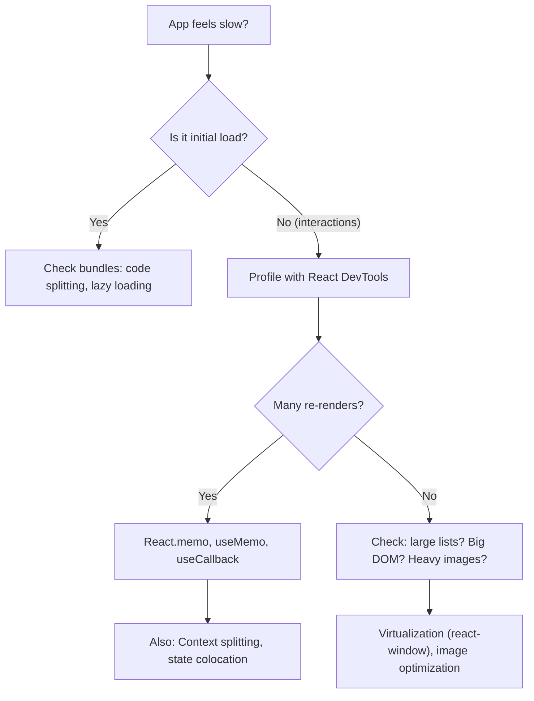

# Performance and Profiling

> [!summary] Goal
> Master React performance optimization—profiling with DevTools, preventing unnecessary re-renders, code splitting, virtualization, and measuring real-world performance.

## Table of Contents

1. [Performance Philosophy](#performance-philosophy)
2. [Measuring Performance](#measuring-performance)
3. [React Profiler](#react-profiler)
4. [Preventing Re-renders](#preventing-re-renders)
5. [Code Splitting and Lazy Loading](#code-splitting-and-lazy-loading)
6. [Virtualization](#virtualization)
7. [Image Optimization](#image-optimization)
8. [Bundle Size Optimization](#bundle-size-optimization)
9. [Concurrent Features](#concurrent-features)
10. [Case Studies](#case-studies)
11. [Performance Checklist](#performance-checklist)
12. [Interview Questions](#interview-questions)

---

## Performance Philosophy

> [!info] Performance optimization in React
> React is already fast for most use cases. Premature optimization adds complexity. The rule: **measure first, optimize second**. Use React DevTools Profiler to identify the bottleneck before making changes. The most impactful optimizations (in order): reducing re-renders, code splitting, virtualization, and image optimization.



###

 Guiding Principles

**1. Measure first, optimize second**

Don't optimize prematurely. Use the Profiler to identify actual bottlenecks.

**2. Perceived performance > Actual performance**

Loading states, skeleton screens, and optimistic updates matter more than shaving off milliseconds.

**3. User-centric metrics**

Focus on:
- **FCP (First Contentful Paint)**: When users see something
- **LCP (Largest Contentful Paint)**: When main content loads
- **TTI (Time to Interactive)**: When users can interact
- **CLS (Cumulative Layout Shift)**: Visual stability

**4. The 100ms rule**

Users perceive interactions under 100ms as instant. Aim for this.

---

## Measuring Performance

### Chrome DevTools Performance Tab

**How to use**:

1. Open DevTools (F12) → Performance tab
2. Click Record (or Cmd+E)
3. Interact with your app
4. Stop recording
5. Analyze flame chart

**What to look for**:

```
Main Thread Activity:
████████████████ Scripting (yellow) - JS execution
███ Rendering (purple) - Layout, paint
██ System (gray) - Browser overhead

Red bar = Long task (>50ms)
```

**Example analysis**:

```tsx
// 🚨 SLOW: Re-renders on every keystroke
function SearchResults({ query }: { query: string }) {
  const results = expensiveSearch(query); // Takes 200ms
  
  return <div>{results.map(r => <Item key={r.id} item={r} />)}</div>;
}

// Performance tab shows:
// - 200ms yellow bar (scripting) on each keystroke
// - Blocking main thread
// - User sees lag
```

### React DevTools Profiler

**How to use**:

1. Install React DevTools extension
2. Open DevTools → Profiler tab
3. Click Record
4. Interact with app
5. Stop and analyze

**Flame Graph**: Shows which components rendered and how long

```
App (2.1ms)
├─ Header (0.1ms) ✅ Fast
├─ Sidebar (0.2ms) ✅ Fast
└─ Content (1.8ms) 🚨 Slow
   ├─ List (1.5ms) 🚨 Bottleneck
   └─ Footer (0.3ms)
```

**Ranked Chart**: Components sorted by render time

**Example**:

```tsx
// Profiler shows ExpensiveList takes 80% of render time
function ExpensiveList({ items }: { items: Item[] }) {
  return (
    <div>
      {items.map(item => (
        <ExpensiveItem key={item.id} item={item} /> // 20ms each
      ))}
    </div>
  );
}

// Solution: Virtualize or memoize
```

### Lighthouse

**How to use**:

1. Open DevTools → Lighthouse tab
2. Select "Performance"
3. Click "Generate report"

**Metrics**:

- **Performance Score**: 0-100
- **FCP**: First Contentful Paint
- **LCP**: Largest Contentful Paint
- **TBT**: Total Blocking Time
- **CLS**: Cumulative Layout Shift
- **SI**: Speed Index

**Example report**:

```
Performance: 45/100 🚨

Opportunities:
- Reduce unused JavaScript: Save 2.1s
- Properly size images: Save 1.4s
- Eliminate render-blocking resources: Save 0.8s
```

### Web Vitals

Measure real-user metrics with `web-vitals` library:

```bash
npm install web-vitals
```

**Usage**:

```tsx
// reportWebVitals.ts
import { onCLS, onFCP, onLCP, onTTFB, onINP } from 'web-vitals';

export function reportWebVitals(onPerfEntry?: (metric: any) => void) {
  if (onPerfEntry) {
    onCLS(onPerfEntry);  // Cumulative Layout Shift
    onFCP(onPerfEntry);  // First Contentful Paint
    onLCP(onPerfEntry);  // Largest Contentful Paint
    onTTFB(onPerfEntry); // Time to First Byte
    onINP(onPerfEntry);  // Interaction to Next Paint
  }
}

// main.tsx
import { reportWebVitals } from './reportWebVitals';

reportWebVitals(metric => {
  console.log(metric);
  // Send to analytics
  // analytics.send(metric);
});
```

**Good thresholds**:

| Metric | Good | Needs Improvement | Poor |
|--------|------|-------------------|------|
| LCP | ≤ 2.5s | 2.5s - 4.0s | > 4.0s |
| FID/INP | ≤ 100ms | 100ms - 300ms | > 300ms |
| CLS | ≤ 0.1 | 0.1 - 0.25 | > 0.25 |

---

## React Profiler

### Profiler API

Measure component render time programmatically:

```tsx
import { Profiler, ProfilerOnRenderCallback } from 'react';

const onRenderCallback: ProfilerOnRenderCallback = (
  id,                  // "id" prop of the Profiler tree
  phase,               // "mount" | "update"
  actualDuration,      // Time spent rendering
  baseDuration,        // Estimated time without memoization
  startTime,           // When React began rendering
  commitTime,          // When React committed the update
  interactions         // Set of interactions (deprecated)
) => {
  console.log(`${id} (${phase}): ${actualDuration}ms`);
};

function App() {
  return (
    <Profiler id="App" onRender={onRenderCallback}>
      <Dashboard />
    </Profiler>
  );
}
```

**Example**: Log slow renders

```tsx
const onRenderCallback: ProfilerOnRenderCallback = (id, phase, actualDuration) => {
  if (actualDuration > 16) { // Longer than 1 frame (60fps)
    console.warn(`Slow render: ${id} took ${actualDuration}ms`);
    // Send to monitoring service
  }
};
```

---

## Preventing Re-renders

### React.memo

**Use case**: Prevent re-render when props haven't changed

```tsx
// ❌ BAD: Re-renders on every parent render
function ExpensiveComponent({ value }: { value: number }) {
  console.log('Rendered!');
  // Expensive computation
  const result = expensiveCalculation(value);
  return <div>{result}</div>;
}

// ✅ GOOD: Only re-renders when value changes
const ExpensiveComponent = React.memo(({ value }: { value: number }) => {
  console.log('Rendered!');
  const result = expensiveCalculation(value);
  return <div>{result}</div>;
});
```

**Custom comparison**:

```tsx
interface Props {
  user: { id: number; name: string; metadata: object };
}

// Only re-render if user.id or user.name changes (ignore metadata)
const UserCard = React.memo(
  ({ user }: Props) => (
    <div>
      <h1>{user.name}</h1>
    </div>
  ),
  (prevProps, nextProps) => {
    // Return true if props are equal (no re-render)
    return (
      prevProps.user.id === nextProps.user.id &&
      prevProps.user.name === nextProps.user.name
    );
  }
);
```

### useMemo

**Use case**: Memoize expensive calculations

```tsx
function ProductList({ products, filter }: Props) {
  // ❌ BAD: Filters on every render (even if products/filter unchanged)
  const filtered = products.filter(p => p.category === filter);

  // ✅ GOOD: Only recalculates when dependencies change
  const filtered = useMemo(
    () => products.filter(p => p.category === filter),
    [products, filter]
  );

  return <div>{filtered.map(p => <Product key={p.id} {...p} />)}</div>;
}
```

**When to use**:

```tsx
// ✅ Good use cases:
// 1. Expensive calculations
const sortedData = useMemo(() => data.sort(...), [data]);

// 2. Object/array creation passed to memoized child
const config = useMemo(() => ({ theme: 'dark', lang: 'en' }), []);

// 3. Filtering large datasets
const filtered = useMemo(() => items.filter(...), [items, filter]);

// ❌ Bad use cases (premature optimization):
// 1. Simple calculations
const doubled = useMemo(() => count * 2, [count]); // Overkill

// 2. Primitives (already cheap)
const name = useMemo(() => firstName + ' ' + lastName, [firstName, lastName]);
```

### useCallback

**Use case**: Memoize functions passed to memoized children

```tsx
// ❌ BAD: New function on every render → ExpensiveChild re-renders
function Parent() {
  const [count, setCount] = useState(0);

  const handleClick = () => {
    console.log('Clicked!');
  };

  return <ExpensiveChild onClick={handleClick} />;
}

// ✅ GOOD: Same function reference → ExpensiveChild doesn't re-render
function Parent() {
  const [count, setCount] = useState(0);

  const handleClick = useCallback(() => {
    console.log('Clicked!');
  }, []);

  return <ExpensiveChild onClick={handleClick} />;
}

const ExpensiveChild = React.memo(({ onClick }: { onClick: () => void }) => {
  console.log('ExpensiveChild rendered');
  return <button onClick={onClick}>Click</button>;
});
```

**When to use**:

```tsx
// ✅ Good: Function passed to memoized component
const handleChange = useCallback((value: string) => {
  console.log(value);
}, []);
<MemoizedInput onChange={handleChange} />

// ✅ Good: Dependency of useEffect/useMemo
const fetchData = useCallback(() => {
  fetch('/api/data').then(...);
}, []);
useEffect(() => {
  fetchData();
}, [fetchData]);

// ❌ Bad: Function not passed anywhere that checks reference
const handleClick = useCallback(() => {
  console.log('Click');
}, []); // Unnecessary
```

### State Colocation

**Move state closer to where it's used**:

```tsx
// ❌ BAD: name state causes entire form to re-render
function Form() {
  const [name, setName] = useState('');
  const [address, setAddress] = useState('');

  return (
    <div>
      <NameInput value={name} onChange={setName} />
      <ExpensiveAddressMap address={address} /> {/* Re-renders unnecessarily */}
      <AddressInput value={address} onChange={setAddress} />
    </div>
  );
}

// ✅ GOOD: name state isolated to NameSection
function Form() {
  const [address, setAddress] = useState('');

  return (
    <div>
      <NameSection />
      <ExpensiveAddressMap address={address} />
      <AddressInput value={address} onChange={setAddress} />
    </div>
  );
}

function NameSection() {
  const [name, setName] = useState('');
  return <NameInput value={name} onChange={setName} />;
}
```

### Composition

**Lift content up**:

```tsx
// ❌ BAD: Children re-render when count changes
function Parent() {
  const [count, setCount] = useState(0);

  return (
    <div>
      <button onClick={() => setCount(c => c + 1)}>{count}</button>
      <ExpensiveChild /> {/* Re-renders! */}
    </div>
  );
}

// ✅ GOOD: Children passed as props don't re-render
function App() {
  return (
    <Parent>
      <ExpensiveChild />
    </Parent>
  );
}

function Parent({ children }: { children: React.ReactNode }) {
  const [count, setCount] = useState(0);

  return (
    <div>
      <button onClick={() => setCount(c => c + 1)}>{count}</button>
      {children} {/* Doesn't re-render because it's the same object */}
    </div>
  );
}
```

---

## Code Splitting and Lazy Loading

### React.lazy + Suspense

**Route-based splitting**:

```tsx
import { lazy, Suspense } from 'react';
import { BrowserRouter, Routes, Route } from 'react-router-dom';

// ❌ BAD: All routes loaded upfront (large initial bundle)
import Home from './pages/Home';
import About from './pages/About';
import Dashboard from './pages/Dashboard';

// ✅ GOOD: Each route loaded on demand
const Home = lazy(() => import('./pages/Home'));
const About = lazy(() => import('./pages/About'));
const Dashboard = lazy(() => import('./pages/Dashboard'));

function App() {
  return (
    <BrowserRouter>
      <Suspense fallback={<div>Loading...</div>}>
        <Routes>
          <Route path="/" element={<Home />} />
          <Route path="/about" element={<About />} />
          <Route path="/dashboard" element={<Dashboard />} />
        </Routes>
      </Suspense>
    </BrowserRouter>
  );
}
```

**Component-based splitting**:

```tsx
// Heavy chart library (500KB)
const HeavyChart = lazy(() => import('./components/HeavyChart'));

function Dashboard() {
  const [showChart, setShowChart] = useState(false);

  return (
    <div>
      <button onClick={() => setShowChart(true)}>Show Chart</button>
      
      {showChart && (
        <Suspense fallback={<ChartSkeleton />}>
          <HeavyChart data={data} />
        </Suspense>
      )}
    </div>
  );
}
```

**Named exports workaround**:

```tsx
// ❌ BAD: Can't lazy load named exports directly
const MyComponent = lazy(() => import('./MyComponent').MyComponent);

// ✅ GOOD: Re-export as default
const MyComponent = lazy(() =>
  import('./MyComponent').then(module => ({ default: module.MyComponent }))
);
```

### Preloading

**Preload on hover**:

```tsx
const HeavyComponent = lazy(() => import('./HeavyComponent'));

// Trigger preload on hover
function App() {
  const preload = () => import('./HeavyComponent');

  return (
    <div>
      <button onMouseEnter={preload} onClick={() => setShow(true)}>
        Show Heavy Component
      </button>
      
      {show && (
        <Suspense fallback={<div>Loading...</div>}>
          <HeavyComponent />
        </Suspense>
      )}
    </div>
  );
}
```

### Vite Dynamic Imports

**Bundle analysis**:

```bash
npm run build

# See bundle sizes
vite build --sourcemap
# Use rollup-plugin-visualizer
npm install -D rollup-plugin-visualizer
```

**vite.config.ts**:

```ts
import { defineConfig } from 'vite';
import react from '@vitejs/plugin-react';
import { visualizer } from 'rollup-plugin-visualizer';

export default defineConfig({
  plugins: [
    react(),
    visualizer({ open: true, gzipSize: true, brotliSize: true }),
  ],
  build: {
    rollupOptions: {
      output: {
        manualChunks: {
          // Separate vendor chunks
          'react-vendor': ['react', 'react-dom', 'react-router-dom'],
          'ui-vendor': ['@mui/material', '@mui/icons-material'],
          'chart-vendor': ['recharts', 'd3'],
        },
      },
    },
  },
});
```

---

## Virtualization

### react-window

**Use case**: Render only visible items in long lists

```bash
npm install react-window
```

**Fixed-size list**:

```tsx
import { FixedSizeList } from 'react-window';

interface Item {
  id: number;
  name: string;
}

function VirtualList({ items }: { items: Item[] }) {
  const Row = ({ index, style }: { index: number; style: React.CSSProperties }) => (
    <div style={style}>
      {items[index].name}
    </div>
  );

  return (
    <FixedSizeList
      height={600}        // Height of viewport
      itemCount={items.length}
      itemSize={50}       // Height of each row
      width="100%"
    >
      {Row}
    </FixedSizeList>
  );
}
```

**Variable-size list**:

```tsx
import { VariableSizeList } from 'react-window';

function VariableList({ items }: { items: Item[] }) {
  const getItemSize = (index: number) => {
    // Dynamic height based on content
    return items[index].name.length > 50 ? 100 : 50;
  };

  const Row = ({ index, style }: any) => (
    <div style={style}>{items[index].name}</div>
  );

  return (
    <VariableSizeList
      height={600}
      itemCount={items.length}
      itemSize={getItemSize}
      width="100%"
    >
      {Row}
    </VariableSizeList>
  );
}
```

**Grid virtualization**:

```tsx
import { FixedSizeGrid } from 'react-window';

function VirtualGrid({ items }: { items: Item[][] }) {
  const Cell = ({ columnIndex, rowIndex, style }: any) => (
    <div style={style}>
      {items[rowIndex][columnIndex]?.name || ''}
    </div>
  );

  return (
    <FixedSizeGrid
      columnCount={10}
      columnWidth={100}
      height={600}
      rowCount={items.length}
      rowHeight={50}
      width={1000}
    >
      {Cell}
    </FixedSizeGrid>
  );
}
```

### Performance comparison

```tsx
// ❌ BAD: Renders 10,000 items (SLOW)
function SlowList({ items }: { items: Item[] }) {
  return (
    <div>
      {items.map(item => (
        <div key={item.id} style={{ height: 50 }}>
          {item.name}
        </div>
      ))}
    </div>
  );
}
// Initial render: ~5000ms
// Scroll: Janky

// ✅ GOOD: Renders only visible items (FAST)
function FastList({ items }: { items: Item[] }) {
  return (
    <FixedSizeList height={600} itemCount={items.length} itemSize={50} width="100%">
      {({ index, style }) => (
        <div style={style}>{items[index].name}</div>
      )}
    </FixedSizeList>
  );
}
// Initial render: ~50ms
// Scroll: 60fps
```

---

## Image Optimization

### Lazy Loading Images

**Native lazy loading**:

```tsx
// Browsers defer loading until image is near viewport

```

**Intersection Observer (more control)**:

```tsx
import { useEffect, useRef, useState } from 'react';

function LazyImage({ src, alt }: { src: string; alt: string }) {
  const [imageSrc, setImageSrc] = useState<string | undefined>(undefined);
  const imgRef = useRef<HTMLImageElement>(null);

  useEffect(() => {
    const observer = new IntersectionObserver(
      ([entry]) => {
        if (entry.isIntersecting) {
          setImageSrc(src);
          observer.disconnect();
        }
      },
      { rootMargin: '100px' } // Start loading 100px before visible
    );

    if (imgRef.current) {
      observer.observe(imgRef.current);
    }

    return () => observer.disconnect();
  }, [src]);

  return ;
}
```

### Responsive Images

```tsx
function ResponsiveImage() {
  return (
    <picture>
      <source
        media="(max-width: 640px)"
        srcSet="/image-small.jpg 1x, /image-small-2x.jpg 2x"
      />
      <source
        media="(max-width: 1024px)"
        srcSet="/image-medium.jpg 1x, /image-medium-2x.jpg 2x"
      />
      
    </picture>
  );
}
```

### Modern formats (WebP, AVIF)

```tsx
<picture>
  <source srcSet="/image.avif" type="image/avif" />
  <source srcSet="/image.webp" type="image/webp" />
  
</picture>
```

---

## Bundle Size Optimization

### Tree Shaking

```tsx
// ❌ BAD: Imports entire library (lodash is 70KB)
import _ from 'lodash';
const result = _.debounce(fn, 300);

// ✅ GOOD: Imports only what you need (debounce is 2KB)
import debounce from 'lodash/debounce';
const result = debounce(fn, 300);

// ✅ EVEN BETTER: Use native or smaller alternative
const debounce = (fn: Function, ms: number) => {
  let timer: NodeJS.Timeout;
  return (...args: any[]) => {
    clearTimeout(timer);
    timer = setTimeout(() => fn(...args), ms);
  };
};
```

### Bundle Analysis

```bash
# Vite
npm run build
npx vite-bundle-visualizer

# See what's in your bundle
```

**Example output**:

```
Total: 500KB (gzipped: 150KB)

react-dom: 130KB (26%)
@mui/material: 200KB (40%)  🚨 Too large!
recharts: 100KB (20%)
app code: 70KB (14%)
```

**Solution**: Code split MUI and recharts

### Remove unused code

```tsx
// ❌ BAD: Imports entire icon library
import { FaBeer, FaCoffee } from 'react-icons/fa';

// ✅ GOOD: Tree-shakeable imports
import FaBeer from 'react-icons/fa/FaBeer';
import FaCoffee from 'react-icons/fa/FaCoffee';
```

---

## Concurrent Features

### useTransition

**Use case**: Mark state updates as non-urgent (don't block UI)

```tsx
import { useState, useTransition } from 'react';

function SearchResults() {
  const [query, setQuery] = useState('');
  const [results, setResults] = useState<string[]>([]);
  const [isPending, startTransition] = useTransition();

  const handleChange = (e: React.ChangeEvent<HTMLInputElement>) => {
    const newQuery = e.target.value;
    setQuery(newQuery); // Urgent: Update input immediately

    startTransition(() => {
      // Non-urgent: Update results (can be interrupted)
      const newResults = expensiveSearch(newQuery); // Takes 100ms
      setResults(newResults);
    });
  };

  return (
    <div>
      <input value={query} onChange={handleChange} />
      {isPending && <span>Searching...</span>}
      <ul>
        {results.map(r => (
          <li key={r}>{r}</li>
        ))}
      </ul>
    </div>
  );
}
```

**Without useTransition**: Input lags because expensive search blocks typing

**With useTransition**: Input stays responsive, search updates in background

### useDeferredValue

**Use case**: Defer updating a value

```tsx
import { useState, useDeferredValue } from 'react';

function ProductList() {
  const [filter, setFilter] = useState('');
  const deferredFilter = useDeferredValue(filter);

  // Filter uses deferred value (doesn't block typing)
  const filtered = useMemo(
    () => products.filter(p => p.name.includes(deferredFilter)),
    [deferredFilter]
  );

  return (
    <div>
      <input value={filter} onChange={e => setFilter(e.target.value)} />
      <p>Showing results for: {deferredFilter}</p>
      <ul>
        {filtered.map(p => (
          <li key={p.id}>{p.name}</li>
        ))}
      </ul>
    </div>
  );
}
```

**Difference from useTransition**:

- `useTransition`: Mark **updates** as non-urgent
- `useDeferredValue`: Mark **value** as non-urgent

---

## Case Studies

### Case Study 1: Slow List Rendering

**Problem**: Rendering 10,000 items takes 5 seconds

```tsx
// SLOW
function UserList({ users }: { users: User[] }) {
  return (
    <div>
      {users.map(user => (
        <UserCard key={user.id} user={user} />
      ))}
    </div>
  );
}
```

**Profiler shows**: 5000ms render time, 99% in UserList

**Solution 1: Virtualization**

```tsx
import { FixedSizeList } from 'react-window';

function UserList({ users }: { users: User[] }) {
  return (
    <FixedSizeList
      height={600}
      itemCount={users.length}
      itemSize={80}
      width="100%"
    >
      {({ index, style }) => (
        <div style={style}>
          <UserCard user={users[index]} />
        </div>
      )}
    </FixedSizeList>
  );
}
```

**Result**: 50ms initial render, smooth 60fps scrolling

**Solution 2: Pagination**

```tsx
function UserList({ users }: { users: User[] }) {
  const [page, setPage] = useState(1);
  const pageSize = 50;
  
  const paginatedUsers = users.slice((page - 1) * pageSize, page * pageSize);
  
  return (
    <div>
      {paginatedUsers.map(user => (
        <UserCard key={user.id} user={user} />
      ))}
      <Pagination page={page} total={Math.ceil(users.length / pageSize)} onChange={setPage} />
    </div>
  );
}
```

**Result**: 400ms initial render, good UX

### Case Study 2: Unnecessary Re-renders

**Problem**: Parent re-render causes 50 children to re-render

```tsx
// SLOW
function Dashboard() {
  const [count, setCount] = useState(0);

  return (
    <div>
      <button onClick={() => setCount(c => c + 1)}>{count}</button>
      <Sidebar /> {/* 20ms render */}
      <Content /> {/* 30ms render */}
    </div>
  );
}
```

**Profiler shows**: 50ms on every click (Sidebar + Content)

**Solution 1: Memoization**

```tsx
const Sidebar = React.memo(() => {
  // Heavy rendering
  return <div>...</div>;
});

const Content = React.memo(() => {
  // Heavy rendering
  return <div>...</div>;
});
```

**Result**: 1ms on click (only button re-renders)

**Solution 2: State Colocation**

```tsx
function Dashboard() {
  return (
    <div>
      <Counter />
      <Sidebar />
      <Content />
    </div>
  );
}

function Counter() {
  const [count, setCount] = useState(0);
  return <button onClick={() => setCount(c => c + 1)}>{count}</button>;
}
```

**Result**: 1ms on click (only Counter re-renders)

### Case Study 3: Large Bundle Size

**Problem**: Initial bundle is 2MB, LCP is 8 seconds

**Analysis**:

```
Bundle composition:
- react-dom: 130KB
- @mui/material: 800KB 🚨
- moment: 300KB 🚨
- lodash: 70KB 🚨
- chart.js: 200KB
- app code: 500KB
```

**Solutions**:

1. **Replace moment with date-fns** (save 280KB)

```tsx
// ❌ import moment from 'moment'; // 300KB
// ✅ import { format } from 'date-fns'; // 20KB

const formatted = format(new Date(), 'yyyy-MM-dd');
```

2. **Tree-shake lodash** (save 50KB)

```tsx
// ❌ import _ from 'lodash';
// ✅ import debounce from 'lodash/debounce';
```

3. **Code-split MUI** (save 600KB initial)

```tsx
const Dashboard = lazy(() => import('./pages/Dashboard')); // Includes MUI
```

4. **Lazy load chart** (save 200KB initial)

```tsx
const Chart = lazy(() => import('./components/Chart'));
```

**Result**: Initial bundle 400KB (80% reduction), LCP 2.5 seconds

### Case Study 4: Image-Heavy Page

**Problem**: Product page with 50 images loads 20MB, LCP 10s

**Solutions**:

1. **Lazy load images below fold**

```tsx

```

2. **Use WebP format** (save 70% file size)

```tsx
<picture>
  <source srcSet="/product.webp" type="image/webp" />
  
</picture>
```

3. **Responsive images**

```tsx

```

**Result**: Initial load 2MB (90% reduction), LCP 2.8s

---

## Performance Checklist

### Before Optimizing

- [ ] Profile with React DevTools Profiler
- [ ] Run Lighthouse audit
- [ ] Check bundle size with visualizer
- [ ] Measure Web Vitals (LCP, FID, CLS)
- [ ] Identify actual bottlenecks

### Rendering Optimization

- [ ] Use React.memo for expensive components
- [ ] Use useMemo for expensive calculations
- [ ] Use useCallback for functions passed to memoized children
- [ ] Colocate state (move state closer to where it's used)
- [ ] Use composition to avoid re-renders
- [ ] Virtualize long lists (react-window)
- [ ] Lazy load components below fold

### Code Splitting

- [ ] Route-based splitting with React.lazy
- [ ] Component-based splitting for heavy components
- [ ] Vendor bundle splitting (react, ui-library, charts)
- [ ] Preload on hover/interaction

### Bundle Size

- [ ] Tree-shake libraries (import only what you use)
- [ ] Replace large libraries (moment → date-fns, lodash → native)
- [ ] Remove unused dependencies
- [ ] Analyze bundle with visualizer
- [ ] Enable gzip/brotli compression

### Images

- [ ] Lazy load images (loading="lazy")
- [ ] Use modern formats (WebP, AVIF)
- [ ] Responsive images (srcset, sizes)
- [ ] Compress images (TinyPNG, ImageOptim)
- [ ] Use CDN for images

### Network

- [ ] Enable HTTP/2
- [ ] Use CDN
- [ ] Cache static assets
- [ ] Prefetch/preload critical resources
- [ ] Use service worker for offline support

---

## Interview Questions

### 1. **When should you use React.memo, useMemo, and useCallback?**

**Answer**:

- **React.memo**: Prevent component re-render when props unchanged
  - Use for expensive components with stable props
  - Don't use for cheap components (overhead > benefit)

- **useMemo**: Memoize expensive calculations
  - Use when calculation is slow (>10ms)
  - Use when result is passed to memoized child
  - Don't use for primitives or simple operations

- **useCallback**: Memoize functions passed to memoized children
  - Use when function is a dependency of useEffect/useMemo
  - Don't use if function isn't passed to memoized component

**Rule**: Profile first, optimize second. Don't prematurely optimize.

### 2. **Explain the difference between useTransition and useDeferredValue.**

**Answer**:

- **useTransition**: Mark state **updates** as non-urgent

```tsx
const [isPending, startTransition] = useTransition();
startTransition(() => {
  setResults(expensiveSearch(query)); // Non-urgent
});
```

- **useDeferredValue**: Mark **value** as non-urgent

```tsx
const deferredQuery = useDeferredValue(query);
// Use deferredQuery for expensive operations
```

**When to use**:
- `useTransition`: You control the update (inside event handler)
- `useDeferredValue`: You receive the value (from props/context)

### 3. **How does virtualization improve performance?**

**Answer**:

Virtualization renders only **visible** items in a long list.

**Without virtualization** (10,000 items):
- Renders 10,000 DOM nodes
- Initial render: 5000ms
- Scroll: Janky (many nodes)

**With virtualization** (10,000 items):
- Renders ~20 DOM nodes (visible + buffer)
- Initial render: 50ms
- Scroll: 60fps (reuses nodes)

**Trade-off**: More complex code, less semantic HTML

### 4. **What are Web Vitals and why do they matter?**

**Answer**:

Web Vitals are user-centric performance metrics:

- **LCP (Largest Contentful Paint)**: When main content loads
  - Goal: < 2.5s
  - Measures perceived load speed

- **FID (First Input Delay)** / **INP (Interaction to Next Paint)**: Responsiveness
  - Goal: < 100ms
  - Measures interactivity

- **CLS (Cumulative Layout Shift)**: Visual stability
  - Goal: < 0.1
  - Measures layout shifts (annoying jumps)

**Why**: Google uses them for ranking. Better Web Vitals = better SEO + UX.

### 5. **How do you identify performance bottlenecks in a React app?**

**Answer**:

**Step-by-step process**:

1. **React DevTools Profiler**: Find slow components
   - Record interaction
   - Check flame graph for slow renders
   - Identify components taking >16ms

2. **Chrome DevTools Performance**: Find long tasks
   - Record interaction
   - Look for red bars (>50ms tasks)
   - Check scripting (yellow) and rendering (purple)

3. **Lighthouse**: Measure overall performance
   - Run audit
   - Check LCP, TBT, FCP
   - Follow opportunities

4. **Bundle analyzer**: Find large dependencies
   - Check what's in your bundle
   - Replace large libraries
   - Code split

5. **Web Vitals**: Real-user metrics
   - Measure in production
   - Track trends

### 6. **Explain code splitting and its benefits.**

**Answer**:

**Code splitting**: Splitting bundle into smaller chunks loaded on demand

**Benefits**:
- Smaller initial bundle → Faster FCP/LCP
- Load features only when needed
- Better caching (vendor chunk unchanged)

**Strategies**:

```tsx
// Route-based
const Dashboard = lazy(() => import('./Dashboard'));

// Component-based
const HeavyChart = lazy(() => import('./HeavyChart'));

// Vendor splitting (vite.config.ts)
manualChunks: {
  'react-vendor': ['react', 'react-dom'],
  'ui-vendor': ['@mui/material'],
}
```

**Trade-off**: More network requests, complexity

### 7. **What causes unnecessary re-renders and how do you prevent them?**

**Answer**:

**Common causes**:

1. **Parent re-render** → Children re-render
   - Fix: `React.memo`

2. **New object/array reference**
   - Fix: `useMemo`

```tsx
// ❌ New object every render
const config = { theme: 'dark' };
// ✅ Same object
const config = useMemo(() => ({ theme: 'dark' }), []);
```

3. **New function reference**
   - Fix: `useCallback`

4. **State at wrong level**
   - Fix: Colocate state

5. **Context value changes**
   - Fix: Split context, memoize value

**Debug**: React DevTools Profiler → Highlight re-renders

### 8. **How do you optimize images in React apps?**

**Answer**:

**Techniques**:

1. **Lazy loading**

```tsx

```

2. **Responsive images**

```tsx

```

3. **Modern formats (WebP, AVIF)**

```tsx
<picture>
  <source srcSet="/img.webp" type="image/webp" />
  
</picture>
```

4. **Compression**: Use tools like TinyPNG, ImageOptim

5. **CDN**: Serve images from CDN with automatic optimization

**Result**: 70-90% file size reduction

---

## Best Practices

1. **Measure before optimizing** - Use Profiler to identify real bottlenecks
2. **Start with the biggest wins** - Code splitting, image optimization
3. **Virtualize long lists** - Don't render 10,000 items
4. **Lazy load below fold** - Load images/components on demand
5. **Memoize wisely** - Profile to confirm it helps
6. **Colocate state** - Move state closer to where it's used
7. **Use composition** - Lift children up to avoid re-renders
8. **Monitor Web Vitals** - Track LCP, FID/INP, CLS in production
9. **Code split by route** - Each route = separate chunk
10. **Tree-shake dependencies** - Import only what you need

---

## Common Pitfalls

1. **Premature optimization** - Memoizing everything (overhead > benefit)
2. **Forgetting dependencies** - useMemo/useCallback with stale closures
3. **Memoizing primitives** - `useMemo(() => count * 2, [count])` is overkill
4. **Not profiling** - Optimizing based on assumptions
5. **Over-engineering** - Using virtualization for 50 items
6. **Ignoring network** - Focusing only on rendering
7. **Not lazy loading routes** - Loading entire app upfront
8. **Using large libraries** - moment (300KB) instead of date-fns (20KB)

---

## References

- [React Profiler](https://react.dev/reference/react/Profiler)
- [Web Vitals](https://web.dev/vitals/)
- [React.memo](https://react.dev/reference/react/memo)
- [useMemo](https://react.dev/reference/react/useMemo)
- [useCallback](https://react.dev/reference/react/useCallback)
- [React.lazy](https://react.dev/reference/react/lazy)
- [react-window](https://github.com/bvaughn/react-window)
- [[01_React_Mental_Model_and_Rendering|React Mental Model]]
- [[02_Hooks_Complete_Reference|Hooks Reference]]
- [[01_Debug_Rerenders_and_Perf_Issues|Debug Re-renders Playbook]]
