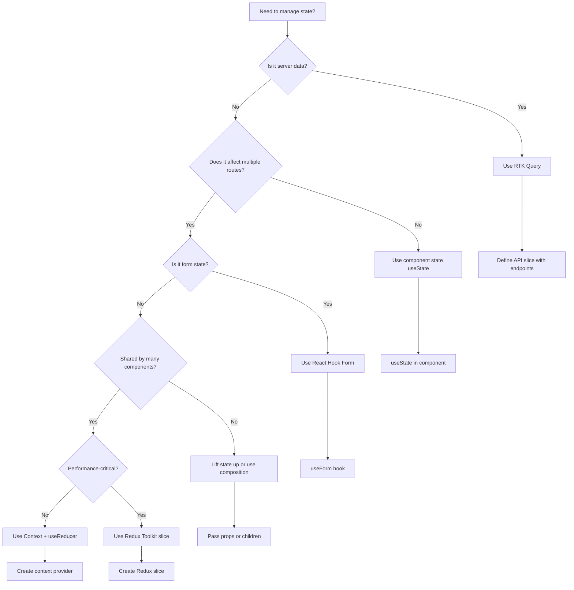
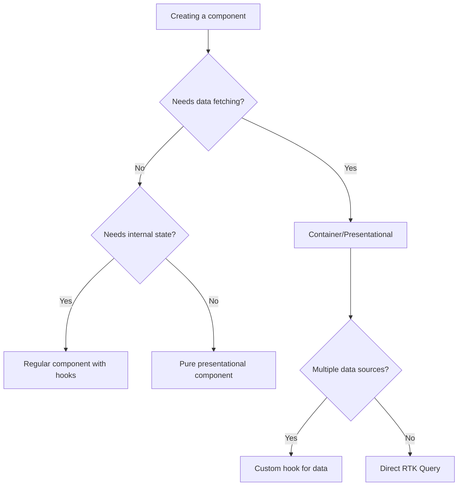
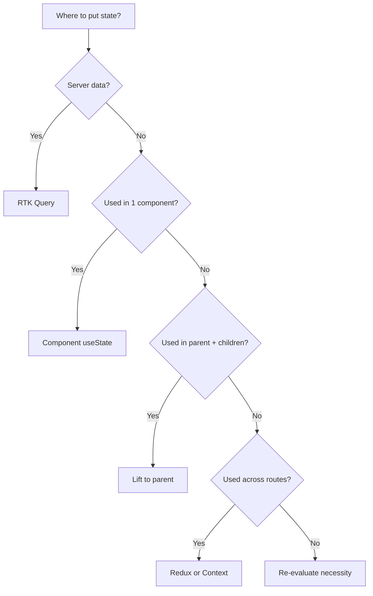

# React App Architecture Playbook

> [!summary] Goal
> Keep codebases maintainable: clear module boundaries, predictable data flow, and consistent patterns.

## Table of Contents

- [Folder Structure Patterns](#folder-structure-patterns)
- [Component Patterns](#component-patterns)
- [State Management Decision Tree](#state-management-decision-tree)
- [Error Handling Architecture](#error-handling-architecture)
- [Code Organization](#code-organization)
- [API Layer Architecture](#api-layer-architecture)
- [Environment Configuration](#environment-configuration)
- [Build and Deploy](#build-and-deploy)
- [Security Best Practices](#security-best-practices)
- [Accessibility Patterns](#accessibility-patterns)
- [Complete Architecture Example](#complete-architecture-example)
- [Decision Flowcharts](#decision-flowcharts)
- [Interview Questions](#interview-questions)

---

## Folder Structure Patterns

### Pattern 1: Feature-Based Structure (Recommended)

Best for medium to large applications. Each feature is self-contained.

```
src/
├── app/                      # App shell and configuration
│   ├── App.tsx
│   ├── AppProviders.tsx      # Context providers wrapper
│   ├── router.tsx            # Route configuration
│   └── store.ts              # Redux store setup
│
├── features/                 # Feature modules
│   ├── auth/
│   │   ├── api/
│   │   │   └── authApi.ts    # RTK Query endpoints
│   │   ├── components/
│   │   │   ├── LoginForm.tsx
│   │   │   ├── SignupForm.tsx
│   │   │   └── ProtectedRoute.tsx
│   │   ├── hooks/
│   │   │   └── useAuth.ts    # Feature-specific hooks
│   │   ├── slices/
│   │   │   └── authSlice.ts  # Redux slice
│   │   ├── types/
│   │   │   └── index.ts      # Feature types
│   │   ├── utils/
│   │   │   └── tokenUtils.ts
│   │   └── index.ts          # Public API
│   │
│   ├── products/
│   │   ├── api/
│   │   │   └── productsApi.ts
│   │   ├── components/
│   │   │   ├── ProductList.tsx
│   │   │   ├── ProductCard.tsx
│   │   │   ├── ProductDetails.tsx
│   │   │   └── ProductFilters.tsx
│   │   ├── hooks/
│   │   │   ├── useProductFilters.ts
│   │   │   └── useProductSearch.ts
│   │   ├── types/
│   │   │   └── index.ts
│   │   └── index.ts
│   │
│   └── cart/
│       ├── api/
│       ├── components/
│       ├── slices/
│       │   └── cartSlice.ts
│       └── index.ts
│
├── shared/                   # Shared/reusable code
│   ├── components/           # Generic UI components
│   │   ├── Button/
│   │   │   ├── Button.tsx
│   │   │   ├── Button.test.tsx
│   │   │   ├── Button.module.css
│   │   │   └── index.ts
│   │   ├── Input/
│   │   ├── Modal/
│   │   ├── Spinner/
│   │   ├── ErrorBoundary/
│   │   └── index.ts          # Barrel export
│   │
│   ├── hooks/                # Generic hooks
│   │   ├── useDebounce.ts
│   │   ├── useLocalStorage.ts
│   │   ├── useMediaQuery.ts
│   │   └── index.ts
│   │
│   ├── utils/                # Generic utilities
│   │   ├── formatters.ts
│   │   ├── validators.ts
│   │   ├── apiHelpers.ts
│   │   └── index.ts
│   │
│   ├── constants/
│   │   ├── routes.ts
│   │   ├── apiEndpoints.ts
│   │   └── index.ts
│   │
│   └── types/                # Shared types
│       ├── api.ts
│       ├── common.ts
│       └── index.ts
│
├── pages/                    # Route components
│   ├── HomePage.tsx
│   ├── ProductsPage.tsx
│   ├── ProductDetailPage.tsx
│   ├── CartPage.tsx
│   ├── CheckoutPage.tsx
│   ├── NotFoundPage.tsx
│   └── index.ts
│
├── layouts/                  # Layout components
│   ├── MainLayout.tsx
│   ├── AuthLayout.tsx
│   └── index.ts
│
├── assets/                   # Static assets
│   ├── images/
│   ├── icons/
│   └── fonts/
│
├── styles/                   # Global styles
│   ├── global.css
│   ├── variables.css
│   └── reset.css
│
└── main.tsx                  # Entry point
```

**Key Principles:**
- Each feature exports a clean public API via `index.ts`
- Features don't import from each other directly (use shared/)
- Co-locate related code (component + styles + tests)

### Pattern 2: Layer-Based Structure

Best for small applications or teams new to React.

```
src/
├── components/
│   ├── common/               # Reusable components
│   ├── auth/                 # Auth-related components
│   ├── products/             # Product components
│   └── cart/                 # Cart components
│
├── hooks/
│   ├── auth/
│   ├── products/
│   └── common/
│
├── services/                 # API calls
│   ├── api.ts                # Axios instance
│   ├── authService.ts
│   └── productsService.ts
│
├── store/                    # Redux
│   ├── slices/
│   │   ├── authSlice.ts
│   │   └── cartSlice.ts
│   ├── api/                  # RTK Query
│   │   └── productsApi.ts
│   └── store.ts
│
├── pages/
├── utils/
├── types/
└── main.tsx
```

**Comparison:**

| Aspect | Feature-Based | Layer-Based |
|--------|---------------|-------------|
| Scalability | Excellent | Good for small apps |
| Code discovery | Easy (everything in one folder) | Harder (jump between folders) |
| Feature ownership | Clear | Blurred |
| Reusability | Enforced via shared/ | Implicit |
| Best for | Medium-Large apps | Small apps, prototypes |

---

## Component Patterns

### 1. Container/Presentational Pattern

Separate data fetching from rendering.

**Container Component:**
```tsx
// features/products/components/ProductListContainer.tsx
import { useGetProductsQuery } from '../api/productsApi';
import ProductList from './ProductList';
import { Spinner, ErrorMessage } from '@/shared/components';

export const ProductListContainer = () => {
  const { data, error, isLoading } = useGetProductsQuery();

  if (isLoading) return <Spinner />;
  if (error) return <ErrorMessage error={error} />;

  return <ProductList products={data ?? []} />;
};
```

**Presentational Component:**
```tsx
// features/products/components/ProductList.tsx
import { Product } from '../types';
import ProductCard from './ProductCard';

interface ProductListProps {
  products: Product[];
}

const ProductList = ({ products }: ProductListProps) => {
  return (
    <div className="product-grid">
      {products.map(product => (
        <ProductCard key={product.id} product={product} />
      ))}
    </div>
  );
};

export default ProductList;
```

**Benefits:**
- Easy to test presentational components (no mocking)
- Reusable presentational components
- Clear separation of concerns

### 2. Compound Component Pattern

Components that work together to form a cohesive UI.

```tsx
// shared/components/Tabs/Tabs.tsx
import { createContext, useContext, useState, ReactNode } from 'react';

interface TabsContextValue {
  activeTab: string;
  setActiveTab: (id: string) => void;
}

const TabsContext = createContext<TabsContextValue | undefined>(undefined);

const useTabs = () => {
  const context = useContext(TabsContext);
  if (!context) throw new Error('Tabs compound components must be used within Tabs');
  return context;
};

interface TabsProps {
  defaultTab: string;
  children: ReactNode;
}

export const Tabs = ({ defaultTab, children }: TabsProps) => {
  const [activeTab, setActiveTab] = useState(defaultTab);
  
  return (
    <TabsContext.Provider value={{ activeTab, setActiveTab }}>
      <div className="tabs">{children}</div>
    </TabsContext.Provider>
  );
};

interface TabListProps {
  children: ReactNode;
}

export const TabList = ({ children }: TabListProps) => {
  return <div className="tab-list" role="tablist">{children}</div>;
};

interface TabProps {
  id: string;
  children: ReactNode;
}

export const Tab = ({ id, children }: TabProps) => {
  const { activeTab, setActiveTab } = useTabs();
  
  return (
    <button
      role="tab"
      aria-selected={activeTab === id}
      onClick={() => setActiveTab(id)}
      className={activeTab === id ? 'tab active' : 'tab'}
    >
      {children}
    </button>
  );
};

interface TabPanelProps {
  id: string;
  children: ReactNode;
}

export const TabPanel = ({ id, children }: TabPanelProps) => {
  const { activeTab } = useTabs();
  
  if (activeTab !== id) return null;
  
  return (
    <div role="tabpanel" className="tab-panel">
      {children}
    </div>
  );
};

// Usage:
// <Tabs defaultTab="profile">
//   <TabList>
//     <Tab id="profile">Profile</Tab>
//     <Tab id="settings">Settings</Tab>
//   </TabList>
//   <TabPanel id="profile">Profile content</TabPanel>
//   <TabPanel id="settings">Settings content</TabPanel>
// </Tabs>
```

### 3. Render Props Pattern

Share code between components using a prop whose value is a function.

```tsx
// shared/components/DataLoader/DataLoader.tsx
import { ReactNode } from 'react';

interface DataLoaderProps<T> {
  data: T | undefined;
  isLoading: boolean;
  error: unknown;
  children: (data: T) => ReactNode;
  loadingFallback?: ReactNode;
  errorFallback?: (error: unknown) => ReactNode;
}

export const DataLoader = <T,>({
  data,
  isLoading,
  error,
  children,
  loadingFallback = <div>Loading...</div>,
  errorFallback = (err) => <div>Error: {String(err)}</div>,
}: DataLoaderProps<T>) => {
  if (isLoading) return <>{loadingFallback}</>;
  if (error) return <>{errorFallback(error)}</>;
  if (!data) return null;
  
  return <>{children(data)}</>;
};

// Usage:
// <DataLoader data={products} isLoading={isLoading} error={error}>
//   {(products) => <ProductList products={products} />}
// </DataLoader>
```

### 4. Higher-Order Component (HOC) Pattern

Wrap components to add functionality.

```tsx
// shared/hocs/withAuth.tsx
import { ComponentType } from 'react';
import { Navigate } from 'react-router-dom';
import { useAppSelector } from '@/app/store';

export const withAuth = <P extends object>(Component: ComponentType<P>) => {
  return (props: P) => {
    const { isAuthenticated } = useAppSelector(state => state.auth);
    
    if (!isAuthenticated) {
      return <Navigate to="/login" replace />;
    }
    
    return <Component {...props} />;
  };
};

// Usage:
// const ProtectedProfile = withAuth(ProfilePage);
```

### 5. Custom Hooks Pattern (Recommended)

Modern alternative to HOCs and Render Props.

```tsx
// features/products/hooks/useProductFilters.ts
import { useState, useMemo } from 'react';
import { Product } from '../types';

interface FilterOptions {
  category?: string;
  minPrice?: number;
  maxPrice?: number;
  searchTerm?: string;
}

export const useProductFilters = (products: Product[]) => {
  const [filters, setFilters] = useState<FilterOptions>({});
  
  const filteredProducts = useMemo(() => {
    return products.filter(product => {
      if (filters.category && product.category !== filters.category) return false;
      if (filters.minPrice && product.price < filters.minPrice) return false;
      if (filters.maxPrice && product.price > filters.maxPrice) return false;
      if (filters.searchTerm && !product.name.toLowerCase().includes(filters.searchTerm.toLowerCase())) {
        return false;
      }
      return true;
    });
  }, [products, filters]);
  
  const updateFilter = (key: keyof FilterOptions, value: any) => {
    setFilters(prev => ({ ...prev, [key]: value }));
  };
  
  const clearFilters = () => {
    setFilters({});
  };
  
  return { filteredProducts, filters, updateFilter, clearFilters };
};

// Usage in component:
// const { filteredProducts, updateFilter, clearFilters } = useProductFilters(products);
```

---

## State Management Decision Tree



### Decision Matrix

| State Type | Scope | Solution | Example |
|------------|-------|----------|---------|
| Server data | Any | RTK Query | Product list, user profile |
| Form state | Component | React Hook Form | Login form, checkout |
| UI state (local) | Component | useState | Modal open/closed, input value |
| UI state (shared) | Feature | Lift state or Context | Filter panel + product list |
| Global app state | App-wide | Redux Toolkit | Auth status, theme, cart |
| Derived state | Any | useMemo | Filtered/sorted lists |
| Sync with URL | Route | React Router params/search | Pagination, filters |

### Guidelines

**Use Component State When:**
- State is only used in one component
- State is UI-only (not business logic)
- State doesn't need to persist

**Use Context When:**
- State needs to be shared by many components in a subtree
- Not performance-critical (frequent updates)
- Example: Theme, locale, modal manager

**Use Redux When:**
- State is truly global
- Complex state updates
- Need time-travel debugging
- Example: Shopping cart, auth state

**Use RTK Query When:**
- Data comes from an API
- Need caching, refetching, optimistic updates
- Example: All server data

---

## Error Handling Architecture

### 1. Error Boundary

Catch React rendering errors.

```tsx
// shared/components/ErrorBoundary/ErrorBoundary.tsx
import { Component, ReactNode, ErrorInfo } from 'react';

interface Props {
  children: ReactNode;
  fallback?: (error: Error, reset: () => void) => ReactNode;
  onError?: (error: Error, errorInfo: ErrorInfo) => void;
}

interface State {
  hasError: boolean;
  error: Error | null;
}

export class ErrorBoundary extends Component<Props, State> {
  constructor(props: Props) {
    super(props);
    this.state = { hasError: false, error: null };
  }

  static getDerivedStateFromError(error: Error): State {
    return { hasError: true, error };
  }

  componentDidCatch(error: Error, errorInfo: ErrorInfo) {
    console.error('ErrorBoundary caught:', error, errorInfo);
    this.props.onError?.(error, errorInfo);
    
    // Send to error tracking service
    // logErrorToService(error, errorInfo);
  }

  reset = () => {
    this.setState({ hasError: false, error: null });
  };

  render() {
    if (this.state.hasError && this.state.error) {
      if (this.props.fallback) {
        return this.props.fallback(this.state.error, this.reset);
      }
      
      return (
        <div className="error-boundary">
          <h2>Something went wrong</h2>
          <details>
            <summary>Error details</summary>
            <pre>{this.state.error.message}</pre>
          </details>
          <button onClick={this.reset}>Try again</button>
        </div>
      );
    }

    return this.props.children;
  }
}

// Usage in App:
// <ErrorBoundary fallback={(error, reset) => <CustomError error={error} onReset={reset} />}>
//   <App />
// </ErrorBoundary>
```

### 2. Async Error Handling

Handle async errors from data fetching.

```tsx
// features/products/components/ProductListContainer.tsx
import { useGetProductsQuery } from '../api/productsApi';
import { isApiError } from '@/shared/utils/apiHelpers';

export const ProductListContainer = () => {
  const { data, error, isLoading, refetch } = useGetProductsQuery();

  if (isLoading) return <Spinner />;
  
  if (error) {
    // Type-safe error handling
    if (isApiError(error)) {
      if (error.status === 404) {
        return <EmptyState message="No products found" />;
      }
      if (error.status === 403) {
        return <ErrorMessage message="You don't have access to view products" />;
      }
      if (error.status >= 500) {
        return (
          <ErrorMessage 
            message="Server error. Please try again later."
            onRetry={refetch}
          />
        );
      }
    }
    
    // Network error
    if ('error' in error && error.error === 'FETCH_ERROR') {
      return (
        <ErrorMessage 
          message="Network error. Check your connection."
          onRetry={refetch}
        />
      );
    }
    
    // Fallback
    return <ErrorMessage message="An error occurred" onRetry={refetch} />;
  }

  return <ProductList products={data ?? []} />;
};
```

### 3. Global Error Handler

```tsx
// shared/utils/errorHandler.ts
type ErrorHandler = (error: Error, context?: Record<string, any>) => void;

class ErrorHandlerService {
  private handlers: ErrorHandler[] = [];

  register(handler: ErrorHandler) {
    this.handlers.push(handler);
  }

  handle(error: Error, context?: Record<string, any>) {
    this.handlers.forEach(handler => {
      try {
        handler(error, context);
      } catch (err) {
        console.error('Error handler failed:', err);
      }
    });
  }
}

export const errorHandler = new ErrorHandlerService();

// Register handlers
errorHandler.register((error, context) => {
  console.error('Error:', error, context);
});

errorHandler.register((error, context) => {
  // Send to external service (Sentry, LogRocket, etc.)
  // Sentry.captureException(error, { extra: context });
});

// Usage:
// try {
//   await riskyOperation();
// } catch (error) {
//   errorHandler.handle(error as Error, { component: 'ProductList' });
// }
```

### 4. Error Logging

```tsx
// shared/utils/logger.ts
type LogLevel = 'debug' | 'info' | 'warn' | 'error';

interface LogEntry {
  level: LogLevel;
  message: string;
  timestamp: string;
  context?: Record<string, any>;
  error?: Error;
}

class Logger {
  private logs: LogEntry[] = [];
  private readonly maxLogs = 100;

  private log(level: LogLevel, message: string, context?: Record<string, any>, error?: Error) {
    const entry: LogEntry = {
      level,
      message,
      timestamp: new Date().toISOString(),
      context,
      error,
    };

    this.logs.push(entry);
    if (this.logs.length > this.maxLogs) {
      this.logs.shift();
    }

    // Console output
    const method = level === 'debug' ? 'log' : level;
    console[method](`[${level.toUpperCase()}]`, message, context, error);
  }

  debug(message: string, context?: Record<string, any>) {
    this.log('debug', message, context);
  }

  info(message: string, context?: Record<string, any>) {
    this.log('info', message, context);
  }

  warn(message: string, context?: Record<string, any>) {
    this.log('warn', message, context);
  }

  error(message: string, error?: Error, context?: Record<string, any>) {
    this.log('error', message, context, error);
  }

  getLogs() {
    return [...this.logs];
  }

  clear() {
    this.logs = [];
  }
}

export const logger = new Logger();

// Usage:
// logger.info('User logged in', { userId: 123 });
// logger.error('Failed to fetch products', error, { page: 1 });
```

---

## Code Organization

### Feature Slice Pattern

Each feature has a public API (index.ts).

```tsx
// features/products/index.ts
// Public API - only export what other features need
export { ProductListContainer } from './components/ProductListContainer';
export { ProductCard } from './components/ProductCard';
export { useProductFilters } from './hooks/useProductFilters';
export type { Product, ProductCategory } from './types';

// Internal imports should come from relative paths
// Other features import from 'features/products'
```

### Shared Components Organization

```tsx
// shared/components/index.ts
// Barrel export for convenience
export { Button } from './Button';
export { Input } from './Input';
export { Modal } from './Modal';
export { Spinner } from './Spinner';
export { ErrorBoundary } from './ErrorBoundary';

// Usage:
// import { Button, Modal } from '@/shared/components';
```

### Path Aliases (tsconfig.json)

```json
{
  "compilerOptions": {
    "baseUrl": ".",
    "paths": {
      "@/*": ["src/*"],
      "@/app/*": ["src/app/*"],
      "@/features/*": ["src/features/*"],
      "@/shared/*": ["src/shared/*"],
      "@/pages/*": ["src/pages/*"]
    }
  }
}
```

### Dependency Rules

```
features/productA  ─── ✅ can import ─── → shared/
features/productA  ─── ❌ cannot import ─── → features/productB
pages/             ─── ✅ can import ─── → features/, shared/
shared/            ─── ❌ cannot import ─── → features/, pages/
```

Use ESLint to enforce:

```js
// .eslintrc.js
module.exports = {
  rules: {
    'no-restricted-imports': [
      'error',
      {
        patterns: [
          {
            group: ['features/*'],
            message: 'Features cannot import from other features. Use shared/ instead.',
          },
        ],
      },
    ],
  },
  overrides: [
    {
      files: ['src/pages/**', 'src/app/**'],
      rules: {
        'no-restricted-imports': 'off',
      },
    },
  ],
};
```

---

## API Layer Architecture

### RTK Query Base Query with Auth

```tsx
// app/api/baseApi.ts
import { createApi, fetchBaseQuery } from '@reduxjs/toolkit/query/react';
import type { RootState } from '../store';

const baseQuery = fetchBaseQuery({
  baseUrl: import.meta.env.VITE_API_URL,
  prepareHeaders: (headers, { getState }) => {
    const token = (getState() as RootState).auth.token;
    if (token) {
      headers.set('Authorization', `Bearer ${token}`);
    }
    return headers;
  },
});

const baseQueryWithReauth = async (args: any, api: any, extraOptions: any) => {
  let result = await baseQuery(args, api, extraOptions);
  
  if (result.error && result.error.status === 401) {
    // Try to refresh token
    const refreshResult = await baseQuery(
      { url: '/auth/refresh', method: 'POST' },
      api,
      extraOptions
    );
    
    if (refreshResult.data) {
      // Store new token
      api.dispatch({ type: 'auth/tokenRefreshed', payload: refreshResult.data });
      // Retry original request
      result = await baseQuery(args, api, extraOptions);
    } else {
      // Logout
      api.dispatch({ type: 'auth/logout' });
    }
  }
  
  return result;
};

export const baseApi = createApi({
  reducerPath: 'api',
  baseQuery: baseQueryWithReauth,
  tagTypes: ['Product', 'User', 'Cart'],
  endpoints: () => ({}),
});
```

### Feature API Slices

```tsx
// features/products/api/productsApi.ts
import { baseApi } from '@/app/api/baseApi';
import { Product, ProductFilters } from '../types';

export const productsApi = baseApi.injectEndpoints({
  endpoints: (builder) => ({
    getProducts: builder.query<Product[], ProductFilters | void>({
      query: (filters) => ({
        url: '/products',
        params: filters,
      }),
      providesTags: (result) =>
        result
          ? [
              ...result.map(({ id }) => ({ type: 'Product' as const, id })),
              { type: 'Product', id: 'LIST' },
            ]
          : [{ type: 'Product', id: 'LIST' }],
    }),
    
    getProduct: builder.query<Product, number>({
      query: (id) => `/products/${id}`,
      providesTags: (result, error, id) => [{ type: 'Product', id }],
    }),
    
    createProduct: builder.mutation<Product, Partial<Product>>({
      query: (body) => ({
        url: '/products',
        method: 'POST',
        body,
      }),
      invalidatesTags: [{ type: 'Product', id: 'LIST' }],
    }),
    
    updateProduct: builder.mutation<Product, { id: number; data: Partial<Product> }>({
      query: ({ id, data }) => ({
        url: `/products/${id}`,
        method: 'PATCH',
        body: data,
      }),
      invalidatesTags: (result, error, { id }) => [{ type: 'Product', id }],
    }),
    
    deleteProduct: builder.mutation<void, number>({
      query: (id) => ({
        url: `/products/${id}`,
        method: 'DELETE',
      }),
      invalidatesTags: (result, error, id) => [
        { type: 'Product', id },
        { type: 'Product', id: 'LIST' },
      ],
    }),
  }),
});

export const {
  useGetProductsQuery,
  useGetProductQuery,
  useCreateProductMutation,
  useUpdateProductMutation,
  useDeleteProductMutation,
} = productsApi;
```

### API Error Handling Types

```tsx
// shared/types/api.ts
import { SerializedError } from '@reduxjs/toolkit';
import { FetchBaseQueryError } from '@reduxjs/toolkit/query';

export type ApiError = FetchBaseQueryError | SerializedError;

export const isApiError = (error: unknown): error is FetchBaseQueryError => {
  return typeof error === 'object' && error !== null && 'status' in error;
};

export const isFetchError = (error: unknown): error is { error: string } => {
  return typeof error === 'object' && error !== null && 'error' in error;
};

export const getErrorMessage = (error: ApiError): string => {
  if (isApiError(error)) {
    if ('error' in error) return error.error;
    if ('data' in error) {
      const data = error.data as any;
      return data?.message || 'An error occurred';
    }
  }
  if ('message' in error) return error.message || 'An error occurred';
  return 'An unknown error occurred';
};
```

---

## Environment Configuration

### .env Files

```bash
# .env.development
VITE_API_URL=http://localhost:3000/api
VITE_APP_ENV=development
VITE_ENABLE_MOCK=true
VITE_LOG_LEVEL=debug

# .env.production
VITE_API_URL=https://api.example.com
VITE_APP_ENV=production
VITE_ENABLE_MOCK=false
VITE_LOG_LEVEL=error

# .env.test
VITE_API_URL=http://localhost:3000/api
VITE_APP_ENV=test
VITE_ENABLE_MOCK=true
VITE_LOG_LEVEL=warn
```

### Config Module

```tsx
// shared/config/env.ts
interface Config {
  apiUrl: string;
  appEnv: 'development' | 'production' | 'test';
  enableMock: boolean;
  logLevel: 'debug' | 'info' | 'warn' | 'error';
}

const getConfig = (): Config => {
  return {
    apiUrl: import.meta.env.VITE_API_URL || 'http://localhost:3000/api',
    appEnv: import.meta.env.VITE_APP_ENV || 'development',
    enableMock: import.meta.env.VITE_ENABLE_MOCK === 'true',
    logLevel: import.meta.env.VITE_LOG_LEVEL || 'info',
  };
};

export const config = getConfig();

// Validation
if (!config.apiUrl) {
  throw new Error('VITE_API_URL is required');
}
```

---

## Build and Deploy

### Vite Configuration

```tsx
// vite.config.ts
import { defineConfig } from 'vite';
import react from '@vitejs/plugin-react';
import path from 'path';

export default defineConfig({
  plugins: [react()],
  resolve: {
    alias: {
      '@': path.resolve(__dirname, './src'),
      '@/app': path.resolve(__dirname, './src/app'),
      '@/features': path.resolve(__dirname, './src/features'),
      '@/shared': path.resolve(__dirname, './src/shared'),
      '@/pages': path.resolve(__dirname, './src/pages'),
    },
  },
  build: {
    sourcemap: true,
    rollupOptions: {
      output: {
        manualChunks: {
          'react-vendor': ['react', 'react-dom', 'react-router-dom'],
          'redux-vendor': ['@reduxjs/toolkit', 'react-redux'],
        },
      },
    },
  },
  server: {
    port: 5173,
    proxy: {
      '/api': {
        target: 'http://localhost:3000',
        changeOrigin: true,
      },
    },
  },
});
```

### Docker Multi-Stage Build

```dockerfile
# Dockerfile
FROM node:18-alpine AS builder

WORKDIR /app

COPY package*.json ./
RUN npm ci

COPY . .
RUN npm run build

FROM nginx:alpine

COPY --from=builder /app/dist /usr/share/nginx/html
COPY nginx.conf /etc/nginx/conf.d/default.conf

EXPOSE 80

CMD ["nginx", "-g", "daemon off;"]
```

### Nginx Configuration

```nginx
# nginx.conf
server {
  listen 80;
  server_name _;

  root /usr/share/nginx/html;
  index index.html;

  # Gzip
  gzip on;
  gzip_types text/css application/javascript application/json image/svg+xml;

  # Security headers
  add_header X-Frame-Options "SAMEORIGIN" always;
  add_header X-Content-Type-Options "nosniff" always;
  add_header X-XSS-Protection "1; mode=block" always;

  # SPA routing
  location / {
    try_files $uri $uri/ /index.html;
  }

  # API proxy
  location /api {
    proxy_pass http://backend:3000;
    proxy_set_header Host $host;
    proxy_set_header X-Real-IP $remote_addr;
  }

  # Cache static assets
  location ~* \.(js|css|png|jpg|jpeg|gif|ico|svg|woff|woff2)$ {
    expires 1y;
    add_header Cache-Control "public, immutable";
  }
}
```

---

## Security Best Practices

### 1. XSS Prevention

```tsx
// ❌ Dangerous - can inject scripts
const DangerousComponent = ({ userInput }: { userInput: string }) => {
  return <div dangerouslySetInnerHTML={{ __html: userInput }} />;
};

// ✅ Safe - React escapes by default
const SafeComponent = ({ userInput }: { userInput: string }) => {
  return <div>{userInput}</div>;
};

// ✅ If HTML is needed, sanitize first
import DOMPurify from 'dompurify';

const SafeHTMLComponent = ({ html }: { html: string }) => {
  const sanitized = DOMPurify.sanitize(html);
  return <div dangerouslySetInnerHTML={{ __html: sanitized }} />;
};
```

### 2. CSRF Protection

```tsx
// Use SameSite cookies
// Server should set:
// Set-Cookie: token=...; SameSite=Strict; HttpOnly; Secure

// For API requests, include CSRF token
const baseQuery = fetchBaseQuery({
  baseUrl: API_URL,
  prepareHeaders: (headers) => {
    const csrfToken = document.querySelector('meta[name="csrf-token"]')?.getAttribute('content');
    if (csrfToken) {
      headers.set('X-CSRF-Token', csrfToken);
    }
    return headers;
  },
  credentials: 'include', // Send cookies
});
```

### 3. Content Security Policy

```html
<!-- index.html -->
<meta http-equiv="Content-Security-Policy" 
      content="default-src 'self'; 
               script-src 'self'; 
               style-src 'self' 'unsafe-inline'; 
               img-src 'self' data: https:; 
               font-src 'self' data:;">
```

### 4. Sensitive Data

```tsx
// ❌ Don't store sensitive data in localStorage
localStorage.setItem('creditCard', cardNumber);

// ✅ Use httpOnly cookies (server-side)
// ✅ Or store in memory (Redux, but lost on refresh)
const authSlice = createSlice({
  name: 'auth',
  initialState: { token: null },
  reducers: {
    setToken: (state, action) => {
      state.token = action.payload; // Memory only
    },
  },
});

// ✅ For sensitive operations, require re-authentication
const deletAccount = async () => {
  const password = await promptPassword();
  await api.deleteAccount({ password });
};
```

---

## Accessibility Patterns

### 1. Semantic HTML

```tsx
// ✅ Use semantic elements
const Article = () => (
  <article>
    <header>
      <h1>Title</h1>
    </header>
    <section>
      <p>Content...</p>
    </section>
    <footer>
      <time dateTime="2026-04-26">April 26, 2026</time>
    </footer>
  </article>
);

// ❌ Avoid generic divs for structure
const BadArticle = () => (
  <div>
    <div><div>Title</div></div>
    <div><div>Content...</div></div>
  </div>
);
```

### 2. Keyboard Navigation

```tsx
const Dialog = ({ isOpen, onClose, children }: DialogProps) => {
  const dialogRef = useRef<HTMLDivElement>(null);

  useEffect(() => {
    if (!isOpen) return;

    const handleKeyDown = (e: KeyboardEvent) => {
      if (e.key === 'Escape') onClose();
      
      // Trap focus
      if (e.key === 'Tab') {
        const focusableElements = dialogRef.current?.querySelectorAll(
          'button, [href], input, select, textarea, [tabindex]:not([tabindex="-1"])'
        );
        const firstElement = focusableElements?.[0] as HTMLElement;
        const lastElement = focusableElements?.[focusableElements.length - 1] as HTMLElement;

        if (e.shiftKey && document.activeElement === firstElement) {
          lastElement?.focus();
          e.preventDefault();
        } else if (!e.shiftKey && document.activeElement === lastElement) {
          firstElement?.focus();
          e.preventDefault();
        }
      }
    };

    document.addEventListener('keydown', handleKeyDown);
    return () => document.removeEventListener('keydown', handleKeyDown);
  }, [isOpen, onClose]);

  if (!isOpen) return null;

  return (
    <div
      ref={dialogRef}
      role="dialog"
      aria-modal="true"
      aria-labelledby="dialog-title"
    >
      {children}
    </div>
  );
};
```

### 3. ARIA Labels

```tsx
const SearchInput = () => {
  return (
    <div>
      <label htmlFor="search">Search products</label>
      <input
        id="search"
        type="search"
        aria-label="Search products"
        aria-describedby="search-help"
      />
      <span id="search-help">Enter product name or category</span>
    </div>
  );
};

const IconButton = () => {
  return (
    <button aria-label="Close dialog">
      <CloseIcon aria-hidden="true" />
    </button>
  );
};
```

### 4. Focus Management

```tsx
const Modal = ({ isOpen, onClose }: ModalProps) => {
  const previousFocusRef = useRef<HTMLElement | null>(null);
  const modalRef = useRef<HTMLDivElement>(null);

  useEffect(() => {
    if (isOpen) {
      previousFocusRef.current = document.activeElement as HTMLElement;
      modalRef.current?.focus();
    } else {
      previousFocusRef.current?.focus();
    }
  }, [isOpen]);

  return (
    <div ref={modalRef} tabIndex={-1} role="dialog">
      {/* Modal content */}
    </div>
  );
};
```

---

## Complete Architecture Example

### Folder Structure

```
src/
├── app/
│   ├── App.tsx
│   ├── AppProviders.tsx
│   ├── router.tsx
│   ├── store.ts
│   └── api/
│       └── baseApi.ts
│
├── features/
│   ├── auth/
│   │   ├── api/authApi.ts
│   │   ├── components/
│   │   │   ├── LoginForm.tsx
│   │   │   └── ProtectedRoute.tsx
│   │   ├── slices/authSlice.ts
│   │   ├── types/index.ts
│   │   └── index.ts
│   │
│   └── products/
│       ├── api/productsApi.ts
│       ├── components/
│       │   ├── ProductList.tsx
│       │   └── ProductCard.tsx
│       ├── hooks/useProductFilters.ts
│       ├── types/index.ts
│       └── index.ts
│
├── shared/
│   ├── components/
│   │   ├── Button/
│   │   ├── ErrorBoundary/
│   │   └── index.ts
│   ├── hooks/
│   │   ├── useDebounce.ts
│   │   └── index.ts
│   ├── utils/
│   │   ├── errorHandler.ts
│   │   └── index.ts
│   └── types/
│       └── api.ts
│
├── pages/
│   ├── HomePage.tsx
│   ├── ProductsPage.tsx
│   └── index.ts
│
└── main.tsx
```

### Key Files

**App.tsx:**
```tsx
import { RouterProvider } from 'react-router-dom';
import { AppProviders } from './AppProviders';
import { router } from './router';
import { ErrorBoundary } from '@/shared/components';

export const App = () => {
  return (
    <ErrorBoundary>
      <AppProviders>
        <RouterProvider router={router} />
      </AppProviders>
    </ErrorBoundary>
  );
};
```

**AppProviders.tsx:**
```tsx
import { Provider } from 'react-redux';
import { store } from './store';

export const AppProviders = ({ children }: { children: React.ReactNode }) => {
  return (
    <Provider store={store}>
      {children}
    </Provider>
  );
};
```

**store.ts:**
```tsx
import { configureStore } from '@reduxjs/toolkit';
import { baseApi } from './api/baseApi';
import authReducer from '@/features/auth/slices/authSlice';

export const store = configureStore({
  reducer: {
    [baseApi.reducerPath]: baseApi.reducer,
    auth: authReducer,
  },
  middleware: (getDefaultMiddleware) =>
    getDefaultMiddleware().concat(baseApi.middleware),
});

export type RootState = ReturnType<typeof store.getState>;
export type AppDispatch = typeof store.dispatch;
```

---

## Decision Flowcharts

### Component Architecture Decision



### State Location Decision



---

## Interview Questions

### Q1: How do you structure a large React application?

**Answer:** I use a **feature-based architecture**:

1. **app/**: Application shell (providers, router, store)
2. **features/**: Feature modules (auth, products, cart)
   - Each feature has: api/, components/, hooks/, slices/, types/
   - Each exports a public API via index.ts
3. **shared/**: Reusable code (components, hooks, utils, types)
4. **pages/**: Route components that compose features

**Key principles:**
- Features don't import from each other (only from shared/)
- Co-locate related code (component + test + styles)
- Clear dependency rules enforced with ESLint

**Example:**
```
features/products/
├── api/productsApi.ts          # RTK Query
├── components/ProductList.tsx   # UI
├── hooks/useProductFilters.ts   # Logic
└── index.ts                     # Public API
```

This scales well because adding a feature doesn't affect existing features.

---

### Q2: When should you use Redux vs Context vs component state?

**Answer:**

**Component state (useState):**
- Local UI state (modal open/closed, form input)
- Not shared with other components
- Example: `const [isOpen, setIsOpen] = useState(false)`

**Context:**
- State shared by many components in a subtree
- Not updated frequently (performance concern)
- Example: Theme, locale, auth status (read-only)

**Redux:**
- Truly global state (cart, user preferences)
- Complex state updates
- Need debugging (Redux DevTools)
- Example: Shopping cart

**RTK Query (preferred for server data):**
- All data from APIs
- Handles caching, refetching, loading states
- Example: Products, user profile

**Decision tree:**
1. Is it server data? → RTK Query
2. Is it local to one component? → useState
3. Is it shared but rarely updates? → Context
4. Is it global and complex? → Redux

---

### Q3: How do you handle errors in a React application?

**Answer:** I use a **multi-layer approach**:

**1. Error Boundaries** (React rendering errors):
```tsx
<ErrorBoundary fallback={<ErrorPage />}>
  <App />
</ErrorBoundary>
```

**2. Async error handling** (data fetching):
```tsx
const { data, error, isLoading } = useGetProductsQuery();

if (error) {
  if (error.status === 404) return <EmptyState />;
  if (error.status >= 500) return <ServerError retry={refetch} />;
  return <GenericError />;
}
```

**3. Global error handler** (logging):
```tsx
errorHandler.register((error, context) => {
  console.error(error);
  Sentry.captureException(error, { extra: context });
});
```

**4. User-friendly error messages**:
- Show what went wrong
- Provide retry action
- Suggest next steps

**5. Error recovery**:
- Retry buttons
- Fallback to cached data
- Graceful degradation

---

### Q4: What are the main component patterns you use?

**Answer:**

**1. Container/Presentational:**
- Container: Fetches data, handles logic
- Presentational: Renders UI, receives props
- Benefit: Easy to test presentational components

**2. Compound Components:**
- Components that work together
- Example: `<Tabs><TabList><Tab /></TabList></Tabs>`
- Benefit: Flexible, composable API

**3. Custom Hooks (preferred):**
- Extract reusable logic
- Example: `useProductFilters`, `useDebounce`
- Benefit: Share logic without HOCs or render props

**4. Render Props:**
- Pass function as child
- Example: `<DataLoader>{(data) => <List data={data} />}</DataLoader>`
- Benefit: Flexible, but custom hooks are cleaner

**5. Higher-Order Components (legacy):**
- Wrap component to add functionality
- Example: `withAuth(ProfilePage)`
- Benefit: Cross-cutting concerns, but hooks are preferred

**Modern preference: Custom Hooks > Compound Components > Others**

---

### Q5: How do you organize API calls in React?

**Answer:** I use **RTK Query** with a structured approach:

**1. Base API (app/api/baseApi.ts):**
```tsx
export const baseApi = createApi({
  baseQuery: fetchBaseQuery({
    baseUrl: API_URL,
    prepareHeaders: (headers, { getState }) => {
      const token = getState().auth.token;
      if (token) headers.set('Authorization', `Bearer ${token}`);
      return headers;
    },
  }),
  tagTypes: ['Product', 'User', 'Cart'],
  endpoints: () => ({}),
});
```

**2. Feature API slices (features/products/api/productsApi.ts):**
```tsx
export const productsApi = baseApi.injectEndpoints({
  endpoints: (builder) => ({
    getProducts: builder.query<Product[], void>({
      query: () => '/products',
      providesTags: [{ type: 'Product', id: 'LIST' }],
    }),
    createProduct: builder.mutation<Product, Partial<Product>>({
      query: (body) => ({ url: '/products', method: 'POST', body }),
      invalidatesTags: [{ type: 'Product', id: 'LIST' }],
    }),
  }),
});
```

**3. Use in components:**
```tsx
const { data, error, isLoading } = useGetProductsQuery();
```

**Benefits:**
- Automatic caching
- Automatic refetching
- Optimistic updates
- Tag-based invalidation
- TypeScript support

---

### Q6: How do you ensure your React app is accessible?

**Answer:**

**1. Semantic HTML:**
- Use `<button>`, `<nav>`, `<main>`, `<article>` instead of `<div>`

**2. Keyboard navigation:**
- All interactive elements focusable
- Focus trap in modals
- Escape key to close modals

**3. ARIA attributes:**
```tsx
<button aria-label="Close" aria-expanded={isOpen}>
  <CloseIcon aria-hidden="true" />
</button>
```

**4. Focus management:**
- Return focus after modal closes
- Focus first element when modal opens

**5. Color contrast:**
- WCAG AA minimum (4.5:1 for text)
- Use tools like axe DevTools

**6. Screen reader support:**
- Test with NVDA/JAWS
- Provide text alternatives for images
- Announce dynamic content with `aria-live`

**7. Testing:**
```tsx
test('button is keyboard accessible', () => {
  render(<Button>Click</Button>);
  const button = screen.getByRole('button');
  button.focus();
  expect(button).toHaveFocus();
});
```

**Tools:** axe DevTools, Lighthouse, eslint-plugin-jsx-a11y

---

### Q7: How do you handle environment configuration?

**Answer:**

**1. .env files:**
```bash
# .env.development
VITE_API_URL=http://localhost:3000/api

# .env.production
VITE_API_URL=https://api.example.com
```

**2. Config module:**
```tsx
// shared/config/env.ts
export const config = {
  apiUrl: import.meta.env.VITE_API_URL,
  appEnv: import.meta.env.VITE_APP_ENV,
};

if (!config.apiUrl) {
  throw new Error('VITE_API_URL is required');
}
```

**3. Use in app:**
```tsx
const baseQuery = fetchBaseQuery({ baseUrl: config.apiUrl });
```

**4. Build-time injection:**
- Vite replaces `import.meta.env.*` at build time
- Different builds for different environments

**5. Runtime configuration (advanced):**
- Fetch `/config.json` at app start
- Useful for Docker deployments (same image, different configs)

**Best practices:**
- Never commit `.env` files with secrets
- Use `.env.example` for documentation
- Validate required variables at startup
- Different configs for dev/staging/prod

---

### Q8: What's your approach to code splitting and performance?

**Answer:**

**1. Route-based code splitting:**
```tsx
import { lazy, Suspense } from 'react';

const ProductsPage = lazy(() => import('./pages/ProductsPage'));
const CartPage = lazy(() => import('./pages/CartPage'));

<Suspense fallback={<Spinner />}>
  <Routes>
    <Route path="/products" element={<ProductsPage />} />
    <Route path="/cart" element={<CartPage />} />
  </Routes>
</Suspense>
```

**2. Component-based splitting (for heavy components):**
```tsx
const HeavyChart = lazy(() => import('./components/HeavyChart'));
```

**3. Vendor chunking (Vite):**
```tsx
build: {
  rollupOptions: {
    output: {
      manualChunks: {
        'react-vendor': ['react', 'react-dom'],
        'redux-vendor': ['@reduxjs/toolkit'],
      },
    },
  },
}
```

**4. Other optimizations:**
- Memoization (`useMemo`, `useCallback`, `React.memo`)
- Virtualization (react-window for long lists)
- Image optimization (lazy loading, WebP)
- Tree shaking (ES modules, named imports)

**5. Measurement:**
- Lighthouse for overall score
- React DevTools Profiler for re-renders
- Bundle analyzer for chunk sizes

**Result:** Initial load < 100KB, sub-routes loaded on demand.

---

## Related

- [[01_React_Mental_Model_and_Rendering]]
- [[02_Hooks_Complete_Reference]]
- [[01_Redux_Toolkit_Essentials]]
- [[02_RTK_Query_Essentials]]
- [[01_Testing_React_TL_and_MSW]]
- [[02_Performance_and_Profiling]]
- [[01_Vite_RR_TS_RTK_RTKQ_Starter_App]]

---

## Design Systems and Monorepo Architecture

### Monorepo Setup with Nx / Turborepo

```
packages/
├── ui/                    # Shared component library
├── config/                # Shared eslint, typescript, tailwind configs
├── apps/
│   ├── web/               # Main application
│   └── docs/              # Storybook documentation site
```

```json
{
  "workspaces": ["packages/*", "apps/*"],
  "scripts": {
    "build": "turbo run build",
    "dev": "turbo run dev --parallel"
  }
}
```

### Component Library with Storybook

```typescript
// packages/ui/src/Button/Button.stories.tsx
import type { Meta, StoryObj } from '@storybook/react';
import { Button } from './Button';

const meta: Meta<typeof Button> = {
  title: 'Components/Button',
  component: Button,
};
export default meta;
type Story = StoryObj<typeof Button>;

export const Primary: Story = {
  args: { variant: 'primary', children: 'Click me' },
};
```

### Versioning with Changesets

```bash
npm install @changesets/cli -D
npx changeset init
# Developer: npx changeset → PR → merge → CI: changeset version → changeset publish
```

---

## References

- [React Docs - Thinking in React](https://react.dev/learn/thinking-in-react)
- [Redux Style Guide](https://redux.js.org/style-guide/)
- [Bulletproof React](https://github.com/alan2207/bulletproof-react)
- [React TypeScript Cheatsheet](https://react-typescript-cheatsheet.netlify.app/)
